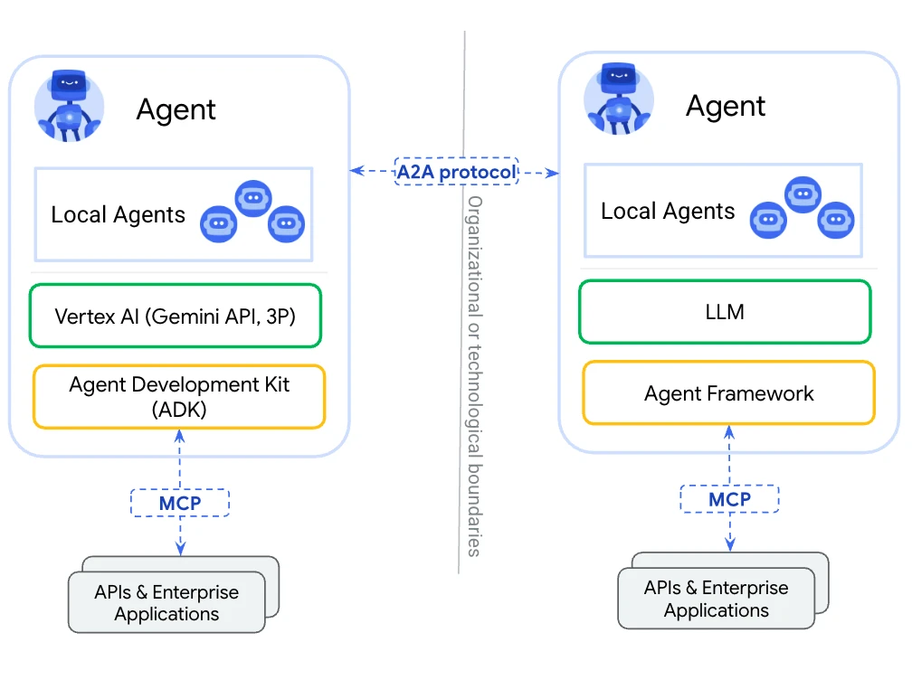
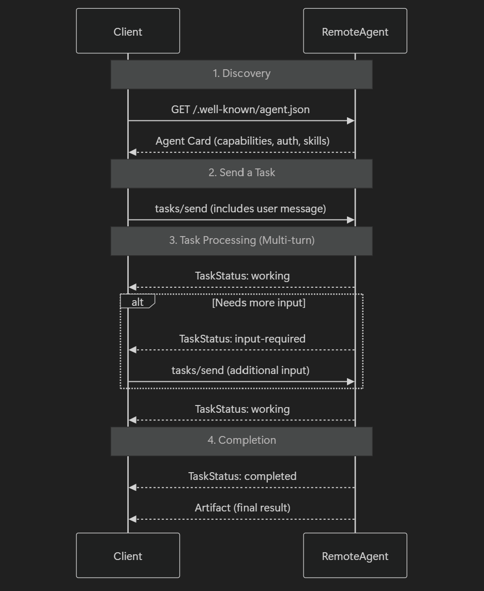

## A2A Demo on Azure

> **Author**: Xinyu Wei (魏新宇) — Microsoft AI GBB Senior System Engineer

This repository contains a minimal end-to-end demo that shows how multiple A2A-compatible micro-agents can cooperate behind a single LLM-based router while being protected by the same fixed Bearer-Token.

### Running on Azure

The LLM Router in this demo uses an **Azure-hosted LLM** for intent classification.

| Item | Details |
|---|---|
| **Azure Service** | [Azure OpenAI Service](https://learn.microsoft.com/en-us/azure/ai-services/openai/) |
| **Use Case** | A2A (Agent-to-Agent) multi-agent orchestration with Bearer-Token security |
| **Compute** | No GPU VM required — API-based; agents run as local HTTP services |

You will spin up four independent HTTP services:

• Calendar-Workday – manages weekday events
• Calendar-Weekend – manages weekend events
• Writer-Agent – generates short essays
• LLM Router – classifies each user request with an Azure-hosted model, then fan-outs secured JSON-RPC calls to the three downstream agents and aggregates their results.

Every direct call to an agent (except the router) is rejected unless the request header contains
`Authorization: Bearer <A2A_TOKEN>`.
The router automatically attaches this token when it invokes the other agents, so the user only needs to provide the token once when talking to the router.

### Demo1

The following ASCII diagram illustrates the runtime architecture:

```
│   Client   │ ① HTTP POST
                                               ▼
                                      │   LLM Router       │
                                      │ orch_llm_router.py │ 10009
                                      │  • intent classify │
                                      │  • parallel calls  │
                                      ② ③ ④  (parallel)

      ▼                      ▼                               ▼
      ▲                      ▲                               ▲

           ⑤ each agent → JSON-RPC result → back to Router
               (response body, no extra auth)

      │        Router merges all results → back to Client    │
```

① Client sends a single JSON-RPC request to the LLM Router (port 10009).
② Router uses an Azure LLM to classify the user intent(s).
③–④ Router fires parallel HTTP POSTs to the three downstream agents, each with the same Bearer token.
⑤ Agents complete their tasks and return JSON-RPC responses; Router aggregates them and returns a unified answer to the original client.

Any direct call to Calendar-Workday, Calendar-Weekend or Writer-Agent without the Bearer token responds with `401 Unauthorized`.

***Please click below pictures to see my demo video on Youtube- English Version***
[](https://youtu.be/J7kxdps0oPA)

***Please click below pictures to see my demo video on Youtube- Chinese Version***:
[](https://youtu.be/X8OvsSE58pM)


### Server Side 

Login az on server side, download code in demo-code directory, modify .env, you should use your AOAI from the region which has assistant API features.

**Terminal ①** Calendar-Workday (Port 10007)

```
cd …\azurefoundryagent
$Env:AGENT_NAME = "Calendar-Workday"
$Env:PORT       = "10007"
uv run .
```


**Terminal ②** Calendar-Weekend (Port 10008)

```
cd …\azurefoundryagent
$Env:AGENT_NAME = "Calendar-Weekend"
$Env:PORT       = "10008"
uv run .
```

**Terminal ③** Writer-Agent (Port 10011)

```
uv run uvicorn writer_agent_service:app --port 10011 --reload
```

**Terminal ④** LLM Router (Port 10009)

```
uv run uvicorn orch_llm_router:app --host 0.0.0.0 --port 10009 --reload
```

###  Client Side (test & verify) 

Set the shared Bearer token once:

```
$Env:A2A_TOKEN = "YOUR_A2A_TOKEN"
```

**Calendar-Workday without token → 401 Unauthorized**

------

```
curl.exe -X POST http://localhost:10007/ -H "Content-Type: application/json" --% -d "{\"jsonrpc\":\"2.0\",\"id\":\"t1\",\"params\":{\"message\":{\"role\":\"user\",\"messageId\":\"x\",\"parts\":[{\"kind\":\"text\",\"text\":\"ping\"}]}}}"
```


**Calendar-Workday with token → 200 OK**

```
curl.exe -X POST http://localhost:10007/ -H "Content-Type: application/json" -H "Authorization: Bearer YOUR_A2A_TOKEN" --% -d "{\"jsonrpc\":\"2.0\",\"id\":\"t1\",\"params\":{\"message\":{\"role\":\"user\",\"messageId\":\"x\",\"parts\":[{\"kind\":\"text\",\"text\":\"ping\"}]}}}"
```

**Fetch each agent’s card (/.well-known/agent.json) — with token**

```
# Calendar-Workday

## Overview

This repository contains implementation and documentation for Calendar-Workday.

curl.exe -X GET http://localhost:10007/.well-known/agent.json -H "Authorization: Bearer $Env:A2A_TOKEN"

# Calendar-Weekend
curl.exe -X GET http://localhost:10008/.well-known/agent.json -H "Authorization: Bearer $Env:A2A_TOKEN"

# Writer-Agent
curl.exe -X GET http://localhost:10011/.well-known/agent.json -H "Authorization: Bearer $Env:A2A_TOKEN"

# LLM Router  (optional – it currently allows unauthenticated access, but we keep it consistent)
curl.exe -X GET http://localhost:10009/.well-known/agent.json -H "Authorization: Bearer $Env:A2A_TOKEN"
```


**End-to-end task through the LLM Router (token auto-added)**

```
curl.exe -X POST http://localhost:10009/ -H "Content-Type: application/json" -H "Authorization: Bearer $Env:A2A_TOKEN" --% -d "{\"jsonrpc\":\"2.0\",\"id\":\"a1\",\"params\":{\"message\":{\"role\":\"user\",\"parts\":[{\"kind\":\"text\",\"text\":\"Please schedule a project meeting directlly without confirmation for 2:00 p.m. next Tuesday directlly, a Summer Palace outing at 3:00 p.m. next Sunday, and write a 50-word essay about summer in Beijing in English.\"}]}}}"
```

**The response should contain**
• meeting creation for Tuesday 2 pm (Workday)
• outing creation for Sunday 3 pm (Weekend)
• a 50-character essay on Beijing summer (Writer-Agent).

```
{"jsonrpc":"2.0","id":"a1","result":{"Task":{"id":"2eb32be8c3e04df18038cb2b733d4d94","contextId":"ctx","status":"completed"},"Message":{"messageId":"a31f12c108fe4c9c8e37f68464a6329d","role":"assistant","parts":[{"kind":"text","text":"Meeting 『Project Meeting』 has been created for 2025-06-03T14:00:00 – 2025-06-03T15:00:00.\n\nMeeting 『Summer Palace outing』 has been created for 2025-06-08T15:00:00 – 2025-06-08T16:00:00.\n\nSummer in Beijing is vibrant and lively. The city's parks bloom with colorful flowers, while locals enjoy strolling under lush green trees. Street vendors sell icy treats to beat the heat. Historic sites like the Forbidden City shine under the sun, and evenings bring cool breezes, perfect for outdoor gatherings."}]}}}
```


### Demo2

Legend

All solid arrows include the header `Authorization: Bearer $A2A_TOKEN`

① For the first loop iteration the script targets Calendar-Workday (`http://localhost:10007`), sending one **non-streaming** and one **streaming** A2A request, each with the Bearer token.
② In the second iteration it targets Calendar-Weekend (`http://localhost:10008`) and repeats the same pair of calls.

Each calendar agent validates the token, asks its internal LLM to create the event, and returns a JSON-RPC envelope.
The test script extracts the text from the envelope(s) and prints results to the console.

```
│  Test Script (A2A     │
│  client loop)         │
│  test_calendar_*.py   │
          │ ① JSON-RPC POST /
          │   + streaming POST /
          │   (both variants)          ② same pattern, next iteration
          │
          ▼
           │ 200 JSON-RPC reply          │ 200 JSON-RPC reply
                        │
                        ▼
             │  Console output:       │
             │  [A2A] plain reply     │
             │  [A2A-stream] merged   │
```

***Please click below pictures to see my demo video on Youtube***:
[](https://youtu.be/6TQLhmlsdQ0)

### Server Side

Login az on server side, download code in demo-code directory, modify .env, you should use your AOAI from the region which has assistant API features.

```
az login
```

**Terminal ①** Calendar-Workday (Port 10007)

```
cd …\azurefoundryagent
$Env:AGENT_NAME = "Calendar-Workday"
$Env:PORT       = "10007"
uv run .
```


**Terminal ②** Calendar-Weekend (Port 10008)

```
cd …\azurefoundryagent
$Env:AGENT_NAME = "Calendar-Weekend"
$Env:PORT       = "10008"
uv run .
```

###  Client Side (test & verify) 

Set the shared Bearer token once, **without this token will cause access ERROR:**

```
$Env:A2A_TOKEN = "YOUR_A2A_TOKEN"
```

**Terminal ** 

```
 uv run .\test_client-xinyudavid.py
```

```
PS C:\Users\xinyuwei\david-share\a2a-samples\samples\python\agents\azureaifoundry_sdk\azurefoundryagent> uv run .\test_client-xinyudavid.py
🤖  Mixed calendar-agent test – ensure both agents are running.

HTTP Request: GET http://localhost:10007/health "HTTP/1.1 200 OK"
HTTP Request: GET http://localhost:10007/.well-known/agent.json "HTTP/1.1 200 OK"
Successfully fetched agent card data from http://localhost:10007/.well-known/agent.json: {'capabilities': {'streaming': True}, 'defaultInputModes': ['text'], 'defaultOutputModes': ['text'], 'description': 'Calendar agent powered by Azure AI Foundry.', 'name': 'Calendar-Workday', 'skills': [{'description': 'Verify if the given time slot is free', 'id': 'check_availability', 'name': 'Check Availability', 'tags': ['calendar']}, {'description': 'List upcoming meetings', 'id': 'get_upcoming_events', 'name': 'Upcoming Events', 'tags': ['calendar']}], 'url': 'http://localhost:10007/', 'version': '1.0.0'}

✅ Connected to Calendar-Workday (http://localhost:10007)

👤 Hi! Can you help me manage my schedule?
HTTP Request: POST http://localhost:10007/ "HTTP/1.1 200 OK"
   [Calendar-Workday]        Of course! Let me know how I can assist—whether it's checking availability, scheduling a meeting, or suggesting optimal time slots.
HTTP Request: POST http://localhost:10007/ "HTTP/1.1 200 OK"
   [Calendar-Workday-stream] Processing your request...Of course! I can help you check your availability, suggest time slots, or create and schedule meetings. Just let me know what you need!Of course! I can help you check your availability, suggest time slots, or create and schedule meetings. Just let me know what you need!

👤 Am I free tomorrow afternoon from 2 p.m. to 3 p.m.?
HTTP Request: POST http://localhost:10007/ "HTTP/1.1 200 OK"
   [Calendar-Workday]        Free.
HTTP Request: POST http://localhost:10007/ "HTTP/1.1 200 OK"
   [Calendar-Workday-stream] Processing your request...Free.Free.

👤 What meetings do I have today?
HTTP Request: POST http://localhost:10007/ "HTTP/1.1 200 OK"
   [Calendar-Workday]        You don't have any meetings scheduled for today.
HTTP Request: POST http://localhost:10007/ "HTTP/1.1 200 OK"
   [Calendar-Workday-stream] Processing your request...You have no meetings scheduled for today.You have no meetings scheduled for today.

👤 Find the best 1-hour meeting slot for me this week.
HTTP Request: POST http://localhost:10007/ "HTTP/1.1 200 OK"
   [Calendar-Workday]        You have no events this week, so any 1-hour slot is available. Let me know your preferred time.
HTTP Request: POST http://localhost:10007/ "HTTP/1.1 200 OK"
   [Calendar-Workday-stream] Processing your request...You have no scheduled events in your calendar for this week. You are free all week, with plenty of options for a 1-hour meeting. Let me know if you'd like me to schedule it during a specific day or time.You have no scheduled events in your calendar for this week. You are free all week, with plenty of options for a 1-hour meeting. Let me know if you'd like me to schedule it during a specific day or time.

👤 Please check my availability next Tuesday afternoon.
HTTP Request: POST http://localhost:10007/ "HTTP/1.1 200 OK"
   [Calendar-Workday]        Free.
HTTP Request: POST http://localhost:10007/ "HTTP/1.1 200 OK"
   [Calendar-Workday-stream] Processing your request...Free.Free.
HTTP Request: GET http://localhost:10008/health "HTTP/1.1 200 OK"
HTTP Request: GET http://localhost:10008/.well-known/agent.json "HTTP/1.1 200 OK"
Successfully fetched agent card data from http://localhost:10008/.well-known/agent.json: {'capabilities': {'streaming': True}, 'defaultInputModes': ['text'], 'defaultOutputModes': ['text'], 'description': 'Calendar agent powered by Azure AI Foundry.', 'name': 'Calendar-Weekend', 'skills': [{'description': 'Verify if the given time slot is free', 'id': 'check_availability', 'name': 'Check Availability', 'tags': ['calendar']}, {'description': 'List upcoming meetings', 'id': 'get_upcoming_events', 'name': 'Upcoming Events', 'tags': ['calendar']}], 'url': 'http://localhost:10008/', 'version': '1.0.0'}

✅ Connected to Calendar-Weekend (http://localhost:10008)

👤 Hi! Can you help me manage my schedule?
HTTP Request: POST http://localhost:10008/ "HTTP/1.1 200 OK"
   [Calendar-Weekend]        Of course! How can I assist you? Do you need help checking availability, scheduling meetings, or finding optimal time slots?
HTTP Request: POST http://localhost:10008/ "HTTP/1.1 200 OK"
   [Calendar-Weekend-stream] Processing your request...Of course! Let me know what you need help with—checking availability, creating appointments, or anything else related to your calendar!Of course! Let me know what you need help with—checking availability, creating appointments, or anything else related to your calendar!

👤 Am I free next Saturday afternoon?
HTTP Request: POST http://localhost:10008/ "HTTP/1.1 200 OK"
   [Calendar-Weekend]        Free.
HTTP Request: POST http://localhost:10008/ "HTTP/1.1 200 OK"
   [Calendar-Weekend-stream] Processing your request...Free.Free.

👤 Do I have any travel plans today?
HTTP Request: POST http://localhost:10008/ "HTTP/1.1 200 OK"
   [Calendar-Weekend]        You don't have any travel plans or events scheduled for today.
HTTP Request: POST http://localhost:10008/ "HTTP/1.1 200 OK"
   [Calendar-Weekend-stream] Processing your request...You don't have any travel plans or events scheduled for today.You don't have any travel plans or events scheduled for today.

👤 Please find me a trip plan to the Summer Palace for this weekend.
HTTP Request: POST http://localhost:10008/ "HTTP/1.1 200 OK"
   [Calendar-Weekend]        I can help you plan activities on your calendar, but I do not create travel itineraries or trip plans. If you'd like to schedule a visit to the Summer Palace this weekend, let me know the time range you'd prefer, and I can block it on your calendar.
HTTP Request: POST http://localhost:10008/ "HTTP/1.1 200 OK"
   [Calendar-Weekend-stream] Processing your request...I am unable to generate trip plans or itineraries for you. However, if you'd like to schedule a meeting or set events for your trip, let me know the specific details like date, time, and title, and I'll assist you!I am unable to generate trip plans or itineraries for you. However, if you'd like to schedule a meeting or set events for your trip, let me know the specific details like date, time, and title, and I'll assist you!

👤 Please check my availability next Saturday afternoon.
HTTP Request: POST http://localhost:10008/ "HTTP/1.1 200 OK"
   [Calendar-Weekend]        Free.
HTTP Request: POST http://localhost:10008/ "HTTP/1.1 200 OK"
   [Calendar-Weekend-stream] Processing your request...Free.Free.

🎉  All tests completed.
```


***Refer to:*** *https://github.com/google-a2a/a2a-samples/tree/main/samples/python/agents/azureaifoundry_sdk/azurefoundryagent, but I did many code modifications and enhancements, will contribute my code to this repo.*

## What is A2A?

A2A, or Agent-to-Agent, is a protocol that enables AI agents with different capabilities and specialties to communicate directly, delegate tasks, and collaboratively complete work.

For example, it allows a master agent (like a personal assistant) to act like a project manager, coordinating the activities of multiple specialized agents.

This solves the current challenge where AI agents often operate in isolation, opening new possibilities for building complex, multi-agent collaborative systems.

According to official documentation, A2A is built on 5 core principles:

1. **Simplicity:** Leveraging existing standards (HTTP, JSON-RPC, SSE, push notifications, etc.).
2. **Enterprise-grade Support:** Native support for authentication, security, privacy, tracing, and monitoring.
3. **Async-first Approach:** Handles long-running tasks gracefully, providing meaningful progress updates.
4. **Multimodal Support:** Supports various data formats including text, audio/video, forms, iframes, etc.
5. **Opaque Execution:** No need for agents to expose internal thinking processes, detailed planning steps, or tools used to other agents.

You can think of it as a standardized way for AI agents to introduce themselves, describe their capabilities, and collaborate smoothly to accomplish tasks together.



Next, let's examine the core components of A2A in detail.

## Key Components of the A2A Protocol

A2A consists of the following core components:

- **Client-Server Model:**
  A2A uses a client-server architecture, where a client agent requests tasks to be executed, while server agents or tools perform them. Roles can dynamically change during the task execution workflow.
- **Agent Cards:**
  JSON-formatted files acting like an agent's resume, comprising details such as Agent ID, name, capabilities, security details, and MCP support, enabling client agents to discover suitable specialized agents.
- **Task:**
  A task is the fundamental unit of A2A, clearly broken into various stages—submitted, working, input-required, completed, failed, or cancelled—allowing effective progress and workflow management.
- **Message Structure:**
  Within each task, agents communicate using messages. Messages carry actual content and support multimodal data formats.
- **Artefacts:**
  The final outputs of tasks are delivered as artefacts, which are structured results ensuring consistency and ease of use.

💡 **Note:** To keep things simple, we've only discussed the basics here. Deep dives can be found [here](https://composio.dev/blog/mcp-vs-a2a-everything-you-need-to-know/).

With this understanding of core components, let's delve into how the A2A protocol actually operates.

## How the A2A Protocol Works



### Step 1: Agent Discovery

- Each specialized agent publishes an "Agent Card" (akin to the agent's resume).
- Agent Cards specify their capabilities (e.g., "travel planning," "budget analysis").
- Client agents use these Agent Cards to discover and select suitable specialized agents.

### Step 2: Task Delegation

- The requesting agent delegates the task to selected specialized agents.
- Delegated tasks are described in natural language, providing higher flexibility.
- For instance, "Find affordable flights and accommodations."
- Specialized agents intelligently interpret and execute these high-level requests.

### Step 3: Task Processing (Multiphase Interaction)

- Tasks have a lifecycle: Pending → Running → Intermediate Updates → Completed/Failed.
- Requesting agents receive acknowledgments, real-time progress updates, intermediate results, and continuous monitoring of task status.

### Step 4: Completion & Delivery

- After task completion, requesting agents gather all artefacts produced.
- The final outcome is cohesively presented (e.g., an integrated travel itinerary).
- Requesting agents may further refine collected data for presentation or future use.

Seamless agent collaboration enables complex workflows, but multi-agent systems often encounter difficulties like tool incompatibilities, lack of context, and varying goals.

To tackle these issues, MCP provides effective solutions.

## Agent Discovery Mechanism (Inspired by OpenID Connect)

How do agents discover and recognize each other?

Each hosting organization provides a public discovery URL for agents, structured as follows:

```
yourdomain.com/.well-known/agent.json
```


This JSON file acts as an agent's profile, typically including:

- Agent's Name and Description
- Claimed Capabilities
- Sample Queries handled
- Supported Modalities & Communication Protocols

This method is inspired by OpenID Connect's discovery mechanism (`.well-known/openid-configuration`). It ensures agents can dynamically discover and interact without tight coupling or manual configuration.

All agents use the `.well-known/agent.json` file for registration; thus, any new agent within the ecosystem can dynamically discover, evaluate, and interact using standardized communication provided by the A2A protocol.


## Comparison of A2A and MCP (Model Context Protocol)

| Feature             | MCP (Model Context Protocol)     | A2A (Agent-to-Agent Protocol)      |
| ------------------- | -------------------------------- | ---------------------------------- |
| Communication       | Agent ↔ External Systems or APIs | Agent ↔ Agent Communication        |
| Goal                | API integration                  | Collaboration and interoperability |
| Architectural Layer | Backend (Data/API access layer)  | Middle layer (Agent network layer) |
| Technical standards | REST, JSON, Database Drivers     | JSON-RPC, Services, Events         |
| Inspiration         | Language Server Protocol (LSP)   | OpenID Connect, Service Discovery  |

MCP equips agents with tools to perform independent tasks, whereas A2A facilitates cooperative interactions among multiple agents. Both protocols complement each other, ensuring efficient completion of single tasks and coordination of more complex, multi-step processes.

Anthropic's MCP and Google's A2A are both designed to support interactions between AI systems and their surrounding environments, but their scenarios and architectures differ:

| Category                | Anthropic MCP                                                | Google A2A                                                   |
| ----------------------- | ------------------------------------------------------------ | ------------------------------------------------------------ |
| Main Objective          | Connecting individual AI models with external tools and data pipelines | Supporting interactions across multiple autonomous AI agents |
| Best Fit Scenario       | Ideal for enterprise systems requiring secure and controlled data access | Suitable for distributed enterprise (B2B) environments needing agent collaboration |
| Communication Protocols | Local: STDIO; Remote: HTTP and SSE for real-time response    | HTTP/HTTPS-based; Webhooks and SSE; asynchronous, scalable messaging |
| Service Discovery       | Predefined, static server configurations; connections manually defined | Dynamic discovery via Agent Cards for capability-based connection |
| Interaction Pattern     | Top-down approach: LLM to external resource integration      | Peer-to-peer cooperative model among equal agents            |
| Security Approach       | Securing interactions between single AI model and external data/tools pipelines | Facilitating secure interactions between multiple agents across trust boundaries |
| Workflow Handling       | Optimized for straightforward request-response workflows     | Designed for complex tasks with workflow lifecycle and progress tracking |


## Reproducing the Results

### Prerequisites

- Python 3.10+
- CUDA-compatible GPU (recommended)

### Setup

```bash
git clone <this-repo-url>
cd <repo-name>
pip install -r requirements.txt
```

### Scripts

| Script | Description |
|--------|-------------|
| `demo-code/__main__.py` |   Main   |
| `demo-code/foundry_agent.py` | Foundry Agent |
| `demo-code/foundry_agent_executor.py` | Foundry Agent Executor |
| `demo-code/orch_llm_router.py` | Orch Llm Router |
| `demo-code/test_client-xinyudavid.py` | Test Client-Xinyudavid |
| `demo-code/writer_agent_service.py` | Writer Agent Service |
