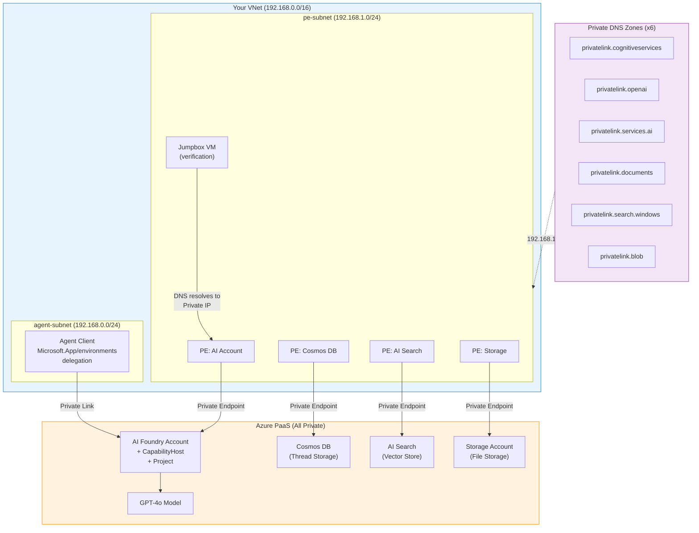

# Azure AI Foundry Agent Service — BYO VNET Deployment & Verification

[](https://learn.microsoft.com/en-us/azure/foundry/agents/)
[-107c10)](https://learn.microsoft.com/en-us/azure/foundry/agents/how-to/virtual-networks)
[](https://github.com/microsoft-foundry/foundry-samples/tree/main/infrastructure/infrastructure-setup-bicep/15-private-network-standard-agent-setup)
[](LICENSE)

> **作者**: 魏新宇 (Xinyu Wei) — 微软 AI GBB 高级系统工程师

中文版 | [English](README.md)

---

端到端验证 Azure AI Foundry Agent Service 的 BYO VNET 部署。覆盖部署脚本、验证工具、三类子网穷举测试、常见踩坑记录，以及 Account / Project / Prompt Agent / Hosted Agent 的网络隔离层级分析。

### Running on Azure

| Resource | Purpose | SKU |
|----------|---------|-----|
| Microsoft Foundry Account | Agent orchestration + CapabilityHost | S0 (AIServices) |
| Azure Cosmos DB | Thread / conversation storage | GlobalDocumentDB |
| Azure AI Search | Vector store | Standard |
| Azure Storage | File storage | StorageV2 (ZRS/GRS) |
| Virtual Network | BYO VNET with 2 subnets | — |
| Private Endpoints × 4 | Foundry + Cosmos + Search + Storage | — |
| Private DNS Zones × 6 | DNS resolution to private IPs | — |

## 关键发现

### Subnet Class Verification (Exhaustive Testing in Korea Central)

All three RFC 1918 private address classes were tested:

| Class | Subnet Range | Result | CapabilityHost | Error Message |
|:-----:|-------------|:------:|:--------------:|---------------|
| **A** | `10.0.0.0/24` | ❌ **Rejected** | ❌ Failed | `"Provided subnet must be of the proper address space. Please provide a subnet which has address space in the range of 172 or 192."` |
| **B** | `172.16.0.0/24` | ✅ **Succeeded** | ✅ Succeeded | — |
| **C** | `192.168.0.0/24` | ✅ **Succeeded** | ✅ Succeeded | — |

### End-to-End Verification (Sweden Central)

| Test | Result |
|------|:------:|
| BYO VNET deployment (Class C) | ✅ All 16 sub-deployments Succeeded |
| DNS → Private IP from inside VNet | ✅ `192.168.1.8` |
| Agent creation via API through Private Link | ✅ Agent created successfully |

> **Conclusion**: BYO VNET Agent Service works with Class B (`172.16.x.x`) and Class C (`192.168.x.x`) in all supported regions. Class A (`10.x.x.x`) is only available in **18 specific regions** (see [Class A Region Whitelist](#class-a-region-whitelist) below). If your enterprise network requires Class A in a non-supported region, consider creating a dedicated `172.16.x.x` VNet and peering it with your existing `10.x.x.x` hub.

### Class A Region Whitelist

Class A (`10.x.x.x`) is **not universally supported**. It only works in the following 18 regions. All other regions (including Korea Central, East Asia, Southeast Asia, North Europe, Central US, West Europe) must use Class B or C.

| # | Region | # | Region |
|:-:|--------|:-:|--------|
| 1 | Australia East | 10 | South Africa North |
| 2 | Brazil South | 11 | South Central US |
| 3 | Canada East | 12 | South India |
| 4 | East US | 13 | Spain Central |
| 5 | East US 2 | 14 | Sweden Central |
| 6 | France Central | 15 | UAE North |
| 7 | Germany West Central | 16 | UK South |
| 8 | Italy North | 17 | West US |
| 9 | Japan East | 18 | West US 3 |

Source: [official template Limitations #3](https://github.com/microsoft-foundry/foundry-samples/tree/main/infrastructure/infrastructure-setup-bicep/15-private-network-standard-agent-setup), commit af94c90 (2026-06-03)

> **Enterprise workaround**: For regions not on the whitelist (e.g., Korea Central), create a dedicated `172.16.x.x` VNet for Agent Service, then **VNet Peer** it with your existing `10.x.x.x` hub/landing zone.

---

## 架构



---

## 快速开始

### 前提条件

```bash
# 1. Login to Azure
az login

# 2. Register required resource providers (one-time)
./scripts/deploy.sh --register-providers

# 3. Clone the official template
git clone https://github.com/microsoft-foundry/foundry-samples.git
```

### 部署

```bash
# 部署
./scripts/deploy.sh \
  --region swedencentral \
  --name myagent \
  --resource-group rg-agent-sweden \
  --template-dir foundry-samples/infrastructure/infrastructure-setup-bicep/15-private-network-standard-agent-setup

# 部署
./scripts/deploy.sh \
  --region koreacentral \
  --name kragent \
  --resource-group rg-agent-korea \
  --model gpt-4o-mini \
  --sku GlobalStandard \
  --template-dir foundry-samples/infrastructure/infrastructure-setup-bicep/15-private-network-standard-agent-setup
```

### Verify (from inside VNet)

```bash
# 部署
./scripts/verify.sh \
  --resource-group rg-agent-sweden \
  --vnet-name agent-vnet \
  --account-name <your-account-name>
```

### Cleanup

```bash
./scripts/cleanup.sh \
  --resource-group rg-agent-sweden \
  --account-name <your-account-name> \
  --region swedencentral
```

> ⚠️ **Cost warning**: AI Search Standard SKU costs ~$8/day. Delete resources promptly after testing.

### 结果

The following are actual outputs from independent deployment drills:

**Drill 1 — Sweden Central, Class C (end-to-end with jumpbox)**:
```
<your-resource>.cognitiveservices.azure.com -> 192.168.1.8 [PRIVATE]
<your-resource>.openai.azure.com -> 192.168.1.9 [PRIVATE]
Token: OK
Create Agent: HTTP 200
ID: asst_URPw1iZyFgpFGAcECD2ahQVM
ALL TESTS PASSED
```

**Drill 2 — Korea Central, Class C (deployment verification)**:
```
All 16 sub-deployments Succeeded (including CapabilityHost)
VNet: 192.168.0.0/24 (agent-subnet) + 192.168.1.0/24 (pe-subnet)
Private Endpoints: 4/4 Succeeded
Private DNS Zones: 6/6 Configured
```

**Drill 3 — Korea Central, Class A (falsification test)**:
```
CapabilityHost: FAILED
Error: "Provided subnet must be of the proper address space.
        Please provide a subnet which has address space in the range of 172 or 192."
VNet: 10.0.0.0/24 — created successfully
AI Account — FAILED at CapabilityHost creation
```

**Drill 4 — Korea Central, Class B (exhaustive verification)**:
```
All 16 sub-deployments Succeeded (including CapabilityHost)
VNet: 172.16.0.0/24 (agent-subnet) + 172.16.1.0/24 (pe-subnet)
main: Succeeded
```

**Bugs found and fixed during testing**:
| Bug | Root Cause | Fix |
|-----|-----------|-----|
| `deploy.sh` quota check matched too many models | Fuzzy string match | Changed to exact match `name == f'OpenAI.{sku}.{model}'` |
| `verify.sh` Agent creation returned 401 PermissionDenied | `Cognitive Services Contributor` lacks `assistants/write` data action | Added `Cognitive Services OpenAI Contributor` role at Account scope |

---

## 故障排除

| Scenario | Template | Typical Result | Root Cause & Fix |
|----------|---------|:--------------:|-----------------|
| **Community/3rd-party Bicep template** | Non-official | Agent creation fails — missing permissions | RBAC roles not auto-assigned. Switch to [official template](https://github.com/microsoft-foundry/foundry-samples/tree/main/infrastructure/infrastructure-setup-bicep/15-private-network-standard-agent-setup) + ensure `Owner` or `RBAC Administrator` |
| **Official BYO VNET** | `15-private-network-standard-agent-setup` | ✅ Succeeds | Recommended path for production |
| **Official Managed VNET (Preview)** | `18-managed-virtual-network-preview` | ❌ `InternalServerError` on Project connections | Preview product bug — connections to AI Search/Cosmos DB fail even with feature flag registered |

---

## Common Deployment Pitfalls

| # | Pitfall | Symptom | Fix |
|:-:|---------|---------|-----|
| 1 | **Quota exhaustion** | Model deployment fails silently | Check quota first: `az cognitiveservices usage list --location <region>` |
| 2 | **Resource Provider not registered** | CapHost creation fails | Run `./scripts/deploy.sh --register-providers` |
| 3 | **Orphaned CapabilityHost** | "Invalid vnet resource ID" on redeployment | Must **delete AND purge** the Cognitive Services account |
| 4 | **Storage account naming** | "not a valid storage account name" | Keep `--name` short (≤10 chars), lowercase, no hyphens |
| 5 | **Subnet already in use** | Deployment blocked | Each Foundry resource needs exclusive agent subnet. Purge previous accounts |

---

## Region & Subnet Class Support

Per the [official template](https://github.com/microsoft-foundry/foundry-samples/tree/main/infrastructure/infrastructure-setup-bicep/15-private-network-standard-agent-setup):

| Subnet Class | IP Range | GA Regions |
|:------------:|----------|-----------|
| **A** | `10.0.0.0/8` | **18 regions only** (whitelist — see [Class A Region Whitelist](#class-a-region-whitelist) above). Not supported in Korea Central, East Asia, Southeast Asia, North Europe, Central US, West Europe, and all other unlisted regions. |
| **B** | `172.16.0.0/12` | **All Agent Service regions** |
| **C** | `192.168.0.0/16` | **All Agent Service regions** |

Source: [official template Limitations #3](https://github.com/microsoft-foundry/foundry-samples/tree/main/infrastructure/infrastructure-setup-bicep/15-private-network-standard-agent-setup) (2026-06-03)

> For enterprises using `10.x.x.x` in a non-Class-A region: create a dedicated `172.16.x.x` VNet for Agent Service and peer it with your existing `10.x.x.x` hub VNet.

---

## Control Plane Rate Limit

Concurrent stress testing revealed an **undocumented Control Plane rate limit** on the Assistants API:

| Operation | Concurrency | Result |
|-----------|:-----------:|--------|
| CREATE Agent | 10/25/50/100 | ✅ All succeeded (0 rejects at 100 concurrent) |
| **LIST Agents** | **100 threads × 200 calls** | **❌ 72/200 rejected (429)** |

**LIST operations are rate-limited at ~128 RPM with `Retry-After: 59s`** (1-minute window). CREATE operations showed no limit up to 100 concurrent requests.

**Impact**: Applications that frequently poll the LIST API (e.g., Portal UI with 100+ concurrent users) will hit 429 errors.

**Mitigations**:
1. Reduce polling frequency in custom clients
2. Spread users across multiple Projects
3. Implement exponential backoff with jitter

---

## Tool Support Under Network Isolation

Per [MS Learn](https://learn.microsoft.com/en-us/azure/foundry/how-to/configure-private-link) (updated 2026-06-05, source dated 2026-05-26):

| Tool | VNET Support | Traffic Flow |
|------|:------------:|-------------|
| MCP Tool (Private) | ✅ | Through VNet subnet |
| Azure AI Search | ✅ | Through private endpoint |
| Code Interpreter | ⚠️ Partial | Microsoft backbone. Works without files. File upload/download not supported; use SDK to create a container with required files and pass `container_id` as workaround |
| Function Calling | ✅ | Microsoft backbone |
| Bing Grounding | ✅ | Public endpoint |
| Websearch | ✅ | Public endpoint |
| SharePoint Grounding | ✅ | Public endpoint |
| Foundry IQ (Preview) | ✅ | Via MCP |
| OpenAPI tool | ✅ | Through VNet subnet |
| Azure Functions | ✅ | Through VNet subnet |
| Agent-to-Agent (A2A) | ✅ | Through VNet subnet |
| File Search | ❌ | Under development |
| Browser Automation | ❌ | Under development |
| Computer Use | ❌ | Under development |
| Image Generation | ❌ | Under development |
| Logic Apps | ❌ | Under development |
| Fabric Data Agent | ❌ | Fabric resource must have public network access enabled |
| Workflow Agents | ⚠️ Partial | Inbound only; outbound VNET injection not supported |

> **Template 19**: For tools behind VNET (MCP, OpenAPI, Azure Functions, A2A), use [template 19 — private-network-agent-tools](https://github.com/microsoft-foundry/foundry-samples/tree/main/infrastructure/infrastructure-setup-bicep/19-private-network-agent-tools) instead of template 15.

---

## Network Isolation Scope

Network isolation in Foundry operates at **three distinct levels**. Understanding which level controls what is critical for architecture design:

| Level | What it controls | Key facts |
|-------|-----------------|----------|
| **Foundry Account** | VNET injection (subnet delegation) | The `agent-subnet` is delegated to `Microsoft.App/environments` at the **Account** level via CapabilityHost. Once configured, every Project and every Agent under this Account inherits the same VNET. "Network injection is account-scoped, not project-scoped." — [official template docs](https://github.com/microsoft-foundry/foundry-samples/tree/main/infrastructure/infrastructure-setup-bicep/15-private-network-standard-agent-setup) |
| **Foundry Project** | Data isolation | "Agents in one project cannot access resources from another. Projects are currently the unit of sharing and isolation in Foundry." Each Project gets its own Cosmos DB containers (`<projectId>-thread-message-store`, etc.) and Storage containers. — [official template docs, Core Components](https://github.com/microsoft-foundry/foundry-samples/tree/main/infrastructure/infrastructure-setup-bicep/15-private-network-standard-agent-setup) |
| **Individual Agent** | Nothing (no per-agent isolation) | All agents within the same Project share the same file storage, thread storage, and search indexes. There is no per-agent network boundary or per-agent data boundary. |

### Prompt Agent vs Hosted Agent under VNET

Both agent types support VNET. The network injection applies identically because it is bound to the Account, not to the agent type.

> "The same networking injection for outbound traffic applies for both types of agents you create, prompt and hosted agents."
> — [MS Learn — Outbound network isolation](https://learn.microsoft.com/en-us/azure/foundry/how-to/configure-private-link#deep-dive-into-network-injection-for-agent-service-and-evaluations) (2026-05-26)

| | Prompt Agent | Hosted Agent |
|--|:------------:|:------------:|
| **VNET support** | ✅ | ✅ |
| **How it gets VNET** | Inherits from Account CapabilityHost | Inherits from Account CapabilityHost |
| **Has its own container runtime?** | No (stateless API calls) | Yes (custom container in `Microsoft.App/environments`) |
| **Extra VNET constraints** | None | ① Must configure VNET **at Account creation time** — cannot add later. ② ACR must have **public network access enabled** (private ACR not yet supported). |
| **Reads Skills via** | Toolbox MCP (`resources/read`) | Local files inside container (`skills/*/SKILL.md`) |

Source: [MS Learn — Limitations](https://learn.microsoft.com/en-us/azure/foundry/agents/how-to/virtual-networks#limitations)

### Why VNET injection is Account-scoped

The CapabilityHost resource delegates the `agent-subnet` to `Microsoft.App/environments`. This delegation happens once per Foundry Account. All Projects under that Account share the same delegated subnet. You cannot assign different subnets to different Projects or different Agents.

**Implication for multi-region / multi-tenant architectures**: To achieve network isolation **between** workloads (e.g., domestic vs. overseas), use **separate Foundry Accounts** in separate VNets — not separate Projects under one Account.

### What is shared vs isolated

| Resource | Shared across Projects? | Shared across Agents in same Project? |
|----------|:----------------------:|:------------------------------------:|
| VNet / Subnet | ✅ Shared (Account-level) | ✅ Shared |
| Model deployments | ✅ Shared (Account-level) | ✅ Shared |
| Cosmos DB (threads) | ❌ Per-Project containers | ✅ Shared within Project |
| Storage (files) | ❌ Per-Project containers | ✅ Shared within Project |
| AI Search (vectors) | ❌ Per-Project | ✅ Shared within Project |
| Managed Identity | ❌ Per-Project | ✅ Shared within Project |

Source: [official template docs — Core Components, Limitations #6](https://github.com/microsoft-foundry/foundry-samples/tree/main/infrastructure/infrastructure-setup-bicep/15-private-network-standard-agent-setup)

---

## Template Decision Guide

The official [foundry-samples](https://github.com/microsoft-foundry/foundry-samples) repo provides multiple infrastructure templates. Choose based on your scenario:

| Template | Agent Type | Network | Identity | Use Case |
|:--------:|-----------|---------|----------|----------|
| **15** (this repo) | Standard (BYO resources) | BYO VNet + Private Endpoints | System Assigned MI | E2E network isolation with full agent capabilities |
| **19** | Standard (BYO resources) | BYO VNet + Private Endpoints | System Assigned MI | Same as 15 **plus tools behind VNet** (MCP, OpenAPI, Functions, A2A) |
| **17** | Standard (BYO resources) | BYO VNet + Private Endpoints | User Assigned MI | Same as 15 but with user-managed identity |
| **16** | Standard (BYO resources) | BYO VNet + Private Endpoints | System Assigned MI | Same as 15 plus private APIM integration (preview) |
| **18** | Standard (BYO resources) | Managed VNet (Microsoft-managed) | System Assigned MI | Network isolation without managing your own VNet (preview) |
| **15a** | Evaluation only | BYO VNet + Private Endpoints | System Assigned MI | Minimal setup — no Cosmos DB, AI Search, or CapabilityHost |
| **11** | Basic (platform-managed) | BYO VNet injection | System Assigned MI | Basic agents with VNet isolation — no BYO resources |
| **41** | Standard (BYO resources) | Public (no VNet) | System Assigned MI | Standard agents without network isolation |
| **40** | Basic (platform-managed) | Public (no VNet) | System Assigned MI | Simplest setup — no BYO resources, no private networking |

Source: [official template README](https://github.com/microsoft-foundry/foundry-samples/tree/main/infrastructure/infrastructure-setup-bicep/15-private-network-standard-agent-setup) (2026-06-03)

---

## Managed VNET vs BYO VNET

| | BYO VNET | Managed VNET |
|--|:--------:|:------------:|
| **Status** | **GA** | Public Preview |
| **Recommendation** | ✅ **Production use** | ❌ Not for production |
| **Control** | Full (you own the VNet) | Microsoft-managed (invisible to you) |
| **VNet Peering** | ✅ Supported | ❌ Not possible |
| **Firewall** | Bring your own | Managed |

> **Note**: Our testing of Managed VNET in both Sweden Central and France Central resulted in `InternalServerError` when creating Project connections. This appears to be a Preview-stage product issue, not a configuration error.

---

## Terraform Support

Official Terraform templates are available:

| Template | Type | Link |
|----------|------|------|
| 15b | BYO VNET Standard Agent | [Terraform](https://github.com/microsoft-foundry/foundry-samples/tree/main/infrastructure/infrastructure-setup-terraform/15b-private-network-standard-agent-setup-byovnet) |
| 18 | Managed VNET (Preview) | [Terraform](https://github.com/microsoft-foundry/foundry-samples/tree/main/infrastructure/infrastructure-setup-terraform/18-managed-virtual-network-preview) |

---

## 参考资料

- [Official BYO VNET Template (Bicep) — Template 15](https://github.com/microsoft-foundry/foundry-samples/tree/main/infrastructure/infrastructure-setup-bicep/15-private-network-standard-agent-setup)
- [Tools behind VNET Template (Bicep) — Template 19](https://github.com/microsoft-foundry/foundry-samples/tree/main/infrastructure/infrastructure-setup-bicep/19-private-network-agent-tools)
- [Set up private networking for Foundry Agent Service](https://learn.microsoft.com/en-us/azure/foundry/agents/how-to/virtual-networks)
- [Configure network isolation for Microsoft Foundry](https://learn.microsoft.com/en-us/azure/foundry/how-to/configure-private-link)
- [Configure managed virtual network](https://learn.microsoft.com/en-us/azure/foundry/how-to/managed-virtual-network)
- [Agent Service limits, quotas, and regional support](https://learn.microsoft.com/en-us/azure/foundry/agents/concepts/limits-quotas-regions)
- [Foundry RBAC documentation](https://learn.microsoft.com/en-us/azure/foundry/concepts/rbac-foundry)
- [Private endpoint documentation](https://learn.microsoft.com/en-us/azure/private-link/)
