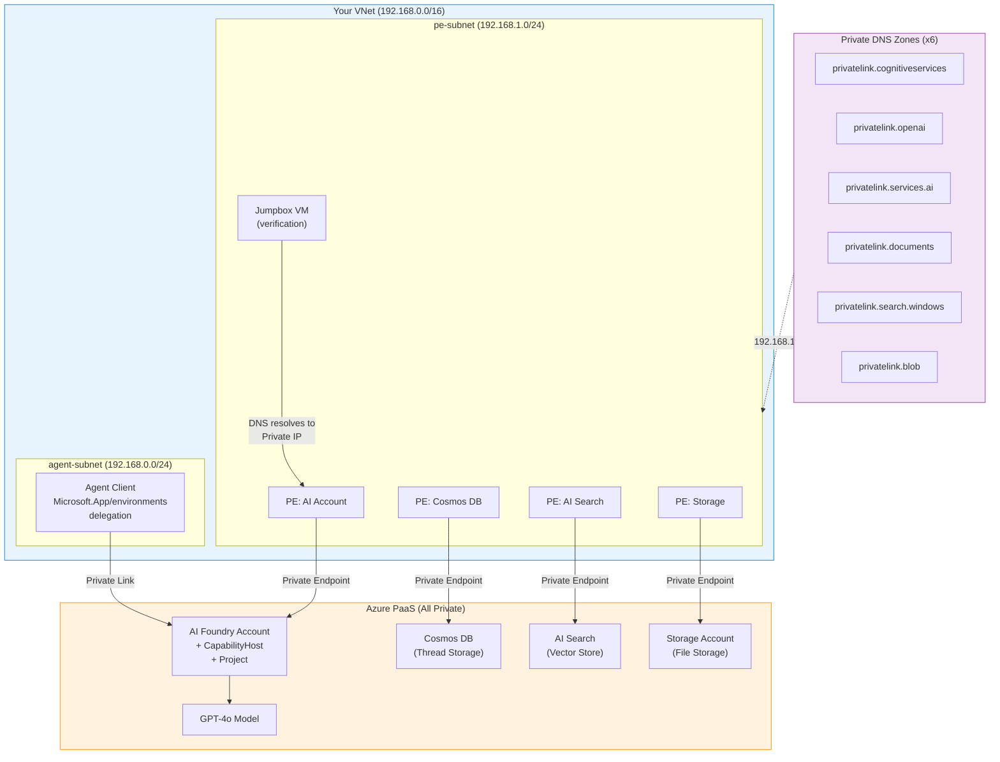

# Azure AI Foundry Agent Service — BYO VNET Deployment & Verification

> **Author**: Xinyu Wei (魏新宇) — Microsoft AI GBB Senior System Engineer


## Overview

This repository contains implementation and documentation for Azure AI Foundry Agent Service — BYO VNET Deployment & Verification.

End-to-end validated deployment of Azure AI Foundry Agent Service with BYO VNET (Bring Your Own Virtual Network) for network isolation. Includes deployment scripts, verification tools, subnet class testing results, and documented pitfalls.

## Key Findings

### Subnet Class Verification (Exhaustive Testing in Korea Central)

All three RFC 1918 private address classes were tested:

| Class | Subnet Range | Result | CapabilityHost | Error Message |
|:-----:|-------------|:------:|:--------------:|---------------|
| **A** | `10.0.0.0/24` | ❌ **Rejected** | ❌ Failed | `"Provided subnet must be of the proper address space. Please provide a subnet which has address space in the range of 172 or 192."` |
| **B** | `172.16.0.0/24` | ✅ **Succeeded** | ✅ Succeeded | — |
| **C** | `192.168.0.0/24` | ✅ **Succeeded** | ✅ Succeeded | — |

### End-to-End Verification (Sweden Central)

| Test | Result |
|------|:------:|
| BYO VNET deployment (Class C) | ✅ All 16 sub-deployments Succeeded |
| DNS → Private IP from inside VNet | ✅ `192.168.1.8` |
| Agent creation via API through Private Link | ✅ Agent created successfully |

> **Conclusion**: BYO VNET Agent Service works with Class B (`172.16.x.x`) and Class C (`192.168.x.x`) in all supported regions. Class A (`10.x.x.x`) is only available in [19 specific regions](https://github.com/microsoft-foundry/foundry-samples/tree/main/infrastructure/infrastructure-setup-bicep/15-private-network-standard-agent-setup). If your enterprise network requires Class A in a non-supported region, consider creating a dedicated `172.16.x.x` VNet and peering it with your existing `10.x.x.x` hub.

---

## Architecture



---

## Quick Start

### Prerequisites

```bash
# 1. Login to Azure
az login

# 2. Register required resource providers (one-time)
./scripts/deploy.sh --register-providers

# 3. Clone the official template
git clone https://github.com/microsoft-foundry/foundry-samples.git
```

### Deploy

```bash
# Deploy to Sweden Central (Class C subnet, Standard SKU)
./scripts/deploy.sh \
  --region swedencentral \
  --name myagent \
  --resource-group rg-agent-sweden \
  --template-dir foundry-samples/infrastructure/infrastructure-setup-bicep/15-private-network-standard-agent-setup

# Deploy to Korea Central (Class C subnet, GlobalStandard SKU)
./scripts/deploy.sh \
  --region koreacentral \
  --name kragent \
  --resource-group rg-agent-korea \
  --model gpt-4o-mini \
  --sku GlobalStandard \
  --template-dir foundry-samples/infrastructure/infrastructure-setup-bicep/15-private-network-standard-agent-setup
```

### Verify (from inside VNet)

```bash
# Deploy jumpbox VM + run end-to-end verification
./scripts/verify.sh \
  --resource-group rg-agent-sweden \
  --vnet-name agent-vnet \
  --account-name <your-account-name>
```

### Cleanup

```bash
./scripts/cleanup.sh \
  --resource-group rg-agent-sweden \
  --account-name <your-account-name> \
  --region swedencentral
```

> ⚠️ **Cost warning**: AI Search Standard SKU costs ~$8/day. Delete resources promptly after testing.

### Validated Drill Results

The following are actual outputs from independent deployment drills:

**Drill 1 — Sweden Central, Class C (end-to-end with jumpbox)**:
```
<your-resource>.cognitiveservices.azure.com -> 192.168.1.8 [PRIVATE]
<your-resource>.openai.azure.com -> 192.168.1.9 [PRIVATE]
Token: OK
Create Agent: HTTP 200
ID: asst_URPw1iZyFgpFGAcECD2ahQVM
ALL TESTS PASSED
```

**Drill 2 — Korea Central, Class C (deployment verification)**:
```
All 16 sub-deployments Succeeded (including CapabilityHost)
VNet: 192.168.0.0/24 (agent-subnet) + 192.168.1.0/24 (pe-subnet)
Private Endpoints: 4/4 Succeeded
Private DNS Zones: 6/6 Configured
```

**Drill 3 — Korea Central, Class A (falsification test)**:
```
CapabilityHost: FAILED
Error: "Provided subnet must be of the proper address space.
        Please provide a subnet which has address space in the range of 172 or 192."
VNet: 10.0.0.0/24 — created successfully
AI Account — FAILED at CapabilityHost creation
```

**Drill 4 — Korea Central, Class B (exhaustive verification)**:
```
All 16 sub-deployments Succeeded (including CapabilityHost)
VNet: 172.16.0.0/24 (agent-subnet) + 172.16.1.0/24 (pe-subnet)
main: Succeeded
```

**Bugs found and fixed during testing**:
| Bug | Root Cause | Fix |
|-----|-----------|-----|
| `deploy.sh` quota check matched too many models | Fuzzy string match | Changed to exact match `name == f'OpenAI.{sku}.{model}'` |
| `verify.sh` Agent creation returned 401 PermissionDenied | `Cognitive Services Contributor` lacks `assistants/write` data action | Added `Cognitive Services OpenAI Contributor` role at Account scope |

---

## Common Deployment Scenarios & Troubleshooting

| Scenario | Template | Typical Result | Root Cause & Fix |
|----------|---------|:--------------:|-----------------|
| **Community/3rd-party Bicep template** | Non-official | Agent creation fails — missing permissions | RBAC roles not auto-assigned. Switch to [official template](https://github.com/microsoft-foundry/foundry-samples/tree/main/infrastructure/infrastructure-setup-bicep/15-private-network-standard-agent-setup) + ensure `Owner` or `RBAC Administrator` |
| **Official BYO VNET** | `15-private-network-standard-agent-setup` | ✅ Succeeds | Recommended path for production |
| **Official Managed VNET (Preview)** | `18-managed-virtual-network-preview` | ❌ `InternalServerError` on Project connections | Preview product bug — connections to AI Search/Cosmos DB fail even with feature flag registered |

---

## Common Deployment Pitfalls

| # | Pitfall | Symptom | Fix |
|:-:|---------|---------|-----|
| 1 | **Quota exhaustion** | Model deployment fails silently | Check quota first: `az cognitiveservices usage list --location <region>` |
| 2 | **Resource Provider not registered** | CapHost creation fails | Run `./scripts/deploy.sh --register-providers` |
| 3 | **Orphaned CapabilityHost** | "Invalid vnet resource ID" on redeployment | Must **delete AND purge** the Cognitive Services account |
| 4 | **Storage account naming** | "not a valid storage account name" | Keep `--name` short (≤10 chars), lowercase, no hyphens |
| 5 | **Subnet already in use** | Deployment blocked | Each Foundry resource needs exclusive agent subnet. Purge previous accounts |

---

## Region & Subnet Class Support

Per the [official template](https://github.com/microsoft-foundry/foundry-samples/tree/main/infrastructure/infrastructure-setup-bicep/15-private-network-standard-agent-setup):

| Subnet Class | IP Range | GA Regions |
|:------------:|----------|-----------|
| **A** | `10.0.0.0/8` | 19 regions: Australia East, Brazil South, Canada East, East US, East US 2, France Central, Germany West Central, Italy North, Japan East, South Africa North, South Central US, South India, Spain Central, Sweden Central, UAE North, UK South, West Europe, West US, West US 3 |
| **B** | `172.16.0.0/12` | **All Agent Service regions** |
| **C** | `192.168.0.0/16` | **All Agent Service regions** |

> For enterprises using `10.x.x.x` in a non-Class-A region: create a dedicated `172.16.x.x` VNet for Agent Service and peer it with your existing `10.x.x.x` hub VNet.

---

## Control Plane Rate Limit

Concurrent stress testing revealed an **undocumented Control Plane rate limit** on the Assistants API:

| Operation | Concurrency | Result |
|-----------|:-----------:|--------|
| CREATE Agent | 10/25/50/100 | ✅ All succeeded (0 rejects at 100 concurrent) |
| **LIST Agents** | **100 threads × 200 calls** | **❌ 72/200 rejected (429)** |

**LIST operations are rate-limited at ~128 RPM with `Retry-After: 59s`** (1-minute window). CREATE operations showed no limit up to 100 concurrent requests.

**Impact**: Applications that frequently poll the LIST API (e.g., Portal UI with 100+ concurrent users) will hit 429 errors.

**Mitigations**:
1. Reduce polling frequency in custom clients
2. Spread users across multiple Projects
3. Implement exponential backoff with jitter

---

## Tool Support Under Network Isolation

Per [MS Learn](https://learn.microsoft.com/en-us/azure/foundry/how-to/configure-private-link) (as of 2026-03-31):

| Tool | VNET Support | Traffic Flow |
|------|:------------:|-------------|
| MCP Tool (Private) | ✅ | Through VNet subnet |
| Azure AI Search | ✅ | Through private endpoint |
| Code Interpreter | ✅ | Microsoft backbone |
| Function Calling | ✅ | Microsoft backbone |
| Bing Grounding | ✅ | Public endpoint |
| File Search | ❌ | Under development |
| Azure Functions | ❌ | Under development |
| OpenAPI tool | ❌ | Under development |
| Hosted Agents | ❌ | No VNET support yet |
| Publish to Teams/M365 | ❌ | Requires public endpoints |
| Workflow Agents | ⚠️ Partial | Inbound only |

---

## Managed VNET vs BYO VNET

| | BYO VNET | Managed VNET |
|--|:--------:|:------------:|
| **Status** | **GA** | Public Preview |
| **Recommendation** | ✅ **Production use** | ❌ Not for production |
| **Control** | Full (you own the VNet) | Microsoft-managed (invisible to you) |
| **VNet Peering** | ✅ Supported | ❌ Not possible |
| **Firewall** | Bring your own | Managed |

> **Note**: Our testing of Managed VNET in both Sweden Central and France Central resulted in `InternalServerError` when creating Project connections. This appears to be a Preview-stage product issue, not a configuration error.

---

## Terraform Support

Official Terraform templates are available:

| Template | Type | Link |
|----------|------|------|
| 15b | BYO VNET Standard Agent | [Terraform](https://github.com/microsoft-foundry/foundry-samples/tree/main/infrastructure/infrastructure-setup-terraform/15b-private-network-standard-agent-setup-byovnet) |
| 18 | Managed VNET (Preview) | [Terraform](https://github.com/microsoft-foundry/foundry-samples/tree/main/infrastructure/infrastructure-setup-terraform/18-managed-virtual-network-preview) |

---

## References

- [Official BYO VNET Template (Bicep)](https://github.com/microsoft-foundry/foundry-samples/tree/main/infrastructure/infrastructure-setup-bicep/15-private-network-standard-agent-setup)
- [Set up private networking for Foundry Agent Service](https://learn.microsoft.com/en-us/azure/foundry/agents/how-to/virtual-networks)
- [Configure managed virtual network](https://learn.microsoft.com/en-us/azure/foundry/how-to/managed-virtual-network)
- [Configure network isolation for Microsoft Foundry](https://learn.microsoft.com/en-us/azure/foundry/how-to/configure-private-link)
- [Agent Service limits, quotas, and regional support](https://learn.microsoft.com/en-us/azure/foundry/agents/concepts/limits-quotas-regions)
