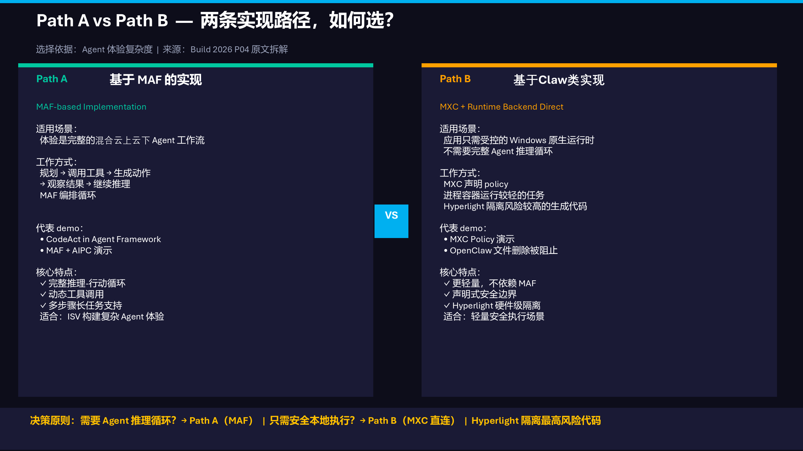

# AIPC Edge Agent Execution：通往 Windows-Native Local Runtime 的两条路径

[](https://github.com/microsoft/agent-framework) [](https://github.com/microsoft/mxc) [](https://github.com/hyperlight-dev/hyperlight) [](https://www.python.org/) [](https://opensource.org/licenses/MIT)

AIPC 需要本地 reasoning，也需要安全可控的 Windows-native local execution。本 repo 按 Build 2026（BRK262 / KEY01）里的两条实现路径组织：**Path A — 基于 MAF 的完整 agent loop**，以及 **Path B — MXC + runtime backend direct**。测试代码、policy profiles、evidence logs 均已入库。

> **Author**: Xinyu Wei (魏新宇) — Microsoft AI GBB Senior System Engineer

[English](README.md) | 中文版

---

## AIPC 双路径架构（来自 Build 2026）

<div align="center">
  
</div>

> Source: Build 2026 BRK262 + KEY01。端侧小模型可以在设备上 reasoning，但一部分 AIPC 任务仍然需要 Windows-native local execution。

<div align="center">
  
</div>

### 如何选择

| | Path A：MAF-based implementation | Path B：MXC + Runtime Backend Direct |
|---|---|---|
| **适用场景** | 完整 agent workflow：planning、tool calls、HITL、CodeAct、recovery、cloud/local routing | 只需要对某个 Windows-native action 或生成代码做受控本地执行，不需要完整 agent loop |
| **主循环由谁承载** | MAF 承载 reasoning-action loop；需要时由 Hyperlight 隔离生成代码 | App/model 选择 action；MXC 声明 policy；backend 负责 containment |
| **核心技术** | Microsoft Agent Framework、Hyperlight CodeAct、Ollama/Foundry Local、OpenTelemetry | MXC SDK 0.7、ProcessContainer（默认）、Hyperlight（高风险升级）、JSON policy profiles |
| **本 repo 证明什么** | Framework comparison、MAF workflow/HITL、Sandbox API、host tools | MXC --probe、task-scoped policy、capability catalog、ProcessContainer behavior |

这两条路径**不是二选一**。生产架构可以用 MAF 承载 agent experience，同时对具体本地 action 使用 MXC-governed execution。

---

## Path A：基于 MAF 的完整 Agent Loop

MAF 承载完整路径：plan → call tools → generate action → observe → continue → HITL → cloud/local routing → telemetry。

### Live Demo

MAF + Hyperlight host tools on Windows AIPC：截图、系统信息、CSV 分析，均在 WHP-isolated Hyperlight micro-VM 中执行。

https://github.com/user-attachments/assets/c2554bf2-da92-4a32-8692-0c576d7af376

<div align="center">
  
</div>

### Framework Comparison

| Dimension | LangChain | LangGraph | MAF |
|-----------|-----------|-----------|-----|
| Execution control | LLM decides | Developer graph | Agent + Workflow 双模式 |
| State recovery | 无 | SQLite checkpoint | Workflow checkpoint |
| HITL | Manual | interrupt() | RequestInfoExecutor |
| Sandbox | 无 | 无 | agent-framework-hyperlight |
| Windows/.NET | 无 | 无 | 有 |
| Observability | LangSmith | LangSmith | 内置 OpenTelemetry |
| Cloud hosting | 无 | 无 | Foundry Hosted Agents |

### Path A Test Results

| Script | 证明什么 | 状态 |
|--------|----------|:----:|
| `scenarios/maf_travel_agent.py` | MAF + Ollama tool calling | ✅ |
| `scenarios/maf_workflow_travel.py` | MAF @workflow + HITL | ✅ |
| `scenarios/maf_workflow_demo.py` | MAF durable workflow + checkpoint | ✅ |
| `scenarios/langchain_travel_agent.py` | LangChain ReAct loop | ✅ |
| `scenarios/langgraph_travel_agent.py` | LangGraph StateGraph + SQLite | ✅ |
| `portal/sandbox_api.py` | Hyperlight Sandbox + 4 host tools | ✅ |
| `portal/server.py` | 4-tab comparison portal | ✅ |

### Path A Code：Hyperlight Sandbox + Host Tools

AIPC Sandbox API 把 4 个 host tools 注册给 `HyperlightCodeActProvider`。MAF Agent 决定写什么代码；Hyperlight 在 WHP-isolated micro-VM 里执行；`call_tool()` 再桥接回 host callbacks。

```python
# portal/sandbox_api.py — key excerpt
from agent_framework_hyperlight import HyperlightCodeActProvider

def read_csv(filename: str) -> str: ...
def list_host_files(extension: str) -> str: ...
def host_system_info() -> str: ...
def capture_screenshot() -> str: ...

codeact = HyperlightCodeActProvider(
    tools=[read_csv, list_host_files, host_system_info, capture_screenshot],
)
agent = ChatCompletionAgent(
    name="AIPC-CodeAct",
    instructions="Use execute_code for EVERY request. Inside execute_code, call host tools via call_tool().",
    model_client=azure_client,
    code_act_provider=codeact,
)
result = await agent.run(task=user_query)
```

Sandbox 内代码不能任意读 host 文件；它只能通过注册过的 4 个 host tools 访问本地资源。

### Path A Code：Standalone Hyperlight Sandbox

```python
# portal/sandbox_api.py — direct sandbox endpoint
from hyperlight_sandbox import Sandbox

async def sandbox_run(code: str):
    def _execute():
        sandbox = Sandbox(backend="wasm")
        result = sandbox.run_python(code)
        sandbox.close()
        return result
    return await asyncio.to_thread(_execute)  # keep Rust !Send on one thread
```

### CodeAct / Hyperlight Boundaries

- MAF 今天不直接调用 MXC（2026-06-20 source scan：MXC_MATCH_COUNT=0）。
- MAF CodeAct backend 是 Hyperlight（官方 documented connector）。
- Hyperlight 不管理 host callbacks；host tools 必须写窄边界。

---

## Hyperlight-Unikraft Stateful Execution（跨轮状态保留）

Hyperlight 支持 **stateful multi-turn execution**：只要 sandbox 执行后不 restore 到 snapshot，session 中间结果（变量、imports、DataFrame）可以跨 turn 保留。这对 AIPC CodeAct 场景很重要：agent 可能需要在上一轮计算结果基础上继续写代码。

我们在 FY27 环境复现了产品组的 [stateful demo](https://github.com/hyperlight-dev/hyperlight-unikraft/blob/proto/stateful-demo/host/src/bin/stateful_demo.rs)。核心代码如下：

```rust
let mut rt = pyhl::Runtime::new(&home, &[], None, None, Some(0))?;

let turns = &[
  ("Turn 1: Create variables",
   "x = 42\ny = 'hello from turn 1'\nprint(f'  x = {x}, y = {y!r}')"),
  ("Turn 2: Access previous state + compute",
   "z = x * 2\nprint(f'  z = x * 2 = {z}')\nprint(f'  y from turn 1: {y!r}')"),
  ("Turn 3: Import library, build on prior state",
   "import pandas as pd\ndf = pd.DataFrame({'val': [x, z, x+z]})\nprint(df.to_string(index=False))"),
  ("Turn 4: Use everything from all prior turns",
   "total = df['val'].sum()\nprint(f'  x={x}, z={z}, df_sum={total}')"),
];

for (label, code) in turns {
    let t = rt.run_code_stateful(code)?;  // state persists between calls
}
```

FY27 实测输出（Windows 10 Pro build 26200, WHP enabled）：

```text
[init] runtime created in 62ms

--- Turn 1: Create variables ---
  x = 42, y = 'hello from turn 1'
  [36ms (includes initial restore: 152ms)]

--- Turn 2: Access previous state + compute ---
  z = x * 2 = 84
  y from turn 1: 'hello from turn 1'
  [3ms]

--- Turn 3: Import library, build on prior state ---
 val
  42
  84
 126
  [182ms]

--- Turn 4: Use everything from all prior turns ---
  x=42, z=84, df_sum=252
  All state persisted across 4 turns!
  [11ms]
```

**证明什么**：`run_code_stateful()` 可以让 Python interpreter state 跨 4 turns 保留。Turn 2 读取 Turn 1 的 `x`；Turn 3 用前面变量构建 DataFrame；Turn 4 继续使用 Turn 3 的 `df`。

**边界**：该 stateful execution model 尚未集成到 MXC mainline。产品组已在 [`danbugs/mxc/tree/proto/hyperlight-stateful`](https://github.com/danbugs/mxc/tree/proto/hyperlight-stateful) 推进集成，当前仍是 prototype branch。

> Source: `hyperlight-dev/hyperlight-unikraft` branch `proto/stateful-demo`, commit `ced2b301`
> Evidence: `mxc/evidence/fy27_hyperlight_unikraft_stateful_demo_20260629.log`

---

## Path B：MXC + Runtime Backend Direct

MXC 是 policy-driven execution layer，用于不需要完整 agent loop 的 Windows-native controlled execution。默认 backend 是 **ProcessContainer**；Hyperlight 只是最高风险生成代码时的升级选项。

### Path B Demo

MXC policy-driven execution：task-scoped capability policy、ProcessContainer backend、Win32 capability catalog probe。

https://github.com/user-attachments/assets/581acf71-510b-489e-b3a4-af24e9977a35

<div align="center">
  
</div>

### MXC Demo Inventory

Path B 不是一个玩具脚本，而是一套 VS Code runnable test harness：policy files、runner 和 evidence logs 都已入库。

| Demo | Task | 证明什么 | Key evidence |
|------|------|----------|--------------|
| Demo 1 | Probe host | MXC 可以通过 ProcessContainer/AppContainer fallback 启动真实 Windows command | `mxc/evidence/02_mxc_hello_world.log` |
| Demo 2 | No policy / full access | policy 前 baseline action 能访问网络 | `mxc/evidence/01_bare_baseline.log` |
| Demo 3 | Network denied | 同一个 curl action 在 block policy 下得到 `mxc_http:000`, exit 6 | `mxc/evidence/03_network_block.log` |
| Demo 4 | Network approved | 同一个 curl action 在 allow policy 下得到 `mxc_http:200`, exit 0 | `mxc/evidence/04_network_allow.log` |
| Demo 4b | ProcessContainer policy probe | pip 受 filesystem setup 限制；Win32/UI policy 可 block/allow PowerShell init | `mxc/evidence/pip_policy_probe_summary.txt` |
| Demo 4c | Task-scoped policy | text profile block UI capability；drawing profile allow UI capability | `mxc/evidence/task_rbac_policy_probe_summary.txt` |
| Demo 4d | Capability catalog | 9 个 native Win32 API 在 3 个 policy profiles 下的矩阵 | `mxc/evidence/capability_catalog_summary.md` |
| Filesystem | Filesystem policy | `readwritePaths` 只允许声明目录；baseline/readonly/out-of-scope 写入失败 | `mxc/evidence/fs_policy_*.log` |

主 runner：`mxc/scripts/Invoke-MXCDemo.ps1`。Policy profiles 在 `mxc/policies/`；native probe 源码在 `mxc/examples/win32_capability_probe.c`。

### MXC 0.7 Probe

`@microsoft/mxc-sdk@0.7.0` 的 `wxc-exec.exe --probe` 原始输出：

```json
{
  "tier": "appcontainer-dacl",
  "needsDaclAugmentation": true,
  "warnings": [
    "BaseContainer API not present or not preferred ... falling back to AppContainer + DACL"
  ],
  "probes": {
    "baseContainerApiPresent": true,
    "bfscfgPresent": false,
    "bfsCompiledIn": false,
    "uiCapabilities": {
      "canBlockClipboardRead": true,
      "canBlockClipboardWrite": true,
      "canBlockInputInjection": true,
      "canBlockInputMethodChanges": true,
      "canBlockExternalUiObjects": true,
      "canBlockGlobalUiNamespace": true,
      "canBlockDesktopSwitching": true,
      "canBlockLogoffOrShutdown": true,
      "canBlockSystemParameterChanges": true,
      "canBlockDisplaySettingsChanges": true
    }
  }
}
```

### Task-Scoped Capability Policy

两个 MXC 0.7 policy profiles 证明 task-scoped capability boundary：

```json
// text-lockdown: blocks all UI, clipboard, input, network
{
  "version": "0.7.0-alpha",
  "containment": "processcontainer",
  "processContainer": {
    "name": "Task-Text-Lockdown",
    "ui": { "isolation": "container", "desktopSystemControl": false, "systemSettings": "none", "ime": false }
  },
  "network": { "defaultPolicy": "block" },
  "ui": { "disable": true, "clipboard": "none", "injection": false }
}
```

```json
// drawing-ui: allows GDI, clipboard, input, system params
{
  "version": "0.7.0-alpha",
  "containment": "processcontainer",
  "processContainer": {
    "name": "Task-Drawing-UiAllowed",
    "ui": { "isolation": "desktop", "desktopSystemControl": true, "systemSettings": "all", "ime": true }
  },
  "network": { "defaultPolicy": "block" },
  "ui": { "disable": false, "clipboard": "all", "injection": true }
}
```

| Profile | Capabilities | Exit | Verdict |
|---------|-------------|:----:|--------|
| Host (no MXC) | N/A | 0 | 7/9 PASS |
| `text-lockdown` | No UI | -1073741502 | Process blocked |
| `drawing-ui` | GDI + sysParams + desktop | 0 | Process ran |

### Path B Code：Win32 Capability Probe (C)

```c
static void probe_get_dc(void) {
    HDC dc = GetDC(NULL);
    report_bool("GDI_GetDC", dc != NULL, GetLastError());
    if (dc) ReleaseDC(NULL, dc);
}

static void probe_clipboard_open(void) {
    BOOL ok = OpenClipboard(NULL);
    report_bool("Clipboard_OpenClipboard", ok, GetLastError());
    if (ok) CloseClipboard();
}

static void probe_create_desktop(void) {
    HDESK desktop = CreateDesktopW(name, NULL, NULL, 0, GENERIC_ALL, NULL);
    report_bool("Desktop_CreateDesktop", desktop != NULL, GetLastError());
    if (desktop) CloseDesktop(desktop);
}
```

### Network Policy

MXC 可以对每个 action 单独 block/allow outbound network。

我们测试了两个 policy profiles。两者执行的是同一个 curl action：`curl https://api.github.com`。

```json
// mxc/policies/02-network-block.json
{
  "containment": "processcontainer",
  "process": { "commandLine": "curl -s https://api.github.com", "timeout": 15000 },
  "processContainer": { "name": "VSCode-Network-Block" },
  "network": { "defaultPolicy": "block" }
}

// mxc/policies/03-network-allow.json — adds:
  "processContainer": { "capabilities": ["internetClient"] },
  "network": { "defaultPolicy": "allow" }
```

| Policy | curl output | Exit code | Verdict |
|--------|-------------|:---------:|---------|
| `network-block` | `mxc_http:000` | 6 | ✅ 网络被阻止——同一个 action 访问不了互联网 |
| `network-allow` | `mxc_http:200` | 0 | ✅ 网络放行——同一个 action 成功访问 GitHub API |

同一个 executable、同一个 URL，不同 policy → 不同结果。这是最干净的 MXC network 证明。

> Evidence: `mxc/evidence/03_network_block.log`, `mxc/evidence/04_network_allow.log`

### Filesystem Policy

MXC 可通过 `readwritePaths` / `readonlyPaths` 控制被包含进程能读写哪些目录。我们测试写入 `C:\temp\mxc-fs-test\`：

> **关于 pip install 测试**：我们也尝试了 `pip install six==1.16.0`，但 pip 在碰到网络层之前就先卡在 filesystem setup 错误上（`bfscfg.exe` 在当前 tier 不可用）。这是文件系统/BFS 的限制，不是 network 结论。不要用 pip 结果当 network policy 的证据；curl 才是正确的测试。

```json
// fs-policy-02-readwrite-allowed.json — allow write to target directory
{
  "version": "0.7.0-alpha",
  "containment": "processcontainer",
  "process": {
    "commandLine": "cmd.exe /c echo MXC_FS_WRITE_ALLOWED > C:\\temp\\mxc-fs-test\\allowed.txt && type C:\\temp\\mxc-fs-test\\allowed.txt",
    "timeout": 15000
  },
  "processContainer": { "name": "FS-ReadWrite-Allowed" },
  "network": { "defaultPolicy": "block" },
  "filesystem": { "readwritePaths": ["C:\\temp\\mxc-fs-test"] }
}
```

| Test | Policy | Exit | Verdict |
|------|--------|:----:|---------|
| 01 baseline | 无 `filesystem` 字段 | 1 | ❌ `Access is denied`，默认禁止写 `C:\temp` |
| 02 readwrite-allowed | `readwritePaths: ["C:\temp\mxc-fs-test"]` | **0** | ✅ 写入成功，`allowed.txt` 内容为 `MXC_FS_WRITE_ALLOWED` |
| 03 readwrite-blocked | `readwritePaths` 指向其他目录 | 1 | ❌ 写入被阻止 |
| 04 readonly | 只有 `readonlyPaths` | 1 | ❌ 只读目录不可写 |

**Key finding**：`readwritePaths` 在当前 `appcontainer-dacl` fallback tier 上可用于简单文件写入控制。pip install 失败是因为 pip 的 `--target` 需要更复杂的 BFS 文件系统重定向，不是 `readwritePaths` 本身不可用。

> Evidence: `mxc/evidence/fs-policy-*.json`（policy files），`mxc/evidence/fs_policy_*.log`（execution logs）

### Capability Catalog（9 个 Win32 probes × 4 种执行上下文）

这张表不是在说“好/坏”，而是在回答一个很具体的问题：**同一个 Windows API，在不同 MXC policy 下能不能被调用？**

| 列名 | 人话解释 |
|------|----------|
| **No MXC（Host baseline）** | 不走 MXC，直接在 Windows 上跑。✅ 表示这个 API 在 host 上本来就能调；❌ 表示它在当前 Windows 环境里本来就失败，所以不是 MXC 挡的。 |
| **MXC text-lockdown profile** | 最严格 profile，给纯文本任务用。`BLOCKED` 表示 MXC 在进程启动阶段就拦住了，9 个 API 根本没机会执行。 |
| **MXC gdi-minimal profile** | 给绘图/渲染类任务的最小 UI profile。✅ 表示这个 profile 放行了该 API；❌ 表示该 API 在这个 policy/tier 下仍然失败。 |
| **MXC broad-ui profile** | 更宽的 UI profile。但在当前 `appcontainer-dacl` fallback tier 下，它和 `gdi-minimal` 差异不大，clipboard/desktop/display/input/WMI 仍然没解锁。 |

图例：✅ = API 调用成功；❌ = API 调用失败；`BLOCKED` = MXC 在进程启动前就挡住了。

| Capability probe | No MXC<br/>Host baseline | MXC<br/>text-lockdown | MXC<br/>gdi-minimal | MXC<br/>broad-ui |
|------------------|:------------------------:|:-------------------:|:----------------:|:------------:|
| GDI_GetDC | ✅ | BLOCKED | ✅ | ✅ |
| Clipboard_OpenClipboard | ✅ | BLOCKED | ❌ | ❌ |
| Desktop_CreateDesktop | ✅ | BLOCKED | ❌ | ❌ |
| Display_ChangeDisplaySettings | ✅ | BLOCKED | ❌ | ❌ |
| SystemParametersInfo | ✅ | BLOCKED | ✅ | ✅ |
| Input_SendInput | ❌ | BLOCKED | ❌ | ❌ |
| Registry_HKCU_Read | ✅ | BLOCKED | ✅ | ✅ |
| CameraStack_Load_MF_DLL | ✅ | BLOCKED | ✅ | ✅ |
| WMI_Load_wbemuuid_DLL | ❌ | BLOCKED | ❌ | ❌ |

客户可读结论：MXC 可以按任务类型给不同的本地能力边界。text 任务可以完全不碰 UI；drawing/rendering 任务可以放行 GDI 和部分系统参数；clipboard、创建桌面、改显示设置、输入注入、WMI 在当前 fallback tier 下仍然不可用。

边界说明：`CameraStack_Load_MF_DLL` 只证明 Media Foundation DLL 可以加载，不等于摄像头采集权限已打通。`Input_SendInput` 和 `WMI_Load_wbemuuid_DLL` 在 Host baseline 下本来就失败，所以不能说是 MXC 单独拦截。

### Path B Boundaries

- 当前 tier：`appcontainer-dacl` fallback。
- MXC 仍是 early preview，不能包装成 production security boundary。
- Camera/fan/Android 不在本评估中证明。

---

## Running on Azure

| Resource | SKU | Purpose |
|----------|-----|---------|
| Portal VM | Linux D4s_v5, East Asia | FastAPI + nginx |
| AIPC VM | Windows 11, NPU | Hyperlight + Ollama + MAF |
| Azure OpenAI | gpt-5.4 via APIM | Cloud LLM |

## Project Structure

```
├── images/                     # Slides + architecture
├── scenarios/                  # Path A: framework scripts
├── portal/                     # Path A: demo portal + sandbox API
├── aipc/                       # Path A: Windows service config
├── mxc/                        # Path B: MXC test code + evidence
│   ├── scripts/Invoke-MXCDemo.ps1
│   ├── examples/win32_capability_probe.c
│   ├── policies/ (13 JSON profiles)
│   └── evidence/ (logs and policy outputs)
├── .env.example / requirements.txt
└── README.md / README-CN.md
```

### Evidence Index（中文读者快速查证）

| 证据类别 | 文件路径 | 说明 |
|----------|----------|------|
| MXC 0.7 host probe | `mxc/evidence/mxc_sdk_0_7_probe_raw.txt` | `wxc-exec.exe --probe` 原始输出，包含 `tier=appcontainer-dacl` 和 10 个 `canBlock*` UI capability facts |
| Network block | `mxc/evidence/03_network_block.log` | 同一个 curl action 在 block policy 下输出 `mxc_http:000`，exit=6 |
| Network allow | `mxc/evidence/04_network_allow.log` | 同一个 curl action 在 allow policy 下输出 `mxc_http:200`，exit=0 |
| pip policy summary | `mxc/evidence/pip_policy_probe_summary.txt` | pip install 在 block/allow 下都先遇到 filesystem/BFS setup 问题，不能当作 network 结论 |
| Text profile policy | `mxc/evidence/task-rbac-text-lockdown.json` | text task 的 lockdown profile：UI/clipboard/input/network 全锁 |
| Drawing profile policy | `mxc/evidence/task-rbac-drawing-ui.json` | drawing task 的 UI-allowed profile：GDI/system settings 等放行 |
| Task RBAC summary | `mxc/evidence/task_rbac_policy_probe_summary.txt` | text profile blocked、drawing profile ran、capability delta=True |
| Capability catalog | `mxc/evidence/capability_catalog_summary.md` | 9 个 Win32 probes × host/text-lockdown/gdi-minimal/broad-ui 的矩阵 |
| Capability logs | `mxc/evidence/capability_catalog_*.log` | 每个 policy profile 的原始运行日志 |
| Filesystem baseline | `mxc/evidence/fs_policy_01_baseline.log` | 无 filesystem 字段时写 `C:\temp` 被 `Access is denied` 阻止 |
| Filesystem allow | `mxc/evidence/fs_policy_02_readwrite_allowed.log` | `readwritePaths` 指向目标目录时写入成功，输出 `MXC_FS_WRITE_ALLOWED` |
| Filesystem block | `mxc/evidence/fs_policy_03_readwrite_blocked.log` | `readwritePaths` 指向其他目录时，目标目录写入被阻止 |
| Filesystem readonly | `mxc/evidence/fs_policy_04_readonly.log` | `readonlyPaths` 只读场景下写入被阻止 |
| Stateful Hyperlight log | `mxc/evidence/fy27_hyperlight_unikraft_stateful_demo_20260629.log` | 4-turn stateful demo 原始输出：Turn 4 证明 `x/z/df` 跨轮保留 |
| MXC runner | `mxc/scripts/Invoke-MXCDemo.ps1` | Demo 1-7 的主执行脚本，包含 network、policy、capability、Hyperlight lifecycle 等路径 |
| Native Win32 probe | `mxc/examples/win32_capability_probe.c` | GDI/Clipboard/Desktop/Display/SystemParams/Input/Registry/Camera DLL/WMI DLL 的 C 语言 probe |
| Policy profiles | `mxc/policies/*.json` | 可复用 policy profiles：network block/allow、filesystem、backend-fit、Hyperlight lifecycle 等 |

这张表是 README 结论的可复验入口。客户或同事如果质疑某个判断，可以直接从对应 evidence 文件复查原始日志，而不是只相信叙述。

### How to read the evidence logs

读 evidence logs 时建议按下面顺序看：

1. 先看 `*_summary.txt` 或 `*_summary.md`，确认测试时间、policy 文件、exit code 和 verdict。
2. 再看对应 `.json` policy，确认测试到底声明了什么 capability、network、filesystem boundary。
3. 最后看 `.log` 原始输出，确认 `wxc-exec` 实际执行了哪个 command，以及 stdout/stderr/exit code。
4. 对 network 测试，关键字段是 `mxc_http:000` vs `mxc_http:200`。
5. 对 filesystem 测试，关键字段是 `Access is denied` 或 `MXC_FS_WRITE_ALLOWED`。
6. 对 task-scoped policy 测试，关键字段是 `verdict_text_restricted=True`、`verdict_drawing_ran=True`、`verdict_capability_delta=True`。
7. 对 capability catalog，先看表格矩阵，再回到每个 profile 的 `.log` 做抽查。
8. 如果同一个测试同时涉及 network 和 filesystem，优先判断哪个层先失败；pip 测试就是 filesystem setup 先失败，因此不能拿它证明 network allow/block。
9. 任何 `appcontainer-dacl` 结论都只代表当前 fallback tier，不能外推为 BaseContainer/Windows Insider tier 的全部行为。

这也是本 repo 的证据口径：表格给结论，policy 给配置，log 给原始事实，README 只负责把它们串成工程判断。

## Setup

### Path A

```bash
pip install -r requirements.txt && cp .env.example .env
python portal/server.py       # Portal :8506
python portal/sandbox_api.py  # AIPC :8507
```

### Path B

```powershell
npm install @microsoft/mxc-sdk@0.7.0
.\node_modules\.bin\wxc-exec.exe --probe
powershell -File mxc\scripts\Invoke-MXCDemo.ps1
```

## Tech Stack

| Component | Version |
|-----------|---------|
| Microsoft Agent Framework | 1.8+ |
| MXC SDK | 0.7.0 |
| Hyperlight | 0.3+ |
| LangChain / LangGraph | 0.3+ / 0.4+ |
| Python / FastAPI | 3.12 / 0.115+ |

## Related Repos

- [Hyperlight & MXC Sandbox Landscape](../Hyperlight-MXC-Sandbox-Landscape/)
- [Microsoft Agent Framework Demos](../Microsoft-Agent-Framework/)