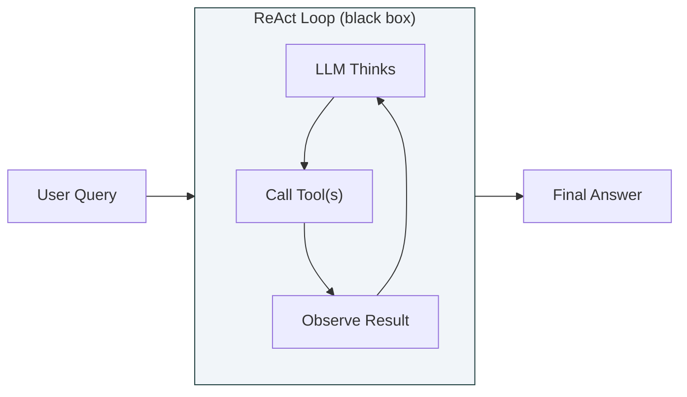
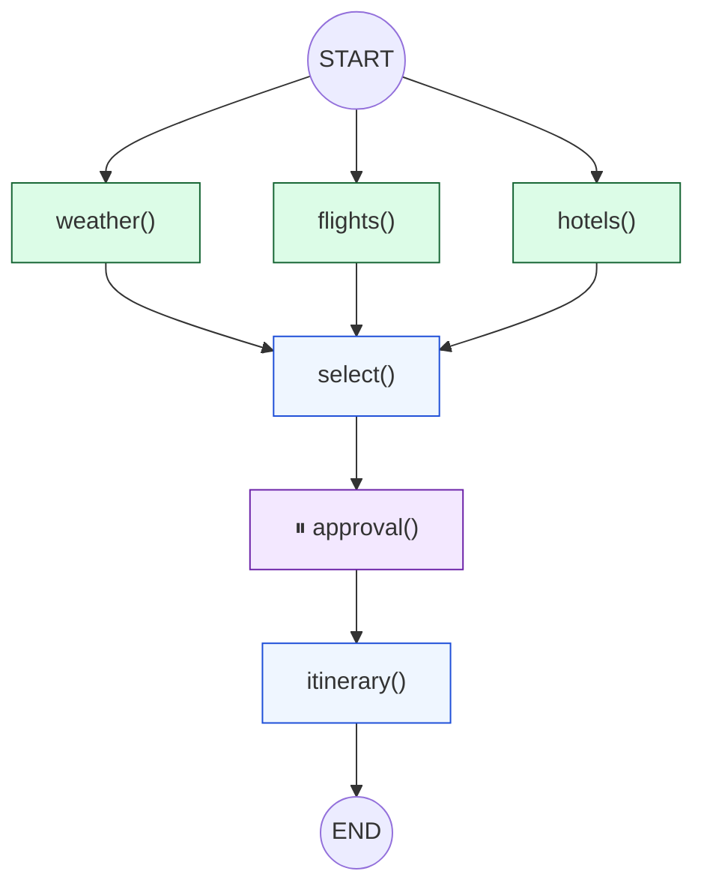
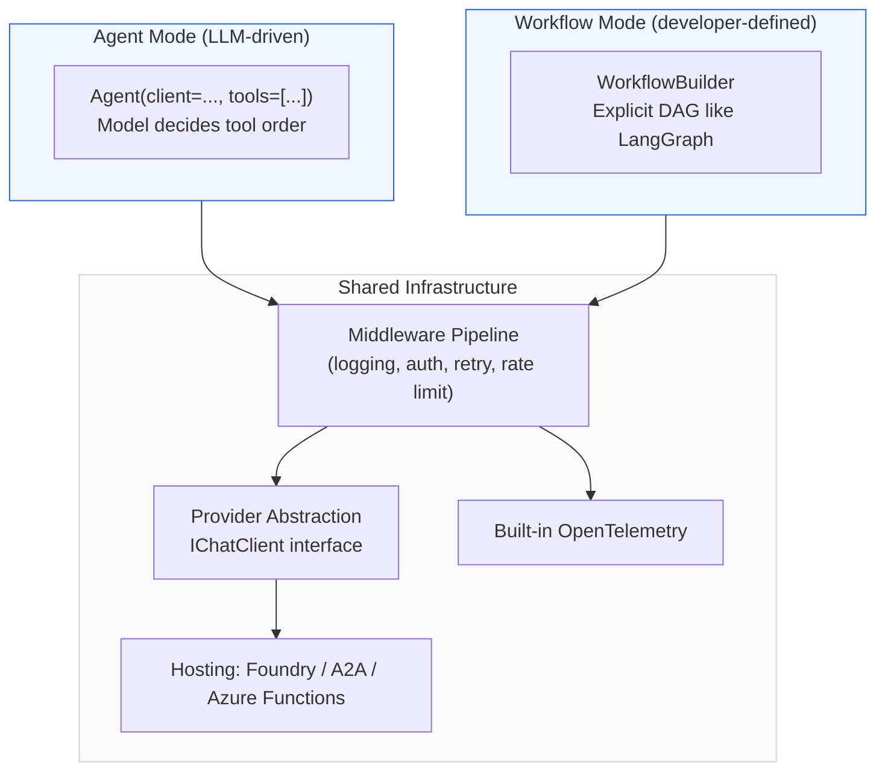

# Open-Source Agent Framework Evaluation for AIPC Hybrid Compute

[](https://docs.langchain.com/oss/python/langchain/overview)
[](https://docs.langchain.com/oss/python/langgraph/overview)
[](https://github.com/microsoft/agent-framework)
[](https://www.python.org/)
[](https://opensource.org/licenses/MIT)

An architecture-level comparison of three open-source agent frameworks — **LangChain**, **LangGraph**, and **Microsoft Agent Framework (MAF)** — for AIPC scenarios where the agent must orchestrate **both on-device and cloud compute** within a single workflow. This is **not** primarily an Azure OpenAI API wrapper comparison. The anchor is the framework itself: execution model, workflow control, state durability, HITL, local runtime integration, Windows production fit, observability, and deployment path.

> **Author**: Xinyu Wei (魏新宇) — Microsoft AI GBB Senior System Engineer

[中文版](README-CN.md) | English

---

## Customer Question

Lenovo's Qira AIPC scenario needs a practical answer to one question:

> **If an OS-level AI assistant must run local skills, local models, cloud reasoning, human approval, and recovery from laptop restarts, which agent framework gives the right architecture?**

This repo therefore compares the three frameworks in two layers:

1. **Framework layer** — what each framework is, how it executes, how it models workflows, which languages it supports, how open-source/community maturity looks, and what production features it provides.
2. **AIPC hybrid runtime layer** — how each framework maps to local models, local tools/skills, cloud fallback, checkpoints, sandboxing, and Windows deployment.

API surface differences such as **Chat Completions vs Responses API** matter, but they are a sub-layer. They do not define the whole framework.

---

## Executive Framework Comparison

| Dimension | LangChain | LangGraph | Microsoft Agent Framework (MAF) | AIPC implication |
|-----------|-----------|-----------|----------------------------------|------------------|
| Official positioning | "The agent engineering platform" for agents and LLM apps | "Low-level orchestration framework for building stateful agents" | Open, multi-language framework for production-grade agents and workflows | Start with the mental model before picking APIs |
| Open-source maturity | MIT, ~139k GitHub stars, ~3.9k contributors | MIT, ~34.3k GitHub stars, ~295 contributors | MIT, ~11.2k GitHub stars, ~160 contributors | LangChain ecosystem is largest; MAF is newer but Microsoft-aligned |
| Primary languages | Python core; JS/TS ecosystem exists separately | Python core; LangGraph.js exists separately | Python + C#/.NET in the same framework | MAF is strongest for Windows-native / .NET teams |
| Core abstraction | Agent/tool loop around model calls | Explicit state graph with nodes, edges, checkpoints | Dual mode: agent + workflow, plus providers, middleware, OTel, hosting | LangGraph/MAF expose runtime structure; LangChain hides more behind the agent loop |
| Who controls execution? | Mostly LLM decides tool order | Developer defines the graph | Either LLM-driven agent mode or developer-defined workflow mode | AIPC OS workflows often need explicit control for local/cloud routing |
| Workflow model | Chain / agent loop; complex durability pushed elsewhere | StateGraph + checkpoint + interrupt | WorkflowBuilder + checkpoint/time-travel + Durable hosting options | LangGraph is simplest local durable graph; MAF is broader production stack |
| State and recovery | No first-class durable state in LangChain agent loop | First-class persistence via checkpointers such as SQLite/Postgres | Workflow checkpointing/time-travel; backend choice needs scenario validation | Device restart recovery is a first-order AIPC requirement |
| HITL | Manual callback / UI glue | Native `interrupt()` | `RequestInfoExecutor` / schema-validated request-info patterns | Approval gates need durable pause/resume, not blocking `input()` |
| Observability | Usually LangSmith | LangSmith | Built-in OpenTelemetry + Azure Monitor path | Enterprise demos need traces, not only console logs |
| Local runtime story | Works well with Ollama and many providers, but external runtime is app responsibility | Same model/provider layer as LangChain, with better orchestration state | Ollama, Foundry Local, provider abstraction, Hyperlight package, .NET path | MAF has the richest Windows production surface, but each local backend must be smoke-tested |
| Best fit | Fast prototype and broad integrations | Local-first stateful workflow | Windows/enterprise production agent platform | The likely answer is not one winner: LangGraph local runtime + MAF enterprise/cloud path may be the hybrid recommendation |

Sources accessed 2026-06-10: [LangChain GitHub](https://github.com/langchain-ai/langchain), [LangGraph GitHub](https://github.com/langchain-ai/langgraph), [Microsoft Agent Framework GitHub](https://github.com/microsoft/agent-framework), [MAF Learn docs](https://learn.microsoft.com/en-us/agent-framework/).

---

## Live Demo

**Comparison Portal** — same travel planning task, three frameworks side by side, 5 differential scenarios:

> `http://linuxworkvm1-work.eastasia.cloudapp.azure.com:8506`

### What is real vs visualized

| Asset | What it proves | Boundary |
|-------|----------------|----------|
| `scenarios/langchain_travel_agent.py` | Real local Ollama tool-calling loop with LangChain primitives | Depends on local model tool-calling support |
| `scenarios/langgraph_travel_agent.py` | Real StateGraph structure with `interrupt()` pattern and explicit state nodes | Local scenario fixture; persistence path should be validated per deployment |
| `scenarios/maf_travel_agent.py` | Real MAF `OllamaChatClient.as_agent(...)` path with local Ollama tools | Proves Agent/provider layer; WorkflowBuilder checkpoint/HITL remains a separate proof |
| Portal `Framework` | Visualizes macro differences: open source maturity, languages, execution control, state, workflow model | Comparison view, not a benchmark |
| Portal `Runtime` | Maps local model, skills/tools, state store, HITL, sandbox, cloud fallback, enterprise ops | Backend-specific claims need smoke-test evidence on target Windows hardware |
| Portal `Recovery` / `HITL` | Explains recovery/HITL semantics customers should evaluate | Scripted trace; no real process kill/restart is performed in the portal |

The portal is best read as an **architecture visualization**. The standalone scenario scripts are the runnable evidence units.

---

## Why This Evaluation

AIPC platforms need an agent framework that can orchestrate **hybrid compute** — local SLM for fast/offline/private tasks, cloud LLM for complex reasoning. The framework sits between the application and the models:

```
┌─────────────────────────────────────────┐
│  Application Layer (OS shell / UI)      │
├─────────────────────────────────────────┤
│  Agent Framework Layer  ← this eval     │
│  (orchestration, state, tool dispatch)  │
├─────────────────────────────────────────┤
│  Local Compute          Cloud Compute   │
│  (Ollama / ONNX RT)     (Azure OpenAI)  │
│  (local tools/sandbox)  (cloud APIs)    │
└─────────────────────────────────────────┘
```

The question is: **which framework best handles the bidirectional interaction between local and cloud compute?** Not just "can it call Ollama" — but how it manages state across the local-cloud boundary, how it routes tasks based on complexity, and how it recovers when either side fails.

---

## 1. Implementation Principles

### 1.1 LangChain: ReAct Loop

LangChain's core architecture is a **ReAct (Reason + Act) loop** — the model thinks, picks a tool, observes the result, and repeats until it has a final answer.



**How it works internally:**

1. User message + system prompt + tool definitions → sent to LLM in one request
2. LLM returns either a **final answer** or one or more **tool_call** instructions
3. If tool calls: framework executes them as Python functions, appends results to message list
4. Loop back to step 1 with updated messages
5. If final answer: return to user

**Key architectural properties:**

| Property | Value |
|----------|-------|
| Execution control | **LLM decides** — the model chooses which tools to call and in what order |
| State | **Ephemeral** — a Python list of messages; nothing persisted by default |
| Parallelism | **Implicit** — if the LLM returns 3 tool_calls in one response, they execute, but the developer didn't explicitly request parallelism |
| Error recovery | **None** — if the process crashes, all state is lost, must restart |
| Abstraction level | **High** — `create_agent(model, tools, prompt)` hides the loop |

**What this means for hybrid compute:**
- The LLM decides whether to use a local or cloud tool — the developer cannot enforce a specific execution order
- If a local tool fails and the framework restarts, all prior results (including expensive cloud LLM calls) are lost
- Simple and fast for prototyping, but the developer gives up control

> Source: [LangChain agents documentation](https://docs.langchain.com/oss/python/langchain/agents), [create_agent API](https://docs.langchain.com/oss/python/langchain/overview) (retrieved 2026-06-08)

---

### 1.2 LangGraph: State Machine Graph

LangGraph's core architecture is a **directed graph of typed state transformations** — inspired by Google's [Pregel](https://research.google/pubs/pub37252/) model for large-scale graph processing.



**How it works internally:**

1. Developer defines a `StateGraph` with **typed state** (a TypedDict that flows through the graph)
2. Each **node** is a pure function: takes current state → returns partial state update
3. **Edges** define which node runs next (can be static or conditional)
4. At each node boundary, the framework can **checkpoint** the state to a persistent store (SQLite, Postgres)
5. Nodes at the same depth in the graph run **in parallel** (like a Pregel superstep)
6. `interrupt()` pauses the graph — state is saved, execution stops, can resume later

```python
# The developer explicitly defines the execution topology
class AgentState(TypedDict):
    weather: dict         # each field is typed
    flights: list
    hotels: list
    approved: bool

graph = StateGraph(AgentState)
graph.add_node("weather", check_weather)   # developer defines nodes
graph.add_node("flights", search_flights)
graph.add_edge(START, "weather")           # developer defines edges
graph.add_edge(START, "flights")           # parallel: both from START
graph.add_edge("weather", "select")        # converge
graph.add_edge("flights", "select")
app = graph.compile(checkpointer=SqliteSaver("state.db"))  # local persistence
```

**Key architectural properties:**

| Property | Value |
|----------|-------|
| Execution control | **Developer decides** — the graph topology is defined in code |
| State | **Typed + persistent** — TypedDict state checkpointed at every node boundary |
| Parallelism | **Explicit** — nodes with edges from the same source run concurrently |
| Error recovery | **Checkpoint resume** — restart from last successful node |
| Abstraction level | **Low** — developer builds the graph node by node |

**What this means for hybrid compute:**
- Developer can explicitly route: "simple tasks → local Ollama node, complex tasks → cloud Azure OpenAI node" using **conditional edges**
- Local SQLite checkpointer is first-class — state survives device restarts without any cloud dependency
- If a cloud call fails, only that node re-executes; local results are preserved in checkpoint
- The developer controls every aspect of the execution flow

> Source: [LangGraph overview](https://docs.langchain.com/oss/python/langgraph/overview), [LangGraph persistence](https://docs.langchain.com/oss/python/langgraph/persistence) (retrieved 2026-06-08)

---

### 1.3 Microsoft Agent Framework: Dual-Mode (Agent + Workflow)

MAF has two execution modes: **Agent mode** (LLM-driven, like LangChain) and **Workflow mode** (graph-based, like LangGraph). It adds a **middleware pipeline** and **provider abstraction** on top.



**How Agent mode works internally:**

1. Agent wraps an `IChatClient` (provider-agnostic interface) + tools + instructions
2. When `agent.run(query)` is called, the selected provider client decides the underlying model API: `OpenAIChatClient` uses the newer Responses API, while `OpenAIChatCompletionClient` keeps the Chat Completions path for compatibility
3. The model returns tool calls → framework executes them through the middleware pipeline
4. Loop until final answer (similar to LangChain's ReAct loop)

**How Workflow mode works internally:**

1. Developer defines a DAG with `WorkflowBuilder` (similar to LangGraph's StateGraph)
2. Each node is an **executor** function
3. State is checkpointed at **superstep boundaries** (groups of parallel nodes)
4. `RequestInfoExecutor` pauses the workflow for HITL (like LangGraph's `interrupt()`)
5. Can integrate with Azure Durable Task for serverless replay

**Key architectural properties:**

| Property | Value |
|----------|-------|
| Execution control | **Both modes** — Agent (LLM decides) or Workflow (developer decides) |
| State | **Agent**: session-scoped (in-memory or Cosmos DB). **Workflow**: superstep checkpoints |
| Parallelism | **Workflow**: explicit concurrent executors. **Agent**: LLM-decided |
| Error recovery | **Workflow**: superstep resume + Durable Task replay. **Agent**: limited |
| Abstraction level | **Medium** — more ceremony than LangGraph, less than LangChain |
| Unique features | Middleware pipeline, provider abstraction, built-in OTel, Python + C#/.NET, Foundry hosting |

**What this means for hybrid compute:**
- `IChatClient` interface makes it clean to swap between local and cloud models — change one line, keep all business logic
- MAF has a native `OllamaChatClient`, and the official sample `ollama_agent_basic.py` demonstrates **Ollama tool calling** with `@tool` and `tools=get_time`
- MAF also has `FoundryLocalClient` for local inference through Foundry Local; the sample lists local models that support tool calling
- Workflow mode includes checkpointing and time-travel; the exact local-only persistence backend still needs scenario-level verification
- `agent-framework-hyperlight` enables running CodeAct tools inside Hyperlight-backed sandboxes — unique framework-level sandbox integration not available in LangChain/LangGraph

> Source: [MAF GitHub](https://github.com/microsoft/agent-framework), [MAF Ollama samples](https://github.com/microsoft/agent-framework/tree/main/python/samples/02-agents/providers/ollama), [MAF Foundry Local package](https://github.com/microsoft/agent-framework/tree/main/python/packages/foundry_local), [MAF Hyperlight package](https://github.com/microsoft/agent-framework/tree/main/python/packages/hyperlight) (retrieved 2026-06-09)

---

### 1.4 API Surface Is a Sub-Layer, Not the Framework

After the macro framework comparison, it is still important to understand how each framework reaches OpenAI-compatible models. This matters for APIM routing, hosted tools, reasoning models, and customer troubleshooting.

| Framework | Default mental model | OpenAI / Azure OpenAI API surface | Tool implications | Customer takeaway |
|-----------|----------------------|-----------------------------------|-------------------|-------------------|
| LangChain | Chat model abstraction inside an agent/tool loop | `ChatOpenAI` / `AzureChatOpenAI` commonly use Chat Completions; `ChatOpenAI` can opt into Responses API with `use_responses_api=True`, or route there automatically when `reasoning` is set | Python function tools through `bind_tools`; Responses API unlocks server-side tools such as code interpreter when explicitly enabled | Broadest integration ecosystem, but API path is model/client configuration rather than the framework's core identity |
| LangGraph | Graph runtime; model calls are just nodes | Same as the chat model placed in each graph node, typically LangChain `ChatOpenAI` / `AzureChatOpenAI` | Tool semantics come from node code and the selected model client; graph adds state/checkpoint/retry semantics | API choice is inherited from the model node; LangGraph's value is durable control flow |
| MAF | Production agent/workflow framework with provider clients | `OpenAIChatClient` targets Responses API and is the recommended primary client; `OpenAIChatCompletionClient` targets Chat Completions for broad compatibility | Responses client supports richer hosted tools such as code interpreter, file search, web search, hosted MCP, image generation; Chat Completions remains useful for simple/broad compatibility | MAF's API layer is more explicit and production-oriented, but it is still one part of a larger runtime stack |

Sources accessed 2026-06-10: [LangChain AzureChatOpenAI Responses API docs](https://docs.langchain.com/oss/python/integrations/chat/azure_chat_openai), [MAF OpenAI provider docs](https://learn.microsoft.com/en-us/agent-framework/agents/providers/openai), [MAF Azure OpenAI provider docs](https://learn.microsoft.com/en-us/agent-framework/agents/providers/azure-openai).

**APIM note**: Chat Completions and Responses use different routes. If an APIM gateway only forwards `/chat/completions`, a Responses-based client can fail even when a Chat Completions client succeeds.

---

## 2. Hybrid Compute Deep Dive

This section compares how each framework handles the 5 critical hybrid compute requirements.

### 2.0 AIPC Runtime Stack Mapping

For Lenovo Qira, the question is not simply "which SDK calls Azure OpenAI." The OS assistant needs a layered runtime:

| AIPC layer | What the layer does | LangChain | LangGraph | MAF |
|------------|---------------------|-----------|-----------|-----|
| Local model runtime | Runs a local SLM for low-latency/offline/private tasks | Uses provider integrations such as Ollama; app owns process lifecycle | Same provider layer as LangChain, embedded in graph nodes | Ollama provider + Foundry Local path; .NET/C# path matters for Windows apps |
| Local tools / skills | Calls OS APIs, local files, app skills, Graph connectors, device functions | Tools are Python functions or wrappers; simple but in-process | Tools are graph nodes with typed state and retry boundaries | Tools can sit behind provider/middleware/workflow abstractions; skill/declarative patterns align with Microsoft stack |
| Local state store | Preserves state when laptop sleeps, restarts, or app crashes | App must implement this | SQLite/Postgres checkpointer is the clearest local-first path | Workflow checkpointing/time-travel exists; local backend must be selected and tested |
| Human approval | Pauses before sending email, booking travel, changing OS settings | Manual UI/callback work | Native `interrupt()` pattern | `RequestInfoExecutor` / request-info patterns with schema validation |
| Cloud fallback | Escalates complex reasoning to cloud LLM | Manual routing logic | Conditional edges make routing explicit | Provider/client swap and Foundry hosting make cloud path clean |
| Sandboxed execution | Isolates risky code/tool execution | External wrapper needed | External wrapper needed | `agent-framework-hyperlight` is the only framework-level option, but hardware/OS support must be verified |
| Enterprise operations | Tracing, deployment, auth, governance | Usually LangSmith + app infra | LangSmith + app infra | Built-in OpenTelemetry, Foundry hosting, Azure Functions/A2A paths, Python + .NET |

This is why the recommendation may be hybrid: **LangGraph is strong for local durable orchestration; MAF is strong for Windows/enterprise production integration; LangChain remains the fastest integration/prototype layer.**

### 2.1 Local Model Capabilities

What can each framework actually do with a local model (Ollama)?

| Capability | LangChain + Ollama | LangGraph + Ollama | MAF + Ollama |
|-----------|:------------------:|:------------------:|:------------:|
| Chat completion | ✅ | ✅ | ✅ |
| Structured output (JSON) | ✅ | ✅ | ✅ |
| **Tool calling** | ✅ | ✅ | ✅ model-dependent |
| **Streaming** | ✅ | ✅ | ✅ |
| Vision (image input) | ✅ | ✅ | ✅ model-dependent |
| Local embedding | ✅ | ✅ | N/A |

> Source: [MAF Ollama examples](https://github.com/microsoft/agent-framework/tree/main/python/samples/02-agents/providers/ollama) show `OllamaChatClient` with tool calling, streaming, reasoning, and multimodal samples. The model must support the capability; MAF's README recommends tool-calling-capable Ollama models such as `llama3.2`, `qwen2.5`, or `qwen3:4b`.

**Impact**: MAF is not blocked on local tool calling. The real constraint is **model selection**: a tiny model such as `qwen3:0.6b` may not reliably support tool calling, while `qwen2.5` or `qwen3:4b` should be tested for the AIPC local path.

### 2.2 Local ↔ Cloud Routing

How does each framework decide "run this on local SLM" vs "send to cloud LLM"?

**LangChain**: No built-in routing. The developer must write routing logic inside tool functions or wrap with custom logic.

**LangGraph**: **Conditional edges** — the most explicit and flexible approach:

```python
def route_by_complexity(state: AgentState) -> str:
    """Route based on task complexity — developer controls the decision."""
    if state["task_complexity"] == "simple":
        return "local_ollama"    # → Ollama node
    return "cloud_aoai"          # → Azure OpenAI node

graph.add_conditional_edges("classify", route_by_complexity,
    {"local_ollama": "ollama_node", "cloud_aoai": "aoai_node"})
```

The routing logic is **visible in the graph definition** — not hidden inside the LLM's reasoning.

**MAF**: **IChatClient swap** — cleanest provider abstraction, but routing logic must be built by the developer:

```python
local_client = OllamaChatClient(model="qwen3:8b")
cloud_client = OpenAIChatClient(azure_endpoint=..., model="gpt-4.1")

# Same agent, different clients — swap without changing business logic
if task.is_simple():
    agent = Agent(client=local_client, tools=tools)
else:
    agent = Agent(client=cloud_client, tools=tools)
```

| Framework | Routing mechanism | Visibility | Flexibility |
|-----------|------------------|:----------:|:-----------:|
| LangChain | Manual if/else | Low (inside code) | Medium |
| LangGraph | Conditional edges in graph | ✅ High (visible in DAG) | ✅ High |
| MAF | IChatClient swap | Medium (in agent setup) | ✅ High (clean abstraction) |

### 2.3 State Persistence Across Device Restarts

AIPC critical: user closes laptop → reopens → agent resumes.

| Framework | Persistence mechanism | Local-friendly? | Setup complexity |
|-----------|----------------------|:---------------:|:----------------:|
| LangChain | ❌ None | N/A | N/A |
| LangGraph | SQLite checkpointer | ✅✅ **Best for local** — single `.db` file | 1 line: `SqliteSaver("state.db")` |
| MAF Agent | Session scope | ⚠️ Needs scenario-level storage decision | Depends on provider/session setup |
| MAF Workflow | Checkpointing + time-travel | ✅ Supported; local-only backend needs verification | More setup than LangGraph |

**LangGraph remains the simplest local-first checkpoint story** because SQLite is one line and easy to inspect. MAF also supports workflow checkpointing/time-travel, but the local-only persistence path must be verified in the demo rather than described as absent.

### 2.4 Crash Recovery (Partial Failure)

Cloud API times out after local steps succeeded. What happens?

```
Timeline:  ✅ local_weather → ✅ local_flights → 💥 cloud_hotel_API_timeout
```

| Framework | Weather + flights result | Recovery action | Wasted compute |
|-----------|:-----------------------:|-----------------|:--------------:|
| LangChain | ❌ Lost | Full restart | 100% — re-run everything |
| LangGraph | ✅ In checkpoint | Resume from last checkpoint, only retry hotels | ~0% |
| MAF Workflow | ✅ In superstep | Durable Task replay, skip completed steps | ~0% |

LangGraph and MAF Workflow both recover gracefully. LangChain does not.

### 2.5 Tool Sandbox Integration

Can the framework isolate tool execution in a sandbox?

| Framework | Built-in sandbox | Mechanism |
|-----------|:----------------:|-----------|
| LangChain | ❌ | Tools are Python functions in the main process |
| LangGraph | ❌ | Same as LangChain |
| MAF | ⚠️ **Beta** | `agent-framework-hyperlight` — tools can run in Hyperlight micro-VMs (1-2ms cold start, hypervisor isolation) |

MAF's Hyperlight integration is the only framework-level sandbox option, but it's **beta** (package version `1.0.0b260521`). For production, all three frameworks would likely use an external sandbox layer (MXC, Hyperlight standalone, or OS-level containers).

**Runtime constraint**: Hyperlight requires a Windows host with the required hypervisor/WHP support. In the Azure VM used for this evaluation, MXC/Hyperlight reached VM creation but failed with `No hypervisor was found`, so this repo treats Hyperlight as an architecture differentiator, not as a cloud-VM-validated result.

---

## 3. Fair AIPC Fit Assessment

### Strengths (what each framework does best)

| Framework | Top strength for AIPC |
|-----------|----------------------|
| **LangChain** | **Fastest prototyping + richest model ecosystem** — 80+ model integrations, 5-line agent setup, full Ollama support including tool calling. When you just need to test an idea quickly, nothing is faster. |
| **LangGraph** | **Best local-first runtime** — full Ollama support (tool calling + streaming), SQLite checkpoint for local persistence, conditional edges for explicit local/cloud routing, HITL via interrupt(). Purpose-built for stateful workflows that need to survive device restarts. |
| **MAF** | **Best Windows production runtime** — Ollama provider, Foundry Local, workflow checkpointing/time-travel, built-in OpenTelemetry, middleware, C#/.NET, Foundry hosting, and the only native Hyperlight sandbox integration among the three. |

### Weaknesses (honest assessment)

| Framework | Key weakness for AIPC |
|-----------|-----------------------|
| **LangChain** | **No state persistence, no crash recovery, no HITL.** A toy for production AIPC — any device restart loses all agent state. Must build these from scratch. |
| **LangGraph** | **No built-in observability** (needs external LangSmith), **Python only** (no C# for Windows-native apps), **no sandbox integration** (tools run in main process). |
| **MAF** | **Heavier and more moving parts** — local inference can use Ollama or Foundry Local, but model capability and optional packages must be chosen carefully. Local-only checkpoint storage is less straightforward than LangGraph's SQLite. |

### Side-by-Side Summary

| AIPC Requirement | LangChain | LangGraph | MAF |
|:-----------------|:---------:|:---------:|:---:|
| Full offline operation | ✅ | ✅✅ | ✅ via Ollama / Foundry Local, model-dependent |
| Device restart recovery | ❌ | ✅✅ SQLite local | ✅ workflow checkpointing; local backend TBD |
| Local/cloud routing | Manual | ✅✅ Conditional edges | ✅ IChatClient swap |
| Crash recovery | ❌ | ✅ Checkpoint resume | ✅ Durable Task replay |
| HITL approval | ❌ | ✅ interrupt() | ✅ RequestInfo + schema |
| Tool sandbox | ❌ wrapper needed | ❌ wrapper needed | ✅ `agent-framework-hyperlight` |
| Observability | ❌ | ❌ | ✅✅ Built-in OTel |
| C#/.NET support | ❌ | ❌ | ✅✅ |
| Cloud deployment | Self-manage | LangGraph Platform ($) | ✅ Foundry (2-line) |
| Learning curve | Low | Medium | High |
| Weight / footprint | Light | Light | Heavy |

---

## 4. Architecture Recommendations

### For local-first AIPC (priority: offline, lightweight, cross-platform)

```
App UI
  └── LangGraph StateGraph (local orchestration engine)
        ├── Ollama (local SLM — full tool calling + streaming)
        ├── Azure OpenAI (cloud LLM — conditional edge for complex tasks)
        ├── Local tools (OS APIs — in-process or self-managed sandbox)
        └── SQLite checkpointer (state survives device restarts)
```

**Why**: LangGraph has the most complete local story — full Ollama support, battle-tested SQLite persistence, explicit routing via conditional edges. Lightweight, Python-only, easy to embed.

### For cloud-first with local fallback (priority: enterprise, governance, Windows C#)

```
App UI (C# WinUI / Python)
  └── MAF WorkflowBuilder (enterprise orchestration)
        ├── Azure OpenAI / Foundry (cloud LLM)
        ├── Ollama / Foundry Local (local inference, model-dependent tool calling)
        ├── Hyperlight sandbox tools (beta — tool isolation)
        ├── OpenTelemetry → Azure Monitor (full trace)
        └── Foundry Hosted Agents (cloud portion auto-deployed)
```

**Why**: MAF is the most complete Windows production path when the target is not only model routing but also local inference, checkpointing, observability, C#/.NET, Foundry alignment, and sandboxed tool execution.

### Hybrid: LangGraph local + MAF cloud

```
App UI
  ├── LangGraph (local runtime — offline capable)
  │     ├── Ollama (local SLM — full features)
  │     ├── Local tools + SQLite state
  │     └── When task exceeds local → escalate to cloud ↓
  │
  └── MAF Foundry Hosted Agent (cloud runtime)
        ├── Azure OpenAI (complex reasoning)
        ├── Cloud APIs (search, Graph, etc.)
        ├── OpenTelemetry tracing
        └── A2A protocol for local↔cloud communication
```

**Why**: Leverages each framework's strength — LangGraph for local (best offline, best persistence), MAF for cloud (best enterprise infrastructure). The A2A protocol enables the local agent to call the cloud agent as a remote service.

---

## 5. Live Demo

The comparison portal demonstrates hybrid compute patterns across all three frameworks:

**URL**: `http://linuxworkvm1-work.eastasia.cloudapp.azure.com:8506`

| Tab | Scenario | What it demonstrates |
|:---:|----------|---------------------|
| ▦ | Framework Overview | Overall framework differences: positioning, open-source maturity, languages, execution model, workflow control |
| 🖥 | AIPC Hybrid Runtime | Local model runtime, skills/tools, local state, HITL, cloud fallback, sandboxing, enterprise ops |
| 💥 | Crash & Recovery | Hotel API fails — LangChain restarts all, LangGraph/MAF resume from checkpoint |
| ⏸ | HITL Approval | Budget approval — LangChain has no gate, LangGraph pauses graph, MAF validates input schema |
| 📝 | Code Patterns | Side-by-side code: agent setup, HITL, state recovery, deployment |

The portal uses live LLM calls plus real external tool calls where configured. When an external dependency is unavailable, the portal returns an explicit unavailable result instead of silently substituting synthetic data. It is not a benchmark harness. Use `scenarios/` scripts for runnable evidence.

---

## 6. Reproducing

### Prerequisites

- Python 3.10+ | Azure OpenAI deployment (or OpenAI API key) | (Optional) [Ollama](https://ollama.com/)

### Quick Start

```bash
git clone https://github.com/david-xinyuwei/david-share.git
cd david-share/Agents/AIPC-Hybrid-Agent-Framework-Evaluation
pip install -r requirements.txt
cp .env.example .env  # edit with your Azure OpenAI config
```

### Run Scenarios

```bash
python scenarios/langchain_travel_agent.py
python scenarios/langgraph_travel_agent.py
python scenarios/maf_travel_agent.py
```

### Run Portal

```bash
cd portal && pip install fastapi uvicorn[standard]
uvicorn server:app --host 0.0.0.0 --port 8506
```

### Repository Layout

```
├── README.md / README-CN.md
├── requirements.txt / .env.example
├── scenarios/                    # Standalone travel agent implementations
│   ├── langchain_travel_agent.py
│   ├── langgraph_travel_agent.py
│   └── maf_travel_agent.py
└── portal/                       # 5-scenario comparison web portal
    ├── server.py                 # 5 scenarios × 3 frameworks = 15 SSE generators
    └── static/index.html
```

---

## 7. Naming Disambiguation

| Product | What it is | Relationship |
|---------|-----------|--------------|
| **Microsoft Agent Framework (MAF)** | Open-source orchestration framework — this evaluation | — |
| **Foundry Agent Service** | Managed cloud hosting for agents | MAF can deploy to it |
| **Foundry Local** | On-device model inference runtime | **Not an agent framework** — provides local LLM serving, but does not do orchestration/state/HITL. Can be used as a model backend by any framework. Note: some teams have found it resource-heavy for edge devices. |
| **Microsoft 365 Agents SDK** | Teams/Copilot bot SDK | Different product |
| **Semantic Kernel / AutoGen** | Previous-gen SDKs | MAF is the successor |

> Source: [MAF README](https://github.com/microsoft/agent-framework), [Foundry Local docs](https://learn.microsoft.com/en-us/azure/foundry-local/) (retrieved 2026-06-08)

---

## 8. Known Issues

| Issue | Detail | Status |
|-------|--------|--------|
| Ollama model capability | MAF and LangChain/LangGraph can call tools through Ollama, but the specific local model must support tool calling. | Test `qwen2.5:3b` / `qwen3:4b`; do not assume `qwen3:0.6b` works |
| MAF on APIM: 404 on Responses API | MAF uses `/openai/deployments/{model}/responses` path; APIM may not have this route configured | Use direct Azure OpenAI endpoint or configure APIM wildcard |
| LangGraph: no C#/.NET | Python only. Windows-native (WinUI/MAUI) apps need a Python embedding layer. | By design |
| LangChain: no state persistence | By design — LangChain is intentionally stateless, delegates persistence to LangGraph | Use LangGraph for stateful needs |

---

## Cross-References

- [Microsoft Agent Framework Workflow Demos](../Microsoft-Agent-Framework/) — hands-on HITL + MagenticBuilder
- [Hyperlight & MXC Sandbox Landscape](../Hyperlight-MXC-Sandbox-Landscape/) — OS-level sandboxing for tool execution

---

## References

| Resource | URL |
|----------|-----|
| LangChain Documentation | https://docs.langchain.com/oss/python/langchain/overview |
| LangGraph Documentation | https://docs.langchain.com/oss/python/langgraph/overview |
| LangGraph Pregel inspiration | https://research.google/pubs/pub37252/ |
| Microsoft Agent Framework | https://github.com/microsoft/agent-framework |
| MAF Learn Documentation | https://learn.microsoft.com/en-us/agent-framework/ |
| MAF Provider Comparison | https://github.com/microsoft/agent-framework#key-features |
| Ollama | https://ollama.com/ |

---

## Live Demo & Source Code

| Resource | URL |
|----------|-----|
| Live Portal | http://linuxworkvm1-work.eastasia.cloudapp.azure.com:8506/ |
| Source Code (private) | [xinyuwei-david/AIPC-Hybrid-Agent-Framework-Evaluation](https://github.com/xinyuwei-david/AIPC-Hybrid-Agent-Framework-Evaluation) — [request access](https://github.com/xinyuwei-david/AIPC-Hybrid-Agent-Framework-Evaluation/issues) |

The portal source code, AIPC Sandbox API, NSSM service installer, Hyperlight stress tests, and deployment scripts are maintained in the private repo above. This public repo contains the framework comparison analysis and architecture documentation.
