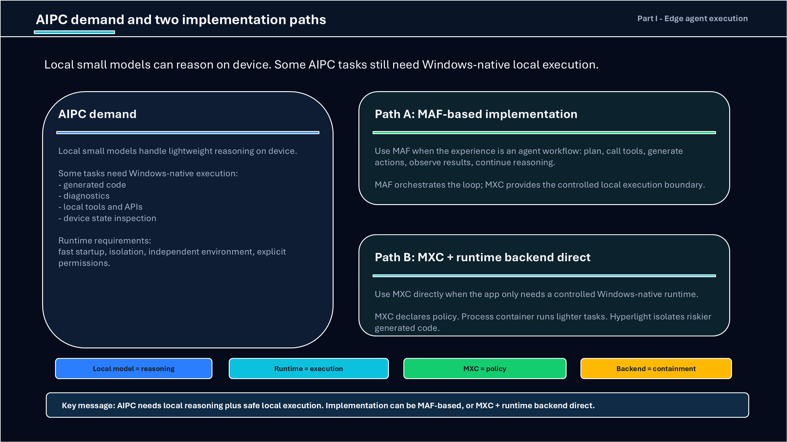
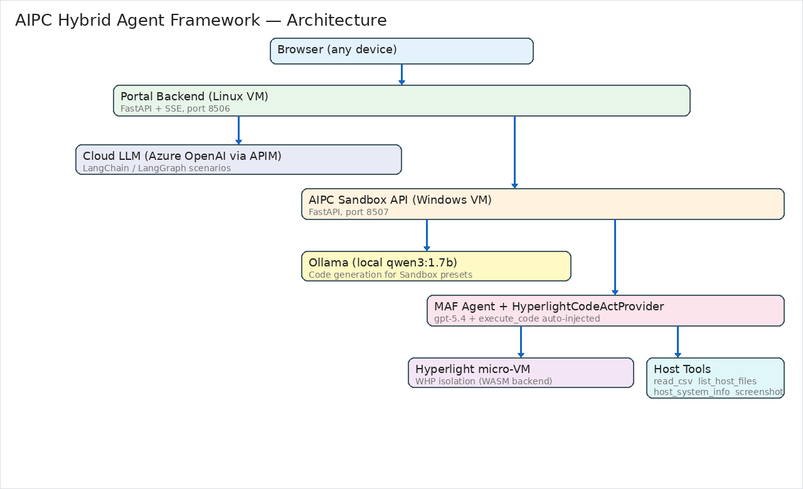
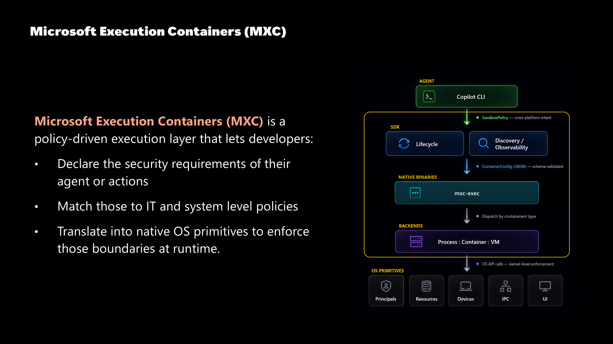

# AIPC Edge Agent Execution: Two Paths to Windows-Native Local Runtime

[](https://github.com/microsoft/agent-framework) [](https://github.com/microsoft/mxc) [](https://github.com/hyperlight-dev/hyperlight) [](https://www.python.org/) [](https://opensource.org/licenses/MIT)

AIPC needs local reasoning plus safe local execution. This repo evaluates two implementation paths from Build 2026 (BRK262 / KEY01): **Path A — MAF-based full agent loop**, and **Path B — MXC + runtime backend direct**. All test code, policy profiles, and evidence logs are included.

> **Author**: Xinyu Wei (魏新宇) — Microsoft AI GBB Senior System Engineer

[中文版](README-CN.md) | English

---

## AIPC Two-Path Architecture (from Build 2026)

<div align="center">
  
</div>

>> Source: Build 2026 BRK262 + KEY01. Local small models can reason on device. Some AIPC tasks still need Windows-native local execution.

**Path A vs Path B — how to choose:**

| | Path A: MAF-based implementation | Path B: MXC + Runtime Backend Direct |
|---|---|---|
| **Scenario** | Complete hybrid cloud+local agent workflow | App only needs controlled Windows-native runtime, no full agent loop |
| **How it works** | Planning → call tools → generate action → observe → continue reasoning; MAF orchestration loop | MXC declares policy; ProcessContainer runs lighter tasks; Hyperlight isolates highest-risk generated code |
| **Representative demo** | CodeAct in Agent Framework; MAF + AIPC demo | MXC Policy demo; OpenClaw file-delete blocked |
| **Core traits** | ✓ Full reasoning-action loop ✓ Dynamic tool calls ✓ Multi-step long tasks | ✓ Lighter, no MAF dependency ✓ Declarative security boundary ✓ Hardware-level isolation (when needed) |
| **Best for** | ISV building complex agent experiences | Lightweight safe execution scenarios |

> **Decision rule**: Need an agent reasoning loop? → Path A (MAF). Only need safe local execution? → Path B (MXC direct). Hyperlight isolates highest-risk generated code in either path.

### How to choose (detailed)

| | Path A: MAF-based | Path B: MXC + runtime backend direct |
|---|---|---|
| **Use when** | Complete agent workflow: planning, tool calls, HITL, CodeAct, recovery, cloud/local routing | Controlled local execution for a Windows-native action — no full agent loop needed |
| **Main loop** | MAF carries reasoning-action loop; Hyperlight isolates generated code when needed | App/model chooses action; MXC declares policy; **ProcessContainer** is the default backend; Hyperlight only for highest-risk generated code |
| **Technologies** | Microsoft Agent Framework, Hyperlight CodeAct, Ollama/Foundry Local, OTel | MXC SDK 0.7, **ProcessContainer** (primary), Hyperlight (optional escalation), JSON policy profiles |
| **Evidence in this repo** | Framework comparison, MAF workflow/HITL, Sandbox API, host tools | MXC --probe, task-scoped policy, capability catalog, ProcessContainer behavior |

The two paths are **not mutually exclusive**. Production can use MAF for agent experience + MXC for policy-governed local actions.

---

## Path A: MAF-Based Full Agent Loop

MAF carries: plan → call tools → generate action → observe → continue → HITL → cloud/local routing → telemetry.

### Live Demo

MAF + Hyperlight host tools on Windows AIPC (screenshot, system info, CSV analysis, WHP isolation):

https://github.com/user-attachments/assets/c2554bf2-da92-4a32-8692-0c576d7af376

<div align="center">
  
</div>

### Framework Comparison

| Dimension | LangChain | LangGraph | MAF |
|-----------|-----------|-----------|-----|
| Execution control | LLM decides | Developer graph | Both modes |
| State recovery | None | SQLite checkpoint | Workflow checkpoint |
| HITL | Manual | interrupt() | RequestInfoExecutor |
| Sandbox | None | None | agent-framework-hyperlight |
| Windows/.NET | No | No | Yes |
| Observability | LangSmith | LangSmith | Built-in OTel |
| Cloud hosting | No | No | Foundry Hosted Agents |

### Path A Test Results

| Script | Proves | Status |
|--------|--------|:------:|
| `scenarios/maf_travel_agent.py` | MAF + Ollama tool calling | ✅ |
| `scenarios/maf_workflow_travel.py` | MAF @workflow + HITL | ✅ |
| `scenarios/maf_workflow_demo.py` | MAF durable workflow + checkpoint | ✅ |
| `scenarios/langchain_travel_agent.py` | LangChain ReAct loop | ✅ |
| `scenarios/langgraph_travel_agent.py` | LangGraph StateGraph + SQLite | ✅ |
| `portal/sandbox_api.py` | Hyperlight Sandbox + 4 host tools | ✅ |
| `portal/server.py` | 4-tab comparison portal | ✅ |

### Path A Code: Hyperlight Sandbox + Host Tools

The AIPC Sandbox API registers 4 host tools with `HyperlightCodeActProvider`. The MAF Agent decides what code to write; Hyperlight executes it in a WHP-isolated micro-VM; `call_tool()` bridges back to host callbacks:

```python
# portal/sandbox_api.py — key excerpt
from agent_framework_hyperlight import HyperlightCodeActProvider

def read_csv(filename: str) -> str: ...      # host tool: read CSV from AIPC Desktop
def list_host_files(extension: str) -> str: ... # host tool: list files on AIPC
def host_system_info() -> str: ...              # host tool: hostname, OS, arch
def capture_screenshot() -> str: ...            # host tool: GDI CopyFromScreen

codeact = HyperlightCodeActProvider(
    tools=[read_csv, list_host_files, host_system_info, capture_screenshot],
)
agent = ChatCompletionAgent(
    name="AIPC-CodeAct",
    instructions="Use execute_code for EVERY request. Inside execute_code, call host tools via call_tool().",
    model_client=azure_client,
    code_act_provider=codeact,
)
result = await agent.run(task=user_query)
```

Sandbox code runs inside Hyperlight micro-VM (WASM backend, WHP isolation); `call_tool('read_csv', filename='sales_data.csv')` bridges out to the host process. The sandbox cannot access arbitrary host files — only the 4 registered tools are available.

### Path A Code: Standalone Hyperlight Sandbox

```python
# portal/sandbox_api.py — direct sandbox endpoint
from hyperlight_sandbox import Sandbox

async def sandbox_run(code: str):
    def _execute():
        sandbox = Sandbox(backend="wasm")
        result = sandbox.run_python(code)
        sandbox.close()
        return result
    return await asyncio.to_thread(_execute)  # keep Rust !Send on one thread
```

### CodeAct / Hyperlight Boundaries

- MAF does NOT call MXC today (MXC_MATCH_COUNT=0 in source, 2026-06-20)
- MAF CodeAct backend = Hyperlight (documented connector)
- Hyperlight does NOT manage host callbacks; host tools must be narrow

---

## Path B: MXC + Runtime Backend Direct

MXC is a policy-driven execution layer for controlled Windows-native execution without a full agent loop. The default backend is **ProcessContainer** (lighter, runs most tasks); Hyperlight is an optional escalation for highest-risk generated code only.

### Path B Demo

MXC policy-driven execution: task-scoped capability policy, ProcessContainer backend, Win32 capability catalog probe:

https://github.com/user-attachments/assets/581acf71-510b-489e-b3a4-af24e9977a35

<div align="center">
  
</div>

### MXC 0.7 Probe

`wxc-exec.exe --probe` raw output from `@microsoft/mxc-sdk@0.7.0`:

```json
{
  "tier": "appcontainer-dacl",
  "needsDaclAugmentation": true,
  "warnings": [
    "BaseContainer API not present or not preferred ... falling back to AppContainer + DACL"
  ],
  "probes": {
    "baseContainerApiPresent": true,
    "bfscfgPresent": false,
    "bfsCompiledIn": false,
    "uiCapabilities": {
      "canBlockClipboardRead": true,
      "canBlockClipboardWrite": true,
      "canBlockInputInjection": true,
      "canBlockInputMethodChanges": true,
      "canBlockExternalUiObjects": true,
      "canBlockGlobalUiNamespace": true,
      "canBlockDesktopSwitching": true,
      "canBlockLogoffOrShutdown": true,
      "canBlockSystemParameterChanges": true,
      "canBlockDisplaySettingsChanges": true
    }
  }
}
```

> Full output: `mxc/evidence/mxc_sdk_0_7_probe_raw.txt`

### Task-Scoped Capability Policy

Two MXC 0.7 policy profiles demonstrate task-scoped capability boundaries:

**text-lockdown** — blocks all UI, clipboard, input, network:

```json
{
  "version": "0.7.0-alpha",
  "containment": "processcontainer",
  "processContainer": {
    "name": "Task-Text-Lockdown",
    "ui": { "isolation": "container", "desktopSystemControl": false, "systemSettings": "none", "ime": false }
  },
  "network": { "defaultPolicy": "block" },
  "ui": { "disable": true, "clipboard": "none", "injection": false }
}
```

**drawing-ui** — allows GDI, clipboard, input, system params:

```json
{
  "version": "0.7.0-alpha",
  "containment": "processcontainer",
  "processContainer": {
    "name": "Task-Drawing-UiAllowed",
    "ui": { "isolation": "desktop", "desktopSystemControl": true, "systemSettings": "all", "ime": true }
  },
  "network": { "defaultPolicy": "block" },
  "ui": { "disable": false, "clipboard": "all", "injection": true }
}
```

A native Win32 probe ([`mxc/examples/win32_capability_probe.c`](mxc/examples/win32_capability_probe.c)) tests 9 Win32 APIs under each profile:

| Profile | Capabilities | Exit | Verdict |
|---------|-------------|:----:|--------|
| Host (no MXC) | N/A | 0 | 7/9 PASS |
| `text-lockdown` | No UI | -1073741502 | Process blocked |
| `drawing-ui` | GDI + sysParams + desktop | 0 | Process ran |

**Text task = locked down. Drawing task = GDI allowed.** This is the MXC vocabulary for Lenovo Qira task-scoped local execution.

> Policy files: `mxc/evidence/task-rbac-text-lockdown.json`, `mxc/evidence/task-rbac-drawing-ui.json`
> Probe logs: `mxc/evidence/task_rbac_*.log`

### Path B Code: Win32 Capability Probe (C)

The native probe tests individual Win32 API entrypoints to verify what MXC policy actually blocks:

```c
// mxc/examples/win32_capability_probe.c — key probes
static void probe_get_dc(void) {
    HDC dc = GetDC(NULL);
    report_bool("GDI_GetDC", dc != NULL, GetLastError());
    if (dc) ReleaseDC(NULL, dc);
}

static void probe_clipboard_open(void) {
    BOOL ok = OpenClipboard(NULL);
    report_bool("Clipboard_OpenClipboard", ok, GetLastError());
    if (ok) CloseClipboard();
}

static void probe_create_desktop(void) {
    HDESK desktop = CreateDesktopW(name, NULL, NULL, 0, GENERIC_ALL, NULL);
    report_bool("Desktop_CreateDesktop", desktop != NULL, GetLastError());
    if (desktop) CloseDesktop(desktop);
}
// ... 9 probes total: GDI, Clipboard, Desktop, Display, SystemParams,
//     Input, Registry, Camera DLL, WMI DLL
```

### Path B Code: Network Policy

MXC can block or allow external network access per-action. We tested two scenarios:

**Test 1: Direct curl** — `curl https://api.github.com` under two policies:

```json
// mxc/policies/02-network-block.json
{
  "containment": "processcontainer",
  "process": { "commandLine": "curl -s https://api.github.com", "timeout": 15000 },
  "processContainer": { "name": "VSCode-Network-Block" },
  "network": { "defaultPolicy": "block" }
}

// mxc/policies/03-network-allow.json — adds:
  "processContainer": { "capabilities": ["internetClient"] },
  "network": { "defaultPolicy": "allow" }
```

Actual results from `wxc-exec`:

| Policy | curl output | Exit code | Verdict |
|--------|-----------|:---------:|---------|
| `network-block` | `mxc_http:000` (connection failed) | 6 | ✅ Network correctly blocked |
| `network-allow` | `mxc_http:200` (GitHub API responded) | 0 | ✅ Network correctly allowed |

> Evidence: `mxc/evidence/03_network_block.log` (`mxc_http:000`, exit=6), `mxc/evidence/04_network_allow.log` (`mxc_http:200`, exit=0)

**Test 2: pip install** — `pip install six==1.16.0` under block/allow policies:

| Policy | pip result | Exit | Root cause |
|--------|-----------|:----:|------------|
| `network-block` | Failed | -1 | BFS filesystem policy error — `bfscfg.exe` not resolved on `appcontainer-dacl` tier |
| `network-allow` | Failed | -1 | Same BFS error — pip needs `readwritePaths` for `--target` directory, which requires BFS |

> Both pip tests hit the same filesystem policy error before reaching the network layer. The network block/allow distinction is proven by the curl test; pip install additionally requires filesystem policy (`readwritePaths`) which is not available on the current `appcontainer-dacl` fallback tier.

### Filesystem Policy

MXC can scope which directories a contained process can read and write via `readwritePaths` and `readonlyPaths`. We tested 4 scenarios writing to `C:\temp\mxc-fs-test\`:

**Test policies:**

```json
// fs-policy-02-readwrite-allowed.json — allow write to target directory
{
  "version": "0.7.0-alpha",
  "containment": "processcontainer",
  "process": {
    "commandLine": "cmd.exe /c echo MXC_FS_WRITE_ALLOWED > C:\\temp\\mxc-fs-test\\allowed.txt && type C:\\temp\\mxc-fs-test\\allowed.txt",
    "timeout": 15000
  },
  "processContainer": { "name": "FS-ReadWrite-Allowed" },
  "network": { "defaultPolicy": "block" },
  "filesystem": { "readwritePaths": ["C:\\temp\\mxc-fs-test"] }
}
```

**Actual results:**

| Test | Policy | Exit | Verdict |
|------|--------|:----:|---------|
| 01 baseline | No `filesystem` field | 1 | ❌ `Access is denied` — ProcessContainer default blocks write to `C:\temp` |
| 02 readwrite-allowed | `readwritePaths: ["C:\temp\mxc-fs-test"]` | **0** | ✅ **Write succeeded** — `allowed.txt` created with content `MXC_FS_WRITE_ALLOWED` |
| 03 readwrite-blocked | `readwritePaths` points to a different directory | 1 | ❌ Write blocked — target dir not in allow list |
| 04 readonly | `readonlyPaths: ["C:\temp\mxc-fs-test"]` only | 1 | ❌ `Access is denied` — read-only cannot write |

**Key finding**: `readwritePaths` works on the current `appcontainer-dacl` fallback tier for simple file write operations. This means MXC can enforce per-action filesystem scoping today — an agent action that should only write to `%APPDATA%\app-data` gets a policy that allows exactly that directory, and writes elsewhere are blocked.

> The earlier pip install test failed because pip needs complex filesystem redirection (BFS) for `--target` directory management, not simple file writes. Simple `readwritePaths` scoping works without BFS.

> Evidence: `mxc/evidence/fs-policy-*.json` (policies), `mxc/evidence/fs_policy_*.log` (execution logs)

### Capability Catalog (9 Win32 probes × 4 contexts)

| Capability | Host | text-lockdown | gdi-minimal | broad-ui |
|-----------|:----:|:-------------:|:-----------:|:--------:|
| GDI_GetDC | ✅ | BLOCKED | ✅ | ✅ |
| Clipboard_OpenClipboard | ✅ | BLOCKED | ❌ | ❌ |
| Desktop_CreateDesktop | ✅ | BLOCKED | ❌ | ❌ |
| Display_ChangeDisplaySettings | ✅ | BLOCKED | ❌ | ❌ |
| SystemParametersInfo | ✅ | BLOCKED | ✅ | ✅ |
| Input_SendInput | ❌ | BLOCKED | ❌ | ❌ |
| Registry_HKCU_Read | ✅ | BLOCKED | ✅ | ✅ |
| CameraStack_Load_MF_DLL | ✅ | BLOCKED | ✅ | ✅ |
| WMI_Load_wbemuuid_DLL | ❌ | BLOCKED | ❌ | ❌ |

- `text-lockdown` blocks entire process (most restrictive)
- Clipboard block on gdi-minimal/broad-ui is environment tier limitation (official clipboard-allow examples exist)

### Path B Boundaries

- Current tier: `appcontainer-dacl` (fallback)
- MXC = early preview, not production security boundary
- Camera/fan/Android not proven

---

## Running on Azure

| Resource | SKU | Purpose |
|----------|-----|---------|
| Portal VM | Linux D4s_v5, East Asia | FastAPI + nginx |
| AIPC VM | Windows 11, NPU | Hyperlight + Ollama + MAF |
| Azure OpenAI | gpt-5.4 via APIM | Cloud LLM |

## Project Structure

```
├── images/                     # Slides + architecture
├── scenarios/                  # Path A: framework scripts
├── portal/                     # Path A: demo portal + sandbox API
├── aipc/                       # Path A: Windows service config
├── mxc/                        # Path B: MXC test code + evidence
│   ├── scripts/Invoke-MXCDemo.ps1
│   ├── examples/win32_capability_probe.c
│   ├── policies/ (13 JSON profiles)
│   └── evidence/ (30+ logs)
├── .env.example / requirements.txt
└── README.md / README-CN.md
```

## Setup

### Path A

```bash
pip install -r requirements.txt && cp .env.example .env
python portal/server.py       # Portal :8506
python portal/sandbox_api.py  # AIPC :8507
```

### Path B

```powershell
npm install @microsoft/mxc-sdk@0.7.0
.\node_modules\.bin\wxc-exec.exe --probe
powershell -File mxc\scripts\Invoke-MXCDemo.ps1
```

## Tech Stack

| Component | Version |
|-----------|---------|
| Microsoft Agent Framework | 1.8+ |
| MXC SDK | 0.7.0 |
| Hyperlight | 0.3+ |
| LangChain / LangGraph | 0.3+ / 0.4+ |
| Python / FastAPI | 3.12 / 0.115+ |

## Related Repos

- [Hyperlight & MXC Sandbox Landscape](../Hyperlight-MXC-Sandbox-Landscape/)
- [Microsoft Agent Framework Demos](../Microsoft-Agent-Framework/)
