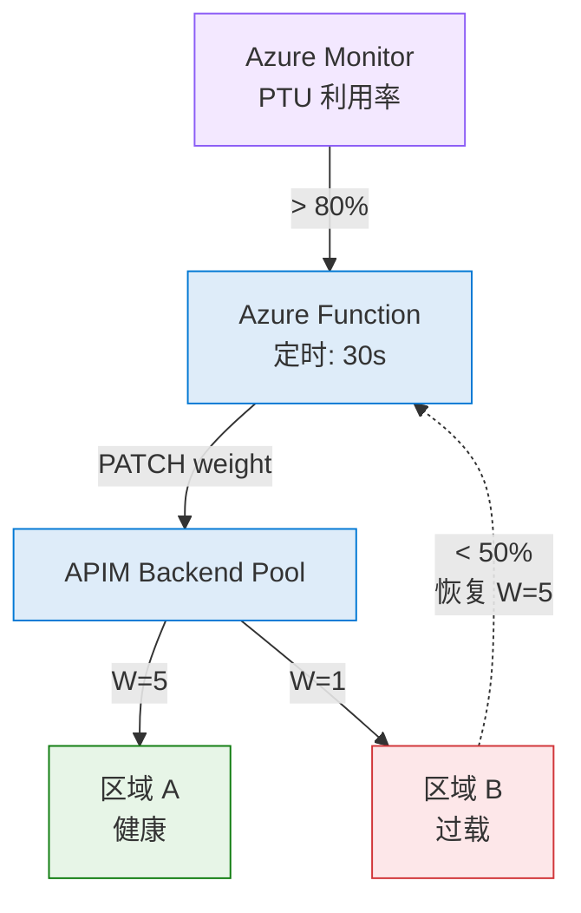

# Azure OpenAI 多区域负载均衡 — APIM AI Gateway

**Author**: Xinyu Wei (魏新宇)

本指南演示如何使用 **Azure API Management (APIM) AI Gateway** 对多个 Azure OpenAI endpoint 实现负载均衡，结合 **Priority/Weight 路由**、**Circuit Breaker** 和 **Backend Pool** — 生产级 GenAI 高可用推荐架构。

## 背景：PTU 与 Spillover

### 什么是 PTU？

**Provisioned Throughput Unit (PTU，预置吞吐量)** 是 Azure OpenAI 的预留容量方案。与按量付费 (PAYGO) 不同，PTU 提供：
- **保证吞吐量**：固定的 tokens-per-minute (TPM) 配额，延迟可预测
- **成本可控**：按小时固定费率计费，不受实际用量影响
- **更低延迟**：专用算力，无共享租户排队

代价：当 PTU 配额耗尽时，Azure OpenAI 返回 **HTTP 429** (Too Many Requests)。没有网关层时，该区域所有用户都会遇到失败。

### 什么是 Spillover？

**Spillover** 是 Azure OpenAI 的原生溢出机制。当 PTU deployment 饱和 (429/400/500) 时，流量自动回退到**同一 Azure OpenAI 资源**内的 Standard (PAYGO) deployment：

```
│  Azure OpenAI 资源       │
│                          │
│  PTU Deployment          │ ← 主力（低延迟，固定成本）
│     ▼ spillover          │
│  Standard Deployment     │ ← 溢出（PAYGO，延迟较高）
│  (PAYGO)                 │
```

Spillover 在 Azure AI Foundry Portal 配置，无需网关。文档：[Spillover Traffic Management](https://learn.microsoft.com/en-us/azure/foundry/openai/how-to/spillover-traffic-management)

### 为什么还需要 APIM？

Spillover 处理**区域内**溢出（PTU→Standard）。但生产环境需要**跨区域**故障切换 — 当整个区域饱和或不可用时。这就是 APIM 的价值：

| 层级 | 范围 | 机制 | 处理场景 |
|------|------|------|---------|
| **APIM** | 跨区域 | Backend Pool + Circuit Breaker | 区域 A 饱和 → 路由到区域 B |
| **Spillover** | 区域内 | Azure OpenAI 原生 | PTU 饱和 → 溢出到 Standard |

### 关于本 Demo

> **重要说明**：本 Demo 使用 **GlobalStandard (PAYGO)** deployment 模拟 PTU 场景。我们**没有**部署实际的 PTU 实例（PTU 会产生按小时预留费用）。APIM 网关配置 — backend pool、circuit breaker、priority 路由、token 限流、动态 weight 调整 — 无论后端使用 PTU 还是 PAYGO **配置完全相同**。以下所有测试结果均为 Azure 真实部署的实测数据。

## 架构


### 核心设计决策

| 决策 | 理由 |
|------|------|
| **APIM Backend Pool** | 客户端调用单一 endpoint；APIM 按 Priority/Weight 分发到多个后端 |
| **Priority + Weight 负载均衡** | 相同 Priority = Active-Active（同时接收流量）。Weight 控制分发比例 |
| **Circuit Breaker** | 429（限流）或 5xx 错误时，APIM 触发断路器，停止向该后端路由并尊重 AOAI 的 `Retry-After` header |
| **API Key 或 MI 认证** | Backend credentials 存储在 APIM backend 实体中，支持 header 中的 API Key 或 Managed Identity |

## 前提条件

- Azure 订阅（需 **Contributor** 角色）
- Azure CLI（`az --version >= 2.60`）
- 2 个以上不同区域的 Azure OpenAI 资源
- 每个区域部署相同的模型

## 部署步骤

### Step 1: 创建 Azure OpenAI Deployment

确保在每个 AOAI 资源中部署了相同的模型：

```bash
# 区域 A
az cognitiveservices account deployment create \
  --name <your-aoai-resource-a> \
  --resource-group <your-rg> \
  --deployment-name gpt-4o-mini \
  --model-name gpt-4o-mini \
  --model-version "2024-07-18" \
  --model-format OpenAI \
  --sku-capacity 2000 \
  --sku-name GlobalStandard

# 区域 B — 相同模型，不同区域
# (同上，替换资源名)
```

> **说明**: PTU（Provisioned Throughput，预置吞吐量）使用 `--sku-name ProvisionedManaged`。本指南使用 `GlobalStandard`（按量计费）演示。APIM 网关配置对两种 SKU 完全相同。

### Step 2: 创建 Backend（带 Circuit Breaker）

```bash
APIM_BASE="https://management.azure.com/subscriptions/<sub-id>/resourceGroups/<rg>/providers/Microsoft.ApiManagement/service/<apim-name>"

# 区域 A
az rest --method PUT \
  --url "${APIM_BASE}/backends/aoai-region-a?api-version=2024-06-01-preview" \
  --body '{
    "properties": {
      "url": "https://<your-aoai-a>.openai.azure.com",
      "protocol": "http",
      "credentials": {"header": {"api-key": ["<your-key-a>"]}},
      "circuitBreaker": {
        "rules": [{
          "name": "breakOnErrors",
          "failureCondition": {
            "count": 3, "interval": "PT10S",
            "statusCodeRanges": [{"min":429,"max":429},{"min":500,"max":599}],
            "percentage": 50
          },
          "tripDuration": "PT30S",
          "acceptRetryAfter": true
        }]
      }
    }
  }'

# 区域 B — 相同结构，不同 URL 和 Key
az rest --method PUT \
  --url "${APIM_BASE}/backends/aoai-region-b?api-version=2024-06-01-preview" \
  --body '{
    "properties": {
      "url": "https://<your-aoai-b>.openai.azure.com",
      "protocol": "http",
      "credentials": {"header": {"api-key": ["<your-key-b>"]}},
      "circuitBreaker": {
        "rules": [{
          "name": "breakOnErrors",
          "failureCondition": {
            "count": 3, "interval": "PT10S",
            "statusCodeRanges": [{"min":429,"max":429},{"min":500,"max":599}],
            "percentage": 50
          },
          "tripDuration": "PT30S",
          "acceptRetryAfter": true
        }]
      }
    }
  }'
```

### Step 3: 创建 Backend Pool

```bash
az rest --method PUT \
  --url "${APIM_BASE}/backends/aoai-lb-pool?api-version=2024-06-01-preview" \
  --body '{
    "properties": {
      "type": "Pool",
      "pool": {
        "services": [
          {"id": ".../backends/aoai-region-a", "priority": 1, "weight": 5},
          {"id": ".../backends/aoai-region-b", "priority": 1, "weight": 5}
        ]
      }
    }
  }'
```

**Priority + Weight 解释**:
- 相同 Priority（P1 = P1）→ Active-Active，两个后端同时接收流量
- 相同 Weight（W5 = W5）→ 50/50 Round-Robin
- 主备模式：Primary 设 P1，Standby 设 P2（P1 断路后才启用 P2）

### Step 4: 创建 API（path=""）

> **重要**: 设 `path: ""`（空字符串），让 `/openai/deployments/...` 完整路径原样转发到后端。

```bash
az rest --method PUT \
  --url "${APIM_BASE}/apis/azure-openai-lb?api-version=2024-06-01-preview" \
  --body '{"properties":{"displayName":"Azure OpenAI (Load Balanced)","path":"","protocols":["https"],"subscriptionRequired":true,"subscriptionKeyParameterNames":{"header":"api-key","query":"api-key"}}}'
```

### Step 5: 添加通配符 Operation + Policy

```xml
<policies>
  <inbound>
    <base />
    <set-backend-service backend-id="aoai-lb-pool" />
  </inbound>
  <backend>
    <forward-request timeout="180" />
  </backend>
  <outbound><base /></outbound>
  <on-error><base /></on-error>
</policies>
```

通过 REST API 设置 policy（用 Python 避免 shell 转义问题）：

```python
import subprocess, json

policy_xml = '''<policies>
  <inbound>
    <base />
    <set-backend-service backend-id="aoai-lb-pool" />
  </inbound>
  <backend><forward-request timeout="180" /></backend>
  <outbound><base /></outbound>
  <on-error><base /></on-error>
</policies>'''

body = json.dumps({"properties": {"value": policy_xml, "format": "xml"}})
url = "https://management.azure.com/subscriptions/<sub-id>/.../apis/azure-openai-lb/policies/policy?api-version=2024-06-01-preview"

subprocess.run(["az", "rest", "--method", "PUT", "--url", url,
    "--headers", "Content-Type=application/json",
    "--body", body, "--output-file", "/tmp/policy_result.bin"])
```

> **注意**: `az rest` 返回 XML 带 UTF-8 BOM 会导致 Windows 上编码错误。使用 `--output-file` 规避。

### Step 6: 测试

```bash
curl -si -X POST "https://<your-apim>.azure-api.net/openai/deployments/gpt-4o-mini/chat/completions?api-version=2024-08-01-preview" \
  -H "api-key: <your-apim-subscription-key>" \
  -H "Content-Type: application/json" \
  -d '{"messages":[{"role":"user","content":"Hello"}],"max_tokens":10}'
```

响应示例（关键 headers）：

```
HTTP/1.1 200 OK
x-ms-region: Sweden Central              ← 哪个后端处理了此请求
apim-request-id: d49f6387-bb30-...       ← APIM 追踪 ID
x-ratelimit-remaining-tokens: 1999967    ← token 预算剩余（启用 token-limit policy 时）

{"choices":[{"message":{"content":"Hello! How can I assist you today?"...}}],...}
```

多次请求后检查 `x-ms-region` 确认负载均衡分布。

## 真实测试结果


使用 2 个 AOAI backend（East US 2 + Sweden Central），相同权重（P1:W5），gpt-4o-mini GlobalStandard。

### 负载均衡分布（20 个顺序请求）

```
Total: 20  |  Success: 20  |  429: 0
Latency   avg=1.54s  min=1.05s  max=2.66s  P50=1.41s  P95=2.66s

Backend 分布:
  Sweden Central    10 (50%) ████████████
  East US 2         10 (50%) ████████████
```

### 高并发

| 并发数 | 成功率 | P50 | P95 | Backend 分布 |
|--------|--------|-----|-----|-------------|
| C=5  | 4/5  | 2.76s | 3.66s | 50/50 |
| C=10 | 10/10 | 2.24s | 3.07s | 50/50 |
| C=20 | 20/20 | 2.24s | 3.25s | 50/50 |

### Circuit Breaker（故障注入）

```
阶段 A: 8/8 成功  {Region A: 4, Region B: 4}
阶段 B: 注入 6x HTTP 404
阶段 C: 8/8 成功  {Region A: 4, Region B: 4}
结论: PASS — APIM 在故障后正常恢复路由 ✓
```

### 持续吞吐量（30s @ 3 rps）

```
Total: 22  |  Success: 22  |  429: 0
P50=1.32s  P95=1.77s  P99=3.04s
Backend: Region A: 11 (50%) | Region B: 11 (50%)
```

### Priority 主备模式

P1（Primary）/ P2（Standby）配置 — Standby 不接收流量：

| 测试 | 配置 | 区域 A | 区域 B | 效果 |
|------|------|--------|--------|------|
| **Active-Active** | P1:P1 | 50% | 50% | 均衡 |
| **A 为主** | A=P1, B=P2 | **100%** | 0% | ✅ Standby 零流量 |
| **B 为主** | B=P1, A=P2 | 0% | **100%** | ✅ 反转确认 |

**关键发现**: Priority 传播需 ~15 秒。传播后路由 100% 确定。

### Token 限流（azure-openai-token-limit）

APIM 层 Token 限流，防止单客户端耗尽共享 PTU 配额：

```
[01] HTTP 200 | remaining-tokens=1999960 | tokens=78
[02] HTTP 200 | tokens=78
[03] HTTP 200 | tokens=80  ← 累计 ~236 tokens
[04] HTTP 429 ⚠ retry-after=7s  ← APIM token limit 触发
...
[15] HTTP 429 ⚠ retry-after=2s  ← token 桶恢复倒计时
```

**Policy**（添加到 inbound）:
```xml
<azure-openai-token-limit
  tokens-per-minute="2000"
  counter-key="@(context.Subscription.Id)"
  estimate-prompt-tokens="true"
  remaining-tokens-variable-name="remainingTokens" />
<azure-openai-emit-token-metric namespace="AzureOpenAI">
  <dimension name="Subscription ID" />
  <dimension name="API ID" />
</azure-openai-emit-token-metric>
```

**可观测性**: 每个响应返回 `x-ratelimit-remaining-tokens` 头，实时显示 token 预算。`emit-token-metric` 发送使用量到 App Insights 做 Dashboard。

## 主动监控 PTU 利用率 — 动态 Weight 路由

### 被动 vs 主动

Circuit Breaker 是**被动方案** — AOAI 已返回 429 时才触发。PTU 生产环境需要**主动监控**: 利用率接近 100% **之前**就偏移流量。

### 架构



```
Azure Monitor (PTU Utilization metric)
  │ ProvisionedManagedUtilizationV2 > 80%
  ▼
Alert Rule → Action Group → Azure Function (每 30s)
  │
  │  调用 APIM REST API:
  │  PUT /backends/<pool-name>
  │
```

### 通过 APIM REST API 动态更新 Weight

```python
# 核心逻辑（Azure Function，timer trigger 每 30s）:
def check_and_adjust():
    for backend in backends:
        util = query_azure_monitor(backend.resource_id,
                    "AzureOpenAIProvisionedManagedUtilizationV2")
        if util > 80:
            set_backend_weight(backend, weight=1)   # 降权
        elif util < 50:
            set_backend_weight(backend, weight=5)   # 恢复

# APIM pool weight 更新:
PUT /backends/aoai-lb-pool
{
  "properties": {
    "type": "Pool",
    "pool": {
      "services": [
        {"id": ".../backends/region-a", "priority": 1, "weight": 1},
        {"id": ".../backends/region-b", "priority": 1, "weight": 5}
      ]
    }
  }
}
```

### 测试结果：动态 Weight 路由

通过 APIM REST API 实时更新 Backend Pool 权重（每阶段 n=30 请求）:

| 阶段 | 权重配置 | 区域 A | 区域 B | 效果 |
|------|---------|--------|--------|------|
| **1. 基线** | 5:5 | 15 (50%) | 15 (50%) | 完美均衡 |
| **2. 降权** | 1:5 | 8 (27%) | 22 (73%) | ✅ 流量偏移 |
| **3. 紧急排空** | 1:100 | 0 (0%) | 30 (100%) | ✅ 100% 切走 |
| **4. 恢复** | 5:5 | 15 (50%) | 15 (50%) | ✅ 完美恢复 |

**关键发现**:
- Weight 变更 3-5 秒内生效
- W=1:100 实现 100% 排空 — 适合紧急切换
- 恢复瞬间完成，回到 50/50

详见 [monitor_and_route.py](monitor_and_route.py)（支持 demo / daemon / metrics 三种模式）。

## 结合 AOAI Native Spillover

PTU 部署场景下，可以组合 APIM 负载均衡与 **Azure OpenAI Native Spillover**:

```
                    APIM AI Gateway
                    (跨区域 LB)
                         │
              ▼                     ▼
```

- **APIM**: 跨区域故障切换和负载均衡
- **Native Spillover**: 区域内 PTU→Standard 溢出（在 Azure AI Foundry 配置，无需网关）
- PTU 和 Standard deployment 必须在**同一 AOAI 资源**中

文档: [Azure OpenAI Spillover Traffic Management](https://learn.microsoft.com/en-us/azure/foundry/openai/how-to/spillover-traffic-management)

## 常见问题排查

### 404 "Resource not found"

**根因**: API `path="openai"` 导致 APIM 剥离 `/openai` 前缀后转发，后端 URL 缺少 `/openai` → URL 不完整。

**修复**: 设 API `path=""`（空）。完整 URL `/openai/deployments/...` 原样转发到后端。

**替代方案**: 保留 `path="openai"`，但后端 URL 设为 `https://<your-resource>.openai.azure.com/openai`。

### 401 — Managed Identity 认证失败

**根因**: RBAC 授权给了错误的 APIM MI principal ID，或 RBAC 传播延迟（最长 10 分钟）。

**修复**: 确认 APIM MI：
```bash
az apim show --name <apim-name> --resource-group <rg> --query "identity.principalId"
```
在每个 AOAI 资源上授予 `Cognitive Services OpenAI User` 角色。

**注意**: BasicV2 tier 上 `authentication-managed-identity` policy 可能有稳定性问题。**绕过方案**: 在 backend `credentials.header.api-key` 直接配置 AOAI API Key，简单可靠。

### `az rest` XML 响应 BOM 编码错误

**症状**: `az rest` 返回 `UnicodeEncodeError: 'charmap' codec can't encode character '\ufeff'`（APIM 返回 XML 响应时）。

**根因**: Windows az CLI 无法处理 XML 响应中的 UTF-8 BOM。

**绕过**:
```bash
# PUT 使用 --output-file（返回 XML）
az rest --method PUT ... --output-file /tmp/result.bin

# GET 使用 curl + Bearer token
TOKEN=$(az account get-access-token --query accessToken -o tsv)
curl -H "Authorization: Bearer $TOKEN" "https://management.azure.com/...?api-version=2024-06-01-preview"
```

## APIM 配置汇总

### Backend（带 Circuit Breaker）
```json
{
  "url": "https://<your-aoai>.openai.azure.com",
  "protocol": "http",
  "credentials": {
    "header": {"api-key": ["<your-aoai-key>"]}
  },
  "circuitBreaker": {
    "rules": [{
      "name": "breakOnErrors",
      "failureCondition": {
        "count": 3,
        "interval": "PT10S",
        "statusCodeRanges": [{"min": 429, "max": 429}, {"min": 500, "max": 599}],
        "percentage": 50
      },
      "tripDuration": "PT30S",
      "acceptRetryAfter": true
    }]
  }
}
```

### Backend Pool
```json
{
  "type": "Pool",
  "pool": {
    "services": [
      {"id": ".../backends/aoai-region-a", "priority": 1, "weight": 5},
      {"id": ".../backends/aoai-region-b", "priority": 1, "weight": 5}
    ]
  }
}
```

### API Policy（含 Token 限流 + 指标收集）
```xml
<policies>
  <inbound>
    <base />
    <set-backend-service backend-id="aoai-lb-pool" />
    <azure-openai-token-limit
      tokens-per-minute="2000"
      counter-key="@(context.Subscription.Id)"
      estimate-prompt-tokens="true"
      remaining-tokens-variable-name="remainingTokens" />
    <azure-openai-emit-token-metric namespace="AzureOpenAI">
      <dimension name="Subscription ID" />
      <dimension name="API ID" />
    </azure-openai-emit-token-metric>
  </inbound>
  <backend>
    <forward-request timeout="180" />
  </backend>
  <outbound><base /></outbound>
  <on-error><base /></on-error>
</policies>
```

## 测试脚本

```bash
python test_gateway.py --test lb           # 负载均衡分布
python test_gateway.py --test concurrency  # 高并发
python test_gateway.py --test circuit      # Circuit Breaker
python test_gateway.py --test ratelimit    # 429 限流
python test_gateway.py --test throughput   # 持续吞吐量
python test_gateway.py --test all          # 全部测试
```

```bash
python monitor_and_route.py --mode demo      # 完整生命周期 Demo
python monitor_and_route.py --mode daemon    # 真实监控循环
python monitor_and_route.py --mode metrics   # 查询当前指标
```

## 参考文档

- [APIM Backend Pool & Circuit Breaker](https://learn.microsoft.com/en-us/azure/api-management/backends?tabs=bicep)
- [AOAI Spillover Traffic Management](https://learn.microsoft.com/en-us/azure/foundry/openai/how-to/spillover-traffic-management)
- [APIM GenAI Gateway Capabilities](https://learn.microsoft.com/en-us/azure/api-management/genai-gateway-capabilities)
