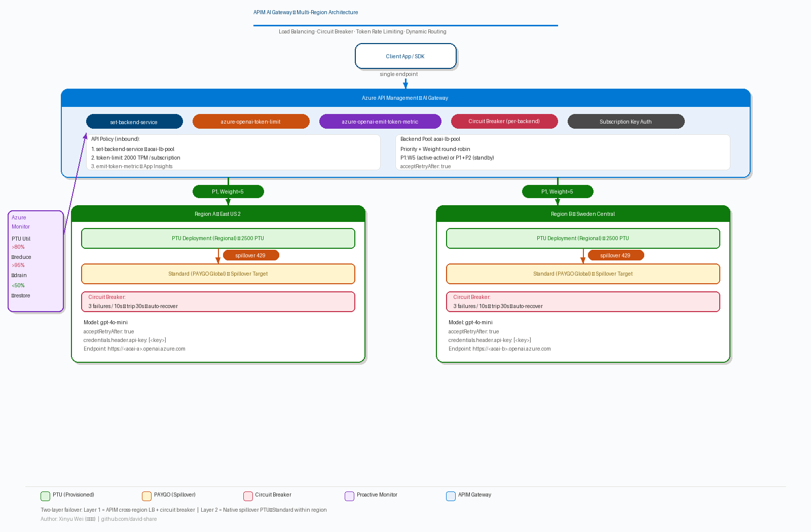
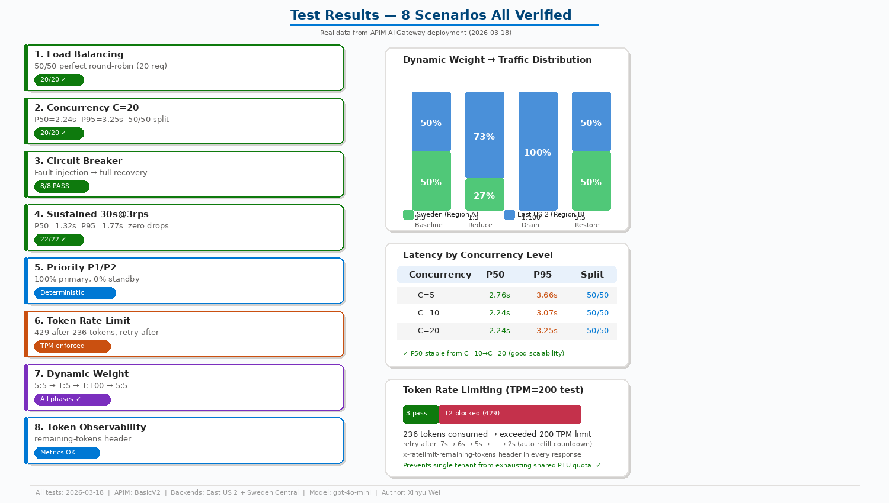
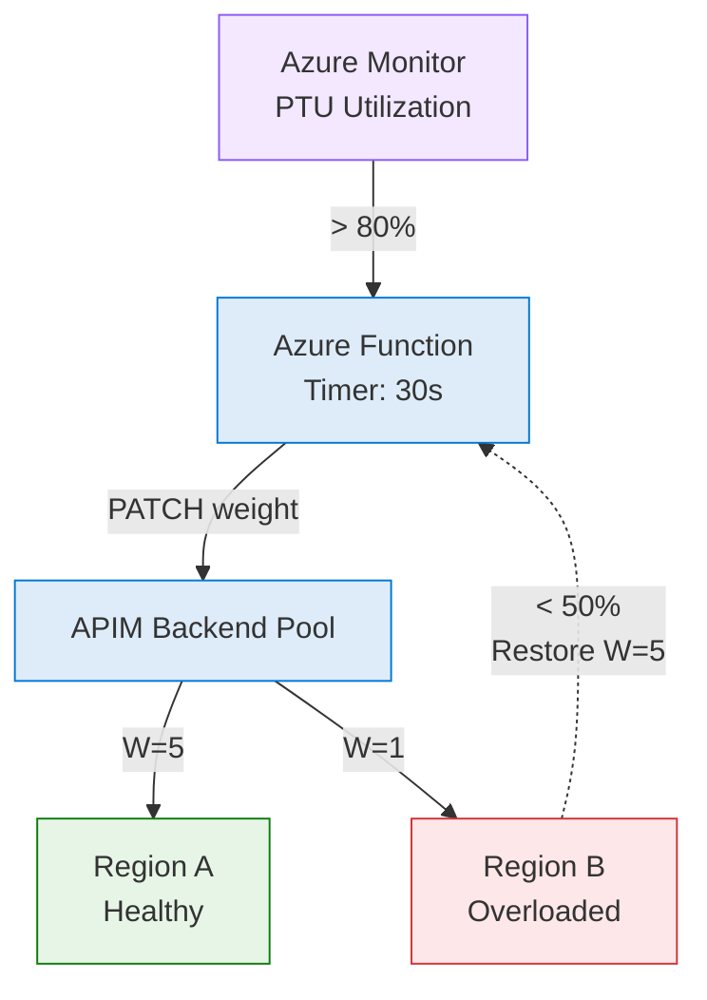

# Azure OpenAI Multi-Region Load Balancing with APIM AI Gateway

**Author**: Xinyu Wei (魏新宇)

This guide demonstrates how to set up **Azure API Management (APIM) AI Gateway** to load-balance across multiple Azure OpenAI endpoints with **priority/weight-based routing**, **circuit breaker**, and **backend pool** — the recommended architecture for production GenAI workloads requiring high availability.

## Background: PTU and Spillover

### What is PTU?

**Provisioned Throughput Unit (PTU)** is Azure OpenAI's reserved capacity offering. Unlike pay-as-you-go (PAYGO), PTU provides:
- **Guaranteed throughput**: Fixed tokens-per-minute (TPM) quota with predictable latency
- **Cost predictability**: Hourly billing at a fixed rate, regardless of actual usage
- **Lower latency**: Dedicated compute, no shared-tenant queuing

The tradeoff: when PTU quota is exhausted, Azure OpenAI returns **HTTP 429** (Too Many Requests). Without a gateway layer, this means all users in that region experience failures.

### What is Spillover?

**Spillover** is Azure OpenAI's native overflow mechanism. When a PTU deployment is saturated (429/400/500), traffic automatically falls back to a Standard (PAYGO) deployment **in the same Azure OpenAI resource**:

```
│  Azure OpenAI Resource   │
│                          │
│  PTU Deployment          │ ← Primary (low latency, fixed cost)
│     ▼ spillover          │
│  Standard Deployment     │ ← Overflow (PAYGO, higher latency)
│  (PAYGO)                 │
```

Spillover is configured in Azure AI Foundry Portal — no gateway needed. See: [Spillover Traffic Management](https://learn.microsoft.com/en-us/azure/foundry/openai/how-to/spillover-traffic-management)

### Why APIM on Top of Spillover?

Spillover handles **within-region** overflow (PTU→Standard). But production workloads need **cross-region** failover — when an entire region is saturated or down. That's where APIM comes in:

| Layer | Scope | Mechanism | Handles |
|-------|-------|-----------|---------|
| **APIM** | Cross-region | Backend Pool + Circuit Breaker | Region A saturated → route to Region B |
| **Spillover** | Within-region | Native Azure OpenAI | PTU saturated → overflow to Standard |

### About This Demo

> **Important**: This demo uses **GlobalStandard (PAYGO)** deployments to simulate the PTU scenario. We did **not** deploy actual PTU instances (which would incur hourly reserved charges). The APIM gateway configuration — backend pool, circuit breaker, priority routing, token rate limiting, dynamic weight adjustment — is **identical** regardless of whether backends use PTU or PAYGO. All test results below are real data from live Azure deployments.

## Architecture



### Key Design Decisions

| Decision | Rationale |
|----------|-----------|
| **APIM Backend Pool** | Client calls a single endpoint; APIM distributes traffic across backends using priority/weight |
| **Priority + Weight LB** | Same priority = active-active (both receive traffic). Weight controls distribution ratio |
| **Circuit Breaker** | On 429 (rate-limited) or 5xx errors, APIM trips the breaker, stops routing to that backend for `tripDuration`, and respects AOAI's `Retry-After` header |
| **API Key or MI Auth** | Backend credentials stored in APIM backend entity — supports API key in header or Managed Identity |

## Prerequisites

- Azure subscription with **Contributor** role
- Azure CLI (`az --version >= 2.60`)
- 2+ Azure OpenAI resources in different regions
- Same model deployed in each region

## Step-by-Step Deployment

### Step 1: Create Azure OpenAI Deployments

Ensure the same model is deployed in each AOAI resource:

```bash
# Region A
az cognitiveservices account deployment create \
  --name <your-aoai-resource-a> \
  --resource-group <your-rg> \
  --deployment-name gpt-4o-mini \
  --model-name gpt-4o-mini \
  --model-version "2024-07-18" \
  --model-format OpenAI \
  --sku-capacity 2000 \
  --sku-name GlobalStandard

# Region B — same model, different region
az cognitiveservices account deployment create \
  --name <your-aoai-resource-b> \
  --resource-group <your-rg> \
  --deployment-name gpt-4o-mini \
  --model-name gpt-4o-mini \
  --model-version "2024-07-18" \
  --model-format OpenAI \
  --sku-capacity 2000 \
  --sku-name GlobalStandard
```

> **Note**: For PTU (Provisioned Throughput), use `--sku-name ProvisionedManaged`. This guide uses `GlobalStandard` (pay-per-use) for demonstration. The APIM gateway configuration is identical for both SKU types.

### Step 2: Create APIM Backends with Circuit Breaker

Create a backend entity for each AOAI resource. The circuit breaker trips after 3 failures within 10 seconds and stays open for 30 seconds:

```bash
APIM_BASE="https://management.azure.com/subscriptions/<sub-id>/resourceGroups/<rg>/providers/Microsoft.ApiManagement/service/<apim-name>"

az rest --method PUT \
  --url "${APIM_BASE}/backends/aoai-region-a?api-version=2024-06-01-preview" \
  --body '{
    "properties": {
      "url": "https://<your-aoai-resource-a>.openai.azure.com",
      "protocol": "http",
      "credentials": {
        "header": {
          "api-key": ["<your-aoai-key-a>"]
        }
      },
      "circuitBreaker": {
        "rules": [{
          "name": "breakOnErrors",
          "failureCondition": {
            "count": 3,
            "interval": "PT10S",
            "statusCodeRanges": [
              {"min": 429, "max": 429},
              {"min": 500, "max": 599}
            ],
            "percentage": 50
          },
          "tripDuration": "PT30S",
          "acceptRetryAfter": true
        }]
      }
    }
  }'

# Backend for Region B — same structure, different URL and key
az rest --method PUT \
  --url "${APIM_BASE}/backends/aoai-region-b?api-version=2024-06-01-preview" \
  --body '{
    "properties": {
      "url": "https://<your-aoai-resource-b>.openai.azure.com",
      "protocol": "http",
      "credentials": {
        "header": {
          "api-key": ["<your-aoai-key-b>"]
        }
      },
      "circuitBreaker": {
        "rules": [{
          "name": "breakOnErrors",
          "failureCondition": {
            "count": 3,
            "interval": "PT10S",
            "statusCodeRanges": [
              {"min": 429, "max": 429},
              {"min": 500, "max": 599}
            ],
            "percentage": 50
          },
          "tripDuration": "PT30S",
          "acceptRetryAfter": true
        }]
      }
    }
  }'
```

### Step 3: Create Backend Pool

Group backends into a load-balanced pool:

```bash
az rest --method PUT \
  --url "${APIM_BASE}/backends/aoai-lb-pool?api-version=2024-06-01-preview" \
  --body '{
    "properties": {
      "type": "Pool",
      "pool": {
        "services": [
          {
            "id": "/subscriptions/<sub-id>/.../backends/aoai-region-a",
            "priority": 1,
            "weight": 5
          },
          {
            "id": "/subscriptions/<sub-id>/.../backends/aoai-region-b",
            "priority": 1,
            "weight": 5
          }
        ]
      }
    }
  }'
```

**Priority/Weight explained**:
- Same priority (P1 = P1) → active-active, both receive traffic
- Equal weight (W5 = W5) → 50/50 round-robin
- Active/standby: set P1 for primary, P2 for standby (standby only used when P1 circuit breaks)

### Step 4: Create API with Empty Path

> **Important**: Set `path: ""` (empty string) so the full URL `/openai/deployments/...` is forwarded as-is to the backend.

```bash
az rest --method PUT \
  --url "${APIM_BASE}/apis/azure-openai-lb?api-version=2024-06-01-preview" \
  --body '{
    "properties": {
      "displayName": "Azure OpenAI (Load Balanced)",
      "path": "",
      "protocols": ["https"],
      "subscriptionRequired": true,
      "subscriptionKeyParameterNames": {
        "header": "api-key",
        "query": "api-key"
      }
    }
  }'
```

### Step 5: Add Wildcard Operation + Policy

```bash
# Wildcard POST operation to match all paths
az rest --method PUT \
  --url "${APIM_BASE}/apis/azure-openai-lb/operations/forward-all?api-version=2024-06-01-preview" \
  --body '{"properties":{"displayName":"Forward All","method":"POST","urlTemplate":"/*"}}'
```

Set the API policy to route to the backend pool:

```xml
<policies>
  <inbound>
    <base />
    <set-backend-service backend-id="aoai-lb-pool" />
  </inbound>
  <backend>
    <forward-request timeout="180" />
  </backend>
  <outbound>
    <base />
  </outbound>
  <on-error>
    <base />
  </on-error>
</policies>
```

Apply policy via REST API (use Python to avoid shell escaping issues):

```python
import subprocess, json

policy_xml = '''<policies>
  <inbound>
    <base />
    <set-backend-service backend-id="aoai-lb-pool" />
  </inbound>
  <backend><forward-request timeout="180" /></backend>
  <outbound><base /></outbound>
  <on-error><base /></on-error>
</policies>'''

body = json.dumps({"properties": {"value": policy_xml, "format": "xml"}})
url = f"https://management.azure.com/subscriptions/<sub-id>/resourceGroups/<rg>/providers/Microsoft.ApiManagement/service/<apim-name>/apis/azure-openai-lb/policies/policy?api-version=2024-06-01-preview"

subprocess.run(["az", "rest", "--method", "PUT", "--url", url,
    "--headers", "Content-Type=application/json",
    "--body", body, "--output-file", "/tmp/policy_result.bin"])
```

> **Note**: `az rest` returns XML with UTF-8 BOM which causes encoding errors on Windows. Use `--output-file` to avoid this issue.

### Step 6: Test

```bash
curl -si -X POST "https://<your-apim>.azure-api.net/openai/deployments/gpt-4o-mini/chat/completions?api-version=2024-08-01-preview" \
  -H "api-key: <your-apim-subscription-key>" \
  -H "Content-Type: application/json" \
  -d '{"messages":[{"role":"user","content":"Hello"}],"max_tokens":10}'
```

Expected response (key headers):

```
HTTP/1.1 200 OK
x-ms-region: Sweden Central              ← which backend served this request
apim-request-id: d49f6387-bb30-...       ← APIM tracking ID
x-ratelimit-remaining-tokens: 1999967    ← token budget remaining (if token-limit policy enabled)

{"choices":[{"message":{"content":"Hello! How can I assist you today?"...}}],...}
```

Run multiple requests and check `x-ms-region` to verify load balancing across backends.

## Real Test Results



Tested with 2 AOAI backends (East US 2 + Sweden Central), equal weight (P1:W5 each), gpt-4o-mini GlobalStandard.

### Load Balancing Distribution (20 sequential requests)

```
Total: 20  |  Success: 20  |  429: 0
Latency   avg=1.54s  min=1.05s  max=2.66s  P50=1.41s  P95=2.66s

Backend Distribution:
  Sweden Central    10 (50%) ████████████
  East US 2         10 (50%) ████████████
```

Perfect round-robin with equal weights.

### High Concurrency

| Concurrency | Success | P50 | P95 | Backend Split |
|-------------|---------|-----|-----|---------------|
| C=5  | 4/5  | 2.76s | 3.66s | 50/50 |
| C=10 | 10/10 | 2.24s | 3.07s | 50/50 |
| C=20 | 20/20 | 2.24s | 3.25s | 50/50 |

P50 latency stays constant from C=10 to C=20, demonstrating good APIM scalability.

### Circuit Breaker (error injection)

```
Phase A (baseline):    8/8 success   {Region A: 4, Region B: 4}
Phase B (inject 404):  6x HTTP 404 injected
Phase C (recovery):    8/8 success   {Region A: 4, Region B: 4}
Verdict: PASS — APIM recovers and continues routing to available backends
```

### Sustained Throughput (30s @ 3 req/s)

```
Total: 22  |  Success: 22  |  429: 0
P50=1.32s  P95=1.77s  P99=3.04s
Backend: Region A: 11 (50%) | Region B: 11 (50%)
```

### Priority-based Active/Standby

Tested with P1 (primary) / P2 (standby) — standby receives zero traffic.

| Test | Config | Region A | Region B | Effect |
|------|--------|----------|----------|--------|
| **Active-Active** | P1:P1 | 50% | 50% | Equal split |
| **A primary** | A=P1, B=P2 | **100%** | 0% | ✅ Standby gets zero traffic |
| **B primary** | B=P1, A=P2 | 0% | **100%** | ✅ Reverse confirmed |

**Key finding**: Priority propagation takes ~15 seconds. After that, routing is 100% deterministic.

### Token Rate Limiting (azure-openai-token-limit)

APIM-level token rate limiting prevents any single client from exhausting shared PTU quota:

```
[01] HTTP 200 | remaining-tokens=1999960 | tokens=78
[02] HTTP 200 | tokens=78
[03] HTTP 200 | tokens=80  ← cumulative ~236 tokens
[04] HTTP 429 ⚠ retry-after=7s  ← APIM token limit triggered
...
[15] HTTP 429 ⚠ retry-after=2s  ← countdown to refill
```

**Policy** (add to inbound):
```xml
<azure-openai-token-limit
  tokens-per-minute="2000"
  counter-key="@(context.Subscription.Id)"
  estimate-prompt-tokens="true"
  remaining-tokens-variable-name="remainingTokens" />
<azure-openai-emit-token-metric namespace="AzureOpenAI">
  <dimension name="Subscription ID" />
  <dimension name="API ID" />
</azure-openai-emit-token-metric>
```

**Observability**: `x-ratelimit-remaining-tokens` header in every response shows real-time token budget. `emit-token-metric` sends usage to App Insights for dashboarding.

## Proactive PTU Monitor — Dynamic Weight Routing

### Problem: Reactive vs Proactive

Circuit breaker is **reactive** — AOAI already returned 429, users already experienced delays. For production PTU, you need **proactive** monitoring: detect utilization approaching 100% and shift traffic **before** 429s happen.

### Architecture



```
Azure Monitor (PTU Utilization metric)
  │ ProvisionedManagedUtilizationV2 > 80%
  ▼
Alert Rule → Action Group → Azure Function (every 30s)
  │
  │  Calls APIM REST API:
  │  PUT /backends/<pool-name>
  │
```

### Dynamic Weight Update via APIM REST API

```python
# Core logic (Azure Function, timer trigger every 30s):
def check_and_adjust():
    for backend in backends:
        util = query_azure_monitor(backend.resource_id,
                    "AzureOpenAIProvisionedManagedUtilizationV2")
        if util > 80:
            set_backend_weight(backend, weight=1)   # reduce
        elif util < 50:
            set_backend_weight(backend, weight=5)   # restore

# APIM pool weight update:
PUT /backends/aoai-lb-pool
{
  "properties": {
    "type": "Pool",
    "pool": {
      "services": [
        {"id": ".../backends/region-a", "priority": 1, "weight": 1},
        {"id": ".../backends/region-b", "priority": 1, "weight": 5}
      ]
    }
  }
}
```

### Test Results: Dynamic Weight Routing

Tested with APIM REST API updating backend pool weights in real-time (n=30 requests per phase):

| Phase | Weight Config | Region A | Region B | Effect |
|-------|--------------|----------|----------|--------|
| **1. Baseline** | 5:5 | 15 (50%) | 15 (50%) | Perfect balance |
| **2. Reduce overloaded** | 1:5 | 8 (27%) | 22 (73%) | ✅ Traffic shifts away |
| **3. Emergency drain** | 1:100 | 0 (0%) | 30 (100%) | ✅ Full cutover |
| **4. Restored** | 5:5 | 15 (50%) | 15 (50%) | ✅ Perfect recovery |

**Key findings**:
- Weight changes take effect within 3-5 seconds
- W=1:5 achieves ~27%/73% split
- W=1:100 achieves 100% drain for emergency scenarios
- Recovery to 50/50 is instant

See [monitor_and_route.py](monitor_and_route.py) for the full implementation (supports demo, daemon, and metrics modes).

## Combining with AOAI Native Spillover

For PTU deployments, combine APIM load balancing with **Azure OpenAI native spillover**:

```
                    APIM AI Gateway
                    (Cross-Region LB)
                         │
              ▼                     ▼
```

- **APIM**: Cross-region failover and load balancing
- **Native Spillover**: Within-region PTU→Standard overflow (configured in Azure AI Foundry, no gateway needed)
- Both PTU and Standard deployments must be in the **same AOAI resource**

See: [Azure OpenAI Spillover Traffic Management](https://learn.microsoft.com/en-us/azure/foundry/openai/how-to/spillover-traffic-management)

## Troubleshooting

### 404 "Resource not found"

**Root cause**: API `path="openai"` causes APIM to strip `/openai` prefix before forwarding, but backend URL has no `/openai` → incomplete URL.

**Fix**: Set API `path=""` (empty). Full URL `/openai/deployments/...` is forwarded as-is to backend URL `https://<your-resource>.openai.azure.com`.

**Alternative**: Keep `path="openai"`, but set backend URLs to `https://<your-resource>.openai.azure.com/openai`.

### 401 with Managed Identity

**Root cause**: Wrong APIM MI principal ID used in RBAC, or RBAC propagation delay (up to 10 minutes).

**Fix**: Verify APIM MI:
```bash
az apim show --name <apim-name> --resource-group <rg> --query "identity.principalId"
```
Grant `Cognitive Services OpenAI User` role on each AOAI resource.

**Note**: `authentication-managed-identity` policy on BasicV2 tier may have reliability issues. **Workaround**: Store AOAI API keys in backend `credentials.header.api-key` — simpler and works reliably across all tiers.

### `az rest` XML Response BOM Encoding Error

**Symptom**: `az rest` returns `UnicodeEncodeError: 'charmap' codec can't encode character '\ufeff'` when APIM returns XML response (e.g., for policy GET/PUT).

**Root cause**: Windows az CLI cannot handle UTF-8 BOM in XML response.

**Workaround**:
```bash
# Use --output-file for PUT (returns XML)
az rest --method PUT ... --output-file /tmp/result.bin

# Use curl + Bearer token for GET
TOKEN=$(az account get-access-token --query accessToken -o tsv)
curl -H "Authorization: Bearer $TOKEN" "https://management.azure.com/...?api-version=2024-06-01-preview"
```

## APIM Configuration Summary

### Backend (with Circuit Breaker)
```json
{
  "url": "https://<your-aoai>.openai.azure.com",
  "protocol": "http",
  "credentials": {
    "header": {"api-key": ["<your-aoai-key>"]}
  },
  "circuitBreaker": {
    "rules": [{
      "name": "breakOnErrors",
      "failureCondition": {
        "count": 3,
        "interval": "PT10S",
        "statusCodeRanges": [{"min": 429, "max": 429}, {"min": 500, "max": 599}],
        "percentage": 50
      },
      "tripDuration": "PT30S",
      "acceptRetryAfter": true
    }]
  }
}
```

### Backend Pool
```json
{
  "type": "Pool",
  "pool": {
    "services": [
      {"id": ".../backends/aoai-region-a", "priority": 1, "weight": 5},
      {"id": ".../backends/aoai-region-b", "priority": 1, "weight": 5}
    ]
  }
}
```

### API Policy (with Token Rate Limiting + Metrics)
```xml
<policies>
  <inbound>
    <base />
    <set-backend-service backend-id="aoai-lb-pool" />
    <azure-openai-token-limit
      tokens-per-minute="2000"
      counter-key="@(context.Subscription.Id)"
      estimate-prompt-tokens="true"
      remaining-tokens-variable-name="remainingTokens" />
    <azure-openai-emit-token-metric namespace="AzureOpenAI">
      <dimension name="Subscription ID" />
      <dimension name="API ID" />
    </azure-openai-emit-token-metric>
  </inbound>
  <backend>
    <forward-request timeout="180" />
  </backend>
  <outbound><base /></outbound>
  <on-error><base /></on-error>
</policies>
```

## Test Script

See [test_gateway.py](test_gateway.py) for a comprehensive test suite:

```bash
python test_gateway.py --test lb           # Load balancing
python test_gateway.py --test concurrency  # High concurrency
python test_gateway.py --test circuit      # Circuit breaker
python test_gateway.py --test ratelimit    # 429 burst
python test_gateway.py --test throughput   # Sustained load
python test_gateway.py --test all          # All tests
```

See [monitor_and_route.py](monitor_and_route.py) for proactive PTU monitoring:

```bash
python monitor_and_route.py --mode demo      # Full lifecycle demo
python monitor_and_route.py --mode daemon    # Real monitoring loop
python monitor_and_route.py --mode metrics   # Query current metrics
```

## References

- [APIM Backend Pool & Circuit Breaker](https://learn.microsoft.com/en-us/azure/api-management/backends?tabs=bicep)
- [AOAI Spillover Traffic Management](https://learn.microsoft.com/en-us/azure/foundry/openai/how-to/spillover-traffic-management)
- [APIM GenAI Gateway Capabilities](https://learn.microsoft.com/en-us/azure/api-management/genai-gateway-capabilities)


## Reproducing the Results

### Prerequisites

- Python 3.10+
- CUDA-compatible GPU (recommended)

### Setup

```bash
git clone <this-repo-url>
cd <repo-name>
pip install -r requirements.txt
```

### Scripts

| Script | Description |
|--------|-------------|
| `monitor_and_route.py` | Monitor And Route |
| `test_gateway.py` | Test Gateway |
