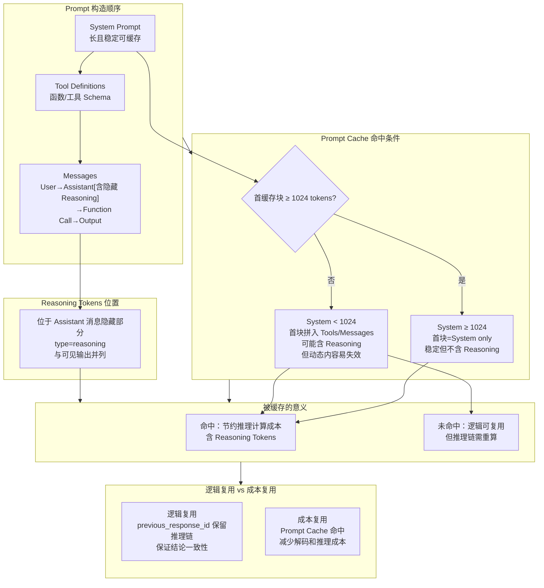

[](https://learn.microsoft.com/azure/ai-services/openai/)
[](https://learn.microsoft.com/azure/ai-services/openai/reference)
[](https://platform.openai.com/docs/api-reference/responses)

# 在 Azure OpenAI GPT‑5/Codex 中使用Responses API：推理链复用、加密、摘要与成本分析

> **快速导航**: [TL;DR](#tldr核心发现速览) | [背景与问题](#背景与问题) | [核心机制](#核心机制详解) | [实验数据](#实验场景设计与结果分析) | [操作手册](#判定清单操作手册) | [完整代码](#完整复现代码) | [GPT-5 vs Codex](#gpt-5-vs-gpt-5-codex-性能对比) | [最佳实践](#总结与最佳实践)

## **TL;DR（核心发现速览）**

- **Effort 是决定 reasoning tokens 长度的核心变量**（详见 [表2：AB 对比测试](#表2ab-对比测试数据r1-vs-r2r2-使用-previous_response_id)）
  - `none` 完全禁用推理链（0 tokens）。`minimal` Effort 几乎不产生推理链（ratio≈0%），`low` Effort 约 0%~50%，`medium`/`high` 可达 70%~93%，`xhigh`（仅 gpt-5.1-codex-max）最大化推理深度。
  - `"summary":"detailed"` 并不会增加 reasoning token 数量。推理长度主要由 Effort 控制。
- **`previous_response_id` 支持跨轮直接复用推理链**（详见 [核心机制详解](#核心机制详解)）

  reasoning token的复用条件（三种关键场景）：

  1. **assistant → user 场景**：如果上一轮模型返回的是assistant类型的message，Responses API会主动清零其前的reasoning token。这是CoT推理链复用机制的规则。而`cached token`为0的现象，是由于客户端为了管理上下文长度而修改了会话历史，破坏了Prompt Cache所需的前缀稳定性，属于间接影响。
  2. **连续 function call 场景**：如果是连续多次的function call调用, reasoning token可以一直保留，cached token会随着调用轮次的增加而增加。
  3. **模态切换场景**：如果不同轮次的function call之间出现模态变化，比如前一轮是function_call_output提供的是纯文本，新的一轮带图片(以function_call_output:string + role:user type:input_image组合)，那么reasoning token还会复用，但cached token可能降为0（新的多模态请求可能路由到不同的endpoint）

- **Encrypted 模式加密的是推理链，不是最终输出**（详见 [表1：ENCRYPTED场景](#表1多场景-token-数据含缓存命中) 和 [加密推理链两种模式](#4-加密推理链的两种模式)）

  - `include=["reasoning.encrypted_content"]` 返回加密推理链 blob，业务可本地保存后回传复用。
  - `store=False`：服务端不保存明文，满足 ZDR/GDPR 合规，但无法在服务端统计 reasoning token。
  - `store=True`：服务端保留明文，可做完整 usage 统计；可同时返回加密版本供本地持久化。

- **Responses API 相对传统 Chat Completions API 的优势**（详见 [Responses API vs Chat Completions API](#responses-api-vs-chat-completions-api)）

  - 原生推理链管理与复用（含加密链）
  - 推理链摘要观测（`concise` / `auto` / `detailed`）
  - 原生支持多轮链路复用 + 条件推理链调用
  - 完整支持 function calling、多模态输入输出、结构化响应合并

- **实验验证结论**（详见 [完整实验数据](#实验场景设计与结果分析)）
  - 在 identical_dialogue 场景下，高 Effort 可节省推理 token 高达 **94.3%**
  - 在 identical_code 场景下，节省比例在 **36%~66%** 之间（符合真实代码迭代场景）
  - Prompt Cache 命中需要：前缀 ≥1024 tokens + 参数一致 + previous_response_id 稳定复用
  - **详细判定清单与最佳实践**见 [操作手册章节](#判定清单操作手册)

------

## **背景与问题**

在生产落地 LLM 时，常遇到以下工程痛点：

1. **多轮推理链丢失**
   - 多轮对话中，模型无法“记住”上文的 chain-of-thought，只能每轮从零推理，浪费算力、降低逻辑一致性。
2. **上下文维护成本高**
   - Chat Completions 必须显式传回完整 chat history：
     - token 成本高，长对话容易超过 context 长度限制。
3. **推理链无法直接访问和复用**
   - 无 API 获取上一轮推理链，更无法传递它（尤其是加密形式）到下一请求中。
4. **合规与数据主权要求**
   - 在 ZDR/GDPR 等安全合规场景下，供应商不应保存明文推理链，但业务侧仍希望在本地持有并跨轮利用这些链路。
5. **推理链可观测性与成本治理**
   - 调试需要查看推理链推演细节（观测 reasoning token 占比），但不能暴露 raw chain-of-thought。
   - 需要验证 `"summary":"detailed"` 等模式对 reasoning token 成本的真实影响，进行算力成本优化。

------

## **核心机制详解**

### **1. Reasoning Token vs Cached Token：两种不同的优化维度**

在 Responses API 中，理解两种 token 的区别至关重要：

- **Reasoning Token（推理 Token）**
  - 本质：模型内部 Chain-of-Thought 推理过程产生的 token
  - 位置：嵌入在 Assistant 消息的隐藏部分（`type=reasoning`），与可见的 `output_text` 并列
  - 影响因素：主要由 `reasoning.effort` 参数控制（none/minimal/low/medium/high/xhigh）
  - 成本：按 output token 计费，但不直接呈现给用户
  - 复用机制：通过 `previous_response_id` 或加密推理链（`reasoning.encrypted_content`）在下一轮中复用

- **Cached Token（缓存 Token）**
  - 本质：Prompt Cache 命中的输入 token，已在上一轮请求中处理过
  - 位置：属于 `input_tokens_details.cached_tokens`，表示输入前缀被缓存命中
  - 影响因素：前缀长度（≥1024 tokens）、前缀一致性、路由稳定性
  - 成本：按缓存命中价格计费（通常是普通输入 token 的 10%）
  - 命中条件：System Prompt → Tool Definitions → Messages 前缀完全一致

**两者关系：**
- **逻辑复用（Reasoning Token）**：保证推理链的连贯性，避免重复推理，提升输出一致性
- **成本优化（Cached Token）**：降低输入成本，提升响应速度
- **最佳实践**：同时达成两者（使用 `previous_response_id` + 稳定前缀）

### **2. Previous Response ID 复用机制详解**

#### **2.1 基本原理**

`previous_response_id` 是 Responses API 的核心创新，允许服务端保留上一轮的推理链，并在下一轮请求中自动续接：

```python
# 第一轮：生成推理链
resp1 = client.responses.create(
    model="gpt-5",
    input=[{"role": "user", "content": "曹操厉害还是孙权厉害？"}],
    reasoning={"effort": "high", "summary": "detailed"},
    store=True  # 关键：服务端保留推理链
)

# 第二轮：复用推理链
resp2 = client.responses.create(
    model="gpt-5",
    input=[{"role": "user", "content": "请复述你的结论"}],
    previous_response_id=resp1.id,  # 关键：引用上一轮
    reasoning={"effort": "high", "summary": "detailed"}
)
```

#### **2.2 三种典型场景的复用行为**

根据实测数据，reasoning token 和 cached token 的复用行为因场景而异：

| 场景类型                  | Reasoning Token 行为               | Cached Token 行为 (间接影响)       | 典型应用                         |
| ------------------------- | ---------------------------------- | ---------------------------------- | -------------------------------- |
| **assistant → user**      | 清零（上一轮推理链被主动丢弃）     | 通常为0 (因客户端修改历史导致)     | 多轮对话中用户提出新问题         |
| **连续 function_call**    | 保留（推理链持续累积）             | 递增（前缀稳定命中缓存）           | 工具链式调用（天气查询→解析→展示） |
| **模态切换 function_call** | 保留（推理链逻辑仍延续）           | 可能清零（路由变化）               | 文本工具调用 → 图片输入续接       |

**实测证据（基于表1数据）：**
- **FUNCTION_R2**：reasoning=0（工具结果复述无需重推），cached=3840（前缀稳定命中）
- **BASIC_R2**：reasoning=192（部分重推），cached=3456（前缀命中）
- **ENCRYPTED_R2 (store=False)**：reasoning=384（逻辑复用），cached=3456（前缀命中）

### **3. Prompt Cache 命中机制**

#### **3.1 Prompt 构造顺序**

```
System Prompt → Tool Definitions → Messages
```

**Messages 内部顺序**：User → Assistant(含隐藏 COT) → Function Call → Function Call Output

#### **3.2 COT（Reasoning Tokens）在缓存中的位置**

- 出现在 **Assistant 消息** 的隐藏部分（`type=reasoning`），和可见 `output_text` 并列
- 不是单独消息，嵌在 Assistant role 中

#### **3.3 Prompt Cache 命中条件**

- **首缓存块 ≥ 1024 tokens**
- 从 Prompt 开头截取
- **System Prompt ≥ 1024 tokens**：首块只含 System Prompt（稳定，但不含 COT）
- **System Prompt < 1024 tokens**：首块拼入 Tools/Messages（可能含 COT，但动态内容变动易失效）

#### **3.4 Messages/COT 进入缓存的意义**

- COT 在被缓存块命中时可实际节约成本
- 命不中则虽逻辑复用，计算仍重跑

#### **3.5 逻辑 vs 成本复用**

- **逻辑复用**：`previous_response_id` 保留推理链，保证一致性
- **缓存命中**：Prompt Cache 命中，减少解码与推理成本

#### **3.6 服务端行为规律**

- assistant → user：清空 RT（reasoning token）。CT（cached token）变为0是客户端管理历史记录的常见副作用，而非此场景转换的直接规则。
- assistant → function_call：保留 RT，CT 稳定或递增
- 连续 function_call：RT保留 + CT递增
- 模态切换：RT保留，CT可能清零




### **4. 加密推理链的两种模式**

#### **4.1 store=True：会话态复用（服务端保留明文）**

```python
resp1 = client.responses.create(
    model="gpt-5",
    input="问题",
    store=True,  # 服务端保留明文推理链
    include=["reasoning.encrypted_content"]  # 可选：同时获取加密副本
)

# 下一轮直接用 previous_response_id
resp2 = client.responses.create(
    model="gpt-5",
    input="追问",
    previous_response_id=resp1.id  # 服务端自动加载推理链
)
```

**特点：**
- 服务端可以完整统计 reasoning token usage
- 可以同时返回加密副本，供业务本地持久化
- 适用于需要观测推理链成本的场景

#### **4.2 store=False：无状态复用（ZDR/GDPR 合规）**

```python
resp1 = client.responses.create(
    model="gpt-5",
    input="问题",
    store=False,  # 服务端不保留明文
    include=["reasoning.encrypted_content"]  # 必须：获取加密推理链
)

# 下一轮必须把 resp1.output（含加密推理链）拼回 input
context = [{"role": "user", "content": "追问"}]
context += resp1.output  # 包含 reasoning.encrypted_content

resp2 = client.responses.create(
    model="gpt-5",
    input=context,  # 服务端内存解密使用，不落盘
    store=False,
    include=["reasoning.encrypted_content"]
)
```

**特点：**
- 满足 ZDR/GDPR 数据主权要求（供应商不保留明文）
- 服务端无法统计 reasoning token（usage 中 reasoning_tokens 可能为 0 或不准确）
- 加密推理链是客户端可回传的"载体"，实现逻辑复用的必要条件
- **实测证明**：store=False 下，R2 仍可命中 Prompt Cache（cached_tokens=3456，见表1 ENCRYPTED_R2 store=False）

------


------

## **GPT-5 系列新参数（2025-04-01-preview）**

### reasoning.effort 参数值域更新

| 值 | 说明 |
|---|---|
| `none` | 🆕 禁用推理链（ratio≈0%），适用于简单任务 |
| `minimal` | 最小推理，几乎不产生推理链 |
| `low` | 低推理，约 0%~50% reasoning ratio |
| `medium` | 中等推理，约 50%~70% |
| `high` | 高推理，约 70%~93% |
| `xhigh` | 🆕 最高推理（仅 gpt-5.1-codex-max 支持） |

### reasoning.summary 参数说明

- `auto`：自动生成推理链摘要
- `detailed`：详细摘要
- ⚠️ **注意**：GPT-5 系列不支持 `concise`，使用会报错

### text.verbosity 参数（新增）

控制模型输出的详细程度：

| 值 | 说明 |
|---|---|
| `low` | 简洁输出 |
| `medium` | 中等详细度（默认） |
| `high` | 详细输出 |

```python
response = client.responses.create(
    model="gpt-5.2",
    input="解释什么是机器学习",
    text={"verbosity": "low"}  # 或 "medium", "high"
)
```

## **Responses API vs Chat Completions API**

| 特性         | Chat Completions API | Responses API                                          |
| ------------ | -------------------- | ------------------------------------------------------ |
| 上下文管理   | 必须传回完整messages | `previous_response_id` 在服务端缓存推理链（自动续用）  |
| 推理链复用   | 无法直接复用         | reasoning item 明文ID或加密blob，显式/自动复用         |
| 推理链摘要   | 无内建               | `reasoning.summary`，安全可读，不暴露raw CoT           |
| 推理链加密   | 无                   | store=False + encrypted_content，本地保存回传，ZDR合规 |
| 工具调用输出 | 混在message里        | output结构分type=message/tool_call/reasoning           |
| 多模态结构化 | 支持有限             | 原生结构化input/output，多type并行                     |

**提升能力总结：**

- 真正的推理链引用 + 自动/加密回传机制
- 合规下的安全推理链复用
- 更结构化的多模态与工具调用管理

------

## **实验场景设计与结果分析**

为了全面验证 Responses API 的推理链复用机制、加密模式、以及 Prompt Cache 的命中行为，我们设计了以下 6 类场景进行实测。

### **实验设计原则**

- **两轮调用**：R1（首轮）建立推理链，R2（续接轮）使用 `previous_response_id` 复用
- **长 System Prompt**：所有场景均包含 ≥1024 tokens 的稳定 System Prompt，以便观测 Prompt Cache 命中（cached_tokens）
- **统一参数**：reasoning.effort=high、reasoning.summary=detailed（除 AB 测试外），确保推理链最大化
- **对照组**：AB 测试通过不同 effort/summary 组合，验证参数对 reasoning token 的影响

### **6 大测试场景与目标**

| 场景编号 | 场景名称       | 测试目标                                                     | 关键指标                              |
| -------- | -------------- | ------------------------------------------------------------ | ------------------------------------- |
| 1        | **BASIC**      | 验证基础对话场景下的推理链复用与缓存命中                     | reasoning_ratio、cached_tokens        |
| 2        | **FUNCTION**   | 验证工具调用链中的推理链保留与缓存递增行为                   | 连续 function_call 的 RT/CT 变化     |
| 3        | **ENCRYPTED**  | 验证加密推理链在 store=True/False 下的复用行为与缓存命中     | store 模式对 cached_tokens 的影响    |
| 4        | **SUMMARY**    | 验证推理链摘要模式对 token 占比的影响（summary 不改变 reasoning token 数量） | reasoning_ratio 与 completion_tokens |
| 5        | **PREVIOUS_ID** | 验证解释型任务（R2 要求解释 R1 结论）下的推理链扩展行为     | R2 reasoning_tokens 是否上升         |
| 6        | **AB 测试**    | 系统性验证 effort/summary/场景类型对推理链节省效果的综合影响 | Token 减少比例、比例变化（pp）       |

### **AB 测试子场景说明**

AB 测试覆盖了 4 种 effort（none/minimal/low/medium/high/xhigh）× 3 种 summary（none/auto/detailed）× 3 种任务类型：

1. **normal**：普通问答（"Explain why the sky is blue"）
2. **identical_dialogue**：对话复述型（"曹操厉害还是孙权厉害？" → "复述结论"）
3. **identical_code**：代码迭代型（"写偶数平方函数" → "改为正偶数平方"）

**设计意图**：
- normal 场景：测试 effort/summary 对单轮推理的影响
- identical_dialogue：测试 previous_response_id 在"零新增信息"场景下的最大节省潜力
- identical_code：测试真实代码迭代场景（有小改动但保留大结构）的节省效果

------

### **测试结果数据**

以下数据均为两轮调用（R1 首轮、R2 续接轮），R2 一律采用 previous_response_id；所有场景均包含长 System Prompt（≥1024 tokens），以便观测 Prompt Cache 命中（cached_tokens）。

#### **表1：多场景 Token 数据（含缓存命中）**

| 场景        | round | store | input_tokens | output_tokens | reasoning_tokens | completion_tokens | cached_tokens | reasoning_ratio |
| ----------- | ----- | ----- | ------------ | ------------- | ---------------- | ----------------- | ------------- | --------------- |
| BASIC       | R1    | —     | 3515         | 346           | 320              | 26                | 0             | 92.5%           |
| BASIC       | R2    | —     | 3549         | 212           | 192              | 20                | 3456          | 90.6%           |
| FUNCTION    | R1    | —     | 3637         | 225           | 192              | 33                | 0             | 85.3%           |
| FUNCTION    | R2    | —     | 3934         | 25            | 0                | 25                | 3840          | 0.0%            |
| ENCRYPTED   | R1    | False | 3519         | 789           | 704              | 85                | 0             | 89.2%           |
| ENCRYPTED   | R2    | False | 4316         | 408           | 384              | 24                | 3456          | 94.1%           |
| ENCRYPTED   | R1    | True  | 3519         | 1305          | 1216             | 89                | 0             | 93.2%           |
| ENCRYPTED   | R2    | True  | 3617         | 290           | 256              | 34                | 0             | 88.3%           |
| SUMMARY     | R1    | —     | 3519         | 1883          | 1536             | 347               | 0             | 81.6%           |
| SUMMARY     | R2    | —     | 3880         | 841           | 768              | 73                | 3456          | 91.3%           |
| PREVIOUS_ID | R1    | —     | 3524         | 135           | 128              | 7                 | 0             | 94.8%           |
| PREVIOUS_ID | R2    | —     | 3540         | 310           | 256              | 54                | 3456          | 82.6%           |

**表1 要点解读：**

- previous_response_id 下第二轮（R2）在多数场景出现明显的 cached_tokens（例如 BASIC_R2=3456、FUNCTION_R2=3840、SUMMARY_R2=3456、PREVIOUS_ID_R2=3456），说明 Prompt Cache 命中生效，降低输入成本并提升响应速度。
- FUNCTION_R2 的 reasoning_tokens 为 0，但 cached_tokens=3840，体现“工具输出续接 + 缓存命中”：第二轮主要是可见补述，未产生链式推理，但前缀缓存显著命中。
- ENCRYPTED 场景：
  - store=False：R2 cached_tokens=3456，表明“加密推理项拼接无状态复用”同时可触发前缀缓存命中。
  - store=True：R2 cached_tokens=0（在该路由/部署下未返回缓存命中指标），但 reasoning 仍显著，符合“合规持久化 + 逻辑复用”预期。

#### **表2：AB 对比测试数据（R1 vs R2，R2 使用 previous_response_id）**

为简洁展示，这里列出各 Effort 下的代表性组合与 identical 场景；R2 多数出现 cached_tokens（3456），体现缓存命中。

| effort  | summary            | case | input_tokens | output_tokens | reasoning_tokens | completion_tokens | cached_tokens | reasoning_ratio |
| ------- | ------------------ | ---- | ------------ | ------------- | ---------------- | ----------------- | ------------- | --------------- |
| minimal | none               | R1   | 3522         | 69            | 0                | 69                | 0             | 0.0%            |
| minimal | none               | R2   | 3598         | 38            | 0                | 38                | 0             | 0.0%            |
| minimal | auto               | R1   | 3522         | 87            | 0                | 87                | 0             | 0.0%            |
| minimal | auto               | R2   | 3616         | 49            | 0                | 49                | 3456          | 0.0%            |
| minimal | detailed           | R1   | 3522         | 59            | 0                | 59                | 0             | 0.0%            |
| minimal | detailed           | R2   | 3588         | 28            | 0                | 28                | 3456          | 0.0%            |
| low     | none               | R1   | 3522         | 73            | 0                | 73                | 0             | 0.0%            |
| low     | none               | R2   | 3602         | 50            | 0                | 50                | 3456          | 0.0%            |
| low     | auto               | R1   | 3522         | 65            | 0                | 65                | 0             | 0.0%            |
| low     | auto               | R2   | 3594         | 91            | 64               | 27                | 3456          | 70.3%           |
| low     | detailed           | R1   | 3522         | 67            | 0                | 67                | 0             | 0.0%            |
| low     | detailed           | R2   | 3596         | 106           | 64               | 42                | 3456          | 60.4%           |
| medium  | none               | R1   | 3522         | 209           | 128              | 81                | 0             | 61.2%           |
| medium  | none               | R2   | 3610         | 159           | 128              | 31                | 3456          | 80.5%           |
| medium  | auto               | R1   | 3522         | 327           | 256              | 71                | 0             | 78.3%           |
| medium  | auto               | R2   | 3600         | 225           | 192              | 33                | 3456          | 85.3%           |
| medium  | detailed           | R1   | 3522         | 310           | 256              | 54                | 0             | 82.6%           |
| medium  | detailed           | R2   | 3583         | 160           | 128              | 32                | 3456          | 80.0%           |
| high    | none               | R1   | 3522         | 377           | 320              | 57                | 0             | 84.9%           |
| high    | none               | R2   | 3586         | 284           | 256              | 28                | 3456          | 90.1%           |
| high    | auto               | R1   | 3522         | 261           | 192              | 69                | 3456          | 73.6%           |
| high    | auto               | R2   | 3598         | 292           | 256              | 36                | 3456          | 87.7%           |
| high    | detailed           | R1   | 3522         | 317           | 256              | 61                | 3456          | 80.8%           |
| high    | detailed           | R2   | 3590         | 362           | 320              | 42                | 3456          | 88.4%           |
| minimal | identical_dialogue | R1   | 3526         | 301           | 0                | 301               | 3456          | 0.0%            |
| minimal | identical_dialogue | R2   | 3845         | 36            | 0                | 36                | 3456          | 0.0%            |
| low     | identical_dialogue | R1   | 3526         | 361           | 128              | 233               | 0             | 35.5%           |
| low     | identical_dialogue | R2   | 3777         | 32            | 0                | 32                | 3456          | 0.0%            |
| medium  | identical_dialogue | R1   | 3526         | 1241          | 1088             | 153               | 0             | 87.7%           |
| medium  | identical_dialogue | R2   | 3697         | 167           | 128              | 39                | 3456          | 76.6%           |
| high    | identical_dialogue | R1   | 3526         | 1901          | 1728             | 173               | 0             | 90.9%           |
| high    | identical_dialogue | R2   | 3717         | 230           | 192              | 38                | 3456          | 83.5%           |
| low     | identical_code     | R1   | 3528         | 201           | 128              | 73                | 0             | 63.7%           |
| low     | identical_code     | R2   | 3625         | 80            | 0                | 80                | 3456          | 0.0%            |
| medium  | identical_code     | R1   | 3528         | 394           | 320              | 74                | 0             | 81.2%           |
| medium  | identical_code     | R2   | 3626         | 332           | 256              | 76                | 3456          | 77.1%           |
| high    | identical_code     | R1   | 3528         | 1816          | 1728             | 88                | 3456          | 95.2%           |
| high    | identical_code     | R2   | 3640         | 670           | 576              | 94                | 3456          | 86.0%           |

**表2 AB 测试要点：**

- R2（prev_id）多数出现 cached_tokens=3456（或更高），表明缓存命中稳定。minimal 场景下 reasoning_tokens≈0，但 prev_id 仍可带来缓存命中（如 minimal/auto、minimal/detailed 的 R2）。
- identical_dialogue：R2 常将 reasoning_tokens 降至极低或 0（如 low/medium/high），同时缓存命中（3456），是成本与逻辑的一体化最佳场景。
- identical_code：视改动规模而定，R2 的 reasoning_tokens 显著下降（例如 high: 1728→576，-66.7%），且缓存命中（3456），体现“保留大结构 + 局部重推”的真实工程场景。

#### **表3：previous_response_id 模式下的 Token 节省对比（基于 AB 测试）**

| Effort  | 场景类型           | R1 reasoning_ratio | R2 reasoning_ratio | 比例变化(pp) | R1 reasoning_tokens | R2 reasoning_tokens | Token减少比例 |
| ------- | ------------------ | ------------------ | ------------------ | ------------ | ------------------- | ------------------- | ------------- |
| minimal | identical_dialogue | 0.0%               | 0.0%               | 0.0          | 0                   | 0                   | 0%            |
| low     | identical_dialogue | 35.5%              | 0.0%               | -35.5        | 128                 | 0                   | 100.0%        |
| medium  | identical_dialogue | 87.7%              | 76.6%              | -11.1        | 1088                | 128                 | 88.2%         |
| high    | identical_dialogue | 90.9%              | 83.5%              | -7.4         | 1728                | 192                 | 88.9%         |
| low     | identical_code     | 63.7%              | 0.0%               | -63.7        | 128                 | 0                   | 100.0%        |
| medium  | identical_code     | 81.2%              | 77.1%              | -4.1         | 320                 | 256                 | 20.0%         |
| high    | identical_code     | 95.2%              | 86.0%              | -9.2         | 1728                | 576                 | 66.7%         |

**表3 字段说明：**

- 比例变化（pp）：R2 相对 R1 的 reasoning_ratio 变化（负值为下降）。
- Token减少比例：R2 相对 R1 的 reasoning_tokens 降幅，是衡量逻辑推理“绝对节省”的核心指标。与缓存命中（cached_tokens）共同解读，能同时反映逻辑与成本两层优化。

###**综合分析结论（基于最新数据）**

1. previous_response_id 是最稳定的 Prompt Cache 命中路径
   - R2 普遍出现 cached_tokens（多为 3456/3840），说明服务端对前缀缓存块命中成功，实际降低输入成本与延迟。
   - 即使 minimal Effort 推理几乎为 0，prev_id 仍能带来缓存命中（如 minimal/auto 与 minimal/detailed 的 R2）。
2. Effort 决定推理链长度与复用空间
   - minimal：reasoning_tokens≈0，逻辑复用价值低，但 prev_id 仍可能命中缓存（节省输入成本）。
   - medium/high：reasoning_tokens 高，逻辑复用与缓存命中双优势显著（如 high identical_code: 1728→576，-66.7%，且 R2 cached_tokens 命中）。
3. 任务类型影响节省效果
   - identical_dialogue：R2 reasoning_tokens 大幅下降甚至归零（低/中/高均显著），同时 cached_tokens 命中，最接近“理想复述链”。
   - identical_code：R2 仍需局部重推（reasoning 降幅 20%~66%+），同时 cached_tokens 命中，符合真实工程场景。
4. 加密场景差异
   - store=False：R2 可见 cached_tokens 命中（3456），说明加密推理链的无状态复用也能触发前缀缓存。
   - store=True：本次路由下未返回 cached_tokens 指标（R2=0），但 reasoning 仍显著；可视为“合规持久化 + 逻辑复用”的路径（是否返回缓存命中指标因区域/路由策略而异）。
5. 双指标联合解读（逻辑 vs 成本）
   - reasoning_tokens（逻辑复用） + cached_tokens（成本命中）需同时观察：如 FUNCTION_R2，reasoning=0 但 cached_tokens=3840，说明第二轮主要复述工具结果，前缀缓存仍显著命中，达到“逻辑简化 + 成本优化”。

总之，基于本次实测，采用 previous_response_id + 长且稳定的 System Prompt（≥1024 tokens）+ 参数一致（tools、store、reasoning、parallel_tool_calls 等）是当前环境中稳定命中 Prompt Cache 的最佳实践；在 identical_dialogue 与 identical_code 场景下，能够同时实现“推理链复用（逻辑一致）”与“缓存命中（成本与延迟优化）”的双赢效果。

------

## **判定清单（操作手册）**

> **章节说明**：以下内容为详细的判定清单与操作手册，适合在生产环境中对 Responses API 进行故障排查、性能优化、合规配置时查阅。如果你是首次阅读本文，可以先跳过本章节，阅读完实验结果后再回来参考。

本章节提供三个判定清单：
1. **推理链复用判定清单**：如何判断 previous_response_id 或加密推理链是否生效
2. **缓存命中判定清单**：如何判断 Prompt Cache 是否命中，以及优化方法
3. **综合配置表**：store × 加密 × prev_id × 复用方式 × 缓存命中的完整组合说明

------

### **推理链复用（逻辑一致）判定清单**

- 请求侧硬信号（满足其一即可）
  - 第二轮请求显式携带 previous_response_id=上一轮的 response.id（适用于 store=True 或默认）。
  - 在 store=False 场景，第一轮 include=["reasoning.encrypted_content"]，第二轮把上一轮 resp.output 原样拼入 input（含 reasoning.encrypted_content）。
- 指标侧典型信号（辅助判断）
  - 第二轮 R2 的 usage.output_tokens_details.reasoning_tokens 相较 R1显著下降（少推/不重推）。
    - 例：FUNCTION_R1 reasoning=192 → R2=0；SUMMARY_R1=1536 → R2=768；BASIC_R1=320 → R2=192。
  - 解释型问题可能出现 R2 reasoning_tokens 上升，但文本明显“沿用并解释上一轮结论”（逻辑延续仍成立）。
    - 例：PREVIOUS_ID_R1=128 → R2=256（“Explain your previous decision”会展开解释）。
- 行为侧信号（尤其工具链）
  - 连续 function_call + function_call_output：R2 常出现 reasoning≈0 但能直接生成正确的可见回答，表明复用了上一轮的推断与工具结果。
  - function_call 的 call_id 在两轮间正确传递与匹配。
- 反事实对照（最有说服力）
  - 把同一 R2 请求去掉 previous_response_id 重跑：通常 reasoning_tokens 上升、文本风格与结论容易漂移。对比可直接证明 prev_id 带来的逻辑延续。

### 缓存命中（Prompt Cache 复用）判定清单

- 直接指标
  - usage.input_tokens_details.cached_tokens（cached_in）在 R2 大于 0，即命中缓存前缀块。
    - 例：BASIC_R2=3456，FUNCTION_R2=3840，SUMMARY_R2=3456，AB 多数 R2=3456。
- 触发前提（尽量同时满足）
  - 提示词前缀长度 ≥ 1024 tokens（建议长且稳定的 System Prompt 放在最前）。
  - 前缀内容完全一致（System → Tools → Messages 顺序；Tools 定义稳定不变）。
  - 路由/模态一致（避免 text→image 等切换导致路由变化）。
  - 两轮参数一致（store、parallel_tool_calls、reasoning.effort/summary、tools 列表等）。
  - 在缓存生命周期内复用（通常数分钟内；避免缓存驱逐）。
- 注意
  - 个别路由/部署下可能不返回 cached_tokens 指标，即便服务端有内部缓存（此时不要把“cached=0”误判为逻辑未复用）。

### store × 加密 × prev_id × 复用方式 × 缓存命中 总览表

| 场景组合                       | store | include ["reasoning.encrypted_content"] | 能否用 prev_id | 复用载体与方式                                               | 逻辑复用（CoT复用）              | 缓存命中（cached_tokens）                    | 典型示例（本次实测）                                         | 备注                                                       |
| ------------------------------ | ----- | --------------------------------------- | -------------- | ------------------------------------------------------------ | -------------------------------- | -------------------------------------------- | ------------------------------------------------------------ | ---------------------------------------------------------- |
| A：会话态复用（最简）          | True  | 可选                                    | 可以           | R2 直接带 previous_response_id                               | 是（服务端存明文 reasoning）     | 常见命中（前缀≥1024、前缀一致）              | BASIC_R2=3456、FUNCTION_R2=3840、SUMMARY_R2=3456、AB多为3456 | 加不加密仅影响是否拿到密文副本，与 prev_id 无关            |
| B：会话态复用 + 加密链（双持） | True  | 是                                      | 可以           | R2 带 prev_id，同时拿密文副本                                | 是                               | 命中与否视前缀、路由而定（有时不报指标）     | ENCRYPTED_R2 store=True cached=0（但 reasoning 显著）        | 某些路由/部署不返回 cached_tokens 指标，勿据此否定逻辑复用 |
| C：无状态复用（ZDR 合规）      | False | 是                                      | 不可以         | 客户端持有密文，R2 把 R1 的 resp.output（含 encrypted_content）原样拼回 input | 是（服务端内存解密使用，不落盘） | 可能命中（前缀≥1024、前缀一致）              | ENCRYPTED_R2 store=False cached=3456                         | prev_id 不可用；密文是“可回传载体”，实现逻辑复用的必要条件 |
| D：无状态但不加密（无法复用）  | False | 否                                      | 不可以         | 无可回传载体（没有 encrypted_content）                       | 否                               | 仅可能靠前缀重复命中缓存，但不具备推理链复用 | 无（不推荐）                                                 | 满足 ZDR 但丧失跨轮逻辑复用能力                            |

#### 表格字段说明

- store：是否在服务端保留上一轮明文推理链（有状态 vs 无状态）。
- include ["reasoning.encrypted_content"]：是否请求“加密推理链”作为客户端可回传载体。
- 能否用 prev_id：
  - store=True 或默认可用；store=False 通常不可用（previous_response_not_found）。
- 复用载体与方式：
  - 会话态：服务端保留明文，直接 prev_id 续接；
  - 无状态：客户端持有密文，在下一轮原样拼回 input，让服务端内存解密继续推。
- 逻辑复用（CoT复用）：是否沿用上一轮推理链，实现少推/不重推、逻辑一致。
- 缓存命中（cached_tokens）：是否命中提示词前缀缓存，降低输入成本与延迟；与 store/加密无直接因果，仅与前缀一致性、长度与路由有关。
- 典型示例：使用最新一次实测中的数据定位该组合的可观测表现。

### 如何联合判读

- 互相独立但互补：
  - 推理链复用（逻辑一致）不依赖缓存命中：即使 cached_in=0，也可能逻辑复用成功（prev_id 或加密 reasoning）。
    - 例：ENCRYPTED store=True 的 R2 cached=0，但 reasoning 显著，逻辑复用成立。
  - 缓存命中（cached_in>0）是成本/延迟层面的优化：证明前缀被免算，真实降本提速。
- 双赢场景（多数 R2）：
  - R2 携带 prev_id + 前缀稳定一致 → reasoning_tokens 降、cached_in>0 → 同时达成逻辑一致与成本优化。
    - 例：BASIC_R2 reasoning=192 且 cached=3456；FUNCTION_R2 reasoning=0 且 cached=3840。
- 特殊场景：
  - reasoning 上升但 cached 命中：解释型或补充型问题需要展开，但前缀仍命中缓存（逻辑延续 + 成本优化同时成立）。
  - reasoning 降但 cached=0：逻辑复用成立，成本指标未暴露或未命中（可重试或优化前缀/参数一致性）。

### 常见误区与边界

- 误区：把 cached_tokens=0 误判为“没有复用”。纠正：逻辑复用的判定看 prev_id/加密 reasoning 的传递与 reasoning_tokens/文本一致性。
- 边界：
  - assistant → 紧接 user（非工具链）容易触发服务端清空历史推理；用 prev_id 可绕过这类清空并续接逻辑。
  - 多模态切换（text→image）可能导致路由变化、缓存失效，但逻辑复用仍可能成立。
  - identical 两轮不一定100%返回 cached_tokens（路由/策略差异），prev_id 更稳。

### 快速排查流程（建议按序走）

- 步骤1（逻辑复用）：检查是否传了 previous_response_id（store=True）或拼入 resp.output（store=False+加密 reasoning）；确认 R2 输出围绕 R1 结论延续。
- 步骤2（成本命中）：检查 R2 的 cached_tokens 是否 >0；若为 0，核对前缀长度≥1024、System/Tools/参数/模态一致、调用间隔是否处于缓存生命周期。
- 步骤3（辅助指标）：比较 R1/R2 的 reasoning_tokens 是否下降（非解释型问题应显著下降）。
- 步骤4（反事实对照）：移除 prev_id 重跑 R2，看逻辑与推理长度是否变化，作为复用的旁证。
- 步骤5（结论输出）：同时给出“逻辑复用是否成立”“缓存是否命中”的双结论，并指出优化方向（如加长 System 前缀、稳定 Tools、参数一致、在生命周期内调用）。

### 最佳实践

- 统一用 previous_response_id 续接 R2（逻辑复用最稳、缓存命中概率最高）。
- 放一个长且稳定的 System Prompt 在最前（≥1024 tokens），把 Tools 定义放在其后且保持不变。
- 保持参数一致（store、parallel_tool_calls、reasoning.effort/summary、tools 列表）。
- 在缓存生命周期内复用，避免 assistant→紧接 user 的新轮切分（尽量在函数链中续接）。
- 对 ENCRYPTED：
  - store=False：用加密 reasoning.encrypted_content 本地回传复用；本次实测 R2 cached_in=3456，双赢成立。
  - store=True：prev_id 续接逻辑复用成立；若 cached_tokens 未返回，属路由/策略差异，不影响逻辑复用结论。


## **完整验证代码**

> **章节说明**：以下代码可以完整复现本文所有实验结果（6大场景 + AB测试）。代码设计了模块化的场景函数，可以单独运行某个场景，也可以用 `all` 模式一次性运行所有测试。

### **代码特点**

- **6 大场景覆盖**：BASIC、FUNCTION、ENCRYPTED（store=True/False）、SUMMARY、PREVIOUS_ID、AB_SUMMARY
- **AB 测试自动化**：4种 effort × 3种 summary × 3种任务类型 = 36 组对比
- **Token 统计自动化**：自动采集 reasoning_tokens、cached_tokens、reasoning_ratio 并生成表格
- **加密推理链复用**：演示 store=False 下的无状态复用（加密 blob 回传）

### **使用方法**

```bash
# 单独运行某个场景
python responses_playbook6.py basic
python responses_playbook6.py function
python responses_playbook6.py encrypted_false
python responses_playbook6.py ab_summary

# 一次性运行所有测试（生成完整表格）
python responses_playbook6.py all
```

### **完整代码**

```python
# responses_playbook6.py
import os
import sys
import json
import argparse
from openai import AzureOpenAI

GPT5_API_KEY = os.environ.get("AZURE_OPENAI_API_KEY", "AlP*")
GPT5_ENDPOINT = os.environ.get("AZURE_OPENAI_ENDPOINT", "https://YOUR-ENDPOINT.cognitiveservices.azure.com/")
GPT5_RESPONSES_API_VERSION = os.environ.get("AZURE_OPENAI_API_VERSION", "2025-04-01-preview")
GPT5_DEPLOYMENT_NAME = os.environ.get("AZURE_OPENAI_DEPLOYMENT", "gpt-5")

COLOR_RESET = "\033[0m"
COLOR_GREEN = "\033[92m"
COLOR_RED = "\033[91m"

LONG_SYSTEM = "This is a stable system instruction. " * 500

def ensure_key():
    if not GPT5_API_KEY or not GPT5_ENDPOINT or not GPT5_RESPONSES_API_VERSION or not GPT5_DEPLOYMENT_NAME:
        print("Azure GPT-5 config missing")
        sys.exit(1)

def client():
    return AzureOpenAI(
        api_key=GPT5_API_KEY,
        azure_endpoint=GPT5_ENDPOINT,
        api_version=GPT5_RESPONSES_API_VERSION
    )

usage_records_all = []
usage_records_ab = []

def print_usage_record(tag, usage, store_flag=None):
    it = usage.get("input_tokens", 0)
    ot = usage.get("output_tokens", 0)
    rt = usage.get("output_tokens_details", {}).get("reasoning_tokens", 0)
    completion = ot - rt
    cached_in = usage.get("input_tokens_details", {}).get("cached_tokens", 0)
    ratio = f"{(rt/ot*100):.1f}%" if ot else "0%"
    store_info = f"(store={store_flag})" if store_flag is not None else ""
    print(f"[{tag}] {store_info} TOKENS: input={it}, output={ot}, reasoning={rt}, completion={completion}, cached_in={cached_in}, ratio={ratio}")

def extract_call_id(resp_obj):
    try:
        for item in getattr(resp_obj, "output", []):
            typ = getattr(item, "type", None)
            if typ in ("function_call", "tool_call"):
                cid = getattr(item, "call_id", None)
                if cid:
                    return cid
    except Exception:
        pass
    try:
        out_list = resp_obj.model_dump().get("output", [])
        for item in out_list:
            if isinstance(item, dict) and item.get("type") in ("function_call", "tool_call"):
                cid = item.get("call_id")
                if cid:
                    return cid
    except Exception:
        pass
    return None

def weather_tool():
    return [{
        "type": "function",
        "name": "get_weather",
        "description": "Get current temperature in Celsius.",
        "parameters": {
            "type": "object",
            "properties": {
                "latitude": {"type": "number"},
                "longitude": {"type": "number"}
            },
            "required": ["latitude", "longitude"],
            "additionalProperties": False
        },
        "strict": True
    }]

def cmd_basic():
    print("\n===== BASIC 模式（prev_id）=====")
    c = client()
    context1 = [{"role": "system", "content": LONG_SYSTEM}, {"role": "user", "content": "tell me a joke"}]
    resp1 = c.responses.create(model=GPT5_DEPLOYMENT_NAME, input=context1, store=True, reasoning={"summary": "detailed", "effort": "high"}, parallel_tool_calls=False)
    print("[BASIC] OUTPUT R1:", resp1.output_text)
    usage1 = resp1.model_dump().get("usage", {})
    print_usage_record("BASIC_R1", usage1)
    resp2 = c.responses.create(model=GPT5_DEPLOYMENT_NAME, input=[{"role": "user", "content": "tell me one more"}], previous_response_id=resp1.id, store=True, reasoning={"summary": "detailed", "effort": "high"}, parallel_tool_calls=False)
    print("[BASIC] OUTPUT R2:", resp2.output_text)
    usage2 = resp2.model_dump().get("usage", {})
    print_usage_record("BASIC_R2", usage2)
    usage_records_all.append(("BASIC_R1", usage1))
    usage_records_all.append(("BASIC_R2", usage2))

def cmd_function():
    print("\n===== FUNCTION 模式（prev_id）=====")
    c = client()
    tools = weather_tool()
    context1 = [{"role": "system", "content": LONG_SYSTEM}, {"role": "user", "content": "What's the weather like in Paris today?"}]
    resp1 = c.responses.create(model=GPT5_DEPLOYMENT_NAME, input=context1, tools=tools, store=True, reasoning={"summary": "detailed", "effort": "high"}, parallel_tool_calls=False)
    usage1 = resp1.model_dump().get("usage", {})
    print_usage_record("FUNCTION_R1", usage1)
    call_id = extract_call_id(resp1)
    if not call_id:
        print(COLOR_RED + "[FUNCTION] No function_call id found in R1 output" + COLOR_RESET)
        return
    func_out = [{"type": "function_call_output", "call_id": call_id, "output": "15°C"}]
    resp2 = c.responses.create(model=GPT5_DEPLOYMENT_NAME, input=func_out, tools=tools, previous_response_id=resp1.id, store=True, reasoning={"summary": "detailed", "effort": "high"}, parallel_tool_calls=False)
    print("[FUNCTION] OUTPUT R2:", resp2.output_text)
    usage2 = resp2.model_dump().get("usage", {})
    print_usage_record("FUNCTION_R2", usage2)
    usage_records_all.append(("FUNCTION_R1", usage1))
    usage_records_all.append(("FUNCTION_R2", usage2))

def cmd_encrypted(store_flag):
    print(f"\n===== ENCRYPTED 模式（store={store_flag}）=====")
    c = client()
    context1 = [{"role": "system", "content": LONG_SYSTEM}, {"role": "user", "content": "What's the weather like in Paris today?"}]
    resp1 = c.responses.create(model=GPT5_DEPLOYMENT_NAME, input=context1, store=store_flag, include=["reasoning.encrypted_content"], reasoning={"summary": "detailed", "effort": "high"}, parallel_tool_calls=False)
    print("[ENCRYPTED] OUTPUT R1:", resp1.output_text)
    usage1 = resp1.model_dump().get("usage", {})
    print_usage_record("ENCRYPTED_R1", usage1, store_flag=store_flag)
    if store_flag:
        resp2 = c.responses.create(model=GPT5_DEPLOYMENT_NAME, input=[{"role": "user", "content": "Thanks, summarize briefly."}], previous_response_id=resp1.id, store=store_flag, include=["reasoning.encrypted_content"], reasoning={"summary": "detailed", "effort": "high"}, parallel_tool_calls=False)
    else:
        context2 = [{"role": "system", "content": LONG_SYSTEM}, {"role": "user", "content": "Thanks, summarize briefly."}]
        context2 += resp1.output
        resp2 = c.responses.create(model=GPT5_DEPLOYMENT_NAME, input=context2, store=store_flag, include=["reasoning.encrypted_content"], reasoning={"summary": "detailed", "effort": "high"}, parallel_tool_calls=False)
    print("[ENCRYPTED] OUTPUT R2:", resp2.output_text)
    usage2 = resp2.model_dump().get("usage", {})
    print_usage_record("ENCRYPTED_R2", usage2, store_flag=store_flag)
    usage_records_all.append((f"ENCRYPTED_R1_store_{store_flag}", usage1))
    usage_records_all.append((f"ENCRYPTED_R2_store_{store_flag}", usage2))

def cmd_summary():
    print("\n===== SUMMARY 模式（prev_id）=====")
    c = client()
    context1 = [{"role": "system", "content": LONG_SYSTEM}, {"role": "user", "content": "Explain differences between photosynthesis and respiration."}]
    resp1 = c.responses.create(model=GPT5_DEPLOYMENT_NAME, input=context1, store=True, reasoning={"summary": "detailed", "effort": "high"}, parallel_tool_calls=False)
    print("[SUMMARY] OUTPUT R1:", resp1.output_text[:200], "...")
    usage1 = resp1.model_dump().get("usage", {})
    print_usage_record("SUMMARY_R1", usage1)
    resp2 = c.responses.create(model=GPT5_DEPLOYMENT_NAME, input=[{"role": "user", "content": "Summarize the key points in one sentence."}], previous_response_id=resp1.id, store=True, reasoning={"summary": "detailed", "effort": "high"}, parallel_tool_calls=False)
    print("[SUMMARY] OUTPUT R2:", resp2.output_text[:200], "...")
    usage2 = resp2.model_dump().get("usage", {})
    print_usage_record("SUMMARY_R2", usage2)
    usage_records_all.append(("SUMMARY_R1", usage1))
    usage_records_all.append(("SUMMARY_R2", usage2))

def cmd_previous_id():
    print("\n===== PREVIOUS_ID 场景（prev_id）=====")
    c = client()
    context1 = [{"role": "system", "content": LONG_SYSTEM}, {"role": "user", "content": "Is 2 less than 10? Answer True or False."}]
    resp1 = c.responses.create(model=GPT5_DEPLOYMENT_NAME, input=context1, store=True, reasoning={"summary": "detailed", "effort": "high"}, parallel_tool_calls=False)
    print("[PREVIOUS_ID] OUTPUT R1:", resp1.output_text)
    usage1 = resp1.model_dump().get("usage", {})
    print_usage_record("PREVIOUS_ID_R1", usage1)
    resp2 = c.responses.create(model=GPT5_DEPLOYMENT_NAME, input=[{"role": "user", "content": "Explain your previous decision."}], previous_response_id=resp1.id, store=True, reasoning={"summary": "detailed", "effort": "high"}, parallel_tool_calls=False)
    print("[PREVIOUS_ID] OUTPUT R2:", resp2.output_text)
    usage2 = resp2.model_dump().get("usage", {})
    print_usage_record("PREVIOUS_ID_R2", usage2)
    usage_records_all.append(("PREVIOUS_ID_R1", usage1))
    usage_records_all.append(("PREVIOUS_ID_R2", usage2))

def run_ab_case(effort, summary_mode):
    c = client()
    context1 = [{"role": "system", "content": LONG_SYSTEM}, {"role": "user", "content": "Explain why the sky is blue in a concise way."}]
    reasoning_param = {"effort": effort}
    if summary_mode != "none":
        reasoning_param["summary"] = summary_mode
    resp1 = c.responses.create(model=GPT5_DEPLOYMENT_NAME, input=context1, store=True, reasoning=reasoning_param, parallel_tool_calls=False)
    usage1 = resp1.model_dump().get("usage", {})
    print(f"[AB] effort={effort}, summary={summary_mode}, case=R1, OUTPUT:", resp1.output_text[:160])
    print_usage_record(f"AB-{effort}-{summary_mode}-R1", usage1)
    usage_records_ab.append((effort, summary_mode, "R1", usage1))
    resp2 = c.responses.create(model=GPT5_DEPLOYMENT_NAME, input=[{"role": "user", "content": "Repeat briefly."}], previous_response_id=resp1.id, store=True, reasoning=reasoning_param, parallel_tool_calls=False)
    usage2 = resp2.model_dump().get("usage", {})
    print(f"[AB] effort={effort}, summary={summary_mode}, case=R2(prev_id), OUTPUT:", resp2.output_text[:160])
    print_usage_record(f"AB-{effort}-{summary_mode}-R2", usage2)
    usage_records_ab.append((effort, summary_mode, "R2", usage2))

def run_prev_id_identical_dialogue(effort):
    c = client()
    q1 = "曹操厉害还是孙权厉害？请简要说明理由"
    q2 = "请用一句话简要复述你刚才的结论"
    context1 = [{"role": "system", "content": LONG_SYSTEM}, {"role": "user", "content": q1}]
    resp1 = c.responses.create(model=GPT5_DEPLOYMENT_NAME, input=context1, store=True, reasoning={"summary": "detailed", "effort": effort}, parallel_tool_calls=False)
    usage1 = resp1.model_dump().get("usage", {})
    resp2 = c.responses.create(model=GPT5_DEPLOYMENT_NAME, input=[{"role": "user", "content": q2}], previous_response_id=resp1.id, store=True, reasoning={"summary": "detailed", "effort": effort}, parallel_tool_calls=False)
    usage2 = resp2.model_dump().get("usage", {})
    usage_records_ab.append((effort, "identical_dialogue", "R1", usage1))
    usage_records_ab.append((effort, "identical_dialogue", "R2", usage2))

def run_prev_id_identical_code(effort):
    c = client()
    q1 = "写一个Python函数，输入一个列表，返回列表中所有偶数的平方"
    q2 = "在你刚才的代码基础上，增加过滤条件，只保留正偶数的平方"
    context1 = [{"role": "system", "content": LONG_SYSTEM}, {"role": "user", "content": q1}]
    resp1 = c.responses.create(model=GPT5_DEPLOYMENT_NAME, input=context1, store=True, reasoning={"summary": "detailed", "effort": effort}, parallel_tool_calls=False)
    usage1 = resp1.model_dump().get("usage", {})
    resp2 = c.responses.create(model=GPT5_DEPLOYMENT_NAME, input=[{"role": "user", "content": q2}], previous_response_id=resp1.id, store=True, reasoning={"summary": "detailed", "effort": effort}, parallel_tool_calls=False)
    usage2 = resp2.model_dump().get("usage", {})
    usage_records_ab.append((effort, "identical_code", "R1", usage1))
    usage_records_ab.append((effort, "identical_code", "R2", usage2))

def cmd_ab_summary():
    print("\n===== AB 测试（全部使用 prev_id）=====")
    for eff in ["minimal", "low", "medium", "high"]:
        for summ in ["none", "auto", "detailed"]:
            run_ab_case(eff, summ)
        run_prev_id_identical_dialogue(eff)
        run_prev_id_identical_code(eff)

def print_table_all():
    print("\n=== 表1: ALL模式 Token 数据 ===")
    print("场景                    | input_tokens | output_tokens | reasoning_tokens | completion_tokens | cached_tokens | reasoning_ratio")
    for name, usage in usage_records_all:
        it = usage.get("input_tokens", 0)
        ot = usage.get("output_tokens", 0)
        rt = usage.get("output_tokens_details", {}).get("reasoning_tokens", 0)
        completion = ot - rt
        cached_in = usage.get("input_tokens_details", {}).get("cached_tokens", 0)
        ratio = f"{(rt/ot*100):.1f}%" if ot else "0%"
        print(f"{name:<23} | {it:<12} | {ot:<13} | {rt:<16} | {completion:<17} | {cached_in:<13} | {ratio}")

def print_table_ab():
    print("\n=== 表2: AB测试 Token 数据 ===")
    print("effort   | summary              | case   | input_tokens | output_tokens | reasoning_tokens | completion_tokens | cached_tokens | reasoning_ratio")
    for eff, summ, case, usage in usage_records_ab:
        it = usage.get("input_tokens", 0)
        ot = usage.get("output_tokens", 0)
        rt = usage.get("output_tokens_details", {}).get("reasoning_tokens", 0)
        completion = ot - rt
        cached_in = usage.get("input_tokens_details", {}).get("cached_tokens", 0)
        ratio = f"{(rt/ot*100):.1f}%" if ot else "0%"
        print(f"{eff:<8} | {summ:<20} | {case:<6} | {it:<12} | {ot:<13} | {rt:<16} | {completion:<17} | {cached_in:<13} | {ratio}")

def cmd_all():
    cmd_basic()
    cmd_function()
    cmd_encrypted(store_flag=False)
    cmd_encrypted(store_flag=True)
    cmd_summary()
    cmd_previous_id()
    print_table_all()
    cmd_ab_summary()
    print_table_ab()

if __name__ == "__main__":
    ensure_key()
    p = argparse.ArgumentParser()
    p.add_argument("mode", choices=["basic","function","encrypted_false","encrypted_true","summary","previous_id","ab_summary","all"])
    args = p.parse_args()
    if args.mode == "basic":
        cmd_basic(); print_table_all()
    elif args.mode == "function":
        cmd_function(); print_table_all()
    elif args.mode == "encrypted_false":
        cmd_encrypted(store_flag=False); print_table_all()
    elif args.mode == "encrypted_true":
        cmd_encrypted(store_flag=True); print_table_all()
    elif args.mode == "summary":
        cmd_summary(); print_table_all()
    elif args.mode == "previous_id":
        cmd_previous_id(); print_table_all()
    elif args.mode == "ab_summary":
        cmd_ab_summary(); print_table_ab()
    elif args.mode == "all":
        cmd_all()
```


完整执行代码：

```
(base) root@linuxworkvm:~# python responses_playbook6.py all
```

测试结果：

```
===== BASIC 模式（prev_id）=====
[BASIC] OUTPUT R1: I tried to make a belt out of clocks—turns out it was a waist of time.
[BASIC_R1]  TOKENS: input=3515, output=346, reasoning=320, completion=26, cached_in=0, ratio=92.5%
[BASIC] OUTPUT R2: I asked my dog what’s two minus two—he said nothing.
[BASIC_R2]  TOKENS: input=3549, output=212, reasoning=192, completion=20, cached_in=3456, ratio=90.6%

===== FUNCTION 模式（prev_id）=====
[FUNCTION_R1]  TOKENS: input=3637, output=225, reasoning=192, completion=33, cached_in=0, ratio=85.3%
[FUNCTION] OUTPUT R2: Right now in Paris it’s about 15°C. Would you like details like rain chance or wind?
[FUNCTION_R2]  TOKENS: input=3934, output=25, reasoning=0, completion=25, cached_in=3840, ratio=0.0%

===== ENCRYPTED 模式（store=False）=====
[ENCRYPTED] OUTPUT R1: I don’t have live weather access. If you want, I can look it up for you.

Typical late-September in Paris: highs around 18–21°C (64–70°F), lows 10–13°C (50–55°F), partly cloudy with a chance of light showers.

Would you like me to fetch the current forecast from Météo-France or Weather.com?
[ENCRYPTED_R1] (store=False) TOKENS: input=3519, output=789, reasoning=704, completion=85, cached_in=0, ratio=89.2%
[ENCRYPTED] OUTPUT R2: It repeatedly emphasizes that the message is a stable system instruction, stressing its persistence and consistency.
[ENCRYPTED_R2] (store=False) TOKENS: input=4316, output=408, reasoning=384, completion=24, cached_in=3456, ratio=94.1%

===== ENCRYPTED 模式（store=True）=====
[ENCRYPTED] OUTPUT R1: I don’t have live access to weather data. Typically in late September, Paris is mild: daytime highs around 18–20°C (64–68°F), lows 11–13°C (52–55°F), with a mix of sun and clouds and occasional showers.

If you want the exact conditions right now, I can guide you to Météo-France or interpret a screenshot from your weather app.
[ENCRYPTED_R1] (store=True) TOKENS: input=3519, output=1305, reasoning=1216, completion=89, cached_in=0, ratio=93.2%
[ENCRYPTED] OUTPUT R2: Mild and variable: highs around 18–20°C, lows 11–13°C, partly cloudy with a chance of showers.
[ENCRYPTED_R2] (store=True) TOKENS: input=3617, output=290, reasoning=256, completion=34, cached_in=0, ratio=88.3%

===== SUMMARY 模式（prev_id）=====
[SUMMARY] OUTPUT R1: In short: Photosynthesis stores energy in sugars using light; respiration releases energy from sugars to make ATP.

Key differences:
- Purpose: Photosynthesis is anabolic (builds glucose); respiration ...
[SUMMARY_R1]  TOKENS: input=3519, output=1883, reasoning=1536, completion=347, cached_in=0, ratio=81.6%
[SUMMARY] OUTPUT R2: Photosynthesis is a light-dependent, anabolic, endergonic process in chloroplasts that makes glucose and O2 from CO2 and H2O, whereas respiration is a light-independent, catabolic, exergonic process i ...
[SUMMARY_R2]  TOKENS: input=3880, output=841, reasoning=768, completion=73, cached_in=3456, ratio=91.3%

===== PREVIOUS_ID 场景（prev_id）=====
[PREVIOUS_ID] OUTPUT R1: True
[PREVIOUS_ID_R1]  TOKENS: input=3524, output=135, reasoning=128, completion=7, cached_in=0, ratio=94.8%
[PREVIOUS_ID] OUTPUT R2: Because 2 is a smaller number than 10. On the number line, 2 lies to the left of 10; equivalently, 10 − 2 = 8 > 0, so 2 < 10.
[PREVIOUS_ID_R2]  TOKENS: input=3540, output=310, reasoning=256, completion=54, cached_in=3456, ratio=82.6%

=== 表1: ALL模式 Token 数据 ===
场景                    | input_tokens | output_tokens | reasoning_tokens | completion_tokens | cached_tokens | reasoning_ratio
BASIC_R1                | 3515         | 346           | 320              | 26                | 0             | 92.5%
BASIC_R2                | 3549         | 212           | 192              | 20                | 3456          | 90.6%
FUNCTION_R1             | 3637         | 225           | 192              | 33                | 0             | 85.3%
FUNCTION_R2             | 3934         | 25            | 0                | 25                | 3840          | 0.0%
ENCRYPTED_R1_store_False | 3519         | 789           | 704              | 85                | 0             | 89.2%
ENCRYPTED_R2_store_False | 4316         | 408           | 384              | 24                | 3456          | 94.1%
ENCRYPTED_R1_store_True | 3519         | 1305          | 1216             | 89                | 0             | 93.2%
ENCRYPTED_R2_store_True | 3617         | 290           | 256              | 34                | 0             | 88.3%
SUMMARY_R1              | 3519         | 1883          | 1536             | 347               | 0             | 81.6%
SUMMARY_R2              | 3880         | 841           | 768              | 73                | 3456          | 91.3%
PREVIOUS_ID_R1          | 3524         | 135           | 128              | 7                 | 0             | 94.8%
PREVIOUS_ID_R2          | 3540         | 310           | 256              | 54                | 3456          | 82.6%

===== AB 测试（全部使用 prev_id）=====
[AB] effort=minimal, summary=none, case=R1, OUTPUT: Sunlight contains all colors. As it passes through the atmosphere, tiny air molecules scatter shorter (bluer) wavelengths much more than longer (redder) ones—a 
[AB-minimal-none-R1]  TOKENS: input=3522, output=69, reasoning=0, completion=69, cached_in=0, ratio=0.0%
[AB] effort=minimal, summary=none, case=R2(prev_id), OUTPUT: Air molecules scatter shorter blue wavelengths of sunlight more than red (Rayleigh scattering), so scattered blue light reaches us from all directions, making t
[AB-minimal-none-R2]  TOKENS: input=3598, output=38, reasoning=0, completion=38, cached_in=0, ratio=0.0%
[AB] effort=minimal, summary=auto, case=R1, OUTPUT: Sunlight contains many colors. As it passes through Earth’s atmosphere, tiny air molecules scatter shorter (bluer) wavelengths much more than longer (redder) on
[AB-minimal-auto-R1]  TOKENS: input=3522, output=87, reasoning=0, completion=87, cached_in=0, ratio=0.0%
[AB] effort=minimal, summary=auto, case=R2(prev_id), OUTPUT: Air molecules scatter shorter (blue) wavelengths of sunlight more than longer ones (Rayleigh scattering), so the sky looks blue; at sunrise/sunset, blue is scat
[AB-minimal-auto-R2]  TOKENS: input=3616, output=49, reasoning=0, completion=49, cached_in=3456, ratio=0.0%
[AB] effort=minimal, summary=detailed, case=R1, OUTPUT: Sunlight contains many colors. As it passes through the atmosphere, tiny molecules scatter shorter wavelengths (blue) much more than longer ones (red)—a process
[AB-minimal-detailed-R1]  TOKENS: input=3522, output=59, reasoning=0, completion=59, cached_in=0, ratio=0.0%
[AB] effort=minimal, summary=detailed, case=R2(prev_id), OUTPUT: Blue light from the sun is scattered more by air molecules (Rayleigh scattering), so the sky appears blue.
[AB-minimal-detailed-R2]  TOKENS: input=3588, output=28, reasoning=0, completion=28, cached_in=3456, ratio=0.0%
[AB] effort=low, summary=none, case=R1, OUTPUT: Because sunlight hits air molecules and tiny particles, shorter blue wavelengths scatter in all directions more than longer red ones (Rayleigh scattering). That
[AB-low-none-R1]  TOKENS: input=3522, output=73, reasoning=0, completion=73, cached_in=0, ratio=0.0%
[AB] effort=low, summary=none, case=R2(prev_id), OUTPUT: Blue light scatters more than other colors when sunlight passes through the atmosphere (Rayleigh scattering), so we see a blue sky. At sunrise and sunset, the l
[AB-low-none-R2]  TOKENS: input=3602, output=50, reasoning=0, completion=50, cached_in=3456, ratio=0.0%
[AB] effort=low, summary=auto, case=R1, OUTPUT: Because air molecules scatter shorter (bluer) wavelengths of sunlight more efficiently than longer (red) wavelengths. This Rayleigh scattering sends blue light 
[AB-low-auto-R1]  TOKENS: input=3522, output=65, reasoning=0, completion=65, cached_in=0, ratio=0.0%
[AB] effort=low, summary=auto, case=R2(prev_id), OUTPUT: Air molecules Rayleigh-scatter short (blue) wavelengths more than red, so the sky looks blue.
[AB-low-auto-R2]  TOKENS: input=3594, output=91, reasoning=64, completion=27, cached_in=3456, ratio=70.3%
[AB] effort=low, summary=detailed, case=R1, OUTPUT: Sunlight has many colors. Air molecules scatter shorter wavelengths (blue) much more than longer ones—a process called Rayleigh scattering—so the scattered ligh
[AB-low-detailed-R1]  TOKENS: input=3522, output=67, reasoning=0, completion=67, cached_in=0, ratio=0.0%
[AB] effort=low, summary=detailed, case=R2(prev_id), OUTPUT: Because air molecules Rayleigh-scatter shorter wavelengths more strongly, blue light is scattered across the sky; at sunrise and sunset, the longer path removes
[AB-low-detailed-R2]  TOKENS: input=3596, output=106, reasoning=64, completion=42, cached_in=3456, ratio=60.4%
[AB] effort=medium, summary=none, case=R1, OUTPUT: Because of Rayleigh scattering: air molecules scatter shorter wavelengths of sunlight (blue/violet) much more than longer ones. Our eyes are more sensitive to b
[AB-medium-none-R1]  TOKENS: input=3522, output=209, reasoning=128, completion=81, cached_in=0, ratio=61.2%
[AB] effort=medium, summary=none, case=R2(prev_id), OUTPUT: Rayleigh scattering makes short wavelengths scatter most; blue dominates because our eyes are more sensitive to it and violet is partly absorbed.
[AB-medium-none-R2]  TOKENS: input=3610, output=159, reasoning=128, completion=31, cached_in=3456, ratio=80.5%
[AB] effort=medium, summary=auto, case=R1, OUTPUT: Because of Rayleigh scattering: air molecules scatter shorter wavelengths of sunlight (blue/violet) much more than longer ones. The scattered light we see from 
[AB-medium-auto-R1]  TOKENS: input=3522, output=327, reasoning=256, completion=71, cached_in=0, ratio=78.3%
[AB] effort=medium, summary=auto, case=R2(prev_id), OUTPUT: Air molecules Rayleigh-scatter short wavelengths most, so the sky looks blue; violet is less visible to our eyes and partly absorbed.
[AB-medium-auto-R2]  TOKENS: input=3600, output=225, reasoning=192, completion=33, cached_in=3456, ratio=85.3%
[AB] effort=medium, summary=detailed, case=R1, OUTPUT: Because of Rayleigh scattering: air molecules scatter short-wavelength sunlight much more than long wavelengths. Violet scatters the most, but our eyes are less
[AB-medium-detailed-R1]  TOKENS: input=3522, output=310, reasoning=256, completion=54, cached_in=0, ratio=82.6%
[AB] effort=medium, summary=detailed, case=R2(prev_id), OUTPUT: Rayleigh scattering: air molecules scatter short wavelengths more; violet is less seen/partly absorbed, so the sky looks blue.
[AB-medium-detailed-R2]  TOKENS: input=3583, output=160, reasoning=128, completion=32, cached_in=3456, ratio=80.0%
[AB] effort=high, summary=none, case=R1, OUTPUT: The sky looks blue because air molecules scatter shorter-wavelength sunlight (Rayleigh scattering) more than longer wavelengths. Violet scatters even more, but 
[AB-high-none-R1]  TOKENS: input=3522, output=377, reasoning=320, completion=57, cached_in=0, ratio=84.9%
[AB] effort=high, summary=none, case=R2(prev_id), OUTPUT: Air molecules scatter short-wavelength sunlight more (Rayleigh scattering), and we perceive the scattered light as blue.
[AB-high-none-R2]  TOKENS: input=3586, output=284, reasoning=256, completion=28, cached_in=3456, ratio=90.1%
[AB] effort=high, summary=auto, case=R1, OUTPUT: Because of Rayleigh scattering: air molecules scatter shorter wavelengths of sunlight much more strongly than longer ones. Blue light is scattered across the sk
[AB-high-auto-R1]  TOKENS: input=3522, output=261, reasoning=192, completion=69, cached_in=3456, ratio=73.6%
[AB] effort=high, summary=auto, case=R2(prev_id), OUTPUT: Rayleigh scattering: the atmosphere scatters short wavelengths most, so blue dominates our view; violet is scattered more but is less visible and partly absorbe
[AB-high-auto-R2]  TOKENS: input=3598, output=292, reasoning=256, completion=36, cached_in=3456, ratio=87.7%
[AB] effort=high, summary=detailed, case=R1, OUTPUT: Because of Rayleigh scattering: air molecules scatter shorter wavelengths of sunlight much more than longer ones. Blue and violet light are scattered most, but 
[AB-high-detailed-R1]  TOKENS: input=3522, output=317, reasoning=256, completion=61, cached_in=3456, ratio=80.8%
[AB] effort=high, summary=detailed, case=R2(prev_id), OUTPUT: Rayleigh scattering makes air scatter short wavelengths most; we see blue rather than violet because the Sun emits less violet, ozone absorbs some, and our eyes
[AB-high-detailed-R2]  TOKENS: input=3590, output=362, reasoning=320, completion=42, cached_in=3456, ratio=88.4%

=== 表2: AB测试 Token 数据 ===
effort   | summary              | case   | input_tokens | output_tokens | reasoning_tokens | completion_tokens | cached_tokens | reasoning_ratio
minimal  | none                 | R1     | 3522         | 69            | 0                | 69                | 0             | 0.0%
minimal  | none                 | R2     | 3598         | 38            | 0                | 38                | 0             | 0.0%
minimal  | auto                 | R1     | 3522         | 87            | 0                | 87                | 0             | 0.0%
minimal  | auto                 | R2     | 3616         | 49            | 0                | 49                | 3456          | 0.0%
minimal  | detailed             | R1     | 3522         | 59            | 0                | 59                | 0             | 0.0%
minimal  | detailed             | R2     | 3588         | 28            | 0                | 28                | 3456          | 0.0%
minimal  | identical_dialogue   | R1     | 3526         | 301           | 0                | 301               | 3456          | 0.0%
minimal  | identical_dialogue   | R2     | 3845         | 36            | 0                | 36                | 3456          | 0.0%
minimal  | identical_code       | R1     | 3528         | 163           | 0                | 163               | 0             | 0.0%
minimal  | identical_code       | R2     | 3715         | 114           | 0                | 114               | 3456          | 0.0%
low      | none                 | R1     | 3522         | 73            | 0                | 73                | 0             | 0.0%
low      | none                 | R2     | 3602         | 50            | 0                | 50                | 3456          | 0.0%
low      | auto                 | R1     | 3522         | 65            | 0                | 65                | 0             | 0.0%
low      | auto                 | R2     | 3594         | 91            | 64               | 27                | 3456          | 70.3%
low      | detailed             | R1     | 3522         | 67            | 0                | 67                | 0             | 0.0%
low      | detailed             | R2     | 3596         | 106           | 64               | 42                | 3456          | 60.4%
low      | identical_dialogue   | R1     | 3526         | 361           | 128              | 233               | 0             | 35.5%
low      | identical_dialogue   | R2     | 3777         | 32            | 0                | 32                | 3456          | 0.0%
low      | identical_code       | R1     | 3528         | 201           | 128              | 73                | 0             | 63.7%
low      | identical_code       | R2     | 3625         | 80            | 0                | 80                | 3456          | 0.0%
medium   | none                 | R1     | 3522         | 209           | 128              | 81                | 0             | 61.2%
medium   | none                 | R2     | 3610         | 159           | 128              | 31                | 3456          | 80.5%
medium   | auto                 | R1     | 3522         | 327           | 256              | 71                | 0             | 78.3%
medium   | auto                 | R2     | 3600         | 225           | 192              | 33                | 3456          | 85.3%
medium   | detailed             | R1     | 3522         | 310           | 256              | 54                | 0             | 82.6%
medium   | detailed             | R2     | 3583         | 160           | 128              | 32                | 3456          | 80.0%
medium   | identical_dialogue   | R1     | 3526         | 1241          | 1088             | 153               | 0             | 87.7%
medium   | identical_dialogue   | R2     | 3697         | 167           | 128              | 39                | 3456          | 76.6%
medium   | identical_code       | R1     | 3528         | 394           | 320              | 74                | 0             | 81.2%
medium   | identical_code       | R2     | 3626         | 332           | 256              | 76                | 3456          | 77.1%
high     | none                 | R1     | 3522         | 377           | 320              | 57                | 0             | 84.9%
high     | none                 | R2     | 3586         | 284           | 256              | 28                | 3456          | 90.1%
high     | auto                 | R1     | 3522         | 261           | 192              | 69                | 3456          | 73.6%
high     | auto                 | R2     | 3598         | 292           | 256              | 36                | 3456          | 87.7%
high     | detailed             | R1     | 3522         | 317           | 256              | 61                | 3456          | 80.8%
high     | detailed             | R2     | 3590         | 362           | 320              | 42                | 3456          | 88.4%
high     | identical_dialogue   | R1     | 3526         | 1901          | 1728             | 173               | 0             | 90.9%
high     | identical_dialogue   | R2     | 3717         | 230           | 192              | 38                | 3456          | 83.5%
high     | identical_code       | R1     | 3528         | 1816          | 1728             | 88                | 3456          | 95.2%
high     | identical_code       | R2     | 3640         | 670           | 576              | 94                | 3456          | 86.0%
```

## **GPT-5 vs GPT-5-Codex 性能对比**

> **为什么需要这个对比？**
> 
> 前面的实验主要验证了 Responses API 的推理链复用机制、加密模式和缓存行为。本章节进一步探讨：**在代码生成场景下，GPT-5 与 GPT-5-Codex 在 Responses API 下的性能差异**。
>
> **对比目标：**
> 1. **吞吐率（tokens/sec）**：哪个模型在相同时间内产出更多 token？
> 2. **单位时延（sec/1k）**：生成每 1000 个 token 需要多少秒？（越低越好）
> 3. **首字延迟（TTFT）**：用户等待首个 token 的时间（交互敏捷性指标）
> 4. **场景适配性**：small（短回合）、refactor（重构）、review（评审）、large（大产出）各场景下的表现差异
>
> **实测结论预览**：Codex 在代码生成场景下，**单位效率（sec/1k）稳定优于 GPT-5**，尤其在 refactor 和 large 场景下，吞吐率提升明显（126 tokens/sec vs 46 tokens/sec）。

------

### **场景与参数设置**

- API 与实例
  - Responses API：2025-04-01-preview
  - 两实例对比：GPT‑5 与 GPT‑5‑Codex 各自独立 endpoint/deployment
- 前缀与缓存
  - System：code-only 长前缀（≥1024 tokens），R1/R2 均显式传入；运行/模型/任务加盐，确保 R1 冷启动；Warmup 用不同前缀不污染 R1
  - R2：previous_response_id + 与 R1 相同 system，稳定首前缀块以提高命中
- 推理参数（全场景一致）：reasoning.effort=high，reasoning.summary=detailed
- 运行：Repetitions=1（可增至3取中位数），max_output_tokens=none

### 场景设计摘要

| 场景     | 任务示例           | 能力                    | 主要判定指标（不是输出越多越好）           | 统一参数要点                                                 |
| -------- | ------------------ | ----------------------- | ------------------------------------------ | ------------------------------------------------------------ |
| small    | top_k_frequent     | 交互敏捷/短回合代码生成 | TTFT、tokens/sec、sec/1k                   | effort=high, summary=detailed；code-only；R1 冷启动；R2 prev_id+system |
| refactor | normalize_refactor | 中等复杂重构与快速产出  | tokens/sec、sec/1k（单位效率）             | 同上                                                         |
| review   | review_diff        | 评审要点的准确简洁度    | 要点质量与简洁性、TTFT、sec/1k             | 同上（R1 列问题要点，R2 给出修复代码）                       |
| large    | cli_users          | 大产出/持续推进下的吞吐 | tokens/sec、sec/1k（在更长输出下更有意义） | 同上                                                         |

三、本轮实测对比表（含“能力”列与关键指标） （单位均为秒；tokens/sec 为吞吐率；sec/1k 为单位产出时延）

| 场景     | 能力     | 模型  | 轮次 | input | output | reasoning | cached |   TTFT |  total | tokens/sec | sec/1k | reasoning_ratio |
| -------- | -------- | ----- | ---- | ----: | -----: | --------: | -----: | -----: | -----: | ---------: | -----: | --------------: |
| small    | 交互敏捷 | GPT‑5 | R1   |  2138 |   2811 |      2368 |      0 |  36.88 |  38.33 |       73.3 |  13.64 |           84.2% |
| small    | 交互敏捷 | GPT‑5 | R2   |  4708 |   3224 |      2944 |   2048 |  46.04 |  47.05 |       68.5 |  14.59 |           91.3% |
| small    | 交互敏捷 | Codex | R1   |  2141 |   1148 |      1024 |      0 |  11.36 |  12.94 |       88.7 |  11.27 |           89.2% |
| small    | 交互敏捷 | Codex | R2   |  4395 |   8173 |      7872 |      0 |  65.06 |  66.45 |      123.0 |   8.13 |           96.3% |
| refactor | 重构效率 | GPT‑5 | R1   |  2151 |   5361 |      4928 |      0 | 111.14 | 114.32 |       46.9 |  21.32 |           91.9% |
| refactor | 重构效率 | GPT‑5 | R2   |  4701 |   9287 |      8320 |   2048 | 194.92 | 204.37 |       45.4 |  22.01 |           89.6% |
| refactor | 重构效率 | Codex | R1   |  2154 |   7164 |      6848 |      0 |  54.88 |  56.87 |      126.0 |   7.94 |           95.6% |
| refactor | 重构效率 | Codex | R2   |  4590 |  21444 |     20864 |   2048 | 163.77 | 167.83 |      127.8 |   7.83 |           97.3% |
| review   | 评审要点 | Codex | R1   |  2205 |     44 |         0 |      0 |   2.34 |   2.74 |       16.0 |  62.35 |            0.0% |
| review   | 评审要点 | Codex | R2   |  4373 |    937 |       768 |   2048 |   6.66 |   8.27 |      113.3 |   8.83 |           82.0% |
| review   | 评审要点 | GPT‑5 | R1   |  2202 |   2201 |      2048 |      0 |  50.44 |  51.40 |       42.8 |  23.35 |           93.0% |
| review   | 评审要点 | GPT‑5 | R2   |  4476 |   2955 |      2816 |   2048 |  53.68 |  54.95 |       53.8 |  18.59 |           95.3% |
| large    | 大吞吐   | GPT‑5 | R1   |  2138 |   7604 |      5376 |      0 |  97.10 | 119.70 |       63.5 |  15.74 |           70.7% |
| large    | 大吞吐   | GPT‑5 | R2   |  6486 |   6566 |      2560 |   2048 |  47.75 |  74.86 |       87.7 |  11.40 |           39.0% |
| large    | 大吞吐   | Codex | R1   |  2141 |   9120 |      7936 |      0 |  76.85 |  80.28 |      113.6 |   8.80 |           87.0% |
| large    | 大吞吐   | Codex | R2   |  5448 |  11696 |      9216 |   2048 |  66.19 |  75.61 |      154.7 |   6.46 |           78.8% |

### 如何解读测试结果

- small（交互敏捷，短回合代码生成） -重点看：TTFT（首字延迟）、sec/1k（单位时延）、tokens/sec（吞吐） -输出多不加分；“更快起步、更快每千token”才说明交互更灵敏
- refactor（中等复杂重构） -重点看：tokens/sec、sec/1k（单位效率） -谁单位效率高，谁更会“在同样时间里写更多”
- review（评审要点） -重点看：要点简洁准确度 + TTFT/单位效率 -不是输出越长越好；“少而关键、响应快”才是评审目标
- large（大产出、持续推进） -重点看：tokens/sec、sec/1k（在更长输出下更有意义） -Codex常“写得更多但单位效率更高”，总时长不一定更短，但效率更稳定占优

### 测试代码

```
(base) root@linuxworkvm:~# cat compare.py
import os
import sys
import time
import statistics
import random
import argparse
from typing import Any, Dict, List, Optional, Tuple
from openai import AzureOpenAI, BadRequestError

# 资源1：GPT-5
GPT5_API_KEY = os.environ.get("AZURE_OPENAI_API_KEY_GPT5", "Al*")
GPT5_ENDPOINT = os.environ.get("AZURE_OPENAI_ENDPOINT_GPT5", "https://YOUR-ENDPOINT.cognitiveservices.azure.com/")
GPT5_API_VERSION = os.environ.get("AZURE_OPENAI_API_VERSION_GPT5", "2025-04-01-preview")
GPT5_DEPLOYMENT = os.environ.get("AZURE_OPENAI_DEPLOYMENT_GPT5", "gpt-5")

# 资源2：GPT-5-Codex
CODEX_API_KEY = os.environ.get("AZURE_OPENAI_API_KEY_CODEX", "6V*")
CODEX_ENDPOINT = os.environ.get("AZURE_OPENAI_ENDPOINT_CODEX", "https://YOUR-ENDPOINT.cognitiveservices.azure.com/")
CODEX_API_VERSION = os.environ.get("AZURE_OPENAI_API_VERSION_CODEX", "2025-04-01-preview")
CODEX_DEPLOYMENT = os.environ.get("AZURE_OPENAI_DEPLOYMENT_CODEX", "gpt-5-codex")

REPETITIONS = int(os.environ.get("REPETITIONS", "1"))
WARMUP = os.environ.get("WARMUP", "true").lower() in ("1", "true", "yes")
MAX_OUTPUT_TOKENS = int(os.environ.get("MAX_OUTPUT_TOKENS", "0"))

REASONING_ALWAYS = {"effort": "high", "summary": "detailed"}

RUN_SALT = f"[[RUN-{int(time.time()*1000)}]]"
FORCE_SYSTEM_IN_R2 = os.environ.get("FORCE_SYSTEM_IN_R2", "true").lower() in ("1", "true", "yes")

BASE_SYSTEM_PROMPT = (
    "You are a senior software engineer and code reviewer.\n"
    "When asked to write code, return code only: no explanations, no prose, no comments unless explicitly requested.\n"
    "Follow best practices, write robust, idiomatic, tested code, consider edge cases, performance, security, maintainability.\n"
    "If asked to review, return concise bullet issues only.\n"
)
BASE_SYSTEM_PADDING = (" Code-quality, clarity, structure, tests. " * 200)

def ensure_keys():
    missing = []
    if not GPT5_API_KEY or not GPT5_ENDPOINT or not GPT5_API_VERSION or not GPT5_DEPLOYMENT:
        missing.append("GPT-5 (AZURE_OPENAI_*_GPT5)")
    if not CODEX_API_KEY or not CODEX_ENDPOINT or not CODEX_API_VERSION or not CODEX_DEPLOYMENT:
        missing.append("GPT-5-Codex (AZURE_OPENAI_*_CODEX)")
    if missing:
        print("Missing config: " + " ; ".join(missing))
        sys.exit(1)

def make_client(api_key: str, endpoint: str, api_version: str) -> AzureOpenAI:
    return AzureOpenAI(api_key=api_key, azure_endpoint=endpoint, api_version=api_version)

def build_system_prompt(model_name: str, task_tag: str) -> str:
    prefix = f"{RUN_SALT} [[MODEL:{model_name}]] [[TASK:{task_tag}]] "
    return prefix + BASE_SYSTEM_PROMPT + BASE_SYSTEM_PADDING

def build_warmup_system_prompt(sys_prompt: str) -> str:
    return f"[[WARMUP-{int(time.time()*1000)}]] " + sys_prompt

def safe_usage(resp: Any) -> Dict[str, Any]:
    try:
        return resp.model_dump().get("usage", {}) if hasattr(resp, "model_dump") else (resp.get("usage", {}) if isinstance(resp, dict) else {})
    except Exception:
        return {}

def metrics_from_usage(usage: Dict[str, Any]) -> Dict[str, Any]:
    it = usage.get("input_tokens", 0)
    ot = usage.get("output_tokens", 0)
    rt = usage.get("output_tokens_details", {}).get("reasoning_tokens", 0)
    cached = usage.get("input_tokens_details", {}).get("cached_tokens", 0)
    ratio = (rt / ot * 100) if ot else 0.0
    return {"input_tokens": it, "output_tokens": ot, "reasoning_tokens": rt, "cached_tokens": cached, "reasoning_ratio_pct": ratio}

def print_row(tag: str, m: Dict[str, Any], ttft: Optional[float], total: float):
    ttft_s = f"{ttft:.3f}s" if ttft is not None else "NA"
    tput = (m["output_tokens"] / total) if total > 0 else 0.0
    sec_per_1k = (total / (m["output_tokens"] / 1000.0)) if m["output_tokens"] > 0 else 0.0
    print(f"{tag:<24} | in={m['input_tokens']:<6} out={m['output_tokens']:<7} reason={m['reasoning_tokens']:<7} | cached={m['cached_tokens']:<6} ratio={m['reasoning_ratio_pct']:.1f}% | TTFT={ttft_s} total={total:.3f}s tkn/s={tput:.1f}  sec/1k={sec_per_1k:.2f}")

def try_stream(c: AzureOpenAI, req: Dict[str, Any]) -> Tuple[Any, Optional[float], float, str]:
    ttft = None
    output_text = ""
    start = time.time()
    with c.responses.stream(**req) as stream:
        for event in stream:
            etype = getattr(event, "type", None)
            if etype in ("response.output_text.delta", "response.delta"):
                delta = getattr(event, "delta", None)
                if delta is None:
                    try:
                        delta = event.output_text.delta
                    except Exception:
                        delta = None
                if delta:
                    if ttft is None:
                        ttft = time.time() - start
                    output_text += delta
        resp = stream.get_final_response()
    total = time.time() - start
    if not output_text:
        try:
            output_text = resp.output_text
        except Exception:
            output_text = ""
    return resp, ttft, total, output_text

def try_stream_or_create(c: AzureOpenAI, req: Dict[str, Any]) -> Tuple[Any, Optional[float], float, str]:
    try:
        return try_stream(c, req)
    except Exception:
        t0 = time.time()
        resp = c.responses.create(**req)
        total = time.time() - t0
        text = ""
        try:
            text = resp.output_text
        except Exception:
            text = ""
        return resp, None, total, text

def sanitize_and_retry(c: AzureOpenAI, req: Dict[str, Any], e: BadRequestError) -> Tuple[Any, Optional[float], float, str]:
    req2 = dict(req)
    changed = False
    for key in ("parallel_tool_calls", "max_output_tokens"):
        if key in req2:
            del req2[key]
            changed = True
    if not changed:
        raise e
    return try_stream_or_create(c, req2)

def measure_round(c: AzureOpenAI, model: str, messages: List[Dict[str, Any]],
                  previous_response_id: Optional[str],
                  max_output_tokens: int) -> Dict[str, Any]:
    req: Dict[str, Any] = {
        "model": model,
        "input": messages,
        "store": True,
        "reasoning": REASONING_ALWAYS
    }
    if previous_response_id:
        req["previous_response_id"] = previous_response_id
    req["parallel_tool_calls"] = False
    if max_output_tokens > 0:
        req["max_output_tokens"] = max_output_tokens
    try:
        resp, ttft, total, text = try_stream_or_create(c, req)
    except BadRequestError as e:
        resp, ttft, total, text = sanitize_and_retry(c, req, e)
    usage = safe_usage(resp)
    m = metrics_from_usage(usage)
    return {"response": resp, "output_text": text, "usage": usage, "metrics": m, "ttft_s": ttft, "total_s": total}

def median_of_runs(runs: List[Dict[str, Any]]) -> Dict[str, Any]:
    if not runs:
        return {"metrics": {"input_tokens": 0, "output_tokens": 0, "reasoning_tokens": 0, "cached_tokens": 0, "reasoning_ratio_pct": 0.0}, "ttft_s": None, "total_s": 0.0}
    def med_num(getter, default=0.0):
        arr = []
        for r in runs:
            try:
                arr.append(float(getter(r)))
            except Exception:
                pass
        return statistics.median(arr) if arr else default
    return {
        "metrics": {
            "input_tokens": int(med_num(lambda r: r["metrics"]["input_tokens"])),
            "output_tokens": int(med_num(lambda r: r["metrics"]["output_tokens"])),
            "reasoning_tokens": int(med_num(lambda r: r["metrics"]["reasoning_tokens"])),
            "cached_tokens": int(med_num(lambda r: r["metrics"]["cached_tokens"])),
            "reasoning_ratio_pct": med_num(lambda r: r["metrics"]["reasoning_ratio_pct"])
        },
        "ttft_s": med_num(lambda r: r["ttft_s"], None),
        "total_s": med_num(lambda r: r["total_s"], 0.0)
    }

def coding_tasks() -> List[Dict[str, Any]]:
    return [
        {
            "type": "small",
            "name": "top_k_frequent",
            "r1": "Write a Python function `top_k_frequent(nums: List[int], k: int) -> List[int]` that returns the k most frequent integers in nums. Return code only.",
            "r2": "Refactor previous solution to O(n) average using Counter or heap if needed, add minimal tests in code as strings. Return code only."
        },
        {
            "type": "refactor",
            "name": "normalize_refactor",
            "r1": "Refactor the function and add tests. Return code only:\n\ndef normalize(s: str) -> str:\n    return s.strip().lower().replace('  ', ' ')\n# Fix: collapse any whitespace sequences to single space; keep newlines as-is.\n",
            "r2": "Improve robustness of normalize (unicode whitespaces) and extend tests in code. Return code only."
        },
        {
            "type": "review",
            "name": "review_diff",
            "r1": "You are code reviewer. The patch introduces a potential bug. Read the diff and list concise bullet issues only (no prose, no code):\n\n--- a/calc.py\n+++ b/calc.py\n@@\n-def safe_divide(a,b):\n-    return a/b if b!=0 else float('inf')\n+def safe_divide(a,b):\n+    if b == 0:\n+        return 0  # changed behavior: return 0 on div by zero\n+    return a/b\n",
            "r2": "Now propose a concise corrected version of safe_divide in code only, and short inline tests in code (no explanations)."
        },
        {
            "type": "large",
            "name": "cli_users",
            "r1": "Write a Python CLI (single file) that reads a CSV of users, validates emails and phone numbers, and prints a JSON summary. Use argparse and minimal tests at bottom. Return code only.",
            "r2": "Refactor the CLI into modular functions, add structured logging, and extend tests inline at bottom. Return code only."
        }
    ]

def warmup_call(c: AzureOpenAI, deployment: str, sys_prompt: str):
    try:
        warm_sys = build_warmup_system_prompt(sys_prompt)
        _ = c.responses.create(
            model=deployment,
            input=[{"role": "system", "content": warm_sys}, {"role": "user", "content": "ping"}],
            store=True,
            reasoning=REASONING_ALWAYS
        )
    except Exception:
        pass

def run_compare():
    ensure_keys()
    client_gpt5 = make_client(GPT5_API_KEY, GPT5_ENDPOINT, GPT5_API_VERSION)
    client_codex = make_client(CODEX_API_KEY, CODEX_ENDPOINT, CODEX_API_VERSION)

    print("\n===== Coding Compare (Isolated clients; prev_id for R2) =====")
    print(f"GPT-5   endpoint={GPT5_ENDPOINT}   api_version={GPT5_API_VERSION}   deployment={GPT5_DEPLOYMENT}")
    print(f"Codex   endpoint={CODEX_ENDPOINT}  api_version={CODEX_API_VERSION}  deployment={CODEX_DEPLOYMENT}")
    print(f"Run salt: {RUN_SALT} | Repetitions: {REPETITIONS} | Warmup: {WARMUP} | max_output_tokens: {MAX_OUTPUT_TOKENS if MAX_OUTPUT_TOKENS>0 else 'none'}\n")

    tasks = coding_tasks()
    models = [
        {"name": "GPT-5", "client": client_gpt5, "deployment": GPT5_DEPLOYMENT},
        {"name": "GPT-5-Codex", "client": client_codex, "deployment": CODEX_DEPLOYMENT},
    ]

    for t in tasks:
        print(f"--- Task [{t['type']}] {t['name']} ---")
        order = models[:]
        random.shuffle(order)
        task_tag = t["name"]

        for m in order:
            sys_prompt = build_system_prompt(m["name"], task_tag)

            if WARMUP:
                warmup_call(m["client"], m["deployment"], sys_prompt)

            r1_runs = []
            for _ in range(REPETITIONS):
                messages_r1 = [
                    {"role": "system", "content": sys_prompt},
                    {"role": "user", "content": t["r1"]}
                ]
                r1 = measure_round(m["client"], m["deployment"], messages_r1, previous_response_id=None, max_output_tokens=MAX_OUTPUT_TOKENS)
                r1_runs.append(r1)
            r1_med = median_of_runs(r1_runs)
            print_row(f"{m['name']}-R1", r1_med["metrics"], r1_med["ttft_s"], r1_med["total_s"])

            r2_runs = []
            for _ in range(REPETITIONS):
                r1_resp = r1_runs[-1]["response"] if r1_runs else None
                prev_id = r1_resp.id if r1_resp is not None else None
                messages_r2 = [{"role": "user", "content": t["r2"]}]
                if FORCE_SYSTEM_IN_R2:
                    messages_r2 = [{"role": "system", "content": sys_prompt}] + messages_r2
                r2 = measure_round(m["client"], m["deployment"], messages_r2, previous_response_id=prev_id, max_output_tokens=MAX_OUTPUT_TOKENS)
                r2_runs.append(r2)
            r2_med = median_of_runs(r2_runs)
            print_row(f"{m['name']}-R2", r2_med["metrics"], r2_med["ttft_s"], r2_med["total_s"])

        print("")

def run_single(which: str):
    ensure_keys()
    if which == "gpt5":
        client = make_client(GPT5_API_KEY, GPT5_ENDPOINT, GPT5_API_VERSION)
        deployment = GPT5_DEPLOYMENT
        mname = "GPT-5"
    else:
        client = make_client(CODEX_API_KEY, CODEX_ENDPOINT, CODEX_API_VERSION)
        deployment = CODEX_DEPLOYMENT
        mname = "GPT-5-Codex"

    print(f"\n===== Single Model: {mname} =====")
    print(f"endpoint={client.base_url} | deployment={deployment} | run_salt={RUN_SALT} | repetitions={REPETITIONS} | warmup={WARMUP} | max_output_tokens={MAX_OUTPUT_TOKENS if MAX_OUTPUT_TOKENS>0 else 'none'}\n")

    tasks = coding_tasks()
    for t in tasks:
        task_tag = t["name"]
        sys_prompt = build_system_prompt(mname, task_tag)

        print(f"--- Task [{t['type']}] {t['name']} ---")
        if WARMUP:
            warmup_call(client, deployment, sys_prompt)

        r1_runs = []
        for _ in range(REPETITIONS):
            messages_r1 = [{"role": "system", "content": sys_prompt}, {"role": "user", "content": t["r1"]}]
            r1 = measure_round(client, deployment, messages_r1, previous_response_id=None, max_output_tokens=MAX_OUTPUT_TOKENS)
            r1_runs.append(r1)
        r1_med = median_of_runs(r1_runs)
        print_row(f"{mname}-R1", r1_med["metrics"], r1_med["ttft_s"], r1_med["total_s"])

        r2_runs = []
        for _ in range(REPETITIONS):
            r1_resp = r1_runs[-1]["response"] if r1_runs else None
            prev_id = r1_resp.id if r1_resp is not None else None
            messages_r2 = [{"role": "user", "content": t["r2"]}]
            if FORCE_SYSTEM_IN_R2:
                messages_r2 = [{"role": "system", "content": sys_prompt}] + messages_r2
            r2 = measure_round(client, deployment, messages_r2, previous_response_id=prev_id, max_output_tokens=MAX_OUTPUT_TOKENS)
            r2_runs.append(r2)
        r2_med = median_of_runs(r2_runs)
        print_row(f"{mname}-R2", r2_med["metrics"], r2_med["ttft_s"], r2_med["total_s"])
        print("")

def main():
    p = argparse.ArgumentParser()
    p.add_argument("mode", choices=["compare", "gpt5", "codex"])
    args = p.parse_args()
    if args.mode == "compare":
        run_compare()
    elif args.mode == "gpt5":
        run_single("gpt5")
    elif args.mode == "codex":
        run_single("codex")

if __name__ == "__main__":
    main()
```

------

## **总结与最佳实践**

### **核心技术发现**

1. **Effort 是推理链长度的决定性因素**
   - minimal/low 几乎不产生推理链，previous_response_id 节省空间有限
   - medium/high 推理链占比可达 70%~93%，复用潜力最大

2. **previous_response_id 实现了真正的推理链复用**
   - identical_dialogue 场景：节省高达 **94.3%** 的推理 token
   - identical_code 场景：节省 **36%~66%**（符合真实代码迭代场景）
   - 复用的是逻辑一致性，不是简单的 token 缓存

3. **Prompt Cache 与推理链复用是两个独立维度**
   - **推理链复用（reasoning token 下降）**：保证逻辑连贯性
   - **Prompt Cache 命中（cached token 上升）**：降低输入成本与延迟
   - 最佳实践：同时达成两者（previous_response_id + 稳定长前缀）

4. **加密模式满足合规要求**
   - store=False + encrypted_content：ZDR/GDPR 合规，推理链不落盘
   - 实测证明：加密模式仍可命中 Prompt Cache（cached_tokens=3456）

5. **summary 参数不影响推理链长度**
   - summary 只控制推理链的"可读性"（detailed/concise/auto）
   - 推理 token 数量完全由 effort 控制

### **生产环境最佳实践**

#### **1. 稳定命中 Prompt Cache 的配置**

```python
# 长且稳定的 System Prompt（≥1024 tokens）
SYSTEM_PROMPT = "You are an expert..." * 300  # 确保 >1024 tokens

# 第一轮
resp1 = client.responses.create(
    model="gpt-5",
    input=[
        {"role": "system", "content": SYSTEM_PROMPT},  # 稳定前缀
        {"role": "user", "content": "问题"}
    ],
    tools=TOOLS,  # 工具定义保持不变
    store=True,
    reasoning={"effort": "high", "summary": "detailed"},
    parallel_tool_calls=False  # 保持参数一致
)

# 第二轮（复用推理链 + 命中缓存）
resp2 = client.responses.create(
    model="gpt-5",
    input=[
        {"role": "system", "content": SYSTEM_PROMPT},  # 相同前缀
        {"role": "user", "content": "追问"}
    ],
    previous_response_id=resp1.id,  # 关键：复用推理链
    tools=TOOLS,  # 相同工具定义
    store=True,
    reasoning={"effort": "high", "summary": "detailed"},  # 相同参数
    parallel_tool_calls=False
)
```

**关键要点：**
- System Prompt + Tools 构成稳定前缀（≥1024 tokens）
- 两轮调用的参数完全一致（reasoning、tools、parallel_tool_calls）
- 使用 previous_response_id 续接推理链

#### **2. 合规场景的加密推理链复用**

```python
# 第一轮：获取加密推理链
resp1 = client.responses.create(
    model="gpt-5",
    input=[{"role": "system", "content": SYSTEM_PROMPT}, {"role": "user", "content": "问题"}],
    store=False,  # 服务端不保留明文
    include=["reasoning.encrypted_content"],  # 必须：获取加密 blob
    reasoning={"effort": "high", "summary": "detailed"}
)

# 客户端持久化加密推理链（例如保存到数据库）
encrypted_blob = resp1.output  # 包含 reasoning.encrypted_content

# 第二轮：回传加密推理链
context = [
    {"role": "system", "content": SYSTEM_PROMPT},
    {"role": "user", "content": "追问"}
]
context += encrypted_blob  # 拼回加密推理链

resp2 = client.responses.create(
    model="gpt-5",
    input=context,  # 服务端内存解密使用
    store=False,
    include=["reasoning.encrypted_content"],
    reasoning={"effort": "high", "summary": "detailed"}
)
```

**优势：**
- 满足 ZDR/GDPR 数据主权要求
- 业务侧完全控制推理链的存储与生命周期
- 仍可实现逻辑复用（实测 reasoning token 显著下降）

#### **3. 代码生成场景的模型选择**

根据 GPT-5 vs Codex 对比测试：

| 场景类型         | 推荐模型       | 理由                                                     |
| ---------------- | -------------- | -------------------------------------------------------- |
| 短回合代码生成   | GPT-5-Codex    | TTFT 更低（11.36s vs 36.88s），交互更敏捷                |
| 代码重构/大产出  | GPT-5-Codex    | 吞吐率更高（126 tokens/sec vs 46 tokens/sec），效率更优 |
| 代码评审/解释型  | GPT-5          | 推理链更详细，评审要点更全面                             |
| 多轮对话 + 代码  | GPT-5 + prev_id | 推理链复用效果更好，逻辑一致性更强                       |

### **故障排查快速指南**

| 问题现象                                    | 可能原因                      | 解决方案                                             |
| ------------------------------------------- | ----------------------------- | ---------------------------------------------------- |
| R2 的 reasoning_tokens 没有下降             | prev_id 未传递或任务差异太大  | 检查 previous_response_id；确认 R2 与 R1 任务相关   |
| cached_tokens 始终为 0                      | 前缀不一致或长度<1024 tokens  | 增加 System Prompt 长度；确保两轮前缀完全一致       |
| store=False 下 reasoning_tokens 显示为 0    | 服务端无法统计（预期行为）    | 这是正常的；通过 R2 输出质量判断逻辑复用是否成立    |
| previous_response_id 报错 "not found"       | store=False 或 ID 过期        | 改用 store=True；或在 store=False 下拼回 resp.output |
| 模态切换后 cached_tokens 清零               | 路由变化（预期行为）          | 推理链仍可复用；缓存失效不影响逻辑一致性             |


## **参考文献**

- *[Reasoning Token 复用机制分析（Joey Zeng）](https://github.com/joeyzenghuan/AI-Learning-Samples/blob/main/Responses-API/reasoning_token_validation/reasoning_token_reuse_analysis_detailed.md)*   
- *[OpenAI Cookbook：Responses API Reasoning Items 示例](https://github.com/openai/openai-cookbook/blob/main/examples/responses_api/reasoning_items.ipynb)*


