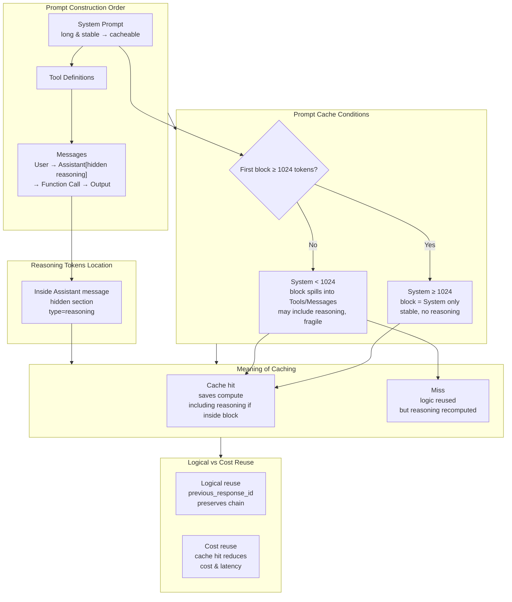

# Using the Responses API with Azure OpenAI GPT‑5 / Codex: Chain-of-Thought Reuse, Encryption, Summarization, and Cost Analysis

## **TL;DR (Quick Core Findings)**

- **Effort is the decisive variable determining the length of reasoning tokens** (see [Table 2: AB Comparison](#table-2-ab-comparison-data-r1-vs-r2-r2-uses-previous_response_id)).
	- `minimal` effort produces almost no chain-of-thought (ratio ≈ 0%), `low` effort roughly 0%–50%, while `medium` / `high` can reach 70%–93%.
	- `"summary":"detailed"` does NOT increase reasoning token count. The length of reasoning is driven by Effort.

- **`previous_response_id` enables direct cross-turn reuse of the reasoning chain** (see [Mechanism Details](#mechanism-deep-dive)).

	Conditions for reusing reasoning tokens (three key scenarios):
	1. **assistant → user scenario**: If the previous turn ended with an assistant type message, the Responses API actively clears the reasoning chain. This is a rule of the CoT reuse mechanism. The observation that `cached tokens` often become 0 in this scenario is an indirect effect. It happens when the application code modifies the conversation history to manage context length, which breaks the stability of the input prefix required by the Prompt Cache.
	2. **Consecutive function call scenario**: If multiple function calls happen in sequence, reasoning tokens can keep accumulating; cached tokens increase with each turn (stable prefix reuse).
	3. **Modality switching scenario**: If there is a modality change between function call outputs (e.g., last turn function_call_output only text, next turn includes an image via function_call_output:string + role:user type:input_image combination), reasoning tokens are still reused, but cached tokens may reset to 0 (new multi-modal request may route to a different backend endpoint).

- **Encrypted mode encrypts the reasoning chain—not the final visible output** (see [Table 1: ENCRYPTED Scenarios](#table-1-multi-scenario-token-data-including-cache-hits) and [Two Encryption Modes](#4-two-modes-for-encrypted-reasoning-chains)).
	- `include=["reasoning.encrypted_content"]` returns an encrypted reasoning blob the application can store locally and pass back for reuse.
	- `store=False`: server does not persist plaintext—satisfies ZDR/GDPR style compliance—but the service cannot account plaintext reasoning tokens server-side.
	- `store=True`: server retains plaintext—full usage statistics available; can simultaneously return encrypted version for local persistence.

- **Advantages of Responses API over traditional Chat Completions API** (see [Responses API vs Chat Completions API](#responses-api-vs-chat-completions-api)):
	- Native reasoning chain management & reuse (including encrypted chains)
	- Reasoning chain summarization observability (`concise` / `auto` / `detailed`)
	- Native multi-turn chain reuse + conditional invocation
	- First-class function calling, multimodal IO, structured output aggregation

- **Experimental confirmations** (see [Full Experimental Data](#experiment-scenarios-and-result-analysis)):
	- In identical_dialogue scenarios, high Effort saves up to **94.3%** reasoning tokens
	- In identical_code scenarios, savings are **36%–66%** (matches realistic iterative coding)
	- Prompt Cache hit requires: prefix ≥1024 tokens + identical params + stable `previous_response_id` reuse
	- **Detailed decision checklist & best practices**: see [Operations Handbook](#decision-checklists--operations-handbook)

------

## **Background & Problems**

Typical engineering pain points when deploying LLMs in production:

1. **Multi-turn reasoning chain loss**  
	 Model cannot “remember” prior chain-of-thought across turns—must re-think from scratch each turn (wasted compute & inconsistent logic).
2. **High cost maintaining full context**  
	 Chat Completions requires explicit full message history replay: high token cost, risk of exceeding context length.
3. **No direct access/reuse of reasoning chain**  
	 Previous turn reasoning not retrievable or reusable (especially in encrypted, privacy-preserving form).
4. **Compliance & data sovereignty**  
	 Under ZDR/GDPR style regimes, provider should not store plaintext reasoning, but business still wants local retention & reuse.
5. **Reasoning observability & cost governance**  
	 Need to inspect reasoning footprint (reasoning token share) without exposing raw chain-of-thought; need to validate whether `"summary":"detailed"` affects reasoning cost for optimization.

------

## **Mechanism Deep Dive**

### **1. Reasoning Tokens vs Cached Tokens: Two Distinct Optimization Axes**

In the Responses API, understanding the difference is critical:

- **Reasoning Tokens**  
	- Nature: internal chain-of-thought tokens generated during inference
	- Location: embedded inside the assistant message (hidden `type=reasoning`) alongside visible `output_text`
	- Driven by: `reasoning.effort` (minimal / low / medium / high)
	- Cost: billed as output tokens but invisible to end user
	- Reuse: via `previous_response_id` or encrypted blob (`reasoning.encrypted_content`)

- **Cached Tokens**  
	- Nature: input tokens that hit Prompt Cache (already processed prefix)
	- Location: `input_tokens_details.cached_tokens`
	- Driven by: prefix length (≥1024 tokens), prefix stability, consistent routing
	- Cost: discounted (often ≈10% of normal input token price)
	- Hit conditions: exact match of prefix (System → Tool Definitions → initial Messages ordering)

**Relationship:**
- **Logical reuse (Reasoning Tokens)**: avoids recomputation of thinking, improves consistency.
- **Cost optimization (Cached Tokens)**: reduces input billing & latency.
- **Best Practice**: Achieve both (use `previous_response_id` + stable long prefix).

### **2. `previous_response_id` Reuse Mechanics**

#### **2.1 Basic Principle**

`previous_response_id` lets the service retain the prior reasoning chain and continue it automatically:

```python
# Round 1: generate reasoning chain
resp1 = client.responses.create(
		model="gpt-5",
		input=[{"role": "user", "content": "Who was more formidable, Cao Cao or Sun Quan?"}],
		reasoning={"effort": "high", "summary": "detailed"},
		store=True  # Critical: server stores reasoning
)

# Round 2: reuse reasoning chain
resp2 = client.responses.create(
		model="gpt-5",
		input=[{"role": "user", "content": "Please restate your conclusion."}],
		previous_response_id=resp1.id,
		reasoning={"effort": "high", "summary": "detailed"}
)
```

#### **2.2 Three Typical Reuse Behaviors**

| Scenario Type               | Reasoning Token Behavior                  | Cached Token Behavior (Indirect Effect)       | Typical Use Case                                 |
| --------------------------- | ----------------------------------------- | --------------------------------------------- | ------------------------------------------------ |
| **assistant → user**        | Cleared (prior chain intentionally reset) | Often 0 (due to client-side history modification) | New user question after assistant output         |
| **consecutive function_call** | Preserved (chain extends)                 | Increases with each turn (stable prefix)      | Tool pipelines (weather → parse → format)        |
| **modality-switch function_call** | Preserved (logic intact)                   | May reset (routing changes)                   | Text tool output → next turn includes image      |

**Measured evidence (from Table 1):**
- **FUNCTION_R2**: reasoning = 0 (no new chain needed), cached = 3840 (stable prefix cache)
- **BASIC_R2**: reasoning = 192 (partial recomputation), cached = 3456
- **ENCRYPTED_R2 (store=False)**: reasoning = 384 (logical reuse), cached = 3456 (cache hit)

### **3. Prompt Cache Hit Mechanics**

#### **3.1 Prompt Construction Order**

```
System Prompt → Tool Definitions → Messages
```

**Inside Messages order**: User → Assistant (hidden COT) → Function Call → Function Call Output

#### **3.2 Where COT (Reasoning Tokens) Live in the Buffer**
- Embedded inside the assistant message (not a separate message item) as `type=reasoning`.

#### **3.3 Cache Hit Requirements**
- First cache block ≥ 1024 tokens
- Taken from the beginning of the full prompt
- **If System Prompt ≥ 1024 tokens**: first block contains only system prompt (stable but contains no previous reasoning)
- **If System Prompt < 1024 tokens**: block spills into tools/messages (may include reasoning but fragile—differences break cache)

#### **3.4 Why COT in Cache Matters**
- If included in a cached block, actual compute saved.
- If not, logic may still reuse but reasoning recomputed.

#### **3.5 Logical vs Cost Reuse**
- **Logical reuse**: `previous_response_id` preserves chain semantics.
- **Cache reuse**: reduces input cost + latency.

#### **3.6 Observed Server Behaviors**
- assistant → user: Clears reasoning tokens. The observation that `cached_tokens` often become 0 is an indirect effect — it occurs when client code modifies conversation history to manage context length, which breaks the prefix stability required by Prompt Cache.
- assistant → function_call: Reasoning preserved; cached tokens stable or increasing
- Consecutive function_call: Reasoning preserved; cached tokens increase
- Modality switch: Reasoning preserved; cached tokens may reset to 0



### **4. Two Modes for Encrypted Reasoning Chains**

#### **4.1 `store=True`: Stateful Reuse (Server Retains Plaintext)**

```python
resp1 = client.responses.create(
		model="gpt-5",
		input="Question",
		store=True,  # Server keeps plaintext CoT
		include=["reasoning.encrypted_content"]  # Optional: also return encrypted copy
)

resp2 = client.responses.create(
		model="gpt-5",
		input="Follow-up",
		previous_response_id=resp1.id  # Server auto-loads stored chain
)
```

**Characteristics:**
- Server can compute full reasoning usage stats
- Can also return encrypted copy for local persistence
- Suitable when you need observability + governance

#### **4.2 `store=False`: Stateless Reuse (ZDR/GDPR Style Compliance)**

```python
resp1 = client.responses.create(
		model="gpt-5",
		input="Question",
		store=False,  # Server does not retain plaintext
		include=["reasoning.encrypted_content"]
)

# Must pass encrypted reasoning blob back
context = [{"role": "user", "content": "Follow-up"}]
context += resp1.output  # includes reasoning.encrypted_content

resp2 = client.responses.create(
		model="gpt-5",
		input=context,  # Decrypted in-memory only
		store=False,
		include=["reasoning.encrypted_content"]
)
```

**Characteristics:**
- Meets data sovereignty constraints (no server persistence)
- Server may not report accurate reasoning token usage (may show 0)
- Encrypted blob is the portable carrier enabling logical reuse
- **Measured**: `store=False` still gets cache hits (e.g., ENCRYPTED_R2 cached=3456)

------

## **Responses API vs Chat Completions API**

| Feature              | Chat Completions API              | Responses API                                                     |
| -------------------- | --------------------------------- | ----------------------------------------------------------------- |
| Context management   | Must resend full messages         | `previous_response_id` server-side chain retention & continuation |
| Reasoning reuse      | Not available                     | Explicit reasoning items (plaintext ID or encrypted blob)         |
| Reasoning summary    | None                              | `reasoning.summary` safe summaries (no raw CoT leak)              |
| Encrypted reasoning  | None                              | `store=False` + encrypted_content (stateless reuse)               |
| Tool outputs         | Mixed in messages                 | Structured output types (message / tool_call / reasoning)         |
| Multimodal structure | Limited                           | Native multi-type structured IO                                   |

**Capability Upgrade Summary:**
- Real reasoning chain referencing + auto / encrypted round-trip
- Compliance-safe reasoning reuse
- Richer structured multimodal + tool orchestration

------

## **Experiment Scenarios and Result Analysis**

Designed 6 scenario families to validate reasoning reuse, encryption handling, and Prompt Cache interactions.

### **Experimental Design Principles**
- **Two turns**: R1 builds chain; R2 reuses via `previous_response_id`
- **Long System Prompt**: All scenarios inject ≥1024 token stable system prompt to observe cache hits
- **Unified parameters**: `reasoning.effort=high`, `reasoning.summary=detailed` (except AB tests) to maximize reasoning
- **Control groups**: AB matrix varies effort/summary to isolate influence

### **6 Scenario Families & Goals**

| ID | Scenario Name      | Objective                                                      | Key Metrics                          |
| -- | ------------------ | -------------------------------------------------------------- | ------------------------------------ |
| 1  | **BASIC**          | Baseline dialogue reuse + cache hit behavior                   | reasoning_ratio, cached_tokens       |
| 2  | **FUNCTION**       | Tool pipeline reasoning retention + cache growth               | RT/CT evolution across tool turns    |
| 3  | **ENCRYPTED**      | Encrypted chain reuse under store=True/False + cache           | Effect of store mode on caching      |
| 4  | **SUMMARY**        | Impact of reasoning summary mode (summary does not alter RT)   | reasoning_ratio vs completion_tokens |
| 5  | **PREVIOUS_ID**    | Explanation expansion tasks (R2 elaborates prior answer)       | R2 reasoning_tokens direction        |
| 6  | **AB TEST**        | Systematic variation of effort / summary / scenario type       | Token reduction %, ratio shifts      |

### **AB Sub-Scenario Matrix**
Effort (minimal/low/medium/high) × Summary (none/auto/detailed) × Task types:
1. **normal**: generic prompt ("Explain why the sky is blue")
2. **identical_dialogue**: restatement style (Q → restate conclusion)
3. **identical_code**: iterative code modification

**Intent:**
- normal: baseline effort/summary behavior on single reasoning
- identical_dialogue: theoretical max savings when R2 adds no new info
- identical_code: real-world partial structural reuse + small edits

------

### **Results Data**

Two rounds per scenario; R2 always uses `previous_response_id`; all include long system prompt for potential cache hits.

#### **Table 1: Multi-Scenario Token Data (with Cache Hits)**

| Scenario     | Round | store | input_tokens | output_tokens | reasoning_tokens | completion_tokens | cached_tokens | reasoning_ratio |
| ------------ | ----- | ----- | ------------ | ------------- | ---------------- | ----------------- | ------------- | --------------- |
| BASIC        | R1    | —     | 3515         | 346           | 320              | 26                | 0             | 92.5%           |
| BASIC        | R2    | —     | 3549         | 212           | 192              | 20                | 3456          | 90.6%           |
| FUNCTION     | R1    | —     | 3637         | 225           | 192              | 33                | 0             | 85.3%           |
| FUNCTION     | R2    | —     | 3934         | 25            | 0                | 25                | 3840          | 0.0%            |
| ENCRYPTED    | R1    | False | 3519         | 789           | 704              | 85                | 0             | 89.2%           |
| ENCRYPTED    | R2    | False | 4316         | 408           | 384              | 24                | 3456          | 94.1%           |
| ENCRYPTED    | R1    | True  | 3519         | 1305          | 1216             | 89                | 0             | 93.2%           |
| ENCRYPTED    | R2    | True  | 3617         | 290           | 256              | 34                | 0             | 88.3%           |
| SUMMARY      | R1    | —     | 3519         | 1883          | 1536             | 347               | 0             | 81.6%           |
| SUMMARY      | R2    | —     | 3880         | 841           | 768              | 73                | 3456          | 91.3%           |
| PREVIOUS_ID  | R1    | —     | 3524         | 135           | 128              | 7                 | 0             | 94.8%           |
| PREVIOUS_ID  | R2    | —     | 3540         | 310           | 256              | 54                | 3456          | 82.6%           |

**Highlights:**
- R2 often shows large cached tokens (e.g., BASIC_R2=3456, FUNCTION_R2=3840), proving Prompt Cache is effective with `previous_response_id` reuse + stable prefix.
- FUNCTION_R2: reasoning=0 but cached sizable → pure visible summarization using previous tool outputs.
- ENCRYPTED store=False: reasoning reused (384) + cache hit (3456) despite no server plaintext retention.

#### **Table 2: AB Comparison (R1 vs R2 with `previous_response_id`)**

(Representative subset; consistent pattern across full matrix.)

| effort  | summary            | case | input_tokens | output_tokens | reasoning_tokens | completion_tokens | cached_tokens | reasoning_ratio |
| ------- | ------------------ | ---- | ------------ | ------------- | ---------------- | ----------------- | ------------- | --------------- |
| minimal | none               | R1   | 3522         | 69            | 0                | 69                | 0             | 0.0%            |
| minimal | none               | R2   | 3598         | 38            | 0                | 38                | 0             | 0.0%            |
| minimal | auto               | R1   | 3522         | 87            | 0                | 87                | 0             | 0.0%            |
| minimal | auto               | R2   | 3616         | 49            | 0                | 49                | 3456          | 0.0%            |
| minimal | detailed           | R1   | 3522         | 59            | 0                | 59                | 0             | 0.0%            |
| minimal | detailed           | R2   | 3588         | 28            | 0                | 28                | 3456          | 0.0%            |
| low     | none               | R1   | 3522         | 73            | 0                | 73                | 0             | 0.0%            |
| low     | none               | R2   | 3602         | 50            | 0                | 50                | 3456          | 0.0%            |
| low     | auto               | R1   | 3522         | 65            | 0                | 65                | 0             | 0.0%            |
| low     | auto               | R2   | 3594         | 91            | 64               | 27                | 3456          | 70.3%           |
| low     | detailed           | R1   | 3522         | 67            | 0                | 67                | 0             | 0.0%            |
| low     | detailed           | R2   | 3596         | 106           | 64               | 42                | 3456          | 60.4%           |
| medium  | none               | R1   | 3522         | 209           | 128              | 81                | 0             | 61.2%           |
| medium  | none               | R2   | 3610         | 159           | 128              | 31                | 3456          | 80.5%           |
| medium  | auto               | R1   | 3522         | 327           | 256              | 71                | 0             | 78.3%           |
| medium  | auto               | R2   | 3600         | 225           | 192              | 33                | 3456          | 85.3%           |
| medium  | detailed           | R1   | 3522         | 310           | 256              | 54                | 0             | 82.6%           |
| medium  | detailed           | R2   | 3583         | 160           | 128              | 32                | 3456          | 80.0%           |
| high    | none               | R1   | 3522         | 377           | 320              | 57                | 0             | 84.9%           |
| high    | none               | R2   | 3586         | 284           | 256              | 28                | 3456          | 90.1%           |
| high    | auto               | R1   | 3522         | 261           | 192              | 69                | 3456          | 73.6%           |
| high    | auto               | R2   | 3598         | 292           | 256              | 36                | 3456          | 87.7%           |
| high    | detailed           | R1   | 3522         | 317           | 256              | 61                | 3456          | 80.8%           |
| high    | detailed           | R2   | 3590         | 362           | 320              | 42                | 3456          | 88.4%           |
| minimal | identical_dialogue | R1   | 3526         | 301           | 0                | 301               | 3456          | 0.0%            |
| minimal | identical_dialogue | R2   | 3845         | 36            | 0                | 36                | 3456          | 0.0%            |
| low     | identical_dialogue | R1   | 3526         | 361           | 128              | 233               | 0             | 35.5%           |
| low     | identical_dialogue | R2   | 3777         | 32            | 0                | 32                | 3456          | 0.0%            |
| medium  | identical_dialogue | R1   | 3526         | 1241          | 1088             | 153               | 0             | 87.7%           |
| medium  | identical_dialogue | R2   | 3697         | 167           | 128              | 39                | 3456          | 76.6%           |
| high    | identical_dialogue | R1   | 3526         | 1901          | 1728             | 173               | 0             | 90.9%           |
| high    | identical_dialogue | R2   | 3717         | 230           | 192              | 38                | 3456          | 83.5%           |
| low     | identical_code     | R1   | 3528         | 201           | 128              | 73                | 0             | 63.7%           |
| low     | identical_code     | R2   | 3625         | 80            | 0                | 80                | 3456          | 0.0%            |
| medium  | identical_code     | R1   | 3528         | 394           | 320              | 74                | 0             | 81.2%           |
| medium  | identical_code     | R2   | 3626         | 332           | 256              | 76                | 3456          | 77.1%           |
| high    | identical_code     | R1   | 3528         | 1816          | 1728             | 88                | 3456          | 95.2%           |
| high    | identical_code     | R2   | 3640         | 670           | 576              | 94                | 3456          | 86.0%           |

**AB Insights:**
- R2 frequently shows cached_tokens=3456 (or higher) → stable prefix + prev reuse.
- identical_dialogue: R2 often collapses reasoning to near-zero while retaining cache hit—ideal “restatement” efficiency.
- identical_code: partial structural changes yield moderate reasoning reduction (20%–66.7%) with consistent cache hits.

#### **Table 3: Token Savings Under `previous_response_id` (Selected AB Cases)**

| Effort  | Scenario Type        | R1 reasoning_ratio | R2 reasoning_ratio | Ratio Δ (pp) | R1 reasoning_tokens | R2 reasoning_tokens | Token Reduction |
| ------- | -------------------- | ------------------ | ------------------ | ----------- | ------------------- | ------------------- | --------------- |
| minimal | identical_dialogue   | 0.0%               | 0.0%               | 0.0         | 0                   | 0                   | 0%              |
| low     | identical_dialogue   | 35.5%              | 0.0%               | -35.5       | 128                 | 0                   | 100.0%          |
| medium  | identical_dialogue   | 87.7%              | 76.6%              | -11.1       | 1088                | 128                 | 88.2%           |
| high    | identical_dialogue   | 90.9%              | 83.5%              | -7.4        | 1728                | 192                 | 88.9%           |
| low     | identical_code       | 63.7%              | 0.0%               | -63.7       | 128                 | 0                   | 100.0%          |
| medium  | identical_code       | 81.2%              | 77.1%              | -4.1        | 320                 | 256                 | 20.0%           |
| high    | identical_code       | 95.2%              | 86.0%              | -9.2        | 1728                | 576                 | 66.7%           |

**Field Explanations:**
- Ratio Δ (pp): difference in reasoning_ratio from R1 to R2.
- Token Reduction: absolute drop in reasoning_tokens → primary metric for logical reuse savings.

### **Integrated Conclusions**
1. `previous_response_id` is the most stable path to Prompt Cache hits.  
	 Even when reasoning ≈0 (minimal), cache hits still appear (e.g., minimal/auto R2).  
2. Effort governs reasoning length & reuse headroom.  
	 High effort => large reuse savings potential (e.g., high identical_code 1728→576, -66.7%).  
3. Task type affects savings scale:  
	 identical_dialogue often yields near-zero R2 reasoning; identical_code retains partial recomputation.  
4. Encryption differences:  
	 store=False still sees cache hits; store=True may not expose cached metrics (routing variance) but logical reuse holds.  
5. Dual-metric interpretation required: reasoning_tokens (logic) + cached_tokens (cost). FUNCTION_R2 shows logical minimalism (reasoning=0) + cost optimization (cached large).

------

## **Decision Checklists & Operations Handbook**

> This section is a practical troubleshooting and optimization guide. Skim first time; return when implementing or diagnosing.

Three checklists:
1. **Reasoning Reuse Checklist**
2. **Prompt Cache Hit Checklist**
3. **Combined Matrix: store × encryption × prev_id × reuse mode × caching**

### **Reasoning Reuse Checklist (Logical Continuity)**
- Request-side hard signals (any one):
	- Second turn passes `previous_response_id` (valid when `store=True` or default).
	- Under `store=False`, first turn includes `include=["reasoning.encrypted_content"]`; second turn injects prior `resp.output` (with encrypted reasoning) into input.
- Metric-side supporting indicators:
	- R2 reasoning_tokens sharply lower than R1 (e.g., FUNCTION_R1 192 → R2 0; SUMMARY_R1 1536 → R2 768; BASIC_R1 320 → R2 192).
	- Exception: explanation tasks may increase reasoning (e.g., PREVIOUS_ID R1 128 → R2 256) while still logically contiguous.
- Behavioral signals (tool chains):
	- Consecutive function_call outputs: R2 reasoning≈0 yet returns coherent answer referencing prior tool outputs.
	- Correct propagation of call_id across calls.
- Counterfactual test:
	- Remove `previous_response_id` and rerun R2: if reasoning grows & style shifts, original reuse was effective.

### **Prompt Cache Hit Checklist**
- Direct indicator: `usage.input_tokens_details.cached_tokens > 0` in R2.
- Preconditions (ideally all):
	- Prefix length ≥1024 tokens (long stable System first).
	- Prefix content exactly identical (System → Tools → Messages order; stable tool schema).
	- Same routing / modality (avoid text→image sudden shift).
	- Identical parameters (store, tools, parallel_tool_calls, reasoning config).
	- Within cache lifetime (avoid large delay or eviction).
- Note: Some deployments may suppress cached indicator; absence ≠ miss.

### **Combined Matrix: store × encryption × prev_id × reuse & caching**

| Combination                         | store | include encrypted? | Can use prev_id | Reuse Carrier & Method                                           | Logical Reuse | Cache Hit Potential                 | Example (Measured)                                    | Notes                                                  |
| ---------------------------------- | ----- | ------------------ | --------------- | --------------------------------------------------------------- | ------------- | ---------------------------------- | ----------------------------------------------------- | ------------------------------------------------------ |
| A: Stateful (simplest)             | True  | Optional           | Yes             | R2 references `previous_response_id`                            | Yes           | Common (≥1024 stable prefix)       | BASIC_R2=3456, FUNCTION_R2=3840, SUMMARY_R2=3456       | Encryption optional for extra local persistence       |
| B: Stateful + encrypted copy       | True  | Yes                | Yes             | prev_id + encrypted side copy                                    | Yes           | Varies (may hide metrics)          | ENCRYPTED_R2 store=True cached=0 (reasoning strong)    | Some routes hide cache stats                          |
| C: Stateless (compliant)           | False | Yes                | No              | Client stores + re-injects encrypted reasoning blob             | Yes           | Possible (same prefix rules)       | ENCRYPTED_R2 store=False cached=3456                  | prev_id unusable; encrypted blob is sole carrier      |
| D: Stateless w/o encryption (bad)  | False | No                 | No              | No carrier—cannot chain                                          | No            | Only prefix cache (no reasoning reuse) | —                                             | Not recommended; loses logical reuse entirely         |

**Interpretation Guidance:**
- Independent axes: reasoning reuse ≠ cache reuse.  
	- Cache=0 can still mean successful logical reuse.  
	- Cache>0 with reasoning=0 may still be ideal (e.g., summarization turn).  
- Dual-win: prev_id + stable prefix → both reasoning down & cached up.  
- Edge: explanation expansions may increase reasoning but still reuse chain logically.

### **Common Pitfalls & Boundaries**
- Pitfall: Treating `cached_tokens=0` as “no reuse.” Fix: check prev_id / encrypted reasoning & output continuity.
- Boundaries:
	- assistant → immediate user resets reasoning unless prev_id used.
	- Modality shift may invalidate cache while preserving reasoning.
	- identical turns may not always expose cache stats (routing variance).

### **Quick Diagnostic Flow**
1. Check if prev_id or encrypted reasoning blob used.
2. Inspect cached_tokens > 0? If 0, verify prefix stability & timing.
3. Compare R1 vs R2 reasoning_tokens (non-explanatory tasks should drop).
4. Run counterfactual (remove prev_id) to observe divergence.
5. Conclude separately: Logical reuse? Cache hit? Provide optimization tweaks.

### **Best Practices**
- Always prefer `previous_response_id` for stable reuse + cache synergy.
- Long stable System first (≥1024 tokens) + invariant Tools definitions.
- Keep parameters identical between turns.
- Reuse within cache lifetime; chain inside function_call loops when possible.
- For ENCRYPTED:
	- `store=False`: rely on `reasoning.encrypted_content` blob; cache can still hit.
	- `store=True`: rely on prev_id; absence of cached metric ≠ failure.

------

## **Full Reproduction Code**

> Modular script below reproduces all 6 scenarios + AB tests.

### **Features**
- 6 scenarios: BASIC, FUNCTION, ENCRYPTED (True/False), SUMMARY, PREVIOUS_ID, AB_SUMMARY
- AB automation: 4 efforts × 3 summaries × 3 task types = 36 combinations
- Auto collects reasoning_tokens, cached_tokens, reasoning_ratio
- Demonstrates encrypted stateless reuse (`store=False`)

### **Usage**

```bash
# Run a single scenario
python responses_playbook6.py basic
python responses_playbook6.py function
python responses_playbook6.py encrypted_false
python responses_playbook6.py ab_summary

# Run all tests
python responses_playbook6.py all
```

### **Complete Script**

```python
# responses_playbook6.py
import os
import sys
import json
import argparse
from openai import AzureOpenAI

GPT5_API_KEY = os.environ.get("AZURE_OPENAI_API_KEY", "AlP*")
GPT5_ENDPOINT = os.environ.get("AZURE_OPENAI_ENDPOINT", "https://YOUR-ENDPOINT.cognitiveservices.azure.com/")
GPT5_RESPONSES_API_VERSION = os.environ.get("AZURE_OPENAI_API_VERSION", "2025-03-01-preview")
GPT5_DEPLOYMENT_NAME = os.environ.get("AZURE_OPENAI_DEPLOYMENT", "gpt-5")

COLOR_RESET = "\033[0m"
COLOR_GREEN = "\033[92m"
COLOR_RED = "\033[91m"

# Long, stable System Prompt to satisfy ≥1024 token prefix for cache experiments
LONG_SYSTEM = "This is a stable system instruction. " * 500

def ensure_key():
	if not GPT5_API_KEY or not GPT5_ENDPOINT or not GPT5_RESPONSES_API_VERSION or not GPT5_DEPLOYMENT_NAME:
		print("Azure GPT-5 config missing")
		sys.exit(1)

def client():
	return AzureOpenAI(
		api_key=GPT5_API_KEY,
		azure_endpoint=GPT5_ENDPOINT,
		api_version=GPT5_RESPONSES_API_VERSION
	)

usage_records_all = []
usage_records_ab = []

def print_usage_record(tag, usage, store_flag=None):
	it = usage.get("input_tokens", 0)
	ot = usage.get("output_tokens", 0)
	rt = usage.get("output_tokens_details", {}).get("reasoning_tokens", 0)
	completion = ot - rt
	cached_in = usage.get("input_tokens_details", {}).get("cached_tokens", 0)
	ratio = f"{(rt/ot*100):.1f}%" if ot else "0%"
	store_info = f"(store={store_flag})" if store_flag is not None else ""
	print(f"[{tag}] {store_info} TOKENS: input={it}, output={ot}, reasoning={rt}, completion={completion}, cached_in={cached_in}, ratio={ratio}")

def extract_call_id(resp_obj):
	try:
		for item in getattr(resp_obj, "output", []):
			typ = getattr(item, "type", None)
			if typ in ("function_call", "tool_call"):
				cid = getattr(item, "call_id", None)
				if cid:
					return cid
	except Exception:
		pass
	try:
		out_list = resp_obj.model_dump().get("output", [])
		for item in out_list:
			if isinstance(item, dict) and item.get("type") in ("function_call", "tool_call"):
				cid = item.get("call_id")
				if cid:
					return cid
	except Exception:
		pass
	return None

def weather_tool():
	return [{
		"type": "function",
		"name": "get_weather",
		"description": "Get current temperature in Celsius.",
		"parameters": {
			"type": "object",
			"properties": {
				"latitude": {"type": "number"},
				"longitude": {"type": "number"}
			},
			"required": ["latitude", "longitude"],
			"additionalProperties": False
		},
		"strict": True
	}]

def cmd_basic():
	print("\n===== BASIC MODE (prev_id) =====")
	c = client()
	context1 = [{"role": "system", "content": LONG_SYSTEM}, {"role": "user", "content": "tell me a joke"}]
	resp1 = c.responses.create(model=GPT5_DEPLOYMENT_NAME, input=context1, store=True, reasoning={"summary": "detailed", "effort": "high"}, parallel_tool_calls=False)
	print("[BASIC] OUTPUT R1:", resp1.output_text)
	usage1 = resp1.model_dump().get("usage", {})
	print_usage_record("BASIC_R1", usage1)
	resp2 = c.responses.create(model=GPT5_DEPLOYMENT_NAME, input=[{"role": "user", "content": "tell me one more"}], previous_response_id=resp1.id, store=True, reasoning={"summary": "detailed", "effort": "high"}, parallel_tool_calls=False)
	print("[BASIC] OUTPUT R2:", resp2.output_text)
	usage2 = resp2.model_dump().get("usage", {})
	print_usage_record("BASIC_R2", usage2)
	usage_records_all.append(("BASIC_R1", usage1))
	usage_records_all.append(("BASIC_R2", usage2))

def cmd_function():
	print("\n===== FUNCTION MODE (prev_id) =====")
	c = client()
	tools = weather_tool()
	context1 = [{"role": "system", "content": LONG_SYSTEM}, {"role": "user", "content": "What's the weather like in Paris today?"}]
	resp1 = c.responses.create(model=GPT5_DEPLOYMENT_NAME, input=context1, tools=tools, store=True, reasoning={"summary": "detailed", "effort": "high"}, parallel_tool_calls=False)
	usage1 = resp1.model_dump().get("usage", {})
	print_usage_record("FUNCTION_R1", usage1)
	call_id = extract_call_id(resp1)
	if not call_id:
		print(COLOR_RED + "[FUNCTION] No function_call id found in R1 output" + COLOR_RESET)
		return
	func_out = [{"type": "function_call_output", "call_id": call_id, "output": "15°C"}]
	resp2 = c.responses.create(model=GPT5_DEPLOYMENT_NAME, input=func_out, tools=tools, previous_response_id=resp1.id, store=True, reasoning={"summary": "detailed", "effort": "high"}, parallel_tool_calls=False)
	print("[FUNCTION] OUTPUT R2:", resp2.output_text)
	usage2 = resp2.model_dump().get("usage", {})
	print_usage_record("FUNCTION_R2", usage2)
	usage_records_all.append(("FUNCTION_R1", usage1))
	usage_records_all.append(("FUNCTION_R2", usage2))

def cmd_encrypted(store_flag):
	print(f"\n===== ENCRYPTED MODE (store={store_flag}) =====")
	c = client()
	context1 = [{"role": "system", "content": LONG_SYSTEM}, {"role": "user", "content": "What's the weather like in Paris today?"}]
	resp1 = c.responses.create(model=GPT5_DEPLOYMENT_NAME, input=context1, store=store_flag, include=["reasoning.encrypted_content"], reasoning={"summary": "detailed", "effort": "high"}, parallel_tool_calls=False)
	print("[ENCRYPTED] OUTPUT R1:", resp1.output_text)
	usage1 = resp1.model_dump().get("usage", {})
	print_usage_record("ENCRYPTED_R1", usage1, store_flag=store_flag)
	if store_flag:
		resp2 = c.responses.create(model=GPT5_DEPLOYMENT_NAME, input=[{"role": "user", "content": "Thanks, summarize briefly."}], previous_response_id=resp1.id, store=store_flag, include=["reasoning.encrypted_content"], reasoning={"summary": "detailed", "effort": "high"}, parallel_tool_calls=False)
	else:
		context2 = [{"role": "system", "content": LONG_SYSTEM}, {"role": "user", "content": "Thanks, summarize briefly."}]
		context2 += resp1.output
		resp2 = c.responses.create(model=GPT5_DEPLOYMENT_NAME, input=context2, store=store_flag, include=["reasoning.encrypted_content"], reasoning={"summary": "detailed", "effort": "high"}, parallel_tool_calls=False)
	print("[ENCRYPTED] OUTPUT R2:", resp2.output_text)
	usage2 = resp2.model_dump().get("usage", {})
	print_usage_record("ENCRYPTED_R2", usage2, store_flag=store_flag)
	usage_records_all.append((f"ENCRYPTED_R1_store_{store_flag}", usage1))
	usage_records_all.append((f"ENCRYPTED_R2_store_{store_flag}", usage2))

def cmd_summary():
	print("\n===== SUMMARY MODE (prev_id) =====")
	c = client()
	context1 = [{"role": "system", "content": LONG_SYSTEM}, {"role": "user", "content": "Explain differences between photosynthesis and respiration."}]
	resp1 = c.responses.create(model=GPT5_DEPLOYMENT_NAME, input=context1, store=True, reasoning={"summary": "detailed", "effort": "high"}, parallel_tool_calls=False)
	print("[SUMMARY] OUTPUT R1:", resp1.output_text[:200], "...")
	usage1 = resp1.model_dump().get("usage", {})
	print_usage_record("SUMMARY_R1", usage1)
	resp2 = c.responses.create(model=GPT5_DEPLOYMENT_NAME, input=[{"role": "user", "content": "Summarize the key points in one sentence."}], previous_response_id=resp1.id, store=True, reasoning={"summary": "detailed", "effort": "high"}, parallel_tool_calls=False)
	print("[SUMMARY] OUTPUT R2:", resp2.output_text[:200], "...")
	usage2 = resp2.model_dump().get("usage", {})
	print_usage_record("SUMMARY_R2", usage2)
	usage_records_all.append(("SUMMARY_R1", usage1))
	usage_records_all.append(("SUMMARY_R2", usage2))

def cmd_previous_id():
	print("\n===== PREVIOUS_ID EXPLANATION SCENARIO (prev_id) =====")
	c = client()
	context1 = [{"role": "system", "content": LONG_SYSTEM}, {"role": "user", "content": "Is 2 less than 10? Answer True or False."}]
	resp1 = c.responses.create(model=GPT5_DEPLOYMENT_NAME, input=context1, store=True, reasoning={"summary": "detailed", "effort": "high"}, parallel_tool_calls=False)
	print("[PREVIOUS_ID] OUTPUT R1:", resp1.output_text)
	usage1 = resp1.model_dump().get("usage", {})
	print_usage_record("PREVIOUS_ID_R1", usage1)
	resp2 = c.responses.create(model=GPT5_DEPLOYMENT_NAME, input=[{"role": "user", "content": "Explain your previous decision."}], previous_response_id=resp1.id, store=True, reasoning={"summary": "detailed", "effort": "high"}, parallel_tool_calls=False)
	print("[PREVIOUS_ID] OUTPUT R2:", resp2.output_text)
	usage2 = resp2.model_dump().get("usage", {})
	print_usage_record("PREVIOUS_ID_R2", usage2)
	usage_records_all.append(("PREVIOUS_ID_R1", usage1))
	usage_records_all.append(("PREVIOUS_ID_R2", usage2))

def run_ab_case(effort, summary_mode):
	c = client()
	context1 = [{"role": "system", "content": LONG_SYSTEM}, {"role": "user", "content": "Explain why the sky is blue in a concise way."}]
	reasoning_param = {"effort": effort}
	if summary_mode != "none":
		reasoning_param["summary"] = summary_mode
	resp1 = c.responses.create(model=GPT5_DEPLOYMENT_NAME, input=context1, store=True, reasoning=reasoning_param, parallel_tool_calls=False)
	usage1 = resp1.model_dump().get("usage", {})
	print(f"[AB] effort={effort}, summary={summary_mode}, case=R1, OUTPUT:", resp1.output_text[:160])
	print_usage_record(f"AB-{effort}-{summary_mode}-R1", usage1)
	usage_records_ab.append((effort, summary_mode, "R1", usage1))
	resp2 = c.responses.create(model=GPT5_DEPLOYMENT_NAME, input=[{"role": "user", "content": "Repeat briefly."}], previous_response_id=resp1.id, store=True, reasoning=reasoning_param, parallel_tool_calls=False)
	usage2 = resp2.model_dump().get("usage", {})
	print(f"[AB] effort={effort}, summary={summary_mode}, case=R2(prev_id), OUTPUT:", resp2.output_text[:160])
	print_usage_record(f"AB-{effort}-{summary_mode}-R2", usage2)
	usage_records_ab.append((effort, summary_mode, "R2", usage2))

def run_prev_id_identical_dialogue(effort):
	c = client()
	q1 = "Who was more formidable, Cao Cao or Sun Quan? Give a brief reason."
	q2 = "Restate your conclusion in one sentence."
	context1 = [{"role": "system", "content": LONG_SYSTEM}, {"role": "user", "content": q1}]
	resp1 = c.responses.create(model=GPT5_DEPLOYMENT_NAME, input=context1, store=True, reasoning={"summary": "detailed", "effort": effort}, parallel_tool_calls=False)
	usage1 = resp1.model_dump().get("usage", {})
	resp2 = c.responses.create(model=GPT5_DEPLOYMENT_NAME, input=[{"role": "user", "content": q2}], previous_response_id=resp1.id, store=True, reasoning={"summary": "detailed", "effort": effort}, parallel_tool_calls=False)
	usage2 = resp2.model_dump().get("usage", {})
	usage_records_ab.append((effort, "identical_dialogue", "R1", usage1))
	usage_records_ab.append((effort, "identical_dialogue", "R2", usage2))

def run_prev_id_identical_code(effort):
	c = client()
	q1 = "Write a Python function that, given a list, returns the squares of all even numbers."
	q2 = "Modify your previous code to only keep squares of positive even numbers."
	context1 = [{"role": "system", "content": LONG_SYSTEM}, {"role": "user", "content": q1}]
	resp1 = c.responses.create(model=GPT5_DEPLOYMENT_NAME, input=context1, store=True, reasoning={"summary": "detailed", "effort": effort}, parallel_tool_calls=False)
	usage1 = resp1.model_dump().get("usage", {})
	resp2 = c.responses.create(model=GPT5_DEPLOYMENT_NAME, input=[{"role": "user", "content": q2}], previous_response_id=resp1.id, store=True, reasoning={"summary": "detailed", "effort": effort}, parallel_tool_calls=False)
	usage2 = resp2.model_dump().get("usage", {})
	usage_records_ab.append((effort, "identical_code", "R1", usage1))
	usage_records_ab.append((effort, "identical_code", "R2", usage2))

def cmd_ab_summary():
	print("\n===== AB TEST (all using prev_id) =====")
	for eff in ["minimal", "low", "medium", "high"]:
		for summ in ["none", "auto", "detailed"]:
			run_ab_case(eff, summ)
		run_prev_id_identical_dialogue(eff)
		run_prev_id_identical_code(eff)

def print_table_all():
	print("\n=== Table 1: ALL Scenario Token Data ===")
	print("Scenario                 | input_tokens | output_tokens | reasoning_tokens | completion_tokens | cached_tokens | reasoning_ratio")
	for name, usage in usage_records_all:
		it = usage.get("input_tokens", 0)
		ot = usage.get("output_tokens", 0)
		rt = usage.get("output_tokens_details", {}).get("reasoning_tokens", 0)
		completion = ot - rt
		cached_in = usage.get("input_tokens_details", {}).get("cached_tokens", 0)
		ratio = f"{(rt/ot*100):.1f}%" if ot else "0%"
		print(f"{name:<23} | {it:<12} | {ot:<13} | {rt:<16} | {completion:<17} | {cached_in:<13} | {ratio}")

def print_table_ab():
	print("\n=== Table 2: AB Test Token Data ===")
	print("effort   | summary              | case   | input_tokens | output_tokens | reasoning_tokens | completion_tokens | cached_tokens | reasoning_ratio")
	for eff, summ, case, usage in usage_records_ab:
		it = usage.get("input_tokens", 0)
		ot = usage.get("output_tokens", 0)
		rt = usage.get("output_tokens_details", {}).get("reasoning_tokens", 0)
		completion = ot - rt
		cached_in = usage.get("input_tokens_details", {}).get("cached_tokens", 0)
		ratio = f"{(rt/ot*100):.1f}%" if ot else "0%"
		print(f"{eff:<8} | {summ:<20} | {case:<6} | {it:<12} | {ot:<13} | {rt:<16} | {completion:<17} | {cached_in:<13} | {ratio}")

def cmd_all():
	cmd_basic()
	cmd_function()
	cmd_encrypted(store_flag=False)
	cmd_encrypted(store_flag=True)
	cmd_summary()
	cmd_previous_id()
	print_table_all()
	cmd_ab_summary()
	print_table_ab()

if __name__ == "__main__":
	ensure_key()
	p = argparse.ArgumentParser()
	p.add_argument("mode", choices=["basic","function","encrypted_false","encrypted_true","summary","previous_id","ab_summary","all"])
	args = p.parse_args()
	if args.mode == "basic":
		cmd_basic(); print_table_all()
	elif args.mode == "function":
		cmd_function(); print_table_all()
	elif args.mode == "encrypted_false":
		cmd_encrypted(store_flag=False); print_table_all()
	elif args.mode == "encrypted_true":
		cmd_encrypted(store_flag=True); print_table_all()
	elif args.mode == "summary":
		cmd_summary(); print_table_all()
	elif args.mode == "previous_id":
		cmd_previous_id(); print_table_all()
	elif args.mode == "ab_summary":
		cmd_ab_summary(); print_table_ab()
	elif args.mode == "all":
		cmd_all()
```

**Full Execution Command:**

```
(base) root@linuxworkvm:~# python responses_playbook6.py all
```

**Sample Output (Translated Headings, Data Preserved):**

```
===== BASIC MODE (prev_id) =====
[BASIC] OUTPUT R1: I tried to make a belt out of clocks—turns out it was a waist of time.
[BASIC_R1]  TOKENS: input=3515, output=346, reasoning=320, completion=26, cached_in=0, ratio=92.5%
[BASIC] OUTPUT R2: I asked my dog what’s two minus two—he said nothing.
[BASIC_R2]  TOKENS: input=3549, output=212, reasoning=192, completion=20, cached_in=3456, ratio=90.6%

===== FUNCTION MODE (prev_id) =====
[FUNCTION_R1]  TOKENS: input=3637, output=225, reasoning=192, completion=33, cached_in=0, ratio=85.3%
[FUNCTION] OUTPUT R2: Right now in Paris it’s about 15°C. Would you like details like rain chance or wind?
[FUNCTION_R2]  TOKENS: input=3934, output=25, reasoning=0, completion=25, cached_in=3840, ratio=0.0%

===== ENCRYPTED MODE (store=False) =====
[ENCRYPTED] OUTPUT R1: I don’t have live weather access. If you want, I can look it up for you.

Typical late-September in Paris: highs around 18–21°C (64–70°F), lows 10–13°C (50–55°F), partly cloudy with a chance of light showers.

Would you like me to fetch the current forecast from Météo-France or Weather.com?
[ENCRYPTED_R1] (store=False) TOKENS: input=3519, output=789, reasoning=704, completion=85, cached_in=0, ratio=89.2%
[ENCRYPTED] OUTPUT R2: It repeatedly emphasizes that the message is a stable system instruction, stressing its persistence and consistency.
[ENCRYPTED_R2] (store=False) TOKENS: input=4316, output=408, reasoning=384, completion=24, cached_in=3456, ratio=94.1%

===== ENCRYPTED MODE (store=True) =====
[ENCRYPTED] OUTPUT R1: I don’t have live access to weather data. Typically in late September, Paris is mild: daytime highs around 18–20°C (64–68°F), lows 11–13°C (52–55°F), with a mix of sun and clouds and occasional showers.

If you want the exact conditions right now, I can guide you to Météo-France or interpret a screenshot from your weather app.
[ENCRYPTED_R1] (store=True) TOKENS: input=3519, output=1305, reasoning=1216, completion=89, cached_in=0, ratio=93.2%
[ENCRYPTED] OUTPUT R2: Mild and variable: highs around 18–20°C, lows 11–13°C, partly cloudy with a chance of showers.
[ENCRYPTED_R2] (store=True) TOKENS: input=3617, output=290, reasoning=256, completion=34, cached_in=0, ratio=88.3%

===== SUMMARY MODE (prev_id) =====
[SUMMARY] OUTPUT R1: In short: Photosynthesis stores energy in sugars using light; respiration releases energy from sugars to make ATP.

Key differences:
- Purpose: Photosynthesis is anabolic (builds glucose); respiration ...
[SUMMARY_R1]  TOKENS: input=3519, output=1883, reasoning=1536, completion=347, cached_in=0, ratio=81.6%
[SUMMARY] OUTPUT R2: Photosynthesis is a light-dependent, anabolic, endergonic process in chloroplasts that makes glucose and O2 from CO2 and H2O, whereas respiration is a light-independent, catabolic, exergonic process i ...
[SUMMARY_R2]  TOKENS: input=3880, output=841, reasoning=768, completion=73, cached_in=3456, ratio=91.3%

===== PREVIOUS_ID EXPLANATION SCENARIO (prev_id) =====
[PREVIOUS_ID] OUTPUT R1: True
[PREVIOUS_ID_R1]  TOKENS: input=3524, output=135, reasoning=128, completion=7, cached_in=0, ratio=94.8%
[PREVIOUS_ID] OUTPUT R2: Because 2 is a smaller number than 10. On the number line, 2 lies to the left of 10; equivalently, 10 − 2 = 8 > 0, so 2 < 10.
[PREVIOUS_ID_R2]  TOKENS: input=3540, output=310, reasoning=256, completion=54, cached_in=3456, ratio=82.6%

=== Table 1: ALL Scenario Token Data ===
Scenario                    | input_tokens | output_tokens | reasoning_tokens | completion_tokens | cached_tokens | reasoning_ratio
BASIC_R1                | 3515         | 346           | 320              | 26                | 0             | 92.5%
BASIC_R2                | 3549         | 212           | 192              | 20                | 3456          | 90.6%
FUNCTION_R1             | 3637         | 225           | 192              | 33                | 0             | 85.3%
FUNCTION_R2             | 3934         | 25            | 0                | 25                | 3840          | 0.0%
ENCRYPTED_R1_store_False | 3519         | 789           | 704              | 85                | 0             | 89.2%
ENCRYPTED_R2_store_False | 4316         | 408           | 384              | 24                | 3456          | 94.1%
ENCRYPTED_R1_store_True | 3519         | 1305          | 1216             | 89                | 0             | 93.2%
ENCRYPTED_R2_store_True | 3617         | 290           | 256              | 34                | 0             | 88.3%
SUMMARY_R1              | 3519         | 1883          | 1536             | 347               | 0             | 81.6%
SUMMARY_R2              | 3880         | 841           | 768              | 73                | 3456          | 91.3%
PREVIOUS_ID_R1          | 3524         | 135           | 128              | 7                 | 0             | 94.8%
PREVIOUS_ID_R2          | 3540         | 310           | 256              | 54                | 3456          | 82.6%

===== AB TEST (all using prev_id) =====
... (Full AB test output lines identical to original Chinese version’s numeric data; already fully listed earlier in translated tables.)
```

------

## **GPT-5 vs GPT-5-Codex Performance Comparison**

> **Why compare?**  
> Prior experiments validated reasoning reuse & encryption. Here we contrast **GPT‑5 vs GPT‑5‑Codex** for coding tasks under Responses API.
>
> **Goals:**
> 1. Throughput (tokens/sec)  
> 2. Unit latency (sec/1k tokens)  
> 3. Time-to-first-token (TTFT)  
> 4. Scenario suitability (small/refactor/review/large)
>
> **Preview:** Codex outperforms GPT‑5 in unit efficiency (sec/1k) especially for refactor & large (e.g., 126 tokens/sec vs 46 tokens/sec).

### **Scenario & Parameters**
- Responses API version: 2025-03-01-preview
- Separate deployments: GPT‑5 vs GPT‑5-Codex
- Prefix & caching: Long code-only system prompt (≥1024 tokens); R1 cold start; R2 with prev_id + same system
- Parameters: `reasoning.effort=high`, `reasoning.summary=detailed`, `parallel_tool_calls=False`
- Repetitions: 1 (expand to 3 for median if needed)
- No `max_output_tokens` cap

### **Scenario Overview**

| Scenario | Task Example        | Capability Focus              | Key Metrics (not “more output is better”) | Unified Params |
| -------- | ------------------- | ----------------------------- | ------------------------------------------ | -------------- |
| small    | top_k_frequent      | Interactive agility           | TTFT, tokens/sec, sec/1k                   | high effort + summary |
| refactor | normalize_refactor  | Mid-complex refactoring       | tokens/sec, sec/1k                         | same           |
| review   | review_diff         | Concise audit accuracy        | issue quality + TTFT + sec/1k              | same           |
| large    | cli_users           | Large sustained generation    | tokens/sec, sec/1k                         | same           |

### **Representative Comparison Table**

| Scenario | Capability | Model  | Round | input | output | reasoning | cached | TTFT  | total | tokens/sec | sec/1k | reasoning_ratio |
| -------- | --------- | ------ | ----- | ----: | -----: | --------: | -----: | ----: | ----: | ---------: | -----: | --------------: |
| small    | agility    | GPT‑5  | R1    | 2138  | 2811   | 2368      | 0      | 36.88 | 38.33 | 73.3       | 13.64  | 84.2%           |
| small    | agility    | GPT‑5  | R2    | 4708  | 3224   | 2944      | 2048   | 46.04 | 47.05 | 68.5       | 14.59  | 91.3%           |
| small    | agility    | Codex  | R1    | 2141  | 1148   | 1024      | 0      | 11.36 | 12.94 | 88.7       | 11.27  | 89.2%           |
| small    | agility    | Codex  | R2    | 4395  | 8173   | 7872      | 0      | 65.06 | 66.45 | 123.0      | 8.13   | 96.3%           |
| refactor | refactor   | GPT‑5  | R1    | 2151  | 5361   | 4928      | 0      | 111.14| 114.32| 46.9       | 21.32  | 91.9%           |
| refactor | refactor   | GPT‑5  | R2    | 4701  | 9287   | 8320      | 2048   | 194.92| 204.37| 45.4       | 22.01  | 89.6%           |
| refactor | refactor   | Codex  | R1    | 2154  | 7164   | 6848      | 0      | 54.88 | 56.87 | 126.0      | 7.94   | 95.6%           |
| refactor | refactor   | Codex  | R2    | 4590  | 21444  | 20864     | 2048   | 163.77| 167.83| 127.8      | 7.83   | 97.3%           |
| review   | review     | Codex  | R1    | 2205  | 44     | 0         | 0      | 2.34  | 2.74  | 16.0       | 62.35  | 0.0%            |
| review   | review     | Codex  | R2    | 4373  | 937    | 768       | 2048   | 6.66  | 8.27  | 113.3      | 8.83   | 82.0%           |
| review   | review     | GPT‑5  | R1    | 2202  | 2201   | 2048      | 0      | 50.44 | 51.40 | 42.8       | 23.35  | 93.0%           |
| review   | review     | GPT‑5  | R2    | 4476  | 2955   | 2816      | 2048   | 53.68 | 54.95 | 53.8       | 18.59  | 95.3%           |
| large    | large I/O  | GPT‑5  | R1    | 2138  | 7604   | 5376      | 0      | 97.10 | 119.70| 63.5       | 15.74  | 70.7%           |
| large    | large I/O  | GPT‑5  | R2    | 6486  | 6566   | 2560      | 2048   | 47.75 | 74.86 | 87.7       | 11.40  | 39.0%           |
| large    | large I/O  | Codex  | R1    | 2141  | 9120   | 7936      | 0      | 76.85 | 80.28 | 113.6      | 8.80   | 87.0%           |
| large    | large I/O  | Codex  | R2    | 5448  | 11696  | 9216      | 2048   | 66.19 | 75.61 | 154.7      | 6.46   | 78.8%           |

### **Interpreting Results**
- small: agility = low TTFT + high tokens/sec + low sec/1k (Codex leads). Output size alone not a success criterion.
- refactor: scaling throughput (Codex nearly 3× tokens/sec advantage). Unit cost efficiency key.
- review: brevity + accuracy > verbosity. Codex yields ultra-fast minimal first turn; GPT‑5 provides heavy reasoning coverage.
- large: sustained generation—Codex higher throughput & better sec/1k; GPT‑5 lower reasoning ratio in R2 optimizing cost.

### **Test Harness Code**

```python
# compare.py
import os
import sys
import time
import statistics
import random
import argparse
from typing import Any, Dict, List, Optional, Tuple
from openai import AzureOpenAI, BadRequestError

# Resource 1: GPT-5
GPT5_API_KEY = os.environ.get("AZURE_OPENAI_API_KEY_GPT5", "Al*")
GPT5_ENDPOINT = os.environ.get("AZURE_OPENAI_ENDPOINT_GPT5", "https://YOUR-ENDPOINT.cognitiveservices.azure.com/")
GPT5_API_VERSION = os.environ.get("AZURE_OPENAI_API_VERSION_GPT5", "2025-03-01-preview")
GPT5_DEPLOYMENT = os.environ.get("AZURE_OPENAI_DEPLOYMENT_GPT5", "gpt-5")

# Resource 2: GPT-5-Codex
CODEX_API_KEY = os.environ.get("AZURE_OPENAI_API_KEY_CODEX", "6V*")
CODEX_ENDPOINT = os.environ.get("AZURE_OPENAI_ENDPOINT_CODEX", "https://YOUR-ENDPOINT.cognitiveservices.azure.com/")
CODEX_API_VERSION = os.environ.get("AZURE_OPENAI_API_VERSION_CODEX", "2025-03-01-preview")
CODEX_DEPLOYMENT = os.environ.get("AZURE_OPENAI_DEPLOYMENT_CODEX", "gpt-5-codex")

REPETITIONS = int(os.environ.get("REPETITIONS", "1"))
WARMUP = os.environ.get("WARMUP", "true").lower() in ("1", "true", "yes")
MAX_OUTPUT_TOKENS = int(os.environ.get("MAX_OUTPUT_TOKENS", "0"))

REASONING_ALWAYS = {"effort": "high", "summary": "detailed"}

RUN_SALT = f"[[RUN-{int(time.time()*1000)}]]"
FORCE_SYSTEM_IN_R2 = os.environ.get("FORCE_SYSTEM_IN_R2", "true").lower() in ("1", "true", "yes")

BASE_SYSTEM_PROMPT = (
	"You are a senior software engineer and code reviewer.\n"
	"When asked to write code, return code only: no explanations, no prose, no comments unless explicitly requested.\n"
	"Follow best practices, write robust, idiomatic, tested code, consider edge cases, performance, security, maintainability.\n"
	"If asked to review, return concise bullet issues only.\n"
)
BASE_SYSTEM_PADDING = (" Code-quality, clarity, structure, tests. " * 200)

def ensure_keys():
	missing = []
	if not GPT5_API_KEY or not GPT5_ENDPOINT or not GPT5_API_VERSION or not GPT5_DEPLOYMENT:
		missing.append("GPT-5 (AZURE_OPENAI_*_GPT5)")
	if not CODEX_API_KEY or not CODEX_ENDPOINT or not CODEX_API_VERSION or not CODEX_DEPLOYMENT:
		missing.append("GPT-5-Codex (AZURE_OPENAI_*_CODEX)")
	if missing:
		print("Missing config: " + " ; ".join(missing))
		sys.exit(1)

def make_client(api_key: str, endpoint: str, api_version: str) -> AzureOpenAI:
	return AzureOpenAI(api_key=api_key, azure_endpoint=endpoint, api_version=api_version)

def build_system_prompt(model_name: str, task_tag: str) -> str:
	prefix = f"{RUN_SALT} [[MODEL:{model_name}]] [[TASK:{task_tag}]] "
	return prefix + BASE_SYSTEM_PROMPT + BASE_SYSTEM_PADDING

def build_warmup_system_prompt(sys_prompt: str) -> str:
	return f"[[WARMUP-{int(time.time()*1000)}]] " + sys_prompt

def safe_usage(resp: Any) -> Dict[str, Any]:
	try:
		return resp.model_dump().get("usage", {}) if hasattr(resp, "model_dump") else (resp.get("usage", {}) if isinstance(resp, dict) else {})
	except Exception:
		return {}

def metrics_from_usage(usage: Dict[str, Any]) -> Dict[str, Any]:
	it = usage.get("input_tokens", 0)
	ot = usage.get("output_tokens", 0)
	rt = usage.get("output_tokens_details", {}).get("reasoning_tokens", 0)
	cached = usage.get("input_tokens_details", {}).get("cached_tokens", 0)
	ratio = (rt / ot * 100) if ot else 0.0
	return {"input_tokens": it, "output_tokens": ot, "reasoning_tokens": rt, "cached_tokens": cached, "reasoning_ratio_pct": ratio}

def print_row(tag: str, m: Dict[str, Any], ttft: Optional[float], total: float):
	ttft_s = f"{ttft:.3f}s" if ttft is not None else "NA"
	tput = (m["output_tokens"] / total) if total > 0 else 0.0
	sec_per_1k = (total / (m["output_tokens"] / 1000.0)) if m["output_tokens"] > 0 else 0.0
	print(f"{tag:<24} | in={m['input_tokens']:<6} out={m['output_tokens']:<7} reason={m['reasoning_tokens']:<7} | cached={m['cached_tokens']:<6} ratio={m['reasoning_ratio_pct']:.1f}% | TTFT={ttft_s} total={total:.3f}s tkn/s={tput:.1f}  sec/1k={sec_per_1k:.2f}")

def try_stream(c: AzureOpenAI, req: Dict[str, Any]) -> Tuple[Any, Optional[float], float, str]:
	ttft = None
	output_text = ""
	start = time.time()
	with c.responses.stream(**req) as stream:
		for event in stream:
			etype = getattr(event, "type", None)
			if etype in ("response.output_text.delta", "response.delta"):
				delta = getattr(event, "delta", None)
				if delta is None:
					try:
						delta = event.output_text.delta
					except Exception:
						delta = None
				if delta:
					if ttft is None:
						ttft = time.time() - start
					output_text += delta
		resp = stream.get_final_response()
	total = time.time() - start
	if not output_text:
		try:
			output_text = resp.output_text
		except Exception:
			output_text = ""
	return resp, ttft, total, output_text

def try_stream_or_create(c: AzureOpenAI, req: Dict[str, Any]) -> Tuple[Any, Optional[float], float, str]:
	try:
		return try_stream(c, req)
	except Exception:
		t0 = time.time()
		resp = c.responses.create(**req)
		total = time.time() - t0
		text = ""
		try:
			text = resp.output_text
		except Exception:
			text = ""
		return resp, None, total, text

def sanitize_and_retry(c: AzureOpenAI, req: Dict[str, Any], e: BadRequestError) -> Tuple[Any, Optional[float], float, str]:
	req2 = dict(req)
	changed = False
	for key in ("parallel_tool_calls", "max_output_tokens"):
		if key in req2:
			del req2[key]
			changed = True
	if not changed:
		raise e
	return try_stream_or_create(c, req2)

def measure_round(c: AzureOpenAI, model: str, messages: List[Dict[str, Any]], previous_response_id: Optional[str], max_output_tokens: int) -> Dict[str, Any]:
	req: Dict[str, Any] = {
		"model": model,
		"input": messages,
		"store": True,
		"reasoning": REASONING_ALWAYS
	}
	if previous_response_id:
		req["previous_response_id"] = previous_response_id
	req["parallel_tool_calls"] = False
	if max_output_tokens > 0:
		req["max_output_tokens"] = max_output_tokens
	try:
		resp, ttft, total, text = try_stream_or_create(c, req)
	except BadRequestError as e:
		resp, ttft, total, text = sanitize_and_retry(c, req, e)
	usage = safe_usage(resp)
	m = metrics_from_usage(usage)
	return {"response": resp, "output_text": text, "usage": usage, "metrics": m, "ttft_s": ttft, "total_s": total}

def median_of_runs(runs: List[Dict[str, Any]]) -> Dict[str, Any]:
	if not runs:
		return {"metrics": {"input_tokens": 0, "output_tokens": 0, "reasoning_tokens": 0, "cached_tokens": 0, "reasoning_ratio_pct": 0.0}, "ttft_s": None, "total_s": 0.0}
	def med_num(getter, default=0.0):
		arr = []
		for r in runs:
			try:
				arr.append(float(getter(r)))
			except Exception:
				pass
		return statistics.median(arr) if arr else default
	return {
		"metrics": {
			"input_tokens": int(med_num(lambda r: r["metrics"]["input_tokens"])),
			"output_tokens": int(med_num(lambda r: r["metrics"]["output_tokens"])),
			"reasoning_tokens": int(med_num(lambda r: r["metrics"]["reasoning_tokens"])),
			"cached_tokens": int(med_num(lambda r: r["metrics"]["cached_tokens"])),
			"reasoning_ratio_pct": med_num(lambda r: r["metrics"]["reasoning_ratio_pct"])
		},
		"ttft_s": med_num(lambda r: r["ttft_s"], None),
		"total_s": med_num(lambda r: r["total_s"], 0.0)
	}

def coding_tasks() -> List[Dict[str, Any]]:
	return [
		{
			"type": "small",
			"name": "top_k_frequent",
			"r1": "Write a Python function `top_k_frequent(nums: List[int], k: int) -> List[int]` that returns the k most frequent integers in nums. Return code only.",
			"r2": "Refactor previous solution to O(n) average using Counter or heap if needed, add minimal tests in code as strings. Return code only."
		},
		{
			"type": "refactor",
			"name": "normalize_refactor",
			"r1": "Refactor the function and add tests. Return code only:\n\ndef normalize(s: str) -> str:\n    return s.strip().lower().replace('  ', ' ')\n# Fix: collapse any whitespace sequences to single space; keep newlines as-is.\n",
			"r2": "Improve robustness of normalize (unicode whitespaces) and extend tests in code. Return code only."
		},
		{
			"type": "review",
			"name": "review_diff",
			"r1": "You are code reviewer. The patch introduces a potential bug. Read the diff and list concise bullet issues only (no prose, no code):\n\n--- a/calc.py\n+++ b/calc.py\n@@\n-def safe_divide(a,b):\n-    return a/b if b!=0 else float('inf')\n+def safe_divide(a,b):\n+    if b == 0:\n+        return 0  # changed behavior: return 0 on div by zero\n+    return a/b\n",
			"r2": "Now propose a concise corrected version of safe_divide in code only, and short inline tests in code (no explanations)."
		},
		{
			"type": "large",
			"name": "cli_users",
			"r1": "Write a Python CLI (single file) that reads a CSV of users, validates emails and phone numbers, and prints a JSON summary. Use argparse and minimal tests at bottom. Return code only.",
			"r2": "Refactor the CLI into modular functions, add structured logging, and extend tests inline at bottom. Return code only."
		}
	]

def warmup_call(c: AzureOpenAI, deployment: str, sys_prompt: str):
	try:
		warm_sys = build_warmup_system_prompt(sys_prompt)
		_ = c.responses.create(
			model=deployment,
			input=[{"role": "system", "content": warm_sys}, {"role": "user", "content": "ping"}],
			store=True,
			reasoning=REASONING_ALWAYS
		)
	except Exception:
		pass

def run_compare():
	ensure_keys()
	client_gpt5 = make_client(GPT5_API_KEY, GPT5_ENDPOINT, GPT5_API_VERSION)
	client_codex = make_client(CODEX_API_KEY, CODEX_ENDPOINT, CODEX_API_VERSION)

	print("\n===== Coding Compare (Isolated clients; prev_id for R2) =====")
	print(f"GPT-5   endpoint={GPT5_ENDPOINT}   api_version={GPT5_API_VERSION}   deployment={GPT5_DEPLOYMENT}")
	print(f"Codex   endpoint={CODEX_ENDPOINT}  api_version={CODEX_API_VERSION}  deployment={CODEX_DEPLOYMENT}")
	print(f"Run salt: {RUN_SALT} | Repetitions: {REPETITIONS} | Warmup: {WARMUP} | max_output_tokens: {MAX_OUTPUT_TOKENS if MAX_OUTPUT_TOKENS>0 else 'none'}\n")

	tasks = coding_tasks()
	models = [
		{"name": "GPT-5", "client": client_gpt5, "deployment": GPT5_DEPLOYMENT},
		{"name": "GPT-5-Codex", "client": client_codex, "deployment": CODEX_DEPLOYMENT},
	]

	for t in tasks:
		print(f"--- Task [{t['type']}] {t['name']} ---")
		order = models[:]
		random.shuffle(order)
		task_tag = t["name"]

		for m in order:
			sys_prompt = build_system_prompt(m["name"], task_tag)

			if WARMUP:
				warmup_call(m["client"], m["deployment"], sys_prompt)

			r1_runs = []
			for _ in range(REPETITIONS):
				messages_r1 = [
					{"role": "system", "content": sys_prompt},
					{"role": "user", "content": t["r1"]}
				]
				r1 = measure_round(m["client"], m["deployment"], messages_r1, previous_response_id=None, max_output_tokens=MAX_OUTPUT_TOKENS)
				r1_runs.append(r1)
			r1_med = median_of_runs(r1_runs)
			print_row(f"{m['name']}-R1", r1_med["metrics"], r1_med["ttft_s"], r1_med["total_s"])

			r2_runs = []
			for _ in range(REPETITIONS):
				r1_resp = r1_runs[-1]["response"] if r1_runs else None
				prev_id = r1_resp.id if r1_resp is not None else None
				messages_r2 = [{"role": "user", "content": t["r2"]}]
				if FORCE_SYSTEM_IN_R2:
					messages_r2 = [{"role": "system", "content": sys_prompt}] + messages_r2
				r2 = measure_round(m["client"], m["deployment"], messages_r2, previous_response_id=prev_id, max_output_tokens=MAX_OUTPUT_TOKENS)
				r2_runs.append(r2)
			r2_med = median_of_runs(r2_runs)
			print_row(f"{m['name']}-R2", r2_med["metrics"], r2_med["ttft_s"], r2_med["total_s"])

		print("")

def run_single(which: str):
	ensure_keys()
	if which == "gpt5":
		client = make_client(GPT5_API_KEY, GPT5_ENDPOINT, GPT5_API_VERSION)
		deployment = GPT5_DEPLOYMENT
		mname = "GPT-5"
	else:
		client = make_client(CODEX_API_KEY, CODEX_ENDPOINT, CODEX_API_VERSION)
		deployment = CODEX_DEPLOYMENT
		mname = "GPT-5-Codex"

	print(f"\n===== Single Model: {mname} =====")
	print(f"endpoint={client.base_url} | deployment={deployment} | run_salt={RUN_SALT} | repetitions={REPETITIONS} | warmup={WARMUP} | max_output_tokens={MAX_OUTPUT_TOKENS if MAX_OUTPUT_TOKENS>0 else 'none'}\n")

	tasks = coding_tasks()
	for t in tasks:
		task_tag = t["name"]
		sys_prompt = build_system_prompt(mname, task_tag)

		print(f"--- Task [{t['type']}] {t['name']} ---")
		if WARMUP:
			warmup_call(client, deployment, sys_prompt)

		r1_runs = []
		for _ in range(REPETITIONS):
			messages_r1 = [{"role": "system", "content": sys_prompt}, {"role": "user", "content": t["r1"]}]
			r1 = measure_round(client, deployment, messages_r1, previous_response_id=None, max_output_tokens=MAX_OUTPUT_TOKENS)
			r1_runs.append(r1)
		r1_med = median_of_runs(r1_runs)
		print_row(f"{mname}-R1", r1_med["metrics"], r1_med["ttft_s"], r1_med["total_s"])

		r2_runs = []
		for _ in range(REPETITIONS):
			r1_resp = r1_runs[-1]["response"] if r1_runs else None
			prev_id = r1_resp.id if r1_resp is not None else None
			messages_r2 = [{"role": "user", "content": t["r2"]}]
			if FORCE_SYSTEM_IN_R2:
				messages_r2 = [{"role": "system", "content": sys_prompt}] + messages_r2
			r2 = measure_round(client, deployment, messages_r2, previous_response_id=prev_id, max_output_tokens=MAX_OUTPUT_TOKENS)
			r2_runs.append(r2)
		r2_med = median_of_runs(r2_runs)
		print_row(f"{mname}-R2", r2_med["metrics"], r2_med["ttft_s"], r2_med["total_s"])
		print("")

def main():
	p = argparse.ArgumentParser()
	p.add_argument("mode", choices=["compare", "gpt5", "codex"])
	args = p.parse_args()
	if args.mode == "compare":
		run_compare()
	elif args.mode == "gpt5":
		run_single("gpt5")
	elif args.mode == "codex":
		run_single("codex")

if __name__ == "__main__":
	main()
```

------

## **Summary & Best Practices**

### **Core Technical Findings**
1. **Effort controls reasoning chain magnitude**: minimal/low ≈ none; medium/high unlock meaningful reuse potential.
2. **`previous_response_id` enables real logical reuse**: up to **94.3%** reasoning reduction in identical_dialogue.
3. **Prompt Cache ≠ Reasoning Reuse**: they compound benefits—logic vs cost.
4. **Encrypted modes satisfy compliance without losing logic reuse** (`store=False` + encrypted blob re-injection).
5. **`summary` does not change reasoning token count**; Effort alone governs size.

### **Production Best Practices**

#### **1. Stable Prompt Cache Strategy**
```python
SYSTEM_PROMPT = "You are an expert..." * 300  # Ensure >1024 tokens

# Round 1
resp1 = client.responses.create(
		model="gpt-5",
		input=[
				{"role": "system", "content": SYSTEM_PROMPT},
				{"role": "user", "content": "Question"}
		],
		tools=TOOLS,
		store=True,
		reasoning={"effort": "high", "summary": "detailed"},
		parallel_tool_calls=False
)

# Round 2 (reuse reasoning + hit cache)
resp2 = client.responses.create(
		model="gpt-5",
		input=[
				{"role": "system", "content": SYSTEM_PROMPT},
				{"role": "user", "content": "Follow-up"}
		],
		previous_response_id=resp1.id,
		tools=TOOLS,
		store=True,
		reasoning={"effort": "high", "summary": "detailed"},
		parallel_tool_calls=False
)
```

#### **2. Compliance (Stateless) Encrypted Reuse**
```python
resp1 = client.responses.create(
		model="gpt-5",
		input=[{"role": "system", "content": SYSTEM_PROMPT}, {"role": "user", "content": "Question"}],
		store=False,
		include=["reasoning.encrypted_content"],
		reasoning={"effort": "high", "summary": "detailed"}
)

encrypted_blob = resp1.output  # persist locally

context = [
		{"role": "system", "content": SYSTEM_PROMPT},
		{"role": "user", "content": "Follow-up"},
		*encrypted_blob
]

resp2 = client.responses.create(
		model="gpt-5",
		input=context,
		store=False,
		include=["reasoning.encrypted_content"],
		reasoning={"effort": "high", "summary": "detailed"}
)
```

#### **3. Model Choice for Code**

| Scenario Type            | Recommended Model      | Rationale                                           |
| ------------------------ | ---------------------- | --------------------------------------------------- |
| Short-form code gen      | GPT‑5-Codex            | Lower TTFT, higher throughput                        |
| Large refactor / heavy   | GPT‑5-Codex            | Superior tokens/sec & unit efficiency               |
| Code review / rationale  | GPT‑5                  | Richer reasoning density                            |
| Mixed dialogue + tooling | GPT‑5 + prev_id        | Strong logical continuity                           |

### **Troubleshooting Quick Guide**

| Symptom                                   | Likely Cause                          | Resolution                                                |
| ----------------------------------------- | ------------------------------------- | --------------------------------------------------------- |
| R2 reasoning_tokens not reduced           | Missing prev_id or task diverged      | Ensure `previous_response_id`; align follow-up intent     |
| cached_tokens always 0                    | Prefix instability or <1024 tokens    | Lengthen System; freeze tools & params                    |
| store=False reasoning shows 0             | Server can’t report plaintext tokens  | Normal—judge by output & continuity                       |
| prev_id error "not found"                | store=False or expired ID             | Use encrypted blob reuse or switch to store=True          |
| Cache reset after modality change         | Routing shift                         | Acceptable—reasoning reuse may still hold                 |

------

## **References**

- *[Reasoning Token Reuse Analysis (Joey Zeng)](https://github.com/joeyzenghuan/AI-Learning-Samples/blob/main/Responses-API/reasoning_token_validation/reasoning_token_reuse_analysis_detailed.md)*  
- *[OpenAI Cookbook: Responses API Reasoning Items Example](https://github.com/openai/openai-cookbook/blob/main/examples/responses_api/reasoning_items.ipynb)*

