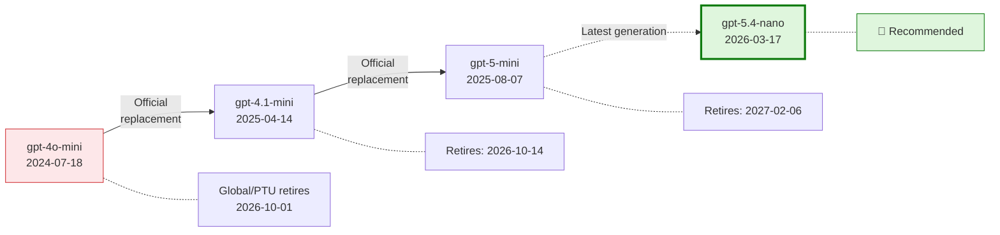
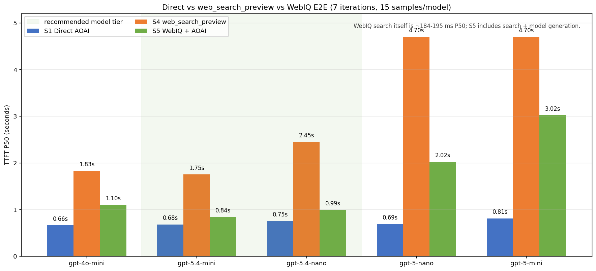
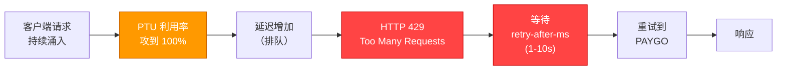
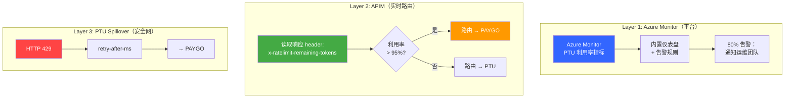
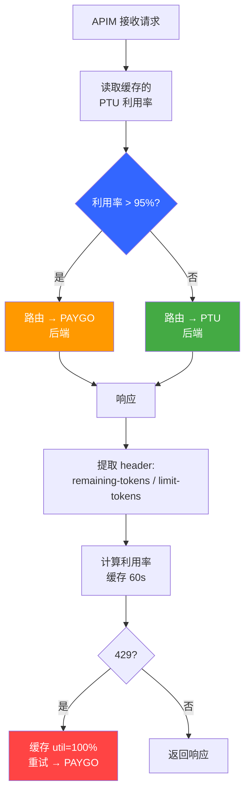

# Azure OpenAI 模型迁移 Benchmark 与 PTU 流量管理
## gpt-4o-mini → gpt-5.4-nano | Web Search Grounding + PTU 流量管理


面向低延迟 AI assistant 的生产级 benchmark 与流量管理工具集，用于从 gpt-4o-mini 迁移到更新的 Azure OpenAI / OpenAI 模型家族。所有 web grounding 路径都同时测试内置 search 方案和 WebIQ 显式 retrieval 对照。

> **Author**: Xinyu Wei (魏新宇), Microsoft AI and Apps Global Black Belt (GBB) Senior System Engineer | **Date**: 2026-03-28

中文版 | [English](README.md)

---

## Running on Azure

| 维度 | 配置 |
|------|------|
| Azure service | Azure OpenAI Service + Azure API Management + Azure Monitor / Application Insights |
| 主 API 路径 | Responses API + `stream=True`；所有 web-search 场景都同时测试 `web_search_preview` 和 WebIQ 显式 retrieval |
| 测试模型 | gpt-4o-mini, gpt-5.4-nano, gpt-5.4-mini, gpt-5-nano, gpt-5-mini |
| 流量管理 | PTU 优先，高利用率时 APIM 主动路由到 PAYGO，429 retry 作为安全网 |
| Runtime | Python benchmark scripts + 可选 Node.js PTU monitor proxy |
| 认证方式 | Benchmark scripts 使用 API key；APIM routing PoC 使用 named values / backends |

## Executive Summary

**gpt-5.4-nano** 是 gpt-4o-mini 在 AI 助手中的推荐替代模型。

使用**客户实际架构**（Responses API + `web_search_preview` + streaming）、WebIQ 显式 retrieval 路径和备选路径（Foundry Agent + BingGroundingAgentTool）对 5 个候选模型进行测试。gpt-5.4-nano 在两种 Bing 架构下均实现**等效的 Bing 延迟**（~2s），而 WebIQ 在同一批原始迁移场景中将 search-grounded TTFT 降到 **0.99s**。

| 指标 | gpt-4o-mini（当前） | gpt-5.4-nano（推荐） | 测试条件 |
|------|:-------------------:|:--------------------:|----------|
| **web_search TTFT** (P50) | **1.57s** | 2.08s | Responses API, `stream=True`, `web_search_preview`, `search_context_size=low`, `reasoning_effort=none`, GUARDRAILS prompt (~1066 tokens) |
| **WebIQ E2E TTFT** (P50) | 1.10s | **0.99s** | WebIQ `web.search()` 显式 retrieval + Responses API 生成，同 3 个迁移 query，`max_results=5`，GUARDRAILS prompt (~1066 tokens) |
| **Foundry+Bing TTFT** (P50) | 1.99s | **1.85s** | Responses API, `stream=True`, Foundry Agent V2, `BingGroundingAgentTool`, `tool_choice=required`, `reasoning_effort=none` |
| **Direct TTFT** (P50) | 0.57s | **0.59s** | Responses API, `stream=True`, `reasoning_effort=none`, 无 tools |
| **Input 单价** (每 1M tokens) | $0.15 | $0.20 | — |
| **Output 单价** (每 1M tokens) | $0.60 | $1.25 | — |
| **缓存 Input** (每 1M tokens) | $0.075 | $0.02 | — |

### WebIQ 补充测试：显式 Retrieval 路径（2026-06）

Microsoft 对 WebIQ 的官方描述是："a suite of AI-native APIs that gives applications access to fresh, real-world intelligence from across the web - including web pages, news, images, and videos"（来源：[Microsoft WebIQ](https://www.microsoft.com/en-us/webiq)，访问日期 2026-06-16）。本 repo 现在将 WebIQ 作为一条显式 retrieval 路径加入测试，和内置 `web_search_preview` tool orchestration 路径分开对比。

测试分两层：

| 层级 | 测什么 | 用途 |
|------|--------|------|
| **Search-only** | 只测 WebIQ 检索延迟，不包含模型生成 | 看搜索服务自身延迟和 retrieval sanity check |
| **End-to-end** | WebIQ 检索 + AOAI Responses API 生成，对比 `web_search_preview` E2E | 看用户体感的 AI 助手延迟 |

在原始迁移 benchmark 场景（`pricing`、`news`、`weather`）下，WebIQ 单独检索为 **183 ms P50 / 194 ms P95**，retrieval sanity check **24/24** 通过。在 7 轮端到端 benchmark 中（每模型 15 个 S1/S5 有效样本，排除 warmup；S4 从 search-verified success records 计算），同一 endpoint、同一 query set 下，WebIQ 相比 `web_search_preview` 将用户体感 TTFT 降低 **36–60%**，覆盖全部 5 个候选模型。详见 **Section 3.4**。

| 模型 | WebIQ E2E P50 | `web_search_preview` P50 | 降幅 | WebIQ Search P50 |
|------|--------------:|-------------------------:|-----:|-----------------:|
| **gpt-4o-mini** | **1.10s** | 1.83s | **快 40.0%** | 195 ms |
| **gpt-5.4-mini** | **0.84s** | 1.75s | **快 52.3%** | 184 ms |
| **gpt-5.4-nano** | **0.99s** | 2.45s | **快 59.8%** | 186 ms |
| gpt-5-nano | **2.02s** | 4.70s | **快 57.0%** | 184 ms |
| gpt-5-mini | **3.02s** | 4.70s | **快 35.8%** | 188 ms |

> 范围说明：这里的 WebIQ 路径是 **显式 retrieval + context injection**，`web_search_preview` 是 **内置 tool orchestration**。`quality_pass` 和 `source_used` 只是轻量 sanity check，不是人工答案质量评测。`web_search_preview` 不暴露内部搜索延迟，所以 search-layer latency 只对 WebIQ 单独报告。

#### Capability Matrix：6 个 WebIQ API

WebIQ 不只是单一 web-search endpoint。Python SDK 暴露了 web、news、videos、images、browse 和 classic search 六类能力。下表是基于 Lenovo/Qira 风格场景的快速能力探索；这些是单轮 smoke test，不是第 3 节里的统计型 latency benchmark。

| API | Lenovo/Qira 风格场景 | 实测延迟 | 返回结果 | 适合用途 |
|-----|----------------------|---------:|----------|----------|
| `web.search()` | ThinkPad X1 Carbon 2026 price | 454 ms | 3 个产品页，含产品名/规格/价格 | 产品问答、规格、价格 |
| `news.search()` | 当前 AI 新闻 | 276 ms | 5 条新闻结果，含 source media | 新闻简报、市场动态 |
| `videos.search()` | How to set up Lenovo AI PC | 159 ms | 3 个 YouTube 视频，含时长/播放量 | 教程/帮助推荐 |
| `images.search()` | Lenovo ThinkPad X1 Carbon 产品图 | 192 ms | 5 张图片，含尺寸/来源页 | 产品图片检索 |
| `browse.fetch()` | Lenovo ThinkPad 页面 | 536 ms | `result is dropped` | URL 读取；受保护站点可能失败 |
| `classic.search()` | Seattle weather today | 513 ms | Web results + 结构化 weather JSON | 天气/金融/体育等结构化答案 |

> 输入限制：WebIQ search API 接收文本 query。这个 SDK 不提供 image-to-image 或 video-to-search 输入。`images.search()` / `videos.search()` 对应的是 text-to-image 和 text-to-video search。

#### Token Efficiency：`passage` vs `html`

SDK 对 web/news/classic search 支持 `ContentFormat.passage`、`text`、`html` 和 `markdown`。其中 `passage` 最接近 LLM grounding 场景，因为它返回精选文本段落，而不是 HTML markup。

| 场景 | HTML 估算 tokens | Passage 估算 tokens | 降低 |
|------|-----------------:|--------------------:|-----:|
| pricing | 11,397 | 11,274 | 1% |
| news | 6,118 | 4,738 | 23% |
| weather | 3,242 | 2,340 | 28% |

这次测试里，`passage` 对 news/weather 明显减少 token；pricing 页面信息密度高，passage 和 HTML 大小接近。搜索延迟仍在 ~180 ms 级别。

#### Sampled Answer Quality

回答质量并排检查使用原始 migration 场景和 gpt-5.4-mini。以下是定性观察，不是完整人工评测。

| 场景 | WebIQ 回答 | `web_search_preview` 回答 | 判断 |
|------|------------|--------------------------|------|
| pricing | 具体产品 + 价格（`ASUS ExpertBook Ultra`, USD 3,600）+ source URL | 泛化 USD 1,500-2,500+ 区间，并提示没有搜索结果 | WebIQ 更具体 |
| news | 多条具体 AI 新闻 + source URL | 也有具体 AI 新闻 + source URL，但内容不同 | 相当 |
| weather | NOAA/AccuWeather 风格当前天气 + source URL | AccuWeather 当前天气与 forecast | 相当 |

#### When WebIQ Fits

| 场景 | 推荐 WebIQ API | 原因 |
|------|----------------|------|
| AI assistant grounding | `web.search(content_format=passage)` | 快、紧凑、可溯源，适合塞进 model prompt |
| 新闻/动态简报 | `news.search()` | 专门的 news results 和媒体来源 |
| 教程/帮助推荐 | `videos.search()` | 返回视频时长、播放量等 metadata |
| 产品图片检索 | `images.search()` | 返回图片 URL、尺寸和 host page |
| 结构化实时事实 | `classic.search()` | 可返回天气等结构化 answer types |
| 读取指定 URL | `browse.fetch()` | 适合单页抽取，但站点兼容性不稳定 |

不适合的场景：不需要搜索的任务、需要零代码平台编排的任务、image-to-image search、以及带 bot protection 的站点。

> 原始 benchmark 说明：上方 web_search、Foundry+Bing 和 Direct 行的 TTFT 为 P50（中位数），基于**每模型每场景 120 个样本**（5 轮独立测试）。WebIQ E2E 对比（Section 3.4）使用 7 轮独立运行，每模型 15 个有效样本。测试环境：东亚 → East US 2（PAYGO GlobalStandard）。客户 PTU 环境 TTFT 将更低。

**web_search 路径生产配置**（客户实际架构）：

| # | 设置 | 值 | 用途 |
|:-:|------|-----|------|
| 1 | **API** | `responses.create()` + `stream=True` | TTFT 比 Chat Completions API 快 ~2x |
| 2 | **搜索工具** | `tools=[{"type": "web_search_preview", "search_context_size": "low"}]` | 内置 Bing 搜索，最小化 token 注入 |
| 3 | **推理强度** | `reasoning={"effort": "none"}` | 非推理任务的最低推理开销 |
| 4 | **搜索触发** | System prompt: `"Search the web for current information"` | 确保 100% 触发 web_search（通过 streaming events 验证） |

**PTU 流量管理建议**：

| 方案 | 机制 | 额外延迟 | 建议 |
|------|------|:---:|---|
| PTU Spillover（内置） | HTTP 429 触发 — 请求必须先失败 | +1-10s/溢出请求 | ⚠️ 仅作安全网 |
| **APIM 主动路由** | 读取 `x-ratelimit-remaining-tokens` header，>95% 利用率时路由 | **零** | ✅ **推荐** — 保持一致的 P50/P99 延迟 |

> PTU spillover 是被动的（失败后重试）。对于 AI 助手的实时功能（P50 TTFT 目标 1-2s），APIM 主动路由消除了 429 引发的尾延迟。详见第 7 节压测验证结果。

---

## 1. 背景

### 产品概述

该 AI 助手是**系统级跨设备 AI 产品**，嵌入 PC、平板和手机，将 多个 AI 功能统一为一个体验。

**6 大功能**：Next Move（意图分类）、Chat Mode（问答）、Write For Me（内容生成）、Live Mode（实时对话）、Catch Me Up（活动摘要）、Pay Attention（会议记录）。另加 **Bing Grounding** 用于网络搜索。

所有功能均为**非 reasoning 任务**。Reasoning 模型只增加延迟而不提高质量。

**关键：各模型系列的 `reasoning_effort` 差异**：

| 模型系列 | 最低 `reasoning_effort` | 对 AI 助手的影响 |
|---------|:-------------------------:|----------------|
| gpt-4o-mini | N/A（非推理模型） | 无推理开销 |
| **gpt-5.4-mini / nano** | **`none`** | 零推理开销 — 非推理任务的理想选择 |
| gpt-5-mini / nano | `minimal`（无 tools）/`low`（有 `web_search`） | 即使最低仍有推理开销 — **gpt-5 系列高延迟的根因** |

> gpt-5.4 系列支持 `reasoning_effort=none`，完全禁用内部推理，延迟与非推理模型等效。gpt-5 系列最低只能到 `minimal`/`low`，导致搜索场景下 TTFT 高 3-9 倍。

### gpt-4o-mini 退役时间线

来源：[Azure OpenAI Model Retirements](https://learn.microsoft.com/en-us/azure/foundry/openai/concepts/model-retirements)



### 候选模型与价格

| 模型 | Input $/1M | Cached | Output $/1M | 类型 | 来源 |
|------|:---------:|:------:|:-----------:|------|------|
| **gpt-4o-mini**（当前） | $0.15 | $0.075 | $0.60 | Non-reasoning | [Azure](https://azure.microsoft.com/en-us/pricing/details/cognitive-services/openai-service/) |
| **gpt-5-mini** | $0.25 | $0.03 | $2.00 | Reasoning | [Azure](https://azure.microsoft.com/en-us/pricing/details/cognitive-services/openai-service/) |
| **gpt-5-nano** | $0.05 | $0.01 | $0.40 | Reasoning | [Azure](https://azure.microsoft.com/en-us/pricing/details/cognitive-services/openai-service/) |
| **gpt-5.4-mini** | $0.75 | $0.08 | $4.50 | Reasoning | [Azure](https://azure.microsoft.com/en-us/pricing/details/cognitive-services/openai-service/) |
| **gpt-5.4-nano** | $0.20 | $0.02 | $1.25 | Reasoning | [OpenAI](https://openai.com/api/pricing/) |

### Region 可用性

团队需要：East US 2 / Sweden Central / Southeast Asia

| 模型 | East US 2 | Sweden Central | Southeast Asia |
|------|:---------:|:-------------:|:--------------:|
| gpt-4o-mini | ✅ | ✅ | ✅ |
| gpt-5.4-mini | ✅ | ✅ | ⏳ Rollout pending |
| gpt-5.4-nano | ✅ | ✅ | ⏳ Rollout pending |

---

## 2. 测试方法

### 五场景延迟分层

所有模型生成相关场景均使用 **Responses API + streaming**，确保公平对比。所有 web grounding 场景都同时报告内置 search 路径和 WebIQ 显式 retrieval 路径。

| 场景 | 测量内容 | API | Bing |
|------|----------|-----|:----:|
| **S1** Direct AOAI | 模型推理延迟 | `responses.create(model=...)` | No |
| **S2** Foundry Agent | 模型 + 编排开销 | `responses.create(agent_reference=...)` | No |
| **S3** Foundry + Bing | 完整生产链路延迟 | `responses.create(agent_reference=..., tool_choice="required")` | Yes |
| **S4** Direct AOAI + `web_search_preview` | 客户生产中的内置 web-search 路径 | `responses.create(model=..., tools=[{"type":"web_search_preview"}])` | Yes |
| **S5** WebIQ + Direct AOAI | 显式 retrieval + context injection + 模型生成 | WebIQ `web.search()` 后接 `responses.create(model=...)` | WebIQ |

逐层延迟通过减法隔离：

```
Total TTFT = [模型推理] + [Foundry 编排] + [Bing 搜索]
                S1          S2 - S1         S3 - S2

内置 search overhead = S4 - S1
WebIQ 显式 retrieval overhead = S5 - S1
```

### 测试参数

- **5 模型**，3 个 query，10 轮/query（2 轮 warmup 丢弃）= **24 有效样本/模型/场景/轮**
- **5 轮独立测试** = **120 有效样本/模型/场景**（2,250 次 API 调用）
- **WebIQ S5 对比运行**：7 轮/query（2 轮 warmup 丢弃）= **15 个 S1/S5 有效样本/模型/场景**；S4 只统计同一运行中的 search-verified success records，并排除终端编码导致的 error records
- `reasoning_effort` 设到模型最低：gpt-5.4 用 `none`，gpt-5 用 `minimal`
- S3 系统指令：`"Perform exactly ONE search. Do NOT refine or repeat searches."`
- S4 系统指令：`"Search the web for current information"` + GUARDRAILS，并通过 web_search streaming events 验证 search trigger
- S5 retrieval：WebIQ `web.search(max_results=5)` 后接 Responses API 生成，使用同一 GUARDRAILS prompt，并将 WebIQ context 注入 user message
- SDK：`openai==2.14.0`，`azure-ai-projects==2.0.0b2`
- **测试环境**：Windows VM（东亚）→ East US 2 部署。跨太平洋网络增加 ~100-200ms RTT。客户生产环境（美国客户端 → East US 2）RTT ~30-50ms，TTFT 将比本报告低 ~70-170ms。

### TTFT 组成

测量的 TTFT 包含网络往返、请求排队、模型预填充和首 token 生成：

| 组件 | 估算 | 说明 |
|------|:------:|------|
| 网络往返 | ~100-200ms | 测试机（东亚）→ East US 2 |
| 请求排队 | ~50-300ms | GlobalStandard 共享池（非 PTU） |
| 模型预填充 | ~200-400ms | 处理 system prompt + user prompt |
| 首 token 生成 | ~50-100ms | 生成第一个输出 token |
| **总计（观测 P50）** | **~0.57-0.69s** | 与组件估算一致 |

> **注**：本测试使用 **GlobalStandard (PAYGO)** 部署。PTU（Provisioned Throughput）部署消除排队延迟，TTFT 会更低。客户生产环境的 PTU 部署预计延迟更优。

### 为什么使用 Responses API？

直连 AOAI 同时支持两种 API。Responses API 的 TTFT 快约 2 倍：

| 模型 | Responses API (P50) | Chat Completions (P50) |
|------|:-------------------:|:----------------------:|
| gpt-4o-mini | 0.44~0.72s | 1.13~1.34s |
| gpt-5.4-nano | 0.56~0.58s | 1.20~1.53s |
| gpt-5.4-mini | 0.60~0.62s | 1.23~1.35s |

---

## 3. 测试结果

### 测试 Query

三个场景使用相同的 3 条 query（系统指令：`"You are a helpful AI assistant. Answer concisely."`）：

| Query | Prompt | max_tokens |
|-------|--------|:----------:|
| **Pricing** | "What is the latest retail price for a flagship laptop?" | 300 |
| **News** | "What are the top AI news stories this week?" | 300 |
| **Weather** | "What is the current weather in Seattle, Washington?" | 200 |

Bing 场景的系统指令追加：`"CRITICAL: Perform exactly ONE search. Do NOT refine or repeat searches. Use first results immediately."`

### 3.1 直连 AOAI — Responses API（无 Agent，无 Bing）

API：`responses.create(model=..., stream=True)` | 40 样本/格（5 轮合并）

| 模型 | Pricing TTFT/E2E | News TTFT/E2E | Weather TTFT/E2E | Avg TTFT |
|------|:-:|:-:|:-:|:-:|
| **gpt-4o-mini** | 0.70/1.47s | 0.60/1.36s | 0.78/1.30s | **0.69s** |
| **gpt-5.4-nano** | 0.79/1.49s | 0.63/2.14s | 0.64/1.32s | **0.69s** |
| **gpt-5.4-mini** | 0.75/1.58s | 0.75/2.18s | 0.63/1.16s | **0.71s** |
| gpt-5-nano | 1.25/2.31s | 1.05/3.20s | 1.11/2.09s | 1.14s |
| gpt-5-mini | 1.33/4.23s | 1.29/5.21s | 1.15/2.95s | 1.26s |

### 3.2 web_search_preview + GUARDRAILS — 客户生产路径

> **这是主要 benchmark** — 测试团队实际使用的架构。

团队确认 AI 助手使用 `web_search_preview`（Responses API 内置工具）而非 Foundry Agent + BingGroundingAgentTool。本节测试客户实际架构。

**与 Section 3.3（Foundry+Bing）的关键差异**：
- 无 Foundry Agent 编排层 — 直连 AOAI + `tools=[{"type": "web_search_preview"}]`
- `tool_choice` 使用默认值 `auto`（非 `required` — 见 Appendix F）
- `search_context_size="low"` 控制 token 消耗
- GUARDRAILS 系统提示词（~1066 tokens，触发 Prompt Caching）
- 通过 `response.web_search_call.searching` 事件确认搜索触发（100% 触发，120 样本/模型，0 跳过）
- gpt-5 系列需 `reasoning_effort="low"`（`minimal` + web_search = 400 error）

**5 轮合并结果**（120 有效样本/模型/场景）：

| 模型 | effort | S1 Direct P50 | S4 web_search P50 | web_search OH | σ | N |
|------|:------:|:------:|:------:|:------:|:----:|:-:|
| **gpt-4o-mini** | N/A | 0.45s | **1.57s** | +1.12s | 0.53s | 120 |
| **gpt-5.4-mini** | none | 0.60s | **1.90s** | +1.30s | 2.80s | 120 |
| **gpt-5.4-nano** | none | 0.62s | **2.08s** | +1.46s | 2.12s | 120 |
| gpt-5-nano | low | 1.42s | 8.93s | +7.51s | 4.11s | 119 |
| gpt-5-mini | low | 1.14s | 6.75s | +5.61s | 2.76s | 119 |

> gpt-5-nano 和 gpt-5-mini 的 N=119，是因为 web_search run 中各有 1 个有效样本失败，未纳入 search-verified 子集。当前 public scripts 已保留失败记录到 JSON 输出，便于复现排查。

**跨架构对比** — 每条 web grounding 路径都有 WebIQ 对照：

| 模型 | S3: Foundry+Bing | S4: `web_search_preview` | S5: WebIQ E2E | 一致？ |
|------|:-:|:-:|:-:|:-:|
| gpt-4o-mini | 1.99s | **1.57s** | 1.10s | ✅ Bing 路径同级；WebIQ 更快 |
| **gpt-5.4-mini** | 1.96s | **1.90s** | **0.84s** | ✅ Bing 路径同级；WebIQ 最快 |
| **gpt-5.4-nano** | **1.85s** | 2.08s | 0.99s | ✅ Bing 路径同级；WebIQ sub-second |
| gpt-5-nano | 3.56s | 8.93s | 2.02s | ❌ 内置 web_search 更慢；WebIQ 降低开销 |
| gpt-5-mini | 3.80s | 6.75s | 3.02s | ❌ 内置 web_search 更慢；WebIQ 降低开销 |

> **说明**：gpt-5.4-nano 在 web_search 场景下比 gpt-5.4-mini 慢 0.18s。这与 [OpenAI 官方评测](https://openai.com/index/introducing-gpt-5-4-mini-and-nano/)一致，nano 在 tool calling 基准测试中得分低于 mini（Toolathlon: nano 35.5% vs mini 42.9%）。0.18s 差距在测量噪声范围内（σ > 2s），用户无感。nano 的优势是 **Input 价格便宜 73%**（$0.20 vs $0.75/1M tokens）。

> **WebIQ 数据集说明**：S5 来自 Section 3.4 的 7 轮 WebIQ E2E 专项运行，不是旧的 S3/S4 5 轮合并数据。这里把它放进同一张决策表，是为了让 web grounding 的取舍更直观。

> **结论**：三个模型（gpt-4o-mini、gpt-5.4-mini、gpt-5.4-nano）在内置 Bing 路径下都能达到 ~2s TTFT。WebIQ 是同类 web-grounded workload 的更快显式 retrieval 选项，gpt-5.4-nano + WebIQ 达到 0.99s E2E。gpt-5 系列仍不适合内置 web_search 路径，但 WebIQ 通过把 retrieval 移出模型 tool loop 显著降低了惩罚。

---

### 3.3 Foundry Agent V2 + Bing Grounding（备选路径）

> 以下章节测试通过 Foundry Agent 集成 Bing 的备选路径。团队当前未使用此路径，但包含在内用于交叉验证。

#### 3.3.1 Foundry Agent — 无 Bing（Agent 编排开销）

API：`responses.create(agent_reference=..., stream=True)` — `reasoning_effort` 在 `PromptAgentDefinition` 中设置 | 40 样本/格

| 模型 | Pricing TTFT/E2E | News TTFT/E2E | Weather TTFT/E2E | Avg TTFT |
|------|:-:|:-:|:-:|:-:|
| **gpt-4o-mini** | 0.80/1.60s | 0.83/1.56s | 0.74/1.41s | **0.79s** |
| **gpt-5.4-nano** | 1.05/2.04s | 1.10/4.97s | 1.77/2.79s | **1.31s** |
| **gpt-5.4-mini** | 1.09/1.95s | 1.05/2.80s | 0.93/1.51s | **1.02s** |
| gpt-5-nano | 1.68/2.80s | 1.75/4.76s | 1.63/2.53s | 1.69s |
| gpt-5-mini | 1.69/4.50s | 1.97/9.21s | 1.83/3.71s | 1.83s |

> 注：S2 平均 TTFT 与 P50 存在差异，原因是偶发异常值（如 gpt-5.4-nano Weather 查询 TTFT=1.77s）。3.3.3 节的 P50 是更稳健的指标。

#### 3.3.2 Foundry Agent + Bing Grounding

API：`responses.create(agent_reference=..., tool_choice="required", stream=True)` + `BingGroundingAgentTool` | 40 样本/格

| 模型 | Pricing TTFT/E2E | News TTFT/E2E | Weather TTFT/E2E | Avg TTFT |
|------|:-:|:-:|:-:|:-:|
| **gpt-4o-mini** | 2.15/3.35s | 2.20/5.47s | 2.30/3.25s | **2.21s** |
| **gpt-5.4-nano** | 2.19/3.02s | 1.92/5.70s | 2.19/2.91s | **2.10s** |
| **gpt-5.4-mini** | 2.25/3.02s | 2.06/5.35s | 2.15/2.84s | **2.15s** |
| gpt-5-nano | 3.85/5.42s | 3.41/5.64s | 3.47/4.93s | 3.58s |
| gpt-5-mini | 4.06/8.33s | 3.62/11.81s | 5.40/7.36s | 4.36s |

> 5 轮合并，每 query 每模型 40 有效样本。

#### TTFT 总览（Foundry+Bing + web_search + WebIQ）


> 这张图将 5 轮 Foundry Agent 数据集（S1/S2/S3）和 WebIQ E2E 对比运行（S4/S5）放在同一视图里，确保所有 web-grounded 路径都可见。S5 使用 Section 3.4 的 7 轮 WebIQ run。

#### 3.3.3 汇总（Foundry+Bing，5 轮合并，120 样本/模型/场景）

| 模型 | effort | 直连 AOAI P50 | Foundry（无Bing）P50 | Foundry+Bing P50 | Bing σ | N |
|------|:------:|:------:|:------:|:------:|:----:|:---:|
| **gpt-4o-mini** | N/A | 0.57s | 0.69s | 1.99s | 0.73s | 120 |
| **gpt-5.4-nano** | none | **0.59s** | 0.81s | **1.85s** | 0.73s | 120 |
| **gpt-5.4-mini** | none | 0.62s | **0.87s** | 1.95s | **0.60s** | 120 |
| gpt-5-nano | minimal | 1.01s | 1.64s | 3.56s | 1.05s | 120 |
| gpt-5-mini | minimal | 1.09s | 1.73s | 3.80s | 6.27s | 120 |

#### 3.3.4 延迟分层（5 轮合并）

| 层 | gpt-4o-mini | gpt-5.4-nano | gpt-5.4-mini | gpt-5-nano | gpt-5-mini |
|----|:----------:|:----------:|:----------:|:----------:|:----------:|
| **直连 AOAI** (P50) | 0.57s | **0.59s** | 0.62s | 1.01s | 1.09s |
| **Foundry 编排开销** | +0.12s | +0.22s | +0.24s | +0.62s | +0.64s |
| **Bing 搜索开销** | +1.30s | **+1.04s** | +1.08s | +1.93s | +2.07s |
| **Foundry+Bing 总计** (P50) | 1.99s | **1.85s** | 1.95s | 3.56s | 3.80s |

#### 延迟分层图 — Foundry+Bing vs web_search vs WebIQ


> 分组堆叠条分别对比 S3 Foundry+Bing、S4 内置 `web_search_preview` 和 S5 WebIQ 显式 retrieval。S4/S5 overhead 来自 Section 3.4 的 S1/S4/S5 run；S3 使用 Section 3.3 的 5 轮 Foundry 数据集。

#### 主要结论（Foundry+Bing）

1. **Foundry Agent V2 编排开销 +0.12~0.64s** — 开销低
2. **Bing 搜索开销 +1.04~2.07s**，包含 Bing API 调用 + 结果注入 + 模型处理
3. **gpt-5.4-nano Bing 开销最低 (+1.04s)** — 比 gpt-4o-mini (+1.30s) 低 20%
4. **gpt-5 系列不适合 Bing** — 即使全部优化配置后 TTFT 仍 3.6~4.4s
5. **WebIQ 是显式 retrieval 对照路径** — Section 3.4 将同一类 web-grounded 问题从模型 tool loop 中移出 retrieval，再做 E2E 对比

### 3.4 WebIQ 显式 Retrieval vs `web_search_preview` — E2E 对比

> **S5（WebIQ）**：应用调用 WebIQ `web.search()` → 去除 HTML → 将搜索上下文注入 AOAI Responses API prompt → 流式生成。两跳显式 retrieval 路径。
>
> **S4（`web_search_preview`）**：应用调用 AOAI Responses API 并指定 `web_search_preview` tool → 模型内部触发 Bing 搜索 → 流式生成。单次调用 tool orchestration 路径。

7 轮 benchmark，2 轮 warmup 丢弃 → **每模型 15 个 S1/S5 有效样本**。S4 只统计同一次运行中的 search-verified success records；旧版 Windows 终端使用非 UTF-8 code page，因此终端编码失败记录不纳入 S4 统计。WebIQ 凭据通过 `WEBIQ_API_KEY` / `--webiq-key` 提供，文档中不发布明文 key；每 query 最多 5 个结果。

#### 视觉总览 — S1 vs S4 vs S5



> S5 **不是** WebIQ 搜索本身的延迟，而是 WebIQ retrieval + AOAI 生成的端到端延迟。WebIQ search-layer 本身只有 ~184–195 ms P50；剩余时间来自模型生成。因此 gpt-5-mini / gpt-5-nano 仍然显得慢，而 gpt-5.4-mini 和 gpt-5.4-nano 接近直连层级。

#### 3.4.1 总汇表 — S1 vs S4 vs S5

| 模型 | effort | S1 直连 P50 / N | S4 `web_search` P50 / N | S5 WebIQ P50 / N | WS 开销 | WebIQ 开销 | S5 比 S4 快 |
|------|:------:|:------:|:------:|:------:|:------:|:------:|:------:|
| **gpt-4o-mini** | N/A | 0.66s / 15 | 1.83s / 15 | **1.10s / 15** | +1.17s | +0.44s | **40.0%** |
| **gpt-5.4-mini** | none | 0.68s / 15 | 1.75s / 15 | **0.84s / 15** | +1.08s | +0.16s | **52.3%** |
| **gpt-5.4-nano** | none | 0.75s / 15 | 2.45s / 15 | **0.99s / 15** | +1.71s | +0.24s | **59.8%** |
| gpt-5-nano | minimal | 0.69s / 15 | 4.70s / 13 | **2.02s / 15** | +4.01s | +1.33s | **57.0%** |
| gpt-5-mini | minimal | 0.81s / 15 | 4.70s / 10 | **3.02s / 15** | +3.89s | +2.21s | **35.8%** |

> **WS 开销** = S4 P50 − S1 P50（内置 `web_search_preview` orchestration 的代价）。**WebIQ 开销** = S5 P50 − S1 P50（显式 WebIQ 检索 + context injection 的代价）。**S5 比 S4 快** = (S4 P50 − S5 P50) / S4 P50。

#### 3.4.2 WebIQ Search-Layer 延迟

| 模型 | Search P50 | N |
|------|:----------:|:---:|
| gpt-4o-mini | 195 ms | 15 |
| gpt-5.4-mini | 184 ms | 15 |
| gpt-5.4-nano | 186 ms | 15 |
| gpt-5-nano | 184 ms | 15 |
| gpt-5-mini | 188 ms | 15 |

> Search 延迟与模型无关（~185–195 ms P50）。S5 总延迟的差异来自 AOAI 模型生成时间，而非 WebIQ 搜索。

#### 主要结论（WebIQ vs `web_search_preview`）

1. **WebIQ 比 `web_search_preview` 快 36–60%** — 覆盖全部 5 个模型的 E2E TTFT
2. **Search-layer 延迟 ~185 ms P50** — 与模型无关
3. **gpt-5.4-mini + WebIQ 实现 0.84s E2E** — 本次测试中最快的搜索增强配置
4. **gpt-5.4-nano + WebIQ 0.99s** — 亚秒级搜索增强 TTFT，适合实时 AI 助手
5. **取舍**：WebIQ 需要应用层搜索编排代码；`web_search_preview` 零代码但更慢

> 数据来源：`outputs/benchmark_websearch_guardrails_20260617_103004.json`（7 轮迭代，2 轮 warmup）。上表 S4 只使用 search-verified success records。当前 public script 已改为 ASCII 状态标签和显式 `success` 字段，后续运行不会再追加终端编码导致的重复 failure records。


## 4. Prompt Caching：降本分析

Azure OpenAI 在输入前缀 ≥1024 tokens 且跨请求重复相同前缀时，自动触发 [Prompt Caching](https://learn.microsoft.com/en-us/azure/ai-services/openai/how-to/prompt-caching)。**Cached input 的价格因模型而异**：Azure 原生 gpt-4o-mini 按标准 input 价格的 50% 计费，gpt-5.4 系列则采用下表中的 OpenAI cached-input 价格。

AI 助手生产场景中，GUARDRAILS 系统提示词（12 个行为规范章节，~1066 tokens）持续超过缓存阈值，每次 AI 助手请求均可触发 Prompt Caching。

### 4.1 TTFT 影响：无


Prompt Caching 降低**计费成本**，不影响**延迟**。TTFT 主要由网络 RTT、KV-cache 查找、首 token 生成决定，与 input tokens 是否按缓存价计费无关。

WebIQ 路径中的 AOAI 生成步骤也遵循同样的 Prompt Caching 规则：保持 GUARDRAILS 为稳定前缀，再把 WebIQ context 放在静态块之后。WebIQ retrieval 本身不属于 AOAI Prompt Caching；其检索延迟已在 Section 3.4 单独报告。

2 轮 Cached Benchmark 验证（1066-token 系统提示词，120 samples/model/scenario = 60/cell）：

| 模型 | S1 未缓存 P50 | S1 已缓存 P50 | Δ TTFT | S3 未缓存 P50 | S3 已缓存 P50 | Δ TTFT |
|------|:-:|:-:|:-:|:-:|:-:|:-:|
| gpt-4o-mini | 0.57s | 0.48s | −0.09s | 2.02s | 2.00s | −0.02s |
| gpt-5.4-mini | 0.62s | 0.64s | +0.02s | 1.96s | 1.89s | −0.07s |
| **gpt-5.4-nano** | 0.59s | 0.65s | +0.06s | **1.85s** | **1.84s** | **−0.01s** |
| gpt-5-mini | 1.10s | 1.27s | +0.17s | 3.78s | 3.96s | +0.18s |
| gpt-5-nano | 1.05s | 1.35s | +0.30s | 3.50s | 4.79s | +1.29s |

> 所有 Δ 值均在测量噪声范围内（多数 cell σ > 0.5s），统计上无显著 TTFT 变化。

> WebIQ 范围说明：S5 没有单独重跑 cached vs uncached 实验。缓存计费影响的是 S5 中 AOAI 生成部分的 tokens；WebIQ API 定价和 retrieval latency 需要与 AOAI cached input 计费分开跟踪。

### 4.2 Prompt Caching 节省成本估算

假设 1066-token GUARDRAILS 前缀在每次生产请求中均被缓存：

| 模型 | Input（标准） | Input（缓存） | Output | 来源 |
|------|:---:|:---:|:---:|:---:|
| gpt-4o-mini | $0.150/1M | $0.075/1M | $0.600/1M | [Azure](https://azure.microsoft.com/en-us/pricing/details/cognitive-services/openai-service/) |
| gpt-5.4-mini | $0.750/1M | $0.080/1M | $4.500/1M | [Azure](https://azure.microsoft.com/en-us/pricing/details/cognitive-services/openai-service/) |
| **gpt-5.4-nano** | **$0.200/1M** | **$0.020/1M** | **$1.250/1M** | [OpenAI](https://developers.openai.com/api/docs/pricing) |

**完整 TCO 估算** — 每月 1 亿 input tokens + 2000 万 output tokens（生产估算规模）：

| 模型 | Input（缓存） | Output | **月总成本** | vs 4o-mini |
|------|:---:|:---:|:---:|:---:|
| gpt-4o-mini | $7,500 | $12,000 | **$19,500** | 基准 |
| gpt-5.4-mini | $8,000 | $90,000 | **$98,000** | +403% |
| **gpt-5.4-nano** | **$2,000** | **$25,000** | **$27,000** | **+38%** |

> gpt-5.4-nano 月度 TCO 比 gpt-4o-mini 高约 38%，主要因为 output 单价贵 2 倍（$1.25 vs $0.60）。但它 **Bing TTFT 低 7%**（1.85s vs 1.99s），且是 gpt-4o-mini 退役（2026-10-01）后**唯一可用的继任者**。缓存 input 单价（$0.02/1M）比 gpt-4o-mini 缓存（$0.075/1M）便宜 73%，部分抵消 output 溢价。

**WebIQ TCO 追加项** — WebIQ 会改变成本模型，因为 retrieval 发生在 AOAI 生成之前：

| 组件 | 适用路径 | 建模方式 |
|------|----------|----------|
| AOAI 生成 | S5 WebIQ E2E | 与 S1/S4 使用相同模型 token 定价；GUARDRAILS 静态前缀仍可享受 Prompt Caching |
| 注入的 WebIQ context | S5 WebIQ E2E | 会增加静态前缀之后的 prompt tokens；生产 sizing 前应按 query 实测 context tokens |
| WebIQ API 调用 | S5 retrieval | WebIQ public page 说明该 API limited access，但未公开价目表；最终 TCO 需和 Microsoft account team 确认 commercial terms |

> 公开来源：Microsoft WebIQ 页面强调 limited access / waitlist、164 ms p95 speed 和 token efficiency，但没有公开 pricing table（[Microsoft WebIQ](https://www.microsoft.com/en-us/webiq)，访问日期 2026-06-17）。因此本 README 不编写 WebIQ 单价。

### 4.3 短输出场景：意图分类（gpt-5.4-nano 便宜 48%）

上述 TCO 假设每月 2000 万 output tokens（~200 tokens/响应）。但 AI 助手的 **Next Move** 功能（意图分类）输出极短（~4-7 tokens/响应，只返回一个标签如 "ChatMode" 或 "BingSearch"）。

Benchmark：10 个意图查询 × 10 轮，GUARDRAILS 系统提示词（596 input tokens），`max_output_tokens=30`：

| 指标 | gpt-4o-mini | gpt-5.4-nano |
|------|:-----------:|:------------:|
| 平均 input tokens | 596 | 595 |
| 平均 output tokens | **4** | **7** |
| 平均 TTFT | 0.49s | 0.67s |
| 成本/千次请求（未缓存） | $0.092 | $0.127 |
| **成本/千次请求（缓存）** | **$0.049** | **$0.025** |
| **月成本（1 亿次请求，缓存）** | **$4,912** | **$2,533 (−48%)** |

**Breakeven 分析** — 当 output < ~50 tokens 时 gpt-5.4-nano 更便宜：

| Output tokens | gpt-5.4-nano vs gpt-4o-mini |
|:---:|:---:|
| 2 | **−60%** |
| 7（实测） | **−48%** |
| 15 | −37% |
| 20 | −29% |
| ~50 | Breakeven |
| 100+ | 4o-mini 更便宜 |

> **建议**：对短输出功能（Next Move、情感分析、实体提取）优先部署 gpt-5.4-nano，全量迁移前建议按功能评估 TCO。

### 4.4 启用建议

确保 GUARDRAILS 系统提示词**在所有请求中完全一致**（不在前缀中动态插入 per-request 内容）。将用户历史、设备信息等动态内容放在静态 GUARDRAILS 块**之后**，即可稳定触发 Prompt Caching。

---

## 5. Bing Grounding 配置

Bing 场景必须设置以下两项（在 `stream=True` 和 `reasoning_effort` 之外）：

| 设置 | 不设时的问题 |
|------|------------|
| **系统指令**：`"Perform exactly ONE search..."` | 多步搜索 spike，最高 38s |
| **`tool_choice="required"`** | 67% 请求跳过搜索（22 字符空回答） |

### reasoning_effort 在 Foundry Agent 中的设置

来源：[Microsoft Learn](https://learn.microsoft.com/en-us/azure/ai-services/openai/how-to/reasoning)

| 模型家族 | 最低值 | 设置方式 |
|---------|:------:|:-------:|
| gpt-5 / 5-mini / 5-nano | `minimal` | `Reasoning(effort="minimal")` in `PromptAgentDefinition` |
| gpt-5.4-mini / 5.4-nano | `none` | `Reasoning(effort="none")` in `PromptAgentDefinition` |

> `reasoning_effort` 必须在 agent definition 中设置，不能在 `responses.create()` 中传递。

### WebIQ 显式 Retrieval 配置

本 repo 中每个内置 web-search benchmark 都有 WebIQ 对照。WebIQ 路径将 retrieval 放在模型 tool loop 之外，再把精简搜索上下文传入同一个 Responses API 生成步骤。

| 设置 | 值 | 目的 |
|------|----|------|
| WebIQ credential | `WEBIQ_API_KEY` 或 `--webiq-key` | API key 不进入 README 和 git history |
| Retrieval API | `WebIQClient(...).web.search(query=..., max_results=5)` | 在 AOAI 生成前做快速显式 web retrieval |
| Context 位置 | 将 WebIQ 结果放在稳定 GUARDRAILS 前缀之后 | 保留 AOAI Prompt Caching 对静态前缀的适用性 |
| Source 处理 | 在 prompt 中保留 WebIQ 结果 URL | 维持 source-grounded answer 行为 |
| 失败策略 | 不静默 fallback 到假数据 | Retrieval/API 失败记录为 failed benchmark record |

> 取舍：本次 E2E 测试中 WebIQ 更快，但需要应用层 retrieval orchestration；`web_search_preview` 更慢，但 orchestration 留在 Responses API 单次调用内部。

---

## 6. 迁移路径

```
Phase 1（现在 → go-live）：   gpt-4o-mini（当前方案）
Phase 2（SEA 可用后）：       部署 gpt-5.4-nano + 4 项生产配置，A/B 测试
Phase 3：                    全量迁移到 gpt-5.4-nano
```

Search grounding 迁移应和模型迁移并行评估：

| 阶段 | 模型路径 | Search-grounding 路径 |
|------|----------|-----------------------|
| Phase 1 | 在迁移方案批准前保留 gpt-4o-mini | 保留 `web_search_preview` 作为零代码生产路径；对同类 query 做 WebIQ shadow test |
| Phase 2 | 将 gpt-5.4-nano 作为继任模型做 A/B test | 对延迟敏感的 web-grounded 功能加入 WebIQ 显式 retrieval 选项 |
| Phase 3 | 区域就绪后全量迁移到 gpt-5.4-nano | 按功能决策：WebIQ 用于最快显式 grounding，`web_search_preview` 用于最低应用编排复杂度 |

> 决策规则：任何依赖实时 web grounding 的生产功能，sign-off 前都必须同时有 S4（`web_search_preview`）和 S5（WebIQ 显式 retrieval）数据。不能只有 web_search 结论而没有 WebIQ 对照。

---

## 7. PTU 流量管理：监控、路由与 Spillover

### 7.1 问题：PTU Spillover 是被动的

Azure OpenAI PTU 提供内置 **spillover（溢出）** 功能，当 PTU 部署饱和时将多余流量路由到 PAYGO。但对[官方文档](https://learn.microsoft.com/en-us/azure/ai-services/openai/how-to/provisioned-throughput-onboarding)的调查发现一个关键限制：

- **触发机制**：Spillover 在**单请求级别收到 HTTP 429** 时激活 — 请求必须先在 PTU 上**失败**，然后才重试到 PAYGO
- **非预测式**：没有利用率阈值（如 90%）来主动重路由流量
- **延迟影响**：每次溢出事件在正常延迟之上增加 `retry-after-ms` 延迟（通常 1-10s）



> 请求必须先**失败**（429）才会触发 spillover。每个溢出请求都要付出 `retry-after-ms` 惩罚（通常 1-10s）。

对于 AI 助手的实时功能（Live Mode、Chat Mode），P50 TTFT 目标为 1-2s，即使一次 429 重试也会带来不可接受的延迟。

### 7.2 三层 PTU 监控架构

我们推荐**三层**方案 — 每层有不同的用途：



| 层级 | 用途 | 触发条件 | 延迟影响 | 实现方式 |
|:---:|------|---------|:--------:|---------|
| **1. Azure Monitor** | 容量规划 + 告警 | 指标阈值（80%） | 无 — 仅可观测性 | Portal 仪表盘 + 告警规则 |
| **2. APIM 路由** | 实时流量管理 | 响应 header（95%） | **零** | APIM policy（见 7.4） |
| **3. Spillover** | 最后的安全网 | HTTP 429 | +1-10s/请求 | Portal 开关（保持启用） |

### 7.3 Layer 1: Azure Monitor PTU 指标

Azure OpenAI 提供**内置平台指标**，无需任何代码即可通过 Azure Monitor 访问：

**设置**（[官方文档](https://learn.microsoft.com/en-us/azure/ai-services/openai/how-to/monitoring)）：
1. Azure Portal → AOAI 资源 → **Monitoring** → **Diagnostic settings**
2. 启用 `AllMetrics` → 发送到 Log Analytics workspace
3. **PTU Utilization** 仪表盘自动出现在资源概览中

**可用指标**：

| 指标 | 描述 | 用途 |
|------|------|------|
| `ProvisionedManagedUtilization` | PTU 容量利用率（%） | 仪表盘 + 告警 |
| `TokenTransaction` | 每请求 token 计数 | 成本追踪 |
| `ProcessedPromptTokens` | 处理的输入 token | 用量分析 |
| `GeneratedTokens` | 生成的输出 token | 用量分析 |

**建议告警规则**：

```
告警 1: PTU 利用率 > 80% 持续 5 分钟 → 通知运维团队（邮件/Teams）
告警 2: PTU 利用率 > 95% 持续 1 分钟  → 严重 — 确认 APIM 路由激活
告警 3: HTTP 429 次数 > 0              → Spillover 触发 — 需调查
```

**KQL 查询（需 Diagnostic Settings → Log Analytics）**：

```kql
AzureMetrics
| where MetricName == "ProvisionedManagedUtilizationV2"
| summarize avg(Average), max(Maximum), percentile(Average, 95) by bin(TimeGenerated, 5m)
| render timechart
```

### 7.4 Layer 2: APIM 主动路由

Azure OpenAI 流式响应包含实时容量 header：

| Header | 描述 | 示例值 |
|--------|------|:---:|
| `x-ratelimit-remaining-tokens` | 当前窗口内剩余 TPM 容量 | `935175` |
| `x-ratelimit-limit-tokens` | 部署的 TPM 总限额 | `950000` |
| `x-ratelimit-remaining-requests` | 剩余 RPM 容量 | `941` |
| `x-ratelimit-limit-requests` | 部署的 RPM 总限额 | `950` |

> **已在 PAYGO 验证**（300 请求，50 并发，100% header 可用）。客户需在 PTU 上运行 `scripts/stress_test_tpm_utilization.py` 确认。

**APIM Policy**（生产就绪，见本 repo `apim-policy-ptu-routing.xml`）：



**APIM 设置步骤**：
1. 创建两个后端：`ptu-backend`（PTU endpoint）和 `paygo-backend`（PAYGO endpoint）
2. 创建 Named Values：`ptu-routing-threshold` = `95`，`ptu-deployment` = 部署名称
3. 应用 `apim-policy-ptu-routing.xml` 到 API

**APIM Policy 核心功能**：
- 从每个 PTU 响应中读取 `x-ratelimit-remaining-tokens`
- 计算利用率并缓存（60s TTL），用于下次路由决策
- HTTP 429 时：backend retry policy 切到 PAYGO，缓存 `utilization=100%`，并通过 `buffer-response="false"` 保持 streaming 行为
- 通过 `emit-metric` 将 `PTU Utilization` 自定义指标发送到 Application Insights

### 7.5 Layer 3: PTU Spillover（安全网）

在 Azure Portal 中保持 PTU spillover **启用**作为最后的兜底。如果 APIM 计算错误或缓存过期，spillover 承接溢出请求。

### 7.6 验证工具

本 repo 包含两个工具用于验证和测试 PTU 监控方案：

#### 工具 1: `stress_test_tpm_utilization.py`（Python）

并发流式压测，从每个响应中捕获 rate-limit header。

```bash
python scripts/stress_test_tpm_utilization.py \
  --endpoint https://<your-resource>.openai.azure.com \
  --api-key YOUR_KEY \
  --deployment gpt-5.4-nano \
  --concurrency 50 --total 300 \
  --output results.json
```

**用途**：对 PTU 运行压测，确认 header 可用性、实际 TPM/RPM 限额，校准 APIM 路由阈值。

**压测结果**（PAYGO，300 请求，50 并发）：

| 指标 | 值 |
|------|:---:|
| 成功率 | 100%（0 个 HTTP 429） |
| Header 可用性 | 100% |
| 吞吐量 | 5.7 req/s |

#### 工具 2: `ptu-monitor-server/`（Node.js）

基于 [Xuebing Bai 的 App Insights + OTel demo](https://github.com/henrynn/monitor/tree/main/appinsight-zavademo) 改造的 AOAI 代理服务器，实现完整路由逻辑 + Application Insights 集成。

说明：该 proxy 使用 Chat Completions 验证 PTU/PAYGO 路由逻辑；本 repo 的主 benchmark 路径仍是 Responses API + `web_search_preview`。

```bash
cd ptu-monitor-server
npm install
PTU_ENDPOINT=https://<your-resource>.openai.azure.com PTU_API_KEY=xxx \
PAYGO_ENDPOINT=https://<your-resource>.openai.azure.com PAYGO_API_KEY=xxx \
ROUTING_THRESHOLD=95 \
APPLICATIONINSIGHTS_CONNECTION_STRING="InstrumentationKey=xxx;..." \
npm start
```

**端点**：

| 方法 | 路径 | 用途 |
|------|------|------|
| `POST` | `/api/chat` | 代理 AOAI 请求 + 监控 + 主动路由 |
| `GET` | `/api/status` | 当前 PTU 利用率 + 路由决策 |
| `POST` | `/api/stress` | 内置并发压测 |
| `POST` | `/api/simulate` | 手动设置利用率（测试路由逻辑） |
| `GET` | `/healthz` | 健康检查 + 当前配置 |

**发送到 Application Insights 的自定义指标**：

| 指标 | 类型 | 描述 |
|------|------|------|
| `ptu.utilization_pct` | Histogram | TPM 利用率百分比 |
| `ptu.ttft_ms` | Histogram | 首 token 时间 |
| `ptu.e2e_ms` | Histogram | 端到端延迟 |
| `ptu.http429_count` | Counter | 被限流的请求 |
| `ptu.routing_decision` | Counter | PTU vs PAYGO 路由决策 |

**App Insights KQL 查询**：

```kql
-- PTU 利用率趋势
customMetrics
| where name == "ptu.utilization_pct"
| summarize avg(value), max(value), percentile(value, 95) by bin(timestamp, 1m)
| render timechart

-- 路由决策分布
customMetrics
| where name == "ptu.routing_decision"
| extend backend = tostring(customDimensions["backend"])
| summarize count = sum(value) by bin(timestamp, 5m), backend
| render piechart
```

**已验证**：所有端点已在 Azure VM 上验证通过 — 路由逻辑确认（PTU 利用率超阈值时切换到 PAYGO，利用率下降后自动切回）。

### 7.7 验证结果（真实数据）

所有监控组件均在真实 Azure OpenAI 部署上验证（`<your-aoai-resource>`，gpt-5.4-nano，East US 2 PAYGO）。

#### Azure Monitor 平台指标（已验证）

通过 `az monitor metrics list` 确认 8 个指标可用：

| 指标 | 聚合 | 样本数据 | 状态 |
|------|:----:|---------|:---:|
| `AzureOpenAIRequests` | Sum | 测试窗口 85 请求 | ✅ |
| `TokenTransaction` | Sum | 64,425 tokens（峰值 5 分钟） | ✅ |
| `Ratelimit` | Sum | 消耗 1,125 限流单元 | ✅ |
| `ProcessedPromptTokens` | Sum | 5,900 prompt tokens（100 请求） | ✅ |
| `GeneratedTokens` | Sum | 78,000 output tokens | ✅ |
| `AzureOpenAINormalizedTTFTInMS` | Average | 0.51-0.55 ms（归一化） | ✅ |
| `Latency` | Average | 300-380 ms | ✅ |
| `ProvisionedManagedUtilizationV2` | Average | 无数据（PTU-only，PAYGO 无此指标） | ⚠️ 符合预期 |

**TPM 利用率**（通过 TokenTransaction / TPM Limit 计算）：

| 时间 (UTC) | Token 消耗 | TPM 利用率 |
|-----------|:----------:|:----------:|
| 06:06 | 64,425 | **6.78%**（of 950K） |
| 06:11 | 12,885 | **1.36%**（of 950K） |

> PTU 部署 TPM 限额更小，同样流量利用率百分比会显著更高。


#### KQL Log Analytics（已验证）

诊断设置已部署（`AllMetrics` + `allLogs` → Log Analytics workspace）。`AzureDiagnostics` 表可查询：

```
KQL: AzureDiagnostics | where Category == 'RequestResponse'
     | summarize reqs=count(), avg_ms=avg(DurationMs), p95_ms=percentile(DurationMs,95) by bin(TimeGenerated,5m)

结果：
  2026-03-30T06:05:00  74 请求  avg=307ms  P95=476ms
  2026-03-30T06:10:00  16 请求  avg=418ms  P95=1413ms
```

#### 告警规则（已部署）

| 告警 | 指标 | 阈值 | 严重级别 | 状态 |
|------|------|:----:|:-------:|:---:|
| `alert-aoai-request-volume` | AzureOpenAIRequests | > 5（5 分钟） | 3（信息） | ✅ 已部署 |
| Action Group: `ag-ptu-alerts` | — | — | — | ✅ 邮件已配置 |

#### Application Insights Live Metrics（已验证）

创建了 `ptu-monitor-ai` Application Insights 实例，通过 OpenTelemetry（`@azure/monitor-opentelemetry` + `enableLiveMetrics: true`）连接 ptu-monitor-server。

**Live Metrics 验证**（实时，< 1 秒延迟）：
- 入站请求速率：压测期间峰值 ~20/s
- 请求延迟：~2s（AOAI E2E）
- 依赖调用速率：峰值 ~40/s（出站 AOAI 调用）
- 请求/依赖失败率：0/s
- Sample Telemetry：实时 "AOAI request completed" traces 带 trace_id
- 1 台服务器在线，141 MB 内存，0% CPU


#### 路由逻辑 E2E 测试（6/6 通过）

| # | 测试 | 预期 | 实际 | 状态 |
|:-:|------|------|------|:---:|
| 1 | `GET /healthz` | PTU+PAYGO configured | ✅ | ✅ |
| 2 | `POST /api/chat`（util=0%） | backend=ptu, status=200 | backend=ptu, TTFT=1226ms | ✅ |
| 3 | `GET /api/status` | utilization=0%, KEEP_ON_PTU | ✅ | ✅ |
| 4 | 模拟 96% → `/api/chat` | backend=paygo | backend=paygo | ✅ |
| 5 | 模拟 50% → `/api/chat` | backend=ptu | backend=ptu | ✅ |
| 6 | `POST /api/stress`（5×10） | 10/10 成功，0 HTTP 429 | 10/10，0 429 | ✅ |

### 7.8 建议总结

| 行动 | 优先级 | 工作量 |
|------|:------:|:------:|
| 启用 Azure Monitor 告警（80% / 95% / 429） | **P0** | 低 — Portal 配置 |
| 部署 APIM 主动路由策略 | **P1** | 中 — APIM policy XML |
| 保持 PTU spillover 启用 | **P0** | 无 — 已有功能 |
| 对 PTU 运行压测确认 header | **P0** | 低 — 一条命令 |
| 部署 ptu-monitor-server 做 demo/PoC | **P2** | 低 — npm install + 环境变量 |

---

## 8. Priority Processing：Standard vs Priority PAYGO（Preview）

Priority Processing 的完整多维度基准测试（性能分析、并发负载测试、成本收益指南）请参见独立 Repo：

👉 **[AOAI-Priority-Processing-Benchmark](../AOAI-Priority-Processing-Benchmark/)**

核心发现（216 条记录，IQR 去噪）：输出 ≥50 Token 时 **TPS +30~43%**、**E2E -16~30%**、**TTFT P50 -6%，σ ±81→±34ms**。≤30 Token 短输出无收益。

---

## 9. 复现 Benchmark

### 9.1 前置条件

- Python 3.10+
- Azure OpenAI 部署 + API key
- web_search 测试需要：Responses API 访问权限（`2025-04-01-preview`）
- WebIQ 测试需要：`WEBIQ_API_KEY` 或 `--webiq-key`，以及 `requirements.txt` 中的 `webiq==0.1.0`

### 9.2 环境搭建

```bash
git clone https://github.com/david-xinyuwei/david-share.git
cd david-share/Agents/AOAI-Model-Migration-Benchmark
pip install -r requirements.txt
```

### 9.3 运行 Benchmark

**web_search + GUARDRAILS benchmark**（客户生产路径）：

```bash
python scripts/benchmark_websearch_guardrails.py \
  --endpoint https://<your-resource>.openai.azure.com \
  --api-key YOUR_API_KEY

# 加上 WebIQ S5 场景（显式 retrieval + AOAI 生成）：
python scripts/benchmark_websearch_guardrails.py \
  --endpoint https://<your-resource>.openai.azure.com \
  --api-key YOUR_API_KEY \
  --webiq-key YOUR_WEBIQ_API_KEY \
  --iterations 7 --warmup 2
```

**WebIQ personal-search benchmark**（显式 grounding 路径）：

```bash
export WEBIQ_API_KEY="YOUR_WEBIQ_API_KEY"

# Search-only：只测 WebIQ 检索延迟和结果质量
python scripts/benchmark_webiq_personal_search.py \
  --mode search --iterations 5 --warmup 1

# End-to-end：WebIQ 检索 + AOAI Responses API 生成
export AZURE_OPENAI_ENDPOINT="https://<your-resource>.openai.azure.com"
export AZURE_OPENAI_API_KEY="YOUR_AOAI_API_KEY"
python scripts/benchmark_webiq_personal_search.py \
  --mode e2e --iterations 5 --warmup 1 \
  --models gpt-4o-mini,gpt-5.4-nano,gpt-5.4-mini
```

如需复现原始 `pricing` / `news` / `weather` 迁移场景，可使用 `--scenario-file <local-json>`。客户相关 scenario 文件建议放在 `outputs/` 或其他 ignored 本地路径下，不提交。

**使用同一 scenario schema 跑 `web_search_preview`：**

```bash
export AZURE_OPENAI_ENDPOINT="https://<your-resource>.openai.azure.com"
export AZURE_OPENAI_API_KEY="YOUR_AOAI_API_KEY"
python scripts/benchmark_websearch_personal_search.py \
  --iterations 5 --warmup 1 \
  --models gpt-4o-mini,gpt-5.4-nano,gpt-5.4-mini
```

**Foundry Agent + Bing Grounding benchmark**（替代路径）：

```bash
export AZURE_OPENAI_API_KEY="YOUR_API_KEY"
export AZURE_OPENAI_ENDPOINT="https://<your-resource>.openai.azure.com"
export AZURE_AI_PROJECT_ENDPOINT="https://<your-ai-services-resource>.services.ai.azure.com/api/projects/<project-name>"
export BING_CONNECTION_NAME="<your-bing-grounding-connection-name>"
python scripts/benchmark_3s_detective.py
```

**PTU/PAYGO TPM 利用率压测**：

```bash
python scripts/stress_test_tpm_utilization.py \
  --endpoint https://<your-resource>.openai.azure.com \
  --api-key YOUR_API_KEY \
  --deployment gpt-5.4-nano \
  --concurrency 50 --total 300 \
  --output results.json
```

### 9.4 数据文件

Public repo 不包含逐请求 raw JSON 文件；这些文件保留在 private source repo 中，避免发布客户相关 trace。下面的文件名作为可追溯 ledger 保留；public scripts 会在 `outputs/` 下重新生成等价 JSON 输出。

5 轮 web_search 数据集（`data/benchmark_websearch_guardrails_*.json`）包含 1,199 条记录，覆盖 5 个模型 × 4 个场景 × ~120 样本。WebIQ E2E 数据集（`outputs/benchmark_websearch_guardrails_20260617_103004.json`）包含同一批原始迁移 query 的 S1/S4/S5 records；S4 统计必须只使用 search-verified success records。

后续数据完整性规则：任何 web-grounded benchmark 表只要报告 S4，就必须同时报告匹配的 S5 WebIQ 结果，或者明确说明为什么没有运行 WebIQ。当前 public script 使用 ASCII 状态标签和显式 `success` 字段，避免终端编码导致重复 failure records。

### 9.5 脚本清单

| 脚本 | 用途 | 参数 |
|------|------|------|
| `benchmark_websearch_guardrails.py` | S1 直连 + S4 web_search + S5 WebIQ E2E，GUARDRAILS 1066-token prompt | `--endpoint`, `--api-key`，可选 `--webiq-key` 启用 S5 |
| `benchmark_webiq_personal_search.py` | WebIQ personal-search grounding benchmark；支持 search-only 或 WebIQ + AOAI E2E | `WEBIQ_API_KEY`，可选 `AZURE_OPENAI_ENDPOINT`, `AZURE_OPENAI_API_KEY`, `--mode` |
| `benchmark_websearch_personal_search.py` | 使用与 WebIQ 脚本相同的 scenario schema 和 sanity check 跑 `web_search_preview` | `AZURE_OPENAI_ENDPOINT`, `AZURE_OPENAI_API_KEY`，可选 `--scenario-file` |
| `benchmark_3s_detective.py` | Foundry Agent + Bing，3 场景 × 5 模型 | `AZURE_OPENAI_ENDPOINT`, `AZURE_OPENAI_API_KEY`, `AZURE_AI_PROJECT_ENDPOINT`, `BING_CONNECTION_NAME` |
| `benchmark_3s_cached.py` | Prompt Caching 版本（1066-token 系统提示词） | `AZURE_OPENAI_ENDPOINT`, `AZURE_OPENAI_API_KEY`, `AZURE_AI_PROJECT_ENDPOINT`, `BING_CONNECTION_NAME` |
| `benchmark_intent_classification.py` | 短输出意图分类成本分析 | `AZURE_OPENAI_ENDPOINT`, `AZURE_OPENAI_API_KEY` |
| `stress_test_tpm_utilization.py` | 并发 TPM 利用率压测 | `--endpoint`, `--api-key`, `--concurrency`, `--total` |

---

## Appendix

### A. 功能级 Benchmark（3 模型，Chat Completions API）

| 功能 | 场景 | 4o-mini TTFT/E2E | 5.4-mini TTFT/E2E | 5.4-nano TTFT/E2E |
|------|------|:---:|:---:|:---:|
| Next Move | Intent Classification | **1.07/1.09s** | 1.18/1.24s | 1.04/1.10s |
| Chat Mode | Device Q&A | 1.74/2.16s | 1.93/2.97s | **1.46/1.89s** |
| Write For Me | Email Draft | 1.27/1.86s | 1.75/2.22s | **1.29/1.91s** |
| Live Mode ⚡ | Quick Response | **1.27/1.32s** | 1.70/1.73s | 1.35/1.40s |
| Catch Me Up | Activity Summary | 1.67/1.87s | 1.76/1.89s | **1.47/1.79s** |
| Pay Attention | Meeting Summary | **1.38/2.31s** | 1.99/3.70s | 1.91/4.62s |
| Bing Grounding | Web Q&A | **1.29/1.65s** | 1.88/2.82s | 2.54/3.54s |

> **重要说明**：此表使用旧版 **Chat Completions API**，TTFT 比 Section 3 使用的 Responses API 高约 2 倍。绝对 TTFT 值不可与 Section 3 直接比较，但模型间的**相对排名**仍可参考。特别是，gpt-5.4-nano 在此表中 Bing TTFT 较高（2.54s），但使用 Responses API + streaming + `tool_choice="required"` 后改善为 1.85s (P50)。

> WebIQ 对照：此历史功能表中与 WebIQ 相关的是 `Bing Grounding` 行。当前 Responses API 对比请看 Section 3.4：同一批原始迁移 query 中，gpt-5.4-nano 的 WebIQ E2E 为 0.99s，而 `web_search_preview` 为 2.45s。

### B. Non-Streaming 行为

`reasoning_effort=none` 在非 streaming 模式下仍产生 30-150 reasoning tokens/请求。Streaming 模式下为 0。**生产必须使用 `stream=True`。**

### C. 数据文件

| 文件 | 说明 |
|------|------|
| `data/benchmark_detective_3s_20260324_183409.json` | Run 1 未缓存（24 samples/cell） |
| `data/benchmark_detective_3s_20260324_195227.json` | Run 2 未缓存（24 samples/cell） |
| `data/benchmark_detective_3s_20260324_231002.json` | Run 3 未缓存（24 samples/cell） |
| `data/benchmark_detective_3s_20260324_234050.json` | Run 4 未缓存（24 samples/cell） |
| `data/benchmark_detective_3s_20260325_001027.json` | Run 5 未缓存（24 samples/cell） |
| `data/benchmark_cached_3s_20260325_092023.json` | Cached Run 1 — 1066-token 系统提示词（24 samples/cell） |
| `data/benchmark_cached_3s_20260325_095451.json` | Cached Run 2 — 1066-token 系统提示词（24 samples/cell） |
| `scripts/benchmark_3s_detective.py` | Benchmark 脚本（Foundry Agent，未缓存版本） |
| `scripts/benchmark_3s_cached.py` | Benchmark 脚本（Prompt Caching 版本） |
| `scripts/benchmark_websearch.py` | Benchmark 脚本（web_search_preview — 客户路径） |
| `scripts/benchmark_intent_classification.py` | 意图分类成本 Benchmark |
| `data/benchmark_websearch_20260327_230815.json` | web_search Run（短 prompt，24 样本/cell） |
| `data/benchmark_websearch_guardrails_*.json` | web_search + GUARDRAILS 5 轮（120 样本/cell，搜索已验证） |
| `scripts/benchmark_websearch_guardrails.py` | web_search + GUARDRAILS benchmark（客户路径，argparse） |
| `outputs/benchmark_websearch_guardrails_20260617_103004.json` | S1/S4/S5 WebIQ E2E 对比运行；S4 只从 search-verified success records 计算 |
| `outputs/benchmark_webiq_personal_search_search_*.json` | WebIQ search-only retrieval latency 和 sanity-check runs |
| `outputs/benchmark_webiq_personal_search_e2e_*.json` | WebIQ 显式 retrieval + AOAI 生成 E2E runs |
| `scripts/benchmark_webiq_personal_search.py` | WebIQ search-only 与 WebIQ + AOAI E2E benchmark 脚本 |
| `scripts/benchmark_websearch_personal_search.py` | 使用与 WebIQ 脚本相同 scenario schema 的 `web_search_preview` 对照脚本 |
| `scripts/stress_test_tpm_utilization.py` | PTU/PAYGO TPM 利用率压测（并发流式，header 捕获） |

### D. Prompt Caching 自洽性分析

Cached benchmark 使用了 **70 倍长的 system prompt**（1066 tokens vs 15 tokens）。观测到的 TTFT 行为：

- **S1/S2（非 Bing）**：系统性上升 +0.02~0.21s — **符合预期且自洽**。即使 cache 命中，1066 token 的 KV-cache 查找和内存传输有非零开销。此外每轮首次请求必为 cache miss（冷启动），拉高均值。
- **S3（Bing）**：差异可忽略 — Bing API 延迟（~1-2s）占主导，50-100ms 的 prompt 开销被完全淹没。
- **S4/S5（web_search/WebIQ）**：同一原则适用于 AOAI 生成 tokens。S4 内置搜索和 S5 WebIQ retrieval 应按 E2E latency 对比；Prompt Caching 只作为模型生成部分的计费优化处理。
- **模型排名不变**：Cached 排名（5.4-nano < 5.4-mini < 4o-mini < 5-nano < 5-mini）与 uncached 在全部 3 个场景中**完全一致**，确认缓存不影响模型选型结论。
- **gpt-5-nano S3 异常**（4.79s cached vs 3.50s uncached）：σ=7.19 显示存在极端异常值（多步 Bing 搜索）。60 样本（vs 120 uncached）对异常值更敏感。不影响结论——gpt-5 系列本身不推荐。

### E. gpt-5-mini S3 不稳定性（σ=6.27s）

gpt-5-mini 在 Bing 场景中 σ=6.27s — 比其他模型（σ=0.60-1.05s）高一个数量级。根因：尽管设置了 `tool_choice="required"` 和单次搜索指令，gpt-5-mini 偶尔仍会触发多步 Bing 搜索（TTFT 从 3-4s 飙升到 15-38s）。这是模型层面的行为模式，非平台问题。

### F. web_search_preview + tool_choice="required" 不兼容

`web_search_preview` 配合 `tool_choice="required"` 会导致 gpt-4o-mini（128K context）**context window 溢出**。全部 3 个 query 均报错 "Your input exceeds the context window"。根因：`required` 模式注入搜索结果更激进，超过 4o-mini 上下文限制。gpt-5.4 系列（1M context）不受影响。

客户使用 `tool_choice` 默认值（`auto`）— 通过系统提示词 "Search the web for current information" 引导搜索，经 `response.web_search_call.searching` streaming event 验证，搜索触发率 100%（24 样本/模型，0% 跳过率）。

WebIQ 对照：S5 显式 retrieval 不依赖 `tool_choice="required"`，因此不会触发这类 Responses tool-result injection 失败模式。但应用侧仍需要控制 WebIQ context token budget，再把搜索结果传入 AOAI 生成。

### G. gpt-5 系列 + web_search 兼容性

gpt-5-mini 和 gpt-5-nano 不支持 `web_search_preview` + `reasoning_effort="minimal"`（返回 400 error）。最低需要 `effort="low"`，导致推理开销增大至 7-14s TTFT。gpt-5 系列不适合 web_search 场景。

WebIQ 对照：S5 将 retrieval 移出模型 tool loop，因此不受 `web_search_preview` + `reasoning_effort` 兼容性问题阻断。最终仍应以 Section 3.4 的 E2E 数据判断，因为 WebIQ retrieval 之后仍有 AOAI 生成延迟。

---
