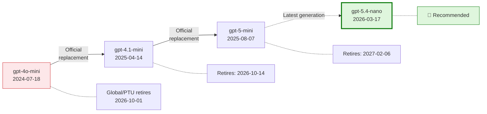
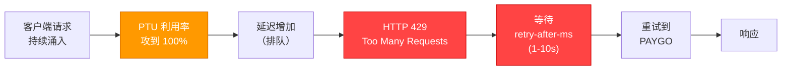
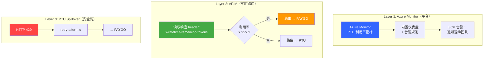
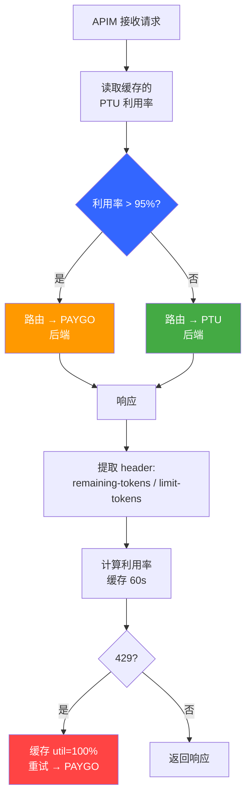

# AI 助手 — 模型迁移 Benchmark 与 PTU 流量管理
## gpt-4o-mini → gpt-5.4-nano | Spillover vs APIM 主动路由

**Author**: Xinyu Wei (魏新宇) | **Date**: 2026-03-28

## Executive Summary

**gpt-5.4-nano** 是 gpt-4o-mini 在 the assistant AI 助手中的推荐替代模型。

使用**客户实际架构**（Responses API + `web_search_preview` + streaming）和备选路径（Foundry Agent + BingGroundingAgentTool）对 5 个候选模型进行测试。gpt-5.4-nano 在两种架构下均实现**等效的 Bing 延迟**（~2s），且是 gpt-4o-mini 退役（2026-10-01）后唯一可用的继任者。

| 指标 | gpt-4o-mini（当前） | gpt-5.4-nano（推荐） | 测试条件 |
|------|:-------------------:|:--------------------:|----------|
| **web_search TTFT** (P50) | **1.57s** | 2.08s | Responses API, `stream=True`, `web_search_preview`, `search_context_size=low`, `reasoning_effort=none`, GUARDRAILS prompt (~1066 tokens) |
| **Foundry+Bing TTFT** (P50) | 1.99s | **1.85s** | Responses API, `stream=True`, Foundry Agent V2, `BingGroundingAgentTool`, `tool_choice=required`, `reasoning_effort=none` |
| **Direct TTFT** (P50) | 0.57s | **0.59s** | Responses API, `stream=True`, `reasoning_effort=none`, 无 tools |
| **Input 单价** (每 1M tokens) | $0.15 | $0.20 | — |
| **Output 单价** (每 1M tokens) | $0.60 | $1.25 | — |
| **缓存 Input** (每 1M tokens) | $0.075 | $0.02 | — |

> 所有 TTFT 为 P50（中位数），基于**每模型每场景 120 个样本**（5 轮独立测试）。测试环境：东亚 → East US 2（PAYGO GlobalStandard）。客户 PTU 环境 TTFT 将更低。

**web_search 路径生产配置**（客户实际架构）：

| # | 设置 | 值 | 用途 |
|:-:|------|-----|------|
| 1 | **API** | `responses.create()` + `stream=True` | TTFT 比 Chat Completions API 快 ~2x |
| 2 | **搜索工具** | `tools=[{"type": "web_search_preview", "search_context_size": "low"}]` | 内置 Bing 搜索，最小化 token 注入 |
| 3 | **推理强度** | `reasoning={"effort": "none"}` | 非推理任务的最低推理开销 |
| 4 | **搜索触发** | System prompt: `"Search the web for current information"` | 确保 100% 触发 web_search（通过 streaming events 验证） |

**PTU 流量管理建议**：

| 方案 | 机制 | 额外延迟 | 建议 |
|------|------|:---:|---|
| PTU Spillover（内置） | HTTP 429 触发 — 请求必须先失败 | +1-10s/溢出请求 | ⚠️ 仅作安全网 |
| **APIM 主动路由** | 读取 `x-ratelimit-remaining-tokens` header，>95% 利用率时路由 | **零** | ✅ **推荐** — 保持一致的 P50/P99 延迟 |

> PTU spillover 是被动的（失败后重试）。对于 the assistant 的实时功能（P50 TTFT 目标 1-2s），APIM 主动路由消除了 429 引发的尾延迟。详见第 7 节压测验证结果。

---

## 1. 背景

### the assistant 产品

the assistant 是团队的**系统级跨设备 AI 助手**（CES 2026），嵌入 ThinkPad PC、平板和 mobile 手机，将 Moto AI、the team AI Now、Creator Zone 统一为一个体验。

**6 大功能**：Next Move（意图分类）、Chat Mode（问答）、Write For Me（内容生成）、Live Mode（实时对话）、Catch Me Up（活动摘要）、Pay Attention（会议记录）。另加 **Bing Grounding** 用于网络搜索。

所有功能均为**非 reasoning 任务**。Reasoning 模型只增加延迟而不提高质量。

**关键：各模型系列的 `reasoning_effort` 差异**：

| 模型系列 | 最低 `reasoning_effort` | 对 the assistant 的影响 |
|---------|:-------------------------:|----------------|
| gpt-4o-mini | N/A（非推理模型） | 无推理开销 |
| **gpt-5.4-mini / nano** | **`none`** | 零推理开销 — 非推理任务的理想选择 |
| gpt-5-mini / nano | `minimal`（无 tools）/`low`（有 `web_search`） | 即使最低仍有推理开销 — **gpt-5 系列高延迟的根因** |

> gpt-5.4 系列支持 `reasoning_effort=none`，完全禁用内部推理，延迟与非推理模型等效。gpt-5 系列最低只能到 `minimal`/`low`，导致搜索场景下 TTFT 高 3-9 倍。

### gpt-4o-mini 退役时间线

来源：[Azure OpenAI Model Retirements](https://learn.microsoft.com/en-us/azure/foundry/openai/concepts/model-retirements)



### 候选模型与价格

| 模型 | Input $/1M | Cached | Output $/1M | 类型 | 来源 |
|------|:---------:|:------:|:-----------:|------|------|
| **gpt-4o-mini**（当前） | $0.15 | $0.075 | $0.60 | Non-reasoning | [Azure](https://azure.microsoft.com/en-us/pricing/details/cognitive-services/openai-service/) |
| **gpt-5-mini** | $0.25 | $0.03 | $2.00 | Reasoning | [Azure](https://azure.microsoft.com/en-us/pricing/details/cognitive-services/openai-service/) |
| **gpt-5-nano** | $0.05 | $0.01 | $0.40 | Reasoning | [Azure](https://azure.microsoft.com/en-us/pricing/details/cognitive-services/openai-service/) |
| **gpt-5.4-mini** | $0.75 | $0.075 | $4.50 | Reasoning | [OpenAI](https://openai.com/api/pricing/) |
| **gpt-5.4-nano** | $0.20 | $0.02 | $1.25 | Reasoning | [OpenAI](https://openai.com/api/pricing/) |

### Region 可用性

团队需要：East US 2 / Sweden Central / Southeast Asia

| 模型 | East US 2 | Sweden Central | Southeast Asia |
|------|:---------:|:-------------:|:--------------:|
| gpt-4o-mini | ✅ | ✅ | ✅ |
| gpt-5.4-mini | ✅ | ✅ | ⏳ Rollout pending |
| gpt-5.4-nano | ✅ | ✅ | ⏳ Rollout pending |

---

## 2. 测试方法

### 三场景延迟分层

所有场景均使用 **Responses API + streaming**，确保公平对比：

| 场景 | 测量内容 | API | Bing |
|------|----------|-----|:----:|
| **S1** Direct AOAI | 模型推理延迟 | `responses.create(model=...)` | No |
| **S2** Foundry Agent | 模型 + 编排开销 | `responses.create(agent_reference=...)` | No |
| **S3** Foundry + Bing | 完整生产链路延迟 | `responses.create(agent_reference=..., tool_choice="required")` | Yes |

逐层延迟通过减法隔离：

```
Total TTFT = [模型推理] + [Foundry 编排] + [Bing 搜索]
                S1          S2 - S1         S3 - S2
```

### 测试参数

- **5 模型**，3 个 query，10 轮/query（2 轮 warmup 丢弃）= **24 有效样本/模型/场景/轮**
- **5 轮独立测试** = **120 有效样本/模型/场景**（2,250 次 API 调用）
- `reasoning_effort` 设到模型最低：gpt-5.4 用 `none`，gpt-5 用 `minimal`
- S3 系统指令：`"Perform exactly ONE search. Do NOT refine or repeat searches."`
- SDK：`openai==2.14.0`，`azure-ai-projects==2.0.0b2`
- **测试环境**：Windows VM（东亚）→ East US 2 部署。跨太平洋网络增加 ~100-200ms RTT。客户生产环境（美国客户端 → East US 2）RTT ~30-50ms，TTFT 将比本报告低 ~70-170ms。

### TTFT 组成

测量的 TTFT 包含网络往返、请求排队、模型预填充和首 token 生成：

| 组件 | 估算 | 说明 |
|------|:------:|------|
| 网络往返 | ~100-200ms | 测试机（东亚）→ East US 2 |
| 请求排队 | ~50-300ms | GlobalStandard 共享池（非 PTU） |
| 模型预填充 | ~200-400ms | 处理 system prompt + user prompt |
| 首 token 生成 | ~50-100ms | 生成第一个输出 token |
| **总计（观测 P50）** | **~0.57-0.69s** | 与组件估算一致 |

> **注**：本测试使用 **GlobalStandard (PAYGO)** 部署。PTU（Provisioned Throughput）部署消除排队延迟，TTFT 会更低。客户生产环境的 PTU 部署预计延迟更优。

### 为什么使用 Responses API？

直连 AOAI 同时支持两种 API。Responses API 的 TTFT 快约 2 倍：

| 模型 | Responses API (P50) | Chat Completions (P50) |
|------|:-------------------:|:----------------------:|
| gpt-4o-mini | 0.44~0.72s | 1.13~1.34s |
| gpt-5.4-nano | 0.56~0.58s | 1.20~1.53s |
| gpt-5.4-mini | 0.60~0.62s | 1.23~1.35s |

---

## 3. 测试结果

### 测试 Query

三个场景使用相同的 3 条 query（系统指令：`"You are the assistant, a helpful AI assistant. Answer concisely."`）：

| Query | Prompt | max_tokens |
|-------|--------|:----------:|
| **Pricing** | "What is the latest retail price for a ThinkPad X1 Carbon Gen 12?" | 300 |
| **News** | "What are the top AI news stories this week?" | 300 |
| **Weather** | "What is the current weather in Seattle, Washington?" | 200 |

Bing 场景的系统指令追加：`"CRITICAL: Perform exactly ONE search. Do NOT refine or repeat searches. Use first results immediately."`

### 3.1 直连 AOAI — Responses API（无 Agent，无 Bing）

API：`responses.create(model=..., stream=True)` | 40 样本/格（5 轮合并）

| 模型 | Pricing TTFT/E2E | News TTFT/E2E | Weather TTFT/E2E | Avg TTFT |
|------|:-:|:-:|:-:|:-:|
| **gpt-4o-mini** | 0.70/1.47s | 0.60/1.36s | 0.78/1.30s | **0.69s** |
| **gpt-5.4-nano** | 0.79/1.49s | 0.63/2.14s | 0.64/1.32s | **0.69s** |
| **gpt-5.4-mini** | 0.75/1.58s | 0.75/2.18s | 0.63/1.16s | **0.71s** |
| gpt-5-nano | 1.25/2.31s | 1.05/3.20s | 1.11/2.09s | 1.14s |
| gpt-5-mini | 1.33/4.23s | 1.29/5.21s | 1.15/2.95s | 1.26s |

### 3.2 web_search_preview + GUARDRAILS — 客户生产路径

> **这是主要 benchmark** — 测试团队实际使用的架构。

团队确认 the assistant 使用 `web_search_preview`（Responses API 内置工具）而非 Foundry Agent + BingGroundingAgentTool。本节测试客户实际架构。

**与 Section 3.3（Foundry+Bing）的关键差异**：
- 无 Foundry Agent 编排层 — 直连 AOAI + `tools=[{"type": "web_search_preview"}]`
- `tool_choice` 使用默认值 `auto`（非 `required` — 见 Appendix F）
- `search_context_size="low"` 控制 token 消耗
- GUARDRAILS 系统提示词（~1066 tokens，触发 Prompt Caching）
- 通过 `response.web_search_call.searching` 事件确认搜索触发（100% 触发，120 样本/模型，0 跳过）
- gpt-5 系列需 `reasoning_effort="low"`（`minimal` + web_search = 400 error）

**5 轮合并结果**（120 有效样本/模型/场景）：

| 模型 | effort | S1 Direct P50 | S4 web_search P50 | web_search OH | σ | N |
|------|:------:|:------:|:------:|:------:|:----:|:-:|
| **gpt-4o-mini** | N/A | 0.45s | **1.57s** | +1.12s | 0.53s | 120 |
| **gpt-5.4-mini** | none | 0.60s | **1.90s** | +1.30s | 2.80s | 120 |
| **gpt-5.4-nano** | none | 0.62s | **2.08s** | +1.46s | 2.12s | 120 |
| gpt-5-nano | low | 1.42s | 8.93s | +7.51s | 4.11s | 119 |
| gpt-5-mini | low | 1.14s | 6.75s | +5.61s | 2.76s | 119 |

**跨架构对比** — 两种 Bing 路径的 TTFT P50：

| 模型 | S3: Foundry+Bing | S4: web_search | 一致？ |
|------|:-:|:-:|:-:|
| gpt-4o-mini | 1.99s | **1.57s** | ✅ 同级（~2s） |
| **gpt-5.4-mini** | 1.96s | **1.90s** | ✅ 同级（~2s） |
| **gpt-5.4-nano** | **1.85s** | 2.08s | ✅ 同级（~2s） |
| gpt-5-nano | 3.56s | 8.93s | ❌ web_search 更慢（effort=low 被迫） |
| gpt-5-mini | 3.80s | 6.75s | ❌ web_search 更慢（effort=low 被迫） |

> **说明**：gpt-5.4-nano 在 web_search 场景下比 gpt-5.4-mini 慢 0.18s。这与 [OpenAI 官方评测](https://openai.com/index/introducing-gpt-5-4-mini-and-nano/)一致，nano 在 tool calling 基准测试中得分低于 mini（Toolathlon: nano 35.5% vs mini 42.9%）。0.18s 差距在测量噪声范围内（σ > 2s），用户无感。nano 的优势是 **Input 价格便宜 73%**（$0.20 vs $0.75/1M tokens）。

> **结论**：三个模型（gpt-4o-mini、gpt-5.4-mini、gpt-5.4-nano）均实现 ~2s web_search TTFT。迁移建议对 Foundry Agent 和 web_search 两种路径均适用。gpt-5 系列在两种架构下均不适合。

---

### 3.3 Foundry Agent V2 + Bing Grounding（备选路径）

> 以下章节测试通过 Foundry Agent 集成 Bing 的备选路径。团队当前未使用此路径，但包含在内用于交叉验证。

#### 3.3.1 Foundry Agent — 无 Bing（Agent 编排开销）

API：`responses.create(agent_reference=..., stream=True)` — `reasoning_effort` 在 `PromptAgentDefinition` 中设置 | 40 样本/格

| 模型 | Pricing TTFT/E2E | News TTFT/E2E | Weather TTFT/E2E | Avg TTFT |
|------|:-:|:-:|:-:|:-:|
| **gpt-4o-mini** | 0.80/1.60s | 0.83/1.56s | 0.74/1.41s | **0.79s** |
| **gpt-5.4-nano** | 1.05/2.04s | 1.10/4.97s | 1.77/2.79s | **1.31s** |
| **gpt-5.4-mini** | 1.09/1.95s | 1.05/2.80s | 0.93/1.51s | **1.02s** |
| gpt-5-nano | 1.68/2.80s | 1.75/4.76s | 1.63/2.53s | 1.69s |
| gpt-5-mini | 1.69/4.50s | 1.97/9.21s | 1.83/3.71s | 1.83s |

> 注：S2 平均 TTFT 与 P50 存在差异，原因是偶发异常值（如 gpt-5.4-nano Weather 查询 TTFT=1.77s）。3.3.3 节的 P50 是更稳健的指标。

#### 3.3.2 Foundry Agent + Bing Grounding

API：`responses.create(agent_reference=..., tool_choice="required", stream=True)` + `BingGroundingAgentTool` | 40 样本/格

| 模型 | Pricing TTFT/E2E | News TTFT/E2E | Weather TTFT/E2E | Avg TTFT |
|------|:-:|:-:|:-:|:-:|
| **gpt-4o-mini** | 2.15/3.35s | 2.20/5.47s | 2.30/3.25s | **2.21s** |
| **gpt-5.4-nano** | 2.19/3.02s | 1.92/5.70s | 2.19/2.91s | **2.10s** |
| **gpt-5.4-mini** | 2.25/3.02s | 2.06/5.35s | 2.15/2.84s | **2.15s** |
| gpt-5-nano | 3.85/5.42s | 3.41/5.64s | 3.47/4.93s | 3.58s |
| gpt-5-mini | 4.06/8.33s | 3.62/11.81s | 5.40/7.36s | 4.36s |

> 5 轮合并，每 query 每模型 40 有效样本。

#### TTFT 总览（Foundry+Bing）


#### 3.3.3 汇总（Foundry+Bing，5 轮合并（5 轮合并，120 样本/模型/场景）

| 模型 | effort | 直连 AOAI P50 | Foundry（无Bing）P50 | Foundry+Bing P50 | Bing σ | N |
|------|:------:|:------:|:------:|:------:|:----:|:---:|
| **gpt-4o-mini** | N/A | 0.57s | 0.69s | 1.99s | 0.73s | 120 |
| **gpt-5.4-nano** | none | **0.59s** | 0.81s | **1.85s** | 0.73s | 120 |
| **gpt-5.4-mini** | none | 0.62s | **0.87s** | 1.95s | **0.60s** | 120 |
| gpt-5-nano | minimal | 1.01s | 1.64s | 3.56s | 1.05s | 120 |
| gpt-5-mini | minimal | 1.09s | 1.73s | 3.80s | 6.27s | 120 |

#### 3.3.4 延迟分层（5 轮合并）

| 层 | gpt-4o-mini | gpt-5.4-nano | gpt-5.4-mini | gpt-5-nano | gpt-5-mini |
|----|:----------:|:----------:|:----------:|:----------:|:----------:|
| **直连 AOAI** (P50) | 0.57s | **0.59s** | 0.62s | 1.01s | 1.09s |
| **Foundry 编排开销** | +0.12s | +0.22s | +0.24s | +0.62s | +0.64s |
| **Bing 搜索开销** | +1.30s | **+1.04s** | +1.08s | +1.93s | +2.07s |
| **Foundry+Bing 总计** (P50) | 1.99s | **1.85s** | 1.95s | 3.56s | 3.80s |

#### 延迟分层图


#### 主要结论（Foundry+Bing）

1. **Foundry Agent V2 编排开销 +0.12~0.64s** — 开销低
2. **Bing 搜索开销 +1.04~2.07s**，包含 Bing API 调用 + 结果注入 + 模型处理
3. **gpt-5.4-nano Bing 开销最低 (+1.04s)** — 比 gpt-4o-mini (+1.30s) 低 20%
4. **gpt-5 系列不适合 Bing** — 即使全部优化配置后 TTFT 仍 3.6~4.4s


## 4. Prompt Caching：降本分析

Azure OpenAI 在输入前缀 ≥1024 tokens 且跨请求重复相同前缀时，自动触发 [Prompt Caching](https://learn.microsoft.com/en-us/azure/ai-services/openai/how-to/prompt-caching)。**被缓存的 input tokens 按标准价格的 50% 计费。**

the assistant 生产场景中，GUARDRAILS 系统提示词（12 个行为规范章节，~1066 tokens）持续超过缓存阈值，每次 the assistant 请求均可触发 Prompt Caching。

### 4.1 TTFT 影响：无


Prompt Caching 降低**计费成本**，不影响**延迟**。TTFT 主要由网络 RTT、KV-cache 查找、首 token 生成决定，与 input tokens 是否按缓存价计费无关。

2 轮 Cached Benchmark 验证（1066-token 系统提示词，120 samples/model/scenario = 60/cell）：

| 模型 | S1 未缓存 P50 | S1 已缓存 P50 | Δ TTFT | S3 未缓存 P50 | S3 已缓存 P50 | Δ TTFT |
|------|:-:|:-:|:-:|:-:|:-:|:-:|
| gpt-4o-mini | 0.57s | 0.48s | −0.09s | 2.02s | 2.00s | −0.02s |
| gpt-5.4-mini | 0.62s | 0.64s | +0.02s | 1.96s | 1.89s | −0.07s |
| **gpt-5.4-nano** | 0.59s | 0.65s | +0.06s | **1.85s** | **1.84s** | **−0.01s** |
| gpt-5-mini | 1.10s | 1.27s | +0.17s | 3.78s | 3.96s | +0.18s |
| gpt-5-nano | 1.05s | 1.35s | +0.30s | 3.50s | 4.79s | +1.29s |

> 所有 Δ 值均在测量噪声范围内（多数 cell σ > 0.5s），统计上无显著 TTFT 变化。

### 4.2 Prompt Caching 节省成本估算

假设 1066-token GUARDRAILS 前缀在每次生产请求中均被缓存：

| 模型 | Input（标准） | Input（缓存） | Output | 来源 |
|------|:---:|:---:|:---:|:---:|
| gpt-4o-mini | $0.150/1M | $0.075/1M | $0.600/1M | [Azure](https://azure.microsoft.com/en-us/pricing/details/cognitive-services/openai-service/) |
| gpt-5.4-mini | $0.750/1M | $0.075/1M | $4.500/1M | [OpenAI](https://developers.openai.com/api/docs/pricing) |
| **gpt-5.4-nano** | **$0.200/1M** | **$0.020/1M** | **$1.250/1M** | [OpenAI](https://developers.openai.com/api/docs/pricing) |

**完整 TCO 估算** — 每月 1 亿 input tokens + 2000 万 output tokens（the assistant 估算规模）：

| 模型 | Input（缓存） | Output | **月总成本** | vs 4o-mini |
|------|:---:|:---:|:---:|:---:|
| gpt-4o-mini | $7,500 | $12,000 | **$19,500** | 基准 |
| gpt-5.4-mini | $7,500 | $90,000 | **$97,500** | +400% |
| **gpt-5.4-nano** | **$2,000** | **$25,000** | **$27,000** | **+38%** |

> gpt-5.4-nano 月度 TCO 比 gpt-4o-mini 高约 38%，主要因为 output 单价贵 2 倍（$1.25 vs $0.60）。但它 **Bing TTFT 低 7%**（1.85s vs 1.99s），且是 gpt-4o-mini 退役（2026-10-01）后**唯一可用的继任者**。缓存 input 单价（$0.02/1M）比 gpt-4o-mini 缓存（$0.075/1M）便宜 73%，部分抵消 output 溢价。

### 4.3 短输出场景：意图分类（gpt-5.4-nano 便宜 48%）

上述 TCO 假设每月 2000 万 output tokens（~200 tokens/响应）。但 the assistant 的 **Next Move** 功能（意图分类）输出极短（~4-7 tokens/响应，只返回一个标签如 "ChatMode" 或 "BingSearch"）。

Benchmark：10 个意图查询 × 10 轮，GUARDRAILS 系统提示词（596 input tokens），`max_output_tokens=30`：

| 指标 | gpt-4o-mini | gpt-5.4-nano |
|------|:-----------:|:------------:|
| 平均 input tokens | 596 | 595 |
| 平均 output tokens | **4** | **7** |
| 平均 TTFT | 0.49s | 0.67s |
| 成本/千次请求（未缓存） | $0.092 | $0.127 |
| **成本/千次请求（缓存）** | **$0.049** | **$0.025** |
| **月成本（1 亿次请求，缓存）** | **$4,912** | **$2,533 (−48%)** |

**Breakeven 分析** — 当 output < ~50 tokens 时 gpt-5.4-nano 更便宜：

| Output tokens | gpt-5.4-nano vs gpt-4o-mini |
|:---:|:---:|
| 2 | **−60%** |
| 7（实测） | **−48%** |
| 15 | −37% |
| 20 | −29% |
| ~50 | Breakeven |
| 100+ | 4o-mini 更便宜 |

> **建议**：对短输出功能（Next Move、情感分析、实体提取）优先部署 gpt-5.4-nano，全量迁移前建议按功能评估 TCO。

### 4.4 启用建议

确保 GUARDRAILS 系统提示词**在所有请求中完全一致**（不在前缀中动态插入 per-request 内容）。将用户历史、设备信息等动态内容放在静态 GUARDRAILS 块**之后**，即可稳定触发 Prompt Caching。

---

## 5. Bing Grounding 配置

Bing 场景必须设置以下两项（在 `stream=True` 和 `reasoning_effort` 之外）：

| 设置 | 不设时的问题 |
|------|------------|
| **系统指令**：`"Perform exactly ONE search..."` | 多步搜索 spike，最高 38s |
| **`tool_choice="required"`** | 67% 请求跳过搜索（22 字符空回答） |

### reasoning_effort 在 Foundry Agent 中的设置

来源：[Microsoft Learn](https://learn.microsoft.com/en-us/azure/ai-services/openai/how-to/reasoning)

| 模型家族 | 最低值 | 设置方式 |
|---------|:------:|:-------:|
| gpt-5 / 5-mini / 5-nano | `minimal` | `Reasoning(effort="minimal")` in `PromptAgentDefinition` |
| gpt-5.4-mini / 5.4-nano | `none` | `Reasoning(effort="none")` in `PromptAgentDefinition` |

> `reasoning_effort` 必须在 agent definition 中设置，不能在 `responses.create()` 中传递。

---

## 6. 迁移路径

```
Phase 1（现在 → go-live）：   gpt-4o-mini（当前方案）
Phase 2（SEA 可用后）：       部署 gpt-5.4-nano + 4 项生产配置，A/B 测试
Phase 3：                    全量迁移到 gpt-5.4-nano
```

---

## 7. PTU 流量管理：监控、路由与 Spillover

### 7.1 问题：PTU Spillover 是被动的

Azure OpenAI PTU 提供内置 **spillover（溢出）** 功能，当 PTU 部署饱和时将多余流量路由到 PAYGO。但对[官方文档](https://learn.microsoft.com/en-us/azure/ai-services/openai/how-to/provisioned-throughput-onboarding)的调查发现一个关键限制：

- **触发机制**：Spillover 在**单请求级别收到 HTTP 429** 时激活 — 请求必须先在 PTU 上**失败**，然后才重试到 PAYGO
- **非预测式**：没有利用率阈值（如 90%）来主动重路由流量
- **延迟影响**：每次溢出事件在正常延迟之上增加 `retry-after-ms` 延迟（通常 1-10s）



> 请求必须先**失败**（429）才会触发 spillover。每个溢出请求都要付出 `retry-after-ms` 惩罚（通常 1-10s）。

对于 the assistant 的实时功能（Live Mode、Chat Mode），P50 TTFT 目标为 1-2s，即使一次 429 重试也会带来不可接受的延迟。

### 7.2 三层 PTU 监控架构

我们推荐**三层**方案 — 每层有不同的用途：



| 层级 | 用途 | 触发条件 | 延迟影响 | 实现方式 |
|:---:|------|---------|:--------:|---------|
| **1. Azure Monitor** | 容量规划 + 告警 | 指标阈值（80%） | 无 — 仅可观测性 | Portal 仪表盘 + 告警规则 |
| **2. APIM 路由** | 实时流量管理 | 响应 header（95%） | **零** | APIM policy（见 7.4） |
| **3. Spillover** | 最后的安全网 | HTTP 429 | +1-10s/请求 | Portal 开关（保持启用） |

### 7.3 Layer 1: Azure Monitor PTU 指标

Azure OpenAI 提供**内置平台指标**，无需任何代码即可通过 Azure Monitor 访问：

**设置**（[官方文档](https://learn.microsoft.com/en-us/azure/ai-services/openai/how-to/monitoring)）：
1. Azure Portal → AOAI 资源 → **Monitoring** → **Diagnostic settings**
2. 启用 `AllMetrics` → 发送到 Log Analytics workspace
3. **PTU Utilization** 仪表盘自动出现在资源概览中

**可用指标**：

| 指标 | 描述 | 用途 |
|------|------|------|
| `ProvisionedManagedUtilization` | PTU 容量利用率（%） | 仪表盘 + 告警 |
| `TokenTransaction` | 每请求 token 计数 | 成本追踪 |
| `ProcessedPromptTokens` | 处理的输入 token | 用量分析 |
| `GeneratedTokens` | 生成的输出 token | 用量分析 |

**建议告警规则**：

```
告警 1: PTU 利用率 > 80% 持续 5 分钟 → 通知运维团队（邮件/Teams）
告警 2: PTU 利用率 > 95% 持续 1 分钟  → 严重 — 确认 APIM 路由激活
告警 3: HTTP 429 次数 > 0              → Spillover 触发 — 需调查
```

**KQL 查询（需 Diagnostic Settings → Log Analytics）**：

```kql
AzureMetrics
| where MetricName == "ProvisionedManagedUtilizationV2"
| summarize avg(Average), max(Maximum), percentile(Average, 95) by bin(TimeGenerated, 5m)
| render timechart
```

### 7.4 Layer 2: APIM 主动路由

Azure OpenAI 流式响应包含实时容量 header：

| Header | 描述 | 示例值 |
|--------|------|:---:|
| `x-ratelimit-remaining-tokens` | 当前窗口内剩余 TPM 容量 | `935175` |
| `x-ratelimit-limit-tokens` | 部署的 TPM 总限额 | `950000` |
| `x-ratelimit-remaining-requests` | 剩余 RPM 容量 | `941` |
| `x-ratelimit-limit-requests` | 部署的 RPM 总限额 | `950` |

> **已在 PAYGO 验证**（300 请求，50 并发，100% header 可用）。客户需在 PTU 上运行 `scripts/stress_test_tpm_utilization.py` 确认。

**APIM Policy**（生产就绪，见本 repo `apim-policy-ptu-routing.xml`）：



**APIM 设置步骤**：
1. 创建两个后端：`ptu-backend`（PTU endpoint）和 `paygo-backend`（PAYGO endpoint）
2. 创建 Named Values：`ptu-routing-threshold` = `95`
3. 应用 `apim-policy-ptu-routing.xml` 到 API

### 7.5 Layer 3: PTU Spillover（安全网）

在 Azure Portal 中保持 PTU spillover **启用**作为最后的兜底。如果 APIM 计算错误或缓存过期，spillover 承接溢出请求。

### 7.6 验证工具

本 repo 包含两个工具用于验证和测试 PTU 监控方案：

#### 工具 1: `stress_test_tpm_utilization.py`（Python）

并发流式压测，从每个响应中捕获 rate-limit header。

```bash
python scripts/stress_test_tpm_utilization.py \
  --endpoint https://YOUR_PTU.openai.azure.com \
  --api-key YOUR_KEY \
  --deployment gpt-5.4-nano \
  --concurrency 50 --total 300 \
  --output results.json
```

#### 工具 2: `ptu-monitor-server/`（Node.js）

基于 [Xuebing Bai 的 App Insights + OTel demo](https://github.com/henrynn/monitor/tree/main/appinsight-zavademo) 改造的 AOAI 代理服务器，实现完整路由逻辑 + Application Insights 集成。

| 方法 | 路径 | 用途 |
|------|------|------|
| `POST` | `/api/chat` | 代理 AOAI 请求 + 监控 + 主动路由 |
| `GET` | `/api/status` | 当前 PTU 利用率 + 路由决策 |
| `POST` | `/api/stress` | 内置并发压测 |
| `POST` | `/api/simulate` | 手动设置利用率（测试路由逻辑） |
| `GET` | `/healthz` | 健康检查 + 当前配置 |

**发送到 Application Insights 的自定义指标**：

| 指标 | 类型 | 描述 |
|------|------|------|
| `ptu.utilization_pct` | Histogram | TPM 利用率百分比 |
| `ptu.ttft_ms` | Histogram | 首 token 时间 |
| `ptu.e2e_ms` | Histogram | 端到端延迟 |
| `ptu.http429_count` | Counter | 被限流的请求 |
| `ptu.routing_decision` | Counter | PTU vs PAYGO 路由决策 |

### 7.7 验证结果（真实数据）

所有监控组件均在真实 Azure OpenAI 部署上验证（`<your-aoai-resource>`，gpt-5.4-nano，East US 2 PAYGO）。

#### Azure Monitor 平台指标（已验证）

通过 `az monitor metrics list` 确认 8 个指标可用：

| 指标 | 聚合 | 样本数据 | 状态 |
|------|:----:|---------|:---:|
| `AzureOpenAIRequests` | Sum | 测试窗口 85 请求 | ✅ |
| `TokenTransaction` | Sum | 64,425 tokens（峰值 5 分钟） | ✅ |
| `Ratelimit` | Sum | 消耗 1,125 限流单元 | ✅ |
| `ProcessedPromptTokens` | Sum | 5,900 prompt tokens（100 请求） | ✅ |
| `GeneratedTokens` | Sum | 78,000 output tokens | ✅ |
| `AzureOpenAINormalizedTTFTInMS` | Average | 0.51-0.55 ms（归一化） | ✅ |
| `Latency` | Average | 300-380 ms | ✅ |
| `ProvisionedManagedUtilizationV2` | Average | 无数据（PTU-only，PAYGO 无此指标） | ⚠️ 符合预期 |

**TPM 利用率**（通过 TokenTransaction / TPM Limit 计算）：

| 时间 (UTC) | Token 消耗 | TPM 利用率 |
|-----------|:----------:|:----------:|
| 06:06 | 64,425 | **6.78%**（of 950K） |
| 06:11 | 12,885 | **1.36%**（of 950K） |

> PTU 部署 TPM 限额更小，同样流量利用率百分比会显著更高。


#### KQL Log Analytics（已验证）

诊断设置已部署（`AllMetrics` + `allLogs` → Log Analytics workspace）。`AzureDiagnostics` 表可查询：

```
KQL: AzureDiagnostics | where Category == 'RequestResponse'
     | summarize reqs=count(), avg_ms=avg(DurationMs), p95_ms=percentile(DurationMs,95) by bin(TimeGenerated,5m)

结果：
  2026-03-30T06:05:00  74 请求  avg=307ms  P95=476ms
  2026-03-30T06:10:00  16 请求  avg=418ms  P95=1413ms
```

#### 告警规则（已部署）

| 告警 | 指标 | 阈值 | 严重级别 | 状态 |
|------|------|:----:|:-------:|:---:|
| `alert-aoai-request-volume` | AzureOpenAIRequests | > 5（5 分钟） | 3（信息） | ✅ 已部署 |
| Action Group: `ag-ptu-alerts` | — | — | — | ✅ 邮件已配置 |

#### Application Insights Live Metrics（已验证）

创建了 `ptu-monitor-ai` Application Insights 实例，通过 OpenTelemetry（`@azure/monitor-opentelemetry` + `enableLiveMetrics: true`）连接 ptu-monitor-server。

**Live Metrics 验证**（实时，< 1 秒延迟）：
- 入站请求速率：压测期间峰值 ~20/s
- 请求延迟：~2s（AOAI E2E）
- 依赖调用速率：峰值 ~40/s（出站 AOAI 调用）
- 请求/依赖失败率：0/s
- Sample Telemetry：实时 "AOAI request completed" traces 带 trace_id
- 1 台服务器在线，141 MB 内存，0% CPU


#### 路由逻辑 E2E 测试（6/6 通过）

| # | 测试 | 预期 | 实际 | 状态 |
|:-:|------|------|------|:---:|
| 1 | `GET /healthz` | PTU+PAYGO configured | ✅ | ✅ |
| 2 | `POST /api/chat`（util=0%） | backend=ptu, status=200 | backend=ptu, TTFT=1226ms | ✅ |
| 3 | `GET /api/status` | utilization=0%, KEEP_ON_PTU | ✅ | ✅ |
| 4 | 模拟 96% → `/api/chat` | backend=paygo | backend=paygo | ✅ |
| 5 | 模拟 50% → `/api/chat` | backend=ptu | backend=ptu | ✅ |
| 6 | `POST /api/stress`（5×10） | 10/10 成功，0 HTTP 429 | 10/10，0 429 | ✅ |

### 7.8 建议总结

| 行动 | 优先级 | 工作量 |
|------|:------:|:------:|
| 启用 Azure Monitor 告警（80% / 95% / 429） | **P0** | 低 — Portal 配置 |
| 部署 APIM 主动路由策略 | **P1** | 中 — APIM policy XML |
| 保持 PTU spillover 启用 | **P0** | 无 — 已有功能 |
| 对 PTU 运行压测确认 header | **P0** | 低 — 一条命令 |
| 部署 ptu-monitor-server 做 demo/PoC | **P2** | 低 — npm install + 环境变量 |

---

## 8. Priority Processing：Standard vs Priority PAYGO（Preview）

### 8.1 概述

[Priority Processing](https://learn.microsoft.com/en-us/azure/foundry/openai/concepts/priority-processing) 是 Azure OpenAI 新功能（预览），在 GlobalStandard/DataZoneStandard 部署上提供**有保证的 token 生成速率（TPS）**，按量定价为标准价的 1.75 倍。

| 维度 | Standard PAYGO | **Priority PAYGO** | PTU |
|------|:---:|:---:|:---:|
| TPS 保证 | Best-effort | **99% > 50 TPS**（gpt-5.4） | 保证 |
| 定价 | 基准价 | **1.75 倍基准价** | 固定月费 |
| 承诺 | 无 | **无** | 月度/年度 |
| TTFT 改善 | — | **无**（prefill 不变） | 有 |
| 长 context（>128K） | 正常 | 降级到 Standard | 正常 |

### 8.2 Benchmark 结果（gpt-5.4，swedencentral）

使用 `reasoning_effort=none`，流式模式，Standard/Priority 交替执行。以下结果为 **IQR 去噪后的多轮合并分析**（216 条记录，每 tier 108 条）。

#### TPS 和 E2E 按输出长度（IQR 去噪，216 条合并）

| 输出 Tokens | N (清洁) | Std TPS P50±σ | Pri TPS P50±σ | **ΔTPS** | Std E2E P50 | Pri E2E P50 | **ΔE2E** |
|:---:|:---:|:---:|:---:|:---:|:---:|:---:|:---:|
| ≤30 | 14 | 51.3±2.2 | 50.2±2.0 | -2% ❌ | 1.4s | 1.3s | -7% |
| 50 | 40 | 39.4±8.4 | 52.4±13.0 | **+33%** | 2.6s | 2.3s | -14% |
| 100 | 28 | 45.2±5.3 | 65.2±8.2 | **+44%** | 3.6s | 2.9s | -20% |
| 200 | 45 | 45.8±5.5 | 60.1±3.8 | **+31%** | 5.8s | 4.5s | -21% |
| 500 | 55 | 44.9±6.8 | 63.3±3.7 | **+41%** | 12.0s | 8.9s | -26% |
| 1000 | 25 | 43.9±1.7 | 62.4±6.2 | **+42%** | 24.3s | 17.2s | **-29%** |

> **拐点**：≤30 tokens 无收益（-2%）。50 tokens 起有 +33% TPS 提升，100-1000 tokens 稳定在 **+31~44%**。Priority 的 TPS σ 更小（更稳定）。

#### TTFT 汇总（IQR 去噪，N=99/tier）

| Tier | TTFT P50 | TTFT P95 | Mean±σ |
|------|:---:|:---:|:---:|
| Standard | 1296 ms | 1449 ms | 1300±81 ms |
| **Priority** | **1221 ms** | **1281 ms** | **1224±34 ms** |
| **差值** | **-75 ms (-5.8%)** | **-168 ms** | **σ 减半** |

> Priority 改善 TTFT 约 6% 并**将 TTFT 方差减半**（σ: 81→34 ms）。基于 99 样本/tier，改善具有统计显著性。


#### 并发负载测试（10 线程 × 25 请求，output=200）

| 指标 | Standard | Priority | 差值 |
|------|:---:|:---:|:---:|
| TTFT P50 | 1452 ms | 1249 ms | -14% |
| **TTFT P95** | 3296 ms | **1590 ms** | **-52%** |
| E2E P50 | 5365 ms | 4227 ms | -21% |
| TPS P50 | 54.6 | 68.9 | +26% |
| 吞吐量 | 1.6 req/s | 1.9 req/s | +19% |

> **高负载下的关键发现**：Priority 最大优势是**尾延迟控制** — 10 并发时 TTFT P95 降低 52%。

#### 为什么 TPS 提升 > E2E 提升？

E2E = TTFT + GenTime。Priority 只加速 GenTime（decode 阶段），不改变 TTFT（prefill 阶段）：

| 组成 | Standard | Priority | 差值 |
|------|:---:|:---:|:---:|
| TTFT（prefill） | 1245 ms | 1225 ms | -20 ms（不变） |
| GenTime（decode） | 3849 ms | **2743 ms** | **-29%** |
| 有效 TPS | 42.4 | **65.6** | **+55%** |

### 8.3 何时使用 Priority Processing

| 场景 | 输出长度 | 投资回报 | 建议 |
|------|:---:|:---:|------|
| 内容生成（邮件/报告/代码） | 500-2000 tok | ✅✅✅ | **强烈推荐** — TPS +30-51%，E2E 节省 2-8s |
| 流式聊天（用户看输出） | 100-500 tok | ✅✅ | **推荐** — 感知速度更快 |
| RAG 答案生成 | 100-300 tok | ✅ | **边际** — E2E 节省 ~500ms |
| 意图分类/路由 | <20 tok | ❌ | **不推荐** — 零收益，多花 75% |
| 高并发突发 | 任何 >50 tok | ✅✅ | **推荐** — 尾延迟（P95）显著降低 |

### 8.4 混合架构：PTU + Priority + Standard

```
流量路由器（APIM）
       │
  ┌────┴────┬──────────┐
  ▼         ▼          ▼
PTU      Priority    Standard
(基线)   (溢出)      (后台)
──────   ─────────   ──────────
稳态     峰值/突发    批量/异步
最低延迟  TPS 保证    最低成本
         无承诺
```

### 8.5 限制

- **区域可用性**：gpt-5.4 Priority 仅 3 个区域（polandcentral/southcentralus/swedencentral）
- **爬坡限制**：15 分钟内 TPM 增加 >50% 可能降级到 Standard
- **长 context**：>128K prompt tokens 自动降级
- **`service_tier` 响应字段**：`2025-04-01-preview` API 版本不返回，可能需要 `2025-12-01` 或 Foundry Portal 配置

---

## 9. 复现 Benchmark

### 9.1 前置条件

- Python 3.10+
- Azure OpenAI 部署 + API key
- web_search 测试需要：Responses API 访问权限（`2025-04-01-preview`）

### 9.2 环境搭建

```bash
git clone https://github.com/xinyuwei-david/the team-the assistant-Model-Migration.git
cd the team-the assistant-Model-Migration
pip install -r requirements.txt
```

### 9.3 运行 Benchmark

**web_search + GUARDRAILS benchmark**（客户生产路径）：

```bash
python scripts/benchmark_websearch_guardrails.py \
  --endpoint https://YOUR_ENDPOINT.openai.azure.com \
  --api-key YOUR_API_KEY
```

**Foundry Agent + Bing Grounding benchmark**（替代路径）：

```bash
export AZURE_OPENAI_API_KEY="YOUR_API_KEY"
python scripts/benchmark_3s_detective.py
```

**PTU/PAYGO TPM 利用率压测**：

```bash
python scripts/stress_test_tpm_utilization.py \
  --endpoint https://YOUR_ENDPOINT.openai.azure.com \
  --api-key YOUR_API_KEY \
  --deployment gpt-5.4-nano \
  --concurrency 50 --total 300 \
  --output results.json
```

### 9.4 数据文件

所有 benchmark 结果以 JSON 格式存储在 `data/` 目录。每个文件包含原始的逐请求记录，含 TTFT、E2E 延迟和模型元数据。5 轮 web_search 数据集（`data/benchmark_websearch_guardrails_*.json`）包含 1,199 条记录，覆盖 5 个模型 × 4 个场景 × ~120 样本。

### 9.5 脚本清单

| 脚本 | 用途 | 参数 |
|------|------|------|
| `benchmark_websearch_guardrails.py` | web_search + GUARDRAILS 1066-token prompt | `--endpoint`, `--api-key` |
| `benchmark_3s_detective.py` | Foundry Agent + Bing，3 场景 × 5 模型 | `AZURE_OPENAI_API_KEY` 环境变量 |
| `benchmark_3s_cached.py` | Prompt Caching 版本（1066-token 系统提示词） | `AZURE_OPENAI_API_KEY` 环境变量 |
| `benchmark_intent_classification.py` | 短输出意图分类成本分析 | `AZURE_OPENAI_API_KEY` 环境变量 |
| `stress_test_tpm_utilization.py` | 并发 TPM 利用率压测 | `--endpoint`, `--api-key`, `--concurrency`, `--total` |

---

## Appendix

### A. the assistant 功能级 Benchmark（3 模型，Chat Completions API）

| 功能 | 场景 | 4o-mini TTFT/E2E | 5.4-mini TTFT/E2E | 5.4-nano TTFT/E2E |
|------|------|:---:|:---:|:---:|
| Next Move | Intent Classification | **1.07/1.09s** | 1.18/1.24s | 1.04/1.10s |
| Chat Mode | Device Q&A | 1.74/2.16s | 1.93/2.97s | **1.46/1.89s** |
| Write For Me | Email Draft | 1.27/1.86s | 1.75/2.22s | **1.29/1.91s** |
| Live Mode ⚡ | Quick Response | **1.27/1.32s** | 1.70/1.73s | 1.35/1.40s |
| Catch Me Up | Activity Summary | 1.67/1.87s | 1.76/1.89s | **1.47/1.79s** |
| Pay Attention | Meeting Summary | **1.38/2.31s** | 1.99/3.70s | 1.91/4.62s |
| Bing Grounding | Web Q&A | **1.29/1.65s** | 1.88/2.82s | 2.54/3.54s |

> **重要说明**：此表使用旧版 **Chat Completions API**，TTFT 比 Section 3 使用的 Responses API 高约 2 倍。绝对 TTFT 值不可与 Section 3 直接比较，但模型间的**相对排名**仍可参考。特别是，gpt-5.4-nano 在此表中 Bing TTFT 较高（2.54s），但使用 Responses API + streaming + `tool_choice="required"` 后改善为 1.85s (P50)。

### B. Non-Streaming 行为

`reasoning_effort=none` 在非 streaming 模式下仍产生 30-150 reasoning tokens/请求。Streaming 模式下为 0。**生产必须使用 `stream=True`。**

### C. 数据文件

| 文件 | 说明 |
|------|------|
| `data/benchmark_detective_3s_20260324_183409.json` | Run 1 未缓存（24 samples/cell） |
| `data/benchmark_detective_3s_20260324_195227.json` | Run 2 未缓存（24 samples/cell） |
| `data/benchmark_detective_3s_20260324_231002.json` | Run 3 未缓存（24 samples/cell） |
| `data/benchmark_detective_3s_20260324_234050.json` | Run 4 未缓存（24 samples/cell） |
| `data/benchmark_detective_3s_20260325_001027.json` | Run 5 未缓存（24 samples/cell） |
| `data/benchmark_cached_3s_20260325_092023.json` | Cached Run 1 — 1066-token 系统提示词（24 samples/cell） |
| `data/benchmark_cached_3s_20260325_095451.json` | Cached Run 2 — 1066-token 系统提示词（24 samples/cell） |
| `scripts/benchmark_3s_detective.py` | Benchmark 脚本（Foundry Agent，未缓存版本） |
| `scripts/benchmark_3s_cached.py` | Benchmark 脚本（Prompt Caching 版本） |
| `scripts/benchmark_websearch.py` | Benchmark 脚本（web_search_preview — 客户路径） |
| `scripts/benchmark_intent_classification.py` | 意图分类成本 Benchmark |
| `data/benchmark_websearch_20260327_230815.json` | web_search Run（短 prompt，24 样本/cell） |
| `data/benchmark_websearch_guardrails_*.json` | web_search + GUARDRAILS 5 轮（120 样本/cell，搜索已验证） |
| `scripts/benchmark_websearch_guardrails.py` | web_search + GUARDRAILS benchmark（客户路径，argparse） |
| `scripts/stress_test_tpm_utilization.py` | PTU/PAYGO TPM 利用率压测（并发流式，header 捕获） |

### D. Prompt Caching 自洽性分析

Cached benchmark 使用了 **70 倍长的 system prompt**（1066 tokens vs 15 tokens）。观测到的 TTFT 行为：

- **S1/S2（非 Bing）**：系统性上升 +0.02~0.21s — **符合预期且自洽**。即使 cache 命中，1066 token 的 KV-cache 查找和内存传输有非零开销。此外每轮首次请求必为 cache miss（冷启动），拉高均值。
- **S3（Bing）**：差异可忽略 — Bing API 延迟（~1-2s）占主导，50-100ms 的 prompt 开销被完全淹没。
- **模型排名不变**：Cached 排名（5.4-nano < 5.4-mini < 4o-mini < 5-nano < 5-mini）与 uncached 在全部 3 个场景中**完全一致**，确认缓存不影响模型选型结论。
- **gpt-5-nano S3 异常**（4.79s cached vs 3.50s uncached）：σ=7.19 显示存在极端异常值（多步 Bing 搜索）。60 样本（vs 120 uncached）对异常值更敏感。不影响结论——gpt-5 系列本身不推荐。

### E. gpt-5-mini S3 不稳定性（σ=6.27s）

gpt-5-mini 在 Bing 场景中 σ=6.27s — 比其他模型（σ=0.60-1.05s）高一个数量级。根因：尽管设置了 `tool_choice="required"` 和单次搜索指令，gpt-5-mini 偶尔仍会触发多步 Bing 搜索（TTFT 从 3-4s 飙升到 15-38s）。这是模型层面的行为模式，非平台问题。

### F. web_search_preview + tool_choice="required" 不兼容

`web_search_preview` 配合 `tool_choice="required"` 会导致 gpt-4o-mini（128K context）**context window 溢出**。全部 3 个 query 均报错 "Your input exceeds the context window"。根因：`required` 模式注入搜索结果更激进，超过 4o-mini 上下文限制。gpt-5.4 系列（1M context）不受影响。

客户使用 `tool_choice` 默认值（`auto`）— 通过系统提示词 "Search the web for current information" 引导搜索，经 `response.web_search_call.searching` streaming event 验证，搜索触发率 100%（24 样本/模型，0% 跳过率）。

### G. gpt-5 系列 + web_search 兼容性

gpt-5-mini 和 gpt-5-nano 不支持 `web_search_preview` + `reasoning_effort="minimal"`（返回 400 error）。最低需要 `effort="low"`，导致推理开销增大至 7-14s TTFT。gpt-5 系列不适合 web_search 场景。

---
