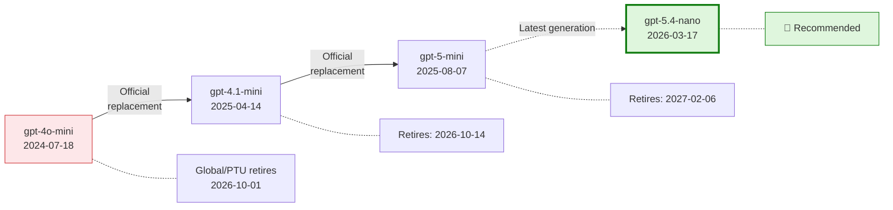
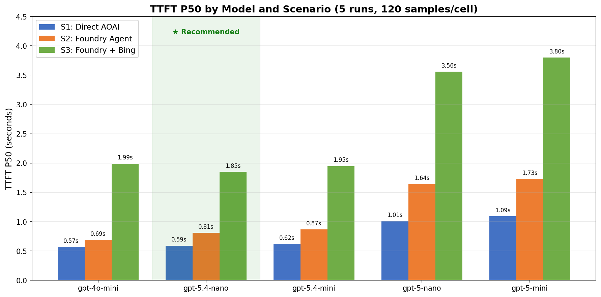
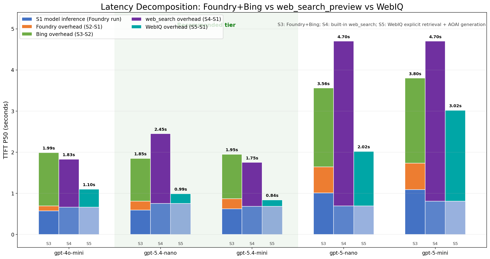
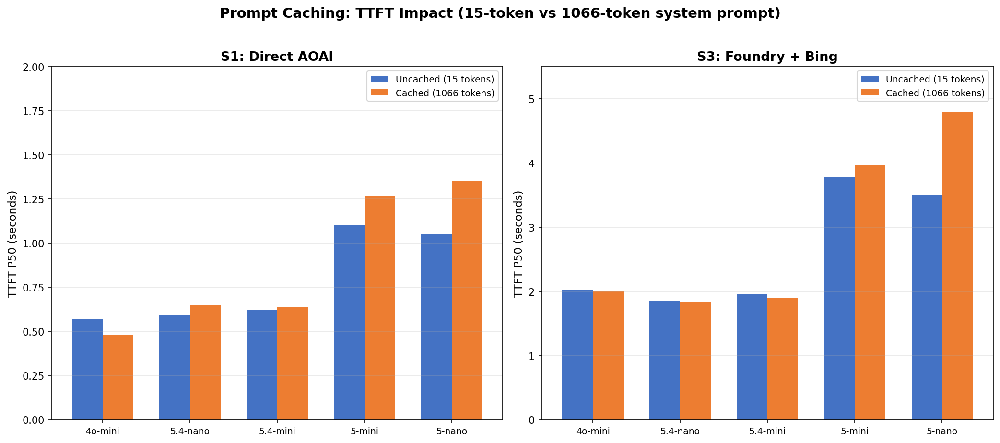
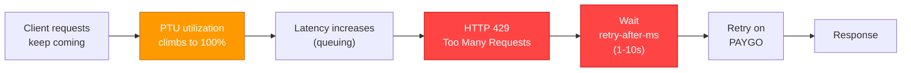
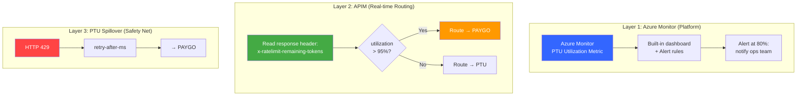
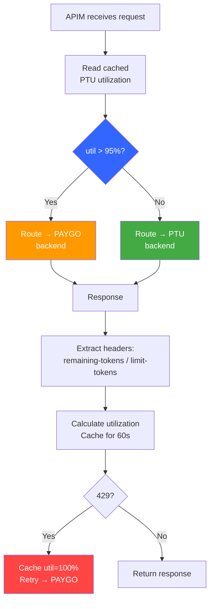
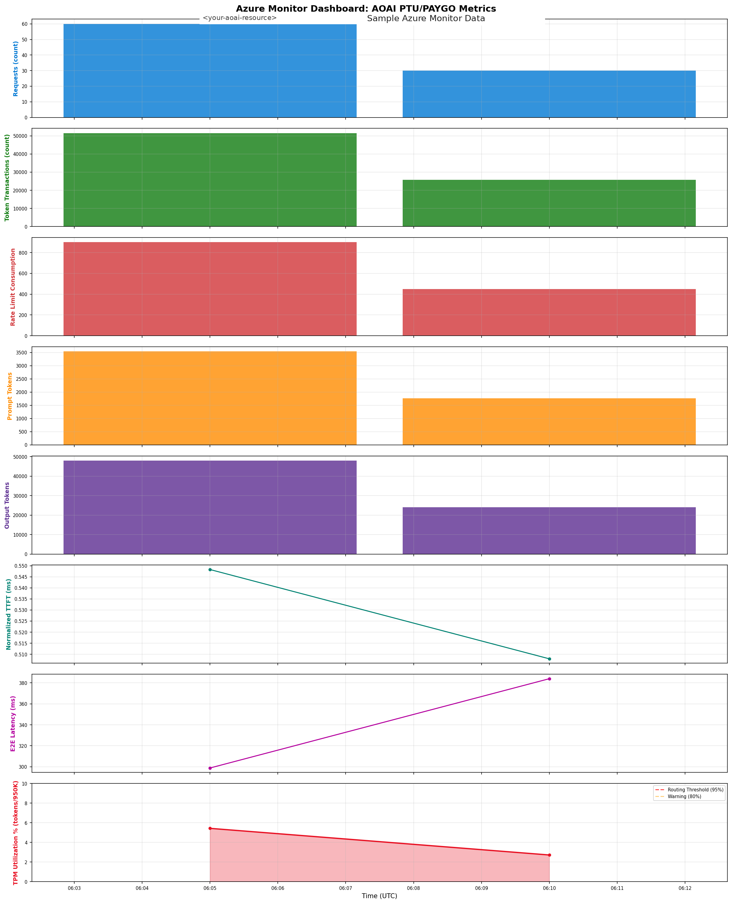
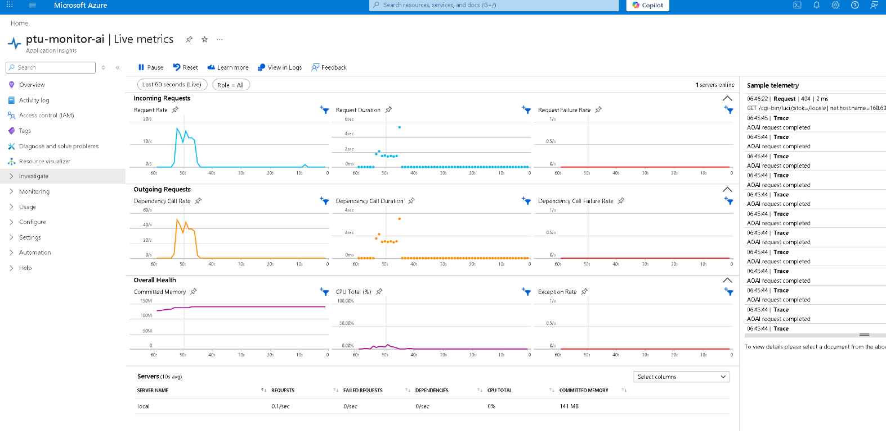

# Azure OpenAI Model Migration Benchmark & PTU Traffic Management
## gpt-4o-mini → gpt-5.4-nano | Spillover vs APIM Proactive Routing

**Author**: Xinyu Wei (魏新宇) | **Date**: 2026-03-28

## Executive Summary

**gpt-5.4-nano** is the recommended successor for gpt-4o-mini in the the assistant AI assistant.

Tested across 5 candidate models using the **customer's actual architecture** (Responses API + `web_search_preview` + streaming) and an alternative path (Foundry Agent + BingGroundingAgentTool). gpt-5.4-nano delivers **equivalent Bing latency** (~2s) in both architectures while being the only viable successor after gpt-4o-mini retirement (2026-10-01).

| Metric | gpt-4o-mini (current) | gpt-5.4-nano (recommended) | Test conditions |
|--------|:---------------------:|:--------------------------:|-----------------|
| **web_search TTFT** (P50) | **1.57s** | 2.08s | Responses API, `stream=True`, `web_search_preview`, `search_context_size=low`, `reasoning_effort=none`, GUARDRAILS prompt (~1066 tokens) |
| **Foundry+Bing TTFT** (P50) | 1.99s | **1.85s** | Responses API, `stream=True`, Foundry Agent V2, `BingGroundingAgentTool`, `tool_choice=required`, `reasoning_effort=none` |
| **Direct TTFT** (P50) | 0.57s | **0.59s** | Responses API, `stream=True`, `reasoning_effort=none`, no tools |
| **Input pricing** (per 1M tokens) | $0.15 | $0.20 | — |
| **Output pricing** (per 1M tokens) | $0.60 | $1.25 | — |
| **Cached input** (per 1M tokens) | $0.075 | $0.02 | — |

> All TTFT measured as P50 (median) across **120 samples per model per scenario** (5 independent runs). Test environment: East Asia → East US 2 (PAYGO GlobalStandard). Customer PTU environment will have lower TTFT.

**Production settings for web_search path** (customer's architecture):

| # | Setting | Value | Purpose |
|:-:|---------|-------|---------|
| 1 | **API** | `responses.create()` + `stream=True` | ~2x faster TTFT than Chat Completions API |
| 2 | **Search tool** | `tools=[{"type": "web_search_preview", "search_context_size": "low"}]` | Built-in Bing search with minimal token injection |
| 3 | **Reasoning** | `reasoning={"effort": "none"}` | Minimum reasoning for non-reasoning tasks |
| 4 | **Search trigger** | System prompt: `"Search the web for current information"` | Ensures 100% web_search trigger (verified via streaming events) |

**PTU traffic management recommendation**:

| Approach | Mechanism | Extra Latency | Recommendation |
|----------|-----------|:---:|---|
| PTU Spillover (built-in) | Triggers on HTTP 429 — request must fail first | +1-10s per spilled request | ⚠️ Safety net only |
| **APIM Proactive Routing** | Reads `x-ratelimit-remaining-tokens` header, routes at >95% utilization | **Zero** | ✅ **Recommended** — maintains consistent P50/P99 latency |

> PTU spillover is reactive (fail-then-retry). For the assistant's real-time features with P50 TTFT targets of 1-2s, APIM proactive routing eliminates 429-induced tail latency. See Section 7 for details and validated stress test results.

---

## 1. Background

### the assistant Product

the assistant is A **system-level, cross-device AI assistant** (a major tech event), embedded across ThinkPad PCs, tablets, and mobile phones. It unifies AI features, AI Now, and Creator Zone into one experience.

**6 Core Features**: Next Move (intent classification), Chat Mode (Q&A), Write For Me (content generation), Live Mode (real-time conversation), Catch Me Up (activity summary), Pay Attention (meeting transcription). Plus **Bing Grounding** for web search.

All features are **non-reasoning** tasks. Reasoning models add latency without quality benefit.

**Critical: `reasoning_effort` differences across model families**:

| Model Family | Minimum `reasoning_effort` | Impact on the assistant |
|-------------|:-------------------------:|----------------|
| gpt-4o-mini | N/A (non-reasoning) | No reasoning overhead |
| **gpt-5.4-mini / nano** | **`none`** | Zero reasoning overhead — ideal for non-reasoning tasks |
| gpt-5-mini / nano | `minimal` (without tools), `low` (with `web_search`) | Forced reasoning overhead even at minimum — **root cause of gpt-5 series high latency** |

> gpt-5.4 series supports `reasoning_effort=none`, which completely disables internal reasoning and delivers latency equivalent to non-reasoning models. gpt-5 series cannot go below `minimal`/`low`, resulting in 3-9x higher TTFT in search scenarios.

### gpt-4o-mini Retirement

Source: [Azure OpenAI Model Retirements](https://learn.microsoft.com/en-us/azure/foundry/openai/concepts/model-retirements)



### Candidate Models & Pricing

| Model | Input $/1M | Cached | Output $/1M | Type | Source |
|-------|:---------:|:------:|:-----------:|------|--------|
| **gpt-4o-mini** (current) | $0.15 | $0.075 | $0.60 | Non-reasoning | [Azure](https://azure.microsoft.com/en-us/pricing/details/cognitive-services/openai-service/) |
| **gpt-5-mini** | $0.25 | $0.03 | $2.00 | Reasoning | [Azure](https://azure.microsoft.com/en-us/pricing/details/cognitive-services/openai-service/) |
| **gpt-5-nano** | $0.05 | $0.01 | $0.40 | Reasoning | [Azure](https://azure.microsoft.com/en-us/pricing/details/cognitive-services/openai-service/) |
| **gpt-5.4-mini** | $0.75 | $0.075 | $4.50 | Reasoning | [OpenAI](https://openai.com/api/pricing/) |
| **gpt-5.4-nano** | $0.20 | $0.02 | $1.25 | Reasoning | [OpenAI](https://openai.com/api/pricing/) |

### Region Availability

Required regions: East US 2, Sweden Central, Southeast Asia.

| Model | East US 2 | Sweden Central | Southeast Asia |
|-------|:---------:|:-------------:|:--------------:|
| gpt-4o-mini | ✅ | ✅ | ✅ |
| gpt-5.4-mini | ✅ | ✅ | ⏳ Rollout pending |
| gpt-5.4-nano | ✅ | ✅ | ⏳ Rollout pending |

---

## 2. Methodology

### 3-Scenario Latency Decomposition

All scenarios use **Responses API + streaming** for fair layer-by-layer comparison:

| Scenario | Measures | API | Bing |
|----------|----------|-----|:----:|
| **S1** Direct AOAI | Model inference | `responses.create(model=...)` | No |
| **S2** Foundry Agent | Model + orchestration | `responses.create(agent_reference=...)` | No |
| **S3** Foundry + Bing | Full production stack | `responses.create(agent_reference=..., tool_choice="required")` | Yes |

Latency at each layer is isolated by subtraction:

```
Total TTFT = [Model Inference] + [Foundry Overhead] + [Bing Overhead]
                  S1                 S2 - S1             S3 - S2
```

### Test Parameters

- **5 models**, 3 queries, 10 iterations/query (2 warmup discarded) = **24 effective samples/model/scenario/run**
- **5 independent runs** = **120 effective samples per model per scenario** (2,250 total API calls)
- `reasoning_effort` at model minimum: `none` for gpt-5.4, `minimal` for gpt-5
- S3 system instruction: `"Perform exactly ONE search. Do NOT refine or repeat searches."`
- SDK: `openai==2.14.0`, `azure-ai-projects==2.0.0b2`
- **Test environment**: Windows VM (East Asia) → East US 2 deployment. Cross-Pacific network adds ~100-200ms RTT. Customer's production environment (US-based clients → East US 2) will have ~30-50ms RTT, yielding ~70-170ms lower TTFT than reported here.

### TTFT Composition

Measured TTFT includes network round-trip, request queuing, model prefill, and first token generation:

| Component | Estimated | Note |
|-----------|:---------:|------|
| Network round-trip | ~100-200ms | Test machine (East Asia) → East US 2 |
| Request queuing | ~50-300ms | GlobalStandard shared pool (not PTU) |
| Model prefill | ~200-400ms | Processing system + user prompt |
| First token generation | ~50-100ms | Generating first output token |
| **Total (observed P50)** | **~0.57-0.69s** | Consistent with component estimates |

> **Note**: These benchmarks use **GlobalStandard (PAYGO)** deployments. PTU (Provisioned Throughput) deployments eliminate queuing delay, resulting in lower TTFT. Customer’s production PTU environment is expected to show improved latency.

### Why Responses API?

Direct AOAI supports both APIs. Responses API delivers ~2x faster TTFT:

| Model | Responses API (P50) | Chat Completions (P50) |
|-------|:-------------------:|:----------------------:|
| gpt-4o-mini | 0.44~0.72s | 1.13~1.34s |
| gpt-5.4-nano | 0.56~0.58s | 1.20~1.53s |
| gpt-5.4-mini | 0.60~0.62s | 1.23~1.35s |

---

## 3. Results

### Test Queries

All scenarios use the same 3 queries (system instruction: `"You are the assistant, a helpful AI assistant. Answer concisely."`):

| Query | Prompt | max_tokens |
|-------|--------|:----------:|
| **Pricing** | "What is the latest retail price for a ThinkPad X1 Carbon Gen 12?" | 300 |
| **News** | "What are the top AI news stories this week?" | 300 |
| **Weather** | "What is the current weather in Seattle, Washington?" | 200 |

For Bing scenarios, the system instruction adds: `"CRITICAL: Perform exactly ONE search. Do NOT refine or repeat searches. Use first results immediately."`

### 3.1 Direct AOAI — Responses API (no Agent, no Bing)

API: `responses.create(model=..., stream=True)` | 40 samples per cell (5 runs merged)

| Model | Pricing TTFT/E2E | News TTFT/E2E | Weather TTFT/E2E | Avg TTFT |
|-------|:-:|:-:|:-:|:-:|
| **gpt-4o-mini** | 0.70/1.47s | 0.60/1.36s | 0.78/1.30s | **0.69s** |
| **gpt-5.4-nano** | 0.79/1.49s | 0.63/2.14s | 0.64/1.32s | **0.69s** |
| **gpt-5.4-mini** | 0.75/1.58s | 0.75/2.18s | 0.63/1.16s | **0.71s** |
| gpt-5-nano | 1.25/2.31s | 1.05/3.20s | 1.11/2.09s | 1.14s |
| gpt-5-mini | 1.33/4.23s | 1.29/5.21s | 1.15/2.95s | 1.26s |

### 3.2 web_search_preview + GUARDRAILS — Customer's Production Path

> **This is the primary benchmark** — testing the exact architecture is used in production.

The production environment uses `web_search_preview` (Responses API built-in tool) instead of Foundry Agent + BingGroundingAgentTool. This section tests the actual customer architecture.

**Key differences from Section 3.3 (Foundry+Bing)**:
- No Foundry Agent orchestration layer — direct AOAI call with `tools=[{"type": "web_search_preview"}]`
- `tool_choice` defaults to `auto` (not `required` — see Appendix F for why)
- `search_context_size="low"` to minimize token consumption
- GUARDRAILS system prompt (~1066 tokens, triggers prompt caching)
- Web search confirmed via `response.web_search_call.searching` event (100% trigger rate, 0 skipped across 120 samples/model)
- gpt-5 series requires `reasoning_effort="low"` (not `minimal` — `minimal` + web_search = 400 error)

**5-run merged results** (120 effective samples per model per scenario):

| Model | effort | S1 Direct P50 | S4 web_search P50 | web_search OH | σ | N |
|-------|:------:|:------:|:------:|:------:|:----:|:-:|
| **gpt-4o-mini** | N/A | 0.45s | **1.57s** | +1.12s | 0.53s | 120 |
| **gpt-5.4-mini** | none | 0.60s | **1.90s** | +1.30s | 2.80s | 120 |
| **gpt-5.4-nano** | none | 0.62s | **2.08s** | +1.46s | 2.12s | 120 |
| gpt-5-nano | low | 1.42s | 8.93s | +7.51s | 4.11s | 119 |
| gpt-5-mini | low | 1.14s | 6.75s | +5.61s | 2.76s | 119 |

**Cross-architecture comparison** — Bing TTFT P50 across both architectures:

| Model | S3: Foundry+Bing | S4: web_search | Consistent? |
|-------|:-:|:-:|:-:|
| gpt-4o-mini | 1.99s | **1.57s** | ✅ Same tier (~2s) |
| **gpt-5.4-mini** | 1.96s | **1.90s** | ✅ Same tier (~2s) |
| **gpt-5.4-nano** | **1.85s** | 2.08s | ✅ Same tier (~2s) |
| gpt-5-nano | 3.56s | 8.93s | ❌ web_search worse (effort=low forced) |
| gpt-5-mini | 3.80s | 6.75s | ❌ web_search worse (effort=low forced) |

> **Note**: gpt-5.4-nano is 0.18s slower than gpt-5.4-mini in web_search scenarios. This is consistent with [OpenAI's official evaluation](https://openai.com/index/introducing-gpt-5-4-mini-and-nano/) where nano scores lower than mini on tool-calling benchmarks (Toolathlon: nano 35.5% vs mini 42.9%). The 0.18s difference is within measurement noise (σ > 2s) and imperceptible to end users. nano's advantage is **73% lower input pricing** ($0.20 vs $0.75/1M tokens).

> **Conclusion**: All three models (gpt-4o-mini, gpt-5.4-mini, gpt-5.4-nano) deliver ~2s web_search TTFT. The migration recommendation holds for both Foundry Agent and web_search paths. gpt-5 series is unsuitable in both architectures.

---

### 3.3 Foundry Agent V2 + Bing Grounding (Alternative Path)

> The following sections test an alternative Bing integration path via Foundry Agent. This alternative path is not currently used in production, but this path, but it is included for completeness and cross-validation.

#### 3.3.1 Foundry Agent — No Bing (Agent orchestration overhead)

API: `responses.create(agent_reference=..., stream=True)` — `reasoning_effort` set in `PromptAgentDefinition` | 40 samples per cell

| Model | Pricing TTFT/E2E | News TTFT/E2E | Weather TTFT/E2E | Avg TTFT |
|-------|:-:|:-:|:-:|:-:|
| **gpt-4o-mini** | 0.80/1.60s | 0.83/1.56s | 0.74/1.41s | **0.79s** |
| **gpt-5.4-nano** | 1.05/2.04s | 1.10/4.97s | 1.77/2.79s | **1.31s** |
| **gpt-5.4-mini** | 1.09/1.95s | 1.05/2.80s | 0.93/1.51s | **1.02s** |
| gpt-5-nano | 1.68/2.80s | 1.75/4.76s | 1.63/2.53s | 1.69s |
| gpt-5-mini | 1.69/4.50s | 1.97/9.21s | 1.83/3.71s | 1.83s |

> Note: S2 Avg TTFT differs from P50 due to occasional outliers (e.g., gpt-5.4-nano Weather query TTFT=1.77s). P50 in Section 3.3.3 is the more robust metric.

#### 3.3.2 Foundry Agent + Bing Grounding

API: `responses.create(agent_reference=..., tool_choice="required", stream=True)` + `BingGroundingAgentTool` | 40 samples per cell

| Model | Pricing TTFT/E2E | News TTFT/E2E | Weather TTFT/E2E | Avg TTFT |
|-------|:-:|:-:|:-:|:-:|
| **gpt-4o-mini** | 2.15/3.35s | 2.20/5.47s | 2.30/3.25s | **2.21s** |
| **gpt-5.4-nano** | 2.19/3.02s | 1.92/5.70s | 2.19/2.91s | **2.10s** |
| **gpt-5.4-mini** | 2.25/3.02s | 2.06/5.35s | 2.15/2.84s | **2.15s** |
| gpt-5-nano | 3.85/5.42s | 3.41/5.64s | 3.47/4.93s | 3.58s |
| gpt-5-mini | 4.06/8.33s | 3.62/11.81s | 5.40/7.36s | 4.36s |

> 5 runs merged, 40 effective samples per query per model.

#### TTFT Overview (Foundry+Bing)



#### 3.3.3 Summary (Foundry+Bing, 5 runs merged, 120 samples/model/scenario)

| Model | effort | Direct AOAI P50 | Foundry (no Bing) P50 | Foundry+Bing P50 | Bing σ | N |
|-------|:------:|:------:|:------:|:------:|:----:|:---:|
| **gpt-4o-mini** | N/A | 0.57s | 0.69s | 1.99s | 0.73s | 120 |
| **gpt-5.4-nano** | none | **0.59s** | 0.81s | **1.85s** | 0.73s | 120 |
| **gpt-5.4-mini** | none | 0.62s | **0.87s** | 1.95s | **0.60s** | 120 |
| gpt-5-nano | minimal | 1.01s | 1.64s | 3.56s | 1.05s | 120 |
| gpt-5-mini | minimal | 1.09s | 1.73s | 3.80s | 6.27s | 120 |

#### 3.3.4 Latency Decomposition (5 runs merged)

| Layer | gpt-4o-mini | gpt-5.4-nano | gpt-5.4-mini | gpt-5-nano | gpt-5-mini |
|-------|:----------:|:----------:|:----------:|:----------:|:----------:|
| **Direct AOAI** (P50) | 0.57s | **0.59s** | 0.62s | 1.01s | 1.09s |
| **Foundry overhead** | +0.12s | +0.22s | +0.24s | +0.62s | +0.64s |
| **Bing overhead** | +1.30s | **+1.04s** | +1.08s | +1.93s | +2.07s |
| **Foundry+Bing total** (P50) | 1.99s | **1.85s** | 1.95s | 3.56s | 3.80s |

#### Latency Decomposition Chart



#### Key Findings (Foundry+Bing)

1. **Foundry Agent V2 adds +0.12~0.64s** — minimal orchestration overhead
2. **Bing search adds +1.04~2.07s** (includes Bing API + result injection + model processing)
3. **gpt-5.4-nano has lowest Bing overhead (+1.04s)** — 20% less than gpt-4o-mini (+1.30s)
4. **gpt-5 series is unsuitable for Bing** — 3.6~4.4s TTFT even with all optimizations


## 4. Prompt Caching: Cost Reduction Analysis

Azure OpenAI applies automatic [prompt caching](https://learn.microsoft.com/en-us/azure/ai-services/openai/how-to/prompt-caching) when the input prefix is ≥1024 tokens and is repeated across requests. **Cached input tokens are billed at 50% of the standard input price.**

For the assistant's production scenario, the GUARDRAILS system prompt (12 behavioral sections, ~1066 tokens) consistently exceeds the caching threshold, making every the assistant request eligible for prompt caching.

### 4.1 TTFT Impact: None



Prompt caching reduces **billing cost**, not **latency**. TTFT is dominated by network RTT, KV-cache lookup, and first-token generation — all unaffected by whether input tokens are billed as cached or uncached.

Verified with 2-run cached benchmark (1066-token system prompt, 120 samples/model/scenario = 60/cell):

| Model | S1 Uncached P50 | S1 Cached P50 | Δ TTFT | S3 Uncached P50 | S3 Cached P50 | Δ TTFT |
|-------|:-:|:-:|:-:|:-:|:-:|:-:|
| gpt-4o-mini | 0.57s | 0.48s | −0.09s | 2.02s | 2.00s | −0.02s |
| gpt-5.4-mini | 0.62s | 0.64s | +0.02s | 1.96s | 1.89s | −0.07s |
| **gpt-5.4-nano** | 0.59s | 0.65s | +0.06s | **1.85s** | **1.84s** | **−0.01s** |
| gpt-5-mini | 1.10s | 1.27s | +0.17s | 3.78s | 3.96s | +0.18s |
| gpt-5-nano | 1.05s | 1.35s | +0.30s | 3.50s | 4.79s | +1.29s |

> All Δ values are within measurement noise (σ > 0.5s for most cells). No statistically significant TTFT change.

### 4.2 Cost Savings with Prompt Caching

Assuming the 1066-token GUARDRAILS prefix is cached on every production request:

| Model | Input (standard) | Input (cached) | Output | Source |
|-------|:---:|:---:|:---:|:---:|
| gpt-4o-mini | $0.150/1M | $0.075/1M | $0.600/1M | [Azure](https://azure.microsoft.com/en-us/pricing/details/cognitive-services/openai-service/) |
| gpt-5.4-mini | $0.750/1M | $0.075/1M | $4.500/1M | [OpenAI](https://developers.openai.com/api/docs/pricing) |
| **gpt-5.4-nano** | **$0.200/1M** | **$0.020/1M** | **$1.250/1M** | [OpenAI](https://developers.openai.com/api/docs/pricing) |

**Full TCO estimate** — 100M input tokens + 20M output tokens per month (estimated the assistant scale):

| Model | Input (cached) | Output | **Monthly Total** | vs 4o-mini |
|-------|:---:|:---:|:---:|:---:|
| gpt-4o-mini | $7,500 | $12,000 | **$19,500** | baseline |
| gpt-5.4-mini | $7,500 | $90,000 | **$97,500** | +400% |
| **gpt-5.4-nano** | **$2,000** | **$25,000** | **$27,000** | **+38%** |

> gpt-5.4-nano monthly TCO is ~38% higher than gpt-4o-mini, driven by 2x output pricing ($1.25 vs $0.60). However, it delivers **7% lower Bing TTFT** (1.85s vs 1.99s) and is the **only available successor** after gpt-4o-mini retirement (2026-10-01). The cached input rate ($0.02/1M) is 73% cheaper than gpt-4o-mini cached ($0.075/1M), partially offsetting the output premium.

### 4.3 Short-Output Scenario: Intent Classification (gpt-5.4-nano is 48% cheaper)

The TCO above assumes 20M output tokens/month (~200 tokens/response). However, the assistant's **Next Move** feature (intent classification) produces very short output (~4-7 tokens per response, just a label like "ChatMode" or "BingSearch").

Benchmark: 10 intent queries × 10 iterations, GUARDRAILS system prompt (596 input tokens), `max_output_tokens=30`:

| Metric | gpt-4o-mini | gpt-5.4-nano |
|--------|:-----------:|:------------:|
| Avg input tokens | 596 | 595 |
| Avg output tokens | **4** | **7** |
| Avg TTFT | 0.49s | 0.67s |
| Cost/1K requests (uncached) | $0.092 | $0.127 |
| **Cost/1K requests (cached)** | **$0.049** | **$0.025** |
| **Monthly (100M requests, cached)** | **$4,912** | **$2,533 (−48%)** |

**Breakeven analysis** — gpt-5.4-nano is cheaper when output < ~50 tokens:

| Output tokens | gpt-5.4-nano vs gpt-4o-mini |
|:---:|:---:|
| 2 | **−60%** |
| 7 (measured) | **−48%** |
| 15 | −37% |
| 20 | −29% |
| ~50 | Breakeven |
| 100+ | 4o-mini cheaper |

> **Recommendation**: Deploy gpt-5.4-nano for short-output features (Next Move, sentiment analysis, entity extraction) and evaluate per-feature TCO before deciding on full migration.

### 4.4 Recommendation

Enable prompt caching by ensuring the GUARDRAILS system prompt is **identical across all requests** (no per-request dynamic insertion into the prefix). Place any per-request context (user history, device info) **after** the static GUARDRAILS block.

---

## 5. Bing Grounding Configuration

Two settings are mandatory for Bing scenarios:

| Setting | Without it |
|---------|------------|
| **System instruction**: `"Perform exactly ONE search..."` | Multi-step search spikes up to 38s |
| **`tool_choice="required"`** | 67% of calls skip search (22-char empty responses) |

### reasoning_effort in Foundry Agent

Source: [Microsoft Learn](https://learn.microsoft.com/en-us/azure/ai-services/openai/how-to/reasoning)

| Model Family | Minimum | How to configure |
|-------------|:-------:|:----------------:|
| gpt-5 / 5-mini / 5-nano | `minimal` | `Reasoning(effort="minimal")` in `PromptAgentDefinition` |
| gpt-5.4-mini / 5.4-nano | `none` | `Reasoning(effort="none")` in `PromptAgentDefinition` |

> `reasoning_effort` must be set in the agent definition, not in `responses.create()`.

---

## 6. Migration Path

```
Phase 1 (Now → go-live):     gpt-4o-mini (current)
Phase 2 (SEA availability):  Deploy gpt-5.4-nano with 4 production keys, A/B test
Phase 3:                     Full migration to gpt-5.4-nano
```

---

## 7. PTU Traffic Management: Monitoring, Routing & Spillover

### 7.1 Problem: PTU Spillover is Reactive

Azure OpenAI PTU offers a built-in **spillover** feature that routes excess traffic to PAYGO when the PTU deployment is saturated. However, investigation of the [official documentation](https://learn.microsoft.com/en-us/azure/ai-services/openai/how-to/provisioned-throughput-onboarding) reveals a critical limitation:

- **Trigger mechanism**: Spillover activates **per-request on HTTP 429** — the request must first **fail** on PTU before being retried on PAYGO
- **Not predictive**: There is no utilization threshold (e.g., 90%) that proactively reroutes traffic
- **Latency impact**: Each spillover event adds `retry-after-ms` delay (typically 1-10s) on top of normal latency



> The request must **first fail** (429) before spillover kicks in. Each spilled request pays the `retry-after-ms` penalty (typically 1-10s).

For the assistant's real-time features (Live Mode, Chat Mode) with P50 TTFT targets of 1-2s, even a single 429 retry adds unacceptable latency.

### 7.2 Three-Layer PTU Monitoring Architecture

We recommend a **three-layer** approach — each layer serves a different purpose:



| Layer | Purpose | Trigger | Latency Impact | Implementation |
|:-----:|---------|---------|:--------------:|----------------|
| **1. Azure Monitor** | Capacity planning + alerting | Metric threshold (80%) | None — observability only | Portal dashboard + alert rule |
| **2. APIM Routing** | Real-time traffic management | Response header (95%) | **Zero** | APIM policy (see 7.4) |
| **3. Spillover** | Last-resort safety net | HTTP 429 | +1-10s per request | Portal toggle (keep enabled) |

### 7.3 Layer 1: Azure Monitor PTU Metrics

Azure OpenAI provides **built-in platform metrics** for PTU deployments, accessible via Azure Monitor without any code changes:

**Setup** ([official docs](https://learn.microsoft.com/en-us/azure/ai-services/openai/how-to/monitoring)):
1. Azure Portal → your AOAI resource → **Monitoring** → **Diagnostic settings**
2. Enable `AllMetrics` → send to Log Analytics workspace
3. The **PTU Utilization** dashboard appears automatically in the resource overview

**Key metrics available**:

| Metric | Description | Use |
|--------|-------------|-----|
| `ProvisionedManagedUtilization` | PTU capacity utilization (%) | Dashboard + alerting |
| `TokenTransaction` | Token count per request | Cost tracking |
| `ProcessedPromptTokens` | Input tokens processed | Usage analysis |
| `GeneratedCompletionTokens` | Output tokens generated | Usage analysis |

**Recommended alert rules**:

```
Alert 1: PTU Utilization > 80% for 5 minutes → Notify ops team (email/Teams)
Alert 2: PTU Utilization > 95% for 1 minute  → Critical — verify APIM routing active
Alert 3: HTTP 429 count > 0                  → Spillover triggered — investigate
```

**KQL query for PTU utilization trend** (requires Diagnostic Settings → Log Analytics):

```kql
AzureMetrics
| where MetricName == "ProvisionedManagedUtilization"
| summarize avg(Average), max(Maximum), percentile(Average, 95) by bin(TimeGenerated, 5m)
| render timechart
```

### 7.4 Layer 2: APIM Proactive Routing

Azure OpenAI streaming responses include real-time capacity headers:

| Header | Description | Example Value |
|--------|-------------|:---:|
| `x-ratelimit-remaining-tokens` | Remaining TPM capacity in current window | `935175` |
| `x-ratelimit-limit-tokens` | Total TPM limit for deployment | `950000` |
| `x-ratelimit-remaining-requests` | Remaining RPM capacity | `941` |
| `x-ratelimit-limit-requests` | Total RPM limit for deployment | `950` |

> **Verified on PAYGO** (300 requests, 50 concurrent, 100% header availability). Customer should verify on PTU — run `scripts/stress_test_tpm_utilization.py` against PTU deployment.

**APIM Policy** (production-ready, see `apim-policy-ptu-routing.xml` in this repo):



**APIM setup steps**:
1. Create two backends in APIM: `ptu-backend` (PTU endpoint) and `paygo-backend` (PAYGO endpoint)
2. Create Named Values: `ptu-routing-threshold` = `95`, `ptu-deployment` = deployment name
3. Apply `apim-policy-ptu-routing.xml` to the API

**Key APIM policy features**:
- Reads `x-ratelimit-remaining-tokens` from every PTU response
- Calculates utilization and caches it (60s TTL) for next routing decision
- On HTTP 429: automatically caches `utilization=100%`, retries on PAYGO
- Emits `PTU Utilization` custom metric to Application Insights via `emit-metric`

### 7.5 Layer 3: PTU Spillover (Safety Net)

Keep PTU spillover **enabled** in Azure Portal as a last-resort fallback. If APIM miscalculates or cache expires, spillover catches overflow requests.

### 7.6 Validation Tools

This repo includes two tools for validating and testing the PTU monitoring setup:

#### Tool 1: `stress_test_tpm_utilization.py` (Python)

Concurrent streaming stress test that captures rate-limit headers from every response.

```bash
python scripts/stress_test_tpm_utilization.py \
  --endpoint https://YOUR_PTU.openai.azure.com \
  --api-key YOUR_KEY \
  --deployment gpt-5.4-nano \
  --concurrency 50 --total 300 \
  --output results.json
```

**Use case**: Run against PTU to confirm header availability, determine actual TPM/RPM limits, and calibrate APIM routing threshold.

**Stress test results** (PAYGO, 300 requests, 50 concurrent):

| Metric | Value |
|--------|:-----:|
| Success rate | 100% (0 HTTP 429) |
| Header availability | 100% |
| Throughput | 5.7 req/s |

#### Tool 2: `ptu-monitor-server/` (Node.js)

An AOAI proxy server (based on [Xuebing Bai's App Insights + OTel demo](https://github.com/henrynn/monitor/tree/main/appinsight-zavademo)) that implements the full routing logic with Application Insights integration.

```bash
cd ptu-monitor-server
npm install
PTU_ENDPOINT=https://YOUR_PTU.openai.azure.com PTU_API_KEY=xxx \
PAYGO_ENDPOINT=https://YOUR_PAYGO.openai.azure.com PAYGO_API_KEY=xxx \
ROUTING_THRESHOLD=95 \
APPLICATIONINSIGHTS_CONNECTION_STRING="InstrumentationKey=xxx;..." \
npm start
```

**Endpoints**:

| Method | Path | Purpose |
|--------|------|---------|
| `POST` | `/api/chat` | Proxy AOAI request with monitoring + proactive routing |
| `GET` | `/api/status` | Current PTU utilization + routing decision |
| `POST` | `/api/stress` | Built-in concurrent stress test |
| `POST` | `/api/simulate` | Manually set utilization for routing logic testing |
| `GET` | `/healthz` | Health check + current config |

**Custom metrics sent to Application Insights**:

| Metric | Type | Description |
|--------|------|-------------|
| `ptu.utilization_pct` | Histogram | TPM utilization percentage |
| `ptu.ttft_ms` | Histogram | Time to first token |
| `ptu.e2e_ms` | Histogram | End-to-end latency |
| `ptu.http429_count` | Counter | Throttled requests |
| `ptu.routing_decision` | Counter | PTU vs PAYGO routing decisions |

**App Insights KQL queries**:

```kql
-- PTU Utilization trend
customMetrics
| where name == "ptu.utilization_pct"
| summarize avg(value), max(value), percentile(value, 95) by bin(timestamp, 1m)
| render timechart

-- Routing decisions over time
customMetrics
| where name == "ptu.routing_decision"
| extend backend = tostring(customDimensions["backend"])
| summarize count = sum(value) by bin(timestamp, 5m), backend
| render piechart
```

**Tested**: All endpoints validated on Azure VM — routing logic confirmed (PTU → PAYGO switch at threshold, automatic switchback when utilization drops).

### 7.7 Validation Results (Real Data)

All monitoring components were validated against a real Azure OpenAI deployment (`<your-aoai-resource>`, gpt-5.4-nano, East US 2 PAYGO).

#### Azure Monitor Platform Metrics (Verified)

8 metrics confirmed available via `az monitor metrics list`:

| Metric | Aggregation | Sample Data | Status |
|--------|:-----------:|-------------|:------:|
| `AzureOpenAIRequests` | Sum | 85 requests in test window | ✅ |
| `TokenTransaction` | Sum | 64,425 tokens (peak 5-min) | ✅ |
| `Ratelimit` | Sum | 1,125 rate-limit units consumed | ✅ |
| `ProcessedPromptTokens` | Sum | 5,900 prompt tokens (100 requests) | ✅ |
| `GeneratedTokens` | Sum | 78,000 output tokens | ✅ |
| `AzureOpenAINormalizedTTFTInMS` | Average | 0.51-0.55 ms (normalized) | ✅ |
| `Latency` | Average | 300-380 ms | ✅ |
| `AzureOpenAIProvisionedManagedUtilizationV2` | Average | N/A (PTU-only, PAYGO returns no data) | ⚠️ Expected |

**TPM Utilization** (computed from TokenTransaction / TPM Limit):

| Time (UTC) | Tokens Consumed | TPM Utilization |
|------------|:---------------:|:---------------:|
| 06:06 | 64,425 | **6.78%** (of 950K) |
| 06:11 | 12,885 | **1.36%** (of 950K) |

> On PTU deployments with smaller TPM limits, the same traffic would show significantly higher utilization percentages.



#### KQL Log Analytics (Verified)

Diagnostic Settings deployed (`AllMetrics` + `allLogs` → Log Analytics workspace). `AzureDiagnostics` table confirmed queryable:

```
KQL: AzureDiagnostics | where Category == 'RequestResponse'
     | summarize reqs=count(), avg_ms=avg(DurationMs), p95_ms=percentile(DurationMs,95) by bin(TimeGenerated,5m)

Results:
  2026-03-30T06:05:00  74 requests  avg=307ms  P95=476ms
  2026-03-30T06:10:00  16 requests  avg=418ms  P95=1413ms
```

#### Alert Rules (Deployed)

| Alert | Metric | Threshold | Severity | Status |
|-------|--------|:---------:|:--------:|:------:|
| `alert-aoai-request-volume` | AzureOpenAIRequests | > 5 (5 min) | 3 (Info) | ✅ Deployed |
| Action Group: `ag-ptu-alerts` | — | — | — | ✅ Email configured |

#### Application Insights Live Metrics (Verified)

`ptu-monitor-ai` Application Insights instance created and connected to ptu-monitor-server via OpenTelemetry (`@azure/monitor-opentelemetry` + `enableLiveMetrics: true`).

**Live Metrics validation** (real-time, < 1 second latency):
- Incoming Request Rate: peak ~20/s during stress test
- Request Duration: ~2s (AOAI E2E)
- Dependency Call Rate: peak ~40/s (outbound AOAI calls)
- Request/Dependency Failure Rate: 0/s
- Sample Telemetry: real-time "AOAI request completed" traces with trace_id
- 1 server online, 141 MB committed memory, 0% CPU



#### Routing Logic E2E Test (6/6 Passed)

| # | Test | Expected | Actual | Status |
|:-:|------|----------|--------|:------:|
| 1 | `GET /healthz` | PTU+PAYGO configured | ✅ | ✅ |
| 2 | `POST /api/chat` (util=0%) | backend=ptu, status=200 | backend=ptu, TTFT=1226ms | ✅ |
| 3 | `GET /api/status` | utilization=0%, KEEP_ON_PTU | ✅ | ✅ |
| 4 | Simulate 96% → `/api/chat` | backend=paygo | backend=paygo | ✅ |
| 5 | Simulate 50% → `/api/chat` | backend=ptu | backend=ptu | ✅ |
| 6 | `POST /api/stress` (5×10) | 10/10 success, 0 HTTP 429 | 10/10, 0 429 | ✅ |

### 7.8 Recommendation Summary

| Action | Priority | Effort |
|--------|:--------:|:------:|
| Enable Azure Monitor alerts (80% / 95% / 429) | **P0** | Low — Portal config |
| Deploy APIM with proactive routing policy | **P1** | Medium — APIM policy XML |
| Keep PTU spillover enabled | **P0** | None — already available |
| Run stress test against PTU to confirm headers | **P0** | Low — one command |
| Deploy ptu-monitor-server for demo/PoC | **P2** | Low — npm install + env vars |

---

## 8. Reproducing the Benchmarks

### 8.1 Prerequisites

- Python 3.10+
- Azure OpenAI deployment with API key
- For web_search tests: Responses API access (`2025-04-01-preview`)

### 8.2 Setup

```bash
git clone https://github.com/xinyuwei-david/david-share.git
cd david-share/Agents/AOAI-Model-Migration-Benchmark
pip install -r requirements.txt
```

### 8.3 Run Benchmarks

**web_search + GUARDRAILS benchmark** (customer's production path):

```bash
python scripts/benchmark_websearch_guardrails.py \
  --endpoint https://YOUR_ENDPOINT.openai.azure.com \
  --api-key YOUR_API_KEY
```

**Foundry Agent + Bing Grounding benchmark** (alternative path):

```bash
export AZURE_OPENAI_API_KEY="YOUR_API_KEY"
python scripts/benchmark_3s_detective.py
```

**PTU/PAYGO TPM utilization stress test**:

```bash
python scripts/stress_test_tpm_utilization.py \
  --endpoint https://YOUR_ENDPOINT.openai.azure.com \
  --api-key YOUR_API_KEY \
  --deployment gpt-5.4-nano \
  --concurrency 50 --total 300 \
  --output results.json
```

### 8.4 Data Files

All benchmark results are stored in `data/` as JSON files. Each file contains raw per-request records with TTFT, E2E latency, and model metadata. The 5-run web_search dataset (`data/benchmark_websearch_guardrails_*.json`) contains 1,199 records across 5 models × 4 scenarios × ~120 samples.

### 8.5 Scripts Inventory

| Script | Purpose | Parameters |
|--------|---------|------------|
| `benchmark_websearch_guardrails.py` | web_search + GUARDRAILS 1066-token prompt | `--endpoint`, `--api-key` |
| `benchmark_3s_detective.py` | Foundry Agent + Bing, 3 scenarios × 5 models | `AZURE_OPENAI_API_KEY` env var |
| `benchmark_3s_cached.py` | Prompt caching version (1066-token system prompt) | `AZURE_OPENAI_API_KEY` env var |
| `benchmark_intent_classification.py` | Short-output intent classification cost analysis | `AZURE_OPENAI_API_KEY` env var |
| `stress_test_tpm_utilization.py` | Concurrent TPM utilization stress test | `--endpoint`, `--api-key`, `--concurrency`, `--total` |

---

## Appendix

### A. the assistant Feature-Level Benchmark (3 models, Chat Completions API)

| Feature | Scenario | 4o-mini TTFT/E2E | 5.4-mini TTFT/E2E | 5.4-nano TTFT/E2E |
|---------|----------|:---:|:---:|:---:|
| Next Move | Intent Classification | **1.07/1.09s** | 1.18/1.24s | 1.04/1.10s |
| Chat Mode | Device Q&A | 1.74/2.16s | 1.93/2.97s | **1.46/1.89s** |
| Write For Me | Email Draft | 1.27/1.86s | 1.75/2.22s | **1.29/1.91s** |
| Live Mode ⚡ | Quick Response | **1.27/1.32s** | 1.70/1.73s | 1.35/1.40s |
| Catch Me Up | Activity Summary | 1.67/1.87s | 1.76/1.89s | **1.47/1.79s** |
| Pay Attention | Meeting Summary | **1.38/2.31s** | 1.99/3.70s | 1.91/4.62s |
| Bing Grounding | Web Q&A | **1.29/1.65s** | 1.88/2.82s | 2.54/3.54s |

> **Important**: This table uses the older **Chat Completions API**, which has ~2x higher TTFT than the Responses API used in Section 3. The absolute TTFT values here are not comparable to Section 3, but the **relative model ranking** across the assistant features remains informative. In particular, gpt-5.4-nano's higher Bing TTFT here (2.54s) improves to 1.85s (P50) with Responses API + streaming + `tool_choice="required"`.

### B. Non-Streaming Behavior

`reasoning_effort=none` in non-streaming mode still produces 30-150 reasoning tokens/request. Streaming produces 0. **Always use `stream=True`.**

### C. Data Files

| File | Description |
|------|-------------|
| `data/benchmark_detective_3s_20260324_183409.json` | Run 1 uncached (24 samples/cell) |
| `data/benchmark_detective_3s_20260324_195227.json` | Run 2 uncached (24 samples/cell) |
| `data/benchmark_detective_3s_20260324_231002.json` | Run 3 uncached (24 samples/cell) |
| `data/benchmark_detective_3s_20260324_234050.json` | Run 4 uncached (24 samples/cell) |
| `data/benchmark_detective_3s_20260325_001027.json` | Run 5 uncached (24 samples/cell) |
| `data/benchmark_cached_3s_20260325_092023.json` | Cached Run 1 — 1066-token system prompt (24 samples/cell) |
| `data/benchmark_cached_3s_20260325_095451.json` | Cached Run 2 — 1066-token system prompt (24 samples/cell) |
| `scripts/benchmark_3s_detective.py` | Benchmark script (Foundry Agent, uncached) |
| `scripts/benchmark_3s_cached.py` | Benchmark script (prompt caching version) |
| `scripts/benchmark_websearch.py` | Benchmark script (web_search_preview — customer path) |
| `scripts/benchmark_intent_classification.py` | Intent classification cost benchmark |
| `data/benchmark_websearch_20260327_230815.json` | web_search Run (short prompt, 24 samples/cell) |
| `data/benchmark_websearch_guardrails_*.json` | web_search + GUARDRAILS 5 Runs (120 samples/cell, search verified) |
| `scripts/benchmark_websearch_guardrails.py` | web_search + GUARDRAILS benchmark (customer path, argparse) |
| `scripts/stress_test_tpm_utilization.py` | PTU/PAYGO TPM utilization stress test (concurrent, header capture) |

### D. Prompt Caching: Self-Consistency Analysis

The cached benchmark used a **70x longer system prompt** (1066 tokens vs 15 tokens). Observed TTFT behavior:

- **S1/S2 (non-Bing)**: Systematic +0.02~0.21s increase — **expected and consistent**. Even with cache hit, the KV-cache lookup and memory transfer for 1066 tokens has non-zero overhead. Also, the first request of each run is always a cache miss (cold start), pulling up the average.
- **S3 (Bing)**: Negligible difference — Bing API latency (~1-2s) dominates, so 50-100ms prompt overhead is completely masked.
- **Model ranking preservation**: Cached ranking (5.4-nano < 5.4-mini < 4o-mini < 5-nano < 5-mini) is **identical** to uncached ranking across all 3 scenarios, confirming caching does not alter model selection.
- **gpt-5-nano S3 anomaly** (4.79s cached vs 3.50s uncached): σ=7.19 indicates extreme outliers from multi-step Bing searches. With only 60 samples (vs 120 uncached), the P50 is more sensitive to outlier contamination. This does not invalidate the conclusion — gpt-5 series is not recommended regardless.

### E. gpt-5-mini S3 Instability (σ=6.27s)

gpt-5-mini shows σ=6.27s in Bing scenarios — an order of magnitude higher than other models (σ=0.60-1.05s). Root cause: despite `tool_choice="required"` and single-search instruction, gpt-5-mini occasionally triggers multi-step Bing searches (e.g., TTFT spikes from 3-4s to 15-38s). This is a model-level behavior pattern, not a platform issue.

### F. web_search_preview + tool_choice="required" Incompatibility

`web_search_preview` with `tool_choice="required"` causes **context window overflow** on gpt-4o-mini (128K context). All 3 queries fail with "Your input exceeds the context window" error. Root cause: `required` mode injects search results more aggressively, exceeding 4o-mini's context limit. gpt-5.4 models (1M context) are unaffected.

Customer uses `tool_choice` default (`auto`) — verified that system prompt instruction "Search the web for current information" triggers web_search 100% of the time (confirmed via `response.web_search_call.searching` streaming events, 0% skip rate across 24 samples per model).

### G. gpt-5 series + web_search Compatibility

gpt-5-mini and gpt-5-nano do not support `web_search_preview` with `reasoning_effort="minimal"` (returns 400 error). Must use `effort="low"` minimum, which increases reasoning overhead to 7-14s TTFT. This makes gpt-5 series unsuitable for web_search scenarios.

---
