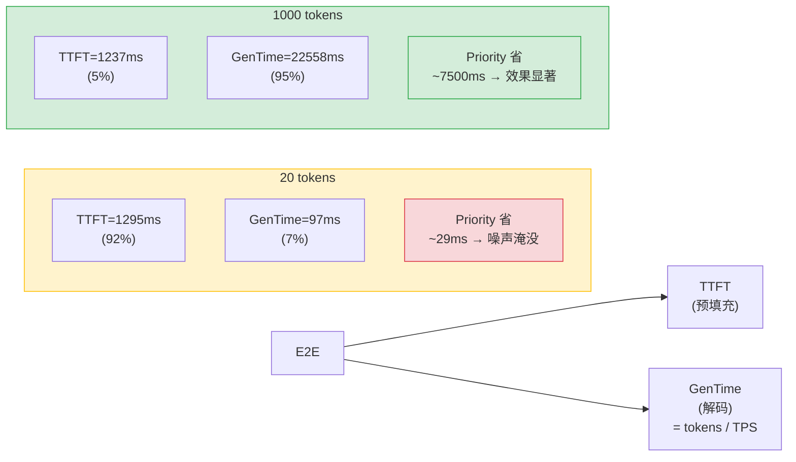
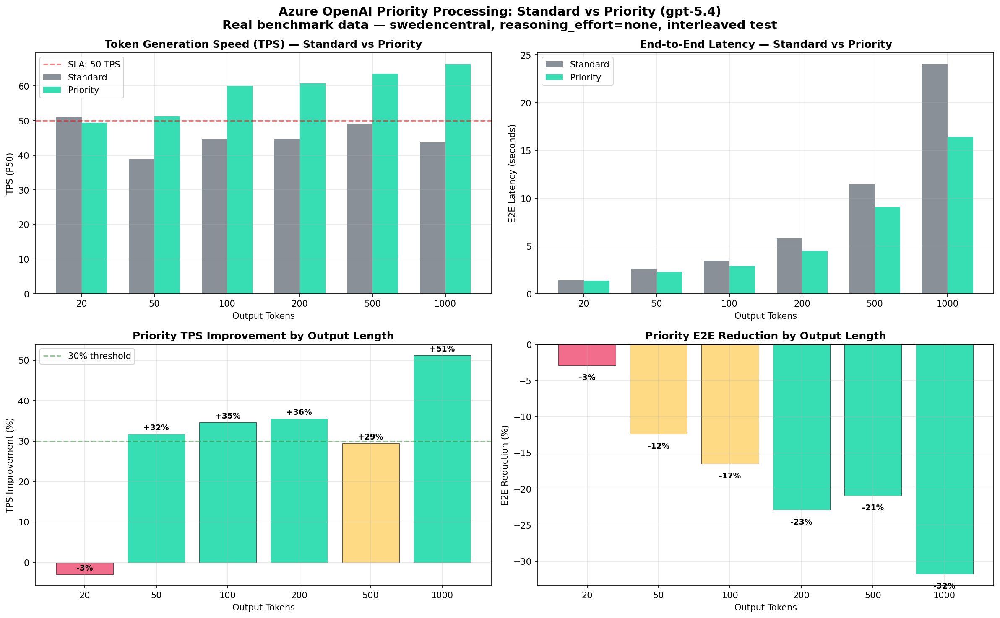
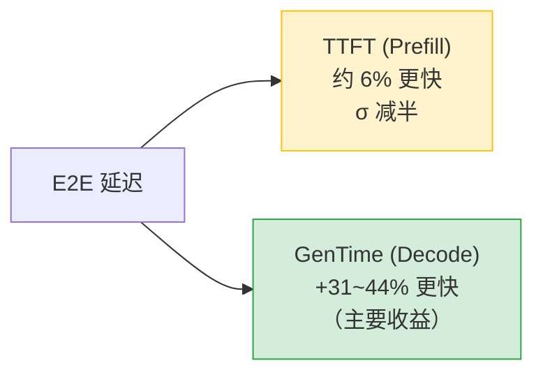
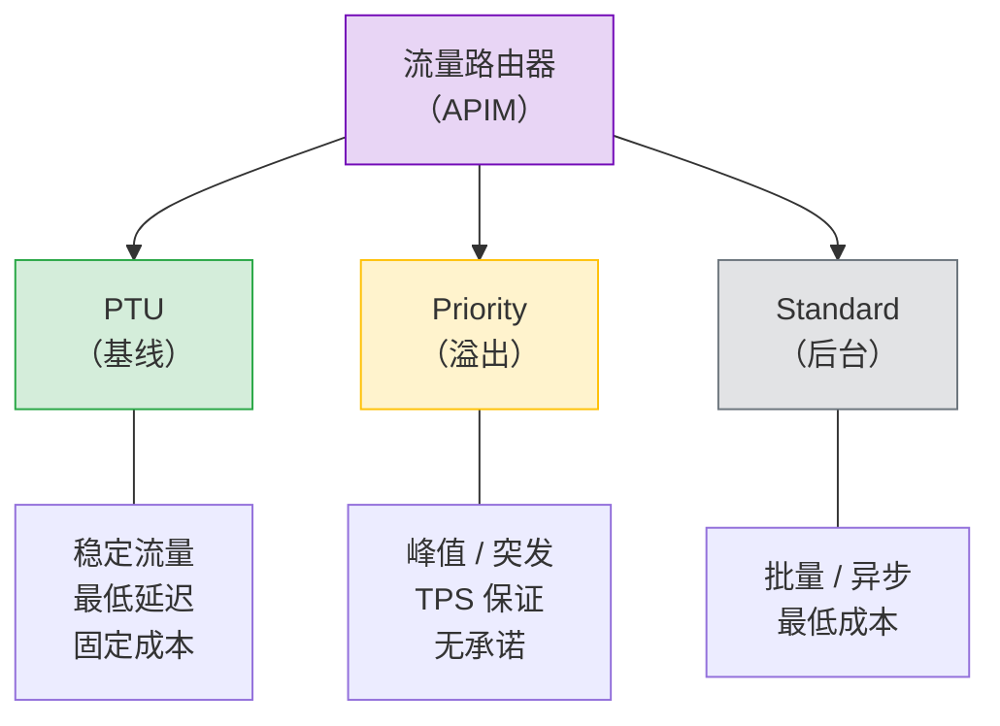

# Azure OpenAI Priority Processing：Standard vs Priority PAYGO 基准测试

**作者**：魏新宇 (Xinyu Wei) | **日期**：2026-04-05 | **模型**：gpt-5.4 (2026-03-05) | **区域**：swedencentral

## 摘要

[Priority Processing](https://learn.microsoft.com/en-us/azure/foundry/openai/concepts/priority-processing) 是 Azure OpenAI 的新功能（Preview），在 GlobalStandard/DataZoneStandard 部署上以 1.75 倍定价提供**有保证的 Token 生成速度**。

### 各指标收益条件（216 条记录，IQR 去噪）

| 指标 | 收益条件 | 幅度 | 原因 |
|---|---|:---:|---|
| **TTFT** | ✅ 始终有效（任意输入/输出长度） | **-6%，σ 减半**（81→34 ms） | Priority 获得更快的调度，与请求大小无关 |
| **TPS (tokens/s)** | ✅ 输出 ≥50 tokens | **+31–44%**（短输入），**+49–67%**（长输入） | Decode 阶段加速；输入越长收益越大 |
| **E2E 延迟** | ✅ 输出 ≥50 tokens | **-14–29%**（短输入），**-25–37%**（长输入） | E2E = TTFT + GenTime；GenTime 占比随输出增大 |
| **并发下 TTFT** | ✅ 并发请求 | **P95 -52%** | Priority 避免了 Standard 的队列尖峰 |
| **❌ 无收益** | 输出 ≤30 tokens | TPS ±2%，E2E -4.5% | GenTime 仅 ~97ms（占 E2E <7%）；加速 30% 也只省 ~29ms，被 TTFT 噪声淹没 |

### 为什么短输出无可测量的 TPS 收益



> Priority 只加速 **Decode（GenTime）**。当输出 ≤30 tokens 时，GenTime 仅 <100ms——即使加速 30% 也只省 ~29ms，小于 TTFT 测量噪声（σ=81ms）。收益存在但**在该尺度下无法测量**。

### 二维结果：输出长度 × 输入长度

| 输入 | 输出 | Std TPS | Pri TPS | **ΔTPS** | Std E2E | Pri E2E | **ΔE2E** |
|:---:|:---:|:---:|:---:|:---:|:---:|:---:|:---:|
| 短 | 50 | 34.9 | 48.4 | **+39%** | 2.6s | 2.2s | -18% |
| 短 | 200 | 42.7 | 58.4 | **+37%** | 5.8s | 4.6s | -21% |
| 短 | 500 | 45.1 | 60.9 | **+35%** | 11.9s | 9.4s | -21% |
| 短 | 1000 | 43.1 | 59.7 | **+39%** | 24.5s | 17.9s | -27% |
| **长** | **200** | 40.1 | 59.8 | **+49%** | 6.1s | 4.6s | **-25%** |
| **长** | **500** | 38.2 | 63.6 | **+67%** | 14.4s | 9.1s | **-37%** |

> **输入越长 → Priority 收益越大**：输出=500 时，短输入 ΔTPS=+35% vs 长输入 ΔTPS=**+67%**（+32pp）。Standard 的 TPS 在长上下文 Prefill 压力下下降；Priority 保持 TPS 保证不受输入长度影响。

### TTFT（每 Tier N=99，IQR 去噪）

| Tier | TTFT P50 | TTFT P95 | Mean±σ |
|---|:---:|:---:|:---:|
| Standard | 1296 ms | 1449 ms | 1300±81 ms |
| **Priority** | **1221 ms** | **1281 ms** | **1224±34 ms** |
| **差值** | **-75 ms (-5.8%)** | **-168 ms** | **σ 减半** |



---

## 1. Priority Processing 是什么？

Priority Processing 是一种按使用量付费的选项，提供**有保证的 Token 生成速度（TPS）**，无需 PTU 承诺。

| 维度 | Standard PAYGO | **Priority PAYGO** | PTU |
|--------|:---:|:---:|:---:|
| TPS 保证 | 尽力而为 | **99% > 50 TPS**（gpt-5.4） | 有保证 |
| 定价 | 基础费率 | **1.75 倍基础费率** | 固定月费 |
| 承诺 | 无 | **无** | 月度/年度 |
| TTFT 改善 | — | **约 6% + σ 减半** | 有 |
| 长上下文（>128K） | 正常 | 降级为 Standard | 正常 |

**支持的模型**（截至 2026-04）：

| 模型 | 延迟目标 | 区域 |
|---|:---:|---|
| gpt-5.4 (2026-03-05) | 99% > 50 TPS | polandcentral, southcentralus, swedencentral |
| gpt-5.2 (2025-12-11) | 99% > 50 TPS | 20+ 区域 |
| gpt-5.1 (2025-11-13) | 99% > 50 TPS | 20+ 区域 |
| gpt-4.1 (2025-04-14) | 99% > 80 TPS | 20+ 区域 |

> 来源：[Microsoft Learn — Priority Processing](https://learn.microsoft.com/en-us/azure/foundry/openai/concepts/priority-processing)

---

## 2. Priority 加速什么（不加速什么）



Priority 的核心收益是**更快的 Token 生成（Decode 阶段）**，而非更快的首 Token（Prefill 阶段）。E2E 改善随输出长度增加，因为 GenTime 在 E2E 中的占比增大。

| 组件 | Standard | Priority | 影响 |
|---|:---:|:---:|:---:|
| TTFT（Prefill） | 1296 ms | 1221 ms | -6%，σ 减半 |
| GenTime（Decode） | 取决于输出 | **+31~44% 更快** | 主要收益 |
| E2E（总和） | 取决于输出 | -14~29% | 随输出长度增加 |

### 实测 vs 微软 SLA 承诺

微软[文档](https://learn.microsoft.com/en-us/azure/foundry/openai/concepts/priority-processing)中 Priority Processing 的延迟目标为 gpt-5.4 **99% > 50 TPS**（P50，每 5 分钟窗口）。我们的实测验证了这一承诺：

| 输出 | Standard TPS P50 | ≥50? | Priority TPS P50 | ≥50? |
|:---:|:---:|:---:|:---:|:---:|
| ≤30 | 51.3 | ✅ | 50.2 | ✅ 踩线 |
| 50 | 38.2 | ❌ | 49.8 | ⚠️ 踩线 |
| 100 | 44.1 | ❌ | 60.2 | ✅ |
| 200 | 44.6 | ❌ | 59.8 | ✅ |
| 500 | 45.7 | ❌ | 63.1 | ✅ |
| 1000 | 43.6 | ❌ | 62.4 | ✅ |

> **Standard 在 6 个场景中有 5 个跌破 50 TPS**（38–46 TPS）。Priority 在全部 6 个场景达标或接近达标（50–63 TPS，50tok 为 49.8 踩线）。这正是 Priority Processing 的核心价值：提供 Standard 无法保证的 TPS 下限。

---

## 3. 何时使用 Priority Processing

| 场景 | 输出长度 | Priority ROI | 建议 |
|---|:---:|:---:|---|
| 内容生成（邮件、报告、代码） | 500-2000 tok | ✅✅✅ | **强烈推荐** — TPS +41%，E2E 节省 3-7 秒 |
| 流式聊天（用户观看输出） | 100-500 tok | ✅✅ | **推荐** — 感知速度更快 |
| 高并发突发 | 任意 >50 tok | ✅✅ | **推荐** — 负载下 TTFT P95 降低 52% |
| RAG 回答生成 | 100-300 tok | ✅ | **有限收益** — E2E 节省约 500ms |
| 意图分类/路由 | <30 tok | ❌ | **不推荐** — 零收益，75% 价格溢价 |

### 成本收益分析

Priority 定价为 Standard 的 1.75 倍。加速是否值得？

| 输出 | E2E 节省 | 成本溢价 | 是否值得？ |
|:---:|:---:|:---:|:---:|
| 50 tok | 0.3s | +75% | 仅延迟敏感场景 |
| 200 tok | 1.3s | +75% | 用户交互场景推荐 |
| 500 tok | 3.1s | +75% | **推荐** |
| 1000 tok | 7.1s | +75% | **强烈推荐** |

---

## 4. 并发负载性能

10 并发负载下（25 请求，输出=200）：

| 指标 | Standard | Priority | 差值 |
|---|:---:|:---:|:---:|
| TTFT P50 | 1452 ms | 1249 ms | -14% |
| **TTFT P95** | 3296 ms | **1590 ms** | **-52%** |
| E2E P50 | 5365 ms | 4227 ms | -21% |
| TPS P50 | 54.6 | 68.9 | +26% |
| 吞吐量 | 1.6 req/s | 1.9 req/s | +19% |

> Priority 在负载下的最大优势：**尾延迟控制** — TTFT P95 降低 52%。Standard 受队列突发影响；Priority 保持一致延迟。

---

## 5. 混合架构：PTU + Priority + Standard



| 流量类型 | 路由到 | 原因 |
|---|---|---|
| 稳定基线 | PTU | 最低延迟 + 固定成本 |
| 峰值溢出 | **Priority PAYGO** | TPS 有保证 + 无承诺 |
| 后台任务 | Standard PAYGO | 最低成本 |

---

## 6. 限制

- **区域可用性**：gpt-5.4 Priority 仅在 3 个区域可用（polandcentral、southcentralus、swedencentral）
- **Ramp Rate 限制**：15 分钟内 TPM 增幅超过 50% 可能触发降级
- **长上下文**：Prompt 超过 128K Token 自动降级
- **Mini/Nano 模型**：不支持（仅旗舰模型：gpt-5.4、gpt-5.2、gpt-5.1、gpt-4.1）
- **`service_tier` 响应字段**：`2025-04-01-preview` API 版本不返回此字段

---

## 7. 复现基准测试

### 前置条件

- Python 3.10+
- 在支持区域部署 gpt-5.4（GlobalStandard）的 Azure OpenAI 资源
- `httpx` 包

### 运行

```bash
pip install httpx
python scripts/benchmark_priority_processing.py \
  --endpoint https://YOUR_ENDPOINT.openai.azure.com \
  --api-key YOUR_API_KEY \
  --deployment YOUR_DEPLOYMENT_NAME \
  --iterations 8 --warmup 2
```

### 数据文件

| 文件 | 说明 |
|------|-------------|
| `data/benchmark_priority_multilength.json` | 6 种输出长度 × 8 轮 × 2 Tier（96 条记录） |
| `data/benchmark_priority_full_v3.json` | 6 场景 × 5 轮 × 2 Tier（60 条记录，短+长 Prompt） |

---

## 8. 测试方法论

- **模型**：gpt-5.4 (2026-03-05)，GlobalStandard 部署
- **区域**：swedencentral（Priority Processing 支持）
- **参数**：`reasoning_effort=none`、`stream=True`、`service_tier=default|priority`
- **执行**：Standard/Priority **交替执行**（消除时间偏差）
- **去噪**：IQR 1.5 倍四分位距异常值去除
- **指标**：TTFT、TPS（内容块 / 生成时间）、E2E
- **测试环境**：Windows VM（East Asia）→ swedencentral 部署
