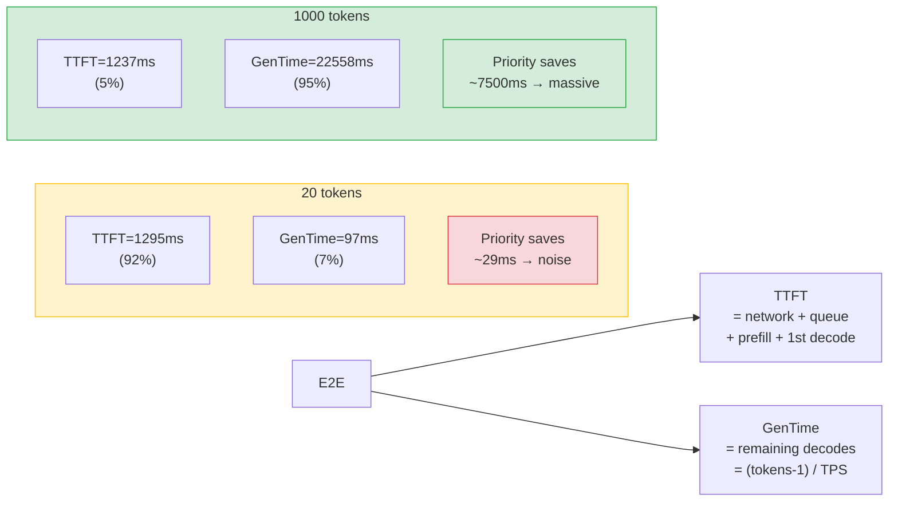
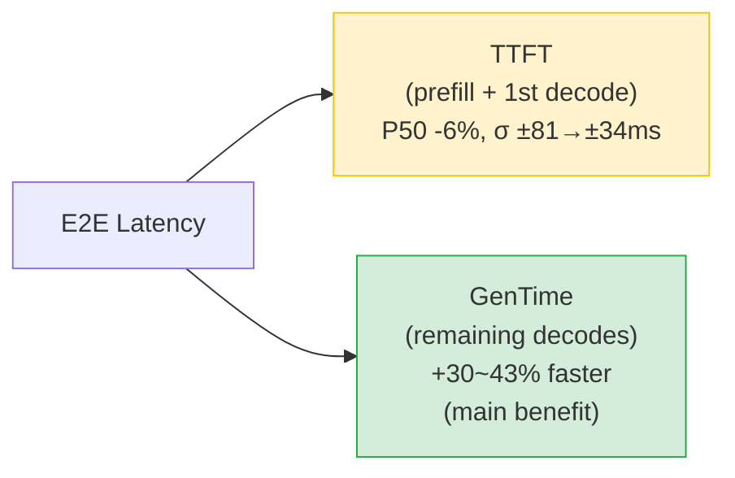
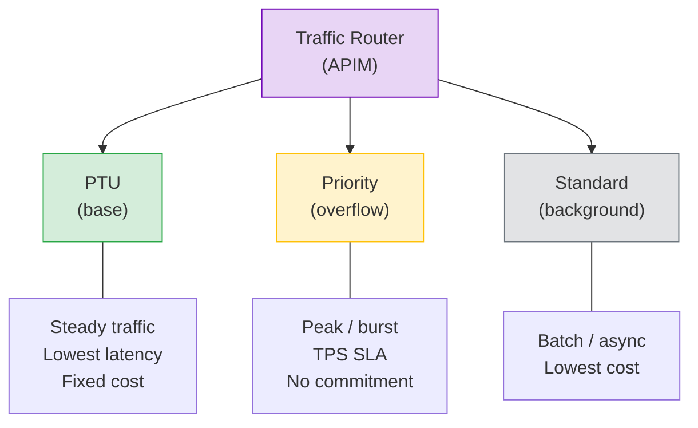

# Azure OpenAI Priority Processing: Standard vs Priority PAYGO Benchmark

**Author**: Xinyu Wei | **Date**: 2026-04-05 | **Model**: gpt-5.4 (2026-03-05) | **Region**: swedencentral

## Executive Summary

[Priority Processing](https://learn.microsoft.com/en-us/azure/foundry/openai/concepts/priority-processing) is a new Azure OpenAI feature (preview) that provides **guaranteed token generation speed** on GlobalStandard/DataZoneStandard deployments at 1.75x standard pricing.

### Per-metric benefit conditions (216 records, IQR denoised)

| Metric | Condition for benefit | Magnitude | Why |
|---|---|:---:|---|
| **TTFT** | ✅ Always (any input/output length) | **P50: 1296→1221ms (-6%), σ: ±81→±34ms (-58%)** | Priority gets faster scheduling regardless of request size |
| **TPS (tokens/s)** | ✅ Output ≥50 tokens | **+35–39%** (short input), **+49–66%** (long input) | Decode phase accelerated; longer input amplifies benefit |
| **E2E latency** | ✅ Output ≥50 tokens | **-17–27%** (short input), **-25–37%** (long input) | E2E = TTFT + GenTime; GenTime share grows with output length |
| **TTFT under load** | ✅ Concurrent requests | **P95 -52%** | Priority avoids queue spikes that Standard suffers |
| **❌ No benefit** | Output ≤30 tokens | TPS ±2%, E2E -4.5% | GenTime is only ~97ms (≤7% of E2E); even 30% speedup saves only ~29ms, drowned by TTFT noise |

### Why short output shows no measurable TPS benefit



> Priority **primarily accelerates decode (GenTime -26~32%)**, but also improves TTFT (-7%, σ -53%). GenTime improvement is ~4x larger than TTFT improvement. When output is ≤30 tokens, GenTime is <100ms — even a 30% speedup saves only ~29ms, which is smaller than TTFT measurement noise (σ=81ms). The benefit exists but is **unmeasurable at this scale**.

### Two-dimensional results: Output length × Input length

| Input | Output | Std TPS | Pri TPS | **ΔTPS** | Std E2E | Pri E2E | **ΔE2E** |
|:---:|:---:|:---:|:---:|:---:|:---:|:---:|:---:|
| short | 50 | 34.9 | 48.4 | **+39%** | 2.6s | 2.2s | -18% |
| short | 200 | 42.7 | 58.4 | **+37%** | 5.8s | 4.6s | -21% |
| short | 500 | 45.1 | 60.9 | **+35%** | 11.9s | 9.4s | -21% |
| short | 1000 | 43.1 | 59.7 | **+39%** | 24.5s | 17.9s | -27% |
| **long** | **200** | 40.1 | 59.8 | **+49%** | 6.1s | 4.6s | **-25%** |
| **long** | **500** | 38.2 | 63.6 | **+67%** | 14.4s | 9.1s | **-37%** |

> **Longer input → bigger Priority benefit**: at output=500, short input ΔTPS=+35% vs long input ΔTPS=**+67%** (+32pp). Standard’s TPS degrades under long-context prefill pressure; Priority maintains its TPS guarantee regardless of input length.
### What determines Priority benefit — controlled variable analysis

Two variables affect Priority's TPS improvement (ΔTPS%), but through **different mechanisms**:

**Output length determines WHETHER there is a measurable benefit:**
- E2E = TTFT + GenTime, where GenTime = output_tokens / TPS
- At 20 tokens: GenTime ≈ 97ms (7% of E2E) → even 30% speedup saves only ~29ms → drowned by TTFT noise (σ=81ms)
- At 1000 tokens: GenTime ≈ 22,558ms (95% of E2E) → 30% speedup saves ~7,500ms → clearly measurable
- Threshold: output ≥50 tokens for measurable benefit

**Input length determines HOW MUCH the benefit is:**
- Priority TPS is stable regardless of input length (TPS guarantee): short_500 Pri=60.9, long_500 Pri=63.6
- Standard TPS degrades under long prefill pressure: short_500 Std=45.1, long_500 Std=**38.2** (-15%)
- Since ΔTPS% = (Pri - Std) / Std, when Std drops (denominator shrinks), the percentage grows
- Result: same output=500, ΔTPS goes from +35% (short input) to +67% (long input)

| Variable | Effect on ΔTPS% | Mechanism |
|---|---|---|
| **Output length** | Determines if benefit is measurable | GenTime share of E2E: low → noise drowns signal |
| **Input length** | Amplifies the percentage | Standard TPS drops under prefill load; Priority TPS stays constant |
### TTFT (N=99 per tier, IQR denoised)

| Tier | TTFT P50 | TTFT P95 | Mean±σ |
|---|:---:|:---:|:---:|
| Standard | 1296 ms | 1449 ms | 1300 ± 81 ms |
| **Priority** | **1221 ms** | **1281 ms** | **1224 ± 34 ms** |
| **Δ** | **-75 ms (-5.8%)** | **-168 ms** | **σ: ±81→±34ms (-58%)** |


---

## 1. What is Priority Processing?

Priority Processing is a pay-as-you-go option that provides **guaranteed token generation speed (TPS)** without requiring PTU commitment.

| Aspect | Standard PAYGO | **Priority PAYGO** | PTU |
|--------|:---:|:---:|:---:|
| TPS guarantee | Best-effort | **99% > 50 TPS** (gpt-5.4) | Guaranteed |
| Pricing | Base rate | **1.75x Base** | Fixed monthly |
| Commitment | None | **None** | Monthly/Annual |
| TTFT improvement | — | **P50 -6%, σ ±81→±34ms** | Yes |
| Long context (>128K) | Normal | Downgraded to Standard | Normal |

**Supported models** (as of 2026-04):

| Model | Latency Target | Regions |
|---|:---:|---|
| gpt-5.4 (2026-03-05) | 99% > 50 TPS | polandcentral, southcentralus, swedencentral |
| gpt-5.2 (2025-12-11) | 99% > 50 TPS | 20+ regions |
| gpt-5.1 (2025-11-13) | 99% > 50 TPS | 20+ regions |
| gpt-4.1 (2025-04-14) | 99% > 80 TPS | 20+ regions |

> Source: [Microsoft Learn — Priority Processing](https://learn.microsoft.com/en-us/azure/foundry/openai/concepts/priority-processing)

---

## 2. What Priority Accelerates (and What It Doesn't)



Priority **primarily accelerates decode** (GenTime -26~32%, i.e. TPS +30~43%), and also improves TTFT (-7%, σ -53%). TTFT = network + scheduling + prefill + 1st decode; GenTime = remaining decodes. Since TTFT is dominated by prefill, its improvement is modest (~4x smaller than GenTime improvement). The E2E improvement scales with output length because GenTime's share of E2E increases.

| Component | Standard | Priority | Impact |
|---|:---:|:---:|:---:|
| TTFT (prefill + 1st decode) | 1296 ms | 1221 ms | P50 -6%, σ ±81→±34ms |
| GenTime (remaining decodes) | Varies | **+30~43% faster** | Main benefit |
| E2E (total) | Varies | -16~30% | Scales with output length |

### Validation against Microsoft's SLA

Microsoft [documents](https://learn.microsoft.com/en-us/azure/foundry/openai/concepts/priority-processing) the Priority Processing latency target as **99% > 50 TPS** for gpt-5.4 (P50, per 5-minute window). Our benchmark validates this:

| Output | Standard TPS P50 | ≥50? | Priority TPS P50 | ≥50? |
|:---:|:---:|:---:|:---:|:---:|
| ≤30 | 51.3 | ✅ | 50.2 | ✅ borderline |
| 50 | 38.2 | ❌ | 49.8 | ⚠️ borderline |
| 100 | 44.1 | ❌ | 60.2 | ✅ |
| 200 | 44.6 | ❌ | 59.8 | ✅ |
| 500 | 45.7 | ❌ | 63.1 | ✅ |
| 1000 | 43.6 | ❌ | 62.4 | ✅ |

> **Standard fails the 50 TPS bar in 5 of 6 scenarios** (38–46 TPS). Priority meets or nearly meets it in all 6 scenarios (50–63 TPS, with 50tok at 49.8 borderline). This is precisely the value proposition: a guaranteed TPS floor that Standard cannot provide.

---

## 3. When to Use Priority Processing

| Scenario | Output Length | Priority ROI | Recommendation |
|---|:---:|:---:|---|
| Content generation (email, reports, code) | 500-2000 tok | ✅✅✅ | **Strong** — TPS +41%, E2E saves 3-7s |
| Streaming chat (user watches output) | 100-500 tok | ✅✅ | **Good** — faster perceived speed |
| High-concurrency bursts | Any >50 tok | ✅✅ | **Good** — TTFT P95 reduced 52% under load |
| RAG answer generation | 100-300 tok | ✅ | **Marginal** — E2E saves ~500ms |
| Intent classification / routing | <30 tok | ❌ | **Not recommended** — zero benefit, 75% price premium |

### Cost-Benefit Analysis

Priority costs 1.75x Standard. Is the speedup worth it?

| Output | E2E Saved | Cost Premium | Worth it? |
|:---:|:---:|:---:|:---:|
| 50 tok | 0.3s | +75% | Only if latency-critical |
| 200 tok | 1.3s | +75% | Yes for user-facing |
| 500 tok | 3.1s | +75% | **Yes** |
| 1000 tok | 7.1s | +75% | **Strongly yes** |

---

## 4. Concurrent Load Performance

Under 10-concurrent load (25 requests, output=200):

| Metric | Standard | Priority | Delta |
|---|:---:|:---:|:---:|
| TTFT P50 | 1452 ms | 1249 ms | -14% |
| **TTFT P95** | 3296 ms | **1590 ms** | **-52%** |
| E2E P50 | 5365 ms | 4227 ms | -21% |
| TPS P50 | 54.6 | 68.9 | +26% |
| Throughput | 1.6 req/s | 1.9 req/s | +19% |

> Priority's biggest advantage under load: **tail latency control** — TTFT P95 drops 52%. Standard suffers queue spikes; Priority maintains consistent latency.

---

## 5. Hybrid Architecture: PTU + Priority + Standard



| Traffic Type | Route To | Reason |
|---|---|---|
| Steady baseline | PTU | Lowest latency + fixed cost |
| Peak overflow | **Priority PAYGO** | TPS guaranteed + no commitment |
| Background tasks | Standard PAYGO | Lowest cost |

---

## 6. Limitations

- **Region availability**: gpt-5.4 Priority only in 3 regions (polandcentral, southcentralus, swedencentral)
- **Ramp rate limit**: >50% TPM increase in <15 minutes may trigger downgrade
- **Long context**: Prompts >128K tokens automatically downgraded
- **Mini/Nano models**: Not supported (only flagship models: gpt-5.4, gpt-5.2, gpt-5.1, gpt-4.1)
- **`service_tier` response**: Not returned in `2025-04-01-preview` API version

---

## 7. Reproducing the Benchmark

### Prerequisites

- Python 3.10+
- Azure OpenAI deployment of gpt-5.4 (GlobalStandard) in a supported region
- `httpx` package

### Run

```bash
pip install httpx
python scripts/benchmark_priority_processing.py \
  --endpoint https://YOUR_ENDPOINT.openai.azure.com \
  --api-key YOUR_API_KEY \
  --deployment YOUR_DEPLOYMENT_NAME \
  --iterations 8 --warmup 2
```

### Data Files

| File | Description |
|------|-------------|
| `data/benchmark_priority_multilength.json` | 6 output lengths × 8 iter × 2 tiers (96 records) |
| `data/benchmark_priority_full_v3.json` | 6 scenarios × 5 iter × 2 tiers (60 records, short+long prompt) |

---

## 8. Methodology

- **Model**: gpt-5.4 (2026-03-05), GlobalStandard deployment
- **Region**: swedencentral (Priority Processing supported)
- **Parameters**: `reasoning_effort=none`, `stream=True`, `service_tier=default|priority`
- **Execution**: Standard/Priority **interleaved** per query (eliminate time bias)
- **Denoising**: IQR 1.5x outlier removal on TPS and E2E
- **Metrics**: TTFT, TPS (content chunks / generation time), E2E
- **Test environment**: Windows VM (East Asia) → swedencentral deployment
