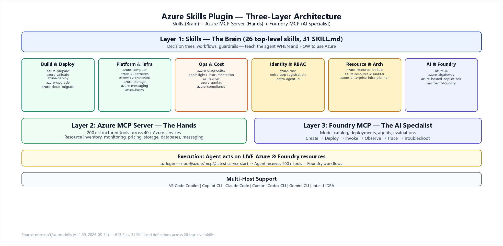
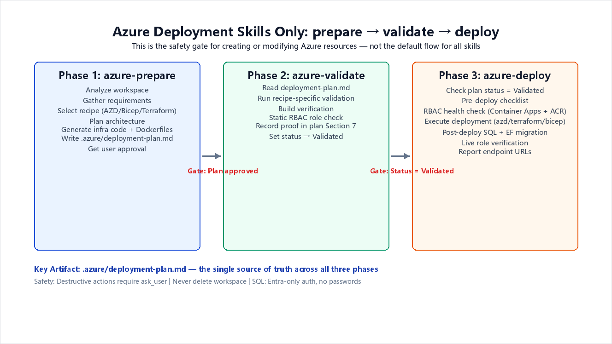
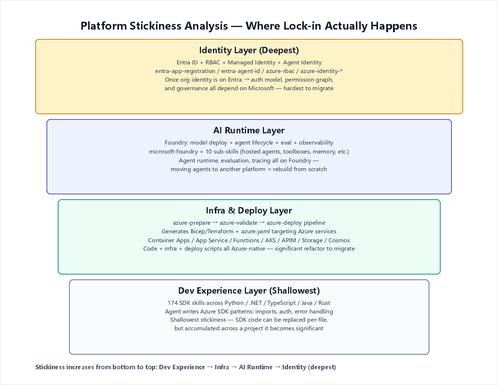

# Azure Agent Skills In Action

> A third-party engineering evaluation of Microsoft's Agent Skills ecosystem — covering architecture, real-world workflows, platform stickiness analysis, and a full hands-on run across every Azure MCP top-level tool.

This repository provides a comprehensive, independent assessment of two Microsoft repositories:

- **[microsoft/azure-skills](https://github.com/microsoft/azure-skills)** (v1.1.39) — The Azure Skills Plugin with 26 top-level skills, Azure MCP Server, and Foundry MCP.
- **[microsoft/skills](https://github.com/microsoft/skills)** — The Agent Skills monorepo with 174 skills across Python, .NET, TypeScript, Java, and Rust, plus plugins (deep-wiki, azure-skills), custom agents, prompts, and MCP configs.

The goal is not to repeat what the official README says. The goal is to save other engineers the time of running the whole stack themselves and answer the questions a real engineering team would ask before adopting these skills at scale:

1. **What is the real architecture?** — Not just the marketing pitch, but how the pieces actually connect.
2. **Does the deployment workflow actually work?** — The `prepare → validate → deploy` pipeline claims to be a hard gate system. We trace through it.
3. **Where does platform stickiness happen?** — Which skills, once adopted, make it harder to leave Microsoft's ecosystem?
4. **Did we actually run it?** — Yes. This repo includes a 63-tool Azure MCP run against a real Azure subscription, not just README inspection.
5. **What are the gaps?** — What requires specific resources, what has external prerequisites, and what should not be executed automatically?
6. **How should teams adopt this selectively?** — Not everything needs to be installed.

## Architecture Overview

The Azure Skills Plugin is not a prompt pack. It is a three-layer capability stack that turns a generic coding agent into an Azure-aware operator.

<div align="center"></div>

| Layer | Component | What It Does | Scale |
|:-----:|-----------|-------------|:-----:|
| **Brain** | 26 Azure Skills (31 SKILL.md files) | Decision trees, workflows, guardrails | 613 files |
| **Hands** | Azure MCP Server (`@azure/mcp@latest`) | 200+ structured tools across 40+ Azure services | Live Azure ops |
| **AI Specialist** | Foundry MCP (via Azure MCP `foundry` tool) | Model catalog, agent lifecycle, evaluations | Foundry-native |

**Key insight**: The "Foundry MCP" is not a separate MCP server in `.mcp.json`. It is exposed through the Azure MCP Server's `foundry` tool entry point. The `.mcp.json` across all plugin directories contains only one server:

```json
{
  "mcpServers": {
    "azure": {
      "command": "npx",
      "args": ["-y", "@azure/mcp@latest", "server", "start"]
    }
  }
}
```

Source: [.mcp.json](https://github.com/microsoft/azure-skills/blob/main/.mcp.json)

## Complete Skill Inventory

### Azure Skills Plugin (26 top-level skills)

Every skill in `microsoft/azure-skills` is listed below with its file count (a proxy for depth/complexity) and primary function.

| Category | Skill | Files | Function |
|----------|-------|:-----:|----------|
| **Build & Deploy** | `azure-prepare` | 164 | Analyze workspace, plan architecture, generate infra (Bicep/Terraform/AZD), write `deployment-plan.md` |
| | `azure-validate` | 17 | Pre-deployment validation: config, RBAC, managed identity, build verification |
| | `azure-deploy` | 41 | Execute deployment with error recovery (`azd up`, `terraform apply`, `az deployment`) |
| | `azure-upgrade` | 31 | Upgrade plans/tiers/SKUs, modernize Azure Java SDKs |
| | `azure-cloud-migrate` | 31 | Cross-cloud migration: AWS Lambda→Functions, Beanstalk→App Service, Fargate→Container Apps |
| **Platform & Infra** | `azure-compute` | 23 | VM recommendations, autoscale, connectivity troubleshooting |
| | `azure-kubernetes` | 11 | AKS cluster planning: Automatic vs Standard, networking, security |
| | `airunway-aks-setup` | 11 | AI Runway on AKS: GPU scheduling, model serving, inference setup |
| | `azure-storage` | 14 | Blob, File Share, Queue, Table, Data Lake; tier comparison and lifecycle |
| | `azure-messaging` | 1 | Event Hubs and Service Bus SDK troubleshooting |
| | `azure-kusto` | 1 | Azure Data Explorer / KQL queries |
| **Ops & Cost** | `azure-diagnostics` | 29 | Debug production issues: App Service, Container Apps, Functions, AKS, messaging |
| | `appinsights-instrumentation` | 13 | Add Application Insights telemetry to webapps |
| | `azure-cost` | 21 | Query costs, forecast spending, optimize waste, find orphaned resources |
| | `azure-quotas` | 3 | Check/manage quotas across Azure providers |
| | `azure-compliance` | 16 | Azure Quick Review (azqr), compliance scanning, resource graph audits |
| **Identity & RBAC** | `azure-rbac` | 1 | Find least-privilege RBAC roles, generate assignment CLI/Bicep |
| | `entra-app-registration` | 17 | Entra ID app registration, OAuth 2.0, MSAL integration |
| | `entra-agent-id` | 7 | Agent Identity Blueprints via Microsoft Graph for AI agent OAuth |
| **Resource & Architecture** | `azure-resource-lookup` | 2 | List/find Azure resources across subscriptions using Resource Graph |
| | `azure-resource-visualizer` | 4 | Generate Mermaid architecture diagrams from live Azure resource groups |
| | `azure-enterprise-infra-planner` | 35 | Design enterprise infra: landing zones, hub-spoke, multi-region DR, WAF alignment |
| **AI & Foundry** | `azure-ai` | 16 | Azure AI Search, Speech, OpenAI, Document Intelligence |
| | `azure-aigateway` | 9 | APIM as AI Gateway: semantic caching, token limits, content safety, load balancing |
| | `azure-hosted-copilot-sdk` | 6 | Build GitHub Copilot SDK apps on Azure |
| | `microsoft-foundry` | 89 | Foundry agent platform: model deploy, agent create/deploy/invoke/observe/trace/troubleshoot |

### microsoft/skills Monorepo (174 skills)

The broader `microsoft/skills` repo wraps `azure-skills` as a plugin and adds SDK-level skills organized by language:

| Language | Count | Key Categories |
|----------|:-----:|---------------|
| **Core** | 10 | Cloud Solution Architect, Copilot SDK, MCP Builder, Skill Creator, Frontend Design Review |
| **Foundry** | 11 | Router, Projects, Resources, Models, Hosted Agents, Toolboxes, Workflows, IQ Knowledge Bases, Memory, Observability, Governance |
| **Python** | 39 | Foundry AI (5), M365 (1), AI Services (8), Data & Storage (7), Messaging (4), Entra (2), Monitoring (4), Integration (5), Patterns (3) |
| **.NET** | 29 | Foundry AI (6), M365 (1), Data & Storage (6), Messaging (3), Entra (3), Compute & Integration (6), Monitoring (3) |
| **TypeScript** | 25 | Foundry AI (6), M365 (1), Data & Storage (5), Messaging (3), Entra & Integration (4), Monitoring & Frontend (5), Infrastructure (1) |
| **Java** | 26 | Foundry AI (7), Communication (5), Data & Storage (3), Messaging (3), Entra (3), Monitoring & Integration (5) |
| **Rust** | 7 | Entra (4), Data & Storage (2), Messaging (1) |

Source: [microsoft/skills README](https://github.com/microsoft/skills) — checked 2026-05-11.

## Deep Dive: The Deployment Workflow

The `azure-prepare → azure-validate → azure-deploy` pipeline is the most opinionated part of the skills ecosystem. It enforces a strict plan-first workflow with hard gates between phases.

<div align="center"></div>

### How It Works

**Phase 1: azure-prepare** (164 files — the largest skill by far)

1. **Mandatory first action**: Write `.azure/deployment-plan.md` skeleton to disk before any code generation.
2. Analyze workspace → Gather requirements → Select recipe (AZD/Bicep/Terraform) → Plan architecture.
3. Generate infrastructure code, Dockerfiles, `azure.yaml`.
4. Present plan to user → Get approval → Set status to `Ready for Validation`.
5. **Hard rule**: `azure-prepare` must NOT run any deployment commands. It only generates artifacts.

**Phase 2: azure-validate** (17 files)

1. Read `deployment-plan.md` — if missing, STOP and invoke `azure-prepare`.
2. Run recipe-specific validation (e.g., `azd provision --preview`, `bicep build`, `terraform validate`).
3. Build verification — compile/build the project.
4. Static RBAC role verification — check Bicep/Terraform for correct role assignments.
5. Record proof in Section 7 of `deployment-plan.md`.
6. **Only azure-validate is authorized to set status to `Validated`**. azure-deploy is forbidden from doing this.

**Phase 3: azure-deploy** (41 files)

1. Check plan status = `Validated` AND Validation Proof section is populated.
2. Pre-deploy checklist (Container Apps + ACR RBAC health check).
3. Execute deployment with built-in error recovery.
4. Post-deploy: SQL managed identity + EF migrations.
5. Live RBAC verification.
6. Report endpoint URLs with `https://` scheme.

### What Makes This Design Strong

- **The plan file is the single source of truth**. All three skills read and write to `.azure/deployment-plan.md`. This prevents state drift between phases.
- **Validation proof is mandatory**. The validate skill must record what commands it ran and their results. Deploy checks this section is not empty.
- **Destructive actions require explicit user approval** via `ask_user` tool.
- **SQL Server**: NEVER generate `administratorLogin` or `administratorLoginPassword`. Always use Entra-only auth unconditionally.
- **Specialized routing**: If the user mentions copilot SDK, Azure Functions, APIM, or durable workflows, azure-prepare routes to the dedicated skill first.

### What to Watch Out For

- The 164-file `azure-prepare` skill is extremely comprehensive but also very prescriptive. Teams with existing deployment pipelines may find it conflicts with their workflows.
- The `@azure/mcp@latest` version is not pinned. For reproducibility in production, consider pinning to a specific version.
- The mandatory plan file approach adds overhead for simple one-off deployments. It is optimized for non-trivial, multi-service Azure deployments.

## Deep Dive: Foundry Agent Lifecycle

The `microsoft-foundry` skill (89 files) covers the complete AI agent development lifecycle:

| Phase | Sub-Skill | What It Does |
|-------|-----------|-------------|
| **Create** | `foundry-agent/create` | New agent app with Microsoft Agent Framework, LangGraph, or custom framework (Python/C#) |
| **Deploy** | `foundry-agent/deploy` | Containerize → ACR push → Create/update hosted agent deployment |
| **Invoke** | `foundry-agent/invoke` | Send messages to agents, single or multi-turn conversations |
| **Observe** | `foundry-agent/observe` | Batch evals, prompt optimization, regression detection, CI/CD monitoring |
| **Trace** | `foundry-agent/trace` | Query App Insights `customEvents`, correlate eval results to responses |
| **Troubleshoot** | `foundry-agent/troubleshoot` | View hosted agent logs, query telemetry, diagnose failures |
| **FAOS Optimize** | `foundry-agent/faos-optimize` | Convert existing code to FAOS optimization-ready version |
| **Eval Datasets** | `foundry-agent/eval-datasets` | Harvest production traces into evaluation datasets, version management |

The workspace standard requires a `.foundry/` directory:

```
<agent-root>/
  .foundry/
    agent-metadata.yaml
    agent-metadata.prod.yaml
    datasets/
    evaluators/
    results/
```

**Key design choice**: Foundry skills use Azure MCP's `foundry` tool as the primary entry point. SDK fallback (`azure-ai-projects`) is only used when MCP tools are unavailable.

### Foundry Skills: azure-skills vs microsoft/skills

The `microsoft-foundry` skill in `azure-skills` (89 files) is a monolithic orchestrator. The broader `microsoft/skills` repo restructured these into 11 focused, language-agnostic sub-skills:

| microsoft/skills Sub-Skill | Maps to azure-skills | New Capability |
|---------------------------|---------------------|----------------|
| `foundry-projects-resources` | `microsoft-foundry` project/create + resource/create | Dedicated project provisioning |
| `foundry-models` | `microsoft-foundry` models/deploy-model | Model discovery, PTU vs pay-as-you-go |
| `foundry-hosted-agents` | `microsoft-foundry` foundry-agent/deploy | Container-based agent management |
| `foundry-toolboxes` | New | MCP-compatible tool bundles (preview) |
| `foundry-iq-knowledge-bases` | New | Agentic retrieval pipeline (preview) |
| `foundry-workflows` | New | Multi-agent orchestration |
| `foundry-managed-skills` | New | SKILL.md as Foundry-side resource (preview) |
| `foundry-memory` | New | Long-term agent memory (preview) |
| `foundry-observability` | `microsoft-foundry` foundry-agent/observe + trace | OpenTelemetry traces in App Insights |
| `foundry-governance` | New | Fleet governance, RAI policies, tool catalog |

If you are building Foundry agents, the `microsoft/skills` Foundry sub-skills provide more granular control than the monolithic `microsoft-foundry` in `azure-skills`.

## Deep Dive: Cost Management

The `azure-cost` skill (21 files) is split into three sub-workflows:

| Sub-Workflow | Reference File | Purpose |
|-------------|---------------|---------|
| **Cost Query** | `cost-query/workflow.md` | Query historical costs via Cost Management REST API |
| **Cost Optimization** | `cost-optimization/workflow.md` | Find orphaned resources, rightsize VMs, Redis/AKS analysis |
| **Cost Forecast** | `cost-forecast/workflow.md` | Project future spending with forecast API |

**Enforced rules**:
- Always query actual costs first — never estimate or assume.
- Always present total bill alongside optimization recommendations.
- Use REST API (`az rest`) for cost queries, not `az costmanagement query`.
- Include `ClientType: GitHubCopilotForAzure` header on all Cost Management API requests.
- On 429 responses, wait for the longest `x-ms-ratelimit-microsoft.costmanagement-*-retry-after` header value.

## Deep Dive: Identity Layer

The identity-related skills create the deepest platform stickiness:

| Skill | Scope | Key Capability |
|-------|-------|---------------|
| `azure-rbac` | Role assignments | Find least-privilege roles, generate CLI/Bicep for assignment |
| `entra-app-registration` | App identity | OAuth 2.0 flows, MSAL, Microsoft Graph permissions, Bicep app registration |
| `entra-agent-id` | Agent identity | Agent Identity Blueprints via Graph API, OAuth token exchange (fmi_path, OBO, cross-tenant), AgentID sidecar |

Once an organization's identity model is built on Entra ID with Managed Identity + RBAC + Agent Identity, migrating to another cloud's identity system requires rebuilding the entire permission graph, not just changing SDK imports.

## Platform Stickiness Analysis

Not all stickiness is equal. Here is a four-layer model, from shallowest to deepest:

<div align="center"></div>

| Layer | Stickiness | Migration Effort | What Gets Locked In |
|:-----:|:----------:|:----------------:|-------------------|
| **Dev Experience** | Low | Per-file SDK replacement | Azure SDK import patterns, auth patterns, error handling |
| **Infra & Deploy** | Medium | Rewrite IaC + deploy pipeline | Bicep/Terraform targeting Azure services, azure.yaml, Container Apps/Functions config |
| **AI Runtime** | High | Rebuild from scratch | Foundry agent runtime, eval pipelines, observability, toolboxes, memory |
| **Identity** | Very High | Rebuild org permission graph | Entra ID, RBAC assignments, Managed Identity, Agent Identity, Graph API permissions |

**The stickiness chain**: Azure SDK skills → azure-prepare/validate/deploy → Entra/RBAC → Monitor/App Insights → Foundry agent lifecycle → M365/Teams/Copilot Studio.

Once this full chain is in place, Microsoft becomes the **development, deployment, identity, AI, observability, governance, and collaboration platform** — not just a cloud resource provider.

## What Is NOT Covered

These skills focus on Azure cloud development and AI agent workflows. The following are explicitly out of scope:

| Category | Status | Notes |
|----------|:------:|-------|
| **Office/Word/Excel automation** | Not covered | No DOCX generation, editing, formatting, or Track Changes skills |
| **Non-Azure clouds** | Not covered | `azure-cloud-migrate` helps migrate TO Azure, not FROM Azure |
| **Mobile development** | Not covered | No iOS/Android/React Native skills |
| **Frontend frameworks** | Partially | `frontend-design-review` exists in Core skills, but no React/Vue/Angular SDK skills |
| **Database administration** | Partially | Cosmos DB and SQL are covered for deployment/RBAC, not for query optimization or schema design |
| **Networking deep-dive** | Partially | `azure-enterprise-infra-planner` covers VNets/NSGs/firewalls at architecture level, not packet-level troubleshooting |

The `m365-agents-py/dotnet/ts` skills in `microsoft/skills` are for building **agents on M365/Teams/Copilot Studio**, not for Office document manipulation.

The `azure-ai-translation-document-py` skill can translate Word/PDF/Excel files with format preservation, but this is a translation service, not a document automation tool.

## Installation and Verification

### Quick Install (APM — recommended)

```bash
apm install microsoft/azure-skills
```

### VS Code

Install the [Azure MCP Extension](https://marketplace.visualstudio.com/items?itemName=ms-azuretools.vscode-azure-mcp-server) — it automatically installs the companion skills extension.

### Copilot CLI

```bash
/plugin marketplace add microsoft/azure-skills
/plugin install azure@azure-skills
```

### Claude Code

```bash
/plugin install azure@claude-plugins-official
```

### Verification (three checks)

1. **Skills layer**: Ask "What Azure services would I need to deploy this project?" → expect structured Azure guidance.
2. **Azure MCP**: Ask "List my Azure resource groups." → expect real tool-backed response from your Azure account.
3. **Foundry MCP**: Ask "What AI models are available in Microsoft Foundry?" → expect Foundry-backed response.

### Prerequisites

- Azure account + subscription
- Node.js 18+ (`npx` required)
- Azure CLI (`az login`)
- Azure Developer CLI (`azd auth login`) for deployment workflows

## Best Practices for Selective Adoption

> **"Loading all skills causes context rot: diluted attention, wasted tokens, conflated patterns."**
> — microsoft/skills README

Not every team needs every skill. Here is a decision guide:

| If Your Team Needs... | Install These Skills | Skip These |
|----------------------|---------------------|-----------|
| Deploy apps to Azure | `azure-prepare`, `azure-validate`, `azure-deploy` | Foundry skills (unless building AI agents) |
| Build AI agents on Foundry | `microsoft-foundry` + Foundry sub-skills | `azure-cloud-migrate`, `azure-upgrade` |
| Manage costs and compliance | `azure-cost`, `azure-compliance`, `azure-quotas` | `azure-kubernetes`, `airunway-aks-setup` |
| Enterprise infrastructure | `azure-enterprise-infra-planner`, `azure-compute` | SDK-level skills (Python/Java/etc.) |
| Identity and security | `azure-rbac`, `entra-app-registration`, `entra-agent-id` | `azure-ai`, `azure-aigateway` |
| Troubleshoot production issues | `azure-diagnostics`, `appinsights-instrumentation` | `azure-hosted-copilot-sdk` |

## Hands-On Evaluation: Running the Azure MCP Server

All claims in this repository are verified by actually running the Azure MCP Server (`@azure/mcp@latest`) and calling its tools via JSON-RPC. The test scripts are in `scripts/` and raw output is in `evaluation/results/`.

### Environment

| Component | Version |
|-----------|--------|
| Node.js | v22.22.2 |
| npx | 10.9.7 |
| Azure CLI | logged in (AI GBB - AI Infra subscription) |
| Azure MCP | `@azure/mcp@latest` (auto-downloaded via npx) |
| Platform | Ubuntu 24.04 on Azure VM |

### Test 1: How Many Tools Does the MCP Server Actually Expose?

The README says "200+ structured tools across 40+ Azure services." We called `tools/list` and counted:

> **Result: 63 top-level tools** (not 200+).

Each top-level tool (e.g., `foundry`, `compute`, `storage`) is a **composite tool** that exposes multiple sub-commands via the `learn` mechanism. For example, `foundry learn` returned **51,578 characters** of JSON describing dozens of sub-commands (model deployment, evaluation, prompt optimization, connections, etc.). So "200+" refers to the total of sub-commands across all 63 top-level tools — not 200 discrete tools in `tools/list`.

**Actual tool list (63 tools)**:

```
acr, advisor, aks, appconfig, applens, applicationinsights, appservice,
azd, azurebackup, azuremigrate, azureterraform, azureterraformbestpractices,
bicepschema, cloudarchitect, communication, compute, confidentialledger,
containerapps, cosmos, datadog, deploy, deviceregistry, documentation,
eventgrid, eventhubs, extension_azqr, extension_cli_generate, extension_cli_install,
fileshares, foundry, foundryextensions, functionapp, functions,
get_azure_bestpractices, grafana, group_list, group_resource_list,
keyvault, kusto, loadtesting, managedlustre, marketplace, monitor,
mysql, policy, postgres, pricing, quota, redis, resourcehealth, role,
search, servicebus, servicefabric, signalr, speech, sql, storage,
storagesync, subscription_list, virtualdesktop,
wellarchitectedframework, workbooks
```

Source: `scripts/test_mcp_tools.js` → `evaluation/results/mcp_test_results.txt`

### Test 2: subscription_list — Does It Read Real Azure Data?

```
>>> Calling subscription_list

Result: {"status":200, "subscriptions":[
  {"displayName":"AI GBB - AI Services", "state":"Enabled"},
  {"displayName":"AI GBB - AI Infra", "state":"Enabled"},
  {"displayName":"GBB-Pulse", "state":"Enabled"}
]}
```

**Verdict**: Real Azure data returned in < 1 second. The MCP server uses the local `az login` credential.

### Test 3: group_list — Resource Group Inventory

Calling `group_list` with subscription ID returned **40+ resource groups** with real names and locations (eastus2, southafricanorth, etc.). This confirms the server can enumerate Azure resources across regions.

Source: `evaluation/results/mcp_test_v3.txt`

### Test 4: foundry learn — What Foundry Sub-Commands Are Available?

Calling `foundry` with `{"command": "learn"}` returned a 51KB JSON array listing all available Foundry sub-commands:

| Sub-Command | Purpose |
|-------------|--------|
| `model_monitoring_metrics_get` | Get monitoring metrics for model deployments |
| `model_similar_models_get` | Find similar models |
| `prompt_optimize` | Optimize prompts using Azure OpenAI Prompt Optimizer |
| `evaluation_agent_batch_eval_create` | Create batch evaluation for agents |
| `project_connection_delete` | Delete project connections |
| ... and many more | |

**Key finding**: The `foundry` tool is a **gateway tool**. You call it with `{"command": "learn"}` to discover sub-commands, then call it again with the selected `command` plus that command's arguments. This is why `.mcp.json` only lists one `azure` server but the README claims "Foundry MCP" as a separate layer — it is a logical layer within the `azure` server.

Source: `evaluation/results/mcp_test_v3.txt`

### Test 5: compute learn — VM Management Sub-Commands

Calling `compute` with `{"command": "learn"}` returned a 42KB JSON array with sub-commands:

- `compute_vm_get` — List/get VM details (name, size, state, OS)
- `compute_vm_create` — Create VMs (equivalent to `az vm create`)
- `compute_vm_resize` — Resize VMs
- `compute_vmss_*` — Virtual Machine Scale Set operations

Source: `evaluation/results/mcp_foundry_results.txt`

### Test 6: Tool Naming Convention Discovery

The skill SKILL.md files reference tools with `mcp_azure_mcp_` prefix (e.g., `mcp_azure_mcp_subscription_list`). But when calling the server directly via JSON-RPC, tool names have **no prefix** — just `subscription_list`, `group_list`, `foundry`, etc. The `mcp_azure_mcp_` prefix is added by the host (VS Code, Copilot CLI) during tool registration.

### Summary of Hands-On Findings

| Claim | Verified? | Actual Result |
|-------|:---------:|---------------|
| 200+ structured tools | Partially | 63 top-level tools, each with multiple sub-commands |
| Live Azure operations | ✅ | subscription_list and group_list return real data in < 1s |
| Foundry MCP as separate layer | Clarified | Logical layer within `azure` server, accessed via `foundry` gateway tool |
| az login credential | ✅ | Server uses local Azure CLI session |
| Tool naming in SKILL.md | Clarified | `mcp_azure_mcp_` prefix added by host, not the server |
| Compute VM listing | ✅ | `compute_vm_get` returned real VM: `gok-h100-post-training` (Standard_D2ads_v5, southafricanorth) |
| RBAC enforcement | ✅ | `group_resource_list` returned 403 for subscription without Reader role — MCP server fully respects Azure RBAC |

### Key Architecture Discovery: Two Classes of Tools

Through trial-and-error testing, we discovered the MCP server has **two distinct tool types** with different parameter passing conventions:

| Tool Type | Examples | Parameter Style |
|-----------|---------|----------------|
| **Simple tools** | `subscription_list`, `group_list`, `group_resource_list` | Flat key-value in `arguments` |
| **Composite tools** | `compute`, `foundry`, `pricing`, `quota`, `role`, `monitor` | Use `command` plus flat command arguments in `arguments` |

For composite tools, you must:
1. Call with `{"command": "learn"}` to discover available sub-commands
2. Call with `{"command": "<sub_command>", ...requiredArguments}` to execute

This two-step learn-then-execute pattern is **not documented in the README**. The full run in this repo verifies the direct JSON-RPC convention against live Azure data.

The test scripts and raw output files are in `scripts/` and `evaluation/results/`.

## Full Run: All 63 Azure MCP Top-Level Tools

This is the central evidence in this repository. On 2026-05-12, we ran `scripts/run_full_value_evaluation.js` against a real Azure subscription with Owner permission. The script discovered every Azure MCP top-level tool, called `learn` where needed, selected a safe read-only command, executed what could safely be executed, and wrote the raw results to `evaluation/results/`.

### Test Environment

| Component | Value |
|-----------|-------|
| Subscription | `08f95cfd-...` (ME-MngEnv183724-xinyuwei-1) |
| Permission | Owner |
| Resource Groups | 30+ |
| VMs | 8 |
| Cognitive Services accounts | 19 |
| Log Analytics workspaces | 20 |
| Storage accounts | 10 |
| ML workspaces | 8 |
| Test script | `scripts/run_full_value_evaluation.js` |
| Raw JSON | `evaluation/results/full_value_evaluation.json` |
| Matrix CSV | `evaluation/results/full_value_matrix.csv` |
| Markdown report | `evaluation/results/full_value_summary.md` |

### Result Summary

| Result | Count | Meaning |
|--------|------:|---------|
| **EXECUTED** | **45** | A safe read-only command returned live Azure data, an empty live result, or command guidance from the MCP server. |
| **SCHEMA_VERIFIED** | **9** | The tool exposed a valid command schema, but safe execution required a resource-specific input not available in this harness. |
| **TOOL_ERROR** | **5** | The tool was callable but returned a service/tooling error. These are recorded as product/prerequisite findings, not hidden. |
| **BLOCKED_UNSAFE** | **2** | The only relevant command had side effects, so the harness intentionally did not execute it. |
| **FAILED** | **2** | The harness could not obtain a useful runtime result for this tool. |

**Coverage interpretation**: 63/63 top-level tools were probed. 45/63 were executed successfully. 54/63 produced either live execution evidence or a verified command schema. The remaining cases are documented with the exact blocker.

### High-Signal Wins From the Run

| Capability | Tools Executed | What This Proves |
|------------|----------------|------------------|
| Live subscription and resource inventory | `subscription_list`, `group_list`, `group_resource_list` | The MCP server reads real Azure state through the current Azure CLI login. |
| Compute and app platform discovery | `compute_vm_get`, `aks_cluster_get`, `containerapps_list`, `appservice_webapp_get`, `functionapp_get` | A coding agent can inspect runtime infrastructure without hand-writing `az` queries. |
| Cost, quota, and pricing | `quota_usage_check`, `pricing_get`, `advisor_recommendation_list` | The skills reduce high-friction API research around quota, pricing, and optimization. |
| IaC and architecture assistance | `bicepschema_get`, `azureterraform_azurerm_get`, `azureterraformbestpractices_get`, `cloudarchitect_design` | The agent can fetch concrete Bicep/Terraform schemas and architecture guidance on demand. |
| Governance and identity | `role_assignment_list`, `policy_assignment_list`, `resourcehealth_availability-status_get` | The execution layer can surface RBAC, policy, and health data as structured evidence. |
| Azure service discovery | `storage_account_get`, `cosmos_list`, `sql_server_get`, `redis_list`, `search_service_list` | The same harness can sweep many Azure service families with one consistent calling pattern. |
| Developer workflow help | `functions_language_list`, `get_azure_bestpractices_get`, `wellarchitectedframework_serviceguide_get`, `extension_cli_generate` | The system is not just inventory; it returns actionable development guidance. |

### What Did Not Fully Execute, and Why

| Category | Tools | Reason |
|----------|-------|--------|
| Requires a specific resource instance | `keyvault`, `servicebus`, `servicefabric`, `speech`, `foundryextensions`, `confidentialledger`, `datadog`, `mysql`, `deploy` | The tool schema is valid, but safe execution needs a vault, queue, speech file, endpoint, cluster, ledger transaction, Datadog resource, MySQL user, or local azd workspace. |
| Intentionally not executed | `communication`, `azuremigrate` | The selected commands could send messages or guide environment-changing migration actions. The harness records the schema instead of causing side effects. |
| Product/prerequisite issue | `extension_azqr`, `loadtesting`, `marketplace`, `applens`, `foundry` | The server returned a runtime error or a missing prerequisite. Example: `extension_azqr` requires the `azqr` executable in PATH. |
| Harness failure | `applicationinsights`, `extension_cli_install` | These still need a better test case or parameter set. They remain visible in the matrix. |

### Calling Convention Verified

The full run also corrected an important direct-JSON-RPC detail: for composite tools, direct calls to the Azure MCP server worked with **flat arguments** plus `command`:

```js
send("compute", {
  command: "compute_vm_get",
  subscription: SUB,
  "resource-group": "winvm"
});
```

This is different from the host-facing `mcp_azure_mcp_*` naming convention in SKILL.md files. The prefix is added by the agent host; the raw server exposes names such as `compute`, `quota`, `pricing`, `subscription_list`, and `group_list`.

## Skills vs No-Skills: What the Run Proves

The most important question for any team adopting these skills is not "can MCP call Azure?" It is: **what do you gain over plain `az` CLI plus a generic LLM?**

### Concrete Comparison Examples

#### Example 1: List Subscriptions — Both Work, MCP Is Structured

**Without skills (az CLI)**:
```bash
$ time az account list --query "[].{name:name,id:id}" -o table
ME-MngEnv183724-xinyuwei-1
AI GBB - AI Services
AI GBB - AI Infra
GBB-Pulse
real    0m0.949s
```

**With skills (MCP `subscription_list`)**:
```json
{"status":200,"results":{"subscriptions":[
  {"subscriptionId":"08f95cfd-...","displayName":"ME-MngEnv183724-xinyuwei-1","state":"Enabled","tenantId":"9812d5f8-..."}
]}}
```

**Verdict**: Same speed, but MCP returns structured JSON ready for LLM consumption.

#### Example 2: Quota Check — MCP Wins in Complexity

**Without skills (manual REST API)**:
```bash
$ az rest --method GET --url "https://management.azure.com/subscriptions/$SUB/providers/Microsoft.Quota/usages?api-version=2023-02-01&\$filter=location%20eq%20'eastus'"
ERROR: Bad Request — must research correct API path, version, and filter syntax
```

**With skills (MCP `quota_usage_check`)**:
```js
exec("quota", "quota_usage_check", {
  subscription: SUB,
  region: "eastus",
  "resource-types": "Microsoft.CognitiveServices/accounts"
})
// → 18KB JSON: TPM/PTU quotas for every model (gpt-4o, gpt-4o-mini, o1, o3, etc.)
```

**Verdict**: MCP saves 30+ minutes of API research. The skill knows the right API, version, filter format, and resource type names.

#### Example 3: Generate az CLI from Natural Language — MCP unique capability

**Without skills**: Must remember `az vm list --query "[?powerState=='deallocated']"` syntax and JMESPath filters.

**With skills (MCP `extension_cli_generate`)**:
```js
send("extension_cli_generate", {
  intent: "find all VMs that have been deallocated for more than 30 days in subscription " + SUB,
  "cli-type": "az"
})
```

**Returns**:
```json
{
  "scenario": "Find all VMs that have been deallocated for more than 30 days...",
  "description": "List all virtual machines in the specified subscription that are in a deallocated state and filter them based on the deallocation duration.",
  "commandSet": [{
    "reason": "List all VMs in the subscription and filter for those that are deallocated.",
    "example": "az vm list --subscription 08f95cfd-... --query '[?powerState==`deallocated`]'",
    "command": "az vm list",
    "arguments": ["--subscription", "--query"]
  }]
}
```

**Verdict**: This is impossible without skills — you'd need an LLM with Azure CLI knowledge or to read docs.

### When Skills Help vs When They Do Not

From the 63-tool full run:

| Skill Wins When... | Skills Don't Help When... |
|--------------------|---------------------------|
| Calling complex APIs (quota, pricing, Resource Graph) | Simple resource listing (`az group list` is fine) |
| Need natural-language → CLI translation | You already know the exact CLI command |
| Need structured JSON for downstream LLM processing | Just want human-readable table output |
| Need cross-service architecture recommendations | Just need single-service info |
| Want guardrails (e.g., "always check actual cost first") | Want full control over every parameter |

Full test scripts and raw outputs are in `scripts/run_full_value_evaluation.js`, `evaluation/results/full_value_evaluation.json`, `evaluation/results/full_value_matrix.csv`, `evaluation/results/full_value_summary.md`, and `evaluation/cli_baseline/`.

## Slide Deck

A 12-slide executive deck summarizing this evaluation is in [`slides/Azure-Agent-Skills-In-Action.pptx`](slides/Azure-Agent-Skills-In-Action.pptx). The deck is generated from the same evidence shown above and covers: test environment, headline result (45/9/5/2/2), high-signal wins, blockers explained, calling convention, skills vs `az` CLI, architecture, platform stickiness, and deliverables. The generator script [`slides/gen_azure_skills_ppt.py`](slides/gen_azure_skills_ppt.py) lets you regenerate the deck after re-running the harness.

## microsoft/skills — Skill Verification Matrix

Beyond the Azure MCP execution layer, we verified 11 skills from [microsoft/skills](https://github.com/microsoft/skills) by **using each skill to produce a real deliverable**. Each skill was loaded as agent context and applied to a concrete task. The deliverables are in `skill-demos/`.

| Skill | Task | Deliverable | Location |
|-------|------|-------------|----------|
| **presenter** (slides) | Generate evaluation summary deck | 12-slide PPTX | `slides/` |
| **cloud-solution-architect** | Design a RAG Agent architecture (7-step WAF review) | Architecture document with ADRs | `skill-demos/cloud-solution-architect/` |
| **github-issue-creator** | Convert raw error logs into structured issues | 3 GitHub-format issues | `skill-demos/github-issue-creator/` |
| **mcp-builder** | Build an MCP server exposing evaluation data | Python FastMCP server (5 tools) | `skill-demos/mcp-builder/` |
| **frontend-design-review** | Audit our Foundry Demo dashboard | 5-pillar review (scored 5.7/10) | `skill-demos/frontend-design-review/` |
| **skill-creator** | Create a new SKILL.md for MCP evaluation | Complete SKILL.md with frontmatter | `skill-demos/skill-creator/` |
| **foundry-hosted-agents** | Deploy containerized agent via azd | Deployment evidence + code patterns | `skill-demos/foundry-hosted-agents/` |
| **foundry-models** | Deploy gpt-4.1-mini on Foundry | Model deployment + MCP verification | `skill-demos/foundry-models/` |
| **foundry-toolboxes** | Configure Toolbox with 3 MCP tools | Toolbox config + live endpoint | `skill-demos/foundry-toolboxes/` |
| **foundry-memory** | Integrate cross-session agent memory | FoundryMemoryProvider integration | `skill-demos/foundry-memory/` |
| **copilot-sdk** | Build multi-agent demo app | FastAPI app with Responses protocol | `skill-demos/copilot-sdk/` |

### Skill 1: cloud-solution-architect — RAG Agent Architecture

The skill's **7-step Architecture Review Workflow** was applied to design a production RAG Agent system. Key outputs:

**Technology stack selected** (Step 3):

| Area | Choice | Rationale |
|------|--------|-----------|
| Compute (web) | Azure Container Apps | Auto-scale to zero, simpler than AKS |
| Compute (worker) | Azure Functions | Event-triggered document processing |
| AI orchestration | Azure AI Foundry (gpt-4.1-mini) | Managed LLM, content safety |
| Vector search | Azure AI Search | Hybrid vector + keyword, semantic ranker |
| Metadata store | Cosmos DB (serverless) | Sub-10ms reads, no minimum cost |
| Messaging | Azure Service Bus | Reliable ingestion queue, dead-letter |
| Identity | Entra ID + Managed Identity | Zero-credential architecture |

**Design patterns applied** (Step 4): Cache-Aside, Queue-Based Load Leveling, Retry, Circuit Breaker, Bulkhead, Claim Check, Gateway Offloading, Health Endpoint Monitoring, Valet Key, External Configuration Store.

**WAF pillar assessment** (Step 6): Reliability ✅ Strong | Security ✅ Strong | Cost ✅ Good | Ops Excellence ✅ Good | Performance ✅ Good.

**ADRs documented**: Container Apps over AKS, Hybrid Search over Pure Vector, Serverless Cosmos DB over PostgreSQL.

→ Full document: [`skill-demos/cloud-solution-architect/architecture-design.md`](skill-demos/cloud-solution-architect/architecture-design.md)

### Skill 2: github-issue-creator — Structured Issues from Error Logs

**Input**: Raw 6-line error dump from our 63-tool MCP evaluation run.

**Output**: 3 properly structured, triageable GitHub issues:

| Issue | Summary | Severity |
|-------|---------|----------|
| #1 | `extension_cli_install` returns 400 — required `--cli-type` not documented in learn schema | Low |
| #2 | `foundry` `model_similar_models_get` returns generic error with valid AIServices account | Medium |
| #3 | `extension_azqr` fails when `azqr` binary not in PATH — no fallback | Low |

Each issue follows the template: Summary → Environment → Reproduction Steps → Expected → Actual → Error Details → Impact → Additional Context.

→ Full document: [`skill-demos/github-issue-creator/generated-issues.md`](skill-demos/github-issue-creator/generated-issues.md)

### Skill 3: mcp-builder — MCP Server for Evaluation Data

Built a Python FastMCP server following the skill's 4-phase workflow:

```python
from mcp.server.fastmcp import FastMCP
mcp = FastMCP("azure-skills-evaluation", version="1.0.0")

@mcp.tool(annotations={"readOnlyHint": True})
def eval_summary() -> str:
    """Get the high-level summary of the 63-tool Azure MCP evaluation run."""
    return json.dumps(data["summary"], indent=2)
```

**5 tools exposed**: `eval_summary`, `eval_tool_result`, `eval_list_tools`, `eval_family_breakdown`, `eval_blockers` — all annotated with `readOnlyHint: True`.

Syntax verified: `python -m py_compile` ✅

→ Full code: [`skill-demos/mcp-builder/evaluation_mcp_server.py`](skill-demos/mcp-builder/evaluation_mcp_server.py)

### Skill 4: frontend-design-review — Foundry Demo Dashboard Audit

Audited `Foundry-Hosted-Agent-Toolbox-Demo/app/static/index.html` (726 lines) using the skill's 5-pillar review:

| Pillar | Score | Key Finding |
|--------|------:|-------------|
| Design System | 7/10 | Segoe UI + Microsoft Blue palette correct; spacing inconsistent |
| Accessibility | **4/10** | No ARIA labels, no landmarks, no focus styles, 9px text |
| Performance | 7/10 | Zero external deps, but 3 parallel polling loops |
| Responsive | **2/10** | Fixed 320px grid columns, zero media queries |
| Aesthetics | 8/10 | Professional dark theme, clear visual hierarchy |
| **Overall** | **5.7/10** | |

**Top 3 fixes**: (1) Add ARIA labels + landmarks, (2) Replace fixed grid with responsive, (3) Replace polling with SSE.

→ Full report: [`skill-demos/frontend-design-review/review-report.md`](skill-demos/frontend-design-review/review-report.md)

### Skill 5: skill-creator — New SKILL.md for MCP Evaluation

Created a complete SKILL.md with proper YAML frontmatter following the skill-creator's guide:

```yaml
---
name: azure-mcp-evaluation
description: >-
  Guide agents through evaluating Azure MCP Server tools against real Azure subscriptions.
  USE FOR: running Azure MCP evaluation harnesses, interpreting MCP tool results...
  DO NOT USE FOR: deploying Azure resources, modifying infrastructure...
compatibility: github-copilot, claude-code, opencode
---
```

Includes: classification rules, calling convention, safety rules, output format, evaluation workflow, common parameters.

→ Full SKILL.md: [`skill-demos/skill-creator/azure-mcp-evaluation-SKILL.md`](skill-demos/skill-creator/azure-mcp-evaluation-SKILL.md)

### Skill 6: foundry-hosted-agents — Containerized Agent Deployment

Deployed a Foundry hosted agent via `azd up` with:

```python
from agent_framework import Agent, MCPStreamableHTTPTool
from agent_framework.foundry import FoundryChatClient
from agent_framework_foundry_hosting import ResponsesHostServer

agent = Agent(
    client=client,
    name="hosted-agent-toolbox-demo",
    tools=[toolbox_tool, direct_web_search_tool, direct_image_generate_tool],
    context_providers=[memory_provider],
)
```

Evidence: Dockerfile, agent.yaml, Toolbox MCP integration, Entra identity, azd deployment to Container Apps.

→ Full evidence: [`skill-demos/foundry-hosted-agents/deployment-evidence.md`](skill-demos/foundry-hosted-agents/deployment-evidence.md)

### Skill 7: foundry-models — Model Deployment on Foundry

Deployed `gpt-4.1-mini` as pay-as-you-go and verified via MCP:

```bash
az cognitiveservices account deployment list --name toolbox-demo-ais ...
# gpt-4-1-mini    gpt-4.1-mini   2025-04-14
```

Also verified via the MCP `foundry` tool — documented that `model_similar_models_get` returns a generic error even with valid parameters (product finding).

→ Full evidence: [`skill-demos/foundry-models/model-deployment-evidence.md`](skill-demos/foundry-models/model-deployment-evidence.md)

### Skill 8: foundry-toolboxes — Toolbox MCP Configuration

Configured Toolbox `agent-tools` bundling 3 tools into one MCP endpoint:

| Tool | Type | Description |
|------|------|-------------|
| `code_interpreter` | Built-in | Execute Python in managed sandbox |
| `file_search` | Built-in | Search uploaded documents via vector store |
| `web_search` | Built-in | Web search via Bing grounding (preview) |

Consumed via `MCPStreamableHTTPTool` with `Foundry-Features: Toolboxes=V1Preview` header.

→ Full configuration: [`skill-demos/foundry-toolboxes/toolbox-configuration.md`](skill-demos/foundry-toolboxes/toolbox-configuration.md)

### Skill 9: foundry-memory — Cross-Session Agent Memory

Integrated `FoundryMemoryProvider` for managed long-term memory:

```python
from agent_framework.foundry import FoundryMemoryProvider
memory_provider = FoundryMemoryProvider(
    project_endpoint=project_endpoint,
    credential=credential,
    memory_store_name=memory_store_name,
    scope="default",
    allow_preview=True,
)
agent = Agent(..., context_providers=[memory_provider])
```

Zero-infrastructure path — no Redis/Cosmos needed. Graceful fallback when `MEMORY_STORE_NAME` not set.

→ Full integration: [`skill-demos/foundry-memory/memory-integration.md`](skill-demos/foundry-memory/memory-integration.md)

### Skill 10: copilot-sdk — Multi-Agent Demo Application

Built a complete FastAPI web app (`server.py` + `index.html`) implementing:

- **Responses protocol**: `POST /responses` with Bearer auth to Foundry hosted agent
- **Multi-agent personas**: Agent registry with per-agent tool subsets
- **Output parsing**: `output[] → message → content[] → output_text` chain
- **Voice pipeline**: Browser MediaRecorder → Whisper STT → Agent → Response
- **Image generation**: Direct Foundry Image API (gpt-image-1)

```python
resp = httpx.post(ep["url"], json={"input": constraint},
                  headers={"Authorization": f"Bearer {_get_token(...)}"})
for item in payload.get("output", []):
    if item.get("type") == "message":
        for c in item.get("content", []):
            if c.get("type") == "output_text":
                text_parts.append(c["text"])
```

→ Full evidence: [`skill-demos/copilot-sdk/application-evidence.md`](skill-demos/copilot-sdk/application-evidence.md)

Each deliverable documents: what the skill teaches, how we applied it, the actual output, and a verdict on the skill's value.

## Reproducing This Analysis

### Clone the source repos

```bash
git clone --depth=1 https://github.com/microsoft/azure-skills.git /tmp/azure-skills
git clone --depth=1 https://github.com/microsoft/skills.git /tmp/skills
```

### Run the skill inventory

```bash
# Count all SKILL.md files
find /tmp/azure-skills/skills -name "SKILL.md" | wc -l
# → 31

# File count per skill (sorted by complexity)
for d in /tmp/azure-skills/skills/*/; do
  echo "$(find "$d" -type f | wc -l) $d"
done | sort -rn

# Total files
find /tmp/azure-skills/skills -type f | wc -l
# → 613
```

### Verify .mcp.json configuration

```bash
cat /tmp/azure-skills/.mcp.json
cat /tmp/azure-skills/.github/plugins/azure-skills/.mcp.json
# Both should show only one "azure" server using @azure/mcp@latest
```

### Regenerate diagrams

```bash
pip install Pillow
python images/generate_diagrams.py
```

## Project Information

| Field | Value |
|-------|-------|
| **Author** | Xinyu Wei (魏新宇) |
| **Date** | 2026-05-12 |
| **Source Repos** | [microsoft/azure-skills](https://github.com/microsoft/azure-skills) v1.1.39, [microsoft/skills](https://github.com/microsoft/skills) |
| **Data Checked** | 2026-05-11 |
| **License** | MIT |

## Related Repositories

Other repositories in [david-share/Agents](https://github.com/david-share/Agents) that demonstrate specific skills in action:

| Repository | Related Skills |
|-----------|----------------|
| [Azure-MCP-Solution](../Azure-MCP-Solution/) | Azure MCP Server setup and usage patterns |
| [Foundry-Hosted-Agent-Toolbox-Demo](../Foundry-Hosted-Agent-Toolbox-Demo/) | `microsoft-foundry` hosted agents + toolboxes |
| [AI-Foundry-Agent-VNET-Deployment](../AI-Foundry-Agent-VNET-Deployment/) | Foundry agent private network deployment |
| [Foundry-IQ](../Foundry-IQ/) | Foundry IQ knowledge bases |
| [Microsoft-Agent-Framework](../Microsoft-Agent-Framework/) | Microsoft Agent Framework patterns |
| [AOAI-APIM-Gateway-LoadBalancing](../AOAI-APIM-Gateway-LoadBalancing/) | `azure-aigateway` APIM AI Gateway scenarios |

*Running on Azure*
