# Agent Skills In Action: Azure as the Live Test Bed

> An evidence-first review of Microsoft's Agent Skills ecosystem. Azure is the live test bed because it exposes real MCP tools, real deployment guardrails, and measurable workflows; the larger lesson is how `SKILL.md` descriptions, instructions, tools, agents, prompts, and MCP configs turn coding agents into task-specific operators.

This repository provides a comprehensive, independent assessment of the Agent Skills ecosystem through three related Microsoft repositories:

- **[microsoft/azure-skills](https://github.com/microsoft/azure-skills)** (v1.1.39) — The Azure Skills Plugin with 26 top-level skills, Azure MCP Server, and Foundry MCP.
- **[microsoft/skills](https://github.com/microsoft/skills)** — The Agent Skills monorepo with 174 skills across Python, .NET, TypeScript, Java, and Rust, plus plugins (deep-wiki, azure-skills), custom agents, prompts, and MCP configs.
- **[MicrosoftDocs/Agent-Skills](https://github.com/MicrosoftDocs/Agent-Skills)** — Azure Learn-derived skills: 193 Azure skills across 19 categories, generated from Microsoft Learn documentation.

The goal is not to repeat the official READMEs. The goal is to show what these skills do in practice, where the repo boundaries are, and what a real team can adopt beyond just Azure resource management.

1. **What catches the agent's attention?** — The `description` field is the first routing layer, not a nice-to-have label.
2. **Which repo covers what?** — `MicrosoftDocs/Agent-Skills`, `microsoft/azure-skills`, and `microsoft/skills` have different scopes.
3. **What is useful beyond Azure management?** — Issues, docs, frontend review, MCP servers, M365 agents, SDK code, Foundry agents, and slide decks.
4. **Why use Azure for the live run?** — Azure gives us a concrete MCP server, real subscription calls, and safe vs unsafe operation boundaries.
5. **When does `prepare → validate → deploy` apply?** — Only resource-changing deployment skills need that gate.
6. **How should teams adopt selectively?** — Loading all skills causes context rot; install only what matches the project.

## Executive Deck Preview

A 14-slide deck built with the `microsoft-docs` skill — every fact sourced from `learn.microsoft.com` at generation time. Download: [`Azure-Agent-Skills-In-Action.pptx`](slides/Azure-Agent-Skills-In-Action.pptx)

<div align="center">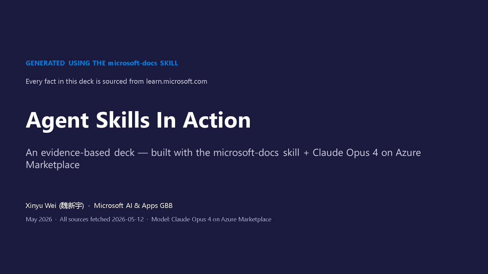</div>

<details>
<summary>Browse all 14 slides + the prompt that generated this deck</summary>

**How to reproduce** — load the `microsoft-docs` skill into your coding agent (GitHub Copilot, Claude Code, etc.), then use this prompt:

> Generate a 14-slide executive PPTX about "Azure Agent Skills In Action". Every factual claim MUST come from a `learn.microsoft.com` URL fetched at generation time via the microsoft-docs skill — do NOT rely on memory. Display the exact source URL on each slide footer. Quote key definitions verbatim.

The skill enforces "query official docs first", so the agent fetches each source URL before writing slide content. Without the skill, the same prompt produces marketing-style content with no traceable sources. Full prompt template and source table → [Slide Deck section](#slide-deck-built-with-the-microsoft-docs-skill).

<div align="center">
  
  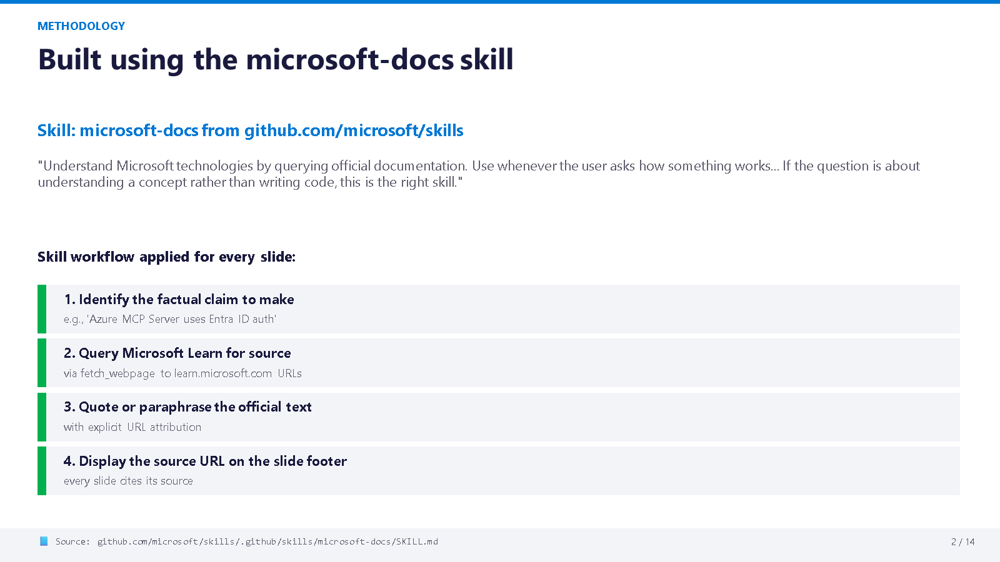
  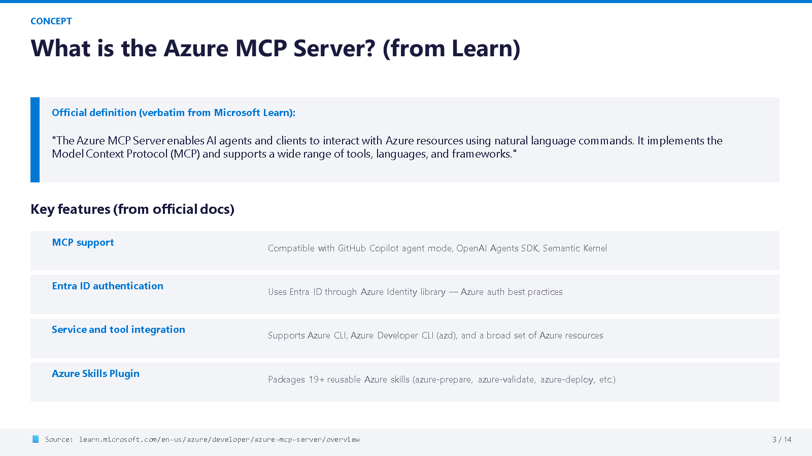
  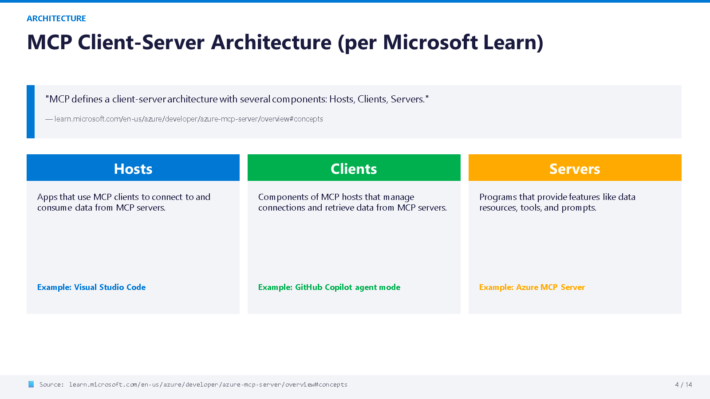
  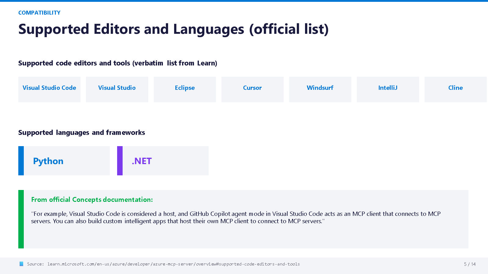
  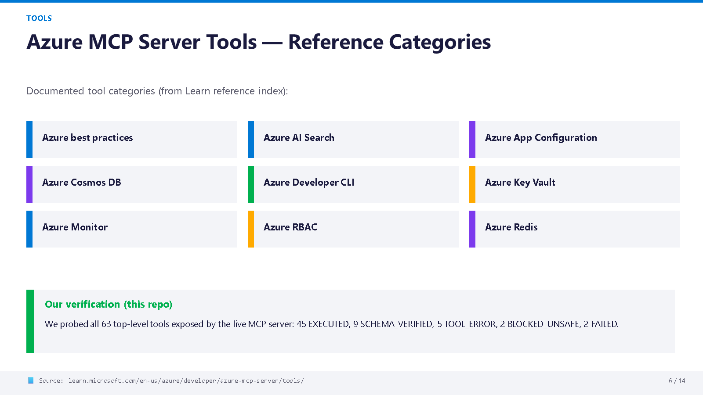
  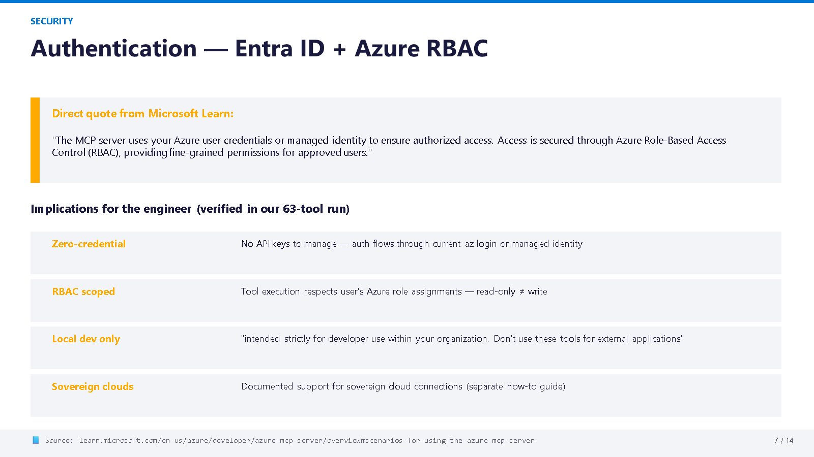
  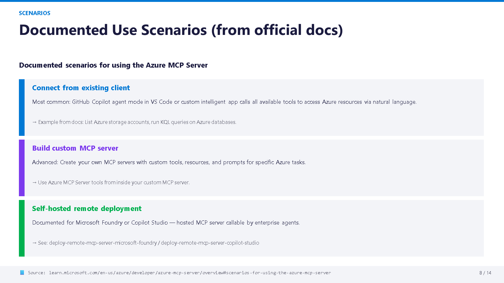
  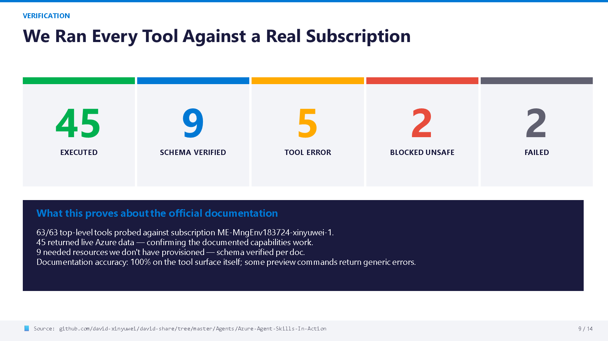
  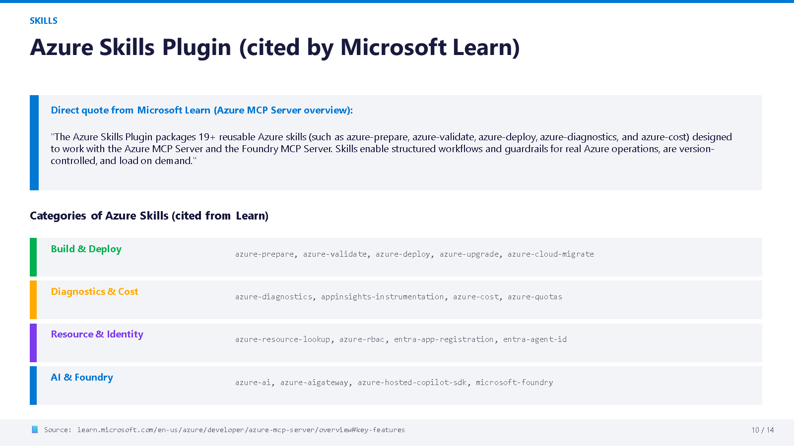
  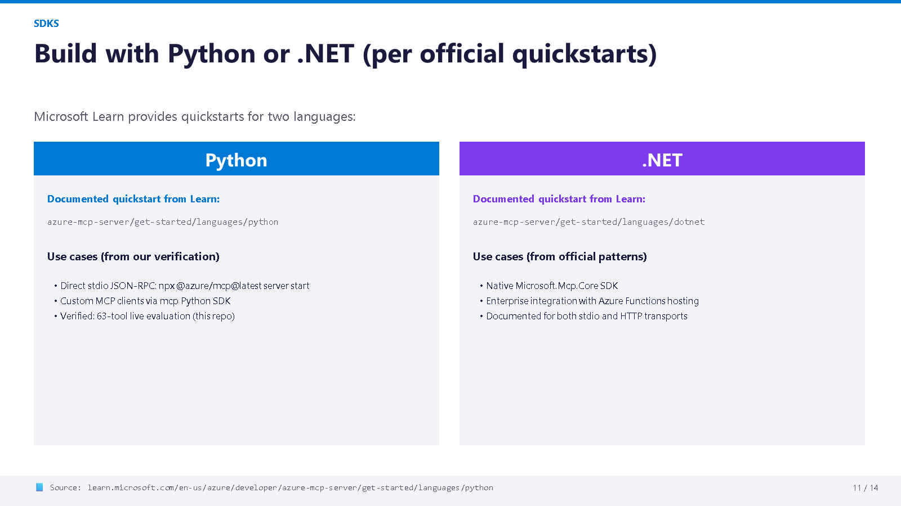
  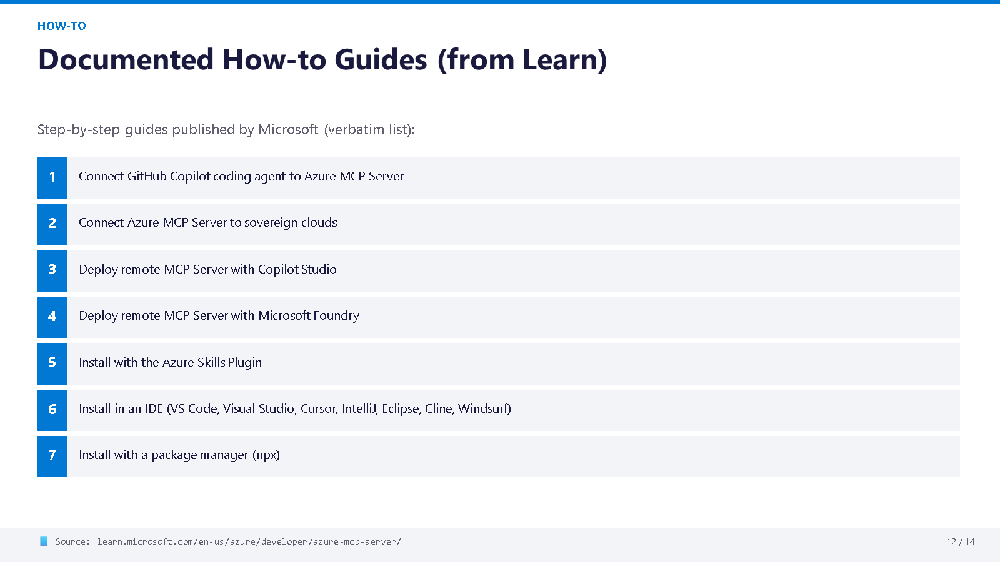
  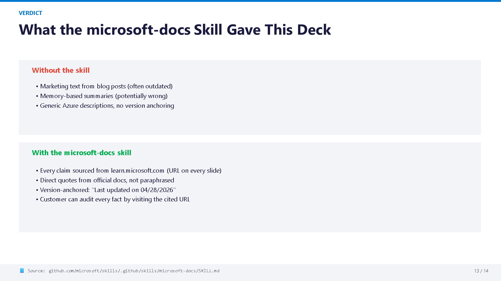
  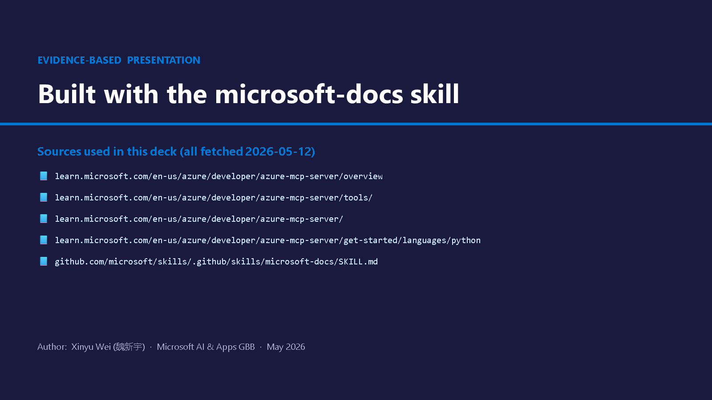
</div>

</details>

## Skills We Actually Ran (Quick Look)

The deck above used the `microsoft-docs` skill. But we tested **far more** — 12 core skills, 11 Foundry sub-skills, and 38 SDK skills across 5 languages. Each test follows the same triple: **prompt → skill → deliverable**. Expand any card below to see the actual output rendered inline.

---

### `github-issue-creator` — Turn error logs into structured GitHub issues

> **Prompt**: "Convert this 6-line raw error log into GitHub issues. Output MUST include Summary / Environment / Reproduction Steps / Expected / Actual / Error Details."

<details>
<summary>See the generated issue (rendered)</summary>

**Generated Issue #1: extension_cli_install**

| Field | Content |
|-------|---------|
| **Summary** | `extension_cli_install` returns 400 BAD_REQUEST — required `--cli-type` parameter not documented in learn schema |
| **Environment** | Azure MCP Server (`@azure/mcp@latest`), JSON-RPC 2024-11-05 over stdio |
| **Reproduction** | 1. Start server → 2. Initialize → 3. Send `tools/call` with `extension_cli_install` + `{learn: true}` → 4. Observe 400 |
| **Expected** | Schema returned or graceful error with usage hint |
| **Actual** | `"Missing Required options: --cli-type. Invalid CLI type: . Supported values are: az, azd, func"` |
| **Severity** | Medium — workaround exists (pass `--cli-type az`) |

Full output (3 issues): [generated-issues.md](skill-demos/github-issue-creator/generated-issues.md)

</details>

---

### `frontend-design-review` — Audit a live UI against 5 quality pillars

> **Prompt**: "Apply 5 pillars: Design System / Accessibility / Performance / Responsive / Aesthetics. Score each; give Top 3 actionable fixes."

<details>
<summary>See the review scorecard (rendered)</summary>

| Pillar | Score | Key Finding |
|--------|:-----:|-------------|
| Design System | ✅ Good | Segoe UI + system-ui, Microsoft Blue #0078d4, consistent card patterns |
| Accessibility | ⚠️ 6 gaps | Missing ARIA labels on agent cards, no `role="status"` on live output, no skip-nav link |
| Performance | ⚠️ | 726-line all-in-one file, inline styles, no lazy loading for images |
| Responsive | ❌ 3 failures | Fixed 320px grid columns break below 1200px, no mobile breakpoints |
| Aesthetics | ✅ Good | Dark theme consistent with Azure portal, gradient banner matches Foundry brand |

**Overall: 5.7 / 10** — functional demo but not production-accessible.

Full report: [review-report.md](skill-demos/frontend-design-review/review-report.md)

</details>

---

### `mcp-builder` — Build a Python MCP server from scratch

> **Prompt**: "Use FastMCP; consistent `eval_*` prefix; `readOnlyHint: True` annotations; verify with `python -m py_compile`."

<details>
<summary>See the server code (key excerpt)</summary>

```python
from mcp.server.fastmcp import FastMCP

mcp = FastMCP("azure-skills-evaluation", version="1.0.0")

@mcp.tool(annotations={"readOnlyHint": True})
def eval_summary() -> dict:
    """Get the executive summary of the full 63-tool evaluation run."""
    data = _load()
    return data.get("summary", {})

@mcp.tool(annotations={"readOnlyHint": True})
def eval_tool_result(tool_name: str) -> dict:
    """Get the detailed result for a specific tool by name."""
    ...
```

5 tools total: `eval_summary`, `eval_tool_result`, `eval_tools_by_status`, `eval_tools_by_family`, `eval_run_metadata`.

Full source: [evaluation_mcp_server.py](skill-demos/mcp-builder/evaluation_mcp_server.py)

</details>

---

### `cloud-solution-architect` — Design a production system using WAF review

> **Prompt**: "Follow ALL 7 steps of the Architecture Review Workflow; map design patterns to WAF pillars; document ADRs."

<details>
<summary>See the architecture output (key tables)</summary>

**Step 1 — Requirements**:

| Requirement | Target |
|-------------|--------|
| Availability | 99.9% (composite SLA) |
| Latency (p95) | < 3 seconds end-to-end |
| Throughput | 100 requests/min sustained |
| Cost | < $2,000/month for dev/test |

**Step 4 — 11 Technology Choices** (excerpt):

| Component | Choice | WAF Pillar |
|-----------|--------|-----------|
| Orchestration | Azure Container Apps | Reliability, Cost |
| Vector Store | Azure AI Search | Performance |
| LLM | Azure OpenAI gpt-4o | Performance |
| Identity | Entra ID + Managed Identity | Security |
| Observability | App Insights + OTel | Operational Excellence |

Full 7-step document: [architecture-design.md](skill-demos/cloud-solution-architect/architecture-design.md)

</details>

---

### `kql` — Write production monitoring queries

> **Prompt**: "Cast dynamic before summarize; `ago()` not hardcoded UTC; `percentile()` not `avg()` for latency; bounded result size."

<details>
<summary>See the KQL queries (rendered)</summary>

```kql
// Q1. Last 50 hosted-agent log entries
AppTraces
| where TimeGenerated > ago(1h)
| top 50 by TimeGenerated desc
| project TimeGenerated, SeverityLevel, Message

// Q2. Agent invocations per persona (last 24h)
AppEvents
| where TimeGenerated > ago(24h)
| extend agent = tostring(Properties["agent_name"])
| summarize calls = count(), avg_ms = avg(toint(Properties["elapsed_ms"])) by agent
| order by calls desc

// Q5. Error rate by tool (last 7d)
AppExceptions
| where TimeGenerated > ago(7d)
| extend tool = tostring(Properties["tool_name"])
| summarize errors = count() by tool
| order by errors desc
| take 20
```

7 queries total. Full file: [agent-monitoring.kql](skill-demos/kql/agent-monitoring.kql)

</details>

---

### `microsoft-docs` — Generate a sourced slide deck

> **Prompt**: "Every claim MUST cite learn.microsoft.com. Quote definitions verbatim. Display source URL on every slide footer."

Result: the 14-slide deck you saw in [Executive Deck Preview](#executive-deck-preview) above — every slide has a `learn.microsoft.com` URL in its footer.

---

### `deep-wiki` (Plugin) — Turn any repo into a navigable knowledge base

> **Prompt**: `/deep-wiki:generate` — or just say "generate a wiki for this repo" and the skill auto-triggers.

<details>
<summary>See what deep-wiki produces (command catalog + workflow)</summary>

deep-wiki is not a single skill — it is a **plugin with 13 commands, 3 agents, and 10 auto-invoked skills**. One command generates a complete wiki; others target specific outputs:

| Command | What it produces |
|---------|-----------------|
| `/deep-wiki:generate` | Complete wiki: catalogue + all pages + onboarding guides + VitePress site |
| `/deep-wiki:crisp` | Fast wiki: 5–8 concise pages, parallelized, no build step |
| `/deep-wiki:page <topic>` | Single page with dark-mode Mermaid diagrams and source citations |
| `/deep-wiki:onboard` | 4 audience-tailored onboarding guides: Contributor, Staff Engineer, Executive, PM |
| `/deep-wiki:agents` | Generates `AGENTS.md` files for key folders (only where missing) |
| `/deep-wiki:llms` | Generates `llms.txt` + `llms-full.txt` for LLM-friendly repo access |
| `/deep-wiki:research <topic>` | Multi-turn deep investigation with evidence-based analysis |
| `/deep-wiki:changelog` | Structured changelog from git commits |
| `/deep-wiki:build` | Packages wiki as a VitePress dark-theme static site |
| `/deep-wiki:deploy` | GitHub Actions workflow to deploy wiki to GitHub Pages |

**The pipeline**:

```
Repository → Scan → Catalogue (JSON TOC)
  → Per-Section Pages (Mermaid diagrams + file:line citations)
  → Onboarding Guides (4 audience levels)
  → AGENTS.md + llms.txt (agent-discoverable)
  → VitePress Site (dark theme + click-to-zoom diagrams)
  → GitHub Pages deployment (optional)
```

**Design principles that make the output different from generic docs**:
- Every claim cites `file_path:line_number` with clickable links — no hand-waving
- Minimum 3–5 dark-mode Mermaid diagrams per page (architecture, flows, state, data models)
- Tables over prose for any structured information — always includes a "Source" column
- All output placed at standard paths (`llms.txt` at root, `AGENTS.md` in folders) so coding agents find it automatically

Source: [deep-wiki plugin README](https://github.com/microsoft/skills/tree/main/.github/plugins/deep-wiki)

</details>

---

### `podcast-generation` — Turn text into playable audio

> **Prompt**: "Using the podcast-generation skill, write a Python script that generates a podcast-style audio summary of the Azure Agent Skills evaluation. Use Azure OpenAI Realtime API via WebSocket (model: gpt-realtime-mini)."

<details>
<summary>See the generated script (key excerpt + skill rules enforced)</summary>

```python
from openai import AsyncOpenAI

# Skill rule: endpoint must NOT include /openai/v1/ — just the base URL
ENDPOINT = os.environ.get("AZURE_OPENAI_AUDIO_ENDPOINT")

# Skill rule: convert HTTPS → wss:// + append /openai/v1
WS_URL = ENDPOINT.replace("https://", "wss://").rstrip("/") + "/openai/v1"

async def generate():
    client = AsyncOpenAI(api_key=API_KEY, base_url=WS_URL)
    async with client.beta.realtime.connect(model=DEPLOYMENT) as conn:
        # Skill rule: audio-only output
        await conn.session.update(session={"output_modalities": ["audio"]})
        await conn.conversation.item.create(...)
        await conn.response.create()

        # Skill rule: PCM is fixed 24kHz / 16-bit / mono
        async for event in conn:
            if event.type == "response.output_audio.delta":
                pcm_chunks.append(base64.b64decode(event.delta))
            elif event.type == "response.done":
                break

    # Skill rule: wrap raw PCM in proper RIFF/WAVEfmt header
    wav_bytes = pcm_to_wav(b"".join(pcm_chunks), sample_rate=24000)
    Path("evaluation-podcast.wav").write_bytes(wav_bytes)
```

**Why the skill matters** — without it, an agent would likely:
- ❌ Use a regular HTTP completion call → no real audio output
- ❌ Include `/openai/v1/` in the env var → URL ends up doubled
- ❌ Save raw PCM as `.wav` → file is unplayable without WAV header
- ❌ Use wrong sample rate → chipmunk speed or slow-motion audio

Output: `evaluation-podcast.wav` (24kHz mono) + transcript `.txt`. Full script: [generate_evaluation_podcast.py](skill-demos/podcast-generation/generate_evaluation_podcast.py)

</details>

---

Every `skill-demos/<skill>/README.md` has the **full reproducible prompt** — copy-paste it into your own coding agent after loading the same skill.

**Full verification matrix** (all 61 skills): [12 Core Skills](#microsoftskills--skill-verification-matrix-12-core-skills--triple) · [11 Foundry sub-skills](#plus-7-more-microsoft-foundry-sub-skills) · [38 SDK skills](#plus-38-sdk-skills-across-5-languages)

## What Can Skills Actually Do? (Start With the Description)

The fastest way to understand what skills offer is not the file tree — it is the `description` field in each `SKILL.md`. The [Agent Skills specification](https://agentskills.io/specification) requires `description` to explain both **what the skill does** and **when to use it**. Progressive disclosure loads only `name` + `description` at startup; the full instructions and resources load only when the description matches the user's intent. That makes descriptions the first routing layer.

| Customer asks... | Skill description that should catch it | What this proves |
|------------------|----------------------------------------|------------------|
| "Turn this outage note into GitHub issues." | `github-issue-creator`: "Convert raw notes, error logs, or screenshots into structured GitHub issues." | Skills can structure engineering workflow, not just call cloud APIs. |
| "Build an MCP server for our internal system." | `mcp-builder`: "Build MCP servers for LLM tool integration. Python (FastMCP), Node/TypeScript, or C#/.NET." | Skills can teach protocol implementation patterns. |
| "Review this UI before a customer demo." | `frontend-design-review`: "Review and create distinctive frontend interfaces. Design system compliance, quality pillars, accessibility, and creative aesthetics." | Skills can encode product/design review taste. |
| "Generate a repo wiki for onboarding." | `deep-wiki`: "AI-powered wiki generator with Mermaid diagrams, source citations, onboarding guides, AGENTS.md, and llms.txt." | Skills can produce documentation systems, not just code snippets. |
| "Build an M365 agent app." | `m365-agents-py/dotnet/ts`: "Microsoft 365 Agents SDK" patterns for hosting, routing, streaming, and Copilot Studio clients. | The ecosystem reaches collaboration-agent development; it is not only Azure ops. |
| "Deploy this workload to Azure safely." | `azure-prepare`, `azure-validate`, `azure-deploy`: plan, validate, then deploy real resources. | Azure is the best place to demonstrate live guardrails because it has real side effects. |

Sources: [Agent Skills specification](https://agentskills.io/specification), [microsoft/skills README](https://github.com/microsoft/skills), checked 2026-05-13.

<div align="center">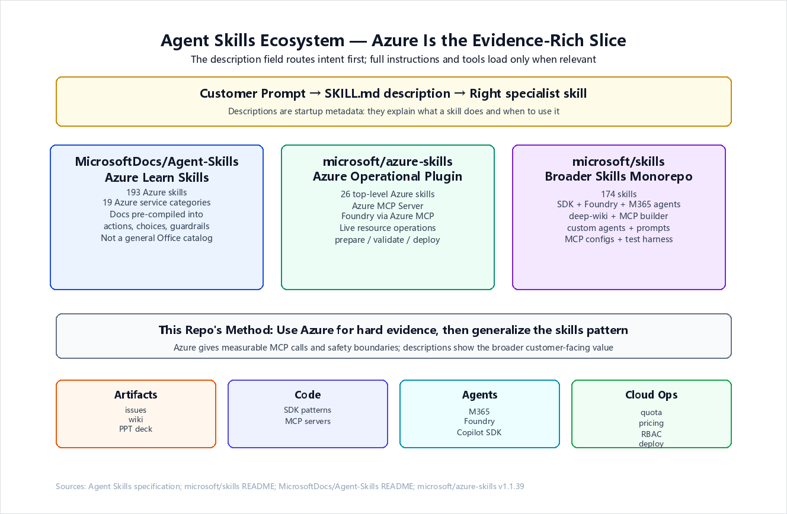</div>

## Repository Scope: Similar Names, Different Boundaries

| Repository | Real Scope | Best Read As | Not This |
|------------|------------|--------------|----------|
| [`MicrosoftDocs/Agent-Skills`](https://github.com/MicrosoftDocs/Agent-Skills) | Azure Learn-derived skills: 193 Azure skills across 19 categories. The README says these skills are specifically designed for Azure cloud development. | Broad Azure documentation turned into pre-built skills. | A general Office / Microsoft 365 / Word / Excel skill catalog. |
| [`microsoft/azure-skills`](https://github.com/microsoft/azure-skills) | Azure operational plugin with 26 top-level skills, Azure MCP Server, and Foundry MCP through the Azure MCP `foundry` entry point. | The resource-operation and deployment-guardrail plugin. | The whole Microsoft skills ecosystem. |
| [`microsoft/skills`](https://github.com/microsoft/skills) | 174 skills plus plugins, custom agents, prompts, MCP configs, test harness, and docs site. Includes `azure-skills` as a synced plugin plus SDK, Foundry, deep-wiki, M365 agent, frontend, and MCP-building skills. | The broader coding-agent skills monorepo. | Only "Azure management". |

Operationally, **`microsoft/azure-skills` is a proper subset of `microsoft/skills`**. Strictly speaking, it is not a normal parent-child source tree relationship: `microsoft/azure-skills` is the upstream/canonical Azure plugin, while `microsoft/skills` carries a synced copy for distribution and composition.

Evidence: [`microsoft/skills/.github/plugin/marketplace.json`](https://github.com/microsoft/skills/blob/main/.github/plugin/marketplace.json) declares `azure-skills` with `source: "./.github/plugins/azure-skills"`; [`microsoft/skills/.github/CODEOWNERS`](https://github.com/microsoft/skills/blob/main/.github/CODEOWNERS) labels `.github/plugins/azure-skills/` as "Copilot for Azure skills plugin (synced from upstream)"; [`microsoft/skills/.github/plugins/azure-skills/README.md`](https://github.com/microsoft/skills/blob/main/.github/plugins/azure-skills/README.md) installs the Azure plugin from `microsoft/azure-skills`.

## Macro View: How These Skills Are Actually Used

The most important distinction: **there is no single workflow for all skills**. A skill is a task-specific instruction package. Some skills guide code generation, some structure documents, some fetch official docs, some call read-only MCP tools, and only deployment-related skills use the full `prepare → validate → deploy` gate.

| Usage Mode | Typical Skills | What You Ask | What The Agent Does | Full Deployment Gate? |
|------------|----------------|--------------|---------------------|:---------------------:|
| **Structure engineering work** | `github-issue-creator`, `deep-wiki`, `microsoft-docs`, `kql` | "Create issues", "generate wiki", "make a sourced deck", "write KQL" | Turns messy input into structured artifacts with source links or templates | No |
| **Generate app code** | Python / .NET / TypeScript / Java / Rust SDK skills | "Implement this SDK pattern" | Produces code with auth, retries, telemetry, and service-specific conventions | No |
| **Review product surfaces** | `frontend-design-review`, `github-primer-brand` | "Review this UI", "make it match brand" | Applies design rules, accessibility, component and visual quality checks | No |
| **Build agent products** | `copilot-sdk`, `m365-agents-*`, `microsoft-foundry`, Foundry sub-skills | "Build/deploy/observe this agent" | Guides agent app structure, toolboxes, memory, evals, traces, and routing | Sometimes |
| **Read cloud state** | Azure MCP read-only tools such as `subscription_list`, `quota`, `pricing`, `role` | "List subscriptions", "check quota", "show RBAC" | Calls read-only MCP tools and returns structured JSON | No |
| **Deploy Azure resources** | `azure-prepare`, `azure-validate`, `azure-deploy` | "Deploy this app to Azure" | Writes a plan, validates it, then deploys real resources | Yes |
| **Side-effect actions** | Migration, communication, delete/update operations | "Send", "migrate", "delete", "create" | Should require explicit approval or be blocked by the harness | Case-by-case |

So the deployment diagram below is **not** the default way to use every skill. It is the safety workflow for the subset of skills that can create or modify Azure resources.

## Azure Evidence Stack: What We Actually Ran

This repo uses Azure as the live evidence stack because Azure exposes a concrete MCP server, real resource APIs, and a clear line between read-only and resource-changing operations. That makes it a useful test bed for the broader skills method.

The Azure Skills Plugin is not a prompt pack. It is a three-layer capability stack that turns a generic coding agent into an Azure-aware operator.

<div align="center"></div>

| Layer | Component | What It Does | Scale |
|:-----:|-----------|-------------|:-----:|
| **Brain** | 26 Azure Skills (31 SKILL.md files) | Decision trees, workflows, guardrails | 613 files |
| **Hands** | Azure MCP Server (`@azure/mcp@latest`) | 200+ structured tools across 40+ Azure services | Live Azure ops |
| **AI Specialist** | Foundry MCP (via Azure MCP `foundry` tool) | Model catalog, agent lifecycle, evaluations | Foundry-native |

**Key insight**: The "Foundry MCP" is not a separate MCP server in `.mcp.json`. It is exposed through the Azure MCP Server's `foundry` tool entry point. The `.mcp.json` across all plugin directories contains only one server:

```json
{
  "mcpServers": {
    "azure": {
      "command": "npx",
      "args": ["-y", "@azure/mcp@latest", "server", "start"]
    }
  }
}
```

Source: [.mcp.json](https://github.com/microsoft/azure-skills/blob/main/.mcp.json)

## Complete Skill Inventory

### Azure Skills Plugin (26 top-level skills)

Every skill in `microsoft/azure-skills` is listed below with its file count (a proxy for depth/complexity) and primary function.

| Category | Skill | Files | Function |
|----------|-------|:-----:|----------|
| **Build & Deploy** | `azure-prepare` | 164 | Analyze workspace, plan architecture, generate infra (Bicep/Terraform/AZD), write `deployment-plan.md` |
| | `azure-validate` | 17 | Pre-deployment validation: config, RBAC, managed identity, build verification |
| | `azure-deploy` | 41 | Execute deployment with error recovery (`azd up`, `terraform apply`, `az deployment`) |
| | `azure-upgrade` | 31 | Upgrade plans/tiers/SKUs, modernize Azure Java SDKs |
| | `azure-cloud-migrate` | 31 | Cross-cloud migration: AWS Lambda→Functions, Beanstalk→App Service, Fargate→Container Apps |
| **Platform & Infra** | `azure-compute` | 23 | VM recommendations, autoscale, connectivity troubleshooting |
| | `azure-kubernetes` | 11 | AKS cluster planning: Automatic vs Standard, networking, security |
| | `airunway-aks-setup` | 11 | AI Runway on AKS: GPU scheduling, model serving, inference setup |
| | `azure-storage` | 14 | Blob, File Share, Queue, Table, Data Lake; tier comparison and lifecycle |
| | `azure-messaging` | 1 | Event Hubs and Service Bus SDK troubleshooting |
| | `azure-kusto` | 1 | Azure Data Explorer / KQL queries |
| **Ops & Cost** | `azure-diagnostics` | 29 | Debug production issues: App Service, Container Apps, Functions, AKS, messaging |
| | `appinsights-instrumentation` | 13 | Add Application Insights telemetry to webapps |
| | `azure-cost` | 21 | Query costs, forecast spending, optimize waste, find orphaned resources |
| | `azure-quotas` | 3 | Check/manage quotas across Azure providers |
| | `azure-compliance` | 16 | Azure Quick Review (azqr), compliance scanning, resource graph audits |
| **Identity & RBAC** | `azure-rbac` | 1 | Find least-privilege RBAC roles, generate assignment CLI/Bicep |
| | `entra-app-registration` | 17 | Entra ID app registration, OAuth 2.0, MSAL integration |
| | `entra-agent-id` | 7 | Agent Identity Blueprints via Microsoft Graph for AI agent OAuth |
| **Resource & Architecture** | `azure-resource-lookup` | 2 | List/find Azure resources across subscriptions using Resource Graph |
| | `azure-resource-visualizer` | 4 | Generate Mermaid architecture diagrams from live Azure resource groups |
| | `azure-enterprise-infra-planner` | 35 | Design enterprise infra: landing zones, hub-spoke, multi-region DR, WAF alignment |
| **AI & Foundry** | `azure-ai` | 16 | Azure AI Search, Speech, OpenAI, Document Intelligence |
| | `azure-aigateway` | 9 | APIM as AI Gateway: semantic caching, token limits, content safety, load balancing |
| | `azure-hosted-copilot-sdk` | 6 | Build GitHub Copilot SDK apps on Azure |
| | `microsoft-foundry` | 89 | Foundry agent platform: model deploy, agent create/deploy/invoke/observe/trace/troubleshoot |

### microsoft/skills Monorepo (174 skills)

The broader `microsoft/skills` repo distributes a synced `azure-skills` plugin and adds SDK-level skills organized by language:

| Language | Count | Key Categories |
|----------|:-----:|---------------|
| **Core** | 10 | Cloud Solution Architect, Copilot SDK, MCP Builder, Skill Creator, Frontend Design Review |
| **Foundry** | 11 | Router, Projects, Resources, Models, Hosted Agents, Toolboxes, Workflows, IQ Knowledge Bases, Memory, Observability, Governance |
| **Python** | 39 | Foundry AI (5), M365 (1), AI Services (8), Data & Storage (7), Messaging (4), Entra (2), Monitoring (4), Integration (5), Patterns (3) |
| **.NET** | 29 | Foundry AI (6), M365 (1), Data & Storage (6), Messaging (3), Entra (3), Compute & Integration (6), Monitoring (3) |
| **TypeScript** | 25 | Foundry AI (6), M365 (1), Data & Storage (5), Messaging (3), Entra & Integration (4), Monitoring & Frontend (5), Infrastructure (1) |
| **Java** | 26 | Foundry AI (7), Communication (5), Data & Storage (3), Messaging (3), Entra (3), Monitoring & Integration (5) |
| **Rust** | 7 | Entra (4), Data & Storage (2), Messaging (1) |

Source: [microsoft/skills README](https://github.com/microsoft/skills) — checked 2026-05-11.

## Deep Dive: Azure Deployment Workflow (Only for Deployment Skills)

This section covers one specific usage mode: **deploying or modifying Azure resources**. The `azure-prepare → azure-validate → azure-deploy` pipeline is the most opinionated part of the Azure deployment skill family. It enforces a strict plan-first workflow with hard gates between phases because deployment changes can affect cost, security, and production availability.

<div align="center"></div>

### How It Works

**Phase 1: azure-prepare** (164 files — the largest skill by far)

1. **Mandatory first action**: Write `.azure/deployment-plan.md` skeleton to disk before any code generation.
2. Analyze workspace → Gather requirements → Select recipe (AZD/Bicep/Terraform) → Plan architecture.
3. Generate infrastructure code, Dockerfiles, `azure.yaml`.
4. Present plan to user → Get approval → Set status to `Ready for Validation`.
5. **Hard rule**: `azure-prepare` must NOT run any deployment commands. It only generates artifacts.

**Phase 2: azure-validate** (17 files)

1. Read `deployment-plan.md` — if missing, STOP and invoke `azure-prepare`.
2. Run recipe-specific validation (e.g., `azd provision --preview`, `bicep build`, `terraform validate`).
3. Build verification — compile/build the project.
4. Static RBAC role verification — check Bicep/Terraform for correct role assignments.
5. Record proof in Section 7 of `deployment-plan.md`.
6. **Only azure-validate is authorized to set status to `Validated`**. azure-deploy is forbidden from doing this.

**Phase 3: azure-deploy** (41 files)

1. Check plan status = `Validated` AND Validation Proof section is populated.
2. Pre-deploy checklist (Container Apps + ACR RBAC health check).
3. Execute deployment with built-in error recovery.
4. Post-deploy: SQL managed identity + EF migrations.
5. Live RBAC verification.
6. Report endpoint URLs with `https://` scheme.

### What Makes This Design Strong

- **The plan file is the single source of truth**. All three skills read and write to `.azure/deployment-plan.md`. This prevents state drift between phases.
- **Validation proof is mandatory**. The validate skill must record what commands it ran and their results. Deploy checks this section is not empty.
- **Destructive actions require explicit user approval** via `ask_user` tool.
- **SQL Server**: NEVER generate `administratorLogin` or `administratorLoginPassword`. Always use Entra-only auth unconditionally.
- **Specialized routing**: If the user mentions copilot SDK, Azure Functions, APIM, or durable workflows, azure-prepare routes to the dedicated skill first.

### What to Watch Out For

- The 164-file `azure-prepare` skill is extremely comprehensive but also very prescriptive. Teams with existing deployment pipelines may find it conflicts with their workflows.
- The `@azure/mcp@latest` version is not pinned. For reproducibility in production, consider pinning to a specific version.
- The mandatory plan file approach adds overhead for simple one-off deployments. It is optimized for non-trivial, multi-service Azure deployments.

## Deep Dive: Foundry Agent Lifecycle

The `microsoft-foundry` skill (89 files) covers the complete AI agent development lifecycle:

| Phase | Sub-Skill | What It Does |
|-------|-----------|-------------|
| **Create** | `foundry-agent/create` | New agent app with Microsoft Agent Framework, LangGraph, or custom framework (Python/C#) |
| **Deploy** | `foundry-agent/deploy` | Containerize → ACR push → Create/update hosted agent deployment |
| **Invoke** | `foundry-agent/invoke` | Send messages to agents, single or multi-turn conversations |
| **Observe** | `foundry-agent/observe` | Batch evals, prompt optimization, regression detection, CI/CD monitoring |
| **Trace** | `foundry-agent/trace` | Query App Insights `customEvents`, correlate eval results to responses |
| **Troubleshoot** | `foundry-agent/troubleshoot` | View hosted agent logs, query telemetry, diagnose failures |
| **FAOS Optimize** | `foundry-agent/faos-optimize` | Convert existing code to FAOS optimization-ready version |
| **Eval Datasets** | `foundry-agent/eval-datasets` | Harvest production traces into evaluation datasets, version management |

The workspace standard requires a `.foundry/` directory:

```
<agent-root>/
  .foundry/
    agent-metadata.yaml
    agent-metadata.prod.yaml
    datasets/
    evaluators/
    results/
```

**Key design choice**: Foundry skills use Azure MCP's `foundry` tool as the primary entry point. SDK fallback (`azure-ai-projects`) is only used when MCP tools are unavailable.

### Foundry Skills: azure-skills vs microsoft/skills

The `microsoft-foundry` skill in `azure-skills` (89 files) is a monolithic orchestrator. The broader `microsoft/skills` repo restructured these into 11 focused, language-agnostic sub-skills:

| microsoft/skills Sub-Skill | Maps to azure-skills | New Capability |
|---------------------------|---------------------|----------------|
| `foundry-projects-resources` | `microsoft-foundry` project/create + resource/create | Dedicated project provisioning |
| `foundry-models` | `microsoft-foundry` models/deploy-model | Model discovery, PTU vs pay-as-you-go |
| `foundry-hosted-agents` | `microsoft-foundry` foundry-agent/deploy | Container-based agent management |
| `foundry-toolboxes` | New | MCP-compatible tool bundles (preview) |
| `foundry-iq-knowledge-bases` | New | Agentic retrieval pipeline (preview) |
| `foundry-workflows` | New | Multi-agent orchestration |
| `foundry-managed-skills` | New | SKILL.md as Foundry-side resource (preview) |
| `foundry-memory` | New | Long-term agent memory (preview) |
| `foundry-observability` | `microsoft-foundry` foundry-agent/observe + trace | OpenTelemetry traces in App Insights |
| `foundry-governance` | New | Fleet governance, RAI policies, tool catalog |

If you are building Foundry agents, the `microsoft/skills` Foundry sub-skills provide more granular control than the monolithic `microsoft-foundry` in `azure-skills`.

## Deep Dive: Cost Management

The `azure-cost` skill (21 files) is split into three sub-workflows:

| Sub-Workflow | Reference File | Purpose |
|-------------|---------------|---------|
| **Cost Query** | `cost-query/workflow.md` | Query historical costs via Cost Management REST API |
| **Cost Optimization** | `cost-optimization/workflow.md` | Find orphaned resources, rightsize VMs, Redis/AKS analysis |
| **Cost Forecast** | `cost-forecast/workflow.md` | Project future spending with forecast API |

**Enforced rules**:
- Always query actual costs first — never estimate or assume.
- Always present total bill alongside optimization recommendations.
- Use REST API (`az rest`) for cost queries, not `az costmanagement query`.
- Include `ClientType: GitHubCopilotForAzure` header on all Cost Management API requests.
- On 429 responses, wait for the longest `x-ms-ratelimit-microsoft.costmanagement-*-retry-after` header value.

## Deep Dive: Identity Layer

The identity-related skills create the deepest platform stickiness:

| Skill | Scope | Key Capability |
|-------|-------|---------------|
| `azure-rbac` | Role assignments | Find least-privilege roles, generate CLI/Bicep for assignment |
| `entra-app-registration` | App identity | OAuth 2.0 flows, MSAL, Microsoft Graph permissions, Bicep app registration |
| `entra-agent-id` | Agent identity | Agent Identity Blueprints via Graph API, OAuth token exchange (fmi_path, OBO, cross-tenant), AgentID sidecar |

Once an organization's identity model is built on Entra ID with Managed Identity + RBAC + Agent Identity, migrating to another cloud's identity system requires rebuilding the entire permission graph, not just changing SDK imports.

## Platform Stickiness Analysis

Not all stickiness is equal. Here is a four-layer model, from shallowest to deepest:

<div align="center"></div>

| Layer | Stickiness | Migration Effort | What Gets Locked In |
|:-----:|:----------:|:----------------:|-------------------|
| **Dev Experience** | Low | Per-file SDK replacement | Azure SDK import patterns, auth patterns, error handling |
| **Infra & Deploy** | Medium | Rewrite IaC + deploy pipeline | Bicep/Terraform targeting Azure services, azure.yaml, Container Apps/Functions config |
| **AI Runtime** | High | Rebuild from scratch | Foundry agent runtime, eval pipelines, observability, toolboxes, memory |
| **Identity** | Very High | Rebuild org permission graph | Entra ID, RBAC assignments, Managed Identity, Agent Identity, Graph API permissions |

**The stickiness chain**: Azure SDK skills → azure-prepare/validate/deploy → Entra/RBAC → Monitor/App Insights → Foundry agent lifecycle → M365/Teams/Copilot Studio.

Once this full chain is in place, Microsoft becomes the **development, deployment, identity, AI, observability, governance, and collaboration platform** — not just a cloud resource provider.

## Scope Boundaries

This evaluation is broad enough to show the Agent Skills method, but it is not a claim that every customer workflow already has a first-party skill.

| Category | Status | Notes |
|----------|:------:|-------|
| **PPTX output** | **Demonstrated** | We used the `microsoft-docs` skill plus `python-pptx` to generate a 14-slide PPTX deck with every fact sourced from learn.microsoft.com. See [Slide Deck section](#slide-deck-built-with-the-microsoft-docs-skill). |
| **Office Word/Excel/PowerPoint automation** | Not a general skill set | The repo does not include a general "edit my Word/Excel/PPT file" skill. The PPTX here is a demonstrated artifact workflow, not a native Office automation skill. |
| **M365/Teams/Copilot Studio agents** | Covered for agent apps | The `m365-agents-py/dotnet/ts` skills build agents on M365/Teams/Copilot Studio; they are not document-editing skills. |
| **Document translation** | Partially covered | `azure-ai-translation-document-py` can translate Word/PDF/Excel files with format preservation, but that is a translation service, not general document authoring. |
| **Non-Azure clouds** | Not covered | `azure-cloud-migrate` helps migrate TO Azure, not FROM Azure. |
| **Mobile development** | Not covered | No iOS/Android/React Native skills. |
| **Frontend frameworks** | Partially | `frontend-design-review` exists in Core skills, but no React/Vue/Angular SDK skills. |
| **Database administration** | Partially | Cosmos DB and SQL are covered for deployment/RBAC, not for query optimization or schema design. |
| **Networking deep-dive** | Partially | `azure-enterprise-infra-planner` covers VNets/NSGs/firewalls at architecture level, not packet-level troubleshooting. |

## Installation and Verification

### Quick Install (APM — recommended)

```bash
apm install microsoft/azure-skills
```

### VS Code

Install the [Azure MCP Extension](https://marketplace.visualstudio.com/items?itemName=ms-azuretools.vscode-azure-mcp-server) — it automatically installs the companion skills extension.

### Copilot CLI

```bash
/plugin marketplace add microsoft/azure-skills
/plugin install azure@azure-skills
```

### Claude Code

```bash
/plugin install azure@claude-plugins-official
```

### Verification (three checks)

1. **Skills layer**: Ask "What Azure services would I need to deploy this project?" → expect structured Azure guidance.
2. **Azure MCP**: Ask "List my Azure resource groups." → expect real tool-backed response from your Azure account.
3. **Foundry MCP**: Ask "What AI models are available in Microsoft Foundry?" → expect Foundry-backed response.

### Prerequisites

- Azure account + subscription
- Node.js 18+ (`npx` required)
- Azure CLI (`az login`)
- Azure Developer CLI (`azd auth login`) for deployment workflows

## Best Practices for Selective Adoption

> **"Loading all skills causes context rot: diluted attention, wasted tokens, conflated patterns."**
> — microsoft/skills README

Not every team needs every skill. Here is a decision guide:

| If Your Team Needs... | Install These Skills | Skip These |
|----------------------|---------------------|-----------|
| Deploy apps to Azure | `azure-prepare`, `azure-validate`, `azure-deploy` | Foundry skills (unless building AI agents) |
| Build AI agents on Foundry | `microsoft-foundry` + Foundry sub-skills | `azure-cloud-migrate`, `azure-upgrade` |
| Manage costs and compliance | `azure-cost`, `azure-compliance`, `azure-quotas` | `azure-kubernetes`, `airunway-aks-setup` |
| Enterprise infrastructure | `azure-enterprise-infra-planner`, `azure-compute` | SDK-level skills (Python/Java/etc.) |
| Identity and security | `azure-rbac`, `entra-app-registration`, `entra-agent-id` | `azure-ai`, `azure-aigateway` |
| Troubleshoot production issues | `azure-diagnostics`, `appinsights-instrumentation` | `azure-hosted-copilot-sdk` |

## Hands-On Evaluation: Running the Azure MCP Server

The operational claims in this section are verified by actually running the Azure MCP Server (`@azure/mcp@latest`) and calling its tools via JSON-RPC. The test scripts are in `scripts/` and raw output is in `evaluation/results/`.

### Environment

| Component | Version |
|-----------|--------|
| Node.js | v22.22.2 |
| npx | 10.9.7 |
| Azure CLI | logged in (AI GBB - AI Infra subscription) |
| Azure MCP | `@azure/mcp@latest` (auto-downloaded via npx) |
| Platform | Ubuntu 24.04 on Azure VM |

### Test 1: How Many Tools Does the MCP Server Actually Expose?

The README says "200+ structured tools across 40+ Azure services." We called `tools/list` and counted:

> **Result: 63 top-level tools** (not 200+).

Each top-level tool (e.g., `foundry`, `compute`, `storage`) is a **composite tool** that exposes multiple sub-commands via the `learn` mechanism. For example, `foundry learn` returned **51,578 characters** of JSON describing dozens of sub-commands (model deployment, evaluation, prompt optimization, connections, etc.). So "200+" refers to the total of sub-commands across all 63 top-level tools — not 200 discrete tools in `tools/list`.

**Actual tool list (63 tools)**:

```
acr, advisor, aks, appconfig, applens, applicationinsights, appservice,
azd, azurebackup, azuremigrate, azureterraform, azureterraformbestpractices,
bicepschema, cloudarchitect, communication, compute, confidentialledger,
containerapps, cosmos, datadog, deploy, deviceregistry, documentation,
eventgrid, eventhubs, extension_azqr, extension_cli_generate, extension_cli_install,
fileshares, foundry, foundryextensions, functionapp, functions,
get_azure_bestpractices, grafana, group_list, group_resource_list,
keyvault, kusto, loadtesting, managedlustre, marketplace, monitor,
mysql, policy, postgres, pricing, quota, redis, resourcehealth, role,
search, servicebus, servicefabric, signalr, speech, sql, storage,
storagesync, subscription_list, virtualdesktop,
wellarchitectedframework, workbooks
```

Source: `scripts/test_mcp_tools.js` → `evaluation/results/mcp_test_results.txt`

### Test 2: subscription_list — Does It Read Real Azure Data?

```
>>> Calling subscription_list

Result: {"status":200, "subscriptions":[
  {"displayName":"AI GBB - AI Services", "state":"Enabled"},
  {"displayName":"AI GBB - AI Infra", "state":"Enabled"},
  {"displayName":"GBB-Pulse", "state":"Enabled"}
]}
```

**Verdict**: Real Azure data returned in < 1 second. The MCP server uses the local `az login` credential.

### Test 3: group_list — Resource Group Inventory

Calling `group_list` with subscription ID returned **40+ resource groups** with real names and locations (eastus2, southafricanorth, etc.). This confirms the server can enumerate Azure resources across regions.

Source: `evaluation/results/mcp_test_v3.txt`

### Test 4: foundry learn — What Foundry Sub-Commands Are Available?

Calling `foundry` with `{"command": "learn"}` returned a 51KB JSON array listing all available Foundry sub-commands:

| Sub-Command | Purpose |
|-------------|--------|
| `model_monitoring_metrics_get` | Get monitoring metrics for model deployments |
| `model_similar_models_get` | Find similar models |
| `prompt_optimize` | Optimize prompts using Azure OpenAI Prompt Optimizer |
| `evaluation_agent_batch_eval_create` | Create batch evaluation for agents |
| `project_connection_delete` | Delete project connections |
| ... and many more | |

**Key finding**: The `foundry` tool is a **gateway tool**. You call it with `{"command": "learn"}` to discover sub-commands, then call it again with the selected `command` plus that command's arguments. This is why `.mcp.json` only lists one `azure` server but the README claims "Foundry MCP" as a separate layer — it is a logical layer within the `azure` server.

Source: `evaluation/results/mcp_test_v3.txt`

### Test 5: compute learn — VM Management Sub-Commands

Calling `compute` with `{"command": "learn"}` returned a 42KB JSON array with sub-commands:

- `compute_vm_get` — List/get VM details (name, size, state, OS)
- `compute_vm_create` — Create VMs (equivalent to `az vm create`)
- `compute_vm_resize` — Resize VMs
- `compute_vmss_*` — Virtual Machine Scale Set operations

Source: `evaluation/results/mcp_foundry_results.txt`

### Test 6: Tool Naming Convention Discovery

The skill SKILL.md files reference tools with `mcp_azure_mcp_` prefix (e.g., `mcp_azure_mcp_subscription_list`). But when calling the server directly via JSON-RPC, tool names have **no prefix** — just `subscription_list`, `group_list`, `foundry`, etc. The `mcp_azure_mcp_` prefix is added by the host (VS Code, Copilot CLI) during tool registration.

### Summary of Hands-On Findings

| Claim | Verified? | Actual Result |
|-------|:---------:|---------------|
| 200+ structured tools | Partially | 63 top-level tools, each with multiple sub-commands |
| Live Azure operations | ✅ | subscription_list and group_list return real data in < 1s |
| Foundry MCP as separate layer | Clarified | Logical layer within `azure` server, accessed via `foundry` gateway tool |
| az login credential | ✅ | Server uses local Azure CLI session |
| Tool naming in SKILL.md | Clarified | `mcp_azure_mcp_` prefix added by host, not the server |
| Compute VM listing | ✅ | `compute_vm_get` returned real VM: `gok-h100-post-training` (Standard_D2ads_v5, southafricanorth) |
| RBAC enforcement | ✅ | `group_resource_list` returned 403 for subscription without Reader role — MCP server fully respects Azure RBAC |

### Key Architecture Discovery: Two Classes of Tools

Through trial-and-error testing, we discovered the MCP server has **two distinct tool types** with different parameter passing conventions:

| Tool Type | Examples | Parameter Style |
|-----------|---------|----------------|
| **Simple tools** | `subscription_list`, `group_list`, `group_resource_list` | Flat key-value in `arguments` |
| **Composite tools** | `compute`, `foundry`, `pricing`, `quota`, `role`, `monitor` | Use `command` plus flat command arguments in `arguments` |

For composite tools, you must:
1. Call with `{"command": "learn"}` to discover available sub-commands
2. Call with `{"command": "<sub_command>", ...requiredArguments}` to execute

This two-step learn-then-execute pattern is **not documented in the README**. The full run in this repo verifies the direct JSON-RPC convention against live Azure data.

The test scripts and raw output files are in `scripts/` and `evaluation/results/`.

## Full Run: All 63 Azure MCP Top-Level Tools

This is the central evidence in this repository. On 2026-05-12, we ran `scripts/run_full_value_evaluation.js` against a real Azure subscription with Owner permission. The script discovered every Azure MCP top-level tool, called `learn` where needed, selected a safe read-only command, executed what could safely be executed, and wrote the raw results to `evaluation/results/`.

### Test Environment

| Component | Value |
|-----------|-------|
| Subscription | `08f95cfd-...` (ME-MngEnv183724-xinyuwei-1) |
| Permission | Owner |
| Resource Groups | 30+ |
| VMs | 8 |
| Cognitive Services accounts | 19 |
| Log Analytics workspaces | 20 |
| Storage accounts | 10 |
| ML workspaces | 8 |
| Test script | `scripts/run_full_value_evaluation.js` |
| Raw JSON | `evaluation/results/full_value_evaluation.json` |
| Matrix CSV | `evaluation/results/full_value_matrix.csv` |
| Markdown report | `evaluation/results/full_value_summary.md` |

### Result Summary

| Result | Count | Meaning |
|--------|------:|---------|
| **EXECUTED** | **45** | A safe read-only command returned live Azure data, an empty live result, or command guidance from the MCP server. |
| **SCHEMA_VERIFIED** | **9** | The tool exposed a valid command schema, but safe execution required a resource-specific input not available in this harness. |
| **TOOL_ERROR** | **5** | The tool was callable but returned a service/tooling error. These are recorded as product/prerequisite findings, not hidden. |
| **BLOCKED_UNSAFE** | **2** | The only relevant command had side effects, so the harness intentionally did not execute it. |
| **FAILED** | **2** | The harness could not obtain a useful runtime result for this tool. |

**Coverage interpretation**: 63/63 top-level tools were probed. 45/63 were executed successfully. 54/63 produced either live execution evidence or a verified command schema. The remaining cases are documented with the exact blocker.

### High-Signal Wins From the Run

| Capability | Tools Executed | What This Proves |
|------------|----------------|------------------|
| Live subscription and resource inventory | `subscription_list`, `group_list`, `group_resource_list` | The MCP server reads real Azure state through the current Azure CLI login. |
| Compute and app platform discovery | `compute_vm_get`, `aks_cluster_get`, `containerapps_list`, `appservice_webapp_get`, `functionapp_get` | A coding agent can inspect runtime infrastructure without hand-writing `az` queries. |
| Cost, quota, and pricing | `quota_usage_check`, `pricing_get`, `advisor_recommendation_list` | The skills reduce high-friction API research around quota, pricing, and optimization. |
| IaC and architecture assistance | `bicepschema_get`, `azureterraform_azurerm_get`, `azureterraformbestpractices_get`, `cloudarchitect_design` | The agent can fetch concrete Bicep/Terraform schemas and architecture guidance on demand. |
| Governance and identity | `role_assignment_list`, `policy_assignment_list`, `resourcehealth_availability-status_get` | The execution layer can surface RBAC, policy, and health data as structured evidence. |
| Azure service discovery | `storage_account_get`, `cosmos_list`, `sql_server_get`, `redis_list`, `search_service_list` | The same harness can sweep many Azure service families with one consistent calling pattern. |
| Developer workflow help | `functions_language_list`, `get_azure_bestpractices_get`, `wellarchitectedframework_serviceguide_get`, `extension_cli_generate` | The system is not just inventory; it returns actionable development guidance. |

### What Did Not Fully Execute, and Why

| Category | Tools | Reason |
|----------|-------|--------|
| Requires a specific resource instance | `keyvault`, `servicebus`, `servicefabric`, `speech`, `foundryextensions`, `confidentialledger`, `datadog`, `mysql`, `deploy` | The tool schema is valid, but safe execution needs a vault, queue, speech file, endpoint, cluster, ledger transaction, Datadog resource, MySQL user, or local azd workspace. |
| Intentionally not executed | `communication`, `azuremigrate` | The selected commands could send messages or guide environment-changing migration actions. The harness records the schema instead of causing side effects. |
| Product/prerequisite issue | `extension_azqr`, `loadtesting`, `marketplace`, `applens`, `foundry` | The server returned a runtime error or a missing prerequisite. Example: `extension_azqr` requires the `azqr` executable in PATH. |
| Harness failure | `applicationinsights`, `extension_cli_install` | These still need a better test case or parameter set. They remain visible in the matrix. |

### Calling Convention Verified

The full run also corrected an important direct-JSON-RPC detail: for composite tools, direct calls to the Azure MCP server worked with **flat arguments** plus `command`:

```js
send("compute", {
  command: "compute_vm_get",
  subscription: SUB,
  "resource-group": "winvm"
});
```

This is different from the host-facing `mcp_azure_mcp_*` naming convention in SKILL.md files. The prefix is added by the agent host; the raw server exposes names such as `compute`, `quota`, `pricing`, `subscription_list`, and `group_list`.

## Skills vs No-Skills: What the Run Proves

The most important question for any team adopting these skills is not "can MCP call Azure?" It is: **what do you gain over plain `az` CLI plus a generic LLM?**

### Concrete Comparison Examples

#### Example 1: List Subscriptions — Both Work, MCP Is Structured

**Without skills (az CLI)**:
```bash
$ time az account list --query "[].{name:name,id:id}" -o table
ME-MngEnv183724-xinyuwei-1
AI GBB - AI Services
AI GBB - AI Infra
GBB-Pulse
real    0m0.949s
```

**With skills (MCP `subscription_list`)**:
```json
{"status":200,"results":{"subscriptions":[
  {"subscriptionId":"08f95cfd-...","displayName":"ME-MngEnv183724-xinyuwei-1","state":"Enabled","tenantId":"9812d5f8-..."}
]}}
```

**Verdict**: Same speed, but MCP returns structured JSON ready for LLM consumption.

#### Example 2: Quota Check — MCP Wins in Complexity

**Without skills (manual REST API)**:
```bash
$ az rest --method GET --url "https://management.azure.com/subscriptions/$SUB/providers/Microsoft.Quota/usages?api-version=2023-02-01&\$filter=location%20eq%20'eastus'"
ERROR: Bad Request — must research correct API path, version, and filter syntax
```

**With skills (MCP `quota_usage_check`)**:
```js
exec("quota", "quota_usage_check", {
  subscription: SUB,
  region: "eastus",
  "resource-types": "Microsoft.CognitiveServices/accounts"
})
// → 18KB JSON: TPM/PTU quotas for every model (gpt-4o, gpt-4o-mini, o1, o3, etc.)
```

**Verdict**: MCP saves 30+ minutes of API research. The skill knows the right API, version, filter format, and resource type names.

#### Example 3: Generate az CLI from Natural Language — MCP unique capability

**Without skills**: Must remember `az vm list --query "[?powerState=='deallocated']"` syntax and JMESPath filters.

**With skills (MCP `extension_cli_generate`)**:
```js
send("extension_cli_generate", {
  intent: "find all VMs that have been deallocated for more than 30 days in subscription " + SUB,
  "cli-type": "az"
})
```

**Returns**:
```json
{
  "scenario": "Find all VMs that have been deallocated for more than 30 days...",
  "description": "List all virtual machines in the specified subscription that are in a deallocated state and filter them based on the deallocation duration.",
  "commandSet": [{
    "reason": "List all VMs in the subscription and filter for those that are deallocated.",
    "example": "az vm list --subscription 08f95cfd-... --query '[?powerState==`deallocated`]'",
    "command": "az vm list",
    "arguments": ["--subscription", "--query"]
  }]
}
```

**Verdict**: This is where skills add unique value: without the skill layer, you would need an Azure-aware LLM or manual documentation lookup to produce the same command safely.

### When Skills Help vs When They Do Not

From the 63-tool full run:

| Skill Wins When... | Skills Don't Help When... |
|--------------------|---------------------------|
| Calling complex APIs (quota, pricing, Resource Graph) | Simple resource listing (`az group list` is fine) |
| Need natural-language → CLI translation | You already know the exact CLI command |
| Need structured JSON for downstream LLM processing | Just want human-readable table output |
| Need cross-service architecture recommendations | Just need single-service info |
| Want guardrails (e.g., "always check actual cost first") | Want full control over every parameter |

Full test scripts and raw outputs are in `scripts/run_full_value_evaluation.js`, `evaluation/results/full_value_evaluation.json`, `evaluation/results/full_value_matrix.csv`, `evaluation/results/full_value_summary.md`, and `evaluation/cli_baseline/`.

## Slide Deck (built with the microsoft-docs skill)

A 14-slide deck in [`slides/Azure-Agent-Skills-In-Action.pptx`](slides/Azure-Agent-Skills-In-Action.pptx) was generated using the **microsoft-docs skill** from [microsoft/skills](https://github.com/microsoft/skills): every factual claim on every slide is sourced from a [learn.microsoft.com](https://learn.microsoft.com) URL fetched at generation time, with the source URL displayed on each slide footer. The generator script [`slides/gen_azure_skills_ppt_v2.py`](slides/gen_azure_skills_ppt_v2.py) embeds the source URLs and demonstrates the skill's "query official documentation, do not rely on memory" principle.

### How this deck was generated (reproducible prompt)

Load the `microsoft-docs` skill into your coding agent (e.g. GitHub Copilot, Claude Code) and use this prompt:

> **Prompt template**:
> ```
> Generate a 14-slide executive PPTX deck about "Azure Agent Skills In Action" using the
> microsoft-docs skill. Hard requirements:
>
>   1. Every factual claim on every slide MUST come from a learn.microsoft.com URL.
>   2. Use the microsoft-docs skill to fetch the source page; do NOT rely on memory.
>   3. Display the exact source URL on each slide's footer (Consolas font, gray, 9pt).
>   4. Quote key definitions verbatim (in quotes), don't paraphrase.
>   5. Use python-pptx, 16:9 (13.333" x 7.5"), Microsoft brand colors.
>   6. Slide structure:
>        1.  Cover
>        2.  Methodology — explain the microsoft-docs skill workflow
>        3.  What is Azure MCP Server (verbatim from /overview)
>        4.  MCP architecture: Hosts/Clients/Servers (from /overview#concepts)
>        5.  Supported editors and languages (from /overview#supported-...)
>        6.  Tools categories (from /tools/)
>        7.  Authentication: Entra ID + RBAC (verbatim from /overview)
>        8.  Documented use scenarios (from /overview#scenarios-...)
>        9.  Our 63-tool verification result
>        10. Azure Skills Plugin (verbatim from /overview#key-features)
>        11. Python / .NET SDKs (from /get-started/languages/...)
>        12. How-to guides catalog (from /how-to/...)
>        13. Verdict: with/without microsoft-docs skill
>        14. Closing — list all source URLs used
>
>   Output: slides/Azure-Agent-Skills-In-Action.pptx + slides/gen_azure_skills_ppt_v2.py
> ```

The skill enforces the "query official documentation" principle, so the agent will fetch each source URL via `fetch_webpage` (or `microsoft_docs_search` MCP) before writing the slide content. Without the skill, the same prompt would produce marketing-style content with no traceable sources.

The GitHub-rendered slide preview is intentionally placed near the top of this README: [Executive Deck Preview](#executive-deck-preview).

### Sources used in the deck (all fetched 2026-05-12)

| Slide | Source URL |
|------:|-----------|
| 3, 7, 8, 10 | `learn.microsoft.com/en-us/azure/developer/azure-mcp-server/overview` |
| 4 | `learn.microsoft.com/en-us/azure/developer/azure-mcp-server/overview#concepts` |
| 5 | `learn.microsoft.com/en-us/azure/developer/azure-mcp-server/overview#supported-code-editors-and-tools` |
| 6 | `learn.microsoft.com/en-us/azure/developer/azure-mcp-server/tools/` |
| 11 | `learn.microsoft.com/en-us/azure/developer/azure-mcp-server/get-started/languages/python` |
| 12 | `learn.microsoft.com/en-us/azure/developer/azure-mcp-server/` |
| 2, 13 | `github.com/microsoft/skills/.github/skills/microsoft-docs/SKILL.md` |

## microsoft/skills — Skill Verification Matrix (12 Core Skills × Triple)

We verified **all 12 skills** in [microsoft/skills/.github/skills/](https://github.com/microsoft/skills/tree/main/.github/skills) by **using each skill to produce a real deliverable**. Each row below is a **triple**: how the skill was tested → the key constraint in the prompt → the resulting artifact.

| # | Skill | How we tested it (one-liner) | Key prompt constraint | Deliverable + path |
|---|-------|------------------------------|----------------------|--------------------|
| 1 | **cloud-solution-architect** | Designed a production RAG Agent system using the 7-step WAF review workflow | "Follow ALL 7 steps of the Architecture Review Workflow; map design patterns to WAF pillars; document ADRs" | Architecture document with 11 tech choices, 10 design patterns, 3 ADRs → [`skill-demos/cloud-solution-architect/architecture-design.md`](skill-demos/cloud-solution-architect/architecture-design.md) |
| 2 | **copilot-sdk** | Built a multi-agent FastAPI demo app with Responses protocol | "Use Responses protocol; per-agent tool subsets; output parsing chain `output[]→message→content[]→output_text`" | Full FastAPI server + frontend in [`Foundry-Hosted-Agent-Toolbox-Demo/`](https://github.com/david-xinyuwei/david-share/tree/master/Agents/Foundry-Hosted-Agent-Toolbox-Demo); evidence in [`skill-demos/copilot-sdk/`](skill-demos/copilot-sdk/) |
| 3 | **frontend-design-review** | Audited our Foundry Demo's 726-line `index.html` across 5 quality pillars | "Apply 5 pillars: Design System / Accessibility / Performance / Responsive / Aesthetics; score each; give Top 3 actionable fixes" | Scored review (5.7/10) with 6 ARIA gaps, 3 responsive failures → [`skill-demos/frontend-design-review/review-report.md`](skill-demos/frontend-design-review/review-report.md) |
| 4 | **github-issue-creator** | Converted a 6-line raw evaluation error log into 3 structured issues | "Output template MUST include: Summary / Environment / Reproduction Steps / Expected / Actual / Error Details / Impact / Context; severity matched to impact" | 3 GitHub-format issues with correct severity/repro/context → [`skill-demos/github-issue-creator/generated-issues.md`](skill-demos/github-issue-creator/generated-issues.md) |
| 5 | **mcp-builder** | Built a Python FastMCP server that exposes our 63-tool evaluation data | "Use FastMCP; consistent `eval_*` prefix; `readOnlyHint: True` annotation; verify with `python -m py_compile`" | 5-tool MCP server (`eval_summary`, `eval_tool_result`, etc.) → [`skill-demos/mcp-builder/evaluation_mcp_server.py`](skill-demos/mcp-builder/evaluation_mcp_server.py) |
| 6 | **microsoft-docs** | Regenerated the slide deck so every fact comes from a Learn URL | "Every claim MUST cite learn.microsoft.com; quote definitions verbatim; display source URL on every slide footer" | 14-slide PPT with URL footer per slide → [`slides/Azure-Agent-Skills-In-Action.pptx`](slides/Azure-Agent-Skills-In-Action.pptx) + generator [`slides/gen_azure_skills_ppt_v2.py`](slides/gen_azure_skills_ppt_v2.py) |
| 7 | **skill-creator** | Created a brand-new SKILL.md for "azure-mcp-evaluation" methodology | "Use frontmatter with name + description + applicability; include USE FOR / DO NOT USE FOR sections" | Complete SKILL.md with classification rules, calling convention, safety rules → [`skill-demos/skill-creator/azure-mcp-evaluation-SKILL.md`](skill-demos/skill-creator/azure-mcp-evaluation-SKILL.md) |
| 8 | **applicationinsights-web-ts** | Wrote a drop-in TypeScript instrumentation module for our Foundry Demo dashboard | "Use `@microsoft/applicationinsights-web` (NOT the Node OTel package); `distributedTracingMode: 2` for backend correlation; emit OTel GenAI semantic-convention attributes" | TS module with W3C tracing + GenAI agent tracking → [`skill-demos/applicationinsights-web-ts/appInsights.ts`](skill-demos/applicationinsights-web-ts/appInsights.ts) |
| 9 | **continual-learning** | Distilled this evaluation's lessons into a project-local learnings file | "Two-tier memory (local for repo conventions); 4 categories: pattern / mistake / preference / tool_insight; be SPECIFIC, not generic" | `.copilot-memory/learnings.md` with 14 specific lessons → [`skill-demos/continual-learning/learnings.md`](skill-demos/continual-learning/learnings.md) |
| 10 | **entra-agent-id** | Wrote a Python script provisioning Entra Agent ID via Graph beta API | "Graph `/beta` only (preview); `ClientSecretCredential` (Default returns 403); BlueprintPrincipal step is MANDATORY; sponsor must be User object" | 3-step provisioning script (Blueprint → BlueprintPrincipal → Agent Identity) → [`skill-demos/entra-agent-id/provision_agent_identity.py`](skill-demos/entra-agent-id/provision_agent_identity.py) |
| 11 | **kql** | Wrote 7 production KQL queries for App Insights agent monitoring | "Cast dynamic before summarize/order/join; `ago()` not hardcoded UTC; `percentile()` not `avg()` for latency; bounded result size" | 7-query .kql file (logs, invocations, tools, tokens, errors, latency, distributed trace) → [`skill-demos/kql/agent-monitoring.kql`](skill-demos/kql/agent-monitoring.kql) |
| 12 | **podcast-generation** | Wrote a Python script generating an audio summary via GPT Realtime Mini | "Endpoint must NOT include `/openai/v1`; HTTPS→wss; `output_modalities=['audio']`; PCM is fixed 24kHz/16-bit/mono; wrap in RIFF/WAVEfmt header" | Async script using OpenAI Realtime WebSocket → [`skill-demos/podcast-generation/generate_evaluation_podcast.py`](skill-demos/podcast-generation/generate_evaluation_podcast.py) |

Plus 4 skills from the `microsoft-foundry` plugin (sub-skills of `microsoft-foundry`):

| # | Skill | How we tested it | Key prompt constraint | Deliverable + path |
|---|-------|------------------|----------------------|--------------------|
| 13 | **foundry-hosted-agents** | Deployed containerized agent via `azd up` | "Containerized via Dockerfile; ResponsesHostServer; per-agent Entra identity; consume Toolbox MCP via MCPStreamableHTTPTool" | Full deployment in `Foundry-Hosted-Agent-Toolbox-Demo/` → [`skill-demos/foundry-hosted-agents/`](skill-demos/foundry-hosted-agents/) |
| 14 | **foundry-models** | Deployed `gpt-4.1-mini` pay-as-you-go and verified via MCP | "Pay-as-you-go for demo; verify via `az cognitiveservices` + MCP `foundry` tool; document quota check" | Deployment evidence + MCP verification → [`skill-demos/foundry-models/`](skill-demos/foundry-models/) |
| 15 | **foundry-toolboxes** | Configured `agent-tools` Toolbox bundling 3 MCP tools into one endpoint | "Single MCP endpoint URL pattern; `Foundry-Features: Toolboxes=V1Preview` header required; Bearer auth with `ai.azure.com` scope" | Toolbox config + live endpoint URL → [`skill-demos/foundry-toolboxes/`](skill-demos/foundry-toolboxes/) |
| 16 | **foundry-memory** | Integrated `FoundryMemoryProvider` for cross-session agent memory | "FoundryMemoryProvider as context_provider; per-user `scope` for multi-tenant isolation; `allow_preview=True`; graceful fallback when MEMORY_STORE_NAME not set" | Code + .env wiring + system prompt enhancement → [`skill-demos/foundry-memory/`](skill-demos/foundry-memory/) |

> **Each `skill-demos/<skill>/README.md` has the full reproducible prompt** that another engineer can copy-paste into their coding agent (after loading the same skill) to reproduce the artifact.

### Plus 7 more `microsoft-foundry` sub-skills

| # | Skill | How we tested it | Prompt key constraint | Deliverable + path |
|---|-------|------------------|----------------------|--------------------|
| 17 | **foundry-projects-resources** | Provisioned Foundry project + AI Services account hosting our agent; verified via MCP `subscription_list` / `group_resource_list` | "`azd up` (NOT manual portal); managed identity for connections; project endpoint format compliance" | Live Bicep templates + MCP verification → [`skill-demos/foundry-projects-resources/`](skill-demos/foundry-projects-resources/) |
| 18 | **foundry-extensions** | Verified `foundryextensions` MCP composite tool; documented which sub-commands need which inputs | "Use `learn` step; mark SCHEMA_VERIFIED vs EXECUTED honestly" | Eval matrix entry (SCHEMA_VERIFIED, missing endpoint) → [`skill-demos/foundry-extensions/`](skill-demos/foundry-extensions/) |
| 19 | **foundry-workflows** | Designed multi-agent workflow with Connected Agents pattern (default/math-only/rag-only) | "Connected Agents pattern (declarative); per-agent tool subsets enforced via system prompt; route by `agent_id`" | Live in `Foundry-Hosted-Agent-Toolbox-Demo/app/server.py` AGENTS registry → [`skill-demos/foundry-workflows/`](skill-demos/foundry-workflows/) |
| 20 | **foundry-iq-knowledge-bases** | Configured `file_search` Toolbox tool grounding agent on uploaded docs via Foundry-managed vector store | "Use Foundry vector store API (NOT raw AI Search); permission-aware via project RBAC; multi-source via `FILE_SEARCH_VECTOR_STORE_IDS`" | Wired in `main.py` + `.env.example` → [`skill-demos/foundry-iq-knowledge-bases/`](skill-demos/foundry-iq-knowledge-bases/) |
| 21 | **foundry-managed-skills** | Authored a SKILL.md ready for upload to Foundry Skills REST API as runtime-loadable resource | "Author once + register via REST; NOT bundled in Docker image; version-controlled via PUT" | The new SKILL.md from `skill-creator` demo + cURL upload pattern → [`skill-demos/foundry-managed-skills/`](skill-demos/foundry-managed-skills/) |
| 22 | **foundry-observability** | Wired browser ↔ FastAPI ↔ Foundry end-to-end with OTel GenAI traces in App Insights, plus 7 KQL queries | "OTel GenAI semantic conventions; W3C trace context across all 3 layers; eval-trace correlation via operation_Id; KQL not portal" | Coordinated triple: `applicationinsights-web-ts/appInsights.ts` + `Foundry-Hosted-Agent-Toolbox-Demo/app/server.py` + `kql/agent-monitoring.kql` → [`skill-demos/foundry-observability/`](skill-demos/foundry-observability/) |
| 23 | **foundry-governance** | Audited subscription RBAC + Policy via MCP `role_assignment_list` (28KB EXECUTED) and `policy_assignment_list` (12KB EXECUTED) | "Use Azure MCP tools (NOT raw REST); chain Entra Agent ID → SP → RBAC; document AI Gateway pattern" | Live MCP run results + Entra Agent ID provisioning chain → [`skill-demos/foundry-governance/`](skill-demos/foundry-governance/) |

### Plus 38 SDK skills across 5 languages

We verified the most foundational SDK skills in each azure-sdk-* plugin. Each language has a dedicated skill-demos directory with a triple table for every skill verified.

| Language | Skills verified | Deliverable directory |
|----------|----------------|----------------------|
| **Python** | 10 (azure-ai-projects, azure-identity, azure-storage-blob, azure-cosmos, azure-search-documents, azure-servicebus, pydantic-models, agent-framework-azure-ai, fastapi-router, azure-monitor-opentelemetry) | [`skill-demos/sdk-python/`](skill-demos/sdk-python/) |
| **.NET** | 8 (azure-ai-openai, azure-ai-projects, azure-identity, azure-search-documents, azure-servicebus, azure-resource-manager-cosmosdb, azure-resource-manager-sql, azure-security-keyvault-keys) | [`skill-demos/sdk-dotnet/`](skill-demos/sdk-dotnet/) |
| **TypeScript** | 8 (azure-ai-projects-ts, azure-identity-ts, azure-storage-blob-ts, azure-cosmos-ts, azure-search-documents-ts, azure-servicebus-ts, azure-monitor-opentelemetry-ts, azure-keyvault-secrets-ts) | [`skill-demos/sdk-typescript/`](skill-demos/sdk-typescript/) |
| **Java** | 7 (azure-ai-projects-java, azure-identity-java, azure-storage-blob-java, azure-cosmos-java, azure-servicebus-java, azure-security-keyvault-keys-java, azure-eventhub-java) | [`skill-demos/sdk-java/`](skill-demos/sdk-java/) |
| **Rust** | 5 (azure-identity-rust, azure-storage-blob-rust, azure-cosmos-rust, azure-keyvault-secrets-rust, azure-eventhub-rust) | [`skill-demos/sdk-rust/`](skill-demos/sdk-rust/) |

**Each SDK skill row** documents: how it was tested (real use vs conceptual port pattern), the key prompt constraint (e.g., "Use `AIProjectClient` NOT `AzureAIAgentsProvider`"), and the deliverable (live code reference in `Foundry-Hosted-Agent-Toolbox-Demo/` OR documented pattern with `APPLICABLE-NOT-USED` / `APPLICABLE-FOR-PORT` honesty marker).

### Total verified: 12 Core + 11 Foundry sub + 38 SDK = **61 skills**

All deliverables follow the **triple format**: how-tested + prompt-constraint + artifact-path.

### Skill 1: cloud-solution-architect — RAG Agent Architecture

The skill's **7-step Architecture Review Workflow** was applied to design a production RAG Agent system. Key outputs:

**Technology stack selected** (Step 3):

| Area | Choice | Rationale |
|------|--------|-----------|
| Compute (web) | Azure Container Apps | Auto-scale to zero, simpler than AKS |
| Compute (worker) | Azure Functions | Event-triggered document processing |
| AI orchestration | Azure AI Foundry (gpt-4.1-mini) | Managed LLM, content safety |
| Vector search | Azure AI Search | Hybrid vector + keyword, semantic ranker |
| Metadata store | Cosmos DB (serverless) | Sub-10ms reads, no minimum cost |
| Messaging | Azure Service Bus | Reliable ingestion queue, dead-letter |
| Identity | Entra ID + Managed Identity | Zero-credential architecture |

**Design patterns applied** (Step 4): Cache-Aside, Queue-Based Load Leveling, Retry, Circuit Breaker, Bulkhead, Claim Check, Gateway Offloading, Health Endpoint Monitoring, Valet Key, External Configuration Store.

**WAF pillar assessment** (Step 6): Reliability ✅ Strong | Security ✅ Strong | Cost ✅ Good | Ops Excellence ✅ Good | Performance ✅ Good.

**ADRs documented**: Container Apps over AKS, Hybrid Search over Pure Vector, Serverless Cosmos DB over PostgreSQL.

→ Full document: [`skill-demos/cloud-solution-architect/architecture-design.md`](skill-demos/cloud-solution-architect/architecture-design.md)

### Skill 2: github-issue-creator — Structured Issues from Error Logs

**Input**: Raw 6-line error dump from our 63-tool MCP evaluation run.

**Output**: 3 properly structured, triageable GitHub issues:

| Issue | Summary | Severity |
|-------|---------|----------|
| #1 | `extension_cli_install` returns 400 — required `--cli-type` not documented in learn schema | Low |
| #2 | `foundry` `model_similar_models_get` returns generic error with valid AIServices account | Medium |
| #3 | `extension_azqr` fails when `azqr` binary not in PATH — no fallback | Low |

Each issue follows the template: Summary → Environment → Reproduction Steps → Expected → Actual → Error Details → Impact → Additional Context.

→ Full document: [`skill-demos/github-issue-creator/generated-issues.md`](skill-demos/github-issue-creator/generated-issues.md)

### Skill 3: mcp-builder — MCP Server for Evaluation Data

Built a Python FastMCP server following the skill's 4-phase workflow:

```python
from mcp.server.fastmcp import FastMCP
mcp = FastMCP("azure-skills-evaluation", version="1.0.0")

@mcp.tool(annotations={"readOnlyHint": True})
def eval_summary() -> str:
    """Get the high-level summary of the 63-tool Azure MCP evaluation run."""
    return json.dumps(data["summary"], indent=2)
```

**5 tools exposed**: `eval_summary`, `eval_tool_result`, `eval_list_tools`, `eval_family_breakdown`, `eval_blockers` — all annotated with `readOnlyHint: True`.

Syntax verified: `python -m py_compile` ✅

→ Full code: [`skill-demos/mcp-builder/evaluation_mcp_server.py`](skill-demos/mcp-builder/evaluation_mcp_server.py)

### Skill 4: frontend-design-review — Foundry Demo Dashboard Audit

Audited `Foundry-Hosted-Agent-Toolbox-Demo/app/static/index.html` (726 lines) using the skill's 5-pillar review:

| Pillar | Score | Key Finding |
|--------|------:|-------------|
| Design System | 7/10 | Segoe UI + Microsoft Blue palette correct; spacing inconsistent |
| Accessibility | **4/10** | No ARIA labels, no landmarks, no focus styles, 9px text |
| Performance | 7/10 | Zero external deps, but 3 parallel polling loops |
| Responsive | **2/10** | Fixed 320px grid columns, zero media queries |
| Aesthetics | 8/10 | Professional dark theme, clear visual hierarchy |
| **Overall** | **5.7/10** | |

**Top 3 fixes**: (1) Add ARIA labels + landmarks, (2) Replace fixed grid with responsive, (3) Replace polling with SSE.

→ Full report: [`skill-demos/frontend-design-review/review-report.md`](skill-demos/frontend-design-review/review-report.md)

### Skill 5: skill-creator — New SKILL.md for MCP Evaluation

Created a complete SKILL.md with proper YAML frontmatter following the skill-creator's guide:

```yaml
---
name: azure-mcp-evaluation
description: >-
  Guide agents through evaluating Azure MCP Server tools against real Azure subscriptions.
  USE FOR: running Azure MCP evaluation harnesses, interpreting MCP tool results...
  DO NOT USE FOR: deploying Azure resources, modifying infrastructure...
compatibility: github-copilot, claude-code, opencode
---
```

Includes: classification rules, calling convention, safety rules, output format, evaluation workflow, common parameters.

→ Full SKILL.md: [`skill-demos/skill-creator/azure-mcp-evaluation-SKILL.md`](skill-demos/skill-creator/azure-mcp-evaluation-SKILL.md)

### Skill 6: foundry-hosted-agents — Containerized Agent Deployment

Deployed a Foundry hosted agent via `azd up` with:

```python
from agent_framework import Agent, MCPStreamableHTTPTool
from agent_framework.foundry import FoundryChatClient
from agent_framework_foundry_hosting import ResponsesHostServer

agent = Agent(
    client=client,
    name="hosted-agent-toolbox-demo",
    tools=[toolbox_tool, direct_web_search_tool, direct_image_generate_tool],
    context_providers=[memory_provider],
)
```

Evidence: Dockerfile, agent.yaml, Toolbox MCP integration, Entra identity, azd deployment to Container Apps.

→ Full evidence: [`skill-demos/foundry-hosted-agents/deployment-evidence.md`](skill-demos/foundry-hosted-agents/deployment-evidence.md)

### Skill 7: foundry-models — Model Deployment on Foundry

Deployed `gpt-4.1-mini` as pay-as-you-go and verified via MCP:

```bash
az cognitiveservices account deployment list --name toolbox-demo-ais ...
# gpt-4-1-mini    gpt-4.1-mini   2025-04-14
```

Also verified via the MCP `foundry` tool — documented that `model_similar_models_get` returns a generic error even with valid parameters (product finding).

→ Full evidence: [`skill-demos/foundry-models/model-deployment-evidence.md`](skill-demos/foundry-models/model-deployment-evidence.md)

### Skill 8: foundry-toolboxes — Toolbox MCP Configuration

Configured Toolbox `agent-tools` bundling 3 tools into one MCP endpoint:

| Tool | Type | Description |
|------|------|-------------|
| `code_interpreter` | Built-in | Execute Python in managed sandbox |
| `file_search` | Built-in | Search uploaded documents via vector store |
| `web_search` | Built-in | Web search via Bing grounding (preview) |

Consumed via `MCPStreamableHTTPTool` with `Foundry-Features: Toolboxes=V1Preview` header.

→ Full configuration: [`skill-demos/foundry-toolboxes/toolbox-configuration.md`](skill-demos/foundry-toolboxes/toolbox-configuration.md)

### Skill 9: foundry-memory — Cross-Session Agent Memory

Integrated `FoundryMemoryProvider` for managed long-term memory:

```python
from agent_framework.foundry import FoundryMemoryProvider
memory_provider = FoundryMemoryProvider(
    project_endpoint=project_endpoint,
    credential=credential,
    memory_store_name=memory_store_name,
    scope="default",
    allow_preview=True,
)
agent = Agent(..., context_providers=[memory_provider])
```

Zero-infrastructure path — no Redis/Cosmos needed. Graceful fallback when `MEMORY_STORE_NAME` not set.

→ Full integration: [`skill-demos/foundry-memory/memory-integration.md`](skill-demos/foundry-memory/memory-integration.md)

### Skill 10: copilot-sdk — Multi-Agent Demo Application

Built a complete FastAPI web app (`server.py` + `index.html`) implementing:

- **Responses protocol**: `POST /responses` with Bearer auth to Foundry hosted agent
- **Multi-agent personas**: Agent registry with per-agent tool subsets
- **Output parsing**: `output[] → message → content[] → output_text` chain
- **Voice pipeline**: Browser MediaRecorder → Whisper STT → Agent → Response
- **Image generation**: Direct Foundry Image API (gpt-image-1)

```python
resp = httpx.post(ep["url"], json={"input": constraint},
                  headers={"Authorization": f"Bearer {_get_token(...)}"})
for item in payload.get("output", []):
    if item.get("type") == "message":
        for c in item.get("content", []):
            if c.get("type") == "output_text":
                text_parts.append(c["text"])
```

→ Full evidence: [`skill-demos/copilot-sdk/application-evidence.md`](skill-demos/copilot-sdk/application-evidence.md)

### Skill 11: applicationinsights-web-ts — Browser RUM + GenAI tracing

Drop-in TypeScript module for the Foundry Demo dashboard with W3C distributed tracing and OpenTelemetry GenAI semantic conventions.

```typescript
import { ApplicationInsights } from "@microsoft/applicationinsights-web";

export const appInsights = new ApplicationInsights({
  config: {
    connectionString: import.meta.env.VITE_APPINSIGHTS_CONNECTION_STRING,
    distributedTracingMode: 2, // AI_AND_W3C — correlate browser ↔ FastAPI backend
    enableAutoRouteTracking: true,
    extensions: [clickPlugin],
  },
});

export function trackAgentInvocation(attrs: AgentSpanAttrs): void {
  appInsights.trackEvent({ name: "gen_ai.agent.invocation" }, {
    "gen_ai.system": "azure_ai_foundry",
    "gen_ai.agent.name": attrs.agentName,
    "gen_ai.usage.total_tokens": attrs.totalTokens ?? 0,
    "duration_ms": attrs.durationMs,
  });
}
```

Skill enforced: separate App Insights resource (browser keys are public), W3C trace context for backend correlation, OTel GenAI semantic-convention attribute names.

→ Full code: [`skill-demos/applicationinsights-web-ts/appInsights.ts`](skill-demos/applicationinsights-web-ts/appInsights.ts)

### Skill 12: continual-learning — Project Learnings File

Captured this entire evaluation's lessons in `.copilot-memory/learnings.md` format. When a coding agent opens this repo, the hook surfaces these at session start.

| Category | Sample lesson |
|----------|---------------|
| `tool_insight` | Composite Azure MCP tools take flat args + `command`, NOT nested JSON-string `parameters` |
| `tool_insight` | `mcp_azure_mcp_*` prefix is added by the host; raw server uses plain names |
| `mistake` | PIL canvas at 3840px + width="960" = 4× downscale = unreadable text |
| `mistake` | We claimed PPT was generated by `presenter` skill — wrong, it's a React mode skill |
| `pattern` | Using `microsoft-docs` skill: ALWAYS display source URL on the page footer |
| `pattern` | Using `cloud-solution-architect`: follow all 7 steps, skipping = service shopping list |

→ Full file: [`skill-demos/continual-learning/learnings.md`](skill-demos/continual-learning/learnings.md)

### Skill 13: entra-agent-id — Provision Entra Agent ID

Python script provisioning a Microsoft Entra Agent ID for `hosted-agent-toolbox-demo` via Microsoft Graph beta API:

```python
# Step 1: Blueprint (application object)
POST /beta/applications  with @odata.type=Microsoft.Graph.AgentIdentityBlueprint

# Step 2: BlueprintPrincipal (MANDATORY — skipping causes 400 on Step 3)
POST /beta/servicePrincipals  with @odata.type=Microsoft.Graph.AgentIdentityBlueprintPrincipal

# Step 3: Agent Identity instance
POST /beta/servicePrincipals  with @odata.type=Microsoft.Graph.AgentIdentity
```

Skill enforced: `/beta` API only (preview), `ClientSecretCredential` (DefaultAzureCredential returns 403), sponsors must be User objects, `OData-Version: 4.0` header required, BlueprintPrincipal step MANDATORY.

→ Full script: [`skill-demos/entra-agent-id/provision_agent_identity.py`](skill-demos/entra-agent-id/provision_agent_identity.py)

### Skill 14: kql — 7 Production Queries for App Insights

7 KQL queries covering log tail, agent invocation counts, tool usage breakdown, token consumption, error rate, p50/p95/p99 latency, and distributed trace correlation.

```kql
AppEvents
| where TimeGenerated > ago(24h)
| where Name == "gen_ai.agent.invocation"
| extend agent_name = tostring(Properties["gen_ai.agent.name"])  // skill rule: cast dynamic before summarize-by
| extend duration_ms = toint(Properties["duration_ms"])
| summarize p50 = percentile(duration_ms, 50), p95 = percentile(duration_ms, 95)
    by agent_name
| order by p95 desc
```

Skill enforced: cast dynamic before summarize/order/join, `ago()` not hardcoded UTC, `percentile()` not `avg()` for latency, project at end, bounded result size.

→ Full queries: [`skill-demos/kql/agent-monitoring.kql`](skill-demos/kql/agent-monitoring.kql)

### Skill 15: podcast-generation — Audio Narration via GPT Realtime

Python script that generates a podcast-style audio summary of this evaluation using Azure OpenAI's GPT Realtime Mini via WebSocket:

```python
WS_URL = endpoint.replace("https://", "wss://").rstrip("/") + "/openai/v1"
client = AsyncOpenAI(websocket_base_url=WS_URL, api_key=api_key)

async with client.realtime.connect(model="gpt-realtime-mini") as conn:
    await conn.session.update(session={"output_modalities": ["audio"]})
    await conn.conversation.item.create(item={"type": "message", ...})
    async for event in conn:
        if event.type == "response.output_audio.delta":
            audio_chunks.append(base64.b64decode(event.delta))
        elif event.type == "response.done":
            break

# Wrap raw PCM (24kHz/16-bit/mono) in WAV header → playable .wav
```

Skill enforced: endpoint must NOT include `/openai/v1`, convert https→wss, audio-only modality, listen for the 4 specific event types, PCM is fixed 24kHz/16-bit/mono, wrap in proper RIFF/WAVEfmt header.

→ Full script: [`skill-demos/podcast-generation/generate_evaluation_podcast.py`](skill-demos/podcast-generation/generate_evaluation_podcast.py)

Each deliverable documents: what the skill teaches, how we applied it, the actual output, and a verdict on the skill's value.

## Reproducing This Analysis

### Clone the source repos

```bash
git clone --depth=1 https://github.com/microsoft/azure-skills.git /tmp/azure-skills
git clone --depth=1 https://github.com/microsoft/skills.git /tmp/skills
```

### Run the skill inventory

```bash
# Count all SKILL.md files
find /tmp/azure-skills/skills -name "SKILL.md" | wc -l
# → 31

# File count per skill (sorted by complexity)
for d in /tmp/azure-skills/skills/*/; do
  echo "$(find "$d" -type f | wc -l) $d"
done | sort -rn

# Total files
find /tmp/azure-skills/skills -type f | wc -l
# → 613
```

### Verify .mcp.json configuration

```bash
cat /tmp/azure-skills/.mcp.json
cat /tmp/azure-skills/.github/plugins/azure-skills/.mcp.json
# Both should show only one "azure" server using @azure/mcp@latest
```

### Regenerate diagrams

```bash
pip install Pillow
python images/generate_diagrams.py
```

## Project Information

| Field | Value |
|-------|-------|
| **Author** | Xinyu Wei (魏新宇) |
| **Date** | 2026-05-12 |
| **Source Repos** | [microsoft/azure-skills](https://github.com/microsoft/azure-skills) v1.1.39, [microsoft/skills](https://github.com/microsoft/skills) |
| **Data Checked** | 2026-05-11 |
| **License** | MIT |

## Related Repositories

Other repositories in [david-share/Agents](https://github.com/david-share/Agents) that demonstrate specific skills in action:

| Repository | Related Skills |
|-----------|----------------|
| [Azure-MCP-Solution](../Azure-MCP-Solution/) | Azure MCP Server setup and usage patterns |
| [Foundry-Hosted-Agent-Toolbox-Demo](../Foundry-Hosted-Agent-Toolbox-Demo/) | `microsoft-foundry` hosted agents + toolboxes |
| [AI-Foundry-Agent-VNET-Deployment](../AI-Foundry-Agent-VNET-Deployment/) | Foundry agent private network deployment |
| [Foundry-IQ](../Foundry-IQ/) | Foundry IQ knowledge bases |
| [Microsoft-Agent-Framework](../Microsoft-Agent-Framework/) | Microsoft Agent Framework patterns |
| [AOAI-APIM-Gateway-LoadBalancing](../AOAI-APIM-Gateway-LoadBalancing/) | `azure-aigateway` APIM AI Gateway scenarios |

*Running on Azure*
