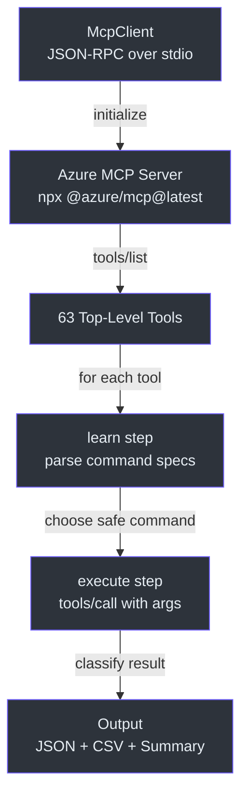
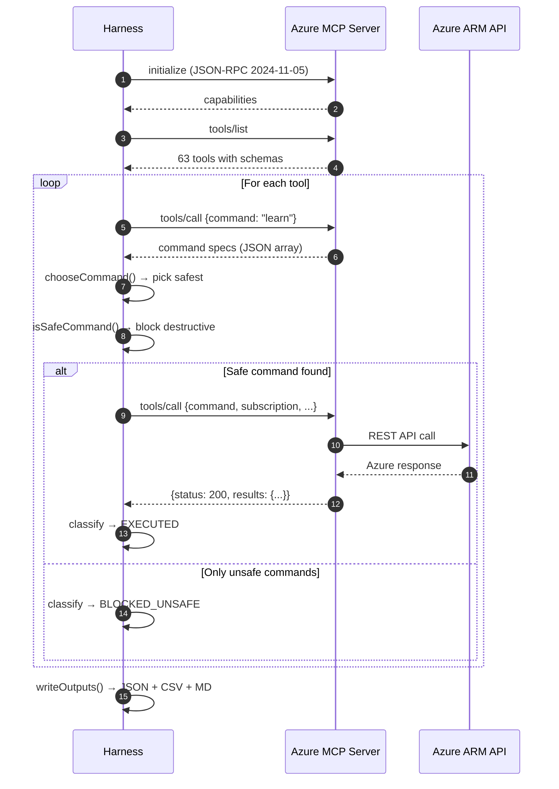
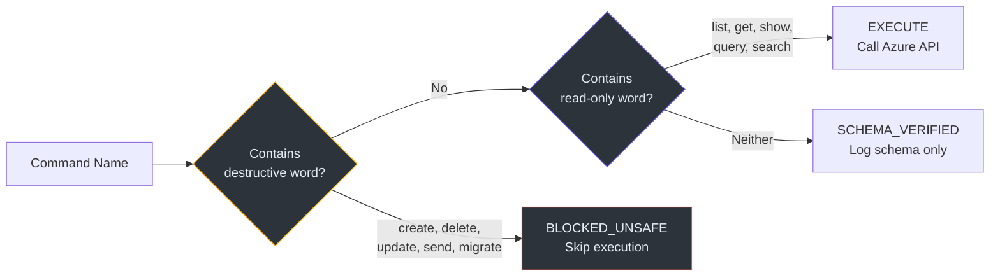

# Azure MCP Evaluation Pipeline

> Generated using the `wiki-page-writer` skill from the [deep-wiki plugin](https://github.com/microsoft/skills/tree/main/.github/plugins/deep-wiki). Every claim cites a source file and line number.

## Why This Exists

The Azure MCP Server exposes 63 top-level tools, but the official documentation does not tell you which ones actually work against a real subscription, which need specific resources, and which have side effects. This evaluation pipeline answers those questions by probing every tool systematically.

## Architecture Overview

<!-- Sources: scripts/run_full_value_evaluation.js:134-160, scripts/run_full_value_evaluation.js:380-420 -->

## Key Components

| Component | File | Purpose | Source |
|-----------|------|---------|--------|
| `McpClient` | `scripts/run_full_value_evaluation.js` | JSON-RPC client wrapping stdio spawn | [L134-160](https://github.com/david-xinyuwei/david-share/blob/master/Agents/Azure-Agent-Skills-In-Action/scripts/run_full_value_evaluation.js#L134-L160) |
| `chooseCommand()` | `scripts/run_full_value_evaluation.js` | Selects safest executable command from tool schema | [L290-310](https://github.com/david-xinyuwei/david-share/blob/master/Agents/Azure-Agent-Skills-In-Action/scripts/run_full_value_evaluation.js#L290-L310) |
| `isSafeCommand()` | `scripts/run_full_value_evaluation.js` | Classifies commands as read-only vs destructive | [L246-260](https://github.com/david-xinyuwei/david-share/blob/master/Agents/Azure-Agent-Skills-In-Action/scripts/run_full_value_evaluation.js#L246-L260) |
| `writeOutputs()` | `scripts/run_full_value_evaluation.js` | Writes JSON, CSV, and Markdown summary | [L350-410](https://github.com/david-xinyuwei/david-share/blob/master/Agents/Azure-Agent-Skills-In-Action/scripts/run_full_value_evaluation.js#L350-L410) |
| `classify()` | `scripts/run_full_value_evaluation.js` | Maps HTTP status to result category | [L118-130](https://github.com/david-xinyuwei/david-share/blob/master/Agents/Azure-Agent-Skills-In-Action/scripts/run_full_value_evaluation.js#L118-L130) |

## Evaluation Flow

<!-- Sources: scripts/run_full_value_evaluation.js:420-530 -->

## Safety Classification

The harness never executes destructive operations. Commands are classified using two word lists:

<!-- Sources: scripts/run_full_value_evaluation.js:20-38 (destructiveWords), scripts/run_full_value_evaluation.js:40-50 (readOnlyWords) -->

| Category | Count | Meaning | Source |
|----------|:-----:|---------|--------|
| EXECUTED | 45 | Safe command returned live data | [evaluation results](https://github.com/david-xinyuwei/david-share/blob/master/Agents/Azure-Agent-Skills-In-Action/evaluation/results/full_value_evaluation.json) |
| SCHEMA_VERIFIED | 9 | Valid schema but missing required resource | Same file |
| TOOL_ERROR | 5 | Tool callable but returned server error | Same file |
| BLOCKED_UNSAFE | 2 | Only destructive commands available | Same file |
| FAILED | 2 | No usable schema or runtime result | Same file |

## Output Artifacts

| File | Format | Content | Source |
|------|--------|---------|--------|
| `full_value_evaluation.json` | JSON | Complete per-tool records with evidence | [evaluation/results/](https://github.com/david-xinyuwei/david-share/tree/master/Agents/Azure-Agent-Skills-In-Action/evaluation/results) |
| `full_value_matrix.csv` | CSV | Flat table for spreadsheet analysis | Same directory |
| `full_value_summary.md` | Markdown | Human-readable summary with matrix table | Same directory |

## Related Pages

| Page | Relationship |
|------|-------------|
| [README — Azure Evidence Stack](../../../README.md#azure-evidence-stack-what-we-actually-ran) | High-level narrative of what we ran and why |
| [README — Full Run Results](../../../README.md#full-run-all-63-azure-mcp-top-level-tools) | Detailed per-tool results table |
| [README — Skills vs No-Skills](../../../README.md#skills-vs-no-skills-what-the-run-proves) | What the run proves about skill value |
