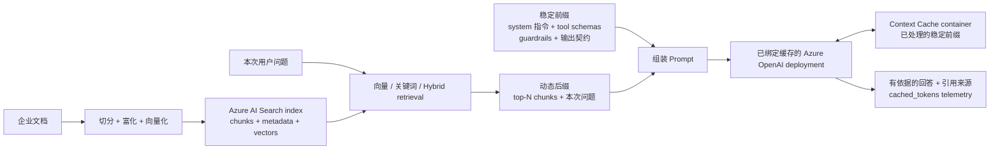

# Azure Context Cache 客户评估

[](https://github.com/david-xinyuwei/david-share/actions/workflows/azure-context-cache-e2e-validation-ci.yml)
[](https://www.python.org/)
[](https://learn.microsoft.com/powershell/)
[](https://github.com/Azure/AzureContextCache/commit/7d1029a5e8b59b1805e70992c85ffe6798d2f47a)
[](../../LICENSE)

[英文版](README.md) | [源码](https://github.com/david-xinyuwei/david-share/tree/master/Agents/Azure-Context-Cache-E2E-Validation) | [官方源码](https://github.com/Azure/AzureContextCache)

本仓库用于评估 Azure OpenAI 的显式上下文缓存能力，面向需要重复使用系统指令、工具定义、示例或参考资料的应用。

**如果只读一段，请读这一段。** Context Cache 的价值在于**治理与所有权**，不在于缓存更快。它把缓存变成客户订阅、区域和 RBAC 边界内的一个具名 Azure 资源，生命周期由客户自己声明。这些能力本仓库都已对真实 Azure 控制面完成验证。一次已完成、先测绑定组的观测在空闲 `43.83` 小时后没有命中。由于绑定组和对照组共用同一缓存键会互相污染，当前正在进行更严格的 paired-prefix（双前缀隔离）后续实验：两个隔离组都独立通过了预热阶段校验（cached tokens 均为 `0 -> 2304`），但超过 24 小时的跨天验证尚未执行。因此本仓库不声称增量命中率、成本或延迟收益。

## 先看结论

| 客户要回答的问题 | 当前答案 |
|---|---|
| 站得住的采用理由是什么？ | 治理：客户订阅与区域内一个具名、可审计、受 RBAC 约束的缓存资源，生命周期由客户声明。本仓库已通过 ARM 回读验证 |
| 它的缓存效果比免费的默认 prompt caching 更好吗？ | **尚未建立。** 一次已完成、先测绑定组的观测在空闲 `43.83` 小时后冷启动。更严格的双前缀隔离实验中，绑定组和对照组均已通过预热校验，但超过 24 小时的跨天验证尚未完成。详见[跨天复用：已完成观测与独立前缀后续实验](#跨天复用已完成观测与独立前缀后续实验) |
| 它比默认 prompt caching 更快吗？ | **无法支持这个说法。** 只比较两组都命中的请求时，延迟相差 `170 ms`，小于任一组自身的标准差，而且差异方向在不同阶段发生反转 |
| 可以假设不同模型部署之间缓存隔离吗？ | **不可以。** 实测观测到同一 Azure OpenAI 账户下两个模型部署之间的前缀缓存状态被**双向**复用 |
| 下一步做什么？ | 如果需求是治理，可以采用。如果需求是跨天复用，请等待或复现采用独立缓存键的双前缀跨天验证，再决定是否投入 |

## 适用场景

| 评估结论 | 工作负载模式 | 建议 |
|---|---|---|
| **建议评估** | 长系统/开发者指令、稳定工具目录、少样本示例或共享政策 | 把可复用内容放在前部，把变化的任务数据放在末尾 |
| **建议评估** | 客户支持、代码/合规审查、文档密集型助手和受控智能体工作流 | 规则、工具或参考资料会跨请求重复使用时进入评估 |
| **满足条件后评估** | 早期对话历史保持稳定、后续内容仅追加的多轮对话 | 验证早期前缀能否保持字节完全一致 |
| **暂不优先** | 短提示词，或请求前部频繁变化 | 可复用前缀有限，通常不应优先投入 |
| **暂不优先** | 一次性请求，或每次请求开头都是高度个性化内容 | 缓存命中率通常较低 |
| **满足条件后评估** | 需要承诺精确成本节省或吞吐提升的业务场景 | 使用客户数据单独做基准测试，并按当前价格建模 |

## Context Cache 专属验证

| 验证对象 | 验证方法 | 结果 | 能说明什么 |
|---|---|---|---|
| 具名缓存资源 | 回读 ARM 资源 | `Microsoft.Storage/contextCaches/<name-prefix>-cache` 及 `default-container` 均为 `Succeeded`，TTL 为 7 天 | 客户订阅中存在可管理、可审计的显式缓存资源 |
| 模型部署绑定 | 交叉核对 ARM 输出、模型部署属性和容器资源 ID | 三处 `contextCacheContainerId` 完全一致 | Azure OpenAI 模型部署已显式绑定到该具名容器 |
| 数据面路径 | 在绑定保持有效时调用 Responses API | `6/6` 次调用成功 | 绑定后的官方产品路径可以端到端运行 |
| 超出默认上限的跨天复用 | 在已固证的 `43.83` 小时空闲窗口后，先调用绑定组 | **未观测到** —— 绑定组返回 `cached_tokens=0` | 在本环境中，容器声明的 7 天 TTL 没有带来跨天的数据面命中 |
| 采用独立缓存键的跨天差分 | 每个实验组使用 token 数相同、内容不同的独立前缀；分别预热后至少等待 `26` 小时 | **预热校验已通过；跨天验证尚未完成** —— 两组均为 `0 -> 2304` | 基线有效，但当前还不能判断缓存能否保留超过 24 小时 |
| 模型部署之间的缓存隔离 | 对比同一 Azure OpenAI 账户内的绑定组和对照组 | **不存在** —— 双向均观测到复用 | 同一账户下的不同模型部署不构成缓存隔离边界 |
| 增量命中率／成本／延迟收益 | 与模型默认 prompt caching 做对照 | **尚未建立** | 任何方向都得不出可支持的结论 |

本次 E2E 使用已获 Private Preview 准入的 Azure 订阅，并将官方 Quickstart 固定到 commit `7d1029a5e8b59b1805e70992c85ffe6798d2f47a`。通用缓存遥测的单次运行数字保留在[公共证据说明](evidence/README.md)中，仅供审计，不作为 Context Cache 增量价值证据。

## 跨天复用：已完成观测与独立前缀后续实验

这是唯一一个仅凭文档无法回答的问题，因此本仓库直接做了实测。

**当前证据状态（`2026-08-24`）。** 下文先测绑定组、空闲 `43.83` 小时的运行是已完成的历史观测，仍按原样公开。由于两个模型部署使用了同一个内容型缓存键，它不是最终的严格匹配条件双组对照。更严格的后续实验在原始稳定 prompt 之前给两个实验组加入等长但不同的标记。预热阶段两组均通过（`linked: 0 -> 2304`、`control: 0 -> 2304`，每次 `input_tokens=2513`）。至少等待 `26` 小时后，每组各执行一次的跨天验证仍未完成，因此当前**还不能得出新的跨天保留结论**。详见 [`paired-prefix-follow-up.json`](evidence/paired-prefix-follow-up.json)。

**待检验的假设。** 官方文档说明：模型默认的 prompt caching 在空闲 5–10 分钟内清除，`in_memory` 保留最长不超过 1 小时；启用 extended retention 后上限为 **24 小时**。而 Context Cache 容器声明 `timeToLive = 7` 天。如果容器确实支撑更长的复用窗口，那么在空闲超过 24 小时之后，绑定容器的模型部署应该仍能命中，而未绑定的模型部署不能。

**为什么这个实验很难做得诚实。** 缓存实验会自我污染。先被调用的实验组会处理前缀，可能顺带为另一组预热共享状态。本工作早期的一个阶段先调用了未绑定缓存的对照组，虽然消除了一种污染，却失去了归因能力：对照组自己的冷启动预热了前缀，后续绑定组即使命中也无法说明原因。

**已完成的调用顺序控制。** 长时间空闲后，先调用**已绑定**容器的模型部署，并把它作为第一个请求；运行前由机器逐项校验前置条件。

| 前置条件 | 实测值 |
|---|---|
| 自上一阶段起账户无推理流量 | Azure Monitor `AzureOpenAIRequests` 逐小时桶：仅一个非零桶，且就是上一阶段本身 |
| 空闲时长超过文档给出的默认缓存上限 | 空闲 `43.83` 小时 vs `24` 小时上限 |
| 容器生命周期仍未到期 | 7 天 TTL 剩余 `124.17` 小时，`provisioningState=Succeeded` |
| 绑定组确实已绑定 | `contextCacheContainerId` 存在 |
| 对照组确实未绑定 | `contextCacheContainerId` 为 `null` |
| 两组其他条件完全一致 | 均为 `gpt-5.4` / `2026-03-05-contextcache`，capacity `100`，前缀字节一致 |

固证脚本采用 fail-closed 设计：任一前置条件不满足即拒绝执行，而不是产生一个具有误导性的通过结果。

**实测结果。**

| 顺序 | 实验组 | `cached_tokens` | 延迟 | 如何解读 |
|---:|---|---:|---:|---|
| 第 1 个 | **已绑定缓存组** | **`0`** | `3182 ms` | 冷启动。容器声明的 7 天生命周期没有服务这个请求 |
| 第 2 个，`+3.2` 秒 | **未绑定缓存的对照组** | **`2304`** | `1678 ms` | 命中；绑定组刚完成的冷启动处理顺带预热了该前缀 |

两次调用均为 `HTTP 200`，`input_tokens` 同为 `2467`，前缀 SHA-256 相同。

**这个实验建立了什么。** 两个可归因的结论：

1. **容器声明的 7 天生命周期在本环境中没有带来跨天的缓存命中。** 绑定关系是已验证的控制面事实，但在空闲 43.83 小时后没有转化为数据面的缓存读取。这否证了本环境下的复用窗口假设；这不是缺陷报告，Private Preview 也可能发生变化。
2. **前缀缓存状态会跨越同一账户内的模型部署边界，且是双向的。** 未绑定缓存的模型部署读到了 `2304` 个 cached token，而这个前缀此前只有绑定缓存的模型部署处理过。结合早期阶段中反方向的观测，这意味着**同一 Azure OpenAI 账户下的不同模型部署不能被假定为缓存隔离边界**——这是一个与安全和架构设计相关的事实，且不需要任何基线对比即可成立。

**这个实验没有建立什么。** 它没有说明服务内部采用了哪种存储机制，结论也不能推广到本次账户、区域、模型、前缀、间隔和 Preview 版本之外。单一环境中的一次已完成运行，只能说明本次条件下发生了什么。双前缀隔离后续实验仍未完成，最终可能确认、否定，或仍然无法判断 Context Cache 是否额外延长了保留时间。

完整方法、前置门、完整性校验和原始数据行见 [`docs/METHOD-CN.md`](docs/METHOD-CN.md#跨天归因实验)。

## 它比默认 prompt caching 更快吗

不更快——而且数据足够清楚，因此这个说法不应该写出去。

只比较**两组都命中的请求**（排除冷启动和未命中调用，因此比较对象都是缓存读取）：

| 实验组 | 样本数 | 均值 | 标准差 |
|---|---:|---:|---:|
| 已绑定缓存组 | 11 | `1877.8 ms` | `365.3 ms` |
| 未绑定缓存的对照组 | 11 | `2047.9 ms` | `766.8 ms` |

`170 ms` 的差值**小于任一组自身的标准差**，而且差异方向在不同阶段发生反转（`−14.9`、`−672.2`、`+230.0` ms）。方向不稳定、且完全淹没在自身噪声中的差值，不能视为真实效应。

架构上也不应期待它更快。官方文档描述 extended prompt cache retention 的机制是把 key/value tensor 卸载到 **GPU 本地存储**，而 Context Cache 容器是 **`Microsoft.Storage`** 资源提供程序下的资源。距离加速器更远的存储层级不应被期待返回得更快。

**数据真正支持的结论：** 命中快于未命中。跨全部阶段，未命中均值 `3368.5 ms`，命中均值 `1962.9 ms`，命中快 `1405.6 ms`（`41.7%`）。速度收益来自**把未命中变成命中**，而不是来自某一种缓存本身更快。因此任何延迟论证都必须锚定到「一条路径会未命中、另一条会命中」的具体时刻，而本仓库在跨天实验中没有找到这样的时刻。

## 客户问题与业务价值

长且稳定的 prompt 前缀可能通过缓存减少重复的 tokenization 和 prefill，但这类处理复用**不是 Context Cache 独有**。模型默认的 prompt caching 同样可能返回 `cached_tokens`，并影响延迟、输入 token 成本和容量。

因此，客户真正需要判断的不是“缓存能不能命中”，而是“是否需要把缓存变成自己订阅中可拥有、可绑定、可检查、可治理的显式资源”。

| Context Cache 特有能力 | 相比默认 prompt caching 多了什么 | 客户可以怎么验证 |
|---|---|---|
| 具名 Azure 资源 | 缓存账户和容器存在于客户订阅与区域中 | 回读 `Microsoft.Storage/contextCaches` 资源及 RBAC 边界 |
| 显式 deployment 绑定 | deployment 通过 `contextCacheContainerId` 指向指定容器 | 对比 deployment 属性与容器资源 ID |
| 客户声明的生命周期 | 容器提供可配置的 `timeToLive` | 回读容器 TTL，并按客户请求间隔做跨窗口验证 |
| 可审计的生命周期操作 | 资源可以检查、改绑、轮换或解绑 | 在 ARM 中验证资源与绑定状态变化 |

只有在其他条件保持一致的对照实验中，与默认 prompt caching 比较延迟、命中率和成本，才能判断 Context Cache 是否带来增量价值。

## 收益到底是什么

### Prompt caching 省的是什么

应用仍会在每次请求中发送完整前缀。Prompt caching 可能省掉服务端对这段前缀的**重复处理**，但不会减少客户端发送的数据量。

固定版本的官方资料说明，服务会保存稳定前缀经过 tokenization 和 pre-attention（预先完成注意力计算）后的中间表示。后续请求只要以相同内容开头，就可以复用这份结果。因此，可能改善的是延迟、输入 token 成本和容量效率。

这是 prompt caching 的通用机制，不是本仓库已经测出的 Context Cache 增量收益。收益仍取决于两个条件：前缀足够长，而且足够稳定。可复用前缀很短，或前部字节频繁变化时，即使启用缓存，收益也会很有限。

### 已经有默认 prompt caching，为什么还要它

[通用 Azure OpenAI prompt caching 指南](https://learn.microsoft.com/azure/ai-foundry/openai/how-to/prompt-caching)明确说明，支持的模型默认启用缓存。因此，客户自然会问：既然已有默认缓存，为什么还要部署 Context Cache？

固定版本的官方资料给出的核心区别是：默认缓存由服务隐式管理，是否命中不由客户控制；Context Cache 则由客户显式配置。客户创建具名容器，将其绑定到 deployment，并控制缓存生命周期。

| 维度 | 默认 prompt caching（隐式） | Azure Context Cache（显式） |
|---|---|---|
| 性质 | 尽力而为，机会性命中 | 显式受控：由客户部署并绑定的具名资源 |
| 生效门槛 | 至少 1,024 token，且前 1,024 token 必须完全一致 | 同样的前缀匹配约定，通过已绑定的容器表达 |
| 生命周期控制 | 由服务管理，按请求选择保留策略 | 客户在自己拥有的资源上设置容器 `timeToLive` |
| 驻留与隔离 | 由服务管理；prompt 缓存不跨 Azure 订阅共享 | 缓存账户与容器位于客户的订阅、区域和 RBAC 边界内 |
| 治理能力 | 不是可检查的资源 | 一个可审计、可改绑、可轮换、可解绑的 ARM 资源 |
| 客户端改造 | 无需 | 无需；只在 deployment 上设置 `properties.contextCacheContainerId` |

这张表说明的是**生命周期和控制权**，不是命中率。对于持续重复出现的前缀，默认缓存可能已经足够。

当客户需要把数据驻留、生命周期声明和资源生命周期变成自己拥有、可检查、可治理的属性时，Context Cache 才体现出差异。

有一点必须显式提醒：**声明的生命周期是配置属性，不是已测得的复用保证。** 公开文档给出的默认缓存保留时间可以作为参照：

- 内存态缓存通常在空闲 5 到 10 分钟后清除，最晚在最后一次使用后一小时内释放。
- 对于支持的模型，扩展保留最长可到 24 小时。

Context Cache 的容器 `timeToLive` 可以按天设置，是一个更长的**声明**窗口。但本仓库的[已完成跨天观测](#跨天复用已完成观测与独立前缀后续实验)在空闲 `43.83` 小时后先调用绑定组，得到的是 `cached_tokens=0`；更严格的双前缀跨天验证仍未完成。因此不要把「7 天」读成「可以复用 7 天」，应读成「你在自己拥有的资源上声明的生命周期」；如果买的就是跨天复用，请在自己的环境中单独验证。

### 容器生命周期最长能设多久

这里需要区分三个事实：

| 陈述 | 状态 | 依据 |
|---|---|---|
| 固定版本 Quickstart 交付的容器生命周期是 `7` 天 | **已验证** | `timeToLive` 声明在模板的 `variables` 块中，且实际部署出的容器回读到同一个值 |
| 这个值本来就是让客户改的 | **已验证** | 官方自定义指引把客户直接指向同一个 variables 块修改 TTL，模板既没有 allowed-value 列表也没有最大值约束 |
| 某个具体天数是资源提供程序接受的上限 | **未验证** | 固定版本仓库、ARM 模板和 Bicep 模块都没有公布上限，本次验证也没有做这方面的测试 |

因此，`7` 天只是**默认值，不是上限**。如果客户需要更长的保留时间，应向 Microsoft 产品团队确认支持范围，或通过一次显式部署测试验证。不能把 `7` 天写成产品限制。

### 如何在自己的环境中计算 Context Cache 的增量收益

本仓库已有一次已完成的否定跨天观测，同时正在进行更严格的 paired-prefix 后续实验，见[跨天复用：已完成观测与独立前缀后续实验](#跨天复用已完成观测与独立前缀后续实验)。下面的流程不是用来确认收益的模板，而是用你自己的前缀、模型、区域和时间间隔检验假设的方法。如果你的实测与我们不一致，以你的实测为准。

不能把任何单次运行观测到的 `cached_tokens` 直接计为 Context Cache 收益。应在模型、版本、prompt、请求顺序和时间间隔一致的条件下，分别测量默认 prompt caching 组与 Context Cache 组，再比较两组实际成本：

```text
默认缓存组月成本 = 默认缓存组未命中 token × 输入单价
                 + 默认缓存组命中 token   × 缓存读取单价

Context Cache 组月成本 = Context Cache 组未命中 token × 输入单价
                       + Context Cache 组命中 token   × 缓存读取单价

Context Cache 增量节省 = 默认缓存组月成本 - Context Cache 组月成本
```

只有结果大于零，才能建立增量成本收益。金额还需要使用目标模型、区域和部署类型的当前公开价格；Standard 与 Provisioned 的缓存读取折扣不同，不能使用统一换算系数。

| 变量 | 对收益的影响 | 验证方法 |
|---|---|---|
| 稳定前缀长度 | 低于生效门槛就没有任何可复用内容，而官方指引把更大的节省与更长的稳定前缀直接关联 | 对真实的系统提示词、工具目录、护栏规则和固定参考资料做 tokenize |
| 前缀字节稳定性 | 前部只要有一个字符变化就会 miss | 在真实生产流量样本上 diff 拼装后的前缀，包括序列化方式和字段顺序 |
| 请求间隔与缓存生命周期的关系 | 决定下一次匹配请求到达时，前缀是否仍在缓存中 | 按相同前缀分组统计请求间隔，而不是只看全局请求速率 |
| 对照条件一致性 | 决定两组差异能否归因给 Context Cache | 固定模型、版本、基础 prompt、后缀、token 数、并发和时间间隔；只改变绑定状态与等长 cohort 标记 |
| Cache key 隔离（缓存键隔离） | 共用同一前缀会让先调用的一组顺带预热另一组，导致实验**悄然失去归因能力** | 在原始 prompt 前为两组加入不同标记；只有无法隔离缓存键时，才采用先测绑定组的调用顺序 |
| 实验前已固证的空闲窗口 | 没有它，命中可能来自默认缓存而不是容器 | 用 Azure Monitor `AzureOpenAIRequests` 确认账户零流量，并要求空闲时长超过文档给出的 24 小时上限 |

把这些变量组合起来，就得到实际的决策矩阵：

| 你的流量形态 | 默认 prompt caching 免费提供了什么 | 为了缓存收益该加 Context Cache 吗？ |
|---|---|---|
| 匹配前缀持续到达，间隔在秒级到几分钟 | 内存态保留已经覆盖 | **不该。** 会为一个没有实测缓存收益的资源付费。只有需要治理时才采用 |
| 匹配前缀间隔在 1 小时以内 | 内存态保留在空闲 5–10 分钟后释放；设 `prompt_cache_retention="24h"` 即可延长 | **不该。** 一个请求参数就够，零额外成本、零额外资源 |
| 匹配前缀间隔在 1 到 24 小时之间 | 支持的模型系列上，扩展保留覆盖这个窗口 | **不该。** 仍然只需一个请求参数 |
| 匹配前缀按天、按周或按计划批次复用（超过 24 小时） | 按文档已超出扩展保留上限 | **先自己实测。** 已完成、先测绑定组的观测没有看到容器填补缺口；更严格的双前缀跨天验证仍未完成 |
| 必须给缓存资源命名、锁定区域、限定 RBAC、声明生命周期或按需删除 | 无法提供：默认缓存不是可检查的资源 | **该。** 这是已验证的差异化能力，且不依赖任何命中率结论 |

请把这张表当作**选型指南，而不是收益阶梯**。五行里有四行在缓存维度上的答案是「不该」。这是对实测结果的诚实解读，也正因为如此，第五行才可信。如果前缀始终达不到生效门槛，问题在提示词布局，而不在缓存配置。下文的**适用场景**给出了对应建议。

## 能不能查看容器里有什么

这是三个不同的问题，答案也不同。

| 问题 | 答案 |
|---|---|
| 能不能按名字找到 Azure 资源？ | **能。** ARM 可以按资源 ID 回读 cache account 和 container，并看到 `provisioningState`、`modelName`、配置的 `timeToLive`、资源创建时间和绑定状态 |
| 能不能观察容器级缓存活动？ | **微软文档说明可以。** Azure Monitor 于 `2026-08-21` 发布了 `Microsoft.Storage/contextCaches/contextCacheContainers` 的 6 个指标 |
| 能不能列出容器里当前保存的 prompt prefix 或 entry？ | **没有找到公开操作。** ARM 资源 schema、微软官方样例、Azure Monitor 维度和 OpenAI 官方缓存资料均未暴露 entry 名称、内容、条目数、写入时间、过期时间或单个前缀的剩余 TTL |

[Azure Monitor 官方指标页](https://learn.microsoft.com/azure/azure-monitor/reference/supported-metrics/microsoft-storage-contextcaches-contextcachecontainers-metrics)记录了：

| 指标 | 能证明什么 |
|---|---|
| `CacheHitRate` | 成功 lookup 中按 token 加权的缓存命中比例 |
| `ReadTpm` / `WriteTpm` | 容器每分钟汇总读取／写入的 token 数 |
| `LookupLatency` / `ReadLatency` / `WriteLatency` | 汇总操作延迟 |

指标只有 `providerName` 和 `modelName` 两个维度。因此它们能回答**「这个容器在某个时间窗口是否报告了读取、写入或命中」**，不能回答**「前缀 X 此刻是否仍保存在里面」**，也不能查看缓存内容。

当指标 namespace 已在目标环境接通时，可以这样查：

```powershell
$containerId = '<contextCacheContainers 的完整资源 ID>'

az monitor metrics list `
  --resource $containerId `
  --namespace 'Microsoft.Storage/contextCaches/contextCacheContainers' `
  --metrics CacheHitRate ReadTpm WriteTpm `
  --start-time '2026-08-23T00:00:00Z' `
  --interval PT1M `
  --aggregation Average
```

**Private Preview rollout 实测：** 文档已经发布，但本次验证使用的 `centralus` 环境在 `2026-08-23` 尚未暴露该 namespace。Azure CLI 和直接调用 Azure Monitor `2023-10-01` REST API 都返回 `BadRequest: ... is not a supported platform metric namespace`；Diagnostic Settings 返回 `ResourceTypeNotSupported`。这是本环境的 rollout／注册缺口，不能据此否定这些指标在产品范围内已经发布。

当前 [Azure Context Cache 官方仓库](https://github.com/Azure/AzureContextCache)只负责配置容器，并通过每次响应的 `cached_tokens` 观察命中；它没有缓存条目浏览器，也没有列出内部 prefix 的脚本。OpenAI 官方 [Prompt Caching 101](https://github.com/openai/openai-cookbook/blob/main/examples/Prompt_Caching101.ipynb)采用同一种请求级观测：`cached_tokens > 0` 证明发生了缓存命中，但不会把某条缓存暴露成可列举的一等对象。

## 客户业务架构


1. 客户应用把可复用的指令、工具、示例和共享资料放入稳定前缀。
2. 每次变化的用户任务和案例数据追加为动态后缀。
3. 应用继续调用 Azure OpenAI Responses API；已关联的部署会在 Context Cache 容器中查找匹配前缀。
4. 应用持续监控 `cached_tokens`、延迟和请求结果；只有在其他条件保持一致的情况下与默认缓存基线对照，才能把增量收益归因给 Context Cache。

Context Cache 容器是客户订阅中的 Azure 资源。锁定的 Private Preview Quickstart 配置缓存账户、模型专属容器、TTL 和 `contextCacheContainerId` 绑定。

## 客户评估路径

### 前提条件

- Windows 上的 PowerShell 7（`pwsh`）、Git、Azure CLI，以及 AMD64 Windows 上的 64 位 CPython 3.11
- 已获得 Azure Context Cache Private Preview 权限的 Azure 订阅
- `OpenAI.ContextCacheAllowed` 已达到 `Registered`
- 已通过租户允许的用户认证流登录独立 `AZURE_CONFIG_DIR`
- 具备部署资源和分配 `Cognitive Services OpenAI User` 的权限
- 在固定版本官方 README 记录的 `centralus` 或 `swedencentral` 中具备可用模型配额

正式运行会创建计费 Azure 资源并发送模型请求。请使用全新的资源组和唯一名称前缀。检查生成的证据后，再单独决定是否清理资源。

### 运行官方 E2E

```powershell
$env:AZURE_CONFIG_DIR = "$HOME\.azure-context-cache-validation"
$subscriptionId = "YOUR-SUBSCRIPTION-ID"

az account set --subscription $subscriptionId
az account show --query '{name:name,id:id,tenantId:tenantId,user:user.name}' -o json

pwsh -NoProfile -File .\scripts\run_official_e2e.ps1 `
  -SubscriptionId $subscriptionId `
  -ResourceGroup "rg-context-cache-validation" `
  -Location "centralus" `
  -NamePrefix "ccvalidate" `
  -Runs 6
```

先使用 `-WhatIf`。它只执行有超时上限的 Azure 只读前置检查，不克隆源码、不部署资源，也不发送模型请求。

正式运行要求使用全新的资源组。运行器会在源码树之外创建私有证据目录，但不会自动清理 Azure 资源。网络受限时，可以用 `-ExistingUpstreamDirectory` 指向固定 commit 的本地检出副本。来源控制详见[方法与证据链](docs/METHOD-CN.md)。

### 本地验证

```powershell
python -m unittest discover -s tests -v
python scripts\demo_code_validator.py
python scripts\audit_public_content.py
python scripts\validate_repo.py
```

这些检查不需要访问 Azure。还可以用现有的固定 commit 检出副本核对上游源码锁：

```powershell
python scripts\verify_upstream.py `
  --upstream-dir "PATH-TO-AzureContextCache" `
  --lock .\UPSTREAM_LOCK.json `
  --output "EMPTY-PRIVATE-OUTPUT-DIRECTORY"
```

## 数据从哪里来，缓存实际存在哪里

### 已验证路径的资源拓扑

这里的 `Microsoft.Storage` **不是**普通 Azure Storage account（存储账户）或 Blob container（Blob 容器）。固定版本的 Private Preview 会创建专用的 `Microsoft.Storage/contextCaches` 资源及其模型专属子容器。应用不会把 prompt 预先上传到 Blob Storage，也不会直接调用缓存资源。

| 对象 | 已验证路径中的位置 | 精确契约 | 存放或执行的内容 |
|---|---|---|---|
| 请求前的稳定来源 | 官方 Quickstart 的私有本地副本 | `demo/system_prompt.md` | 约 2.4K token 的代码审查指令；每次调用保持字节完全一致 |
| 请求前的变化来源 | 同一个 Quickstart 私有副本 | `demo/diffs/*.diff` | 每次调用在稳定 system prompt 之后追加一个不同的 PR diff |
| Azure OpenAI 账户 | 已开通的私有订阅、新建验证资源组、`centralus` | `Microsoft.CognitiveServices/accounts/<name-prefix>-aoai` | 承载 Azure OpenAI endpoint |
| Azure OpenAI 部署 | Azure OpenAI 账户的子资源 | `deployments/context-cache-deployment`，模型 `gpt-5.4`，版本 `2026-03-05-contextcache` | 接收 Responses API 请求，并配置 `properties.contextCacheContainerId` |
| Context Cache 账户 | 同一订阅、资源组和区域 | `Microsoft.Storage/contextCaches/<name-prefix>-cache`，`accountKind = Regional` | 客户通过 Azure RBAC 管理的缓存命名空间 |
| Context Cache 容器 | Context Cache 账户的子资源 | `contextCacheContainers/default-container`，provider `OpenAI`，模型 `gpt-5.4`，`timeToLive = 7` 天 | 由服务托管的存储单元，存放可复用的前缀处理结果 |

可检查的 ARM resource ID（资源 ID）为：

```text
/subscriptions/<subscription-id>/resourceGroups/<resource-group>/providers/Microsoft.Storage/contextCaches/<name-prefix>-cache/contextCacheContainers/default-container
```

按 README 示例使用 `-NamePrefix ccvalidate` 时，缓存资源是 `ccvalidate-cache/default-container`，与它绑定的 Azure OpenAI 部署是 `ccvalidate-aoai/context-cache-deployment`。公共 Repo 有意隐去实际验证订阅、资源组和名称前缀；本次运行已确认资源位于私有订阅中一个新建的 `centralus` 资源组。

官方资料把缓存内容描述为稳定前缀经过 tokenization 和 pre-attention 后的表示。它不是客户可寻址的文件、Blob URL 或 Blob object。上面的 resource ID 是公开的 control-plane（控制面）边界；服务内部的物理存储布局不属于本次验证的范围。

### 端到端数据流

| 步骤 | 所在位置 | 实际发生的动作 | 可观察结果 |
|---:|---|---|---|
| 1 | 本地 Quickstart 私有副本 | Python 读取 `system_prompt.md` 和一个 `.diff` 文件 | 客户端没有向 Context Cache 资源预上传 prompt |
| 2 | 客户应用 → Azure OpenAI | 把稳定 system prompt 放在请求前部，把变化的 diff 放在末尾，组成一次 Responses API 请求 | 普通的 `POST /openai/v1/responses` 调用 |
| 3 | 已绑定缓存的 Azure OpenAI 部署 | `contextCacheContainerId` 让 deployment 透明查询 `default-container` | 应用始终只调用 Azure OpenAI，不需要单独的缓存 SDK 调用 |
| 4 | 第一次请求观测 | Azure OpenAI 处理包含稳定前缀与动态后缀的请求 | 第 1 次调用返回 `cached_tokens = 0`；客户端遥测不能证明服务端写入了哪一层缓存 |
| 5 | 后续请求观测 | 字节完全一致的前缀与不同的 PR diff 再次发送 | 第 2–6 次调用均返回 `cached_tokens = 2304`；由于默认 prompt caching 同时启用，不能把这些命中归因给具名容器 |
| 6 | Azure OpenAI → 客户应用 | 正常返回模型结果和 usage telemetry（用量遥测） | `usage.input_tokens_details.cached_tokens`、输出 token、延迟和状态 |

固定样例同时使用两个不同的保留设置：Context Cache 容器配置 `timeToLive = 7` 天，而每个 gpt-5.4 请求设置 `prompt_cache_retention = "24h"`。两者都来自官方样例，但不是同一个设置。本仓库验证了它们的配置值，不从这两个值推断服务内部的存储分层。

### 应用如何调用

下面保留了固定官方 Demo 的核心调用路径。请求中不需要出现 cache account 或 container，因为 Azure OpenAI deployment 已经预先与它们绑定。

```python
from pathlib import Path

import httpx
from azure.identity import DefaultAzureCredential

endpoint = "https://YOUR-AOAI-ACCOUNT.openai.azure.com"
deployment = "context-cache-deployment"
stable_prefix = Path("demo/system_prompt.md").read_text(encoding="utf-8")
diff_name = "01-sql-injection.diff"
dynamic_suffix = Path(f"demo/diffs/{diff_name}").read_text(encoding="utf-8")

token = DefaultAzureCredential(
  exclude_interactive_browser_credential=False
).get_token("https://cognitiveservices.azure.com/.default").token

payload = {
  "model": deployment,
  "input": [
    {
      "type": "message",
      "role": "system",
      "content": [{"type": "input_text", "text": stable_prefix}],
    },
    {
      "type": "message",
      "role": "user",
      "content": [{
        "type": "input_text",
        "text": f"Review this PR diff:\n\nFile: {diff_name}\n\n{dynamic_suffix}",
      }],
    },
  ],
  "max_output_tokens": 200,
  "prompt_cache_retention": "24h",
}

response = httpx.post(
  f"{endpoint}/openai/v1/responses?api-version=preview",
  headers={"Authorization": f"Bearer {token}", "Content-Type": "application/json"},
  json=payload,
  timeout=240,
)
response.raise_for_status()
result = response.json()
print(result.get("output_text") or result.get("output"))
print(result["usage"]["input_tokens_details"]["cached_tokens"])
```

生产应用沿用同一个原则：把长期复用的指令、工具、政策、示例或参考资料放在前部，把当前用户输入或案例数据追加到末尾，并持续监控每次响应中的 `cached_tokens`。

### 在客户环境中找到这些资源

使用运行器接收的同一个资源组和 `-NamePrefix`。以下命令可以找到逻辑缓存资源并证明 deployment 绑定，不会输出任何秘密：

```powershell
$subscriptionId = "YOUR-SUBSCRIPTION-ID"
$resourceGroup = "YOUR-RESOURCE-GROUP"
$namePrefix = "YOUR-NAME-PREFIX"

az resource list --subscription $subscriptionId --resource-group $resourceGroup `
  --query "[?contains(type, 'contextCaches') || type=='Microsoft.CognitiveServices/accounts/deployments'].{name:name,type:type,location:location}" `
  -o table

$containerId = az resource show --subscription $subscriptionId `
  --resource-group $resourceGroup `
  --resource-type "Microsoft.Storage/contextCaches/contextCacheContainers" `
  --name "${namePrefix}-cache/default-container" `
  --api-version "2026-01-01-preview" --query id -o tsv

az resource show --subscription $subscriptionId `
  --resource-group $resourceGroup `
  --resource-type "Microsoft.CognitiveServices/accounts/deployments" `
  --name "${namePrefix}-aoai/context-cache-deployment" `
  --api-version "2026-03-15-preview" `
  --query "{deployment:name,model:properties.model,contextCacheContainerId:properties.contextCacheContainerId}" `
  -o json

Write-Output "Expected container: $containerId"
```

返回的 `properties.contextCacheContainerId` 必须与 `$containerId` 完全相同。在 Azure Portal 中，同一批资源位于验证资源组内，分别属于 Azure OpenAI 账户和 `Microsoft.Storage/contextCaches` 资源类型；这里没有可供浏览的普通 Blob container。

## 是否必须使用 RAG

**不需要。** Azure Context Cache 和 RAG 解决的是两个不同问题：

| 能力 | 首要问题 | 存储内容 | 应用如何使用 |
|---|---|---|---|
| 基于 Azure AI Search 的 RAG | “这次问题需要哪些客户知识？” | Search index 或 knowledge source 中的原始文档、chunks、metadata 和 embeddings | 应用或 Agent 针对每个问题显式检索排名靠前的结果，再把它们加入 prompt |
| Azure Context Cache | “已经提供过的哪些 prompt 前缀不必从头处理？” | 具名 Context Cache 容器中由服务管理的、经过 tokenization 和 pre-attention 处理后的稳定前缀表示 | 应用发送正常模型请求；已绑定的 deployment 自动匹配并复用前缀 |

Context Cache 不能替代文档摄取、chunking、embedding、vector/hybrid search、relevance ranking、引用、内容新鲜度或文档级授权。它不是 vector database，也不会检索语义相似内容。

### 如何与客户 RAG 应用组合



高价值的 RAG 组合方式是：

1. 企业内容仍存放在权威数据源和 RAG index 中，并沿用原有治理方式。
2. 针对本次用户问题检索相关 chunks；这些结果通常每次都不同。
3. 把稳定的应用指令、tool schemas、安全政策、输出格式和真正固定的参考内容放在模型请求的**最前部**。
4. 把检索得到的 top-N chunks 和本次用户问题追加到**末尾**。
5. 把完整请求发送给已绑定缓存的 Azure OpenAI deployment，并监控 `cached_tokens`。

| RAG prompt 组成 | 缓存预期 | 原因 |
|---|---|---|
| System/developer 指令、工具定义、guardrails、响应 schema | **强候选** | 内容较长，并在大量请求中保持一致 |
| 每次请求都附带的固定产品手册或政策 | **字节一致且未超过 TTL 时可作为候选** | 相同的大段参考前缀会重复出现 |
| Vector/hybrid search 针对本次问题返回的 top-N chunks | **通常是动态内容** | 不同问题会返回不同 chunks 或排序 |
| 用户问题、对话尾部、当前案例数据 | **动态后缀** | 每次请求都会变化 |

因此，当 RAG 应用在每次检索调用外围都包含很长的稳定编排前缀时，采用 Context Cache 的论证可能更有说服力；但这不代表所有 RAG 检索结果都可以自动复用。只要 chunk 内容、顺序、security trimming（安全裁剪）结果或前部个性化内容发生变化，就可能无法命中相同前缀。

> **验证状态：** 当前发布的实跑 E2E 验证的是官方非 RAG Code Reviewer workload。上面的 RAG 组合是本仓库依据 Microsoft RAG 指南和官方 Context Cache 前缀契约推导出的模式，不是 Microsoft 官方联合参考架构；本仓库也尚未使用客户 Search index 对其进行 benchmark。

## 测试信息、步骤与证据

### 测试信息

| 项目 | 已验证值 |
|---|---|
| 观测日期 | `2026-08-18` |
| 执行面 | `LOCAL_WINDOWS` |
| Azure 区域 | `centralus` |
| 官方源码 | commit `7d1029a5e8b59b1805e70992c85ffe6798d2f47a` 对应的 `Azure/AzureContextCache` |
| 运行时 | CPython `3.11.9 AMD64`；通过 PowerShell 7 编排，并使用 Azure CLI 用户身份认证 |
| 部署 | `gpt-5.4`，模型版本 `2026-03-05-contextcache`，Responses API `preview` |
| 缓存契约 | 模型专属 Context Cache 容器、7 天 TTL，以及显式 `contextCacheContainerId` 绑定 |
| 请求模式 | 1 次预热请求，随后并行发送 5 次请求 |

本表描述的是经过脱敏的验证环境，不代表区域支持或生产容量建议。

### 测试步骤

1. **验证官方源码。** `scripts/verify_upstream.py` 解析固定 Git 对象，核对全部 25 个执行输入的 SHA-256，并且只把这些已验证字节写出到公共源码树之外。
2. **执行 Azure 只读前置检查。** `scripts/run_official_e2e.ps1 -WhatIf` 检查当前订阅、在线 ARM 读取、必要资源提供程序、受控 Preview 功能、运行时架构和目标区域前提条件；此步骤不部署资源，也不发送模型请求。
3. **部署官方 Quickstart。** 实跑运行器安装具有精确 hash 的 Windows AMD64 CPython 3.11 依赖，然后在私有运行目录中调用字节完全一致的官方 `scripts/quickstart.ps1 -SkipPython`。
4. **验证数据面。** 官方 Demo 先发送 1 次预热请求，再使用相同的稳定前缀并行发送 5 次 Responses API 请求。
5. **独立验证结果。** `scripts/parse_demo_output.py` 解析全部 6 条调用记录；缺行、传输错误、零阈值、零延迟或预热后命中不足都会失败。`scripts/validate_arm_summary.py` 独立核对部署成功状态、模型身份、缓存容器 ID、提供程序、TTL 和部署绑定。
6. **执行离线回归门。** 在发布 commit 上运行单元测试、真实性检查、公共内容审计、Repo gate、依赖检查、PowerShell 语法检查、CI 矩阵和 CodeQL。

### 测试脚本

| 脚本或测试集 | 在测试中的职责 | 失败即拒绝条件 |
|---|---|---|
| [`scripts/run_official_e2e.ps1`](scripts/run_official_e2e.ps1) | Azure 前置检查、已验证源码落盘、官方 Quickstart 执行、日志捕获和证据编排 | 配置目录复用、运行时不符、资源组已存在、Azure 超时/报错、官方进程非零退出或证据验证失败时立即停止 |
| [`scripts/paired_prefix_probe.py`](scripts/paired_prefix_probe.py) | 对调用者提供的绑定组与对照组执行采用独立缓存键的 `Warm` 和 `Verify` 请求 | 阶段重复、`Warm` 状态转换错误、token 数不一致、prefix hash 漂移，或未达到最短间隔就执行 `Verify` 时拒绝运行 |
| [`scripts/verify_upstream.py`](scripts/verify_upstream.py) | 核对固定 Repo、commit 和 25 个 Git blob 的 SHA-256 | blob 缺失、不匹配或输出目录非空时拒绝执行 |
| [`scripts/parse_demo_output.py`](scripts/parse_demo_output.py) | 解析调用级延迟和 token 字段并计算缓存判定 | 传输错误、调用缺失/格式错误、零阈值/延迟或预热后命中不足时拒绝结果 |
| [`scripts/validate_arm_summary.py`](scripts/validate_arm_summary.py) | 交叉核对 ARM 部署状态以及 AOAI 与缓存的绑定 | 部署失败、字段缺失、模型/提供程序/TTL 错误或资源 ID 不一致时拒绝结果 |
| [`scripts/demo_code_validator.py`](scripts/demo_code_validator.py) | 确认验证器使用真实官方路径，而不是硬编码或 mock 结果 | 模拟产品行为或源码/运行时契约漂移时失败 |
| [`scripts/audit_public_content.py`](scripts/audit_public_content.py) | 扫描秘密、具体云标识、不安全链接、重解析点和不支持的公开格式 | 发现任何 Public boundary（公开边界）问题时发布门失败 |
| [`scripts/validate_repo.py`](scripts/validate_repo.py) 和 [`tests/`](tests/) | 重新计算证据算术/hash，并测试解析器、ARM、源码锁、编排和 Public boundary 分支 | 任一不变量或回归测试失败均返回非零退出码 |

### 脱敏测试日志

下面是根据 [`evidence/verified-run-summary.json`](evidence/verified-run-summary.json) 渲染的可读摘录。它**不是**私有原始 stdout/stderr；云资源标识、endpoint、身份和部署记录均未公开。

```text
[run] observed_at=2026-08-18 upstream_commit=7d1029a5e8b59b1805e70992c85ffe6798d2f47a
[environment] execution_plane=LOCAL_WINDOWS region=centralus python="3.11.9 AMD64"
[deployment] model=gpt-5.4 model_version=2026-03-05-contextcache api_version=preview cache_ttl_days=7
[call 1] latency_ms=5820 input_tokens=2607 cached_tokens=0    output_tokens=200
[call 2] latency_ms=3791 input_tokens=2571 cached_tokens=2304 output_tokens=126
[call 3] latency_ms=3751 input_tokens=2681 cached_tokens=2304 output_tokens=200
[call 4] latency_ms=3671 input_tokens=2675 cached_tokens=2304 output_tokens=200
[call 5] latency_ms=3215 input_tokens=2570 cached_tokens=2304 output_tokens=133
[call 6] latency_ms=3784 input_tokens=2540 cached_tokens=2304 output_tokens=200
[summary] successful_calls=6 warm_hits=5/5 warm_cached_tokens=2304 verdict=PASS
```

这些延迟值仅用于审计追溯。一次运行无法建立延迟分布，也不能支撑生产性能声明。

### 测试结果

已入库的 [`validation-history.json`](evidence/validation-history.json) 同时保留完整运行和被拒绝的运行：

| 日期 | 执行路径 | 完成调用数 | 传输错误数 | 缓存结果 | 判定 |
|---|---|---:|---:|---:|---|
| `2026-08-18` | `official-baseline` | 6 | 0 | 5/5 次预热后命中 | **PASS** |
| `2026-08-19` | `public-wrapper-reference` | 6 | 0 | 4/5 次预热后命中 | **PASS** |
| `2026-08-19` | `hardened-wrapper-probe-1` | 3 | 3 | 不计分 | **REJECTED — INCOMPLETE** |
| `2026-08-19` | `hardened-wrapper-probe-2` | 2 | 4 | 不计分 | **REJECTED — INCOMPLETE** |
| `2026-08-23` | `cross-day-attribution` | 2 | 0 | 空闲 `43.83` 小时后绑定组 `cached_tokens=0` | **COMPLETE — 假设被否证** |
| `2026-08-23` | `paired-prefix-follow-up` | 4 | 0 | 两个隔离组均为 `0 -> 2304` | **WARM 通过 — VERIFY PENDING** |

被拒绝的运行保留在证据里，不删除，也不折算成通过。传输错误发生在调用完成之前，因此不产生缓存分数。

跨天归因行记录了一次结果与原假设相反的完整运行，现已原样保留。paired-prefix 行则有意保持未完成状态：它记录了有效的预热校验，但还不能判断缓存是否跨天保留。否定结果是证据，尚未完成的结果也必须保持尚未完成；擅自改变任一状态都会破坏证据集。

## 证据边界与验证方法

### 本次验证没有归因的部分

本次实测证明：绑定 `properties.contextCacheContainerId` 的 deployment 可以端到端完成 Responses API 调用，真实 Azure 数据面在前缀重复时也会返回非零 `cached_tokens`。但这**不等于把这些 cached token 归因给 Context Cache**：同一批请求同时启用了模型默认的 prompt caching，仅凭这次运行无法分离两种机制。

已完成的跨天观测给出了否定结果：在已固证的 `43.83` 小时空闲窗口后，绑定组仍然冷启动。更严格的 paired-prefix 对照只完成了预热阶段，因此当前既不能改变这个历史结果，也不能判断缓存是否跨天保留。本仓库仍不声称相对默认 prompt caching 的增量命中率、成本节省或延迟优势。

目前站得住的差异仍是显式生命周期声明、数据驻留、所有权和治理能力，全部通过 ARM 回读验证。同一 Azure OpenAI 账户下的不同 deployment 不能默认视为缓存隔离边界；实测观测到复用双向跨越了这个边界。详见[归因边界与对照实验设计](docs/METHOD-CN.md#归因边界与对照实验设计)。

方法由三层相互独立的证据组成：

| 层 | 权威来源 | 证据 |
|---|---|---|
| 源码身份 | Azure 官方 Git 仓库 | 固定 commit 和经过验证的执行输入 |
| Azure control plane（控制面） | Azure Resource Manager | 资源提供程序和功能前置检查，以及部署、AOAI 模型、缓存容器 ID、提供程序和 TTL 绑定 |
| Azure data plane（数据面） | 官方 Responses API 示例 | 六条调用记录、cached tokens 和失败即拒绝阈值 |

详见 [方法与证据链](docs/METHOD-CN.md)、[公共证据边界](evidence/README.md)、[脱敏运行摘要](evidence/verified-run-summary.json)、[paired-prefix 后续实验](evidence/paired-prefix-follow-up.json)和[验证历史](evidence/validation-history.json)。公共证据不包含云资源标识和私有原始日志。

## 安全与运维

- 禁止把凭据、Azure CLI 缓存、终结点、资源 ID 或实跑原始日志写入本仓库。扫描器同时拒绝符号链接、重解析点、不支持的公共文件格式，以及常见 token、SAS 和连接字符串形式。
- 每个项目使用独立 `AZURE_CONFIG_DIR`；运行器拒绝隐式共享配置，也拒绝把工作目录放入公共源码树。
- 本地验证通过 Azure CLI 使用用户身份认证。长期运行的服务应选择合适的托管身份或服务主体。
- 运行器要求使用全新资源组，并故意不自动清理。执行任何删除前，应先检查上游 `scripts/cleanup.ps1`、生成的 `run-contract.json`、私有 `manifest.json` 和目标资源组。
- 删除是独立的显式操作。如果使用已有 Azure OpenAI 账户，在确认其所有权之前不得运行清理脚本。

安全问题和运维说明见 [SECURITY.md](SECURITY.md)。

## 产品与证据限制

- 这是 Private Preview 验证工具，不是可用性或生产就绪保证。
- 上游 API 版本、模型版本、区域、配额和准入流程都可能变化。
- 单次运行无法证明延迟分布、并发保证或成本节省。
- 缓存命中可能随运行变化。默认验证门要求 5 次预热后调用至少命中 3 次，且阈值不能为零；只有明确修改验收契约后才应调整。
- 当前验证工具面向上游 Windows PowerShell Quickstart。
- 实跑依赖锁明确限定为已实测的 Windows AMD64 CPython 3.11 运行环境。
- 固定 commit 未提供 license file。该子树不签入任何上游源码；运行器会从已验证 Git blob 创建临时私有执行副本。

## 参考资料

- [Azure/AzureContextCache](https://github.com/Azure/AzureContextCache)
- [固定的上游 commit](https://github.com/Azure/AzureContextCache/commit/7d1029a5e8b59b1805e70992c85ffe6798d2f47a)
- [Azure OpenAI prompt caching](https://learn.microsoft.com/azure/ai-foundry/openai/how-to/prompt-caching)
- [Azure Monitor 中的 Context Cache 容器指标](https://learn.microsoft.com/azure/azure-monitor/reference/supported-metrics/microsoft-storage-contextcaches-contextcachecontainers-metrics)
- [OpenAI Prompt Caching](https://developers.openai.com/api/docs/guides/prompt-caching)
- [OpenAI Prompt Caching 101](https://github.com/openai/openai-cookbook/blob/main/examples/Prompt_Caching101.ipynb)
- [Microsoft RAG 架构指南](https://learn.microsoft.com/azure/architecture/ai-ml/guide/rag/rag-solution-design-and-evaluation-guide)
- [Azure AI Search 的 RAG 说明](https://learn.microsoft.com/azure/search/retrieval-augmented-generation-overview)
- [Azure CLI configuration isolation](https://learn.microsoft.com/cli/azure/azure-cli-configuration)
- [ATTRIBUTION.md](ATTRIBUTION.md)

维护者：魏新宇