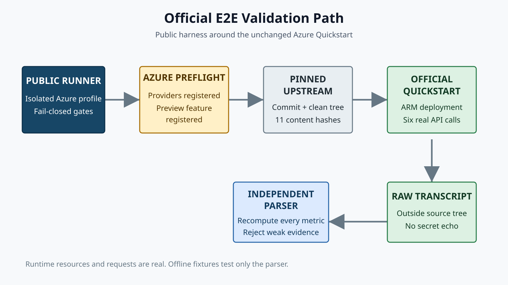

# Azure Context Cache 端到端验证

[](https://github.com/david-xinyuwei/david-share/actions/workflows/azure-context-cache-e2e-validation-ci.yml)
[](https://www.python.org/)
[](https://learn.microsoft.com/powershell/)
[](https://github.com/Azure/AzureContextCache/commit/7d1029a5e8b59b1805e70992c85ffe6798d2f47a)
[](../../LICENSE)

[English](README.md) | [Source](https://github.com/david-xinyuwei/david-share/tree/master/Agents/Azure-Context-Cache-E2E-Validation) | [官方 upstream](https://github.com/Azure/AzureContextCache)

> 作者：魏新宇

这是一个 fail-closed（失败即停止）的验证工具：先核对 Azure Context Cache Private Preview 官方 Quickstart 的源码身份，再独立验算真实 Responses API 运行记录。

## 真实能力与测试基础设施

| 范围 | 真实发生的行为 | 边界 |
|---|---|---|
| `scripts/run_official_e2e.ps1` | 读取 Azure 实时状态，调用经过 hash 验证的官方 Quickstart，创建真实 Azure 资源并发送真实 Responses API 请求 | 需要先完成 Preview 准入，并使用已认证、相互隔离的 Azure CLI profile |
| `scripts/verify_upstream.py` | 核对官方 Git commit、origin、clean tree 和 11 个 Git blob content SHA-256 | 不替代、也不复制 upstream 源码 |
| `scripts/parse_demo_output.py` | 从输出行重新计算请求数、缓存命中、cached tokens、延迟和加速比 | 出现错误、缺行或预热请求命中不足时立即失败 |
| `tests/fixtures/` | 合成 transcript 只覆盖 parser（解析器）的成功与失败分支 | Fixture 不会进入实时运行路径 |
| `evidence/verified-run-summary.json` | 官方实时路径的一次脱敏观测 | 不是生产认证、SLA、价格声明或模型质量 benchmark |

## 本仓库验证什么

本工具只证明下面这条有边界的链路：

1. 目标 Azure subscription 已启用，并能通过指定的 `AZURE_CONFIG_DIR` 访问。
2. `Microsoft.Storage`、`Microsoft.CognitiveServices` 和 `OpenAI.ContextCacheAllowed` 已处于 Registered 状态。
3. 官方 checkout 精确对应 commit `7d1029a5e8b59b1805e70992c85ffe6798d2f47a`，且 pinned Git blob 全部一致。
4. 官方 `scripts/quickstart.ps1` 成功部署 Context Cache account、container、已关联 Context Cache container 的 Azure OpenAI deployment 和 data-plane role。
5. 六次真实 Responses API 请求完成，并且足够多的预热后请求（warm call）返回非零 `cached_tokens`。
6. Parser 从原始输出重新验算结果，而不是相信成功提示文本。

Runner 不负责登录、不注册 Preview feature、不回退到 API key、不编造缓存结果，也不自动删除 Azure 资源。

## 架构



公共验证工具只负责前置检查、来源追溯、证据采集和验证；Private Preview 资源由 Azure 提供；部署和 Demo 行为由官方上游仓库（upstream）定义。

## 已验证观测


脱敏 canary 共完成六次请求。第 1 次 `cached_tokens = 0`，第 2 至第 6 次均返回 `2304` 个 cached tokens。重新计算得到 warm mean 为 `3642.4 ms`，第 1 次为 `5820 ms`；在这一个环境中的观测比值为 `1.597848x`。

这些延迟只证明当次运行发生了什么。更具持续证据价值的能力信号是可验证的 deployment 绑定以及非零 `cached_tokens`。没有单独的受控 benchmark 和当前有效价格来源时，不应外推延迟比值或成本收益。

后续 hardened wrapper 探测也暴露了官方五请求并发阶段的 transport 波动：两次完整运行通过，之后两次分别因 3 个和 4 个 transport error 被拒绝。它们保留在 [`evidence/validation-history.json`](evidence/validation-history.json) 中，不会被换算成缓存分数。这证明 fail-closed gate 正常工作，不构成生产可靠性声明。

## 快速开始

### 前提条件

- Windows 上的 PowerShell 7（`pwsh`）、Git、Azure CLI，以及 Python 3.11 或更高版本
- 已获得 Azure Context Cache Private Preview 权限的 Azure subscription
- `OpenAI.ContextCacheAllowed` 已达到 `Registered`
- 已通过租户允许的用户认证流登录独立 `AZURE_CONFIG_DIR`
- 具备部署资源和分配 `Cognitive Services OpenAI User` 的权限
- 目标区域具备可用模型 quota

Live run 会创建计费 Azure 资源并发送模型请求。请使用唯一的 resource group 和 name prefix；是否清理应在检查生成的 evidence 后单独决定。

### 运行官方 E2E

```powershell
$env:AZURE_CONFIG_DIR = "$HOME\.azure-context-cache-validation"
$subscriptionId = "YOUR-SUBSCRIPTION-ID"

az account set --subscription $subscriptionId
az account show --query '{name:name,id:id,tenantId:tenantId,user:user.name}' -o json

pwsh -NoProfile -File .\scripts\run_official_e2e.ps1 `
  -SubscriptionId $subscriptionId `
  -ResourceGroup "rg-context-cache-validation" `
  -Location "centralus" `
  -NamePrefix "ccvalidate" `
  -Runs 6
```

第一次可加 `-WhatIf`：它只执行 Azure 只读 preflight，不 clone、不部署、也不发送请求。Runner 会在源码树之外创建唯一 run directory 和全新 virtual environment，并输出精确 evidence 路径。复用已有 resource group 必须显式传入 `-AllowExistingResourceGroup`。网络受限时可以通过 `-ExistingUpstreamDirectory` 指定另行验证过的 clean checkout；默认路径仍是 fresh official clone。

### 本地验证

```powershell
python -m unittest discover -s tests -v
python scripts\demo_code_validator.py
python scripts\audit_public_content.py
python scripts\validate_repo.py
```

这些 offline gate 不需要 Azure。也可以针对已有 clean checkout 核对官方 upstream lock：

```powershell
python scripts\verify_upstream.py `
  --upstream-dir "PATH-TO-AzureContextCache" `
  --lock .\UPSTREAM_LOCK.json
```

## 证据与方法

方法由三层相互独立的证据组成：

| 层 | 权威来源 | 证据 |
|---|---|---|
| 源码身份 | Azure 官方 Git repository | Commit、origin、clean tree 和 Git blob content SHA-256 |
| Azure control plane | Azure Resource Manager | Provider/feature preflight 和成功 deployment summary |
| Azure data plane | 官方 Responses API demo | 六条请求记录、cached token 和 fail-closed threshold |

详见 [方法与 lineage](docs/METHOD-CN.md)、[公共证据边界](evidence/README.md) 和 [scenario manifest](scenario-manifest.json)。公共 evidence 不包含云资源标识和私有 raw log。

## 仓库结构

| 路径 | 用途 |
|---|---|
| `UPSTREAM_LOCK.json` | 固定官方 commit 和 11 个 Git blob content SHA-256 |
| `scripts/run_official_e2e.ps1` | 围绕未修改官方 Quickstart 的实时编排 |
| `scripts/verify_upstream.py` | 跨平台源码身份校验器 |
| `scripts/parse_demo_output.py` | 独立 transcript parser 和 cache gate |
| `scripts/demo_code_validator.py` | Live 路径的静态真实性检查 |
| `scripts/audit_public_content.py` | 按实际值识别的公共边界扫描器 |
| `scripts/validate_repo.py` | 确定性仓库质量门 |
| `tests/` | Parser、来源追溯、runner、scanner 和 validator 测试 |
| `evidence/` | 脱敏观测和证据 manifest |
| `images/` | 架构图和实测观测图 |

## 安全与清理

- 禁止把凭据、Azure CLI cache、endpoint、resource ID 或 live raw log 写入本仓库。
- 每个项目使用独立 `AZURE_CONFIG_DIR`；runner 拒绝隐式共享 profile，也拒绝把 workspace 放入公共源码树。
- 本地验证使用 Azure CLI user authentication。长期运行的服务应选择合适的 managed identity 或 service principal。
- Runner 故意不自动清理。执行任何删除前，应先检查 upstream `scripts/cleanup.ps1`、生成的 `run-contract.json`、私有 `manifest.json` 和目标 resource group。
- 删除是独立的显式操作。如果使用已有 Azure OpenAI account，在确认其所有权之前不得运行 cleanup。

安全问题和运维说明见 [SECURITY.md](SECURITY.md)。

## 当前限制

- 这是 Private Preview 验证工具，不是可用性或生产就绪保证。
- Upstream API version、model version、region、quota 和 onboarding flow 都可能变化。
- 单次运行无法证明延迟分布、并发保证或成本节省。
- Cache hit 可能随运行变化。默认 gate 要求 5 次 warm call 至少命中 3 次；只有明确修改验收合同后才应调整。
- 当前 harness 面向 upstream 的 Windows PowerShell Quickstart。
- Pinned commit 未提供 license file，因此本项目不复制 upstream 源码。

## 参考资料

- [Azure/AzureContextCache](https://github.com/Azure/AzureContextCache)
- [固定的 upstream commit](https://github.com/Azure/AzureContextCache/commit/7d1029a5e8b59b1805e70992c85ffe6798d2f47a)
- [Azure OpenAI prompt caching](https://learn.microsoft.com/azure/ai-foundry/openai/how-to/prompt-caching)
- [Azure CLI configuration isolation](https://learn.microsoft.com/cli/azure/azure-cli-configuration)
- [ATTRIBUTION.md](ATTRIBUTION.md)