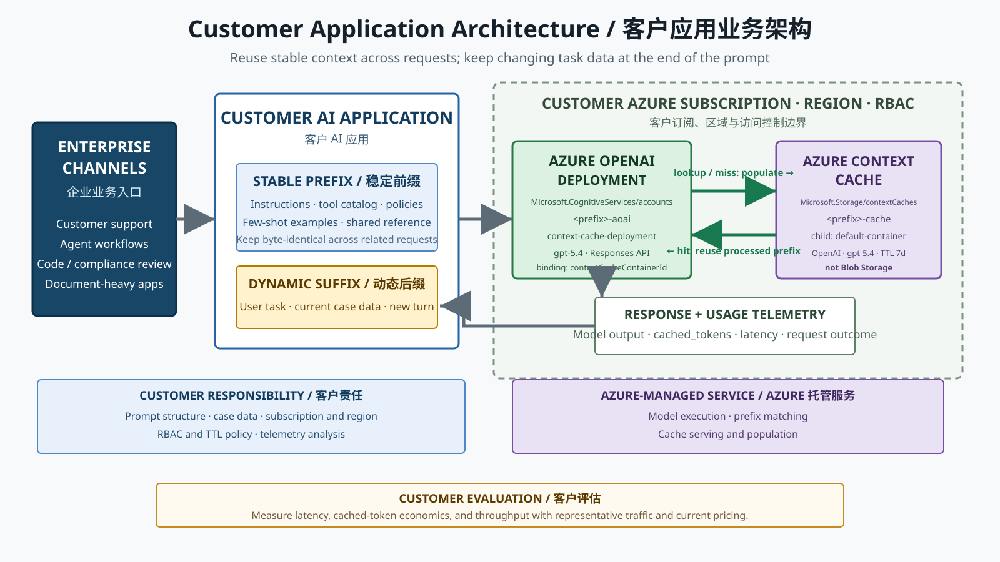
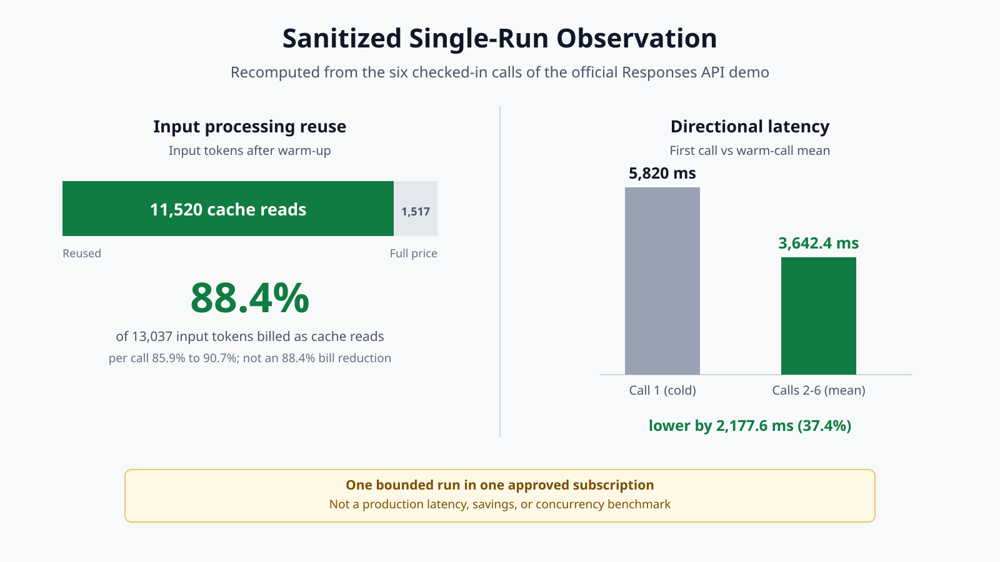
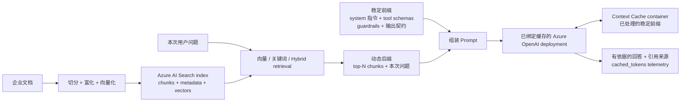

# Azure Context Cache 客户评估

[](https://github.com/david-xinyuwei/david-share/actions/workflows/azure-context-cache-e2e-validation-ci.yml)
[](https://www.python.org/)
[](https://learn.microsoft.com/powershell/)
[](https://github.com/Azure/AzureContextCache/commit/7d1029a5e8b59b1805e70992c85ffe6798d2f47a)
[](../../LICENSE)

[英文版](README.md) | [源码](https://github.com/david-xinyuwei/david-share/tree/master/Agents/Azure-Context-Cache-E2E-Validation) | [官方上游](https://github.com/Azure/AzureContextCache)

评估 Azure OpenAI 应用的显式上下文缓存：适用于反复发送相同长指令、工具定义、示例或参考资料的业务请求。

**本仓库证明了什么：** 固定版本的官方 Quickstart 部署成功，并且一个绑定了缓存的 Azure OpenAI deployment 在一个已获准订阅中，对真实 Azure 数据面返回了真实的 cached tokens。
**本仓库没有证明什么：** 生产就绪、延迟或成本保证，以及观测到的命中率中有多少属于相对模型自带默认 prompt caching 的增量。

## 客户问题与业务价值

这类请求里，稳定前缀每次都要重新 tokenize 和 prefill。Azure Context Cache 让客户在自己的订阅中部署具名、区域化的缓存容器并绑定到 Azure OpenAI deployment：第一次匹配请求填充处理结果，后续请求在配置的生命周期内复用，应用照常发送完整前缀，由 deployment 自动查缓存。这是**跨请求的 prompt 处理复用**，不是文档存储，也不是语义检索。

| 业务价值杠杆 | 官方资料给出的机制 | 客户应如何验证 |
|---|---|---|
| 请求延迟 | 命中的前缀跳过重新 tokenization 和 prefill | 在客户自己的提示词组合和并发条件下测量延迟分布 |
| 输入 token 经济性 | 缓存读取按折扣后的输入 token 价格计费 | 结合 `cached_tokens`、实际命中率和当前 Azure 定价计算 |
| 容量效率 | 省下的 prefill 算力可以在同等容量下支撑更多并发 | 在目标负载下执行受控吞吐测试 |
| 跨请求复用 | 具名缓存容器可以在配置的生命周期内跨调用复用符合条件的前缀处理结果 | 通过已绑定 deployment 重复发送字节一致的前缀，并监控 `cached_tokens` |
| 治理 | 具名缓存资源部署在客户订阅、区域和 RBAC 边界内，并配置 TTL | 核对目标区域是否受支持，以及访问控制、生命周期和数据要求 |

> [固定版本的官方 Quickstart](https://github.com/Azure/AzureContextCache/tree/7d1029a5e8b59b1805e70992c85ffe6798d2f47a) 把这些列为产品价值杆杆。本仓库只证明缓存在一个已获准环境中被真实使用，不量化其中任何一项。

## 收益到底是什么

### 省的是什么

应用每次仍然完整发送前缀，被省掉的是对这段前缀的**重复处理**：固定版本的官方资料说明，服务会保存稳定前缀经过 tokenization 和 pre-attention（即预先完成注意力计算）之后的中间表示，后续以相同内容开头的请求直接复用它。这也解释了为什么上表的杠杆是延迟、输入 token 经济性和容量，而不是客户端发送量的减少。

官方的表述是：前缀越长、越稳定，节省越大。这就是全部的经济性前提——如果一个工作负载的可复用前缀很短，或者前部字节每次都在变，那么无论缓存怎么配置，可拿到的收益都很有限。

### 已经有默认 prompt caching，为什么还要它

Azure OpenAI 对支持的模型**默认就开启** [prompt caching](https://learn.microsoft.com/azure/ai-foundry/openai/how-to/prompt-caching)，所以客户第一个会问的问题是：多部署一个具名 Context Cache 资源，究竟多给了什么。固定版本的官方资料用一句话回答：

> Unlike implicit (best-effort) caching that some endpoints do opportunistically, explicit caching is contractual: you create a named cache container, you tell the deployment to use it, and your application controls the lifetime.

| 维度 | 默认 prompt caching（隐式） | Azure Context Cache（显式） |
|---|---|---|
| 性质 | 尽力而为，机会性命中 | 契约式：由客户部署并绑定的具名资源 |
| 生效门槛 | 至少 1,024 token，且前 1,024 token 必须完全一致 | 同样的前缀匹配约定，通过已绑定的容器表达 |
| 生命周期控制 | 由服务管理，按请求选择保留策略 | 客户在自己拥有的资源上设置容器 `timeToLive` |
| 驻留与隔离 | 由服务管理；prompt 缓存不跨 Azure 订阅共享 | 缓存账户与容器位于客户的订阅、区域和 RBAC 边界内 |
| 可治理性 | 不是可检查的资源 | 一个可审计、可改绑、可轮换、可解绑的 ARM 资源 |
| 客户端改造 | 无需 | 无需；只在 deployment 上设置 `properties.contextCacheContainerId` |

这张表要当作**生命周期与控制权的论证，而不是命中率的论证**来读。对于持续重复出现的前缀，默认缓存本身可能已经能够命中并满足该请求。Context Cache 的差异化价值出现在这样的场景：复用窗口、数据驻留和生命周期必须成为客户自己订阅里可拥有、可检查、可治理的属性，而不是服务的机会性行为。

公开的默认缓存保留行为给出了客户应当对照的参照点：内存态保留通常在空闲 5 到 10 分钟内被清除，并且总是在最后一次使用后一小时内释放；在支持的模型家族上，扩展保留把上限提高到最长 24 小时。以天为单位的容器生命周期因此属于另一个量级的复用窗口，而且它由客户显式声明，不需要从服务行为去推测。

### 容器生命周期最长能设多久

有三个事实很容易被混成一个，本仓库把它们分开陈述：

| 陈述 | 状态 | 依据 |
|---|---|---|
| 固定版本 Quickstart 交付的容器生命周期是 `7` 天 | **已验证** | `timeToLive` 声明在模板的 `variables` 块中，且实际部署出的容器回读到同一个值 |
| 这个值本来就是让客户改的 | **已验证** | 官方自定义指引把客户直接指向同一个 variables 块修改 TTL，模板既没有 allowed-value 列表也没有最大值约束 |
| 某个具体天数是资源提供程序接受的上限 | **未验证** | 固定版本仓库、ARM 模板和 Bicep 模块都没有公布上限，本次验证也没有去试探 |

所以 `7` 天是**默认值，不是天花板**。任何需要更长保留窗口的客户讨论，都应当向产品组确认可接受范围，或者用一次显式部署测试确定，而不能把 `7` 天当作产品限制引用。

### 客户可以自己算的收益模型

本仓库不给出金额，因为模型、区域、部署类型和流量形态决定了结果。但可以给出算式和变量：

```text
每次命中省下的全价输入 token = cached_tokens
每月省下的输入 token       = cached_tokens × 命中率 × 月请求数
每月输入 token 成本        = 未命中输入 token × 输入单价
                           + 缓存读取 token   × 折扣后输入单价
```

把本次观测值代入，仅作为示例计算：每次预热后调用报告 `2304` 个 cached tokens。一个每月对同一前缀发起 `100,000` 次请求、且命中率相同的工作负载，每月大约有 2.3 亿（`230` million）个输入 token 从全价处理转为折扣缓存读取。换算成金额需要套用目标模型、区域和部署类型的当前公开价格；Standard 与 Provisioned 部署类型对缓存读取的折扣方式不同，因此这里不存在单一换算系数。

| 变量 | 为什么它决定收益 | 承诺之前如何测量 |
|---|---|---|
| 稳定前缀长度 | 低于生效门槛就没有任何可复用内容，而官方指引把更大的节省与更长的稳定前缀直接关联 | 对真实的系统提示词、工具目录、护栏规则和固定参考资料做 tokenize |
| 前缀字节稳定性 | 前部只要有一个字符变化就会 miss | 在真实生产流量样本上 diff 拼装后的前缀，包括序列化方式和字段顺序 |
| 请求间隔与缓存生命周期的关系 | 决定下一次匹配请求到达时前缀是否还在 | 按**前缀族**统计请求到达间隔分布，而不是看全局请求速率 |

把这三个变量组合起来，就得到实际的决策网格：

| 流量形态 | 默认 prompt cache 的表现 | Context Cache 额外带来什么 |
|---|---|---|
| 匹配前缀持续到达，间隔在秒级到几分钟 | 大概率已由默认缓存命中 | 资源归属、数据驻留、显式 TTL 和可审计资源 |
| 匹配前缀之间存在几十分钟到数小时的间隔 | 内存态保留会在空闲后被释放 | 一个由客户设定而非推测的复用窗口 |
| 匹配前缀按天、按周或按计划批次复用 | 超出扩展保留的上限 | 增量收益最强的场景：以天为单位的容器生命周期 |

后两行才是值得用客户真实流量去测量的部分。前缀始终达不到生效门槛属于提示词布局问题，已在下文**工作负载适配**中覆盖。

### 本次验证没有归因的部分

本次实测证明：绑定了 `properties.contextCacheContainerId` 的部署确实服务了重复前缀，并在真实 Azure 数据面上报告了非零 `cached_tokens`。但它**没有**分离出这些命中中有多少属于相对模型自带默认 prompt caching 的增量，原因很具体：固定版本的官方 demo 在每次请求上同时设置了 `prompt_cache_retention`，而所部署的模型家族本身就支持默认 prompt caching，与是否绑定 Context Cache 无关。两套控制在被验证的路径上是同时存在的。

直说结论：现有证据支持的是"这条显式缓存路径可用、绑定在客户自有资源上、并且可观测"，不支持"Context Cache 相比默认缓存带来了可测量的更高命中率"。

要把两者分开，需要一次受控对照实验。该实验目前正在一个私有环境中进行，其第一阶段已经返回了一个足以推翻原始设计的观测：

| 本环境中的观测 | 实测到的内容 |
|---|---|
| 同一账户下新建的第二个部署，未绑定容器且此前从未被调用过，却在其生命周期的第一次请求上就返回了非零 `cached_tokens` | 紧邻的上一次调用中，绑定部署刚以完全字节一致的前缀完成冷启动，两次请求的发起时间相差 3.759 秒 |
| 此后每一轮交替调用中，两个部署的命中表现完全一致 | 绑定臂始终排在前面调用，因此在未绑定臂被测量之前就已经预热了共享前缀 |

限定在本环境的最窄读法是：**前缀缓存状态在同一个 Azure OpenAI 账户内的两个部署之间发生了复用。** 这是单一环境下的观测，不是有文档保证的产品行为，也不作为对服务内部机制的陈述。

由此有两个推论。其一，凡是始终先调用绑定臂的对照实验，都无法把命中归因于未绑定臂自身的缓存状态，因此本次对照实验的前几个阶段在增量命中率上不构成任何结论。其二，与 Context Cache 是否存在增量收益无关：**不能默认同一账户下的不同部署会构成缓存隔离边界**；隔离一旦成为需求，就必须显式验证，而不能从部署拓扑上推断。

修正后的对照实验在决定结论的那一档间隔上先调用未绑定臂，使其首次请求在绑定臂预热共享前缀之前就被测量：

| 要素 | 设计 |
|---|---|
| 对照组 | 同一账户、同一区域下，一个设置了 `contextCacheContainerId` 的部署与一个未设置的部署，模型与版本完全相同 |
| 提示词 | 两组使用完全字节一致的同一稳定前缀，以及同一组变化后缀 |
| 间隔档位 | 至少三档请求间隔：位于内存态窗口内、超出内存态但仍在扩展保留内、以及超出扩展保留 |
| 调用顺序 | 在决定结论的那一档间隔上先调用未绑定臂，使其自身缓存状态在绑定臂预热共享前缀之前被观测 |
| 指标 | 每组、每个间隔档位的命中率与 `cached_tokens`，重复足够次数以区分真实差异与运行间波动 |
| 报告方式 | 按组、按档位公布结果，包括两组无法区分的档位 |

在修正后的对照实验越过扩展保留边界并完成之前，可以作为差异化依据的仍然是生命周期、数据驻留和治理这几行；任何关于增量命中率或成本节省的说法都应视为未经证明。

## 工作负载适配

| 决策 | 工作负载模式 | 评估建议 |
|---|---|---|
| **GO** | 长系统/开发者指令、稳定工具目录、少样本示例或共享政策 | 把可复用内容放在前部，把变化的任务数据放在末尾 |
| **GO** | 客户支持、代码/合规审查、文档密集型助手和受控智能体工作流 | 规则、工具或参考资料会跨请求重复使用时进入评估 |
| **CONDITIONAL** | 早期对话历史保持稳定、后续内容仅追加的多轮对话 | 验证早期前缀能否保持字节完全一致 |
| **LOW PRIORITY** | 短提示词，或请求前部频繁变化 | 可复用前缀有限，通常不应优先投入 |
| **LOW PRIORITY** | 一次性请求，或每次请求开头都是高度个性化内容 | 缓存复用概率较低 |
| **CONDITIONAL** | 需要承诺精确成本节省或吞吐提升的业务场景 | 另做客户数据基准测试和当前定价模型 |

## 客户业务架构



1. 客户应用把可复用的指令、工具、示例和共享资料放入稳定前缀。
2. 每次变化的用户任务和案例数据追加为动态后缀。
3. 应用继续调用 Azure OpenAI Responses API；已关联的部署会在 Context Cache 容器中查找匹配前缀。
4. 应用通过 `cached_tokens`、延迟和请求结果验证真实业务流量是否适配。

Context Cache 容器是客户订阅中的 Azure 资源。锁定的 Private Preview Quickstart 配置缓存账户、模型专属容器、TTL 和 `contextCacheContainerId` 绑定。

## 数据从哪里来，缓存实际存在哪里

### 已验证路径的资源拓扑

这里的 `Microsoft.Storage` **不是**普通 Azure Storage account（存储账户）或 Blob container（Blob 容器）。固定版本的 Private Preview 会创建专用的 `Microsoft.Storage/contextCaches` 资源及其模型专属子容器。应用不会把 prompt 预先上传到 Blob Storage，也不会直接调用缓存资源。

| 对象 | 已验证路径中的位置 | 精确契约 | 存放或执行的内容 |
|---|---|---|---|
| 请求前的稳定来源 | 官方 Quickstart 的私有物化副本 | `demo/system_prompt.md` | 约 2.4K token 的代码审查指令；每次调用保持字节完全一致 |
| 请求前的变化来源 | 同一个 Quickstart 私有副本 | `demo/diffs/*.diff` | 每次调用在稳定 system prompt 之后追加一个不同的 PR diff |
| Azure OpenAI 账户 | 获准的私有订阅、新建验证资源组、`centralus` | `Microsoft.CognitiveServices/accounts/<name-prefix>-aoai` | 承载 Azure OpenAI endpoint |
| Azure OpenAI 部署 | Azure OpenAI 账户的子资源 | `deployments/context-cache-deployment`，模型 `gpt-5.4`，版本 `2026-03-05-contextcache` | 接收 Responses API 请求，并配置 `properties.contextCacheContainerId` |
| Context Cache 账户 | 同一订阅、资源组和区域 | `Microsoft.Storage/contextCaches/<name-prefix>-cache`，`accountKind = Regional` | 客户通过 Azure RBAC 管理的缓存命名空间 |
| Context Cache 容器 | Context Cache 账户的子资源 | `contextCacheContainers/default-container`，provider `OpenAI`，模型 `gpt-5.4`，`timeToLive = 7` 天 | 由服务托管的存储单元，存放可复用的前缀处理结果 |

可检查的 ARM resource ID（资源 ID）为：

```text
/subscriptions/<subscription-id>/resourceGroups/<resource-group>/providers/Microsoft.Storage/contextCaches/<name-prefix>-cache/contextCacheContainers/default-container
```

按 README 示例使用 `-NamePrefix ccvalidate` 时，缓存资源是 `ccvalidate-cache/default-container`，与它绑定的 Azure OpenAI 部署是 `ccvalidate-aoai/context-cache-deployment`。公共 Repo 有意隐去实际验证订阅、资源组和名称前缀；本次运行已确认资源位于私有订阅中一个新建的 `centralus` 资源组。

官方资料把缓存内容描述为稳定前缀经过 tokenization 和 pre-attention 后的表示。它不是客户可寻址的文件、Blob URL 或 Blob object。上面的 resource ID 是公开的 control-plane（控制面）边界；服务内部的物理存储布局不在本次验证的揭示范围内。

### 端到端数据流

| 步骤 | 所在位置 | 实际发生的动作 | 可观察结果 |
|---:|---|---|---|
| 1 | 本地 Quickstart 私有副本 | Python 读取 `system_prompt.md` 和一个 `.diff` 文件 | 客户端不做任何预上传，因此此时 Azure 中不存在该前缀的缓存内容 |
| 2 | 客户应用 → Azure OpenAI | 把稳定 system prompt 放在请求前部，把变化的 diff 放在末尾，组成一次 Responses API 请求 | 普通的 `POST /openai/v1/responses` 调用 |
| 3 | 已绑定缓存的 Azure OpenAI 部署 | `contextCacheContainerId` 让 deployment 透明查询 `default-container` | 应用始终只调用 Azure OpenAI，不需要单独的缓存 SDK 调用 |
| 4 | 第一次请求：cache miss | Azure OpenAI 完整处理请求，服务把可复用的稳定前缀处理结果写入已绑定容器 | 第 1 次调用返回 `cached_tokens = 0` |
| 5 | 后续请求：cache hit | 字节完全一致的前缀直接复用；末尾不同的 PR diff 仍按本次请求处理 | 第 2–6 次调用均返回 `cached_tokens = 2304` |
| 6 | Azure OpenAI → 客户应用 | 正常返回模型结果和 usage telemetry（用量遥测） | `usage.input_tokens_details.cached_tokens`、输出 token、延迟和状态 |

固定样例同时使用两个不同的保留设置：Context Cache 容器配置 `timeToLive = 7` 天，而每个 gpt-5.4 请求设置 `prompt_cache_retention = "24h"`。两者都来自官方样例，但不是同一个设置。本仓库验证了它们的配置值，不从这两个值推断服务内部的存储分层。

### 应用如何调用

下面保留了固定官方 Demo 的核心调用路径。请求中不需要出现 cache account 或 container，因为 Azure OpenAI deployment 已经预先与它们绑定。

```python
from pathlib import Path

import httpx
from azure.identity import DefaultAzureCredential

endpoint = "https://YOUR-AOAI-ACCOUNT.openai.azure.com"
deployment = "context-cache-deployment"
stable_prefix = Path("demo/system_prompt.md").read_text(encoding="utf-8")
diff_name = "01-sql-injection.diff"
dynamic_suffix = Path(f"demo/diffs/{diff_name}").read_text(encoding="utf-8")

token = DefaultAzureCredential(
  exclude_interactive_browser_credential=False
).get_token("https://cognitiveservices.azure.com/.default").token

payload = {
  "model": deployment,
  "input": [
    {
      "type": "message",
      "role": "system",
      "content": [{"type": "input_text", "text": stable_prefix}],
    },
    {
      "type": "message",
      "role": "user",
      "content": [{
        "type": "input_text",
        "text": f"Review this PR diff:\n\nFile: {diff_name}\n\n{dynamic_suffix}",
      }],
    },
  ],
  "max_output_tokens": 200,
  "prompt_cache_retention": "24h",
}

response = httpx.post(
  f"{endpoint}/openai/v1/responses?api-version=preview",
  headers={"Authorization": f"Bearer {token}", "Content-Type": "application/json"},
  json=payload,
  timeout=240,
)
response.raise_for_status()
result = response.json()
print(result.get("output_text") or result.get("output"))
print(result["usage"]["input_tokens_details"]["cached_tokens"])
```

生产应用沿用同一个原则：把长期复用的指令、工具、政策、示例或参考资料放在前部，把当前用户输入或案例数据追加到末尾，并持续监控每次响应中的 `cached_tokens`。

### 在客户环境中找到这些资源

使用运行器接收的同一个资源组和 `-NamePrefix`。以下命令可以找到逻辑缓存资源并证明 deployment 绑定，不会输出任何秘密：

```powershell
$subscriptionId = "YOUR-SUBSCRIPTION-ID"
$resourceGroup = "YOUR-RESOURCE-GROUP"
$namePrefix = "YOUR-NAME-PREFIX"

az resource list --subscription $subscriptionId --resource-group $resourceGroup `
  --query "[?contains(type, 'contextCaches') || type=='Microsoft.CognitiveServices/accounts/deployments'].{name:name,type:type,location:location}" `
  -o table

$containerId = az resource show --subscription $subscriptionId `
  --resource-group $resourceGroup `
  --resource-type "Microsoft.Storage/contextCaches/contextCacheContainers" `
  --name "${namePrefix}-cache/default-container" `
  --api-version "2026-01-01-preview" --query id -o tsv

az resource show --subscription $subscriptionId `
  --resource-group $resourceGroup `
  --resource-type "Microsoft.CognitiveServices/accounts/deployments" `
  --name "${namePrefix}-aoai/context-cache-deployment" `
  --api-version "2026-03-15-preview" `
  --query "{deployment:name,model:properties.model,contextCacheContainerId:properties.contextCacheContainerId}" `
  -o json

Write-Output "Expected container: $containerId"
```

返回的 `properties.contextCacheContainerId` 必须与 `$containerId` 完全相同。在 Azure Portal 中，同一批资源位于验证资源组内，分别属于 Azure OpenAI 账户和 `Microsoft.Storage/contextCaches` 资源类型；这里没有可供浏览的普通 Blob container。

### 本次验证实际观察到的效果



| 信号 | 根据已签入的 6 次调用记录重新计算 | 实际观察 | 对客户意味着什么 |
|---|---:|---:|---|
| 缓存已启用 | 预热后 `cached_tokens > 0` 的调用数 | `5/5` 次预热后调用命中 | deployment 与 container 的绑定确实为重复前缀提供了缓存 |
| 输入处理复用 | 预热后 `11,520 / 13,037` 个输入 token | 预热后总输入的 `88.4%` 被报告为 cached；单次为 `85.9%–90.7%` | 大部分重复输入处理转为 cache read；这不等于账单降低 88.4% |
| 方向性延迟 | 第 1 次 `5820 ms`；预热后均值 `3642.4 ms` | 本次运行较第 1 次低 `2177.6 ms`（`37.4%`） | 支撑进一步验证延迟收益，但仅凭一次并发突发调用不构成性能 benchmark 或 SLA |
| 输入 token 经济性 | 5 次预热后调用每次 `2304` cached tokens | 合计读取 `11,520` 个 cached token | 应结合客户命中率和当前模型/区域定价计算；本仓库不声称具体金额 |
| 输出行为 | `6/6` 次 Responses API 调用全部完成 | 正常模型输出和 usage telemetry | Prompt caching 改变的是处理复用，不改变应用预期的响应契约 |

已在获得 Private Preview 准入的 Azure 订阅中，对锁定至 commit `7d1029a5e8b59b1805e70992c85ffe6798d2f47a` 的官方 Quickstart 完成端到端验证。后续两次不完整运行被拒绝，没有被转换为通过结果。

> **证据边界：** 这是一次运行的能力观测，不代表生产就绪、可用性、成本节省、吞吐或延迟保证。通用 Azure OpenAI prompt caching 指南的内容可能因模型家族和 API 接口形态而不同；本仓库专门验证 Private Preview 的 `Microsoft.Storage/contextCaches` 和 `contextCacheContainerId` 路径。

**建议下一步：** 完成 Preview 准入、权限、配额和区域可用性确认后，在客户自有 Azure 环境中使用具有代表性的提示词运行同一套验证。

## 是否必须使用 RAG

**不需要。** Azure Context Cache 和 RAG 解决的是两个不同问题：

| 能力 | 首要问题 | 存储内容 | 应用如何使用 |
|---|---|---|---|
| 基于 Azure AI Search 的 RAG | “这次问题需要哪些客户知识？” | Search index 或 knowledge source 中的原始文档、chunks、metadata 和 embeddings | 应用或 Agent 针对每个问题显式检索排名靠前的结果，再把它们加入 prompt |
| Azure Context Cache | “已经提供过的哪些 prompt 前缀不必从头处理？” | 具名 Context Cache 容器中由服务管理的、经过 tokenization 和 pre-attention 处理后的稳定前缀表示 | 应用发送正常模型请求；已绑定的 deployment 自动匹配并复用前缀 |

Context Cache 不能替代文档摄取、chunking、embedding、vector/hybrid search、relevance ranking、引用、内容新鲜度或文档级授权。它不是 vector database，也不会检索语义相似内容。

### 如何与客户 RAG 应用组合



高价值的 RAG 组合方式是：

1. 企业内容仍存放在权威数据源和 RAG index 中，并沿用原有治理方式。
2. 针对本次用户问题检索相关 chunks；这些结果通常每次都不同。
3. 把稳定的应用指令、tool schemas、安全政策、输出格式和真正固定的参考内容放在模型请求的**最前部**。
4. 把检索得到的 top-N chunks 和本次用户问题追加到**末尾**。
5. 把完整请求发送给已绑定缓存的 Azure OpenAI deployment，并监控 `cached_tokens`。

| RAG prompt 组成 | 缓存预期 | 原因 |
|---|---|---|
| System/developer 指令、工具定义、guardrails、响应 schema | **强候选** | 内容较长，并在大量请求中保持一致 |
| 每次请求都附带的固定产品手册或政策 | **字节一致且未超过 TTL 时可作为候选** | 相同的大段参考前缀会重复出现 |
| Vector/hybrid search 针对本次问题返回的 top-N chunks | **通常是动态内容** | 不同问题会返回不同 chunks 或排序 |
| 用户问题、对话尾部、当前案例数据 | **动态后缀** | 每次请求都会变化 |

因此，当 RAG 应用在每次检索调用外围都包含很长的稳定编排前缀时，Context Cache 会让业务价值更明显；但这不代表所有 RAG 检索结果都可以自动复用。只要 chunk 内容、顺序、security trimming（安全裁剪）结果或前部个性化内容发生变化，就可能无法命中相同前缀。

> **验证状态：** 当前发布的实跑 E2E 验证的是官方非 RAG Code Reviewer workload。上面的 RAG 组合是依据 Microsoft RAG 指南和官方 Context Cache 前缀契约形成的架构模式；本仓库尚未使用客户 Search index 对其进行 benchmark。

## 测试信息、步骤与证据

### 测试信息

| 项目 | 已验证值 |
|---|---|
| 观测日期 | `2026-08-18` |
| 执行面 | `LOCAL_WINDOWS` |
| Azure 区域 | `centralus` |
| 官方源码 | commit `7d1029a5e8b59b1805e70992c85ffe6798d2f47a` 对应的 `Azure/AzureContextCache` |
| 运行时 | CPython `3.11.9 AMD64`；通过 PowerShell 7 编排，并使用 Azure CLI 用户身份认证 |
| 部署 | `gpt-5.4`，模型版本 `2026-03-05-contextcache`，Responses API `preview` |
| 缓存契约 | 模型专属 Context Cache 容器、7 天 TTL，以及显式 `contextCacheContainerId` 绑定 |
| 请求模式 | 1 次预热请求，随后并行发送 5 次请求 |

本表描述的是经过脱敏的验证环境，不代表区域支持或生产容量建议。

### 测试步骤

1. **验证官方源码。** `scripts/verify_upstream.py` 解析固定 Git 对象，核对全部 25 个执行输入的 SHA-256，并且只在公共源码树之外物化这些已验证字节。
2. **执行 Azure 只读前置检查。** `scripts/run_official_e2e.ps1 -WhatIf` 检查当前订阅、在线 ARM 读取、必要资源提供程序、受控 Preview 功能、运行时架构和目标区域前提条件；此步骤不部署资源，也不发送模型请求。
3. **部署官方 Quickstart。** 实跑运行器安装具有精确 hash 的 Windows AMD64 CPython 3.11 依赖，然后在私有运行目录中调用字节完全一致的官方 `scripts/quickstart.ps1 -SkipPython`。
4. **验证数据面。** 官方 Demo 先发送 1 次预热请求，再使用相同的稳定前缀并行发送 5 次 Responses API 请求。
5. **独立验证结果。** `scripts/parse_demo_output.py` 解析全部 6 条调用记录；缺行、传输错误、零阈值、零延迟或预热后命中不足都会失败。`scripts/validate_arm_summary.py` 独立核对部署成功状态、模型身份、缓存容器 ID、提供程序、TTL 和部署绑定。
6. **执行离线回归门。** 在发布 commit 上运行单元测试、真实性检查、公共内容审计、Repo gate、依赖检查、PowerShell 语法检查、CI 矩阵和 CodeQL。

### 测试脚本

| 脚本或测试集 | 在测试中的职责 | 失败即拒绝条件 |
|---|---|---|
| [`scripts/run_official_e2e.ps1`](scripts/run_official_e2e.ps1) | Azure 前置检查、已验证源码物化、官方 Quickstart 执行、日志捕获和证据编排 | 配置目录复用、运行时不符、资源组已存在、Azure 超时/报错、官方进程非零退出或证据验证失败时立即停止 |
| [`scripts/verify_upstream.py`](scripts/verify_upstream.py) | 核对固定 Repo、commit 和 25 个 Git blob 的 SHA-256 | blob 缺失、不匹配或输出目录非空时拒绝执行 |
| [`scripts/parse_demo_output.py`](scripts/parse_demo_output.py) | 解析调用级延迟和 token 字段并计算缓存判定 | 传输错误、调用缺失/格式错误、零阈值/延迟或预热后命中不足时拒绝结果 |
| [`scripts/validate_arm_summary.py`](scripts/validate_arm_summary.py) | 交叉核对 ARM 部署状态以及 AOAI 与缓存的绑定 | 部署失败、字段缺失、模型/提供程序/TTL 错误或资源 ID 不一致时拒绝结果 |
| [`scripts/demo_code_validator.py`](scripts/demo_code_validator.py) | 确认验证器使用真实官方路径，而不是硬编码或 mock 结果 | 模拟产品行为或源码/运行时契约漂移时失败 |
| [`scripts/audit_public_content.py`](scripts/audit_public_content.py) | 扫描秘密、具体云标识、不安全链接、重解析点和不支持的公开格式 | 发现任何 Public boundary（公开边界）问题时发布门失败 |
| [`scripts/validate_repo.py`](scripts/validate_repo.py) 和 [`tests/`](tests/) | 重新计算证据算术/hash，并测试解析器、ARM、源码锁、编排和 Public boundary 分支 | 任一不变量或回归测试失败均返回非零退出码 |

### 脱敏测试日志

下面是根据 [`evidence/verified-run-summary.json`](evidence/verified-run-summary.json) 渲染的可读摘录。它**不是**私有原始 stdout/stderr；云资源标识、endpoint、身份和部署记录均未公开。

```text
[run] observed_at=2026-08-18 upstream_commit=7d1029a5e8b59b1805e70992c85ffe6798d2f47a
[environment] execution_plane=LOCAL_WINDOWS region=centralus python="3.11.9 AMD64"
[deployment] model=gpt-5.4 model_version=2026-03-05-contextcache api_version=preview cache_ttl_days=7
[call 1] latency_ms=5820 input_tokens=2607 cached_tokens=0    output_tokens=200
[call 2] latency_ms=3791 input_tokens=2571 cached_tokens=2304 output_tokens=126
[call 3] latency_ms=3751 input_tokens=2681 cached_tokens=2304 output_tokens=200
[call 4] latency_ms=3671 input_tokens=2675 cached_tokens=2304 output_tokens=200
[call 5] latency_ms=3215 input_tokens=2570 cached_tokens=2304 output_tokens=133
[call 6] latency_ms=3784 input_tokens=2540 cached_tokens=2304 output_tokens=200
[summary] successful_calls=6 warm_hits=5/5 warm_cached_tokens=2304 verdict=PASS
```

这些延迟值仅用于审计追溯。一次运行无法建立延迟分布，也不能支撑生产性能声明。

### 测试结果

已入库的 [`validation-history.json`](evidence/validation-history.json) 同时保留完整运行和被拒绝的运行：

| 日期 | 执行路径 | 完成调用数 | 传输错误数 | 缓存结果 | 判定 |
|---|---|---:|---:|---:|---|
| `2026-08-18` | `official-baseline` | 6 | 0 | 5/5 次预热后命中 | **PASS** |
| `2026-08-19` | `public-wrapper-reference` | 6 | 0 | 4/5 次预热后命中 | **PASS** |
| `2026-08-19` | `hardened-wrapper-probe-1` | 3 | 3 | 不计分 | **REJECTED — INCOMPLETE** |
| `2026-08-19` | `hardened-wrapper-probe-2` | 2 | 4 | 不计分 | **REJECTED — INCOMPLETE** |

| 发布 commit 质量门 | 结果 | 证据 |
|---|---:|---|
| 确定性单元测试 | `38/38` 通过 | `python -m unittest discover -s tests -v` |
| 真实性、公开边界与 Repo gate | `3/3` 通过 | `demo_code_validator.py`、`audit_public_content.py`、`validate_repo.py` |
| Windows/Ubuntu × Python 3.11/3.13 CI 矩阵 | `4/4` 个 job 通过 | [GitHub Actions run 32270323872](https://github.com/david-xinyuwei/david-share/actions/runs/32270323872) |
| CodeQL 分析器 | `7/7` 个 job 通过 | [CodeQL run 32270323901](https://github.com/david-xinyuwei/david-share/actions/runs/32270323901) |

实跑结果和离线质量门回答的是不同问题：实跑证明有边界的 Azure 产品路径；离线测试证明证据解析器、源码锁、编排控制和公开发布契约仍按预期工作。

## 客户评估路径

### 前提条件

- Windows 上的 PowerShell 7（`pwsh`）、Git、Azure CLI，以及 AMD64 Windows 上的 64 位 CPython 3.11
- 已获得 Azure Context Cache Private Preview 权限的 Azure 订阅
- `OpenAI.ContextCacheAllowed` 已达到 `Registered`
- 已通过租户允许的用户认证流登录独立 `AZURE_CONFIG_DIR`
- 具备部署资源和分配 `Cognitive Services OpenAI User` 的权限
- 在受支持的区域具备可用模型配额

实跑会创建计费 Azure 资源并发送模型请求。请使用唯一的资源组和名称前缀；检查生成的证据后，再单独决定是否清理。

### 运行官方 E2E

```powershell
$env:AZURE_CONFIG_DIR = "$HOME\.azure-context-cache-validation"
$subscriptionId = "YOUR-SUBSCRIPTION-ID"

az account set --subscription $subscriptionId
az account show --query '{name:name,id:id,tenantId:tenantId,user:user.name}' -o json

pwsh -NoProfile -File .\scripts\run_official_e2e.ps1 `
  -SubscriptionId $subscriptionId `
  -ResourceGroup "rg-context-cache-validation" `
  -Location "centralus" `
  -NamePrefix "ccvalidate" `
  -Runs 6
```

建议先加 `-WhatIf`：它只执行有超时上限的 Azure 只读前置检查，不克隆、不部署、也不发送请求。实跑必须使用全新的唯一资源组；运行器会在源码树之外创建唯一的私有证据目录，并且不会自动清理 Azure 资源。网络受限时，可用 `-ExistingUpstreamDirectory` 指向固定 commit 的检出副本；来源控制细节见 [方法与证据链](docs/METHOD-CN.md)。

### 本地验证

```powershell
python -m unittest discover -s tests -v
python scripts\demo_code_validator.py
python scripts\audit_public_content.py
python scripts\validate_repo.py
```

这些离线验证门不需要 Azure。也可以针对位于固定 commit 的已有检出副本核对官方上游版本锁定：

```powershell
python scripts\verify_upstream.py `
  --upstream-dir "PATH-TO-AzureContextCache" `
  --lock .\UPSTREAM_LOCK.json `
  --output "EMPTY-PRIVATE-OUTPUT-DIRECTORY"
```

## 证据边界与验证方法

方法由三层相互独立的证据组成：

| 层 | 权威来源 | 证据 |
|---|---|---|
| 源码身份 | Azure 官方 Git 仓库 | 固定 commit 和经过验证的执行输入 |
| Azure control plane（控制面） | Azure Resource Manager | 资源提供程序和功能前置检查，以及部署、AOAI 模型、缓存容器 ID、提供程序和 TTL 绑定 |
| Azure data plane（数据面） | 官方 Responses API 示例 | 六条调用记录、cached tokens 和失败即拒绝阈值 |

详见 [方法与证据链](docs/METHOD-CN.md)、[公共证据边界](evidence/README.md)、[脱敏运行摘要](evidence/verified-run-summary.json) 和 [验证历史](evidence/validation-history.json)。公共证据不包含云资源标识和私有原始日志。

## 安全与运维

- 禁止把凭据、Azure CLI 缓存、终结点、资源 ID 或实跑原始日志写入本仓库。扫描器同时拒绝符号链接、重解析点、不支持的公共文件格式，以及常见 token、SAS 和连接字符串形式。
- 每个项目使用独立 `AZURE_CONFIG_DIR`；运行器拒绝隐式共享配置，也拒绝把工作目录放入公共源码树。
- 本地验证通过 Azure CLI 使用用户身份认证。长期运行的服务应选择合适的托管身份或服务主体。
- 运行器要求使用全新资源组，并故意不自动清理。执行任何删除前，应先检查上游 `scripts/cleanup.ps1`、生成的 `run-contract.json`、私有 `manifest.json` 和目标资源组。
- 删除是独立的显式操作。如果使用已有 Azure OpenAI 账户，在确认其所有权之前不得运行清理脚本。

安全问题和运维说明见 [SECURITY.md](SECURITY.md)。

## 产品与证据限制

- 这是 Private Preview 验证工具，不是可用性或生产就绪保证。
- 上游 API 版本、模型版本、区域、配额和准入流程都可能变化。
- 单次运行无法证明延迟分布、并发保证或成本节省。
- 缓存命中可能随运行变化。默认验证门要求 5 次预热后调用至少命中 3 次，且阈值不能为零；只有明确修改验收契约后才应调整。
- 当前验证工具面向上游 Windows PowerShell Quickstart。
- 实跑依赖锁明确限定为已实测的 Windows AMD64 CPython 3.11 运行环境。
- 固定 commit 未提供 license file。该子树不签入任何上游源码；运行器会从已验证 Git blob 创建临时私有执行副本。

## 参考资料

- [Azure/AzureContextCache](https://github.com/Azure/AzureContextCache)
- [固定的上游 commit](https://github.com/Azure/AzureContextCache/commit/7d1029a5e8b59b1805e70992c85ffe6798d2f47a)
- [Azure OpenAI prompt caching](https://learn.microsoft.com/azure/ai-foundry/openai/how-to/prompt-caching)
- [OpenAI Prompt Caching](https://developers.openai.com/api/docs/guides/prompt-caching)
- [Microsoft RAG 架构指南](https://learn.microsoft.com/azure/architecture/ai-ml/guide/rag/rag-solution-design-and-evaluation-guide)
- [Azure AI Search 的 RAG 说明](https://learn.microsoft.com/azure/search/retrieval-augmented-generation-overview)
- [Azure CLI configuration isolation](https://learn.microsoft.com/cli/azure/azure-cli-configuration)
- [ATTRIBUTION.md](ATTRIBUTION.md)

维护者：魏新宇