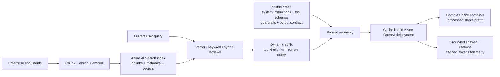

# Azure Context Cache Customer Evaluation

[](https://github.com/david-xinyuwei/david-share/actions/workflows/azure-context-cache-e2e-validation-ci.yml)
[](https://www.python.org/)
[](https://learn.microsoft.com/powershell/)
[](https://github.com/Azure/AzureContextCache/commit/7d1029a5e8b59b1805e70992c85ffe6798d2f47a)
[](../../LICENSE)

[中文](README-CN.md) | [Source](https://github.com/david-xinyuwei/david-share/tree/master/Agents/Azure-Context-Cache-E2E-Validation) | [Official source](https://github.com/Azure/AzureContextCache)

Evaluate explicit context caching for Azure OpenAI applications that repeatedly send the same long instructions, tool definitions, examples, or reference content.

**If you read one paragraph, read this one.** Context Cache is a **governance and ownership** feature, not a faster cache. It gives you a named Azure resource in your own subscription, region, and RBAC boundary, with a lifetime you declare. This repository verified all of that against a real Azure control plane. It also ran a controlled cross-day experiment to test whether the container's 7-day lifetime delivers cache reuse that the model's own default prompt caching cannot — and **in this environment it did not**. If your reason for adopting Context Cache is a higher hit rate, lower cost, or lower latency than default prompt caching, this repository does not support that reason, and you should measure it in your own environment before committing.

## Decision Summary

| Customer question | Current answer |
|---|---|
| What is the defensible reason to adopt this? | Governance: a named, auditable, RBAC-scoped cache resource in your subscription and region, with a lifetime you declare. Verified here by ARM reads |
| Does it cache better than the free default prompt caching? | **Not established, and one decisive test pointed the other way.** After a sealed `43.83`-hour idle window, the bound deployment cold-missed (`cached_tokens=0`) while an unbound deployment hit `3.2` s later. See [Cross-Day Reuse: The Decisive Test](#cross-day-reuse-the-decisive-test) |
| Is it faster than default prompt caching? | **No supportable claim.** Hit-vs-hit latency differed by `170 ms`, smaller than either arm's own standard deviation, and the sign flipped between phases |
| Is separate-deployment isolation safe to assume? | **No.** Prefix cache state was observed being reused bidirectionally between two deployments in the same Azure OpenAI account |
| What should the customer do next? | Adopt for governance if governance is the requirement. If cross-day reuse is the requirement, reproduce the cross-day test with your own prefix and interval before committing |

## Workload Fit

| Decision | Workload pattern | Evaluation guidance |
|---|---|---|
| **GO** | Long system/developer instructions, stable tool catalogs, few-shot examples, or shared policies | Place reusable content first and changing task data last |
| **GO** | Customer support, code/compliance review, document-heavy assistants, and controlled agent workflows | Proceed when rules, tools, or reference material repeat across requests |
| **CONDITIONAL** | Append-only conversations with a stable early history | Validate that the early prefix remains byte-identical |
| **LOW PRIORITY** | Short prompts or requests whose first section changes frequently | Reusable prefix overlap is limited |
| **LOW PRIORITY** | One-off requests or highly personalized content at the beginning of every prompt | Cache reuse is unlikely |
| **CONDITIONAL** | A business case requiring an exact savings or throughput commitment | Build a separate customer-data benchmark and current pricing model |

## Context Cache-Specific Validation

| Validation target | Method | Result | What it establishes |
|---|---|---|---|
| Named cache resource | Read back ARM resources | `Microsoft.Storage/contextCaches/<name-prefix>-cache` and `default-container` both reported `Succeeded`; TTL was 7 days | A manageable, auditable explicit-cache resource exists in the customer subscription |
| Deployment binding | Cross-check ARM output, deployment property, and container resource ID | All three `contextCacheContainerId` values matched exactly | The Azure OpenAI deployment is explicitly linked to the named container |
| Data-plane path | Call the Responses API while the binding remains present | `6/6` calls completed | The bound official product path operates end to end |
| Cross-day reuse beyond the default ceiling | Linked-first controlled call after a sealed `43.83` h idle window | **Not observed** — bound deployment returned `cached_tokens=0` | The container's 7-day TTL did not yield a cross-day data-plane hit in this environment |
| Deployment cache isolation | Compare arms within one Azure OpenAI account | **Not present** — reuse observed in both directions | Separate deployments in one account are not a cache isolation boundary |
| Incremental hit rate / cost / latency benefit | Controlled comparison against model-default prompt caching | **Not established** | No supportable claim in either direction |

This E2E used an Azure subscription approved for the Private Preview and pinned the official Quickstart to commit `7d1029a5e8b59b1805e70992c85ffe6798d2f47a`. The single-run generic cache telemetry remains in the [public evidence notes](evidence/README.md) for audit only; it is not evidence of incremental Context Cache value.

## Cross-Day Reuse: The Decisive Test

This is the one question a customer cannot answer from documentation alone, so this repository tested it directly.

**The hypothesis.** Model-default prompt caching is documented to clear within 5–10 minutes of inactivity, always within one hour for in-memory retention, and to top out at a **maximum of 24 hours** with extended retention. The Context Cache container declares `timeToLive = 7` days. If the container genuinely backs a longer reuse window, then after more than 24 idle hours a bound deployment should still hit while an unbound one cannot.

**Why it is hard to test honestly.** A cache test contaminates itself. Whichever arm is called first processes the prefix and can warm shared state for the second. An earlier phase of this work called the unbound arm first, which removed one contamination but destroyed attribution: the unbound arm's own cold miss warmed the prefix, so a later hit on the bound arm proved nothing.

**The controlled design.** Call the **bound** deployment first, as the very first request after a long idle window, and gate the run on machine-checked preconditions.

| Precondition | Verified value |
|---|---|
| No inference traffic on the account since the previous phase | Azure Monitor `AzureOpenAIRequests`, hourly buckets: exactly one non-zero bucket, and it is the previous phase |
| Idle duration exceeds the documented default-cache ceiling | `43.83` h idle versus a `24` h ceiling |
| Container lifetime still open | `124.17` h remaining of the 7-day TTL, `provisioningState=Succeeded` |
| Bound arm actually bound | `contextCacheContainerId` present |
| Control arm actually unbound | `contextCacheContainerId` is `null` |
| Arms otherwise identical | Both `gpt-5.4` / `2026-03-05-contextcache`, capacity `100`, byte-identical prefix |

The sealing script fails closed: if any precondition is unmet it refuses to run rather than produce a misleading pass.

**The result.**

| Order | Arm | `cached_tokens` | Latency | Reading |
|---:|---|---:|---:|---|
| 1st | **bound** to the container | **`0`** | `3182 ms` | Cold start. The 7-day container lifetime did not serve this request |
| 2nd, `+3.2` s | **unbound** control | **`2304`** | `1678 ms` | Hit, warmed by the bound arm's cold processing moments earlier |

Both calls returned `HTTP 200` with identical `input_tokens=2467` and the same prefix SHA-256.

**What this establishes.** Two findings, both attributable:

1. **The declared 7-day container lifetime did not produce a cross-day cache hit in this environment.** The binding is a verified control-plane fact, but it did not translate into a data-plane cache read after 43.83 idle hours. This falsifies the reuse-window hypothesis for this environment; it is not a defect report, and a Private Preview may change.
2. **Prefix cache state crosses deployment boundaries within one account, in both directions.** The unbound deployment read `2304` cached tokens from a prefix that only the bound deployment had processed. Combined with the reverse observation in an earlier phase, this means **separate deployments in one Azure OpenAI account must not be assumed to form a cache isolation boundary** — a security- and design-relevant fact that needs no baseline comparison to be valid.

**What this does not establish.** Nothing about the service's internal storage mechanism, and nothing generalizable beyond this account, region, model, prefix, interval, and Preview build. One decisive run in one environment is a bounded observation.

Full method, gates, integrity checks, and raw rows: [`docs/METHOD.md`](docs/METHOD.md#cross-day-attribution-test).

## Is It Faster Than Default Prompt Caching?

No — and the data says so clearly enough that the claim should not be made.

Comparing **hit against hit** (cold and missed calls excluded, so this is a like-for-like comparison of cache reads):

| Arm | n | Mean | Std. dev. |
|---|---:|---:|---:|
| Bound to container | 11 | `1877.8 ms` | `365.3 ms` |
| Unbound control | 11 | `2047.9 ms` | `766.8 ms` |

The `170 ms` gap is **smaller than either arm's own standard deviation**, and its sign **flips** across phases (`−14.9`, `−672.2`, `+230.0` ms). A difference that changes direction and is swamped by its own noise is not an effect.

There is also an architectural reason not to expect one. Official documentation describes extended prompt-cache retention as offloading key/value tensors to **GPU-local storage**, whereas the Context Cache container is a resource under the **`Microsoft.Storage`** provider. A storage tier further from the accelerator would not be expected to return faster.

**What the data does support:** a hit beats a miss. Across all phases, misses averaged `3368.5 ms` and hits `1962.9 ms` — hits were `1405.6 ms` (`41.7%`) faster. The speed benefit comes from **turning a miss into a hit**, not from one cache being intrinsically quicker. Any latency argument must therefore be anchored to a specific moment when one path would miss and the other would hit, and this repository did not find such a moment in the cross-day test.

## Customer Problem and Business Value

A long, stable prompt prefix can reduce repeated tokenization and prefill through caching, but that processing reuse is **not unique to Context Cache**. Model-default prompt caching can also return `cached_tokens` and affect latency, input-token cost, and capacity.

The customer decision is therefore not merely whether a cache can hit. It is whether the cache must become an explicit resource that the customer can own, bind, inspect, and govern in their subscription.

| Context Cache-specific capability | What it adds over default prompt caching | How the customer should validate it |
|---|---|---|
| Named Azure resource | A cache account and container exist in the customer's subscription and region | Read back the `Microsoft.Storage/contextCaches` resource and RBAC boundary |
| Explicit deployment binding | The deployment points to a selected container through `contextCacheContainerId` | Compare the deployment property with the container resource ID |
| Customer-declared lifetime | The container exposes configurable `timeToLive` | Read back the TTL and test across customer request intervals |
| Auditable lifecycle operations | The resource can be inspected, re-targeted, rotated, or unlinked | Verify ARM resource and binding-state changes |

Latency, hit rate, and cost become Context Cache value only after a controlled comparison against model-default prompt caching.

## What the Benefit Actually Is

### What Prompt Caching Saves

The application still sends the full prefix on every call. Prompt caching can avoid repeated *processing* of that prefix: the pinned official source states that the provider stores the tokenized, pre-attended representation of a stable prefix and reuses it on later requests that begin with the same content.

That is a generic prompt-caching mechanism, not an incremental Context Cache benefit established by this repository. The official guidance is that the longer and more stable the prefix, the larger the saving. A workload whose reusable prefix is short, or whose leading bytes change per request, has little to gain regardless of how the cache is configured.

### Why Not Simply Rely on the Default Prompt Cache?

The [general Azure OpenAI prompt-caching guidance](https://learn.microsoft.com/azure/ai-foundry/openai/how-to/prompt-caching) confirms that supported models cache by default, so the first honest customer question is what a named Context Cache resource adds. The pinned official source answers it in one sentence:

> Unlike implicit (best-effort) caching that some endpoints do opportunistically, explicit caching is contractual: you create a named cache container, you tell the deployment to use it, and your application controls the lifetime.

| Dimension | Default prompt caching (implicit) | Azure Context Cache (explicit) |
|---|---|---|
| Nature | Best-effort and opportunistic | Contractual: a named resource the customer deploys and binds |
| Eligibility floor | A minimum of 1,024 tokens, and the leading 1,024 tokens must be identical | The same prefix-matching contract, expressed through the linked container |
| Lifetime control | A service-managed retention policy selected per request | A container `timeToLive` the customer sets on a resource they own |
| Residency and isolation | Service-managed; prompt caches are not shared between Azure subscriptions | Cache account and container live in the customer's subscription, region, and RBAC boundary |
| Governance surface | Not an inspectable resource | An ARM resource that can be audited, re-targeted, rotated, or unlinked |
| Client change required | None | None; only `properties.contextCacheContainerId` on the deployment |

Read that table as an **ownership-and-control argument, not a hit-rate argument**. Every row describes who declares and who can inspect the cache, not how well it caches. For prefixes that repeat continuously, the default cache already serves the request. The differentiated value of Context Cache appears when residency, lifetime declaration, and lifecycle must be an owned, inspectable, governable property of the customer's own subscription instead of an opportunistic service behavior.

One row deserves an explicit caution. **A declared lifetime is a configuration property, not a measured guarantee of reuse.** Published default-cache retention behavior is the reference point: in-memory retention is typically cleared within 5 to 10 minutes of inactivity and always released within one hour of last use, while extended retention raises the ceiling to a maximum of 24 hours on the model families that support it. The container's `timeToLive` of 7 days is a longer *declared* window — but this repository's [decisive cross-day test](#cross-day-reuse-the-decisive-test) called the bound deployment first after `43.83` idle hours and got `cached_tokens=0`. So do not read "7 days" as "reuse for 7 days". Read it as "the lifetime you declared on a resource you own", and verify reuse separately in your own environment if reuse across days is what you are buying.

### How Long Can the Container Lifetime Be?

Three separate facts are easy to collapse into one, so this repository keeps them apart:

| Statement | Status | Basis |
|---|---|---|
| The pinned Quickstart ships a container lifetime of `7` days | **Verified** | `timeToLive` is declared in the template `variables` block, and the deployed container returned the same value |
| The value is meant to be customized | **Verified** | The official customization guidance directs customers to that same variables block to change TTL, and the template declares no allowed-value list and no maximum |
| Some specific number of days is the maximum the resource provider accepts | **Unverified** | The pinned repository, the ARM template, and the Bicep module publish no upper bound, and this validation did not probe one |

So `7` days is a **default, not a ceiling**. Any customer discussion that needs a longer retention window should confirm the accepted range with the product team or establish it with an explicit deployment test, and should not quote `7` days as a product limit.

### How to Calculate Incremental Context Cache Value in Your Own Environment

This repository already ran this comparison and got a negative result: see [Cross-Day Reuse: The Decisive Test](#cross-day-reuse-the-decisive-test). The procedure below is therefore not a template for confirming a benefit — it is the method to reproduce, and potentially refute, that negative result with your own prefix, model, region, and interval. If your measurement disagrees with ours, your measurement governs your decision.

Do not count the `cached_tokens` observed in any single run directly as Context Cache value. Under matched model, version, prompt, call order, and interval conditions, measure a model-default prompt-caching arm and a Context Cache arm, then compare their actual costs:

```text
default-cache monthly cost = default_uncached_tokens × input_rate
                           + default_cached_tokens   × cache_read_rate

Context Cache monthly cost = context_uncached_tokens × input_rate
                           + context_cached_tokens   × cache_read_rate

incremental Context Cache savings = default-cache monthly cost
                                  - Context Cache monthly cost
```

Only a positive result establishes incremental cost value. Apply current pricing for the target model, region, and deployment type. Standard and Provisioned deployment types discount cache reads differently, so the conversion is not a single constant.

| Variable | Why it decides the benefit | How to measure it before committing |
|---|---|---|
| Stable prefix length | Below the eligibility floor there is nothing to reuse, and the official guidance ties a larger saving to a longer stable prefix | Tokenize the real system prompt, tool catalog, guardrails, and fixed reference content |
| Prefix byte stability | A single character change in the leading tokens produces a miss | Diff the assembled prefix across a real production traffic sample, including serialization and ordering |
| Request interval versus cache lifetime | Decides whether the prefix is still resident when the next matching request arrives | Histogram inter-arrival time **per prefix family**, not the global request rate |
| Matched comparison conditions | Decide whether the difference can be attributed to Context Cache | Hold model, version, prompt, call order, concurrency, and intervals constant |
| Call order within each window | The arm called first warms shared state for the second, which silently destroys attribution | Call the **bound** arm first, and treat only the first call of an idle window as uncontaminated |
| Verified idle window before the test | Without it, a hit may come from the default cache rather than the container | Confirm zero account traffic with Azure Monitor `AzureOpenAIRequests`, and require idle time above the documented 24 h ceiling |

Combining those variables gives the practical decision grid:

| Your traffic pattern | What default prompt caching already gives you, for free | Should you add Context Cache for caching reasons? |
|---|---|---|
| Matching prefix arriving continuously, seconds to a few minutes apart | Already served by in-memory retention | **No.** You would pay for a resource that adds no measured caching benefit. Adopt only if you need governance |
| Matching prefix with gaps up to one hour | In-memory retention is released after 5–10 minutes of inactivity; set `prompt_cache_retention="24h"` to extend | **No.** One request parameter covers this, at no extra cost and with no extra resource |
| Matching prefix with gaps between one and 24 hours | Extended retention covers this window on supported model families | **No.** Still a single request parameter |
| Matching prefix reused daily, weekly, or in scheduled bursts (beyond 24 hours) | Documented to be beyond the extended-retention ceiling | **Measure it yourself first.** This is the only window where a caching argument could exist, and this repository's decisive test did **not** observe the container filling it |
| You must name the cache resource, pin its region, scope its RBAC, declare its lifetime, or delete it on demand | Not available: the default cache is not an inspectable resource | **Yes.** This is the verified differentiator and it does not depend on any hit-rate claim |

Read this grid as a **selection guide, not a benefit ladder**. Four of the five rows say "no" for caching reasons. That is the honest reading of the measurements, and it is what makes the fifth row credible. A prefix that never reaches the eligibility floor is a prompt-layout problem first, and is covered under **Workload Fit** below.

## Customer Architecture


1. The customer application places reusable instructions, tools, examples, and shared references in a stable prefix.
2. Per-request user tasks and case data are appended as the dynamic suffix.
3. The application continues to call the Azure OpenAI Responses API; the linked deployment consults the Context Cache container for a matching prefix.
4. The application monitors `cached_tokens`, latency, and request outcomes; it attributes incremental value to Context Cache only after a matched comparison with the default-cache baseline.

The Context Cache container is an Azure resource in the customer subscription. The pinned Private Preview Quickstart configures the cache account, model-specific container, TTL, and `contextCacheContainerId` binding.

## Customer Evaluation Path

### Prerequisites

- PowerShell 7 (`pwsh`) on Windows, Git, Azure CLI, and 64-bit CPython 3.11 on AMD64 Windows
- An Azure subscription approved for the Azure Context Cache Private Preview
- `OpenAI.ContextCacheAllowed` already in `Registered` state
- An isolated `AZURE_CONFIG_DIR` authenticated with the tenant-approved user flow
- Permission to deploy resources and assign `Cognitive Services OpenAI User`
- Available model quota in `centralus` or `swedencentral`, the regions documented by the pinned official README

The live run creates billable Azure resources and sends model requests. Choose a new resource group and unique name prefix. Inspect the generated evidence before deciding whether to clean up.

### Run the Official E2E

```powershell
$env:AZURE_CONFIG_DIR = "$HOME\.azure-context-cache-validation"
$subscriptionId = "YOUR-SUBSCRIPTION-ID"

az account set --subscription $subscriptionId
az account show --query '{name:name,id:id,tenantId:tenantId,user:user.name}' -o json

pwsh -NoProfile -File .\scripts\run_official_e2e.ps1 `
  -SubscriptionId $subscriptionId `
  -ResourceGroup "rg-context-cache-validation" `
  -Location "centralus" `
  -NamePrefix "ccvalidate" `
  -Runs 6
```

Use `-WhatIf` first. It performs time-bounded, read-only Azure preflight without cloning source, deploying resources, or sending model requests.

A live run requires a new resource group. The runner creates a private evidence directory outside the source tree but does not clean up Azure resources automatically. For restricted networks, `-ExistingUpstreamDirectory` may point to a local checkout at the pinned commit. See [Method and lineage](docs/METHOD.md) for provenance controls.

### Validate Locally

```powershell
python -m unittest discover -s tests -v
python scripts\demo_code_validator.py
python scripts\audit_public_content.py
python scripts\validate_repo.py
```

These checks require no Azure access. The upstream source lock can also be checked against an existing checkout at the pinned commit:

```powershell
python scripts\verify_upstream.py `
  --upstream-dir "PATH-TO-AzureContextCache" `
  --lock .\UPSTREAM_LOCK.json `
  --output "EMPTY-PRIVATE-OUTPUT-DIRECTORY"
```

## Where the Data Starts and Where the Cache Lives

### Resource Topology in the Validated Path

The `Microsoft.Storage` namespace here does **not** mean a normal Azure Storage account or Blob container. The pinned Private Preview creates a dedicated `Microsoft.Storage/contextCaches` resource and a model-specific child container. The application never uploads the prompt to Blob Storage and never calls the cache resource directly.

| Object | Location in the validated path | Exact contract | What it contains or does |
|---|---|---|---|
| Stable source before the request | Private materialized copy of the official Quickstart | `demo/system_prompt.md` | Approximately 2.4K tokens of code-review instructions; kept byte-identical across calls |
| Changing source before the request | Same private Quickstart copy | `demo/diffs/*.diff` | A different PR diff appended after the stable system prompt on each call |
| Azure OpenAI account | Approved private subscription, new validation resource group, `centralus` | `Microsoft.CognitiveServices/accounts/<name-prefix>-aoai` | Hosts the Azure OpenAI endpoint |
| Azure OpenAI deployment | Child of the Azure OpenAI account | `deployments/context-cache-deployment`, model `gpt-5.4` version `2026-03-05-contextcache` | Receives the Responses API request and has `properties.contextCacheContainerId` set |
| Context Cache account | Same subscription, resource group, and region | `Microsoft.Storage/contextCaches/<name-prefix>-cache`, `accountKind = Regional` | Customer-controlled cache namespace under Azure RBAC |
| Context Cache container | Child of the Context Cache account | `contextCacheContainers/default-container`, provider `OpenAI`, model `gpt-5.4`, `timeToLive = 7` days | Service-managed storage unit for the reusable processed prefix |

The inspectable ARM resource ID is:

```text
/subscriptions/<subscription-id>/resourceGroups/<resource-group>/providers/Microsoft.Storage/contextCaches/<name-prefix>-cache/contextCacheContainers/default-container
```

With the README example `-NamePrefix ccvalidate`, the cache is `ccvalidate-cache/default-container`, while the linked Azure OpenAI deployment is `ccvalidate-aoai/context-cache-deployment`. The actual validation subscription, resource group, and prefix are intentionally redacted from the public repository; the run was verified in a new private resource group in `centralus`.

The official source describes the cached value as the tokenized, pre-attended representation of the stable prefix. It is not exposed as a customer-addressable file, Blob URL, or Blob object. The resource ID above is the public control-plane boundary; the service's physical storage layout is not exposed by this validation.

### End-to-End Data Flow

| Step | Where | What happens | What is observable |
|---:|---|---|---|
| 1 | Local Quickstart copy | Python reads `system_prompt.md` and one `.diff` file | The client does not pre-upload the prompt to the Context Cache resource |
| 2 | Customer application → Azure OpenAI | The stable system prompt is placed first and the changing diff is placed last in one Responses API request | A normal `POST /openai/v1/responses` call |
| 3 | Cache-linked Azure OpenAI deployment | `contextCacheContainerId` makes the deployment consult `default-container` transparently | The application still calls only Azure OpenAI; there is no separate cache SDK call |
| 4 | First-request observation | Azure OpenAI processes the request containing the stable prefix and dynamic suffix | Call 1 reported `cached_tokens = 0`; client telemetry cannot prove which server-side cache layer was populated |
| 5 | Later-request observation | The byte-identical prefix is sent again with different PR diffs | Calls 2–6 each reported `cached_tokens = 2304`; because default prompt caching was also enabled, these hits cannot be attributed to the named container |
| 6 | Azure OpenAI → application | The model response and usage telemetry are returned normally | `usage.input_tokens_details.cached_tokens`, output tokens, latency, and status |

The pinned sample uses two different retention controls: the Context Cache container has `timeToLive = 7` days, while each gpt-5.4 request sets `prompt_cache_retention = "24h"`. Both are present in the official sample, but they are not the same setting. This repository verifies their configured values; it does not infer the service's internal tiering from them.

### How the Application Calls It

The following is the essential call path used by the pinned official demo. The cache account and container do not appear in the request because the Azure OpenAI deployment is already linked to them.

```python
from pathlib import Path

import httpx
from azure.identity import DefaultAzureCredential

endpoint = "https://YOUR-AOAI-ACCOUNT.openai.azure.com"
deployment = "context-cache-deployment"
stable_prefix = Path("demo/system_prompt.md").read_text(encoding="utf-8")
diff_name = "01-sql-injection.diff"
dynamic_suffix = Path(f"demo/diffs/{diff_name}").read_text(encoding="utf-8")

token = DefaultAzureCredential(
  exclude_interactive_browser_credential=False
).get_token("https://cognitiveservices.azure.com/.default").token

payload = {
  "model": deployment,
  "input": [
    {
      "type": "message",
      "role": "system",
      "content": [{"type": "input_text", "text": stable_prefix}],
    },
    {
      "type": "message",
      "role": "user",
      "content": [{
        "type": "input_text",
        "text": f"Review this PR diff:\n\nFile: {diff_name}\n\n{dynamic_suffix}",
      }],
    },
  ],
  "max_output_tokens": 200,
  "prompt_cache_retention": "24h",
}

response = httpx.post(
  f"{endpoint}/openai/v1/responses?api-version=preview",
  headers={"Authorization": f"Bearer {token}", "Content-Type": "application/json"},
  json=payload,
  timeout=240,
)
response.raise_for_status()
result = response.json()
print(result.get("output_text") or result.get("output"))
print(result["usage"]["input_tokens_details"]["cached_tokens"])
```

For production applications, the same rule applies: put long reusable instructions, tools, policies, examples, or reference material first; append the current user turn or case data last; and monitor `cached_tokens` in every response.

### Find the Resources in Your Environment

Use the same resource group and `-NamePrefix` supplied to the runner. These commands reveal the logical storage resource and prove the deployment binding without exposing secrets:

```powershell
$subscriptionId = "YOUR-SUBSCRIPTION-ID"
$resourceGroup = "YOUR-RESOURCE-GROUP"
$namePrefix = "YOUR-NAME-PREFIX"

az resource list --subscription $subscriptionId --resource-group $resourceGroup `
  --query "[?contains(type, 'contextCaches') || type=='Microsoft.CognitiveServices/accounts/deployments'].{name:name,type:type,location:location}" `
  -o table

$containerId = az resource show --subscription $subscriptionId `
  --resource-group $resourceGroup `
  --resource-type "Microsoft.Storage/contextCaches/contextCacheContainers" `
  --name "${namePrefix}-cache/default-container" `
  --api-version "2026-01-01-preview" --query id -o tsv

az resource show --subscription $subscriptionId `
  --resource-group $resourceGroup `
  --resource-type "Microsoft.CognitiveServices/accounts/deployments" `
  --name "${namePrefix}-aoai/context-cache-deployment" `
  --api-version "2026-03-15-preview" `
  --query "{deployment:name,model:properties.model,contextCacheContainerId:properties.contextCacheContainerId}" `
  -o json

Write-Output "Expected container: $containerId"
```

The returned `properties.contextCacheContainerId` must exactly equal `$containerId`. In Azure Portal, the same resources appear in the validation resource group under the Azure OpenAI account and the `Microsoft.Storage/contextCaches` resource type; there is no ordinary Blob container to browse.

## Does This Require RAG?

**No.** Azure Context Cache and RAG solve different problems:

| Capability | Primary question | What is stored | How the application uses it |
|---|---|---|---|
| RAG with Azure AI Search | "Which customer knowledge is relevant to this question?" | Source documents, chunks, metadata, and embeddings in a search index or knowledge source | The application or agent explicitly retrieves top results for each query and adds them to the prompt |
| Azure Context Cache | "Which already-supplied prompt prefix should not be processed from scratch again?" | The service-managed tokenized, pre-attended representation of a matching stable prefix in the named Context Cache container | The application sends a normal model request; the linked deployment transparently matches and reuses the prefix |

Context Cache does not replace document ingestion, chunking, embeddings, vector/hybrid search, relevance ranking, citations, freshness, or document-level authorization. It is not a vector database and it does not retrieve semantically similar content.

### How It Complements a Customer RAG Application



The high-value RAG pattern is:

1. Store and govern enterprise content in its authoritative source and RAG index.
2. Retrieve the relevant chunks for the current query; these chunks are normally dynamic.
3. Place stable application instructions, tool schemas, safety policy, output format, and any truly fixed reference content at the **front** of the model request.
4. Append retrieved top-N chunks and the user query at the **end**.
5. Send the assembled request to the cache-linked Azure OpenAI deployment and monitor `cached_tokens`.

| RAG prompt component | Cache expectation | Reason |
|---|---|---|
| System/developer instructions, tool definitions, guardrails, response schema | **Strong candidate** | Long and identical across many requests |
| A fixed product manual or policy included in every request | **Candidate when byte-identical and within the TTL** | The same large reference prefix repeats |
| Query-specific top-N chunks from vector/hybrid search | **Usually dynamic** | Different questions produce different chunks or ordering |
| User question, conversation tail, current case data | **Dynamic suffix** | Changes on every request |

This means RAG can make the business case stronger when the application has a large stable orchestration prefix around every retrieval call. It does **not** mean all RAG results are automatically reusable. A changed chunk, ordering change, security trimming result, or personalization near the front can invalidate the prefix match.

> **Validation status:** the published live E2E validates the official non-RAG Code Reviewer workload. The RAG composition above is this repository's derived pattern, grounded in Microsoft RAG guidance and the official Context Cache prefix contract; it is not an official combined-product reference architecture and has not been benchmarked with a customer search index here.

## Test Information, Procedure, and Evidence

### Test Information

| Item | Verified value |
|---|---|
| Observation date | `2026-08-18` |
| Execution plane | `LOCAL_WINDOWS` |
| Azure region | `centralus` |
| Official source | `Azure/AzureContextCache` at commit `7d1029a5e8b59b1805e70992c85ffe6798d2f47a` |
| Runtime | CPython `3.11.9 AMD64`; orchestration through PowerShell 7 and Azure CLI user authentication |
| Deployment | `gpt-5.4`, model version `2026-03-05-contextcache`, Responses API `preview` |
| Cache contract | Model-specific Context Cache container, 7-day TTL, explicit `contextCacheContainerId` binding |
| Request pattern | 1 warm-up request followed by 5 parallel requests |

This table describes the sanitized validation environment, not a supported-region or production-sizing recommendation.

### Test Procedure

1. **Verify the official source.** `scripts/verify_upstream.py` resolves the pinned Git object, verifies the SHA-256 of all 25 executable inputs, and materializes only those verified bytes outside the public source tree.
2. **Run the read-only Azure preflight.** `scripts/run_official_e2e.ps1 -WhatIf` checks the active subscription, a live ARM read, required resource providers, the gated feature, runtime architecture, and target-region prerequisites without deploying resources or sending model requests.
3. **Deploy the official Quickstart.** The live runner installs the exact hashed Windows AMD64 CPython 3.11 dependencies and invokes the byte-identical official `scripts/quickstart.ps1` with `-SkipPython` in a private run directory.
4. **Exercise the data plane.** The official demo sends one warm-up request and five parallel Responses API requests with a shared stable prefix.
5. **Validate independently.** `scripts/parse_demo_output.py` parses all six call rows and rejects missing rows, transport errors, zero thresholds, zero latency, or insufficient warm hits. `scripts/validate_arm_summary.py` separately verifies deployment success, model identity, cache-container ID, provider, TTL, and deployment binding.
6. **Run offline regression gates.** The unit suite, authenticity validator, public-content audit, repository gate, dependency check, PowerShell parse check, CI matrix, and CodeQL run against the published commit.

### Test Scripts

| Script or suite | Role in the test | Fail-closed behavior |
|---|---|---|
| [`scripts/run_official_e2e.ps1`](scripts/run_official_e2e.ps1) | Azure preflight, verified-source materialization, official Quickstart execution, transcript capture, and evidence orchestration | Stops on profile reuse, wrong runtime, pre-existing resource group, Azure timeout/error, nonzero official exit, or failed evidence validation |
| [`scripts/verify_upstream.py`](scripts/verify_upstream.py) | Verifies the pinned repository, commit, and 25 Git-blob SHA-256 values | Refuses a missing/mismatched blob or nonempty output directory |
| [`scripts/parse_demo_output.py`](scripts/parse_demo_output.py) | Parses call-level latency and token fields and computes the cache verdict | Rejects transport errors, malformed/missing calls, zero thresholds/latency, and insufficient warm hits |
| [`scripts/validate_arm_summary.py`](scripts/validate_arm_summary.py) | Cross-checks ARM deployment state and the AOAI-to-cache binding | Rejects failed deployment, missing fields, wrong model/provider/TTL, or inconsistent resource IDs |
| [`scripts/demo_code_validator.py`](scripts/demo_code_validator.py) | Checks that the harness uses the real official path rather than hardcoded or mock outcomes | Rejects simulated product behavior and source/runtime contract drift |
| [`scripts/audit_public_content.py`](scripts/audit_public_content.py) | Scans the public subtree for secrets, concrete cloud identifiers, unsafe links, reparse points, and unsupported formats | Any public-boundary finding fails the release gate |
| [`scripts/validate_repo.py`](scripts/validate_repo.py) and [`tests/`](tests/) | Recomputes evidence arithmetic/hashes and tests parser, ARM, source-lock, orchestration, and public-boundary branches | Any invariant or regression failure returns a nonzero exit code |

### Sanitized Test Log

The following human-readable excerpt is rendered from [`evidence/verified-run-summary.json`](evidence/verified-run-summary.json). It is **not** the private raw stdout/stderr; cloud identifiers, endpoints, identities, and deployment records remain excluded.

```text
[run] observed_at=2026-08-18 upstream_commit=7d1029a5e8b59b1805e70992c85ffe6798d2f47a
[environment] execution_plane=LOCAL_WINDOWS region=centralus python="3.11.9 AMD64"
[deployment] model=gpt-5.4 model_version=2026-03-05-contextcache api_version=preview cache_ttl_days=7
[call 1] latency_ms=5820 input_tokens=2607 cached_tokens=0    output_tokens=200
[call 2] latency_ms=3791 input_tokens=2571 cached_tokens=2304 output_tokens=126
[call 3] latency_ms=3751 input_tokens=2681 cached_tokens=2304 output_tokens=200
[call 4] latency_ms=3671 input_tokens=2675 cached_tokens=2304 output_tokens=200
[call 5] latency_ms=3215 input_tokens=2570 cached_tokens=2304 output_tokens=133
[call 6] latency_ms=3784 input_tokens=2540 cached_tokens=2304 output_tokens=200
[summary] successful_calls=6 warm_hits=5/5 warm_cached_tokens=2304 verdict=PASS
```

These latency values are retained for auditability only. One run cannot establish a latency distribution or a production performance claim.

### Test Results

The checked-in [`validation-history.json`](evidence/validation-history.json) preserves both complete and rejected runs:

| Date | Execution path | Completed calls | Transport errors | Cache result | Verdict |
|---|---|---:|---:|---:|---|
| `2026-08-18` | `official-baseline` | 6 | 0 | 5/5 warm hits | **PASS** |
| `2026-08-19` | `public-wrapper-reference` | 6 | 0 | 4/5 warm hits | **PASS** |
| `2026-08-19` | `hardened-wrapper-probe-1` | 3 | 3 | Not scored | **REJECTED — INCOMPLETE** |
| `2026-08-19` | `hardened-wrapper-probe-2` | 2 | 4 | Not scored | **REJECTED — INCOMPLETE** |
| `2026-08-23` | `cross-day-attribution` | 2 | 0 | Bound arm `cached_tokens=0` after `43.83` h idle | **COMPLETE — HYPOTHESIS FALSIFIED** |

Rejected runs stay in the evidence set. They are neither deleted nor converted into passes. Transport errors occur before a call completes, so no cache score is derived from them.

The final row is a completed run whose result contradicted the hypothesis it was designed to test. It is reported as-is. A controlled test that returns a negative result is evidence, not a failure, and suppressing it would invalidate every other claim in this repository.

## Evidence Boundary and Validation Method

### What This Validation Does Not Attribute

The live run proves that a deployment bound to `properties.contextCacheContainerId` completes Responses API calls end to end and that the data plane reports nonzero `cached_tokens` on repeated prefixes. It does **not** attribute those cached tokens to Context Cache: the same requests also enabled the model's default prompt caching, so the two mechanisms cannot be separated from that run alone.

The controlled cross-day test went further and returned a negative result: after a sealed `43.83`-hour idle window the bound deployment cold-missed. So this repository does not claim an incremental hit rate, cost saving, or latency advantage over default prompt caching — and one decisive measurement points against it in this environment.

The defensible differentiators remain explicit lifetime declaration, residency, ownership, and governance, all verified through ARM reads. Separate deployments in one Azure OpenAI account must not be assumed to form a cache isolation boundary; reuse was observed crossing that boundary in both directions. See [Attribution Boundary and Comparison Design](docs/METHOD.md#attribution-boundary-and-comparison-design).

The method has three independent proof layers:

| Layer | Authority | Proof |
|---|---|---|
| Source identity | Official Azure Git repository | Pinned commit and verified executable inputs |
| Azure control plane | Azure Resource Manager | Provider/feature preflight plus deployment, AOAI model, cache-container ID, provider, and TTL binding |
| Azure data plane | Official Responses API demo | Six parsed call rows, cached token counts, and fail-closed thresholds |

See [Method and lineage](docs/METHOD.md), [public evidence boundary](evidence/README.md), [sanitized run summary](evidence/verified-run-summary.json), and [validation history](evidence/validation-history.json). Public evidence omits cloud identifiers and private raw logs.

## Security and Operations

- Never put credentials, Azure CLI caches, endpoints, resource IDs, or raw live logs in this repository. The scanner also rejects symlinks, reparse points, unsupported public file formats, and common token/SAS/connection-string forms.
- Keep each project in a dedicated `AZURE_CONFIG_DIR`; the runner refuses the shared implicit default and any workspace inside the public source tree.
- The runner uses Azure CLI user authentication only for local validation. Long-running services should use an appropriate managed identity or service principal.
- The runner requires a new resource group and intentionally does not clean up. Review the upstream `scripts/cleanup.ps1`, the generated `run-contract.json`, private `manifest.json`, and the target resource group before any deletion.
- Deletion is a separate, explicit operation. Do not run cleanup against an existing Azure OpenAI account unless its ownership is understood.

See [SECURITY.md](SECURITY.md) for reporting and operational guidance.

## Product and Evidence Limits

- This is a Private Preview validation harness, not an availability or production-readiness guarantee.
- The upstream API version, model version, regions, quota requirements, and onboarding flow can change.
- A single run cannot establish latency distributions, concurrency guarantees, or savings.
- Cache hits may vary between runs. The default gate requires at least three of five warm calls to hit, and the threshold cannot be zero; adjust only with an explicit acceptance contract.
- The harness currently targets the upstream Windows PowerShell Quickstart.
- The live dependency lock is intentionally limited to the verified Windows AMD64 CPython 3.11 runtime.
- Upstream does not publish a license file at the pinned commit. No upstream source is checked into this subtree; the runner creates a temporary private execution copy from verified Git blobs.

## References

- [Azure/AzureContextCache](https://github.com/Azure/AzureContextCache)
- [Pinned upstream commit](https://github.com/Azure/AzureContextCache/commit/7d1029a5e8b59b1805e70992c85ffe6798d2f47a)
- [Azure OpenAI prompt caching](https://learn.microsoft.com/azure/ai-foundry/openai/how-to/prompt-caching)
- [OpenAI Prompt Caching](https://developers.openai.com/api/docs/guides/prompt-caching)
- [Microsoft RAG architecture guide](https://learn.microsoft.com/azure/architecture/ai-ml/guide/rag/rag-solution-design-and-evaluation-guide)
- [Azure AI Search for RAG](https://learn.microsoft.com/azure/search/retrieval-augmented-generation-overview)
- [Azure CLI configuration isolation](https://learn.microsoft.com/cli/azure/azure-cli-configuration)
- [ATTRIBUTION.md](ATTRIBUTION.md)

Maintainer: Xinyu Wei