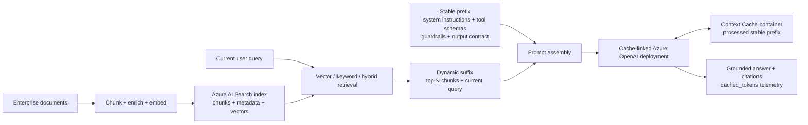

# Azure Context Cache Customer Evaluation

[](https://github.com/david-xinyuwei/david-share/actions/workflows/azure-context-cache-e2e-validation-ci.yml)
[](https://www.python.org/)
[](https://learn.microsoft.com/powershell/)
[](https://github.com/Azure/AzureContextCache/commit/7d1029a5e8b59b1805e70992c85ffe6798d2f47a)
[](../../LICENSE)

[中文](README-CN.md) | [Source](https://github.com/david-xinyuwei/david-share/tree/master/Agents/Azure-Context-Cache-E2E-Validation) | [Official upstream](https://github.com/Azure/AzureContextCache)

Evaluate explicit context caching for Azure OpenAI applications that repeatedly send the same long instructions, tool definitions, examples, or reference content.

**Proven here:** the pinned official Quickstart deployed successfully, and a cache-linked Azure OpenAI deployment returned real cached tokens against a live Azure data plane in one approved subscription.
**Not proven here:** production readiness, a latency or cost guarantee, or how much of the observed hit rate is incremental over the model's own default prompt caching.

## Customer Problem and Business Value

Enterprise AI applications often resend a large, stable prompt prefix on every request while only the user task or case data changes. Azure Context Cache links an Azure OpenAI deployment to a named cache container so matching requests can reuse the processed stable prefix.

> **Customer takeaway:** deploy a named, regional Context Cache container in your subscription and link it to an Azure OpenAI deployment. The first matching request populates the reusable processed prefix; later requests can reuse it within the configured lifetime. Your application still sends the prefix and calls Azure OpenAI normally—the deployment performs the lookup automatically. This is cross-request prompt-processing reuse, not permanent document storage and not semantic retrieval.

| Business value lever | Mechanism stated by the official source | How the customer should validate it |
|---|---|---|
| Request latency | The cached prefix skips re-tokenization and prefill | Measure latency distributions with the customer's prompt mix and concurrency |
| Input-token economics | Cache reads are billed at a discounted input-token rate | Combine `cached_tokens`, actual hit rate, and current Azure pricing |
| Capacity efficiency | Freed prefill compute allows more concurrent requests at the same capacity | Run a controlled throughput test at the target load |
| Cross-request reuse | A named cache container keeps an eligible processed prefix reusable across calls for its configured lifetime | Verify repeated byte-identical prefixes through the linked deployment and monitor `cached_tokens` |
| Governance | The named cache resource is deployed in the customer's subscription, region, and RBAC boundary with a configured TTL | Confirm target-region support, access controls, lifecycle, and data requirements |

> The [pinned official Quickstart](https://github.com/Azure/AzureContextCache/tree/7d1029a5e8b59b1805e70992c85ffe6798d2f47a) describes latency, cost, and throughput as product value levers. This repository proves cache use in one approved environment; it does not quantify the customer's savings or production performance.

## What the Benefit Actually Is

### Where the Saving Comes From

The application still sends the full prefix on every call. What is avoided is the repeated *processing* of that prefix: the pinned official source states that the provider stores the tokenized, pre-attended representation of a stable prefix and reuses it on later requests that begin with the same content. That is why the levers above are latency, input-token economics, and capacity rather than a reduction in what the client transmits.

The official guidance is that the longer and more stable the prefix, the larger the saving. That is the whole economic thesis: a workload whose reusable prefix is short, or whose leading bytes change per request, has little to gain regardless of how the cache is configured.

### Why Not Simply Rely on the Default Prompt Cache?

Azure OpenAI already performs [prompt caching](https://learn.microsoft.com/azure/ai-foundry/openai/how-to/prompt-caching) by default on supported models, so the first honest customer question is what a named Context Cache resource adds. The pinned official source answers it in one sentence:

> Unlike implicit (best-effort) caching that some endpoints do opportunistically, explicit caching is contractual: you create a named cache container, you tell the deployment to use it, and your application controls the lifetime.

| Dimension | Default prompt caching (implicit) | Azure Context Cache (explicit) |
|---|---|---|
| Nature | Best-effort and opportunistic | Contractual: a named resource the customer deploys and binds |
| Eligibility floor | A minimum of 1,024 tokens, and the leading 1,024 tokens must be identical | The same prefix-matching contract, expressed through the linked container |
| Lifetime control | A service-managed retention policy selected per request | A container `timeToLive` the customer sets on a resource they own |
| Residency and isolation | Service-managed; prompt caches are not shared between Azure subscriptions | Cache account and container live in the customer's subscription, region, and RBAC boundary |
| Governance surface | Not an inspectable resource | An ARM resource that can be audited, re-targeted, rotated, or unlinked |
| Client change required | None | None; only `properties.contextCacheContainerId` on the deployment |

Read that table as a **lifetime-and-control argument, not a hit-rate argument**. For prefixes that repeat continuously, the default cache may already serve the request. The differentiated value of Context Cache appears when the reuse window, residency, and lifecycle must be an owned, inspectable, governable property of the customer's own subscription instead of an opportunistic service behavior.

Published default-cache retention behavior sets the reference points a customer should reason against: in-memory retention is typically cleared within 5 to 10 minutes of inactivity and always released within one hour of last use, while extended retention raises the ceiling to a maximum of 24 hours on the model families that support it. A container lifetime measured in days is therefore a different order of reuse window, and it is stated by the customer rather than inferred from service behavior.

### How Long Can the Container Lifetime Be?

Three separate facts are easy to collapse into one, so this repository keeps them apart:

| Statement | Status | Basis |
|---|---|---|
| The pinned Quickstart ships a container lifetime of `7` days | **Verified** | `timeToLive` is declared in the template `variables` block, and the deployed container returned the same value |
| The value is meant to be customized | **Verified** | The official customization guidance directs customers to that same variables block to change TTL, and the template declares no allowed-value list and no maximum |
| Some specific number of days is the maximum the resource provider accepts | **Unverified** | The pinned repository, the ARM template, and the Bicep module publish no upper bound, and this validation did not probe one |

So `7` days is a **default, not a ceiling**. Any customer discussion that needs a longer retention window should confirm the accepted range with the product team or establish it with an explicit deployment test, and should not quote `7` days as a product limit.

### The Benefit Model a Customer Can Compute

This repository does not publish a currency figure, because model, region, deployment type, and traffic shape decide it. It can publish the arithmetic and the variables:

```text
input tokens avoided per hit     = cached_tokens
input tokens avoided per month   = cached_tokens × hit_rate × monthly_requests
monthly input-token cost         = uncached_input_tokens × input_rate
                                 + cached_token_reads    × discounted_input_rate
```

Substituting the observed run purely as illustrative arithmetic: each warm call reported `2304` cached tokens. A workload issuing `100,000` requests per month against the same prefix and the same hit rate would move on the order of `230` million input tokens per month from full-price processing to discounted cache reads. Convert that with the current published rate for the target model, region, and deployment type. Standard and Provisioned deployment types discount cache reads differently, so the conversion is not a single constant.

| Variable | Why it decides the benefit | How to measure it before committing |
|---|---|---|
| Stable prefix length | Below the eligibility floor there is nothing to reuse, and the official guidance ties a larger saving to a longer stable prefix | Tokenize the real system prompt, tool catalog, guardrails, and fixed reference content |
| Prefix byte stability | A single character change in the leading tokens produces a miss | Diff the assembled prefix across a real production traffic sample, including serialization and ordering |
| Request interval versus cache lifetime | Decides whether the prefix is still resident when the next matching request arrives | Histogram inter-arrival time **per prefix family**, not the global request rate |

Combining those variables gives the practical decision grid:

| Traffic pattern | What the default prompt cache does | What Context Cache adds |
|---|---|---|
| Matching prefix arriving continuously, seconds to a few minutes apart | Likely already served | Ownership, residency, an explicit TTL, and an auditable resource |
| Matching prefix with gaps of tens of minutes to hours | In-memory retention is released after inactivity | A reuse window the customer sets instead of infers |
| Matching prefix reused daily, weekly, or in scheduled bursts | Beyond the extended-retention ceiling | The strongest incremental case: a container lifetime measured in days |

The last two rows are the ones worth measuring with customer traffic. A prefix that never reaches the eligibility floor is a prompt-layout problem first, and is covered under **Workload Fit** below.

### What This Validation Does Not Attribute

The live run proves that the deployment bound to `properties.contextCacheContainerId` served repeated prefixes and reported nonzero `cached_tokens` against a real Azure data plane. It does **not** isolate how much of that hit rate is incremental over the model's own default prompt caching, for one concrete reason: the pinned official demo also sets `prompt_cache_retention` on every request, and the deployed model family supports default prompt caching independently of the Context Cache binding. Both controls were present in the validated path at the same time.

Stated plainly: the evidence supports *"this explicit cache path works, is bound to a customer-owned resource, and is observable"*. It does not support *"Context Cache produced a measurably higher hit rate than the default cache would have"*.

Separating the two requires a controlled comparison, which this repository specifies but has not run:

| Element | Design |
|---|---|
| Arms | One deployment with `contextCacheContainerId` set, and one deployment in the same account and region without it, identical model and version |
| Prompt | The same byte-identical stable prefix and the same variable suffix set on both arms |
| Intervals | At least three inter-request gaps: inside the in-memory window, past it but inside extended retention, and past extended retention |
| Metric | Hit rate and `cached_tokens` per arm per interval, repeated enough times to separate a real difference from run-to-run variation |
| Reporting | Publish per-arm and per-interval results, including the intervals where the two arms are indistinguishable |

Until that comparison runs, treat the lifetime, residency, and governance rows as the defensible differentiators, and treat any incremental hit-rate or savings claim as unproven.

## Workload Fit

| Decision | Workload pattern | Evaluation guidance |
|---|---|---|
| **GO** | Long system/developer instructions, stable tool catalogs, few-shot examples, or shared policies | Place reusable content first and changing task data last |
| **GO** | Customer support, code/compliance review, document-heavy assistants, and controlled agent workflows | Proceed when rules, tools, or reference material repeat across requests |
| **CONDITIONAL** | Append-only conversations with a stable early history | Validate that the early prefix remains byte-identical |
| **LOW PRIORITY** | Short prompts or requests whose first section changes frequently | Reusable prefix overlap is limited |
| **LOW PRIORITY** | One-off requests or highly personalized content at the beginning of every prompt | Cache reuse is unlikely |
| **CONDITIONAL** | A business case requiring an exact savings or throughput commitment | Build a separate customer-data benchmark and current pricing model |

## Customer Architecture


1. The customer application places reusable instructions, tools, examples, and shared references in a stable prefix.
2. Per-request user tasks and case data are appended as the dynamic suffix.
3. The application continues to call the Azure OpenAI Responses API; the linked deployment consults the Context Cache container for a matching prefix.
4. The application observes `cached_tokens`, latency, and request outcomes to validate fit with the customer's traffic.

The Context Cache container is an Azure resource in the customer subscription. The pinned Private Preview Quickstart configures the cache account, model-specific container, TTL, and `contextCacheContainerId` binding.

## Where the Data Starts and Where the Cache Lives

### Resource Topology in the Validated Path

The `Microsoft.Storage` namespace here does **not** mean a normal Azure Storage account or Blob container. The pinned Private Preview creates a dedicated `Microsoft.Storage/contextCaches` resource and a model-specific child container. The application never uploads the prompt to Blob Storage and never calls the cache resource directly.

| Object | Location in the validated path | Exact contract | What it contains or does |
|---|---|---|---|
| Stable source before the request | Private materialized copy of the official Quickstart | `demo/system_prompt.md` | Approximately 2.4K tokens of code-review instructions; kept byte-identical across calls |
| Changing source before the request | Same private Quickstart copy | `demo/diffs/*.diff` | A different PR diff appended after the stable system prompt on each call |
| Azure OpenAI account | Approved private subscription, new validation resource group, `centralus` | `Microsoft.CognitiveServices/accounts/<name-prefix>-aoai` | Hosts the Azure OpenAI endpoint |
| Azure OpenAI deployment | Child of the Azure OpenAI account | `deployments/context-cache-deployment`, model `gpt-5.4` version `2026-03-05-contextcache` | Receives the Responses API request and has `properties.contextCacheContainerId` set |
| Context Cache account | Same subscription, resource group, and region | `Microsoft.Storage/contextCaches/<name-prefix>-cache`, `accountKind = Regional` | Customer-controlled cache namespace under Azure RBAC |
| Context Cache container | Child of the Context Cache account | `contextCacheContainers/default-container`, provider `OpenAI`, model `gpt-5.4`, `timeToLive = 7` days | Service-managed storage unit for the reusable processed prefix |

The inspectable ARM resource ID is:

```text
/subscriptions/<subscription-id>/resourceGroups/<resource-group>/providers/Microsoft.Storage/contextCaches/<name-prefix>-cache/contextCacheContainers/default-container
```

With the README example `-NamePrefix ccvalidate`, the cache is `ccvalidate-cache/default-container`, while the linked Azure OpenAI deployment is `ccvalidate-aoai/context-cache-deployment`. The actual validation subscription, resource group, and prefix are intentionally redacted from the public repository; the run was verified in a new private resource group in `centralus`.

The official source describes the cached value as the tokenized, pre-attended representation of the stable prefix. It is not exposed as a customer-addressable file, Blob URL, or Blob object. The resource ID above is the public control-plane boundary; the service's physical storage layout is not exposed by this validation.

### End-to-End Data Flow

| Step | Where | What happens | What is observable |
|---:|---|---|---|
| 1 | Local Quickstart copy | Python reads `system_prompt.md` and one `.diff` file | No Azure cache content exists because the client does not pre-upload anything |
| 2 | Customer application → Azure OpenAI | The stable system prompt is placed first and the changing diff is placed last in one Responses API request | A normal `POST /openai/v1/responses` call |
| 3 | Cache-linked Azure OpenAI deployment | `contextCacheContainerId` makes the deployment consult `default-container` transparently | The application still calls only Azure OpenAI; there is no separate cache SDK call |
| 4 | First request: cache miss | Azure OpenAI processes the full request and the service populates the linked container with the reusable processed prefix | Call 1 reported `cached_tokens = 0` |
| 5 | Later request: cache hit | The byte-identical prefix is reused; the different trailing PR diff is processed for that request | Calls 2–6 each reported `cached_tokens = 2304` |
| 6 | Azure OpenAI → application | The model response and usage telemetry are returned normally | `usage.input_tokens_details.cached_tokens`, output tokens, latency, and status |

The pinned sample uses two different retention controls: the Context Cache container has `timeToLive = 7` days, while each gpt-5.4 request sets `prompt_cache_retention = "24h"`. Both are present in the official sample, but they are not the same setting. This repository verifies their configured values; it does not infer the service's internal tiering from them.

### How the Application Calls It

The following is the essential call path used by the pinned official demo. The cache account and container do not appear in the request because the Azure OpenAI deployment is already linked to them.

```python
from pathlib import Path

import httpx
from azure.identity import DefaultAzureCredential

endpoint = "https://YOUR-AOAI-ACCOUNT.openai.azure.com"
deployment = "context-cache-deployment"
stable_prefix = Path("demo/system_prompt.md").read_text(encoding="utf-8")
diff_name = "01-sql-injection.diff"
dynamic_suffix = Path(f"demo/diffs/{diff_name}").read_text(encoding="utf-8")

token = DefaultAzureCredential(
  exclude_interactive_browser_credential=False
).get_token("https://cognitiveservices.azure.com/.default").token

payload = {
  "model": deployment,
  "input": [
    {
      "type": "message",
      "role": "system",
      "content": [{"type": "input_text", "text": stable_prefix}],
    },
    {
      "type": "message",
      "role": "user",
      "content": [{
        "type": "input_text",
        "text": f"Review this PR diff:\n\nFile: {diff_name}\n\n{dynamic_suffix}",
      }],
    },
  ],
  "max_output_tokens": 200,
  "prompt_cache_retention": "24h",
}

response = httpx.post(
  f"{endpoint}/openai/v1/responses?api-version=preview",
  headers={"Authorization": f"Bearer {token}", "Content-Type": "application/json"},
  json=payload,
  timeout=240,
)
response.raise_for_status()
result = response.json()
print(result.get("output_text") or result.get("output"))
print(result["usage"]["input_tokens_details"]["cached_tokens"])
```

For production applications, the same rule applies: put long reusable instructions, tools, policies, examples, or reference material first; append the current user turn or case data last; and monitor `cached_tokens` in every response.

### Find the Resources in Your Environment

Use the same resource group and `-NamePrefix` supplied to the runner. These commands reveal the logical storage resource and prove the deployment binding without exposing secrets:

```powershell
$subscriptionId = "YOUR-SUBSCRIPTION-ID"
$resourceGroup = "YOUR-RESOURCE-GROUP"
$namePrefix = "YOUR-NAME-PREFIX"

az resource list --subscription $subscriptionId --resource-group $resourceGroup `
  --query "[?contains(type, 'contextCaches') || type=='Microsoft.CognitiveServices/accounts/deployments'].{name:name,type:type,location:location}" `
  -o table

$containerId = az resource show --subscription $subscriptionId `
  --resource-group $resourceGroup `
  --resource-type "Microsoft.Storage/contextCaches/contextCacheContainers" `
  --name "${namePrefix}-cache/default-container" `
  --api-version "2026-01-01-preview" --query id -o tsv

az resource show --subscription $subscriptionId `
  --resource-group $resourceGroup `
  --resource-type "Microsoft.CognitiveServices/accounts/deployments" `
  --name "${namePrefix}-aoai/context-cache-deployment" `
  --api-version "2026-03-15-preview" `
  --query "{deployment:name,model:properties.model,contextCacheContainerId:properties.contextCacheContainerId}" `
  -o json

Write-Output "Expected container: $containerId"
```

The returned `properties.contextCacheContainerId` must exactly equal `$containerId`. In Azure Portal, the same resources appear in the validation resource group under the Azure OpenAI account and the `Microsoft.Storage/contextCaches` resource type; there is no ordinary Blob container to browse.

### Effect Observed in This Validation


| Signal | Calculation from the checked-in six calls | Observed effect | Customer meaning |
|---|---:|---:|---|
| Cache activation | Warm calls with nonzero `cached_tokens` | `5/5` warm calls hit | The deployment-to-container binding served the repeated prefix |
| Reused input processing | `11,520 / 13,037` warm input tokens | `88.4%` of aggregate warm input was reported as cached; `85.9%–90.7%` per call | Most repeated input processing moved to cache reads; this is not the same as an 88.4% bill reduction |
| Directional latency | First call `5820 ms`; warm mean `3642.4 ms` | `2177.6 ms` (`37.4%`) lower than the first call in this run | Supports a latency hypothesis, but one parallel warm burst is not a performance benchmark or SLA |
| Input-token economics | `2304` cached tokens on each of five warm calls | `11,520` cached input tokens read in total | Apply the current model/region pricing to the customer's hit rate; this repository does not claim a dollar saving |
| Output behavior | `6/6` Responses API calls completed | Normal model output plus usage telemetry | Prompt caching changes processing reuse, not the expected response contract |

The official Quickstart pinned to commit `7d1029a5e8b59b1805e70992c85ffe6798d2f47a` was validated end to end in an approved Private Preview subscription. Two later incomplete runs were rejected rather than converted into passes.

> **Evidence boundary:** this is a single-run capability observation, not a production-readiness, availability, cost-saving, throughput, or latency guarantee. The general Azure OpenAI prompt-caching guidance can differ by model family and API surface; this repository specifically evaluates the Private Preview `Microsoft.Storage/contextCaches` and `contextCacheContainerId` path.

**Recommended next step:** after confirming Preview onboarding, permissions, quota, and regional availability, run the same validation with representative prompts in the customer-owned Azure environment.

## Does This Require RAG?

**No.** Azure Context Cache and RAG solve different problems:

| Capability | Primary question | What is stored | How the application uses it |
|---|---|---|---|
| RAG with Azure AI Search | "Which customer knowledge is relevant to this question?" | Source documents, chunks, metadata, and embeddings in a search index or knowledge source | The application or agent explicitly retrieves top results for each query and adds them to the prompt |
| Azure Context Cache | "Which already-supplied prompt prefix should not be processed from scratch again?" | The service-managed tokenized, pre-attended representation of a matching stable prefix in the named Context Cache container | The application sends a normal model request; the linked deployment transparently matches and reuses the prefix |

Context Cache does not replace document ingestion, chunking, embeddings, vector/hybrid search, relevance ranking, citations, freshness, or document-level authorization. It is not a vector database and it does not retrieve semantically similar content.

### How It Complements a Customer RAG Application



The high-value RAG pattern is:

1. Store and govern enterprise content in its authoritative source and RAG index.
2. Retrieve the relevant chunks for the current query; these chunks are normally dynamic.
3. Place stable application instructions, tool schemas, safety policy, output format, and any truly fixed reference content at the **front** of the model request.
4. Append retrieved top-N chunks and the user query at the **end**.
5. Send the assembled request to the cache-linked Azure OpenAI deployment and monitor `cached_tokens`.

| RAG prompt component | Cache expectation | Reason |
|---|---|---|
| System/developer instructions, tool definitions, guardrails, response schema | **Strong candidate** | Long and identical across many requests |
| A fixed product manual or policy included in every request | **Candidate when byte-identical and within the TTL** | The same large reference prefix repeats |
| Query-specific top-N chunks from vector/hybrid search | **Usually dynamic** | Different questions produce different chunks or ordering |
| User question, conversation tail, current case data | **Dynamic suffix** | Changes on every request |

This means RAG can make the business case stronger when the application has a large stable orchestration prefix around every retrieval call. It does **not** mean all RAG results are automatically reusable. A changed chunk, ordering change, security trimming result, or personalization near the front can invalidate the prefix match.

> **Validation status:** the published live E2E validates the official non-RAG Code Reviewer workload. The RAG composition above is an architecture pattern grounded in Microsoft RAG guidance and the official Context Cache prefix contract; it has not yet been benchmarked with a customer search index in this repository.

## Test Information, Procedure, and Evidence

### Test Information

| Item | Verified value |
|---|---|
| Observation date | `2026-08-18` |
| Execution plane | `LOCAL_WINDOWS` |
| Azure region | `centralus` |
| Official source | `Azure/AzureContextCache` at commit `7d1029a5e8b59b1805e70992c85ffe6798d2f47a` |
| Runtime | CPython `3.11.9 AMD64`; orchestration through PowerShell 7 and Azure CLI user authentication |
| Deployment | `gpt-5.4`, model version `2026-03-05-contextcache`, Responses API `preview` |
| Cache contract | Model-specific Context Cache container, 7-day TTL, explicit `contextCacheContainerId` binding |
| Request pattern | 1 warm-up request followed by 5 parallel requests |

This table describes the sanitized validation environment, not a supported-region or production-sizing recommendation.

### Test Procedure

1. **Verify the official source.** `scripts/verify_upstream.py` resolves the pinned Git object, verifies the SHA-256 of all 25 executable inputs, and materializes only those verified bytes outside the public source tree.
2. **Run the read-only Azure preflight.** `scripts/run_official_e2e.ps1 -WhatIf` checks the active subscription, a live ARM read, required resource providers, the gated feature, runtime architecture, and target-region prerequisites without deploying resources or sending model requests.
3. **Deploy the official Quickstart.** The live runner installs the exact hashed Windows AMD64 CPython 3.11 dependencies and invokes the byte-identical official `scripts/quickstart.ps1` with `-SkipPython` in a private run directory.
4. **Exercise the data plane.** The official demo sends one warm-up request and five parallel Responses API requests with a shared stable prefix.
5. **Validate independently.** `scripts/parse_demo_output.py` parses all six call rows and rejects missing rows, transport errors, zero thresholds, zero latency, or insufficient warm hits. `scripts/validate_arm_summary.py` separately verifies deployment success, model identity, cache-container ID, provider, TTL, and deployment binding.
6. **Run offline regression gates.** The unit suite, authenticity validator, public-content audit, repository gate, dependency check, PowerShell parse check, CI matrix, and CodeQL run against the published commit.

### Test Scripts

| Script or suite | Role in the test | Fail-closed behavior |
|---|---|---|
| [`scripts/run_official_e2e.ps1`](scripts/run_official_e2e.ps1) | Azure preflight, verified-source materialization, official Quickstart execution, transcript capture, and evidence orchestration | Stops on profile reuse, wrong runtime, pre-existing resource group, Azure timeout/error, nonzero official exit, or failed evidence validation |
| [`scripts/verify_upstream.py`](scripts/verify_upstream.py) | Verifies the pinned repository, commit, and 25 Git-blob SHA-256 values | Refuses a missing/mismatched blob or nonempty output directory |
| [`scripts/parse_demo_output.py`](scripts/parse_demo_output.py) | Parses call-level latency and token fields and computes the cache verdict | Rejects transport errors, malformed/missing calls, zero thresholds/latency, and insufficient warm hits |
| [`scripts/validate_arm_summary.py`](scripts/validate_arm_summary.py) | Cross-checks ARM deployment state and the AOAI-to-cache binding | Rejects failed deployment, missing fields, wrong model/provider/TTL, or inconsistent resource IDs |
| [`scripts/demo_code_validator.py`](scripts/demo_code_validator.py) | Checks that the harness uses the real official path rather than hardcoded or mock outcomes | Rejects simulated product behavior and source/runtime contract drift |
| [`scripts/audit_public_content.py`](scripts/audit_public_content.py) | Scans the public subtree for secrets, concrete cloud identifiers, unsafe links, reparse points, and unsupported formats | Any public-boundary finding fails the release gate |
| [`scripts/validate_repo.py`](scripts/validate_repo.py) and [`tests/`](tests/) | Recomputes evidence arithmetic/hashes and tests parser, ARM, source-lock, orchestration, and public-boundary branches | Any invariant or regression failure returns a nonzero exit code |

### Sanitized Test Log

The following human-readable excerpt is rendered from [`evidence/verified-run-summary.json`](evidence/verified-run-summary.json). It is **not** the private raw stdout/stderr; cloud identifiers, endpoints, identities, and deployment records remain excluded.

```text
[run] observed_at=2026-08-18 upstream_commit=7d1029a5e8b59b1805e70992c85ffe6798d2f47a
[environment] execution_plane=LOCAL_WINDOWS region=centralus python="3.11.9 AMD64"
[deployment] model=gpt-5.4 model_version=2026-03-05-contextcache api_version=preview cache_ttl_days=7
[call 1] latency_ms=5820 input_tokens=2607 cached_tokens=0    output_tokens=200
[call 2] latency_ms=3791 input_tokens=2571 cached_tokens=2304 output_tokens=126
[call 3] latency_ms=3751 input_tokens=2681 cached_tokens=2304 output_tokens=200
[call 4] latency_ms=3671 input_tokens=2675 cached_tokens=2304 output_tokens=200
[call 5] latency_ms=3215 input_tokens=2570 cached_tokens=2304 output_tokens=133
[call 6] latency_ms=3784 input_tokens=2540 cached_tokens=2304 output_tokens=200
[summary] successful_calls=6 warm_hits=5/5 warm_cached_tokens=2304 verdict=PASS
```

These latency values are retained for auditability only. One run cannot establish a latency distribution or a production performance claim.

### Test Results

The checked-in [`validation-history.json`](evidence/validation-history.json) preserves both complete and rejected runs:

| Date | Execution path | Completed calls | Transport errors | Cache result | Verdict |
|---|---|---:|---:|---:|---|
| `2026-08-18` | `official-baseline` | 6 | 0 | 5/5 warm hits | **PASS** |
| `2026-08-19` | `public-wrapper-reference` | 6 | 0 | 4/5 warm hits | **PASS** |
| `2026-08-19` | `hardened-wrapper-probe-1` | 3 | 3 | Not scored | **REJECTED — INCOMPLETE** |
| `2026-08-19` | `hardened-wrapper-probe-2` | 2 | 4 | Not scored | **REJECTED — INCOMPLETE** |

| Published-commit quality gate | Result | Evidence |
|---|---:|---|
| Deterministic unit tests | `38/38` passed | `python -m unittest discover -s tests -v` |
| Authenticity, public boundary, and repository gates | `3/3` passed | `demo_code_validator.py`, `audit_public_content.py`, `validate_repo.py` |
| Windows/Ubuntu × Python 3.11/3.13 CI matrix | `4/4` jobs passed | [GitHub Actions run 32270323872](https://github.com/david-xinyuwei/david-share/actions/runs/32270323872) |
| CodeQL analyzers | `7/7` jobs passed | [CodeQL run 32270323901](https://github.com/david-xinyuwei/david-share/actions/runs/32270323901) |

The live result and the offline gates answer different questions: the live run proves the bounded Azure product path, while the offline suite proves that the evidence parser, source lock, orchestration controls, and public release contract continue to behave as specified.

## Customer Evaluation Path

### Prerequisites

- PowerShell 7 (`pwsh`) on Windows, Git, Azure CLI, and 64-bit CPython 3.11 on AMD64 Windows
- An Azure subscription approved for the Azure Context Cache Private Preview
- `OpenAI.ContextCacheAllowed` already in `Registered` state
- An isolated `AZURE_CONFIG_DIR` authenticated with the tenant-approved user flow
- Permission to deploy resources and assign `Cognitive Services OpenAI User`
- Available model quota in a supported region

The live run creates billable Azure resources and sends model requests. Choose a unique resource group and name prefix. Inspect the generated evidence before deciding whether to clean up.

### Run the Official E2E

```powershell
$env:AZURE_CONFIG_DIR = "$HOME\.azure-context-cache-validation"
$subscriptionId = "YOUR-SUBSCRIPTION-ID"

az account set --subscription $subscriptionId
az account show --query '{name:name,id:id,tenantId:tenantId,user:user.name}' -o json

pwsh -NoProfile -File .\scripts\run_official_e2e.ps1 `
  -SubscriptionId $subscriptionId `
  -ResourceGroup "rg-context-cache-validation" `
  -Location "centralus" `
  -NamePrefix "ccvalidate" `
  -Runs 6
```

Use `-WhatIf` first to perform time-bounded, read-only Azure preflight without cloning, deploying, or sending requests. A live run requires a new unique resource group, creates a unique private evidence directory outside the source tree, and does not clean up Azure resources automatically. For restricted networks, `-ExistingUpstreamDirectory` may reference a checkout at the pinned commit; see [Method and lineage](docs/METHOD.md) for provenance controls.

### Validate Locally

```powershell
python -m unittest discover -s tests -v
python scripts\demo_code_validator.py
python scripts\audit_public_content.py
python scripts\validate_repo.py
```

These offline gates require no Azure access. The official upstream lock can also be checked against an existing checkout at the pinned commit:

```powershell
python scripts\verify_upstream.py `
  --upstream-dir "PATH-TO-AzureContextCache" `
  --lock .\UPSTREAM_LOCK.json `
  --output "EMPTY-PRIVATE-OUTPUT-DIRECTORY"
```

## Evidence Boundary and Validation Method

The method has three independent proof layers:

| Layer | Authority | Proof |
|---|---|---|
| Source identity | Official Azure Git repository | Pinned commit and verified executable inputs |
| Azure control plane | Azure Resource Manager | Provider/feature preflight plus deployment, AOAI model, cache-container ID, provider, and TTL binding |
| Azure data plane | Official Responses API demo | Six parsed call rows, cached token counts, and fail-closed thresholds |

See [Method and lineage](docs/METHOD.md), [public evidence boundary](evidence/README.md), [sanitized run summary](evidence/verified-run-summary.json), and [validation history](evidence/validation-history.json). Public evidence omits cloud identifiers and private raw logs.

## Security and Operations

- Never put credentials, Azure CLI caches, endpoints, resource IDs, or raw live logs in this repository. The scanner also rejects symlinks, reparse points, unsupported public file formats, and common token/SAS/connection-string forms.
- Keep each project in a dedicated `AZURE_CONFIG_DIR`; the runner refuses the shared implicit default and any workspace inside the public source tree.
- The runner uses Azure CLI user authentication only for local validation. Long-running services should use an appropriate managed identity or service principal.
- The runner requires a new resource group and intentionally does not clean up. Review the upstream `scripts/cleanup.ps1`, the generated `run-contract.json`, private `manifest.json`, and the target resource group before any deletion.
- Deletion is a separate, explicit operation. Do not run cleanup against an existing Azure OpenAI account unless its ownership is understood.

See [SECURITY.md](SECURITY.md) for reporting and operational guidance.

## Product and Evidence Limits

- This is a Private Preview validation harness, not an availability or production-readiness guarantee.
- The upstream API version, model version, regions, quota requirements, and onboarding flow can change.
- A single run cannot establish latency distributions, concurrency guarantees, or savings.
- Cache hits may vary between runs. The default gate requires at least three of five warm calls to hit, and the threshold cannot be zero; adjust only with an explicit acceptance contract.
- The harness currently targets the upstream Windows PowerShell Quickstart.
- The live dependency lock is intentionally limited to the verified Windows AMD64 CPython 3.11 runtime.
- Upstream does not publish a license file at the pinned commit. No upstream source is checked into this subtree; the runner creates a temporary private execution copy from verified Git blobs.

## References

- [Azure/AzureContextCache](https://github.com/Azure/AzureContextCache)
- [Pinned upstream commit](https://github.com/Azure/AzureContextCache/commit/7d1029a5e8b59b1805e70992c85ffe6798d2f47a)
- [Azure OpenAI prompt caching](https://learn.microsoft.com/azure/ai-foundry/openai/how-to/prompt-caching)
- [OpenAI Prompt Caching](https://developers.openai.com/api/docs/guides/prompt-caching)
- [Microsoft RAG architecture guide](https://learn.microsoft.com/azure/architecture/ai-ml/guide/rag/rag-solution-design-and-evaluation-guide)
- [Azure AI Search for RAG](https://learn.microsoft.com/azure/search/retrieval-augmented-generation-overview)
- [Azure CLI configuration isolation](https://learn.microsoft.com/cli/azure/azure-cli-configuration)
- [ATTRIBUTION.md](ATTRIBUTION.md)

Maintainer: Xinyu Wei