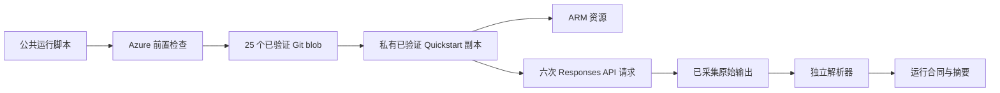

# 方法与证据链

## 权威来源

产品能力以 `Azure/AzureContextCache` 的官方实现为准。本项目调用 commit
`7d1029a5e8b59b1805e70992c85ffe6798d2f47a` 对应的官方 Quickstart，不自行重写 Azure
资源、请求结构或缓存逻辑。

## 执行链路



运行脚本严格按以下顺序执行：

1. 核对当前订阅，并完成一次 `Microsoft.Resources` 实时读取。
2. 确认两个资源提供程序和受控 Preview 功能均已注册。
3. 定位固定的官方 Git commit，核对全部 25 个执行输入的 Git blob SHA-256，再把已验证字节写入私有运行目录；不执行外部工作树中的文件。
4. 按经过实测的 Windows AMD64 CPython 3.11 wheel 版本和 artifact hash 安装依赖；上游 `demo/requirements.txt` 仍单独纳入源码锁。
5. 使用 `-SkipPython` 调用与官方 blob 字节完全一致的 `scripts/quickstart.ps1`。
6. 将 stdout 和 stderr 保存到源码树之外的唯一运行目录。
7. 解析全部六条请求记录，并检查约定的预热后命中率。
8. 通过 ARM outputs、AOAI deployment 和 Context Cache container 交叉验证部署状态、模型和缓存绑定；全部通过后才写入运行合同和产物 manifest。

## 测量合同

解析器把每一条打印出来的请求记录视为一次观测。它不会补齐缺失记录，也不会把 Quickstart 最后的
成功提示当成证据。以下任一情况都会使验证失败：

- 输出中出现 HTTP 或传输错误；
- 请求行数或请求顺序与合同不一致；
- 预热后命中阈值为零，或包含 cached tokens 的预热后请求低于约定比例；
- 任一请求没有可测量延迟；
- 官方进程以非零退出码结束。

默认门槛是 5 次预热后请求至少命中 3 次。这个口径既容纳已观测到的 Private Preview 波动，又能拒绝
完全没有缓存的运行。修改阈值就意味着修改验收合同，必须与结果一起披露。

## 公共证据派生

仓库中的 evidence 保留了复算所需的请求级 token 和延迟字段；导出时删除订阅、租户、资源、endpoint、
用户和邮件标识，同时不公开 Azure 原始 JSON 和私有日志。因此，公共证据是脱敏派生数据，不能替代
私有运维记录。

## 归因边界与对照实验设计

本次有边界的运行证明：绑定 `properties.contextCacheContainerId` 的 deployment 可以端到端完成重复前缀的请求，数据面也会返回非零 `cached_tokens`。但这不等于把这些 cached token 归因给该绑定：官方 demo 在每次请求中设置了 `prompt_cache_retention`，而该模型家族本身也独立支持默认缓存。

私有环境中的受控对照还暴露了调用顺序干扰：

| 本环境中的观测 | 实测内容 |
|---|---|
| 同一账户中新建的 deployment 未绑定容器，也从未调用过，但第一次请求就返回非零 `cached_tokens` | 3.759 秒前，绑定组刚用完全相同的前缀完成冷启动 |
| 随后每轮交替调用中，两个 deployment 的命中表现完全一致 | 绑定组始终先调用，在未绑定组测量前已经预热共享前缀 |

本次观测能支持的最窄结论是：**在这个环境中，同一 Azure OpenAI 账户下的两个 deployment 复用了前缀缓存状态。** 这不是文档承诺的产品行为，也不能据此判断服务内部机制。因此，不能默认同一账户下的不同 deployment 天然构成缓存隔离边界。

修正后的对照实验采用以下设计：

| 要素 | 设计 |
|---|---|
| 对照组 | 同一账户和区域内，一个 deployment 设置 `contextCacheContainerId`，另一个不设置；模型和版本完全相同 |
| Prompt | 两组使用相同的基础 prompt 和后缀合同，但在原始内容之前分别加入等长的 `ARM=A` 或 `ARM=B` 标记，使 cache key 相互独立 |
| 间隔档位 | 位于内存态窗口内、超出内存态但仍在扩展保留内，以及超出扩展保留 |
| 调用顺序 | 固定为绑定组后接对照组，便于复现；由于两臂无法预热同一个内容型前缀，归因不再依赖顺序 |
| 指标 | 按组、按档位记录命中率和 `cached_tokens` |
| 报告方式 | 公布所有档位，包括两组无法区分的档位，也包括否定结果 |

本设计的早期版本在决定结论的档位先调用了**未绑定**组。这消除了一种预热方向，却在相反方向毁掉了归因：未绑定组自身的冷启动预热了共享前缀，于是几秒后绑定组的命中来源变得不明。绑定组优先让第一条绑定请求可以解读，但仍然只有一条未受污染的观测。更强的设计直接隔离 cache key，使每一臂都能独立评估。

## 跨天归因实验

决定结论的档位就是超出文档给出的扩展保留上限的那一档。本实验于 `2026-08-23` 执行。

### 前置条件：机器校验且 fail-closed

| 前置门 | 实测值 |
|---|---|
| 自上一阶段起账户无推理流量 | Azure Monitor `AzureOpenAIRequests` 逐小时桶：仅一个非零桶，且就是上一阶段本身 |
| 空闲时长超过文档给出的默认缓存上限 | 空闲 `43.83` 小时 vs 文档给出的扩展保留上限 `24` 小时 |
| 容器生命周期仍未到期 | 7 天 `timeToLive` 剩余 `124.17` 小时；`provisioningState=Succeeded` |
| 绑定组确实已绑定 | `contextCacheContainerId` 存在 |
| 对照组确实未绑定 | `contextCacheContainerId` 为 `null` |
| 两组其他条件完全一致 | 均为 `gpt-5.4` / `2026-03-05-contextcache`，capacity `100`；前缀字节一致 |

固证步骤在任一前置门不满足时拒绝继续执行，因此受污染的窗口不可能静默产生结果。

### 观测

| 顺序 | 组 | `cached_tokens` | 延迟 |
|---:|---|---:|---:|
| 第 1 个 | 已绑定容器 | `0` | `3182 ms` |
| 第 2 个，`+3.185` 秒 | 未绑定对照 | `2304` | `1678 ms` |

完整性：`prefix_sha256` 唯一，`input_tokens` 同为 `2467`，两次均 `HTTP 200`，已确认绑定组先调用。

### 裁决结论

1. **在本环境中，容器声明的 7 天生命周期没有产生跨天的数据面命中。** 复用窗口假设在本环境、本间隔、本模型和本 Preview 版本下被否证。这是一个有界的否定结果，不是缺陷报告。
2. **前缀缓存状态双向跨越了 deployment 边界。** 结合早期反方向的观测，同一 Azure OpenAI 账户下的不同 deployment 不能被假定为缓存隔离边界。
3. **任何延迟结论都不成立。** 命中对命中的均值为 `1877.8 ms`（绑定组，标准差 `365.3`，n=11）与 `2047.9 ms`（未绑定组，标准差 `766.8`，n=11）。`170 ms` 的差值小于任一标准差，且符号在阶段之间翻转（`−14.9`、`−672.2`、`+230.0` ms）。能成立的是命中快于未命中：`1962.9 ms` vs `3368.5 ms`，降低 `41.7%`。

因此增量命中率、成本和延迟结论仍未得到证明。已完成观测在本环境中指向命中率假设的反面，而下面更严格的 paired-prefix 后续实验也独立得到同方向的否定结果。目前站得住的差异是显式生命周期声明、数据驻留、所有权和治理能力——全部通过控制面回读验证，且都不依赖缓存命中对比。

复现本实验需要在账户上重新建立超过 24 小时的空闲窗口。期间任何推理流量都会使前置条件失效。

## Paired-Prefix 后续实验（已完成）

这是一个新的实验 lineage，不会改写已经完成的跨天结果。它为每一臂分配独立的前缀 family，从根本上移除共享 cache key 干扰，同时保持基础 prompt、后缀合同、模型、版本、capacity、请求结构和保留设置一致。

| 合同要素 | 冻结值 |
|---|---|
| 两臂 | 一个 deployment 绑定 Context Cache 容器，一个未绑定作为对照 |
| Cache key 隔离 | 在原始稳定内容之前加入等长的 `ARM=A` 与 `ARM=B` 标记 |
| 运行时一致性 | 两臂必须返回相同且可测量的 input token 数 |
| Warm 门 | 每一臂两次调用必须独立产生 `cached_tokens: 0 -> >0` |
| Verify 门 | 至少等待 `26` 小时后每臂只调用一次；脚本拒绝提前或重复 Verify |
| 当前状态 | `COMPLETE / 未观测到增量保留` |

Warm 观测：

| 臂 | 第 1 次 | 第 2 次 | 每次 input token |
|---|---:|---:|---:|
| 已绑定 Context Cache | `0` | `2304` | `2513` |
| 未绑定对照 | `0` | `2304` | `2513` |

空闲 `26.012` 小时后的 Verify 观测：

| 实验组 | Cached tokens | Input tokens | 延迟 |
|---|---:|---:|---:|
| 已绑定 Context Cache | `0` | `2512` | `3235 ms` |
| 未绑定对照 | `0` | `2512` | `1846 ms` |

两次 Verify 均返回 `HTTP 200`。判定矩阵在 Verify 前已经冻结；绑定组未命中、对照组未命中的组合对应 `context-cache-incremental-retention-not-observed`。这是一个 Private Preview 环境中的有界结果，不是产品范围内的保证或缺陷报告。

公共探针已参数化，不包含 endpoint、资源 ID 或凭据。发请求前，它使用调用者已隔离的 Azure CLI profile，通过 ARM 校验两个 deployment 定义以及容器的模型/TTL；随后再获取数据面 token，并把请求记录写入 public source tree 之外、由调用者指定的路径。

```powershell
$env:AZURE_CONFIG_DIR = "$HOME\.azure-context-cache-validation"

$common = @(
    '--endpoint', 'https://YOUR-AOAI-ACCOUNT.openai.azure.com',
    '--subscription-id', 'YOUR-SUBSCRIPTION-ID',
    '--resource-group', 'YOUR-RESOURCE-GROUP',
    '--account-name', 'YOUR-AOAI-ACCOUNT',
    '--linked-deployment', 'YOUR-LINKED-DEPLOYMENT',
    '--control-deployment', 'YOUR-CONTROL-DEPLOYMENT',
    '--expected-container-id', '/subscriptions/YOUR-SUBSCRIPTION-ID/resourceGroups/YOUR-RESOURCE-GROUP/providers/Microsoft.Storage/contextCaches/YOUR-CACHE/contextCacheContainers/YOUR-CONTAINER',
    '--prefix-file', 'PATH-TO-STABLE-PREFIX',
    '--run-id', 'customer-eval-001',
    '--output', 'PATH-TO-PRIVATE-RESULTS.jsonl'
)

python .\scripts\paired_prefix_probe.py @common --phase WARM
# 至少等待 26 小时，期间不要复用这两个隔离前缀。
python .\scripts\paired_prefix_probe.py @common --phase VERIFY
```

Verify 前已经冻结裁决矩阵：

| 26+ 小时后绑定臂 | 26+ 小时后对照臂 | 裁决 |
|---:|---:|---|
| 命中 | 未命中 | 本环境观测到 Context Cache 增量保留 |
| 未命中 | 未命中 | 本环境未观测到 Context Cache 增量保留 |
| 命中 | 命中 | 归因不明确：两条路径都保留了前缀 |
| 未命中 | 命中 | 对照臂单独命中的异常结果；形成产品结论前必须调查 |

在 Verify 完成前，Warm 行只能证明两个隔离前缀 family 都可以独立缓存，不能建立跨天保留结论。脱敏状态记录在 [`../evidence/paired-prefix-follow-up.json`](../evidence/paired-prefix-follow-up.json)。

## 声明边界

已完成路径只证明 deployment binding 确实存在，且绑定后的路径在一次有边界的运行中完成了 Responses API 调用并返回了非零 cached tokens。它不证明延迟分布、价格收益、并发保证、区域可用性或生产就绪。已完成的跨天观测为一个前缀和间隔建立了有界否定结果；paired-prefix 后续实验在 Verify 完成前没有保留结果。两者都不能推广到其他区域、模型、前缀、间隔或 Preview 版本。本文只报告实际观测，不根据客户端耗时推断服务端机制。