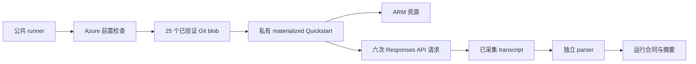

# 方法与证据链

## 权威来源

产品能力的权威来源和官方实现是 `Azure/AzureContextCache`。本项目调用 commit
`7d1029a5e8b59b1805e70992c85ffe6798d2f47a` 对应的官方 Quickstart，不重新实现 Azure
资源、request payload 或 cache logic。

## 执行链路

运行脚本（runner）严格按以下顺序执行：

1. 核对当前 subscription，并完成一次 `Microsoft.Resources` 实时读取。
2. 要求两个 resource provider 和 gated feature 都已注册。
3. 定位 pinned official Git commit，比较全部 25 个执行输入的 Git blob SHA-256，并把同一批已验证字节 materialize 到私有 run directory；外部工作树字节不会被执行。
4. 使用经过实测的 Windows AMD64 CPython 3.11 wheel 精确版本和 artifact hash 安装依赖；upstream `demo/requirements.txt` 仍独立纳入源码 lock。
5. 使用 `-SkipPython` 调用字节完全一致的 materialized 官方 `scripts/quickstart.ps1`。
6. 把 stdout 和 stderr 保存到源码目录之外的唯一 run directory。
7. 解析全部六条请求记录，并检查约定的预热请求命中率（warm-hit ratio）。
8. 跨 ARM outputs、AOAI deployment 和 Context Cache container 验证部署成功与 model/cache binding，之后才写入有边界的运行合同和产物 manifest。

## 测量合同

Parser 把每一条打印出来的请求行视为一次观测。它不会补齐缺失请求，也不会把 Quickstart 最后的
成功提示文本当成证据。以下任一情况都会失败：

- 输出中出现 HTTP 或 transport error；
- 请求行数或请求顺序与合同不一致；
- warm-hit threshold 为零，或包含 cached tokens 的预热后请求低于约定比例；
- 任一请求没有可测量延迟；
- 官方进程以非零退出码结束。

默认门槛是 5 次预热后请求至少命中 3 次。这个口径既容纳已观测到的 Private Preview 波动，又能拒绝
完全没有缓存的运行。修改阈值就意味着修改验收合同，必须与结果一起披露。

## 公共证据派生

仓库中的 evidence 保留了可以复算的请求级 token 和 latency 字段；导出时删除 subscription、tenant、
resource、endpoint、用户和邮件标识，同时不公开 Azure raw JSON 和私有日志。因此，公共证据是脱敏
派生数据，不能替代私有运维记录。

## 声明边界

已完成路径只证明 deployment binding 存在，且 explicit Context Cache 在一次有边界的运行中返回了 cached tokens。它不证明延迟分布、
价格收益、并发保证、区域可用性或生产就绪。本文只报告实际效果，不根据客户端耗时推断服务端机制。