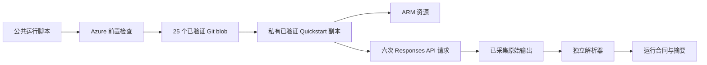

# 方法与证据链

## 权威来源

产品能力以 `Azure/AzureContextCache` 的官方实现为准。本项目调用 commit
`7d1029a5e8b59b1805e70992c85ffe6798d2f47a` 对应的官方 Quickstart，不自行重写 Azure
资源、请求结构或缓存逻辑。

## 执行链路

运行脚本严格按以下顺序执行：

1. 核对当前订阅，并完成一次 `Microsoft.Resources` 实时读取。
2. 确认两个资源提供程序和受控 Preview 功能均已注册。
3. 定位固定的官方 Git commit，核对全部 25 个执行输入的 Git blob SHA-256，再把已验证字节写入私有运行目录；不执行外部工作树中的文件。
4. 按经过实测的 Windows AMD64 CPython 3.11 wheel 版本和 artifact hash 安装依赖；上游 `demo/requirements.txt` 仍单独纳入源码锁。
5. 使用 `-SkipPython` 调用与官方 blob 字节完全一致的 `scripts/quickstart.ps1`。
6. 将 stdout 和 stderr 保存到源码树之外的唯一运行目录。
7. 解析全部六条请求记录，并检查约定的预热后命中率。
8. 通过 ARM outputs、AOAI deployment 和 Context Cache container 交叉验证部署状态、模型和缓存绑定；全部通过后才写入运行合同和产物 manifest。

## 测量合同

解析器把每一条打印出来的请求记录视为一次观测。它不会补齐缺失记录，也不会把 Quickstart 最后的
成功提示当成证据。以下任一情况都会使验证失败：

- 输出中出现 HTTP 或传输错误；
- 请求行数或请求顺序与合同不一致；
- 预热后命中阈值为零，或包含 cached tokens 的预热后请求低于约定比例；
- 任一请求没有可测量延迟；
- 官方进程以非零退出码结束。

默认门槛是 5 次预热后请求至少命中 3 次。这个口径既容纳已观测到的 Private Preview 波动，又能拒绝
完全没有缓存的运行。修改阈值就意味着修改验收合同，必须与结果一起披露。

## 公共证据派生

仓库中的 evidence 保留了复算所需的请求级 token 和延迟字段；导出时删除订阅、租户、资源、endpoint、
用户和邮件标识，同时不公开 Azure 原始 JSON 和私有日志。因此，公共证据是脱敏派生数据，不能替代
私有运维记录。

## 归因边界与对照实验设计

本次有边界的运行证明：绑定 `properties.contextCacheContainerId` 的 deployment 可以处理重复前缀，并返回非零 `cached_tokens`。但它无法分离 Context Cache 相对模型默认 prompt caching 的增量贡献，因为官方 demo 在每次请求中设置了 `prompt_cache_retention`，而该模型家族本身也支持默认缓存。

私有环境中的受控对照还暴露了调用顺序干扰：

| 本环境中的观测 | 实测内容 |
|---|---|
| 同一账户中新建的 deployment 未绑定容器，也从未调用过，但第一次请求就返回非零 `cached_tokens` | 3.759 秒前，绑定组刚用完全相同的前缀完成冷启动 |
| 随后每轮交替调用中，两个 deployment 的命中表现完全一致 | 绑定组始终先调用，在未绑定组测量前已经预热共享前缀 |

本次观测能支持的最窄结论是：**在这个环境中，同一 Azure OpenAI 账户下的两个 deployment 复用了前缀缓存状态。** 这不是文档承诺的产品行为，也不能据此判断服务内部机制。因此，不能默认同一账户下的不同 deployment 天然构成缓存隔离边界。

修正后的对照实验采用以下设计：

| 要素 | 设计 |
|---|---|
| 对照组 | 同一账户和区域内，一个 deployment 设置 `contextCacheContainerId`，另一个不设置；模型和版本完全相同 |
| Prompt | 两组使用字节完全一致的稳定前缀和同一组变化后缀 |
| 间隔档位 | 位于内存态窗口内、超出内存态但仍在扩展保留内，以及超出扩展保留 |
| 调用顺序 | 在决定结论的档位先调用未绑定组，确保绑定组尚未预热共享前缀 |
| 指标 | 按组、按档位记录命中率和 `cached_tokens`，重复足够次数以区分真实差异与运行波动 |
| 报告方式 | 公布所有档位，包括两组无法区分的档位 |

在实验跨过扩展保留边界并完成之前，增量命中率和成本收益均未得到证明。目前可以确认的差异只有显式生命周期、数据驻留和治理能力。

## 声明边界

已完成路径只证明 deployment binding 确实存在，且显式 Context Cache 在一次有边界的运行中返回了 cached tokens。它不证明延迟分布、
价格收益、并发保证、区域可用性或生产就绪。本文只报告实际观测，不根据客户端耗时推断服务端机制。