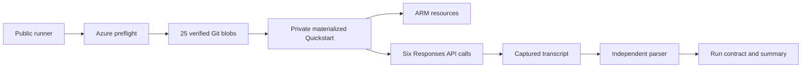

# Method and Lineage

## Authority

The product-producing source is `Azure/AzureContextCache`. This repository invokes the
official Quickstart at commit `7d1029a5e8b59b1805e70992c85ffe6798d2f47a`; it does not
reimplement the Azure resources, request payload, or cache logic.

## Execution Lineage

The runner performs the following stages in order:

1. Verify the active subscription and live `Microsoft.Resources` read.
2. Require both resource providers and the gated feature to be registered.
3. Resolve the pinned official Git commit, compare all 25 executable-input Git blob SHA-256 values, and materialize those same verified bytes into the private run directory. External worktree bytes are never executed.
4. Install the verified live-run dependency set from exact Windows AMD64 CPython 3.11 wheel versions and artifact hashes; the upstream `demo/requirements.txt` remains independently source-locked.
5. Invoke the byte-identical materialized official `scripts/quickstart.ps1` with `-SkipPython`.
6. Capture stdout and stderr in a unique run directory outside the source tree.
7. Parse all six call rows and require the configured warm-hit ratio.
8. Validate deployment success and the model/cache binding across ARM outputs, the AOAI deployment, and the Context Cache container before writing the bounded run contract and artifact manifest.

## Measurement Contract

The parser treats each printed call row as one observation. It does not infer missing
calls and does not use the Quickstart's final success text as evidence. A run fails when:

- an HTTP or transport error appears;
- the row count or call order differs from the contract;
- the configured warm-hit threshold is zero, or fewer than that fraction of warm calls contain cached tokens;
- a row has no measurable latency; or
- the official process exits nonzero.

The default threshold is three cache hits among five warm calls. It accommodates observed
Private Preview variability while still rejecting a no-cache run. Changing this threshold
creates a different acceptance contract and must be disclosed with the result.

## Public Evidence Derivation

The checked-in evidence preserves call-level token and latency fields needed for arithmetic
recomputation. The export removes subscription, tenant, resource, endpoint, user, and email
identifiers. It also omits raw Azure JSON and private logs. This makes the public evidence a
sanitized derivative, not a replacement for private operational records.

## Attribution Boundary and Comparison Design

The bounded run proves that a deployment bound to `properties.contextCacheContainerId` completed repeated-prefix requests end to end and that the data plane reported nonzero `cached_tokens`. It does not attribute those cached tokens to the binding: the official demo sets `prompt_cache_retention` on every request, and the model family supports default caching independently of the Context Cache binding.

A private controlled comparison also exposed an ordering confound:

| Observation in this environment | What was measured |
|---|---|
| A new deployment in the same account had no container binding and had never been called, yet its first request returned nonzero `cached_tokens` | The bound deployment had cold-started the byte-identical prefix 3.759 seconds earlier |
| Later alternating rounds showed identical hit behavior on both deployments | The bound deployment was always called first and warmed the shared prefix before the unbound deployment was measured |

The narrow conclusion is limited to this environment: **prefix cache state was reused across two deployments in one Azure OpenAI account.** This is not a documented product guarantee or a statement about internal service behavior. It means that separate deployments in one account cannot be assumed to form a cache isolation boundary.

The corrected comparison uses the following design:

| Element | Design |
|---|---|
| Arms | One deployment with `contextCacheContainerId` and one deployment in the same account and region without it; model and version are identical |
| Prompt | The same byte-identical stable prefix and variable suffix set on both arms |
| Intervals | Inside the in-memory window, past it but inside extended retention, and past extended retention |
| Call order | Call the **bound** arm first at the deciding interval, so its first request is measured before anything can warm the shared prefix |
| Metrics | Hit rate and `cached_tokens` per arm and interval |
| Reporting | Publish every interval, including intervals where the two arms are indistinguishable, and including negative results |

An earlier iteration of this design called the *unbound* arm first at the deciding interval. That removed the pre-warm contamination but destroyed attribution in the opposite direction: the unbound arm's own cold miss warmed the shared prefix, so a hit on the bound arm moments later had an ambiguous source. **Only the first call of an idle window is uncontaminated, and it must be the arm whose capability is under test.**

## Cross-Day Attribution Test

The deciding interval is the one past the documented extended-retention ceiling. This test was executed on `2026-08-23`.

### Preconditions, machine-verified and fail-closed

| Gate | Verified value |
|---|---|
| No inference traffic on the account since the previous phase | Azure Monitor `AzureOpenAIRequests`, hourly buckets: exactly one non-zero bucket, and it is the previous phase itself |
| Idle duration above the documented default-cache ceiling | `43.83` h idle versus a documented `24` h maximum for extended retention |
| Container lifetime still open | `124.17` h remaining of the 7-day `timeToLive`; `provisioningState=Succeeded` |
| Bound arm actually bound | `contextCacheContainerId` present |
| Control arm actually unbound | `contextCacheContainerId` is `null` |
| Arms otherwise identical | Both `gpt-5.4` / `2026-03-05-contextcache`, capacity `100`; byte-identical prefix |

The sealing step refuses to proceed if any gate fails, so a contaminated window cannot silently produce a result.

### Observation

| Order | Arm | `cached_tokens` | Latency |
|---:|---|---:|---:|
| 1st | bound to container | `0` | `3182 ms` |
| 2nd, `+3.185` s | unbound control | `2304` | `1678 ms` |

Integrity: single `prefix_sha256`, identical `input_tokens=2467`, both `HTTP 200`, bound arm confirmed first.

### Adjudicated findings

1. **The declared 7-day container lifetime did not produce a cross-day data-plane hit in this environment.** The reuse-window hypothesis is falsified for this environment, interval, model, and Preview build. This is a bounded negative result, not a defect report.
2. **Prefix cache state crossed the deployment boundary in both directions.** Combined with the earlier reverse observation, separate deployments in one Azure OpenAI account must not be assumed to form a cache isolation boundary.
3. **No latency claim is supportable.** Hit-versus-hit means were `1877.8 ms` (bound, sd `365.3`, n=11) and `2047.9 ms` (unbound, sd `766.8`, n=11). The `170 ms` gap is smaller than either standard deviation and its sign flips across phases (`−14.9`, `−672.2`, `+230.0` ms). What is supportable is that a hit beats a miss: `1962.9 ms` versus `3368.5 ms`, a `41.7%` reduction.

Incremental hit-rate, cost, and latency claims therefore remain unproven, and one decisive measurement points against the hit-rate hypothesis. The defensible differentiators are explicit lifetime declaration, residency, ownership, and governance — all verified through control-plane reads and none dependent on a cache-hit comparison.

Reproducing this test requires re-establishing an idle window longer than 24 hours on the account. Any inference traffic in between invalidates the precondition.

## Claim Boundary

The completed path proves that the deployment binding was present and that the bound path completed Responses API calls with nonzero cached tokens in one bounded run. It does not prove a latency distribution, pricing outcome, concurrency guarantee, regional availability, or production readiness. The cross-day test additionally establishes a bounded negative result for cross-day reuse in this environment; it does not generalise to other regions, models, prefixes, intervals, or Preview builds. Effect is reported; server-side mechanism is not inferred from client-side timing.