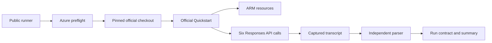

# Method and Lineage

## Authority

The product-producing source is `Azure/AzureContextCache`. This repository invokes the
official Quickstart at commit `7d1029a5e8b59b1805e70992c85ffe6798d2f47a`; it does not
reimplement the Azure resources, request payload, or cache logic.

## Execution Lineage

The runner performs the following stages in order:

1. Verify the active subscription and live `Microsoft.Resources` read.
2. Require both resource providers and the gated feature to be registered.
3. Resolve the pinned official Git commit and compare 11 Git blob content SHA-256 values.
4. Install only the dependencies named by the verified official `demo/requirements.txt`.
5. Invoke the unchanged official `scripts/quickstart.ps1` with `-SkipPython`.
6. Capture stdout and stderr in a unique run directory outside the source tree.
7. Parse all six call rows and require the configured warm-hit ratio.
8. Read the completed ARM deployment and write a bounded run contract plus artifact manifest.

## Measurement Contract

The parser treats each printed call row as one observation. It does not infer missing
calls and does not use the Quickstart's final success text as evidence. A run fails when:

- an HTTP or transport error appears;
- the row count or call order differs from the contract;
- fewer than the configured fraction of warm calls contain cached tokens; or
- the official process exits nonzero.

The default threshold is three cache hits among five warm calls. It accommodates observed
Private Preview variability while still rejecting a no-cache run. Changing this threshold
creates a different acceptance contract and must be disclosed with the result.

## Public Evidence Derivation

The checked-in evidence preserves call-level token and latency fields needed for arithmetic
recomputation. The export removes subscription, tenant, resource, endpoint, user, and email
identifiers. It also omits raw Azure JSON and private logs. This makes the public evidence a
sanitized derivative, not a replacement for private operational records.

## Claim Boundary

The completed path proves that explicit Context Cache served cached tokens in one bounded
run. It does not prove a latency distribution, pricing outcome, concurrency guarantee,
regional availability, or production readiness. Effect is reported; server-side mechanism
is not inferred from client-side timing.