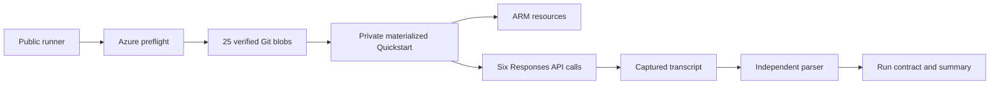

# Method and Lineage

## Authority

The product-producing source is `Azure/AzureContextCache`. This repository invokes the
official Quickstart at commit `7d1029a5e8b59b1805e70992c85ffe6798d2f47a`; it does not
reimplement the Azure resources, request payload, or cache logic.

## Execution Lineage

The runner performs the following stages in order:

1. Verify the active subscription and live `Microsoft.Resources` read.
2. Require both resource providers and the gated feature to be registered.
3. Resolve the pinned official Git commit, compare all 25 executable-input Git blob SHA-256 values, and materialize those same verified bytes into the private run directory. External worktree bytes are never executed.
4. Install the verified live-run dependency set from exact Windows AMD64 CPython 3.11 wheel versions and artifact hashes; the upstream `demo/requirements.txt` remains independently source-locked.
5. Invoke the byte-identical materialized official `scripts/quickstart.ps1` with `-SkipPython`.
6. Capture stdout and stderr in a unique run directory outside the source tree.
7. Parse all six call rows and require the configured warm-hit ratio.
8. Validate deployment success and the model/cache binding across ARM outputs, the AOAI deployment, and the Context Cache container before writing the bounded run contract and artifact manifest.

## Measurement Contract

The parser treats each printed call row as one observation. It does not infer missing
calls and does not use the Quickstart's final success text as evidence. A run fails when:

- an HTTP or transport error appears;
- the row count or call order differs from the contract;
- the configured warm-hit threshold is zero, or fewer than that fraction of warm calls contain cached tokens;
- a row has no measurable latency; or
- the official process exits nonzero.

The default threshold is three cache hits among five warm calls. It accommodates observed
Private Preview variability while still rejecting a no-cache run. Changing this threshold
creates a different acceptance contract and must be disclosed with the result.

## Public Evidence Derivation

The checked-in evidence preserves call-level token and latency fields needed for arithmetic
recomputation. The export removes subscription, tenant, resource, endpoint, user, and email
identifiers. It also omits raw Azure JSON and private logs. This makes the public evidence a
sanitized derivative, not a replacement for private operational records.

## Attribution Boundary and Comparison Design

The bounded run proves that the deployment bound to `properties.contextCacheContainerId` served repeated prefixes and reported nonzero `cached_tokens`. It does not isolate how much of that hit rate is incremental over the model's default prompt caching: the official demo sets `prompt_cache_retention` on every request, and the model family supports default caching independently of the Context Cache binding.

A private controlled comparison also exposed an ordering confound:

| Observation in this environment | What was measured |
|---|---|
| A new deployment in the same account had no container binding and had never been called, yet its first request returned nonzero `cached_tokens` | The bound deployment had cold-started the byte-identical prefix 3.759 seconds earlier |
| Later alternating rounds showed identical hit behavior on both deployments | The bound deployment was always called first and warmed the shared prefix before the unbound deployment was measured |

The narrow conclusion is limited to this environment: **prefix cache state was reused across two deployments in one Azure OpenAI account.** This is not a documented product guarantee or a statement about internal service behavior. It means that separate deployments in one account cannot be assumed to form a cache isolation boundary.

The corrected comparison uses the following design:

| Element | Design |
|---|---|
| Arms | One deployment with `contextCacheContainerId` and one deployment in the same account and region without it; model and version are identical |
| Prompt | The same byte-identical stable prefix and variable suffix set on both arms |
| Intervals | Inside the in-memory window, past it but inside extended retention, and past extended retention |
| Call order | At the deciding interval, call the unbound arm first so it is measured before the bound arm can warm the shared prefix |
| Metrics | Hit rate and `cached_tokens` per arm and interval, repeated enough to separate a real difference from run-to-run variation |
| Reporting | Publish every interval, including intervals where the two arms are indistinguishable |

Until that comparison completes past the extended-retention boundary, incremental hit-rate and savings claims remain unproven. The defensible differentiators are explicit lifetime, residency, and governance.

## Claim Boundary

The completed path proves that the deployment binding was present and explicit Context Cache served cached tokens in one bounded
run. It does not prove a latency distribution, pricing outcome, concurrency guarantee,
regional availability, or production readiness. Effect is reported; server-side mechanism
is not inferred from client-side timing.