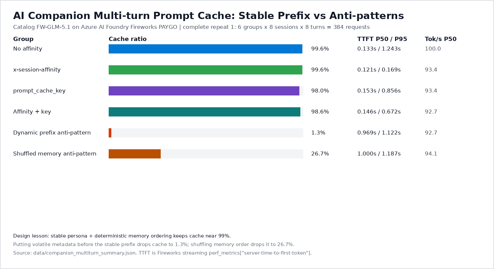

# Azure 上的 Fireworks GLM-5.1 Prompt Cache 调参指南

    

这是给微软同事和客户看的现场指南：**哪些 prompt / request settings 能提升 Fireworks prompt cache hit rate，能提升多少，证据是什么**。

> Author: Wei Xinyu (Xinyu Wei), Microsoft AI and Apps Global Black Belt (GBB) Senior System Engineer

[English](README.md) | [中文版](README-CN.md)

---

## Executive Summary

最大杠杆不是模型参数，而是 prompt layout：先保证 stable prefix 和 deterministic memory order，再加 stable session routing key。

主测试使用 Azure AI Foundry Fireworks PAYGO 上的 catalog `FW-GLM-5.1`。下表来自一个完整 repeat：**6 组 x 8 sessions x 8 turns = 384 个 streaming requests 全部成功**。第二个 repeat 曾启动，但遇到 streaming connection 偶发卡住；partial 数据保留在 JSON 里追溯，不放进主推荐表。

| Setting / Control | 怎么设置 | Cache Hit-Rate 提升 | TTFT 影响 | 建议 |
|---|---|---:|---:|---|
| Stable prompt prefix | persona、policy、tools、deterministic memory 放前面；volatile user/request data 放最后 | **1.30% -> 99.64%**，**+98.34 pp**，比 dynamic-prefix anti-pattern 高 **76.65x** | P50 **0.969s -> 0.121s** (-87.5%)；P95 **1.1221s -> 0.1689s** (-84.9%) | 永远第一优先级，这是最大杠杆 |
| Deterministic memory order | companion memory 每轮按固定顺序序列化 | **26.67% -> 99.64%**，**+72.97 pp**，比 shuffled-memory anti-pattern 高 **3.74x** | P50 **0.9995s -> 0.121s** (-87.9%)；P95 **1.1872s -> 0.1689s** (-85.8%) | AI companion、agent memory、用户 profile/context block 必做 |
| `x-session-affinity` | 每个 user/session 固定一个 header 值 | warmed catalog run 里 cache 本来已高：**99.63% -> 99.64%**，+0.01 pp | P95 **1.2434s -> 0.1689s** (-86.4%)，对比 no explicit affinity | 客户端能加 header 时的默认推荐；明显改善 tail latency 和 cache locality |
| `prompt_cache_key` | 每个 user/session 固定一个 request body 值 | **1.30% -> 97.99%**，**+96.69 pp**，对比 dynamic-prefix anti-pattern | P50 **0.969s -> 0.1535s** (-84.2%)；P95 **1.1221s -> 0.8557s** (-23.7%) | 如果 body 参数比自定义 header 更容易控制，就用它 |
| `x-session-affinity` + `prompt_cache_key` | 两个都设置为稳定值 | **1.30% -> 98.63%**，**+97.33 pp**，对比 dynamic-prefix anti-pattern | P50 **0.969s -> 0.1465s** (-84.9%)；P95 **1.1221s -> 0.6725s** (-40.1%) | 可用，但本轮没有优于单独 `x-session-affinity` |
| `prompt_cache_isolation_key` | 只有需要 cache namespace isolation 时稳定设置 | 不是提升 cache 的旋钮；变化它会拆分 cache entries | 每个 request 都变会降低共享 | 用于多租户隔离 / privacy boundary，不用于提命中率 |
| `temperature`, `top_p`, `max_tokens` | generation controls | 没有实测 cache-hit lift | 影响输出形态、成本和 generation time | cache layout/routing 调对后再调 |

**现场结论：**先修 prompt layout，再加 stable session routing key。如果 prompt 开头每轮都变，任何 request 参数都救不了 cache。

### 最佳实践调用代码

生产代码建议使用这个形态：stable prefix 放前面，dynamic content 放最后，每个 user/session 固定一个 routing key。

```python
#!/usr/bin/env python3
"""Minimal Azure AI Foundry Fireworks chat call with prompt-cache-friendly settings."""

import json
import os
import urllib.request

endpoint = os.environ["FIREWORKS_AZURE_ENDPOINT"].rstrip("/")
deployment = os.environ["FIREWORKS_DEPLOYMENT"]
api_version = os.getenv("FIREWORKS_API_VERSION", "2025-04-01-preview")
token = os.environ["FIREWORKS_BEARER_TOKEN"]

user_id = "user-123"          # 真实用户 ID，保持稳定。
conversation_id = "chat-456"  # 多轮会话 ID，保持稳定。
session_key = f"{user_id}:{conversation_id}"

# 这一段必须在多轮请求之间保持 byte/token stable。
stable_persona = """
You are a warm AI companion. Be concise, supportive, and practical.
Do not mention internal cache, routing, or benchmark details to the user.
""".strip()

# memory 顺序必须 deterministic，不能每个 request 随机排序。
stable_memory_items = [
    "The user prefers short replies with one concrete next step.",
    "The user values gentle encouragement over direct criticism.",
    "The user is building a calmer evening routine.",
]
stable_memory = "\n".join(f"- {item}" for item in stable_memory_items)

static_app_policy = """
Prompt layout rules:
1. Stable persona and policy first.
2. Stable memory in deterministic order.
3. Conversation history in chronological order.
4. Current user message and volatile request context last.
""".strip()

# 每轮真正变化的内容只放在尾部。
current_user_message = "I feel tired today. Help me decide one small next step."
volatile_tail_context = "request_id=req-789; client_time_bucket=2026-06-23T09:00Z"

messages = [
    {
        "role": "system",
        "content": f"{stable_persona}\n\nStable user memory:\n{stable_memory}\n\n{static_app_policy}",
    },
    {
        "role": "user",
        "content": f"{current_user_message}\n\nVolatile context, placed last:\n{volatile_tail_context}",
    },
]

url = f"{endpoint}/openai/deployments/{deployment}/chat/completions?api-version={api_version}"
payload = {
    "messages": messages,
    "temperature": 0,
    "max_tokens": 128,
    # Body-level cache/session routing key。每个 user/session 固定一个值。
    "prompt_cache_key": session_key,
    # 让 Fireworks 返回 server TTFT 和 cached-token metrics。
    "perf_metrics_in_response": True,
}
headers = {
    "Content-Type": "application/json",
    "Authorization": f"Bearer {token}",
    # Header-level session routing key。本轮实测 tail TTFT 最好。
    "x-session-affinity": session_key,
}

request = urllib.request.Request(url, data=json.dumps(payload).encode("utf-8"), headers=headers, method="POST")
with urllib.request.urlopen(request, timeout=60) as response:
    body = json.loads(response.read().decode("utf-8"))

usage = body.get("usage", {})
details = usage.get("prompt_tokens_details", {})
perf = body.get("perf_metrics", {})

print("answer:", body["choices"][0]["message"]["content"])
print("prompt_tokens:", usage.get("prompt_tokens"))
print("cached_tokens:", details.get("cached_tokens"))
print("server_ttft_sec:", perf.get("server-time-to-first-token"))
```

等价 curl 写法：

```bash
SESSION_KEY="user-123:chat-456"

curl -sS "$FIREWORKS_AZURE_ENDPOINT/openai/deployments/$FIREWORKS_DEPLOYMENT/chat/completions?api-version=2025-04-01-preview" \
  -H "Content-Type: application/json" \
  -H "Authorization: Bearer $FIREWORKS_BEARER_TOKEN" \
  -H "x-session-affinity: $SESSION_KEY" \
  -d @- <<'JSON'
{
  "temperature": 0,
  "max_tokens": 128,
  "prompt_cache_key": "user-123:chat-456",
  "perf_metrics_in_response": true,
  "messages": [
    {
      "role": "system",
      "content": "Stable persona and policy first.\n\nStable user memory:\n- The user prefers short replies with one concrete next step.\n- The user values gentle encouragement over direct criticism.\n\nStatic app policy: keep dynamic request metadata at the end."
    },
    {
      "role": "user",
      "content": "I feel tired today. Help me decide one small next step.\n\nVolatile context, placed last: request_id=req-789."
    }
  ]
}
JSON
```

不要这样写：

```python
# 错误：timestamp/request_id 放在 stable persona 前面，会破坏 exact-prefix reuse。
system_prompt = f"""
request_id={request_id}; timestamp={now_iso}
You are a warm AI companion...
Stable user memory:
{stable_memory}
"""
```

---

## Scope Definition

| 维度 | 本 repo 包含 | 不声称什么 |
|---|---|---|
| Model | Azure AI Foundry Fireworks PAYGO 上的 catalog `FW-GLM-5.1` | 客户 merged full-weight custom model 性能 |
| 主 workload | synthetic AI companion multi-turn sessions | 客户真实生产流量 replay |
| 指标 | `cached_tokens`、cache ratio、streaming TTFT、output tokens/sec、non-streaming latency | 生产 SLA、PTU 容量保证 |
| Custom model 边界 | 实测 full-weight PAYGO deployment 返回 Provisioned-only 要求 | 不表示 custom PTU 不能跑 |
| 用途 | cache-hit 调参方法和现场沟通依据 | custom full-weight deployment 的最终 sizing |

请把本 repo 当成 **catalog baseline + cache methodology reference**。真正 customer weights 必须在 Provisioned/PTU 上复验。

---

## Detailed Test Data

### 1. AI Companion Multi-Turn Prompt Layout Test

<div align="center">
  
</div>

主 workload：每组 8 sessions x 8 turns。下表每行 **N=64 requests**，来自一个完整 repeat。

| Group | Cache Ratio | TTFT avg | TTFT P50 | TTFT P90 | TTFT P95 | TTFT P99 | tok/s avg | tok/s P10 | tok/s P50 | tok/s P90 |
|---|---:|---:|---:|---:|---:|---:|---:|---:|---:|---:|
| No affinity | 99.63% | 0.2585s | 0.1330s | 0.6834s | 1.2434s | 1.4786s | 96.36 | 68.03 | 100.03 | 134.83 |
| `x-session-affinity` | 99.64% | 0.1196s | 0.1210s | 0.1664s | 0.1689s | 0.3515s | 96.48 | 67.15 | 93.39 | 126.32 |
| `prompt_cache_key` | 97.99% | 0.2974s | 0.1535s | 0.6942s | 0.8557s | 1.1058s | 93.32 | 72.29 | 93.39 | 118.62 |
| Affinity + key | 98.63% | 0.3165s | 0.1465s | 0.6520s | 0.6725s | 2.2374s | 88.04 | 56.60 | 92.67 | 119.64 |
| Dynamic prefix anti-pattern | 1.30% | 0.9089s | 0.9690s | 1.0944s | 1.1221s | 2.1601s | 84.02 | 22.73 | 92.67 | 127.66 |
| Shuffled memory anti-pattern | 26.67% | 0.9209s | 0.9995s | 1.0982s | 1.1872s | 1.4014s | 87.57 | 24.42 | 94.12 | 126.32 |

解读：

- Stable prefix + stable session routing 是 companion-style prompt 的最佳实测组合。
- `x-session-affinity` 在本轮 tail TTFT 最稳。
- `prompt_cache_key` 有效，但 P95 tail 高于 `x-session-affinity`。
- prompt 前面放 dynamic metadata 会击穿 cache。
- memory 顺序打乱后，虽然事实没变，但 prefix token 序列变了，cache 大幅下降。

### 2. 公共 Prompt-Diversity Baseline: HF UltraChat

这组使用 `HuggingFaceH4/ultrachat_200k` 的 64 条公开 first-user prompts。它不是客户流量 replay，而是用来观察 prompt 多样化时 cache 会自然下降到什么程度。

| Round | Success | Cache Ratio | TTFT avg | TTFT P50 | TTFT P90 | TTFT P95 | TTFT P99 | tok/s avg | tok/s P10 | tok/s P50 | tok/s P90 | Wall tok/s |
|---|---:|---:|---:|---:|---:|---:|---:|---:|---:|---:|---:|---:|
| Cold | 64/64 | 14.84% | 1.3866s | 1.0140s | 2.4134s | 3.2813s | 3.8921s | 47.55 | 29.91 | 42.86 | 56.86 | 873.41 |
| Warm | 64/64 | 44.07% | 1.4099s | 1.4170s | 1.5725s | 3.3578s | 3.5334s | 48.11 | 36.61 | 44.72 | 61.00 | 1018.59 |

解读：prompt 多样化时 cache ratio 会低很多，这是预期现象。Warm-up 仍然提高了 cache ratio 和 wall throughput。

### 3. 64-Concurrency Smoke Test

这一组是 non-streaming response latency，不是 TTFT。它验证 raised PAYGO catalog deployment 能承载 64 并发 smoke traffic。

| Round | Success | Errors | Cache Ratio | P50 Response Latency | P95 Response Latency | Completion TPS | Requests/sec |
|---|---:|---:|---:|---:|---:|---:|---:|
| Round 1 | 64/64 | 0 | 71.53% | 4.7426s | 5.6835s | 616.70 | 9.64 |
| Warm Round 2 | 64/64 | 0 | 89.17% | 3.8579s | 4.5928s | 774.03 | 12.09 |

解读：warm cache 后 response latency 和 throughput 都改善，但这里可能混入 backend warmup、connection reuse 等因素，所以只能当 smoke test，不是 SLA。

### 4. Small Cache Probe Matrix

这是小型 single-run probe，用来验证 exact-prefix 机制。

| Scenario | Prompt Tokens | Cached Tokens | Cache Ratio | 解读 |
|---|---:|---:|---:|---|
| No affinity warm | 105 | 0 | 0.00% | 首次请求预热 cache |
| No affinity repeat | 105 | 104 | 99.05% | 重复 prefix 命中 cache |
| Affinity warm | 105 | 95 | 90.48% | prefix 已被前序 probe 部分预热 |
| Affinity repeat | 105 | 104 | 99.05% | 稳定 session key 命中 cache |
| Prompt cache key warm | 105 | 0 | 0.00% | 首次请求预热 key 对应 cache |
| Prompt cache key repeat | 105 | 104 | 99.05% | `prompt_cache_key` 同样命中 cache |
| Same prefix, changed suffix | 107 | 96 | 89.72% | stable prefix 仍复用大部分 cache |
| Changed prefix | 106 | 5 | 4.72% | prefix 改动会打掉 cache |

解读：这些是点估计，不是置信区间。它们适合在大 benchmark 前验证机制。

---

## Test Methodology

### Metrics

| Metric | 含义 | 来源 |
|---|---|---|
| Cache ratio | `cached_tokens / prompt_tokens` | `usage.prompt_tokens_details.cached_tokens` |
| TTFT | Server time to first token | Fireworks streaming `perf_metrics["server-time-to-first-token"]` |
| Output tok/s | `completion_tokens / generation-duration` | Fireworks streaming `perf_metrics` |
| Response latency | 完整 non-streaming request latency | `loadtest_fireworks.py` client timer |

Percentile 使用脚本里的 linear interpolation 计算。

### Companion Test 使用的 Prompt 形态

Benchmark 使用固定 assistant responses，让 history deterministic。它测的是 prompt-cache 行为，不测回答质量。

Cache-friendly shape:

```text
System:
  Stable companion persona
  Stable safety/style policy
  Stable user memory in deterministic order
  Static app instructions

History:
  Ordered previous user/assistant turns

Current user message:
  Appended at the end
```

Dynamic-prefix anti-pattern:

```text
System:
  Volatile request metadata: repeat/session/turn/timestamp
  Stable companion persona
  Stable user memory
  Static app instructions
```

Shuffled-memory anti-pattern:

```text
System:
  Stable companion persona
  Same memory facts, but order changes across turns
  Static app instructions
```

### 测过的 Request Parameters

| Parameter | 对 cache 行为的作用 | 官方文档信号 |
|---|---|---|
| `x-session-affinity` | Header-level session routing hint | Fireworks 建议 stable session routing，因为 cache 是 replica-local |
| `prompt_cache_key` | Body-level session routing key | Fireworks API 写明 same key routes to same backend，并且优先于 `user` |
| `prompt_cache_isolation_key` | Cache namespace partition | 用于隔离；变化它会阻止 otherwise identical prompts 共享 cache |
| `user` | End-user identifier / fallback routing hint | Fireworks prompt-cache guide 提到 `user`；API docs 写明 `prompt_cache_key` 优先 |
| `temperature`, `top_p`, `max_tokens` | Generation controls | 影响输出和成本，不影响 prefix matching |

---

## Running On Azure

| Item | Value / Guidance |
|---|---|
| Platform | Azure AI Foundry Fireworks |
| Tested catalog model | `FW-GLM-5.1` |
| Tested deployment shape | `DataZoneStandard` PAYGO catalog deployment |
| Tested capacity | 400k TPM, 400 requests/minute in the test subscription |
| Auth | 原始测试使用 Microsoft Entra token；脚本也支持 API key |
| Custom full-weight model | tested path 里需要 Provisioned/PTU；PAYGO custom full-weight deployment 返回 Provisioned-only error |
| Region / availability | 以 Microsoft Learn Fireworks on Foundry region availability 和 quota guidance 为准 |
| Compliance caveat | Microsoft Learn 说明 Fireworks on Foundry 不在 EU Data Boundary commitments 内，且 FedRAMP 未达成；客户需自行评估适用性 |

---

## Custom Full-Weight Model Boundary

本 repo 不 benchmark 客户 merged full-weight model。它验证的是 catalog deployment 上的 cache mechanics 和 measurement method。

在测试路径里，full-weight custom model 注册成功，但 `FireworksCustom + DataZoneStandard` deployment attempt 返回 Provisioned-only requirement。实际含义：

1. 用本 repo 验证 prompt layout、routing hints、metric collection 和复现流程。
2. 不要把 catalog PAYGO 数字当成 customer weights 的最终 latency/cache 结论。
3. 下一轮必须在 Provisioned/PTU 上，用 customer weights 和真实 session grouping 重跑 companion test。

---

## Reproducing

### Prerequisites

- Python 3.10+
- `aiohttp`
- 一个 Azure AI Foundry Fireworks Chat Completions-compatible deployment
- Microsoft Entra bearer token 或 API key

```bash
pip install -r requirements.txt
```

### Environment Variables

```bash
export FIREWORKS_AZURE_ENDPOINT="https://<your-ai-services-account>.cognitiveservices.azure.com/"
export FIREWORKS_DEPLOYMENT="<your-deployment-name>"
export FIREWORKS_BEARER_TOKEN="<entra-access-token>"
export FIREWORKS_API_KEY="<api-key>"  # only if local auth is enabled
```

### Cache Probe

```bash
python scripts/cache_probe.py \
  --endpoint "$FIREWORKS_AZURE_ENDPOINT" \
  --deployment "$FIREWORKS_DEPLOYMENT" \
  --output data/my-cache-probe.jsonl
```

### AI Companion Multi-Turn Benchmark

```bash
python scripts/companion_multiturn_loadtest.py \
  --endpoint "$FIREWORKS_AZURE_ENDPOINT" \
  --deployment "$FIREWORKS_DEPLOYMENT" \
  --sessions 8 \
  --turns 8 \
  --repeats 1 \
  --groups no_affinity x_session_affinity prompt_cache_key best_practice_both dynamic_prefix_antipattern shuffled_memory_antipattern \
  --concurrency 8 \
  --max-tokens 12 \
  --request-timeout 45 \
  --output-dir data/my-companion-run
```

这个脚本每个 turn 结束后都会增量写 request JSONL，所以即使某个 streaming call 卡住或 timeout，前面已经完成的证据也不会丢。

### Streaming TTFT With Hugging Face Prompts

```bash
python scripts/streaming_ttft_loadtest.py \
  --endpoint "$FIREWORKS_AZURE_ENDPOINT" \
  --deployment "$FIREWORKS_DEPLOYMENT" \
  --prompt-count 64 \
  --concurrency 64 \
  --sessions 16 \
  --max-tokens 96 \
  --output-dir data/my-hf-streaming-run
```

### 64-Concurrency Smoke Test

```bash
python scripts/loadtest_fireworks.py \
  --endpoint "$FIREWORKS_AZURE_ENDPOINT" \
  --deployment "$FIREWORKS_DEPLOYMENT" \
  --concurrency 64 \
  --sessions 16 \
  --max-tokens 64 \
  --output data/my-loadtest.jsonl \
  --summary data/my-loadtest-summary.json
```

如果 deployment capacity 较小，先从低并发开始。

---

## Data Files

| File | 说明 |
|---|---|
| `data/cache_lift_recommendations.json` | Executive Summary 推荐表使用的逐项 cache lift 计算 |
| `data/companion_multiturn_summary.json` | AI companion 多轮 cache、TTFT、anti-pattern 对比 |
| `data/hf_ultrachat_streaming_summary.json` | 基于公开 HF prompts 的 streaming TTFT 和 output tokens/sec 结果 |
| `data/hf_ultrachat_prompt_sample_metadata.json` | HF prompt ID、hash、长度；不复制 prompt 全文 |
| `data/loadtest_summary.json` | 64 并发 smoke summary |
| `data/cache_probe_results.json` | 小型 exact-prefix cache probe matrix |
| `data/custom_paygo_boundary.json` | custom full-weight PAYGO Provisioned-only boundary 的脱敏证据 |

原始 endpoint 名称、subscription ID、resource group、request ID 和 credentials 已有意排除。

---

## Troubleshooting

| Symptom | 可能原因 | 处理方式 |
|---|---|---|
| HTTP 401 | token 错误或 audience 错误 | 使用 `https://cognitiveservices.azure.com` token，或在 local auth 开启时使用 API key |
| HTTP 404 | endpoint、deployment name 或 API path 错误 | 在 Azure AI Foundry 里确认 deployment 存在，并检查 endpoint URL |
| HTTP 429 | 并发超过 deployment capacity | 降低 `--concurrency`、降低 `--max-tokens`，或提高 quota |
| Missing TTFT metrics | `perf_metrics_in_response` 没返回，或 non-streaming path 没暴露 body metrics | 使用 streaming scripts，检查 final chunks |
| Streaming stalls | 网络或服务端长尾 | 降低 concurrency，设置较低 `--request-timeout`，保留 incremental JSONL |
| Cache remains low | prefix 变化、memory order 变化、isolation key 每轮变化、session 跨 replica | 对照 companion anti-pattern groups 排查 |

---

## Limitations

- Catalog PAYGO 结果不是 custom full-weight PTU 结果。
- 主 companion 结果来自一个完整 repeat；repeat 2 因 streaming 偶发卡住只保留 partial rows。
- Cache probe 是小型点估计，不是置信区间。
- HF UltraChat prompts 来自公开数据集，不是客户真实流量 replay。
- 64 并发表是 non-streaming response latency；companion 和 HF 表是 streaming TTFT。
- Warm round 改善可能包含 prompt cache、replica/GPU warmup、connection reuse 等因素。

---

## References

| Topic | Source | 为什么重要 |
|---|---|---|
| Fireworks prompt caching | https://docs.fireworks.ai/guides/prompt-caching | exact prefix、static-first prompt structure、session routing、isolation key |
| Fireworks Chat Completions API | https://docs.fireworks.ai/api-reference/post-chatcompletions | `prompt_cache_key`、`prompt_cache_isolation_key`、`perf_metrics_in_response`、reasoning controls |
| Microsoft Learn: Fireworks models on Foundry | https://learn.microsoft.com/en-us/azure/foundry/how-to/fireworks/enable-fireworks-models | Azure deployment modes、region availability、data/privacy caveats |
| Fireworks Microsoft Foundry integration | https://docs.fireworks.ai/ecosystem/integrations/azure-foundry | PayGo、PTU、custom model positioning |
| Azure AI Foundry Fireworks custom model import | https://learn.microsoft.com/en-us/azure/foundry/how-to/fireworks/import-custom-models | custom model import 和 Provisioned deployment path |
