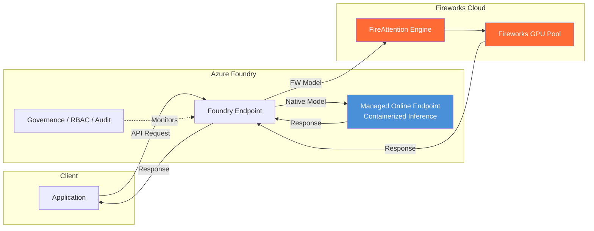

# Fireworks AI on Microsoft Foundry — 深度研究与 BYOW 实战验证

## Executive Summary

Fireworks AI 于 2026 年 3 月 9 日与 Microsoft 宣布**多年期合作**，将其高性能开源模型推理引擎集成到 Microsoft Foundry（即 AI Foundry）中，目前处于 **Public Preview** 阶段。

| 能力 | 状态 | 说明 |
|:---|:---:|:---|
| Catalog 模型 Serverless 推理 | ✅ 可用 | 5 个模型按 Token 付费（Data Zone Standard） |
| Catalog 模型 PTU 推理 | ✅ 可用 | 预留容量，按 PTU 计费 |
| BYOW 自定义权重上传 | ✅ 可用 | 上传微调后全量权重，用 Fireworks 引擎推理 |
| BYOW 部署推理 | ⚠️ 需配额 | 仅 PTU 方式，默认配额为 0，需申请 |
| 微调训练 | ❌ 不可用 | 路线图中，Preview 阶段不支持 |
| 生产 SLA | ❌ 无 | Preview 阶段不提供 SLA |

**实测结论**：我们成功完成了 Qwen3-14B 基座模型的全量权重上传（28GB / 3 分钟 / ~150 MB/s）和注册（Step 1~3），但在 Step 4 部署时因 PTU 配额为 0 被阻塞，需通过专用表单申请配额。

> **一句话评价**：三大核心优势 — ① TPS 快 2.9-3.9 倍（同 PTU 成本效益高 3 倍）；② BYOW 自定义权重上传（Azure 体系内首次实现"上传模型 + 托管推理 + 零运维"）；③ Day-zero 新模型接入。Preview 阶段仍有模型范围、微调、SLA 等限制。

**核心 Benchmark 结果**（去噪：warmup + IQR + thinking token 捕获）：

| 模型 | FW TPS P50 | Native TPS P50 | 加速比 | FW TTFT P50 | Native TTFT P50 |
|:---|:---:|:---:|:---:|:---:|:---:|
| Kimi K2.5 | **135.5** | 46.3 | **2.9x** | 1.454s | 1.025s |
| GPT-OSS-120B | **133.0** | 58.4 | **2.3x** | 1.211s | 1.018s |
| DeepSeek V3.2 | **86.3** | 22.2 | **3.9x** | 1.547s | 1.490s |
| MiniMax M2.5 | **97.5** | — | N/A | 1.404s | — |
| GLM-5 | **82.4** | — | N/A | 1.818s | — |

| 测试条件 | 值 |
|:---|:---|
| 部署类型 | FW: DataZoneStandard / Native: GlobalStandard |
| 区域 | East US 2 |
| API Version | 2024-10-21 |
| 迭代次数 | 10 次/prompt × 5 prompts = 50 次/deployment |
| 去噪方法 | Warmup (2 req) + IQR 异常值去除 + reasoning_content 捕获 |
| 有效样本 | N = 39-50 / deployment |
| 测试日期 | 2026-04-03 |

---

## 1. Background

### 1.1 什么是 Fireworks AI

Fireworks AI 是一家专注于开源模型高性能推理的公司，核心技术是 **FireAttention** 推理引擎。官方数据：

| 指标 | 数值 |
|:---|:---|
| 日处理 tokens | 13T+ |
| 持续请求速率 | ~180K req/s |
| 大模型生成速度 | 1,000+ tok/s |
| Artificial Analysis 排名 | 领先 |
| Series C 融资 | $250M（2025-10） |

### 1.2 与 Microsoft 的合作

- **公告日期**：2026-03-09 / 2026-03-11
- **合作性质**：多年期战略合作
- **官方博客**：
  - Fireworks 端：[Introducing Fireworks on Microsoft Foundry](https://fireworks.ai/blog/fireworks-on-microsoft-foundry)
  - Microsoft 端：[Introducing Fireworks AI on Microsoft Foundry](https://azure.microsoft.com/en-us/blog/introducing-fireworks-ai-on-microsoft-foundry-bringing-high-performance-low-latency-open-model-inference-to-azure/)
- **Learn 文档**：[Fireworks models on Microsoft Foundry (preview)](https://learn.microsoft.com/en-us/azure/foundry/how-to/fireworks/enable-fireworks-models)

### 1.3 Catalog 模型（开箱即用）

| 模型 | Foundry 注册名 | 提供方 | 说明 |
|:---|:---|:---|:---|
| DeepSeek V3.2 | `FW-DeepSeek-V3.2` | DeepSeek | MoE 推理增强 |
| Kimi K2.5 | `FW-Kimi-K2.5` | Moonshot AI | 多模态 + 长上下文 |
| MiniMax M2.5 | `FW-MiniMax-M2.5` | MiniMax | 通用对话（**Foundry 新模型**） |
| GLM-5 | `FW-GLM-5` | Zhipu AI | 中英双语 |
| gpt-oss-120b | `FW-GPT-OSS-120B` | OpenAI | 开放权重大模型 |

> **重要发现**：这些模型大部分之前 Azure 已通过原生推理栈支持（如 `Kimi-K2.5`、`DeepSeek-V3.2`），Fireworks 版本（`FW-` 前缀）是同一权重换了 FireAttention 推理引擎。MiniMax M2.5 是 Fireworks 独家带来的新模型。

### 1.4 Fireworks 模型 vs Azure 原生模型

| 维度 | Azure 原生（如 `Kimi-K2.5`） | Fireworks（如 `FW-Kimi-K2.5`） |
|:---|:---|:---|
| 模型权重 | 相同 | 相同 |
| 推理引擎 | Azure 自有推理栈 | FireAttention 引擎 |
| 数据处理 | Azure 内部 | 数据共享给 Fireworks（注意合规） |
| SLA | 有（看部署类型） | ❌ Preview 无 SLA |
| BYOW | ❌ 不支持 | ✅ 支持自定义权重上传 |
| EU Data Boundary | ✅ 支持 | ❌ 排除 |

### 1.5 请求路由架构



> **架构说明**：Azure Native 模型运行在 **Managed Online Endpoint**（GPU VM 上的容器化推理服务），不是裸 GPU。Fireworks 模型的请求被路由到 Fireworks 云端，由 FireAttention 引擎在 Fireworks 自有 GPU 池上运行。到 Fireworks 云的额外网络跳转解释了 ~0.4s 的 TTFT 开销，而 FireAttention 引擎的优化使得生成开始后 Token 速度快 2-3 倍。

---

## 2. 部署方式与定价

### 2.1 部署类型

| 部署方式 | 适用对象 | 计费模式 |
|:---|:---|:---|
| **Data Zone Standard** (Serverless) | Catalog 5 个基座模型 | 按 Token 付费 |
| **Global Provisioned** (PTU) | 基座模型 + BYOW 自定义模型 | 预留 PTU 容量 |

Serverless 仅支持 6 个 US 区域：East US、East US 2、Central US、North Central US、West US、West US 3。

### 2.2 PTU 定价

| 部署类型 | 最小 PTU | 按小时 | 月预留 | 年预留 |
|:---|:---:|:---:|:---:|:---:|
| Global Provisioned | 15 | $1/PTU/hr | $260/PTU/月 | $2,652/PTU/年 |
| Data Zone Provisioned | 15 | $1.10/PTU/hr | $286/PTU/月 | $2,916/PTU/年 |
| Regional Provisioned | 50 | $2/PTU/hr | $286/PTU/月 | $2,916/PTU/年 |

**PTU 核心理解**：
- PTU 是抽象算力单位，**不等于 GPU**，客户看不到底层 GPU 型号
- PTU 是共享池 — 已有的 Azure OpenAI PTU 预留可直接用于 Fireworks 模型
- 部署后不管是否有流量都会持续计费

### 2.3 Fireworks 自有平台定价（对比参考）

| 方式 | 计费 | 说明 |
|:---|:---|:---|
| Serverless | 按 Token（如 DeepSeek V3: $0.56 input / $1.68 output per M tokens） | 零运维 |
| On-Demand | 按 GPU 秒（A100 $2.90/hr, H100 $6/hr, H200 $6/hr, B200 $9/hr） | 可选 GPU 型号 |

---

## 3. BYOW (Bring Your Own Weights) 深度分析

### 3.1 支持架构（截至 2026-03-25）

| 架构 | 支持版本 |
|:---|:---|
| DeepSeek | V3.1, V3.2 |
| Kimi | K2, K2.5 |
| GLM | 4.7, 4.8 |
| OpenAI | gpt-oss-120b |
| **Qwen** | **qwen3-14b（仅此一个尺寸）** |

> **重要限制**：Llama、Mistral、Phi 等主流架构不支持。Qwen 仅支持 14B。而 Fireworks 自有平台（fireworks.ai）支持 Qwen 全部尺寸（4B~480B）。

### 3.2 BYOW 限制条件

| 限制 | 说明 |
|:---|:---|
| 仅全量权重 | 不支持 LoRA adapter，必须 merge 后上传 |
| 不支持自定义量化 | GPTQ/AWQ 不行，仅 original quantization |
| 仅 PTU 部署 | 不支持 Serverless 按 Token |
| 配额默认为 0 | 需要通过专用表单申请 |
| 每 Project 一个部署 | 同时只能有一个 custom model 部署 |
| Preview 无 SLA | 不建议用于生产 |

### 3.3 BYOW 收费逻辑

```
客户提供的：模型权重（自己微调/量化的 safetensors 文件）
Fireworks 提供的：GPU 算力 + FireAttention 推理引擎 + 运维
                  ↑
              PTU 收的是这部分的钱
```

类比：自带食材去餐厅 → 付的是加工费（厨师 + 厨房），不是食材费。

### 3.4 LoRA 用户怎么办

```
LoRA 微调（便宜、快、省显存）
    ↓
merge_lora_weights() → 完整 safetensors
    ↓
上传 Foundry BYOW → PTU 部署
```

LoRA 训练省钱，部署时享受 Fireworks 高性能推理引擎，两头便宜。

---

## 4. BYOW 实战验证（完整操作记录）

### 4.1 前置条件

| 条件 | 状态 | 说明 |
|:---|:---:|:---|
| Azure 订阅 | ✅ | `<your-subscription-name>` (<your-sub-id>) |
| Fireworks Preview 注册 | ✅ | `Fireworks.EnableDeploy` = Registered |
| Foundry 资源 + Project | ✅ | `<your-foundry-resource>` / `<your-foundry-project>` (East US 2) |
| azd 安装 | ✅ | v1.23.13 |
| azd 登录 | ✅ | device-code + `export BROWSER=""` |

### 4.2 注册 Preview Feature

```bash
# 在 Azure Portal 订阅 → Settings → Preview features 中搜索 Fireworks.EnableDeploy
# 或者用 CLI：
az feature register --namespace "Microsoft.CognitiveServices" --name "Fireworks.EnableDeploy"
az provider register -n Microsoft.CognitiveServices
# 等待最多 30 分钟
az feature show --namespace "Microsoft.CognitiveServices" --name "Fireworks.EnableDeploy" -o table
```

### 4.3 下载模型权重

```bash
# 使用 huggingface_hub 下载 Qwen3-14B（约 28GB）
python3 -c "
from huggingface_hub import snapshot_download
snapshot_download(
    repo_id='Qwen/Qwen3-14B',
    local_dir='~/fireworks-byow-test/qwen3-14b',
    ignore_patterns=['*.gguf', '*.ggml', 'original/*'],
)
"
```

### 4.4 清理模型目录（重要步骤！）

> **⚠️ 已知问题**：HuggingFace 下载目录包含 `.lock`、`.metadata`、`.gitattributes` 等文件，上传后注册会报 ValidationError（"38 of 55 files do not have .safetensors extension"）。

```bash
# 创建干净目录，只保留必要文件
mkdir ~/fireworks-byow-test/qwen3-14b-clean
cd ~/fireworks-byow-test/qwen3-14b
cp config.json generation_config.json merges.txt vocab.json \
   tokenizer.json tokenizer_config.json model.safetensors.index.json \
   model-*.safetensors \
   ~/fireworks-byow-test/qwen3-14b-clean/
```

**必须保留的文件**：

| 文件 | 说明 |
|:---|:---|
| `config.json` | 模型架构配置 |
| `*.safetensors` | 权重分片（8 个） |
| `model.safetensors.index.json` | 分片索引 |
| `tokenizer.json` / `tokenizer_config.json` | Tokenizer |
| `merges.txt` / `vocab.json` | 词表文件 |

**必须删除的文件**：`.lock`、`.metadata`、`.gitattributes`、`LICENSE`、`README.md`

### 4.5 azd 登录（已知问题与解决方案）

> **🔴 azd ≠ az CLI！两套独立认证系统！** az CLI 登录了不代表 azd 也登录了。

```bash
# WSL 下 azd 登录标准流程
export BROWSER=""  # 禁止弹浏览器（WSL snap chromium 有 bug）
azd auth login --tenant-id "<租户ID>" --use-device-code
# 去 https://microsoft.com/devicelogin 输入 code
# 不要用 | head 截断输出！会杀死登录进程！
```

### 4.6 上传并注册模型

```bash
# Portal 生成的命令（或直接 CLI）
export BROWSER=""
azd ai models custom create \
  --project-endpoint "https://<resource>.services.ai.azure.com/api/projects/<project>" \
  -s "<subscription-id>" \
  --name "qwen3-14b-test" \
  --base-model "azureml://registries/azureml-fireworks/models/FW-Qwen3-14B/versions/1" \
  --publisher "Fireworks" \
  --source "<path-to-clean-model-dir>/"
```

**实测结果**（2026-04-01）：

| 步骤 | 结果 | 耗时 |
|:---|:---:|:---:|
| Step 1: 请求上传位置 | ✅ | < 1s |
| Step 2: 上传 27.5GB | ✅ | 3 分 09 秒（~150 MB/s） |
| Step 3: 验证并注册 | ✅ | < 1 分钟 |

注册成功输出：
```
Name:        qwen3-14b-test
Version:     1
Created:     2026-04-01T11:25:10.1447615+00:00
```

### 4.7 部署模型（被配额阻塞）

```bash
az cognitiveservices account deployment create \
  --name "<foundry-resource>" \
  --resource-group "<rg>" \
  --deployment-name "qwen3-14b-byow" \
  --model-name "qwen3-14b-test" \
  --model-version "1" \
  --model-format "FireworksCustom" \
  --model-source "<project-resource-id>" \
  --sku-name "GlobalProvisionedManaged" \
  --sku-capacity 80
```

**结果**：❌ 失败
```
InsufficientQuota: This operation requires 80 new capacity in quota
Global Provisioned Managed Throughput Unit - Fireworks,
which is bigger than the current available capacity 0.
```

**解决方案**：通过 https://aka.ms/fireworks-quota 申请配额。

---

## 5. 价值评估

### 5.1 三大核心优势

| # | 优势 | 价值 | 实测验证 |
|:-:|:---|:---|:---|
| 1 | **TPS 快 2.9-3.9x** → 同 PTU 成本效益高 3 倍 | 🔴 核心 | Kimi 2.9x, DeepSeek 3.9x |
| 2 | **BYOW 自定义权重** → Azure 体系内首次实现"上传模型 + 托管推理 + 零运维" | 🔴 独特亮点 | Qwen3-14B 上传成功 |
| 3 | **Day-zero 新模型接入** — 通过 Fireworks 合作伙伴网络快速上新 | 🟡 锦上添花 | MiniMax M2.5 独家 |

**BYOW 的独特定位**：在 Azure Foundry 体系中，之前没有办法上传自定义开源模型权重并用托管服务推理。BYOW 打破了这个限制：

| 场景 | Fireworks 之前 | 有了 BYOW |
|:---|:---:|:---:|
| 微调了 DeepSeek V3.2，想在 Azure 上推理 | 只能自建 GPU VM + vLLM | ✅ 上传权重 → PTU → endpoint |
| 想在 Azure 合规体系内用自己的开源模型 | ❌ 没有方案 | ✅ Foundry 治理 + RBAC + 审计 |

**成本效益分析**：

```
同样 80 PTU：
  Azure Native: ~46 tok/s (Kimi) / ~22 tok/s (DeepSeek)
  Fireworks:   ~135 tok/s (Kimi) / ~86 tok/s (DeepSeek)
  
等效：原来需要 ~240 PTU 才能撑住的流量，用 Fireworks 80 PTU 就够了
→ PTU 成本节省约 67%
```

### 5.2 对比：Fireworks on Foundry vs 其他方案

| 方案 | 模型范围 | 运维 | GPU 可见 | 微调 | 适合 |
|:---|:---|:---|:---:|:---:|:---|
| Fireworks on Foundry (Serverless) | 5 个模型 | 零运维 | ❌ | ❌ | 快速验证 |
| Fireworks on Foundry (BYOW PTU) | 5 个架构微调版 | 零运维 | ❌ | ❌ | 微调后不想管 GPU |
| Fireworks 自有平台 (On-Demand) | 100+ 模型 | 低运维 | ✅ 选 GPU | ✅ | 全功能使用 |
| Azure VM + vLLM 自建 | 任意模型 | 自己管 | ✅ 完全掌控 | ✅ | 完全掌控 |
| Azure MaaS (Anthropic/Mistral 等) | 闭源模型 | 零运维 | ❌ | ❌ | 用闭源模型 |

### 5.3 当前局限性 (Known Limitations)

1. **模型范围小** — 只有 5 个架构，Llama/Mistral/Phi 不支持
2. **Qwen 只有 14B** — 用 Qwen 的客户很多用 72B/235B
3. **不支持微调** — 只管推理，训练要在别处做
4. **不支持 LoRA adapter** — 必须 merge 后上传全量权重
5. **配额默认为 0** — 需要申请，审批时间不确定
6. **Preview 无 SLA** — 不能用于生产
7. **EU Data Boundary 排除** — 有 EU 合规要求的客户不能用
8. **大部分模型 Azure 之前就有** — Fireworks 版主要是换了推理引擎

---

## 6. 故障排查与已知问题 (Troubleshooting)

| # | 问题 | 根因 | 解决方案 |
|:-:|:---|:---|:---|
| 1 | Portal 看不到 Fireworks 模型 | 未注册 Preview feature | `az feature register --namespace "Microsoft.CognitiveServices" --name "Fireworks.EnableDeploy"` |
| 2 | azd 登录失败、WSL 卡死 | WSL snap chromium 弹窗 bug | `export BROWSER=""` + `--use-device-code` |
| 3 | `azd auth login \| head -3` 截断后登录无效 | head 截断导致 SIGPIPE 杀死 azd 进程 | 不要对 azd 登录命令做管道截断 |
| 4 | az CLI 登录了但 azd 显示未登录 | az CLI 和 azd 是独立认证系统 | 两个都要单独登录 |
| 5 | 模型上传成功但注册报 ValidationError | HuggingFace 下载目录含 .lock/.metadata 文件 | 创建干净目录，只保留必要文件 |
| 6 | 部署报 InsufficientQuota | Fireworks PTU 配额默认 0 | 通过 https://aka.ms/fireworks-quota 申请 |
| 7 | 配额申请表没有 Qwen 选项 | 表单只列了 5 个 Catalog 模型 | 在 Comments 中说明 BYOW 自定义模型场景 |
| 8 | Fireworks 模型调用返回 404 | `api-version` 不兼容 | **必须用 `2024-10-21`**，`2025-06-01` 会 404 |
| 9 | Fireworks TPM 配额不足 | 默认 250K TPM 上限，每个部署 50-100K | 分批测试：部署 → 测试 → 删除 → 换下一个 |
| 10 | Native gpt-oss-120b 部署报 ModelNotSupported | 格式写了 `OpenAI` | **正确格式是 `OpenAI-OSS`**，用 `list-models` 查 |

---

## 7. FW vs Azure Native 推理性能对比（实测）

### 7.1 测试条件

| 条件 | 值 |
|:---|:---|
| 模型 | Kimi-K2.5 |
| 部署 A | `fw-kimi-k25` (Fireworks Engine, DataZoneStandard) |
| 部署 B | `kimi-k25-native` (Azure Native, GlobalStandard) |
| Foundry 资源 | `<your-foundry-resource>` (East US 2) |
| 测试脚本 | `scripts/fw_vs_native_benchmark.py` |
| 迭代次数 | 5 次 / prompt |
| Prompt 数 | 5 个（涵盖知识问答、代码生成、对比分析、总结、技术解释） |
| Max Tokens | 512 |
| Stream | True |
| API Version | 2024-10-21 |
| 测试时间 | 2026-04-03 |

### 7.2 对比结果

> 以下数据已经过去噪处理：Warmup 预热 + IQR 异常值去除 + Thinking Token 捕获。

| 指标 | FW-Kimi-K2.5 (Fireworks) | Kimi-K2.5 (Azure Native) | 差异 |
|:---|:---:|:---:|:---:|
| **TTFT P50** | 1.454s (N=47, σ=0.07) | 1.025s (N=39, σ=0.16) | 原生快 30% |
| **Total Time P50** | **3.763s** | 4.189s | **Fireworks 快 10%** |
| **TPS P50 (全部 Token)** | **135.52 tok/s** | 46.33 tok/s | **Fireworks 快 2.9x** |
| **TPS P50 (仅 Content)** | **47.47 tok/s** | 12.66 tok/s | **Fireworks 快 3.7x** |

> **发现 1 — TTFT**：Azure 原生版首 Token 延迟快 30%，因为 Fireworks 版数据需要路由到 Fireworks 的 GPU，多一跳网络延迟。
>
> **发现 2 — Total Time**：尽管首 Token 慢，Fireworks 引擎的生成速度优势盖过了延迟劣势，总时间反而快 10%。
>
> **发现 3 — TPS**：FireAttention 引擎的核心价值 — Token 生成速度快 2.9-3.7 倍。包含 thinking token 时 135 tok/s vs 46 tok/s，只看 content 时 47 tok/s vs 13 tok/s。

**去噪方法**：
- Warmup：每个 deployment 发 2 个预热请求，避免冷启动偏差
- Thinking Token：同时捕获 `content` + `reasoning_content`，避免 TPS=0 的值废数据
- IQR 异常值去除：去掉网络波动导致的极端值（TTFT 去除 11 个异常值）
- 有效样本数：N=39~50（每 deployment 50 次请求）

### 7.3 DeepSeek V3.2 对比（实测）

| 条件 | 值 |
|:---|:---|
| 模型 | DeepSeek V3.2 |
| 部署 A | `fw-deepseek-v32` (Fireworks Engine, DataZoneStandard) |
| 部署 B | `deepseek-v32-native` (Azure Native, GlobalStandard) |
| 测试脚本 | `scripts/fw_vs_native_benchmark_v2.py`（去噪版） |
| 迭代次数 | 10 次 / prompt |

| 指标 | FW-DeepSeek-V3.2 (Fireworks) | DeepSeek-V3.2 (Azure Native) | 差异 |
|:---|:---:|:---:|:---:|
| **TTFT P50** | 1.547s (N=50, σ=0.12) | 1.490s (N=43, σ=0.20) | 基本持平 |
| **Total Time P50** | 5.667s | 5.455s | 基本持平 |
| **TPS P50 (全部 Token)** | **86.26 tok/s** | 22.20 tok/s | **Fireworks 快 3.9x** |
| **TPS P50 (仅 Content)** | **48.53 tok/s** | 22.20 tok/s | **Fireworks 快 2.2x** |

> **关键发现**：
> - **TTFT 基本持平** — DeepSeek 的路由延迟差异比 Kimi 更小
> - **TPS 快 3.9 倍** — Fireworks 86 tok/s vs Native 22 tok/s
> - **FW 版有 thinking output（R≠0），Native 版没有（R=0）** — 说明两个引擎的推理配置不同，Fireworks 版启用了 CoT reasoning

### 7.4 GPT-OSS-120B 对比（实测）

| 条件 | 值 |
|:---|:---|
| 模型 | gpt-oss-120b |
| 部署 A | `fw-gpt-oss-120b` (Fireworks Engine, DataZoneStandard) |
| 部署 B | `gpt-oss-120b-native` (Azure Native OpenAI-OSS, GlobalStandard) |
| 测试脚本 | `scripts/fw_vs_native_benchmark_v2.py`（去噪版） |
| 迭代次数 | 10 次 / prompt |

| 指标 | FW-GPT-OSS-120B (Fireworks) | gpt-oss-120b (Azure Native) | 差异 |
|:---|:---:|:---:|:---:|
| **TTFT P50** | 1.211s (N=47, σ=0.05) | 1.018s (N=46, σ=0.04) | Native 快 16% |
| **Total Time P50** | 3.510s | 3.120s | Native 快 11% |
| **TPS P50 (全部 Token)** | **133.0 tok/s** | 58.4 tok/s | **Fireworks 快 2.3x** |
| **TPS P50 (仅 Content)** | **115.1 tok/s** | 45.6 tok/s | **Fireworks 快 2.5x** |

### 7.5 GLM-5 / MiniMax M2.5 独立数据（无 Native 对比）

> GLM-5 和 MiniMax M2.5 在 Azure 上没有原生推理版本，无法做 FW vs Native 对比。以下为 Fireworks 引擎独立性能数据。

| 模型 | TTFT P50 (s) | Total Time P50 (s) | TPS P50 (all tok/s) | TPS P50 (content tok/s) | N | 备注 |
|:---|:---:|:---:|:---:|:---:|:---:|:---|
| **FW-GLM-5** | 1.818 (σ=0.18) | 6.197 | 82.4 | 13.4* | 45-48 | *几乎全部输出 thinking tokens (C≈0, R=512) |
| **FW-MiniMax-M2.5** | 1.404 (σ=0.08) | 4.816 | 97.5 | 53.1 | 44-50 | Fireworks 独家模型，Azure 无 Native 版 |

### 7.6 全模型综合对比

| 模型 | FW TPS P50 (all) | Native TPS P50 (all) | 加速比 | FW TTFT P50 | Native TTFT P50 | 状态 |
|:---|:---:|:---:|:---:|:---:|:---:|:---|
| Kimi K2.5 | **135.5** | 46.3 | **2.9x** | 1.454s | 1.025s | ✅ 有对比 |
| GPT-OSS-120B | **133.0** | 58.4 | **2.3x** | 1.211s | 1.018s | ✅ 有对比 |
| DeepSeek V3.2 | **86.3** | 22.2 | **3.9x** | 1.547s | 1.490s | ✅ 有对比 |
| MiniMax M2.5 | **97.5** | — | N/A | 1.404s | — | Fireworks 独家 |
| GLM-5 | **82.4** | — | N/A | 1.818s | — | Azure 无 Native 版 |

> **综合结论**：
> - **TPS 加速比**：在所有可对比的 3 个模型上，Fireworks 引擎均展现 **2.3-3.9 倍** TPS 优势
> - **TTFT**：Azure 原生版首 Token 延迟普遍略快 16-30%（Fireworks 多一跳路由延迟）
> - **最快模型**：Kimi K2.5 (135.5 tok/s) 和 GPT-OSS-120B (133.0 tok/s) 在 Fireworks 引擎上速度最快
> - **成本效益**：同样的 PTU 预算，Fireworks 引擎可处理 2-4 倍的请求量
> - **去噪方法**：所有数据均经过 Warmup 预热 + IQR 异常值去除 + Thinking Token 捕获，有效样本 N=39-50

### Benchmark 可视化


---

## 8. 建议与后续计划 (Recommendations)

**对客户的建议**：
- **快速验证**：用 Serverless（Data Zone Standard）按 Token 付费部署 FW-Kimi-K2.5 或 FW-DeepSeek-V3.2，无需 GPU 运维
- **成本优化**：如果已有 PTU 预留，优先用 Fireworks 引擎跑，同 PTU 吞吐量高 2-4 倍
- **自定义模型**：LoRA 微调 → merge 权重 → BYOW 上传 → PTU 部署（需申请配额）
- **暂不建议生产使用**：Preview 无 SLA，等 GA 后再上生产

**后续计划**：
- [ ] 等待 Fireworks PTU 配额审批
- [ ] 配额到位后部署 BYOW 自定义模型并测试推理
- [ ] 关注 Fireworks 微调功能上线

---

## 9. 复现指南 (Reproducing the Benchmarks)

### 9.1 环境准备

```bash
# 前置条件
# - Python 3.10+
# - Azure 订阅（已注册 Fireworks Preview feature）
# - pip install openai

pip install openai
```

### 9.2 部署模型

```bash
# 注册 Fireworks Preview（如未注册）
az feature register --namespace "Microsoft.CognitiveServices" --name "Fireworks.EnableDeploy"
az provider register -n Microsoft.CognitiveServices

# 部署 FW-Kimi-K2.5（Fireworks 引擎）
az cognitiveservices account deployment create \
  --name "<your-foundry-resource>" \
  --resource-group "<your-resource-group>" \
  --deployment-name "fw-kimi-k25" \
  --model-name "FW-Kimi-K2.5" \
  --model-version "1" \
  --model-format "Fireworks" \
  --sku-name "DataZoneStandard" \
  --sku-capacity 100

# 部署 Kimi-K2.5（Azure 原生，用于对比）
az cognitiveservices account deployment create \
  --name "<your-foundry-resource>" \
  --resource-group "<your-resource-group>" \
  --deployment-name "kimi-k25-native" \
  --model-name "Kimi-K2.5" \
  --model-version "1" \
  --model-format "MoonshotAI" \
  --sku-name "GlobalStandard" \
  --sku-capacity 100
```

### 9.3 运行 Benchmark

```bash
# 去噪版 Benchmark（推荐）
python3 scripts/fw_vs_native_benchmark_v2.py \
  --endpoint "https://<your-resource>.cognitiveservices.azure.com/" \
  --api-key "<your-api-key>" \
  --iterations 10 \
  --deployments fw-kimi-k25 kimi-k25-native \
  --output data/my_benchmark.json
```

**预期输出示例 (Expected Output)**（实际测试结果 / Actual test results）：

```
======================================================================
COMPARISON TABLE (after outlier removal)
======================================================================
Metric                    | FW-Kimi-K2.5 (Fireworks Engine)  | Kimi-K2.5 (Azure Native)
-----------------------------------------------------------------------------------------------
TTFT P50 (s)              | 1.4543                           | 1.0245
TPS P50 (all)             | 135.52                           | 46.325
TPS Mean (all)            | 135.1676                         | 45.813
TPS P50 (content)         | 47.47                            | 12.66

Results saved to: data/my_benchmark.json
```

### 9.4 清理部署 (Cleanup)（避免持续计费）

```bash
# 删除所有 Fireworks 测试部署
az cognitiveservices account deployment delete \
  --name "<your-foundry-resource>" \
  --resource-group "<your-resource-group>" \
  --deployment-name "fw-kimi-k25"

az cognitiveservices account deployment delete \
  --name "<your-foundry-resource>" \
  --resource-group "<your-resource-group>" \
  --deployment-name "kimi-k25-native"

# 验证已清理
az cognitiveservices account deployment list \
  --name "<your-foundry-resource>" \
  --resource-group "<your-resource-group>" \
  -o table
```
