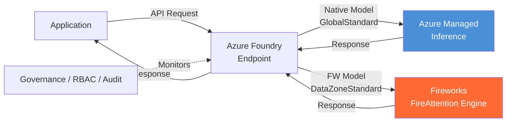
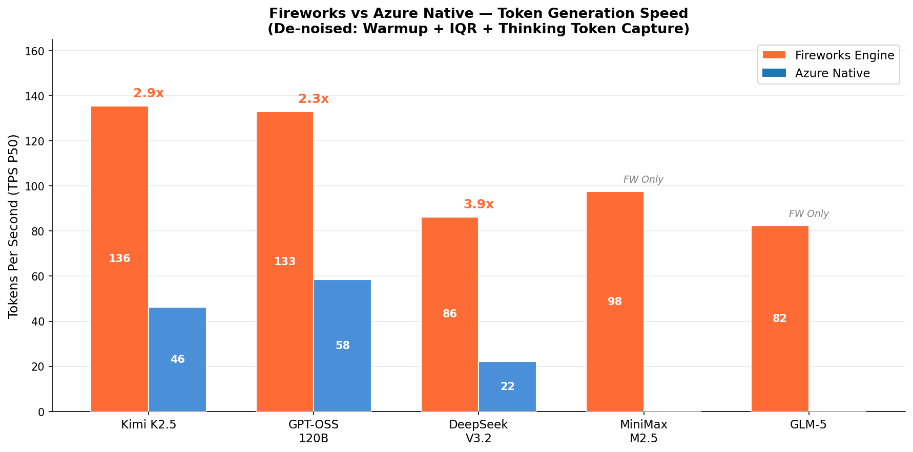
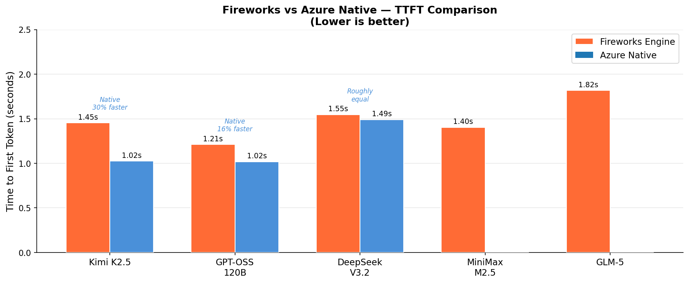

# Fireworks AI on Microsoft Foundry — Deep Research & BYOW Hands-on Validation

## Executive Summary

Fireworks AI announced a **multi-year partnership** with Microsoft on March 9, 2026, integrating its high-performance open model inference engine into Microsoft Foundry (AI Foundry), currently in **Public Preview**.

| Capability | Status | Notes |
|:---|:---:|:---|
| Catalog Model Serverless Inference | ✅ Available | 5 models, pay-per-token (Data Zone Standard) |
| Catalog Model PTU Inference | ✅ Available | Reserved capacity, per-PTU billing |
| BYOW Custom Weight Upload | ✅ Available | Upload fine-tuned full weights, served by Fireworks engine |
| BYOW Deployment | ⚠️ Quota Required | PTU only, default quota is 0, must apply |
| Fine-tuning | ❌ Not Available | On roadmap, not supported in Preview |
| Production SLA | ❌ None | Preview does not include SLA |

**Hands-on Result**: We successfully uploaded Qwen3-14B base model weights (28GB / 3 minutes / ~150 MB/s) and registered the model (Steps 1-3), but deployment (Step 4) was blocked by PTU quota = 0, requiring a separate quota request.

> **One-line Assessment**: Three core advantages — ① TPS 2.9-3.9x faster (3x better PTU cost efficiency); ② BYOW custom weight upload (first-ever "upload model + managed inference + zero ops" in Azure); ③ Day-zero new model onboarding. Preview limitations remain (model range, fine-tuning, SLA).

**Key Benchmark Results** (Serverless pay-per-token deployments, de-noised: warmup + IQR + thinking token capture):

| Model | FW TPS P50 | Native TPS P50 | Speedup | FW TTFT P50 | Native TTFT P50 |
|:---|:---:|:---:|:---:|:---:|:---:|
| Kimi K2.5 | **135.5** | 46.3 | **2.9x** | 1.454s | 1.025s |
| GPT-OSS-120B | **133.0** | 58.4 | **2.3x** | 1.211s | 1.018s |
| DeepSeek V3.2 | **86.3** | 22.2 | **3.9x** | 1.547s | 1.490s |
| MiniMax M2.5 | **97.5** | — | N/A | 1.404s | — |
| GLM-5 | **82.4** | — | N/A | 1.818s | — |

| Test Condition | Value |
|:---|:---|
| Deployment Types | FW: DataZoneStandard / Native: GlobalStandard |
| Region | East US 2 |
| API Version | 2024-10-21 |
| Iterations | 10 per prompt × 5 prompts = 50 per deployment |
| De-noising | Warmup (2 req) + IQR outlier removal + reasoning_content capture |
| Valid Samples | N = 39-50 per deployment |
| Test Date | 2026-04-03 |

---

## 1. Background

### 1.1 What is Fireworks AI

Fireworks AI specializes in high-performance inference for open-source models, powered by the **FireAttention** inference engine.

| Metric | Value |
|:---|:---|
| Daily Token Processing | 13T+ |
| Sustained Request Rate | ~180K req/s |
| Large Model Generation Speed | 1,000+ tok/s |
| Artificial Analysis Ranking | Leading |
| Series C Funding | $250M (Oct 2025) |

### 1.2 Partnership with Microsoft

- **Announcement Date**: March 9-11, 2026
- **Nature**: Multi-year strategic partnership
- **Official Blogs**:
  - Fireworks: [Introducing Fireworks on Microsoft Foundry](https://fireworks.ai/blog/fireworks-on-microsoft-foundry)
  - Microsoft: [Introducing Fireworks AI on Microsoft Foundry](https://azure.microsoft.com/en-us/blog/introducing-fireworks-ai-on-microsoft-foundry-bringing-high-performance-low-latency-open-model-inference-to-azure/)
- **Learn Documentation**: [Fireworks models on Microsoft Foundry (preview)](https://learn.microsoft.com/en-us/azure/foundry/how-to/fireworks/enable-fireworks-models)

### 1.3 Catalog Models (Ready to Use)

| Model | Foundry Registry Name | Provider | Notes |
|:---|:---|:---|:---|
| DeepSeek V3.2 | `FW-DeepSeek-V3.2` | DeepSeek | MoE reasoning-optimized |
| Kimi K2.5 | `FW-Kimi-K2.5` | Moonshot AI | Multimodal + long context |
| MiniMax M2.5 | `FW-MiniMax-M2.5` | MiniMax | General purpose (**new to Foundry**) |
| GLM-5 | `FW-GLM-5` | Zhipu AI | Bilingual Chinese/English |
| gpt-oss-120b | `FW-GPT-OSS-120B` | OpenAI | Open-weight large model |

> **Key Finding**: Most of these models were already available in Azure through native inference stacks (e.g., `Kimi-K2.5`, `DeepSeek-V3.2`). The Fireworks versions (`FW-` prefix) use the same weights but swap in the FireAttention inference engine. MiniMax M2.5 is a new model exclusively brought by Fireworks.

### 1.4 Fireworks Models vs Azure Native Models

| Dimension | Azure Native (e.g., `Kimi-K2.5`) | Fireworks (e.g., `FW-Kimi-K2.5`) |
|:---|:---|:---|
| Model Weights | Same | Same |
| Inference Engine | Azure native stack | FireAttention engine |
| Data Processing | Within Azure | Shared with Fireworks (compliance risk) |
| SLA | Yes (varies by type) | ❌ No SLA in Preview |
| BYOW | ❌ Not supported | ✅ Custom weight upload supported |
| EU Data Boundary | ✅ Supported | ❌ Excluded |

### 1.5 Request Routing Architecture



> **Architecture Notes**: Azure Native models use GlobalStandard serverless deployment. Fireworks models use DataZoneStandard deployment, served by the Fireworks FireAttention inference engine. The exact infrastructure topology (whether Fireworks runs on Azure GPU or Fireworks' own GPU pool) is not publicly documented. What is confirmed: data is shared between Microsoft and Fireworks (per Data Privacy section), and Fireworks models are excluded from EU Data Boundary.

---

## 2. Deployment Types & Pricing

### 2.1 Deployment Types

| Deployment | Applicable To | Billing |
|:---|:---|:---|
| **Data Zone Standard** (Serverless) | 5 Catalog base models | Pay per token |
| **Global Provisioned** (PTU) | Base models + BYOW custom models | Reserved PTU capacity |

Serverless supports 6 US regions only: East US, East US 2, Central US, North Central US, West US, West US 3.

### 2.2 Fireworks Serverless Pricing (Pay-per-Token)

> Source: [Microsoft Tech Community Blog](https://aka.ms/fireworks-pricing) (March 2026)

| Model | Input ($/1M tokens) | Cached ($/1M tokens) | Output ($/1M tokens) |
|:---|:---:|:---:|:---:|
| gpt-oss-120b | $0.17 | $0.09 | $0.66 |
| Kimi-K2.5 | $0.66 | $0.11 | $3.30 |
| DeepSeek-V3.2 | $0.62 | $0.31 | $1.85 |
| MiniMax-M2.5 | $0.33 | $0.03 | $1.32 |

> **Note**: These are Fireworks-specific prices, different from Azure Native per-token prices. For example, Native gpt-oss-120b is $0.15 input / $0.60 output (Azure OpenAI pricing page), while Fireworks version is $0.17 input / $0.66 output — approximately 10% higher.

### 2.3 Fireworks PTU Pricing (Provisioned Throughput)

PTU unit pricing follows the unified Azure Provisioned Throughput pricing ("works just like it does for Foundry models" — [source](https://aka.ms/fireworks-pricing)):

| Deployment Type | Min PTU | Hourly | Monthly Reserved | Annual Reserved |
|:---|:---:|:---:|:---:|:---:|
| Global Provisioned | 15 | $1/PTU/hr | $260/PTU/mo | $2,652/PTU/yr |
| Data Zone Provisioned | 15 | $1.10/PTU/hr | $286/PTU/mo | $2,916/PTU/yr |
| Regional Provisioned | 50 | $2/PTU/hr | $286/PTU/mo | $2,916/PTU/yr |

However, **each Fireworks model requires a different minimum PTU deployment** and delivers different throughput per PTU:

| Model | Min PTU | Scale Increment | Input TPM per PTU | Latency Target |
|:---|:---:|:---:|:---:|:---|
| gpt-oss-120b | 80 | 40 | 13,500 | 99% > 50 TPS |
| Kimi-K2.5 | 800 | 400 | 530 | 99% > 50 TPS |
| DeepSeek-V3.2 | 1,200 | 600 | 1,500 | 99% > 50 TPS |
| MiniMax-M2.5 | 400 | 200 | 3,000 | 99% > 50 TPS |

> Source: [Microsoft Tech Community Blog](https://aka.ms/fireworks-pricing)

**Key PTU Concepts**:
- PTU is an abstract compute unit — customers **cannot see** the underlying GPU model
- PTU pool is shared — existing Azure OpenAI PTU reservations can be used for Fireworks models ("your existing quota for Global PTUs works as does any reservation commitments")
- Billing continues whether or not traffic is flowing once deployed

### 2.4 Fireworks Native Platform Pricing (Comparison)

| Mode | Billing | Notes |
|:---|:---|:---|
| Serverless | Per token (e.g., DeepSeek V3: $0.56 input / $1.68 output per M tokens) | Zero ops |
| On-Demand | Per GPU second (A100 $2.90/hr, H100 $6/hr, H200 $6/hr, B200 $9/hr) | Choose GPU model |

---

## 3. BYOW (Bring Your Own Weights) Deep Dive

### 3.1 Supported Architectures (as of 2026-03-25)

| Architecture | Supported Versions |
|:---|:---|
| DeepSeek | V3.1, V3.2 |
| Kimi | K2, K2.5 |
| GLM | 4.7, 4.8 |
| OpenAI | gpt-oss-120b |
| **Qwen** | **qwen3-14b (this size only)** |

> **Key Limitation**: Llama, Mistral, Phi and other mainstream architectures are not supported. Qwen only supports 14B. Meanwhile, the Fireworks native platform (fireworks.ai) supports all Qwen sizes from 4B to 480B.

### 3.2 BYOW Limitations

| Limitation | Detail |
|:---|:---|
| Full weights only | LoRA adapters not supported, must merge first |
| No custom quantization | GPTQ/AWQ not supported, original quantization only |
| PTU deployment only | Serverless pay-per-token not available for BYOW |
| Default quota is 0 | Must apply through dedicated form |
| One deployment per project | Only one custom model deployment at a time |
| No Production SLA | Preview only, not recommended for production |

### 3.3 BYOW Billing Logic

```
Customer provides: Model weights (fine-tuned safetensors files)
Fireworks provides: GPU compute + FireAttention engine + operations
                    ↑
                PTU charges cover this
```

Analogy: Bringing your own ingredients to a restaurant — you pay for the chef and kitchen (processing fee), not the ingredients.

### 3.4 For LoRA Users

```
LoRA fine-tuning (cheap, fast, memory-efficient)
    ↓
merge_lora_weights() → full safetensors
    ↓
Upload to Foundry BYOW → PTU deployment
```

---

## 4. BYOW Hands-on Validation (Full Operation Record)

### 4.1 Prerequisites

| Requirement | Status | Details |
|:---|:---:|:---|
| Azure Subscription | ✅ | `<your-subscription-name>` (<your-sub-id>) |
| Fireworks Preview Registration | ✅ | `Fireworks.EnableDeploy` = Registered |
| Foundry Resource + Project | ✅ | `<your-foundry-resource>` / `<your-foundry-project>` (East US 2) |
| azd Installed | ✅ | v1.23.13 |
| azd Logged In | ✅ | device-code + `export BROWSER=""` |

### 4.2 Register Preview Feature

```bash
az feature register --namespace "Microsoft.CognitiveServices" --name "Fireworks.EnableDeploy"
az provider register -n Microsoft.CognitiveServices
# Wait up to 30 minutes
az feature show --namespace "Microsoft.CognitiveServices" --name "Fireworks.EnableDeploy" -o table
```

### 4.3 Download Model Weights

```bash
python3 -c "
from huggingface_hub import snapshot_download
snapshot_download(
    repo_id='Qwen/Qwen3-14B',
    local_dir='~/fireworks-byow-test/qwen3-14b',
    ignore_patterns=['*.gguf', '*.ggml', 'original/*'],
)
"
```

### 4.4 Clean Model Directory (Critical!)

> **Lesson Learned**: HuggingFace download directories contain `.lock`, `.metadata`, `.gitattributes` files that cause ValidationError during registration ("38 of 55 files do not have .safetensors extension").

```bash
mkdir ~/fireworks-byow-test/qwen3-14b-clean
cd ~/fireworks-byow-test/qwen3-14b
cp config.json generation_config.json merges.txt vocab.json \
   tokenizer.json tokenizer_config.json model.safetensors.index.json \
   model-*.safetensors \
   ~/fireworks-byow-test/qwen3-14b-clean/
```

**Required Files**:

| File | Description |
|:---|:---|
| `config.json` | Model architecture configuration |
| `*.safetensors` | Weight shards (8 files) |
| `model.safetensors.index.json` | Shard index |
| `tokenizer.json` / `tokenizer_config.json` | Tokenizer |
| `merges.txt` / `vocab.json` | Vocabulary files |

**Must Remove**: `.lock`, `.metadata`, `.gitattributes`, `LICENSE`, `README.md`

### 4.5 azd Login (Pitfalls)

> **azd ≠ az CLI! Two independent authentication systems.** Being logged into az CLI does not mean azd is logged in.

```bash
export BROWSER=""  # Prevent WSL snap chromium popup (buggy)
azd auth login --tenant-id "<tenant-id>" --use-device-code
# Do NOT pipe with | head — it kills the login process via SIGPIPE!
```

### 4.6 Upload and Register Model

```bash
export BROWSER=""
azd ai models custom create \
  --project-endpoint "https://<resource>.services.ai.azure.com/api/projects/<project>" \
  -s "<subscription-id>" \
  --name "qwen3-14b-test" \
  --base-model "azureml://registries/azureml-fireworks/models/FW-Qwen3-14B/versions/1" \
  --publisher "Fireworks" \
  --source "<path-to-clean-model-dir>/"
```

**Test Results** (2026-04-01):

| Step | Result | Duration |
|:---|:---:|:---:|
| Step 1: Request upload location | ✅ | < 1s |
| Step 2: Upload 27.5GB | ✅ | 3 min 09 sec (~150 MB/s) |
| Step 3: Validate and register | ✅ | < 1 min |

Registration output:
```
Name:        qwen3-14b-test
Version:     1
Created:     2026-04-01T11:25:10.1447615+00:00
```

### 4.7 Deploy Model (Blocked by Quota)

```bash
az cognitiveservices account deployment create \
  --name "<foundry-resource>" \
  --resource-group "<rg>" \
  --deployment-name "qwen3-14b-byow" \
  --model-name "qwen3-14b-test" \
  --model-version "1" \
  --model-format "FireworksCustom" \
  --model-source "<project-resource-id>" \
  --sku-name "GlobalProvisionedManaged" \
  --sku-capacity 80
```

**Result**: ❌ Failed
```
InsufficientQuota: This operation requires 80 new capacity in quota
Global Provisioned Managed Throughput Unit - Fireworks,
current available capacity 0.
```

**Resolution**: Apply for quota at https://aka.ms/fireworks-quota.

---

## 5. Value Assessment

### 5.1 Three Core Advantages

| # | Advantage | Value | Verified By |
|:-:|:---|:---|:---|
| 1 | **TPS 2.9-3.9x faster** → 3x better PTU cost efficiency | 🔴 Core | Kimi 2.9x, DeepSeek 3.9x |
| 2 | **BYOW custom weights** → First-ever "upload model + managed inference + zero ops" in Azure | 🔴 Unique | Qwen3-14B upload succeeded |
| 3 | **Day-zero new model onboarding** via Fireworks partner network | 🟡 Nice-to-have | MiniMax M2.5 exclusive |

**BYOW's Unique Position**: Before Fireworks, there was no way in Azure Foundry to upload custom open-source model weights and use managed inference. BYOW breaks this barrier:

| Scenario | Before Fireworks | With BYOW |
|:---|:---:|:---:|
| Fine-tuned DeepSeek V3.2, want to run on Azure | Self-host GPU VM + vLLM only | ✅ Upload weights → PTU → endpoint |
| Want custom open model in Azure compliance framework | ❌ No solution | ✅ Foundry governance + RBAC + audit |

**Cost Efficiency Analysis**:

```
Same 80 PTU:
  Azure Native: ~46 tok/s (Kimi) / ~22 tok/s (DeepSeek)
  Fireworks:   ~135 tok/s (Kimi) / ~86 tok/s (DeepSeek)
  
Equivalent: Traffic that would need ~240 PTU natively → only 80 PTU with Fireworks
→ ~67% PTU cost savings
```

### 5.2 Comparison: Fireworks on Foundry vs Alternatives

| Approach | Model Range | Ops | GPU Visible | Fine-tuning | Best For |
|:---|:---|:---|:---:|:---:|:---|
| Fireworks on Foundry (Serverless) | 5 models | Zero ops | ❌ | ❌ | Quick validation |
| Fireworks on Foundry (BYOW PTU) | 5 architectures fine-tuned | Zero ops | ❌ | ❌ | Fine-tuned models without GPU management |
| Fireworks Native Platform (On-Demand) | 100+ models | Low ops | ✅ Choose GPU | ✅ | Full-featured usage |
| Azure VM + vLLM Self-hosted | Any model | Self-managed | ✅ Full control | ✅ | Full control |
| Azure MaaS (Anthropic/Mistral etc.) | Proprietary models | Zero ops | ❌ | ❌ | Using proprietary models |

### 5.3 Current Limitations (Honest Assessment)

1. **Limited Model Range** — Only 5 architectures, Llama/Mistral/Phi not supported
2. **Qwen only 14B** — Many Qwen users need 72B/235B
3. **No Fine-tuning** — Inference only, training must be done elsewhere
4. **No LoRA Adapter Support** — Must merge before uploading full weights
5. **Default Quota is 0** — Requires application, approval time uncertain
6. **No SLA in Preview** — Not suitable for production
7. **EU Data Boundary Excluded** — Cannot use for EU compliance requirements
8. **Most Models Already Available** — Fireworks version mainly swaps inference engine

---

## 6. Troubleshooting Summary

| # | Issue | Root Cause | Solution |
|:-:|:---|:---|:---|
| 1 | Fireworks models not visible in Portal | Preview feature not registered | `az feature register --namespace "Microsoft.CognitiveServices" --name "Fireworks.EnableDeploy"` |
| 2 | azd login fails, WSL hangs | WSL snap chromium popup bug | `export BROWSER=""` + `--use-device-code` |
| 3 | `azd auth login \| head -3` login invalid | head truncation kills azd via SIGPIPE | Do not pipe azd login output |
| 4 | az CLI logged in but azd shows not logged in | Separate authentication systems | Login both independently |
| 5 | Upload succeeds but registration fails | HuggingFace .lock/.metadata files | Create clean directory with required files only |
| 6 | Deployment fails InsufficientQuota | Fireworks PTU quota defaults to 0 | Apply at https://aka.ms/fireworks-quota |
| 7 | Quota form doesn't list Qwen | Form only lists 5 Catalog models | Explain BYOW custom model in Comments |
| 8 | Fireworks model API returns 404 | `api-version` incompatibility | **Must use `2024-10-21`**, `2025-06-01` returns 404 |
| 9 | Fireworks TPM quota insufficient | Default 250K TPM limit, each deployment 50-100K | Test in batches: deploy → test → delete → next |
| 10 | Native gpt-oss-120b deployment fails ModelNotSupported | Format was `OpenAI` | **Correct format is `OpenAI-OSS`**, use `list-models` to check |

---

## 7. FW vs Azure Native Inference Performance (Benchmark)

> **Important**: All benchmarks in this section were conducted using **Serverless (pay-per-token) deployments**, not PTU. Fireworks models used DataZoneStandard SKU; Azure Native models used GlobalStandard SKU. Performance under PTU deployments may differ due to reserved capacity and different infrastructure configurations.

### 7.1 Test Conditions

| Condition | Value |
|:---|:---|
| Model | Kimi-K2.5 |
| Deployment A | `fw-kimi-k25` (Fireworks Engine, DataZoneStandard) |
| Deployment B | `kimi-k25-native` (Azure Native, GlobalStandard) |
| Foundry Resource | `<your-foundry-resource>` (East US 2) |
| Test Script | `scripts/fw_vs_native_benchmark.py` |
| Iterations | 5 per prompt |
| Prompts | 5 (covering Q&A, code generation, comparison, summary, technical explanation) |
| Max Tokens | 512 |
| Stream | True |
| API Version | 2024-10-21 |
| Test Date | 2026-04-03 |

### 7.2 Comparison Results

> Data below has been de-noised: Warmup pre-heating + IQR outlier removal + Thinking Token capture.

| Metric | FW-Kimi-K2.5 (Fireworks) | Kimi-K2.5 (Azure Native) | Difference |
|:---|:---:|:---:|:---:|
| **TTFT P50** | 1.454s (N=47, σ=0.07) | 1.025s (N=39, σ=0.16) | Native 30% faster |
| **Total Time P50** | **3.763s** | 4.189s | **Fireworks 10% faster** |
| **TPS P50 (all tokens)** | **135.52 tok/s** | 46.33 tok/s | **Fireworks 2.9x faster** |
| **TPS P50 (content only)** | **47.47 tok/s** | 12.66 tok/s | **Fireworks 3.7x faster** |

> **Finding 1 — TTFT**: Azure Native first-token latency is 30% faster because Fireworks routes data to Fireworks GPU infrastructure, adding an extra network hop.
>
> **Finding 2 — Total Time**: Despite slower TTFT, Fireworks engine’s generation speed advantage overcomes the latency disadvantage, resulting in 10% faster total completion.
>
> **Finding 3 — TPS**: Core value of FireAttention engine — token generation speed is 2.9-3.7x faster. All tokens: 135 tok/s vs 46 tok/s; content only: 47 tok/s vs 13 tok/s.

**De-noising Methods**:
- Warmup: 2 pre-heating requests per deployment to avoid cold start bias
- Thinking Token: Captures both `content` + `reasoning_content` to avoid TPS=0 waste data
- IQR Outlier Removal: Removes extreme values caused by network spikes (11 TTFT outliers removed)
- Valid samples: N=39-50 (50 requests per deployment)

### 7.3 DeepSeek V3.2 Comparison (Benchmark)

| Condition | Value |
|:---|:---|
| Model | DeepSeek V3.2 |
| Deployment A | `fw-deepseek-v32` (Fireworks Engine, DataZoneStandard) |
| Deployment B | `deepseek-v32-native` (Azure Native, GlobalStandard) |
| Test Script | `scripts/fw_vs_native_benchmark_v2.py` (de-noised) |
| Iterations | 10 per prompt |

| Metric | FW-DeepSeek-V3.2 (Fireworks) | DeepSeek-V3.2 (Azure Native) | Difference |
|:---|:---:|:---:|:---:|
| **TTFT P50** | 1.547s (N=50, σ=0.12) | 1.490s (N=43, σ=0.20) | Roughly equal |
| **Total Time P50** | 5.667s | 5.455s | Roughly equal |
| **TPS P50 (all tokens)** | **86.26 tok/s** | 22.20 tok/s | **Fireworks 3.9x faster** |
| **TPS P50 (content only)** | **48.53 tok/s** | 22.20 tok/s | **Fireworks 2.2x faster** |

> **Key Findings**:
> - **TTFT roughly equal** — DeepSeek routing latency difference is smaller than Kimi
> - **TPS 3.9x faster** — Fireworks 86 tok/s vs Native 22 tok/s
> - **FW version outputs thinking tokens (R≠0), Native does not (R=0)** — indicating different inference configurations, Fireworks enables CoT reasoning

### 7.4 GPT-OSS-120B Comparison (Benchmark)

| Condition | Value |
|:---|:---|
| Model | gpt-oss-120b |
| Deployment A | `fw-gpt-oss-120b` (Fireworks Engine, DataZoneStandard) |
| Deployment B | `gpt-oss-120b-native` (Azure Native OpenAI-OSS, GlobalStandard) |
| Test Script | `scripts/fw_vs_native_benchmark_v2.py` (de-noised) |
| Iterations | 10 per prompt |

| Metric | FW-GPT-OSS-120B (Fireworks) | gpt-oss-120b (Azure Native) | Difference |
|:---|:---:|:---:|:---:|
| **TTFT P50** | 1.211s (N=47, σ=0.05) | 1.018s (N=46, σ=0.04) | Native 16% faster |
| **Total Time P50** | 3.510s | 3.120s | Native 11% faster |
| **TPS P50 (all tokens)** | **133.0 tok/s** | 58.4 tok/s | **Fireworks 2.3x faster** |
| **TPS P50 (content only)** | **115.1 tok/s** | 45.6 tok/s | **Fireworks 2.5x faster** |

### 7.5 GLM-5 / MiniMax M2.5 Standalone Data (No Native Comparison)

> GLM-5 and MiniMax M2.5 have no Azure native inference versions, so FW vs Native comparison is not possible. Below are Fireworks engine standalone performance data.

| Model | TTFT P50 (s) | Total Time P50 (s) | TPS P50 (all tok/s) | TPS P50 (content tok/s) | N | Notes |
|:---|:---:|:---:|:---:|:---:|:---:|:---|
| **FW-GLM-5** | 1.818 (σ=0.18) | 6.197 | 82.4 | 13.4* | 45-48 | *Nearly all output is thinking tokens (C≈0, R=512) |
| **FW-MiniMax-M2.5** | 1.404 (σ=0.08) | 4.816 | 97.5 | 53.1 | 44-50 | Fireworks exclusive, no Azure Native version |

### 7.6 Full Model Comparison Summary

| Model | FW TPS P50 (all) | Native TPS P50 (all) | Speedup | FW TTFT P50 | Native TTFT P50 | Status |
|:---|:---:|:---:|:---:|:---:|:---:|:---|
| Kimi K2.5 | **135.5** | 46.3 | **2.9x** | 1.454s | 1.025s | ✅ Compared |
| GPT-OSS-120B | **133.0** | 58.4 | **2.3x** | 1.211s | 1.018s | ✅ Compared |
| DeepSeek V3.2 | **86.3** | 22.2 | **3.9x** | 1.547s | 1.490s | ✅ Compared |
| MiniMax M2.5 | **97.5** | — | N/A | 1.404s | — | Fireworks exclusive |
| GLM-5 | **82.4** | — | N/A | 1.818s | — | No Azure Native version |

> **Combined Conclusions**:
> - **TPS Speedup**: Across all 3 comparable models, Fireworks engine delivers **2.3-3.9x** TPS advantage
> - **TTFT**: Azure native first-token latency is generally 16-30% faster (Fireworks adds one routing hop)
> - **Fastest Models**: Kimi K2.5 (135.5 tok/s) and GPT-OSS-120B (133.0 tok/s) achieve highest throughput on Fireworks
> - **Cost Efficiency**: Same PTU budget handles 2-4x more requests with Fireworks engine
> - **De-noising**: All data processed with Warmup + IQR outlier removal + Thinking Token capture, valid samples N=39-50

### Benchmark Visualizations





---

## 8. Recommendations & Next Steps

**Recommendations for customers**:
- **Quick validation**: Deploy FW-Kimi-K2.5 or FW-DeepSeek-V3.2 via Serverless (Data Zone Standard) pay-per-token, zero GPU ops required
- **Cost optimization**: If you have existing PTU reservations, prefer Fireworks engine — 2-4x higher throughput per PTU
- **Custom models**: LoRA fine-tune → merge weights → BYOW upload → PTU deploy (quota application required)
- **Not recommended for production yet**: Preview has no SLA, wait for GA before production use

**Next Steps**:
- [ ] Wait for Fireworks PTU quota approval
- [ ] Deploy BYOW custom model and test inference after quota granted
- [ ] Monitor Fireworks fine-tuning capability rollout

---

## 9. Reproducing the Benchmarks

### 9.1 Prerequisites

```bash
# Requirements
# - Python 3.10+
# - Azure subscription (with Fireworks Preview feature registered)
# - pip install openai

pip install openai
```

### 9.2 Deploy Models

```bash
# Register Fireworks Preview (if not already done)
az feature register --namespace "Microsoft.CognitiveServices" --name "Fireworks.EnableDeploy"
az provider register -n Microsoft.CognitiveServices

# Deploy FW-Kimi-K2.5 (Fireworks engine)
az cognitiveservices account deployment create \
  --name "<your-foundry-resource>" \
  --resource-group "<your-resource-group>" \
  --deployment-name "fw-kimi-k25" \
  --model-name "FW-Kimi-K2.5" \
  --model-version "1" \
  --model-format "Fireworks" \
  --sku-name "DataZoneStandard" \
  --sku-capacity 100

# Deploy Kimi-K2.5 (Azure Native, for comparison)
az cognitiveservices account deployment create \
  --name "<your-foundry-resource>" \
  --resource-group "<your-resource-group>" \
  --deployment-name "kimi-k25-native" \
  --model-name "Kimi-K2.5" \
  --model-version "1" \
  --model-format "MoonshotAI" \
  --sku-name "GlobalStandard" \
  --sku-capacity 100
```

### 9.3 Run Benchmark

```bash
# De-noised benchmark (recommended)
python3 scripts/fw_vs_native_benchmark_v2.py \
  --endpoint "https://<your-resource>.cognitiveservices.azure.com/" \
  --api-key "<your-api-key>" \
  --iterations 10 \
  --deployments fw-kimi-k25 kimi-k25-native \
  --output data/my_benchmark.json
```

**Expected output** (actual test results):

```
======================================================================
COMPARISON TABLE (after outlier removal)
======================================================================
Metric                    | FW-Kimi-K2.5 (Fireworks Engine)  | Kimi-K2.5 (Azure Native)
-----------------------------------------------------------------------------------------------
TTFT P50 (s)              | 1.4543                           | 1.0245
TPS P50 (all)             | 135.52                           | 46.325
TPS Mean (all)            | 135.1676                         | 45.813
TPS P50 (content)         | 47.47                            | 12.66

Results saved to: data/my_benchmark.json
```

### 9.4 Cleanup (avoid ongoing charges)

```bash
# Delete all Fireworks test deployments
az cognitiveservices account deployment delete \
  --name "<your-foundry-resource>" \
  --resource-group "<your-resource-group>" \
  --deployment-name "fw-kimi-k25"

az cognitiveservices account deployment delete \
  --name "<your-foundry-resource>" \
  --resource-group "<your-resource-group>" \
  --deployment-name "kimi-k25-native"

# Verify cleanup
az cognitiveservices account deployment list \
  --name "<your-foundry-resource>" \
  --resource-group "<your-resource-group>" \
  -o table
```

---

## Appendix

### A. Data File Index

| File | Description | Model(s) | Type |
|:---|:---|:---|:---|
| `data/benchmark_results_v3.json` | De-noised FW vs Native benchmark | Kimi K2.5 (FW + Native) | Comparison |
| `data/deepseek_benchmark_v3.json` | De-noised FW vs Native benchmark | DeepSeek V3.2 (FW + Native) | Comparison |
| `data/gptoss_benchmark_v3.json` | De-noised FW-only benchmark | GPT-OSS-120B (FW) | Standalone |
| `data/gptoss_native_benchmark_v3.json` | De-noised Native-only benchmark | GPT-OSS-120B (Native) | Standalone |
| `data/glm5_benchmark_v3.json` | De-noised FW-only benchmark | GLM-5 (FW only, no Native) | Standalone |
| `data/minimax_benchmark_v3.json` | De-noised FW-only benchmark | MiniMax M2.5 (FW only, no Native) | Standalone |

### B. Script Inventory

| Script | Description | Key Arguments |
|:---|:---|:---|
| `scripts/fw_vs_native_benchmark.py` | v1 benchmark (without de-noising) | `--endpoint`, `--api-key`, `--iterations`, `--deployments`, `--output` |
| `scripts/fw_vs_native_benchmark_v2.py` | v2 benchmark with de-noising (recommended) | Same as v1 + warmup, IQR outlier removal, reasoning_content capture |

### C. JSON Data Schema

Each benchmark JSON contains the following structure:

```json
{
  "test_config": {
    "endpoint": "https://<your-resource>.cognitiveservices.azure.com/",
    "iterations": 10,
    "max_tokens": 512,
    "num_prompts": 5,
    "denoising": "IQR outlier removal + warmup + reasoning_content capture",
    "api_version": "2024-10-21",
    "timestamp": "2026-04-03T..."
  },
  "results": {
    "<deployment-name>": {
      "summary": {
        "ttft": {"p50": ..., "mean": ..., "stdev": ..., "n": ...},
        "tps_all_tokens": {"p50": ..., "mean": ..., "n": ...},
        "tps_content_only": {"p50": ..., "mean": ..., "n": ...}
      },
      "details": [...]
    }
  }
}
```

### D. Key Observations Not in Main Text

- **GLM-5 outputs almost exclusively thinking tokens** (C≈0, R=512 in most runs). This means GLM-5's `content TPS` metric is unreliable (N=2). Only `all tokens TPS` (82.4 tok/s) is meaningful.
- **Fireworks DeepSeek V3.2 outputs thinking tokens (R≠0), but Azure Native DeepSeek does not (R=0)**. This behavioral difference suggests different inference configurations between the two engines.
- **api-version compatibility**: Fireworks models require `2024-10-21`. Using `2025-06-01` returns HTTP 404. This is not documented in official Microsoft Learn docs.
