# Foundry Agent Lifecycle: Build, Deploy, and Operate at Scale

[](https://learn.microsoft.com/azure/ai-foundry/)
[](https://build.microsoft.com)
[](https://github.com/microsoft/agents)
[](#act-2-deploy--from-laptop-to-production)

A systematic walkthrough of the full agent lifecycle announced at Microsoft Build 2026 — covering how to **build** agents locally with any framework, **deploy** them as hosted agents with sub-second cold start, and **operate** them with tracing, evaluation, optimization, and governance. Based on session [BRK241](https://build.microsoft.com/en-US/sessions/BRK241) by Tina Schuchman (CVP, Microsoft Foundry) and Jeff Hollan (Partner Director, Microsoft Foundry).

> **Author**: Xinyu Wei (魏新宇) — Microsoft AI GBB

[中文版](README-CN.md) | English

---

**Recorded walkthrough**: [BRK241 — From prototype to production: Build and run agents at scale](https://build.microsoft.com/en-US/sessions/BRK241)

---

## Table of Contents

- [Why This Matters](#why-this-matters)
- [The Core Insight](#the-core-insight)
- [The Agent Lifecycle Loop](#the-agent-lifecycle-loop)
- [The Platform Stack](#the-platform-stack)
- [Demo Scenario: Autonomous Fiber Outage Response](#demo-scenario-autonomous-fiber-outage-response)
- [How It Works Under the Hood](#how-it-works-under-the-hood)
- [Act 1: Build — From Framework to Agent](#act-1-build--from-framework-to-agent)
- [Act 2: Deploy — From Laptop to Production](#act-2-deploy--from-laptop-to-production)
- [Act 3: Operate — From Launch to Continuous Improvement](#act-3-operate--from-launch-to-continuous-improvement)
- [Key Announcements at Build 2026](#key-announcements-at-build-2026)
- [Customer Deployments](#customer-deployments)
- [Getting Started](#getting-started)
- [Key Resources](#key-resources)
- [Running on Azure](#running-on-azure)
- [Related Repos](#related-repos)

---

## Why This Matters

Enterprise agent prototypes are easy to demo and hard to operate. The production gap is not a better prompt; it is identity, sandboxing, governed tools, distribution, evaluation, monitoring, and continuous improvement.

BRK241 positions Microsoft Foundry as the lifecycle system for that gap:

| Production Question | Foundry Capability Shown in BRK241 |
|:--------------------|:------------------------------------|
| Can developers keep their local framework? | Microsoft Agent Framework + Foundry Toolkit for VS Code |
| Can the agent access enterprise tools safely? | Toolboxes, MCP, Fabric IQ, Work IQ, Foundry IQ |
| Can it run without a permanently warm server? | Hosted Agents with isolated sandbox, sub-second cold start, and scale-to-zero |
| Can it reach users where they work? | Teams, Microsoft 365 Copilot, Agent Identity |
| Can operators trust and improve it after launch? | Tracing, Evaluation, Rubric, Agent Optimizer, Procedural Memory |

BRK241 also reports business signals from production customers: AT&T customer care information retrieval **33% faster**, BMW telemetry analysis **12x faster**, Nasdaq saving **100+ hours per year**, and more than **80,000 enterprises and digital natives** using Azure AI Foundry. These are session-reported examples from BRK241, not independent measurements reproduced in this repo.

---

## The Core Insight

Building an agent is no longer the hard part. The real challenge is turning a working prototype into a production system that can be hosted, scaled, observed, governed, and continuously improved across an enterprise.

> "Agents are teammates, not tools. They build and extend themselves. The hard part isn't building — it's running them at scale."
> — Tina Schuchman, CVP, Microsoft Foundry (BRK241 Slide 2)

Microsoft Foundry addresses this by providing a **complete lifecycle loop** — from local development through hosted deployment to production operations — so that the same agent you scaffold on your laptop can scale to production without re-platforming.

---

## The Agent Lifecycle Loop

AI systems are never "build once and ship." They follow a continuous learning loop:

<div align="center">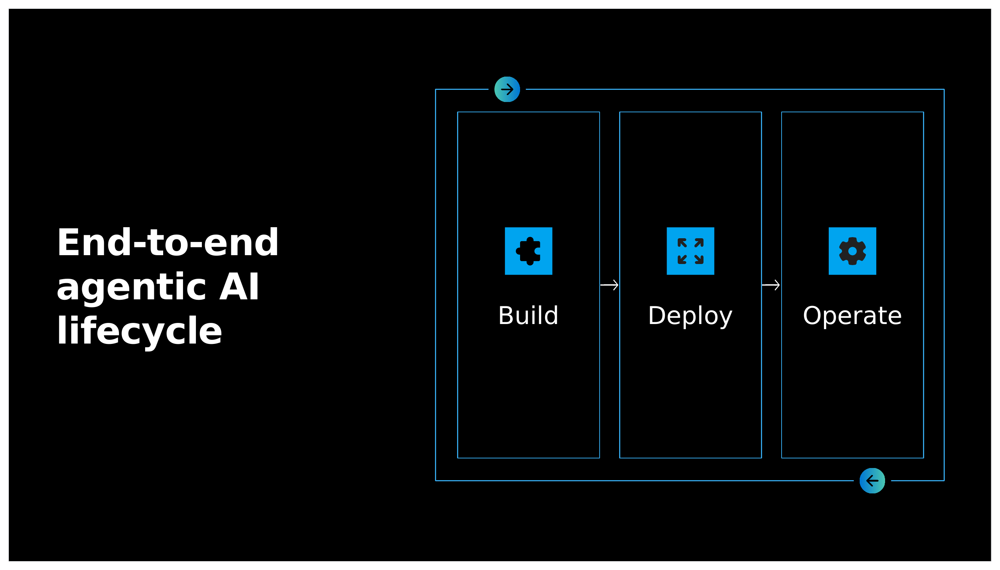</div>

> Source: BRK241 Slide 5 — The Build → Deploy → Operate lifecycle. Traces, cost signals, and outcomes are captured, refined, and fed back into models, skills, tools, memory, and outcomes. The longer the system runs, the more value it compounds.

| Phase | What Happens | Key Capabilities |
|:------|:-------------|:----------------|
| **Build** | Develop agents locally with any framework, connect tools, knowledge, memory | Agent Framework, Foundry Toolkit for VS Code, Toolboxes, Voice Live API |
| **Deploy** | Host in isolated sandbox, publish to Teams/M365/API, set up routines | Hosted Agents, Routines, Teams publishing, Agent Identity |
| **Operate** | Monitor, evaluate, optimize, govern across fleet | Tracing, Evaluation, Rubric, Agent Optimizer, Procedural Memory |

---

## The Platform Stack

The Microsoft Agent Platform has four layers, spanning from the maker surface (high abstraction) to the developer surface (full control):

<div align="center">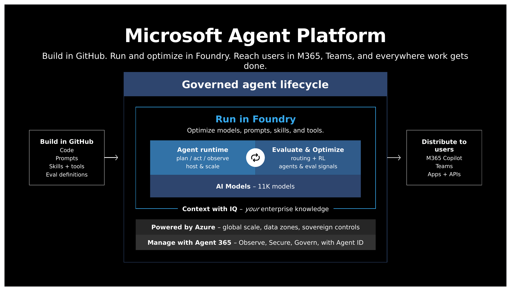</div>

> Source: BRK241 Slide 3 — "Build in GitHub. Run and optimize in Foundry. Reach users in M365, Teams, and everywhere work gets done."

| Layer | Purpose | Components |
|:------|:--------|:-----------|
| **Human + Agent Collaboration** | Where users interact with agents | Copilot chat, Teams, apps, APIs |
| **Agent Runtime** | Plan → Act → Observe loop, hosting & scaling | Hosted Agents, evaluate & optimize |
| **Intelligence** | Context and capabilities for agents | Foundry IQ, Work IQ, Fabric IQ, tools, memory, skills |
| **Trust + Security** | Enterprise governance throughout | Conditional Access, audit logging, data residency, Agent Identity |

---

## Demo Scenario: Autonomous Fiber Outage Response

The session demonstrates an end-to-end scenario: **autonomous detection, triage, dispatch, and resolution of fiber outages** in Microsoft's global cloud infrastructure.

<div align="center">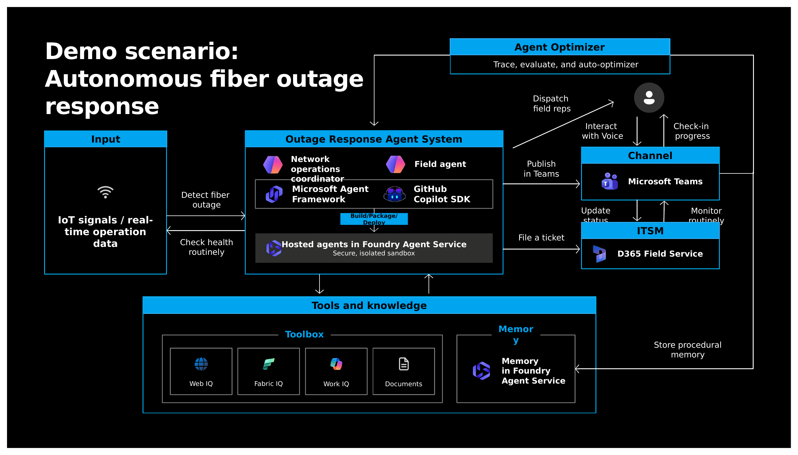</div>

> Source: BRK241 Slide 4 — Two hosted agents in Foundry Agent Service coordinate fiber outage response.

Two agents work together:

| Agent | Role | Demonstrates |
|:------|:-----|:------------|
| **`field-ops-agent`** | Field engineer assistant. Answers voice queries like "What's the fiber termination spec for Quincy North B-side?" by looking up site specs, work orders, and repair procedures. | Build: Agent Framework, tools, Toolbox/MCP, voice routing, procedural memory, tracing |
| **`fibey-coordinator`** | Network operations coordinator. Monitors telemetry, detects anomalies, creates tickets, dispatches field reps, escalates when needed. Not a chatbot — a long-running "AI teammate." | Deploy/Operate: Hosted Agent, routines, persistent state, scale-to-zero, human-in-the-loop, Teams publishing |

---

## How It Works Under the Hood

BRK241 is not just a product tour. It shows a reference pattern for moving an agent from a local developer loop into a governed production runtime.

### 1. Local Agent Harness

The developer starts locally with a framework of choice. In the demo project, the agent is packaged with `agent.yaml`, `Dockerfile`, evaluation config, procedural memory seed, a router agent, a worker agent, and a toolbox integration. That separation matters: application logic remains in code, while platform-facing deployment, evaluation, memory, and tool metadata live beside it.

### 2. Governed Tool Access

The agent does not directly hardcode every enterprise connector. It goes through Toolboxes and IQ systems. The demo's Tool Catalog shows a mixed tool surface: built-in Code Interpreter, Fabric IQ / OneLake Catalog, and Work IQ through MCP. This is the governance boundary: the agent sees callable tools, while platform policy controls identity, connection, and audit.

### 3. Hosted Runtime

Hosted Agents move the same agent package into Foundry Agent Service. The session highlights isolated sandboxing, sub-second cold start, and scale-to-zero as the runtime promises. The important architectural shift is that production hosting becomes a platform concern instead of a custom web server that every team has to operate.

### 4. Operations Feedback Loop

Once deployed, each run emits traces. Evaluations and Rubric turn those traces into quality signals. Agent Optimizer proposes prompt or skill changes. Procedural Memory captures reusable playbooks across runs. That loop is the operational counterpart to model post-training: first improve instructions, tools, memory, and routing; when model behavior itself becomes the bottleneck, continue into the BRK231/BRK232 post-training loop.

---

## Act 1: Build — From Framework to Agent

### Developer Challenges

- How do I build with the framework I want without lock-in?
- How do I ground my agent on enterprise knowledge without a six-month integration project?
- How do I give my agent governed, secure access to tools — without re-implementing integrations every time?

### Microsoft Agent Framework

The stable-release [Microsoft Agent Framework](https://github.com/microsoft/agents) provides the **agent harness** — skills, memory, middleware, and controlled execution — that lets you build locally and deploy anywhere. It integrates with the GitHub Copilot SDK, Claude Agent SDK, and other coding agent frameworks.

BRK241's key framework point was that the harness is not just another tool wrapper. The session described a secure execution environment where an agent can run shell commands and read, write, and execute code under platform control. That shifts the agent from a fixed router over predefined tools into a system that can investigate, author code, and operate against a managed workspace.

### Foundry Toolkit for VS Code

The generally available **Foundry Toolkit for VS Code** provides a dedicated IDE experience across agent creation, local debugging, tracing, evaluation, and model management.

The session also showed the creation path before the project exists: start from a sample, or use **Generate with Copilot** to scaffold an agent from a natural-language prompt. The toolkit wires in Foundry best-practice skills and deployment metadata so the generated project is ready for local debugging, tracing, evaluation, and hosted deployment. For local debugging, **F5** starts the agent on localhost, connects it to Toolbox through a single MCP-compatible endpoint, and lets the developer inspect breakpoints and streaming events inside VS Code.

In the demo, Jeff Hollan opens the `field-ops-agent` project in VS Code, connects the Agent Inspector to the local agent running at `localhost:8088`, and interacts through the Playground:

<div align="center">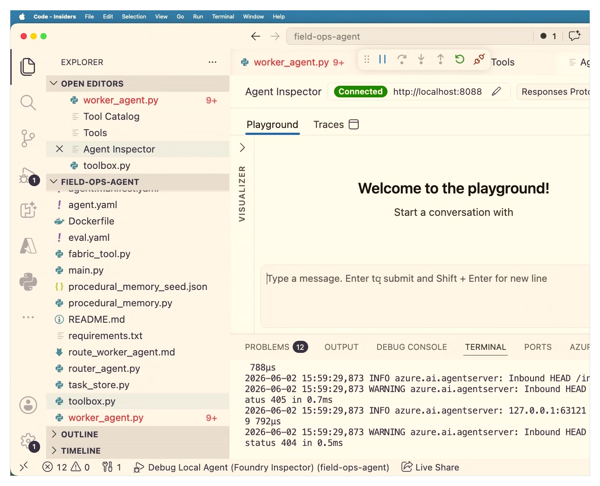</div>

> Source: BRK241 demo — VS Code with Agent Inspector connected to field-ops-agent. The project includes `agent.yaml`, `Dockerfile`, `eval.yaml`, `procedural_memory_seed.json`, `worker_agent.py`, `router_agent.py`, and `toolbox.py`.

### Toolboxes and MCP Integration

**Foundry Toolboxes** provide agents with managed, governed endpoints for accessing enterprise tools and data. The Tool Catalog in the demo shows tools connected via multiple protocols:

<div align="center">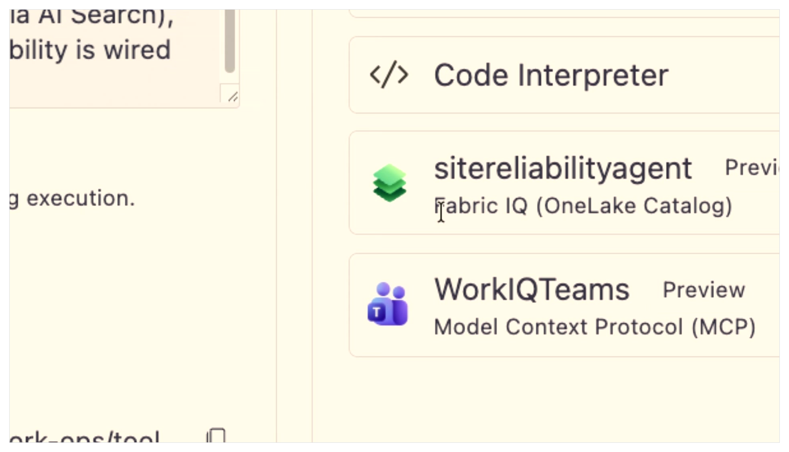</div>

> Source: BRK241 demo — Tool Catalog showing Code Interpreter, `sitereliabilityagent` (Fabric IQ / OneLake Catalog), and `WorkIQTeams` (Model Context Protocol / MCP).

| Tool | Source | Protocol |
|:-----|:-------|:---------|
| Code Interpreter | Built-in | Foundry native |
| Site Reliability Agent | Fabric IQ (OneLake Catalog) | Foundry IQ |
| Work IQ Teams | Microsoft Teams data | MCP |

Two Toolbox details matter for production agents. **Tool Search** lets the Toolbox return only the tools relevant to the current task, reducing context-window waste and keeping the agent focused. **Guardrails** can be configured at the tool boundary, including policies such as preventing PII from leaking through tool results. The same tool surface can include Content Understanding, which converts PDF contracts, specifications, and tables into agent-readable markdown, figures, or JSON.

### Voice Live API

**Voice Live API** integrates directly with Foundry Agent Service. In the demo, `field-ops-agent` supports voice-first interaction — a field engineer speaks naturally, and the agent responds with a quick acknowledgment ("Looking that up") while asynchronously querying backend tools.

<div align="center">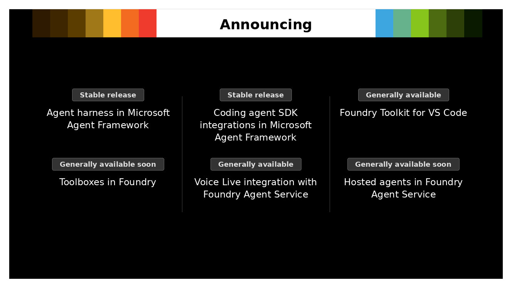</div>

> Source: Based on BRK241 Slide 8 — Build phase announcements: Agent Framework (Stable Release), Coding agent SDK integrations (Stable Release), Foundry Toolkit for VS Code (GA), Toolboxes (GA soon), Voice Live API (GA), Hosted Agents (GA soon).

---

## Act 2: Deploy — From Laptop to Production

### Developer Challenges

- How do I take a long-running autonomous agent from my laptop to production without rewriting the runtime?
- How do I get sub-second cold starts and proper isolation?
- How do I get my agent in front of users where they actually work?
- How do I make my agent a first-class teammate in my org — with its own identity, mailbox, Teams presence, and audit trail?

### Hosted Agents in Foundry Agent Service

**Hosted Agents** (GA soon) run your containerized agent in an isolated, secure sandbox with:
- **Sub-second cold starts** — no warm-up delay
- **Scale-to-zero** — zero idle cost when no sessions are active
- **Framework agnostic** — bring your own Python/Node.js agent built with any framework
- **Long-running autonomous agents** — agents can persist state across sessions

In the demo, `field-ops-agent` is deployed as a hosted agent. The Foundry Portal screenshot shows the agent's Playground, Traces, Monitor, Evaluation, and Optimize tabs:

<div align="center">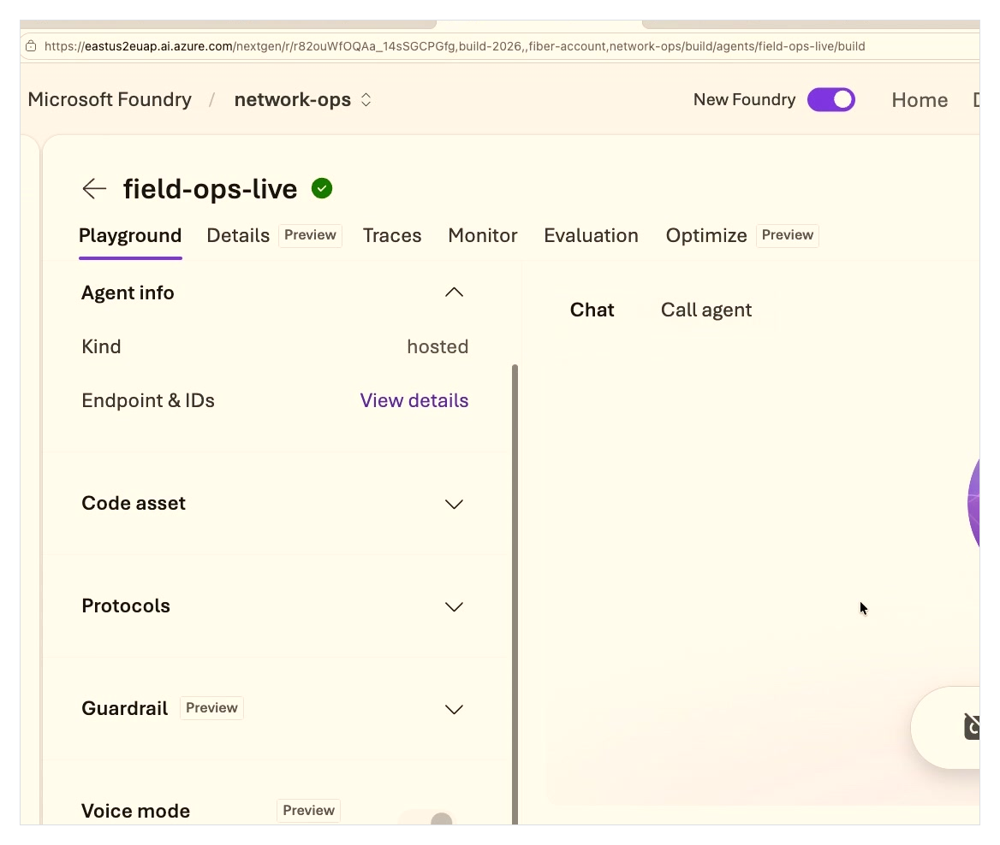</div>

> Source: BRK241 demo — Foundry Portal screenshot showing `field-ops-live` as a hosted agent. The version and date visible in the UI are demo artifacts, not product requirements. Left panel shows Agent info, Code asset, Protocols, Guardrail, and Voice mode. The Playground supports both Chat and "Call agent" (voice) modes.

BRK241 made the isolation problem concrete: if subcontractor A and subcontractor B both interact with the same autonomous agent, files and intermediate state written for one party must not be visible to the other. Hosted Agents address that by giving each conversation or routine its own isolated workspace session while preserving durable state for that session.

The demo then extended this long-running pattern with **Durable Task Scheduler** through the Microsoft Agent Framework extension. In the session, the agent could go idle with no active hosted session while waiting for human approval; Durable Task tracked the workflow state, and approval later resumed the session with the prior investigation files restored. This was shown as a demo architecture pattern, not as a product SLA.

### Routines

**Routines** (Public Preview) transform agents from reactive to proactive. You define what should happen on a schedule, and Foundry reliably queues, executes, and tracks each run.

<div align="center">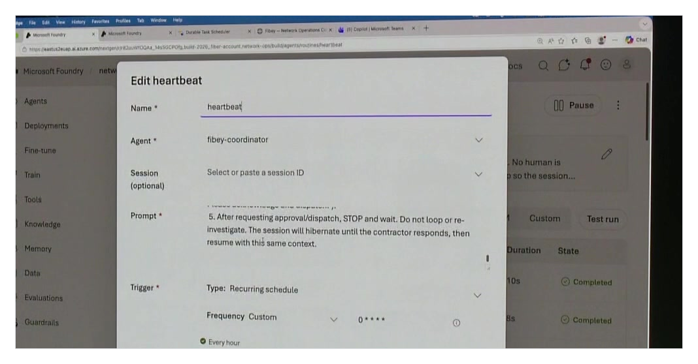</div>

> Source: BRK241 demo — "Edit heartbeat" routine for `fibey-coordinator`. In practical terms, a Routine is like a scheduled task for an agent, but with Foundry-managed run tracking and session state. The screenshot shows a recurring hourly schedule where the agent acknowledges, dispatches, then stops and waits until the next external update.

### Publishing to Teams and M365 Copilot

Publishing to **Teams** and **Microsoft 365 Copilot** puts your agent where users already work. Identity, permissions, and policy flow through automatically.

In the demo, `fibey-coordinator` appears as a first-class teammate in Microsoft Teams, proactively posting incident tables with site-level status:

<div align="center">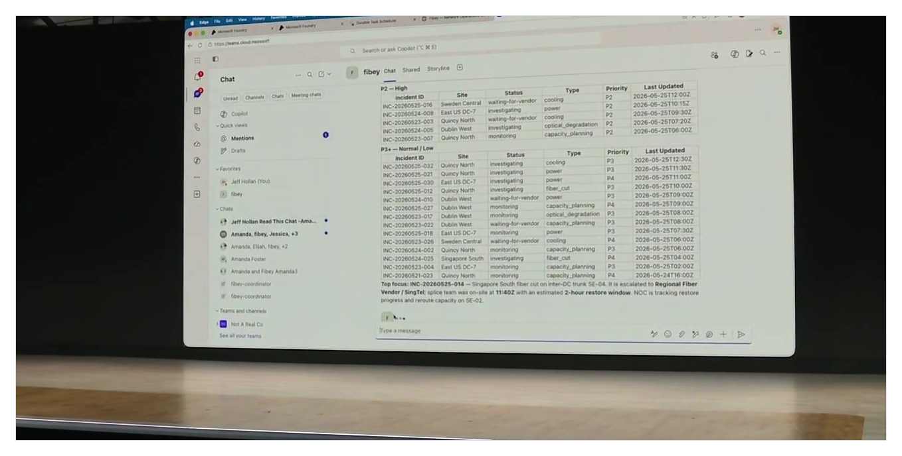</div>

> Source: BRK241 demo — Microsoft Teams showing `fibey` in the chat sidebar. The coordinator posts structured incident tables (P2–High and P3–Normal/Low) with Incident ID, Site, Status, Type, Priority, and Last Updated. The bottom shows an escalation summary for a Singapore South fiber cut.

### Agent Identity (Entra Agent ID)

Agents can have their own **Entra Agent ID** — including an email address, Teams presence, and audit trail. They can proactively initiate conversations, follow up on action items, and operate as true organizational teammates. Agent 365 provides end-to-end governance.

<div align="center">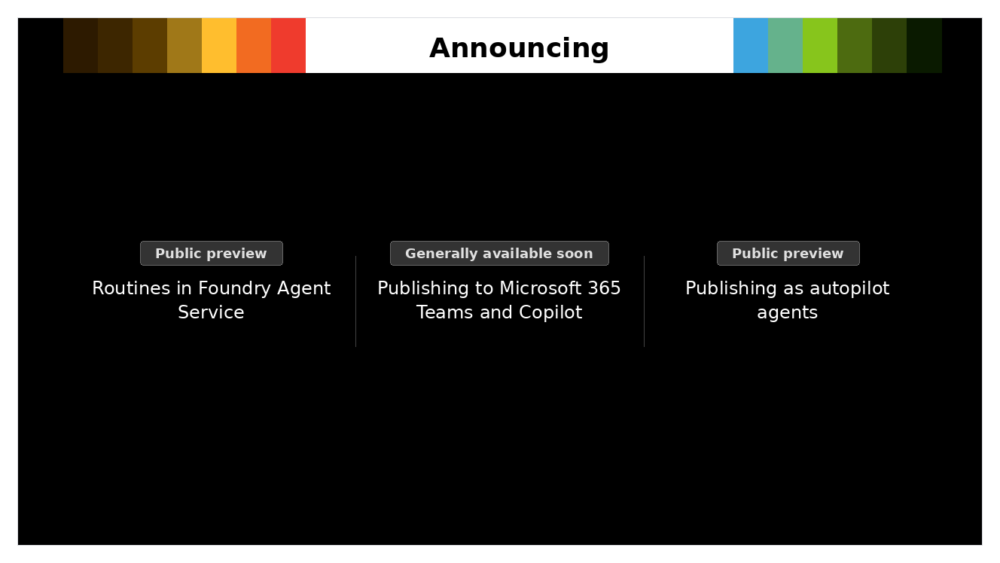</div>

> Source: Based on BRK241 Slide 11 — Deploy phase announcements: Routines (Public Preview), Publishing to M365 Teams and Copilot (GA soon), Publishing as autopilot agents (Public Preview).

---

## Act 3: Operate — From Launch to Continuous Improvement

### Developer Challenges

- How do I monitor cost, performance, and usage across agents?
- How do I enforce compliance and data-access policies at scale?
- How do I detect and mitigate unsafe or failed behaviors?
- How do I keep improving quality and cost without becoming a prompt-engineering specialist?

### Tracing and Evaluation

**Tracing** (GA soon) captures every model call, tool invocation, sub-agent hop, and handoff into a unified OpenTelemetry pipeline. **Evaluation** runs automated quality checks against production traces.

In the demo, Jeff initializes evaluation with a single CLI command:

<div align="center">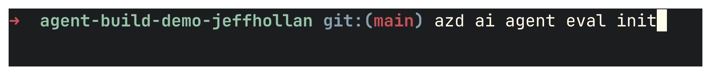</div>

> Source: BRK241 demo — Terminal showing `azd ai agent eval init` in the `agent-build-demo-jeffhollan` project. This scaffolds `eval.yaml` with evaluation criteria for the agent.

The important operational detail is that `azd ai agent eval init` is not only a file generator. In the demo narrative, Foundry can use historic traces and related agent signals to propose an initial eval dataset when the team does not already have one. It can also recommend evaluator combinations — such as tool selection, tool input/output, retrieval quality, fluency, and custom rubric scoring — based on how the agent is actually being used.

### Rubric for Custom Evaluation

**Rubric** (Public Preview) automatically generates context-aware evaluation criteria and weighted scoring. Instead of writing custom evaluation logic, you describe what "good" looks like and Rubric creates the scoring framework from real production scenarios.

The BRK241 demo made this concrete with voice-agent feedback. The generated rubric included dimensions such as correct tool use, safety warning, and voice-optimized conciseness. Jeff then adjusted the voice conciseness weight from 3 to 10 as a demo example of developer-controlled rubric tuning, not as a general recommended value.

### Agent Optimizer

**Agent Optimizer** (Private Preview) analyzes production traces and evaluation results to generate prompt and skill improvement candidates. It compares quality, cost, and latency across candidates, and lets the developer decide whether to deploy — with full lineage and rollback support.

The CLI entry point shown in the session was `azd ai agent optimize`. The optimizer can vary prompts, skills, tool descriptions, and even the target model as experiment variables — for example, the session mentioned comparing model choices such as GPT 5.5 and Anthropic Opus 4.8 as variables in the optimization search. The on-stage run produced four candidates with different trade-offs, letting the developer inspect score details, compare quality/cost/latency, and promote the chosen candidate.

<div align="center">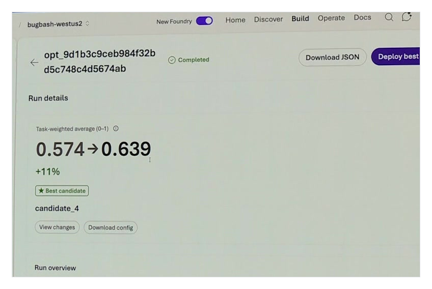</div>

> Source: BRK241 demo — Agent Optimizer results in Foundry Portal. The demo screenshot shows task-weighted average improving from **0.574 → 0.639 (+11%)**. The screenshot does not show the underlying scenario count, so this should be read as an on-stage demo result, not an independent benchmark reproduced in this repo.

This is where BRK241 connects directly to [BRK232: Foundry Agent Post-Training](https://github.com/david-xinyuwei/david-share/tree/master/Deep-Learning/Foundry-Agent-Post-Training-Deep-Dive). Agent Optimizer improves prompts, instructions, skills, and tool configuration. If the bottleneck is the model behavior itself — for example, the model cannot reliably learn a tool-calling policy from prompting alone — the next step is the BRK231/BRK232 loop: traces → datasets → SFT/RFT/Low-Level Training API → improved model → redeploy into the agent lifecycle.

### Procedural Memory

**Procedural Memory** (Public Preview) lets agents learn playbooks across runs. Instead of starting from scratch every session, agents accumulate operational knowledge — repair procedures, escalation patterns, site-specific quirks — and apply them to future interactions.

<div align="center">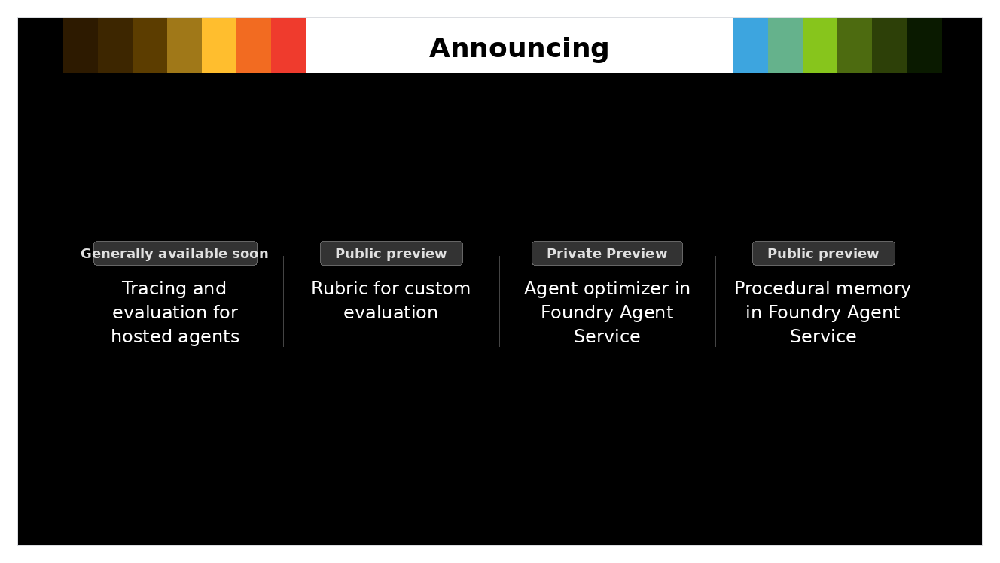</div>

> Source: Based on BRK241 Slide 14 — Operate phase announcements: Tracing and evaluation (GA soon), Rubric for custom evaluation (Public Preview), Agent Optimizer (Private Preview), Procedural Memory (Public Preview).

---

## Key Announcements at Build 2026

| Announcement | Phase | Status |
|:-------------|:------|:-------|
| Microsoft Agent Framework — stable agent harness | Build | **Stable Release** |
| Coding agent SDK integrations (GitHub Copilot SDK, Claude Agent SDK) | Build | **Stable Release** |
| Foundry Toolkit for VS Code | Build | **GA** |
| Toolboxes in Foundry | Build | **GA soon** |
| Voice Live API integration with Foundry Agent Service | Build | **GA** |
| Hosted Agents in Foundry Agent Service | Deploy | **GA soon** |
| Routines in Foundry Agent Service | Deploy | **Public Preview** |
| Publishing to Microsoft 365 Teams and Copilot | Deploy | **GA soon** |
| Publishing as autopilot agents | Deploy | **Public Preview** |
| Tracing and evaluation for hosted agents | Operate | **GA soon** |
| Rubric for custom evaluation | Operate | **Public Preview** |
| Agent Optimizer in Foundry Agent Service | Operate | **Private Preview** |
| Procedural Memory in Foundry Agent Service | Operate | **Public Preview** |

> Source: BRK241 Slides 8, 11, 14

---

## Customer Deployments

<div align="center">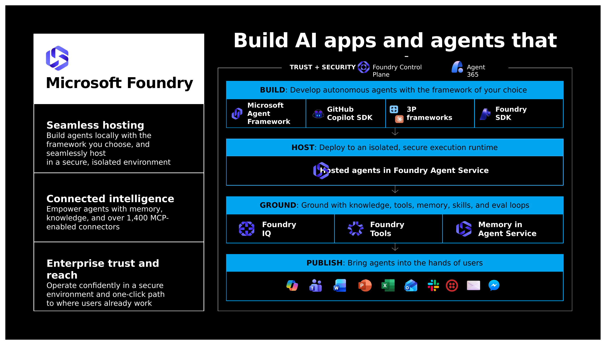</div>

> Source: BRK241 Slide 16 — "Build simply. Deploy powerfully. Operate with trust."

| Company | Use Case |
|:--------|:---------|
| **Iberdrola** | Mission-critical energy workflows across 14 countries. Requires identity, memory, security, and observability by design. |
| **Twilio** | Deployed Twilio Agent Connect on hosted agents in Foundry. |
| **KPMG** | Building global KPMG Workbench on hosted agents, using Foundry out-of-the-box tools and skills. |
| **Citrix** | Using Hosted Agents to bring AI into virtual desktop environments, running securely at scale on Azure. |
| **AT&T** | Customer care information retrieval **33% faster** (as reported in BRK241). |
| **BMW** | Telemetry analysis **12x faster** (as reported in BRK241). |
| **Nasdaq** | Saving **100+ hours per year** (as reported in BRK241). |

> Over **80,000 enterprises and digital natives** are using Azure AI Foundry.
> — BRK241 Slide 19

---

## Getting Started

### Clone the Official BRK241 Repo

The session ships two fully deployable sample agents with infrastructure-as-code:

```bash
git clone https://github.com/microsoft/Build26-BRK241-from-prototype-to-production-build-and-run-agents-at-scale.git
cd Build26-BRK241-from-prototype-to-production-build-and-run-agents-at-scale
```

**Prerequisites**:
- Azure subscription with access to [Microsoft Foundry](https://learn.microsoft.com/azure/ai-foundry/)
- [Azure Developer CLI (azd)](https://learn.microsoft.com/azure/developer/azure-developer-cli/install-azd) v1.24+
- Foundry agents extension: `azd extension install azure.ai.agents`
- Python 3.12+

### Provision and Deploy

```bash
# Provision the Foundry project, model deployment, and supporting resources
azd provision

# Deploy both hosted agents
azd deploy
```

Deploy a single agent with `azd deploy field-ops-agent` or `azd deploy fibey-coordinator`. Tear everything down with `azd down`.

| Agent | Description |
|:------|:------------|
| `field-ops-agent` | Voice-enabled field technician assistant — tools, MCP Toolbox connection, optional Fabric data agent, procedural memory |
| `fibey-coordinator` | Long-running network operations coordinator — persistent sessions, scale-to-zero, human-in-the-loop approvals, Teams integration |

See the [field-ops-agent README](https://github.com/microsoft/Build26-BRK241-from-prototype-to-production-build-and-run-agents-at-scale/blob/main/src/field-ops-agent/README.md) and [fibey-coordinator README](https://github.com/microsoft/Build26-BRK241-from-prototype-to-production-build-and-run-agents-at-scale/blob/main/src/fibey-coordinator/README.md) for per-agent details, example prompts, and optional integrations.

### Watch the Session

[BRK241 — From prototype to production: build and run agents at scale](https://build.microsoft.com/en-US/sessions/BRK241)

---

## Key Resources

| Resource | Link |
|:---------|:-----|
| BRK241 Official Code Repo | [github.com/microsoft/Build26-BRK241-...](https://github.com/microsoft/Build26-BRK241-from-prototype-to-production-build-and-run-agents-at-scale) |
| Microsoft Agent Framework | [github.com/microsoft/agents](https://github.com/microsoft/agents) |
| Foundry Agent Service documentation | [learn.microsoft.com/azure/ai-foundry/agents](https://learn.microsoft.com/azure/ai-foundry/concepts/agents) |
| Hosted Agents documentation | [learn.microsoft.com/azure/ai-foundry/concepts/hosted-agents](https://learn.microsoft.com/azure/ai-foundry/concepts/hosted-agents) |
| Foundry Toolkit for VS Code | [VS Code Marketplace](https://marketplace.visualstudio.com/items?itemName=ms-azuretools.azure-ai-foundry) |
| Azure Developer CLI (azd) | [learn.microsoft.com/azure/developer/azure-developer-cli](https://learn.microsoft.com/azure/developer/azure-developer-cli/) |
| Build 2026 sessions | [build.microsoft.com](https://build.microsoft.com) |

---

## Running on Azure

| Component | Azure Service | Purpose |
|:----------|:-------------|:--------|
| Agent hosting | Foundry Agent Service (Hosted Agents) | Isolated sandbox, sub-second cold start, scale-to-zero |
| Model inference | Azure OpenAI Service | GPT-4.1, GPT-4.1 mini, GPT-5.x |
| Enterprise knowledge | Foundry IQ, Fabric IQ, Work IQ | Grounding agents on organizational data |
| Tool integration | Foundry Toolboxes | Managed MCP endpoints, built-in tools |
| Publishing | Microsoft Teams, M365 Copilot | User-facing agent distribution |
| Identity & governance | Entra Agent ID, Agent 365, Purview, Defender | Security, compliance, audit |
| Observability | Foundry Tracing, Evaluation, Application Insights | OpenTelemetry pipeline, quality monitoring |
| Optimization | Agent Optimizer, Rubric, Procedural Memory | Continuous improvement loop |

---

## Related Repos

| Repository | Description |
|:-----------|:------------|
| [Foundry-Agent-Post-Training-Deep-Dive](https://github.com/david-xinyuwei/david-share/tree/master/Deep-Learning/Foundry-Agent-Post-Training-Deep-Dive) | Deep dive into Foundry agent post-training: distillation, SFT, RFT, and Low-Level Training API (BRK231/BRK232) |
| [Foundry-Hosted-Agent-Toolbox-Demo](https://github.com/david-xinyuwei/david-share/tree/master/Agents/Foundry-Hosted-Agent-Toolbox-Demo) | Hands-on demo of Foundry Hosted Agents with Toolbox integration |
| [Azure-Agent-Skills-In-Action](https://github.com/david-xinyuwei/david-share/tree/master/Agents/Azure-Agent-Skills-In-Action) | 61 Azure Agent Skills validated end-to-end |
| [Microsoft-Agent-Framework](https://github.com/david-xinyuwei/david-share/tree/master/Agents/Microsoft-Agent-Framework) | Microsoft Agent Framework analysis and examples |
