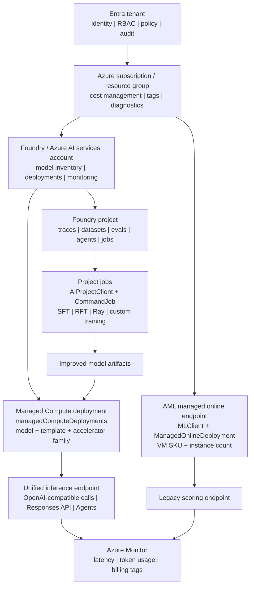

# Foundry Agent ModelOps：Operational Plane Map

[](https://learn.microsoft.com/azure/ai-foundry/)
[](https://build.microsoft.com/)
[](#executive-summary)
[](https://www.python.org/)

Foundry 让生产级 AI ModelOps 更容易解释和落地：团队可以在同一个 operational plane 里改进模型、部署模型、调用模型、监控效果并归集成本；但平台工程师仍然要按不同动作选择不同 API，比如 training job、Managed Compute deployment、旧 AML endpoint 和 inference call。

这是一份公开、可引用、证据驱动的边界图。这里的 governance 指 **operational governance**：identity、project context、monitoring、billing 和 lifecycle control；它不是完整的 compliance / audit governance 审计报告。

> **Author**: 魏新宇 (Xinyu Wei) - Microsoft AI and Apps GBB Senior System Engineer

[English](README.md) | 中文版 | [Managed Compute Blog](https://devblogs.microsoft.com/foundry/announcing-foundry-managed-compute/) | [BRK232 Code Repo](https://github.com/microsoft/Build26-BRK232-train-and-deploy-custom-oss-reasoning-models-with-foundry)

---

## Executive Summary

Build 2026 的 Foundry 叙事不能简单说成“所有 API 都统一成一个 API”。更准确、也更适合客户沟通的说法是：

> **Foundry 统一的是 operational plane，不是每一个 low-level operation。** Training jobs、managed deployments、旧 AML online endpoints 仍然有不同 API，但 tenant identity、project context、endpoint experience、monitoring、billing、model inventory 和 operational governance 正在收敛到 Foundry resource 和 project model 下。

| 问题 | 简短答案 | 证据 |
|---|---|---|
| Tenant、identity、project、monitoring、billing 能统一讲吗？ | **可以。** 这是 Foundry 的核心价值。 | Managed Compute Blog 明确写了 “One Foundry resource”、“same SDKs, the same authentication, the same endpoint URL”、“One Azure Monitor surface” 和 “one bill”。 |
| BRK232 training job 和 Managed Compute deployment 是同一个 API 吗？ | **不是。** 它们同属 Foundry/Cognitive Services 产品家族，但 operation 不同。 | BRK232 用 `AIProjectClient` 和 `CommandJob`；Managed Compute deployment 用 `Microsoft.CognitiveServices/accounts/managedComputeDeployments`。 |
| 旧的 `AI-Foundry-Model-Performance` repo 和 Build 2026 Managed Compute 是一套东西吗？ | **不是。** 它走的是 Azure ML managed online endpoint + VM SKU 路线。 | 脚本里导入的是 `azure.ai.ml.MLClient`、`ManagedOnlineEndpoint`、`ManagedOnlineDeployment`。 |
| 跳出 BRK232，看其他 session，是否也支持“训练/推理分层”？ | **支持。** BRK232 是 post-training loop；DEM320 是 Managed Compute production serving demo；BRK230/BRK234 补模型运营大图。 | DEM320 明确说用 Foundry Managed Compute 把 Hugging Face models deploy/scale 到 production inference；BRK234 标题就是 “from fine-tuning to inference”。 |
| API 不一样会不会影响客户价值？ | **对工程师重要，对治理主线不构成否定。** | 模型部署后，应用侧可以走统一 Foundry endpoint/inference 体验；平台侧仍要按训练或部署动作选择正确 API。 |

---

## Source Map

| 来源 | 证明什么 | 对外安全结论 |
|---|---|---|
| [Announcing Foundry Managed Compute](https://devblogs.microsoft.com/foundry/announcing-foundry-managed-compute/) | Managed Compute 把 open/custom model serving 放进一个 Foundry resource、endpoint、SDK、monitoring 和 bill。 | 这是“统一 operational plane”的主要公开来源。 |
| [Managed Compute ARM schema](https://learn.microsoft.com/en-us/azure/templates/microsoft.cognitiveservices/accounts/managedcomputedeployments) | Deployment resource 是 `Microsoft.CognitiveServices/accounts/managedComputeDeployments`，字段包括 `model`、`deploymentTemplate`、`acceleratorType`、`computeId`、`sku`。 | Managed Compute 是 deployment abstraction，不是 training job 对象。 |
| [AIProjectClient reference](https://learn.microsoft.com/en-us/python/api/azure-ai-projects/azure.ai.projects.aiprojectclient?view=azure-python-preview) | Project endpoint 形式是 `https://{account}.services.ai.azure.com/api/projects/{project}`。 | BRK232 属于 Foundry project-scoped job 和 asset context。 |
| [ManagedOnlineDeployment reference](https://learn.microsoft.com/en-us/python/api/azure-ai-ml/azure.ai.ml.entities.managedonlinedeployment?view=azure-python) | AML online deployment 有 `model`、`endpoint_name`、`instance_type`、`instance_count`。 | 旧 AML Model Catalog endpoint deployment 是 VM-SKU based。 |
| [BRK232 official repo](https://github.com/microsoft/Build26-BRK232-train-and-deploy-custom-oss-reasoning-models-with-foundry) | Training recipe 使用 Foundry `CommandJob`、Ray distribution、datasets、inputs、outputs 和 attached GPU compute。 | BRK232 是 learning loop：traces -> datasets -> SFT/RFT -> improved model。 |
| [DEM320 session page](https://build.microsoft.com/en-US/sessions/DEM320) 和 [DEM320 official repo](https://github.com/microsoft/Build26-DEM320-hugging-face-open-source-models-to-production-on-microsoft-foundry) | DEM320 讲用 Foundry Managed Compute deploy/scale Hugging Face models，到 production inference，且不直接管理 GPUs。 | Managed Compute 是 open-source models 的 production serving substrate。 |
| [BRK230 session page](https://build.microsoft.com/en-US/sessions/BRK230) | BRK230 讨论 model selection、evaluation、routing、optimization、cost 和 continuous improvement。 | Model operations 围绕 training 和 serving surface，不替代二者。 |
| [BRK234 session page](https://build.microsoft.com/en-US/sessions/BRK234) | BRK234 主题是 shipping custom models at scale from fine-tuning to inference。 | Fine-tuning 和 inference 属于同一个 custom-model lifecycle，但工程阶段、瓶颈和 API surface 不同。 |
| [AI-Foundry-Model-Performance](https://github.com/david-xinyuwei/david-share/tree/master/Deep-Learning/AI-Foundry-Model-Performance) | 公开 repo 展示了旧 Azure ML managed online endpoint 部署和性能测试。 | 它是 pre-Accelerator VM-SKU model serving path 的对照样本。 |

---

## 跨 Session 边界验证

为了避免只盯着 BRK232 得出局部结论，最好把相邻 Build sessions 放在一起看：

| Build 资产 | 公开信号 | 支撑的边界 |
|---|---|---|
| **BRK232 — Post-Training and Deploying Open Source Reasoning Models in Foundry** | 标题和官方 repo 都围绕 SFT、RFT/GRPO、evaluators、datasets、Ray distribution 和 training jobs。 | 这是 learning loop：用任务数据和 reward 把模型变好。 |
| **DEM320 — Hugging Face open-source models to production on Microsoft Foundry** | Session page 写明用 Foundry Managed Compute deploy/scale Hugging Face models，从 model discovery 到 production inference，不需要直接管理 GPUs。 | 这是 serving substrate：把 open models 部署到 managed endpoint 后面。 |
| **BRK230 — Build smarter AI systems in Foundry as models and costs evolve** | 这场讲 model selection、evaluation、routing、cost optimization 和 ongoing improvement。 | 这是模型选择和生命周期治理的 operating loop。 |
| **BRK234 — Shipping custom models at scale from fine-tuning to inference** | 这场把 fine-tuning、serving、inference efficiency、GPU cost、kernel/runtime optimization 放在一条 lifecycle 里讨论。 | Fine-tuning 和 inference 有顺序关系，但不是同一个工程动作。 |

这组旁证支持一个更清楚的架构说法：

> **BRK232 讲怎么做出一个更适合任务的模型；DEM320 和 Managed Compute 讲 open/custom models 怎么进 production serving；BRK230 和 BRK234 补齐 model selection、tuning、cost、inference efficiency 的模型运营大图。**

所以对客户最稳的说法不是“BRK232 等于 Managed Compute”，而是：

> **先通过 Foundry project jobs 和 post-training workflow 训练或改进模型；再按模型和产品支持情况，选择合适的 Foundry deployment substrate，例如 Managed Compute，把 open/custom model 跑进生产。**

---

## 架构图



---

## API 形态证据矩阵

这里的 “API 形态证据” 指可以观察到的 operation 形状：SDK package、client/resource name、operation name、ARM resource type、endpoint path 和 payload fields。我们用这些形状判断它属于 training、deployment、旧 endpoint management，还是部署后的 inference。

| 路径 | 公开例子 | API 形态证据 | Resource 或 endpoint 形态 | 它做什么 | 不代表什么 |
|---|---|---|---|---|---|
| Foundry project training job | BRK232 post-training repo | `azure-ai-projects`、`AIProjectClient`、`CommandJob`、`client.beta.jobs.create_or_update` | `https://<account>.services.ai.azure.com/api/projects/<project>/jobs/<job>` | 用 command、inputs、outputs、Ray distribution 和 attached compute 跑 SFT/RFT/custom job。 | 不是创建 managed model deployment 的同一个 operation。 |
| Foundry Managed Compute | Managed Compute Blog SDK sample | `azure.mgmt.cognitiveservices`、`managed_compute_deployments.begin_create_or_update` | `Microsoft.CognitiveServices/accounts/managedComputeDeployments` | 用 `model`、`deploymentTemplate`、`acceleratorType`、`sku` 创建 open/custom model deployment。 | 不是 BRK232 Ray training job。 |
| Legacy AML model catalog endpoint | AI-Foundry-Model-Performance repo | `azure-ai-ml`、`MLClient`、`ManagedOnlineEndpoint`、`ManagedOnlineDeployment` | `Microsoft.MachineLearningServices/workspaces/.../onlineEndpoints` | 用 `instance_type` 和 `instance_count` 把模型部署到 AML managed online endpoint。 | 不是 Build 2026 Accelerator abstraction。 |
| 部署后的 unified inference | Managed Compute Blog score sample | OpenAI-compatible SDK 或 `AIProjectClient.get_openai_client()` | `https://<account>.services.ai.azure.com/openai/v1` | 通过共享 Foundry endpoint pattern 调用部署后的模型。 | 不代表 training 和 deployment management calls 完全一样。 |

---

## 三条路径怎么区分

### BRK232: post-training job

```python
from azure.ai.projects import AIProjectClient
from azure.ai.projects.models import CommandJob

client.beta.jobs.create_or_update(name=job_name, job=CommandJob(...))
```

典型 payload 信号：`command`、`computeId`、`inputs`、`outputs`、`environmentImageReference`、`distributionType = Ray`。这是 training/job abstraction。

### Foundry Managed Compute: model-first deployment

在 Azure resource 形态上，Foundry resource 会表现为一个 `Microsoft.CognitiveServices/accounts` account。Managed Compute deployments 是这个 account 下面的 child resource：

```text
Azure subscription
    -> Foundry / Azure AI services account
             -> Microsoft.CognitiveServices/accounts/managedComputeDeployments
```

```python
resource = {
    "sku": {"name": "GlobalManagedCompute", "capacity": 1},
    "properties": {
        "model": "azureml://registries/azure-huggingface/models/qwen--qwen3-32b/versions/1",
        "deploymentTemplate": "azureml://registries/azure-huggingface/deploymenttemplates/qwen--qwen3-32b--40k-nvidia-h100/labels/latest",
        "acceleratorType": "H100_80GB",
    },
}
```

这是 deployment abstraction。它把 operator 从 **machine-first deployment** 推向 **model + template + accelerator family**。

### Legacy AML managed online endpoint: VM-SKU deployment

```python
from azure.ai.ml import MLClient
from azure.ai.ml.entities import ManagedOnlineEndpoint, ManagedOnlineDeployment

deployment = ManagedOnlineDeployment(
    model="azureml://registries/AzureML/models/<model>/versions/<version>",
    instance_type="Standard_NC24ads_A100_v4",
    instance_count=1,
)
```

这是旧 AML endpoint pattern。它对既有 workload 和 benchmark 仍然有用，但不是 Build 2026 Accelerator API shape。

---

## 客户叙事

对客户可以这样说：

> Microsoft Foundry 不是把每个 low-level API 都变成同一个 API，而是把 model lifecycle 收进同一个 operational plane。团队可以收集 agent traces，把它们转成 datasets，做 evaluations，post-train 一个模型，部署得到的 open/custom model，用 Foundry endpoint 调用它，通过 Azure Monitor 看效果，并在 Azure billing 里归集成本。底层 training jobs、managed deployments、旧 AML endpoints 仍然是不同 operation。客户价值在于 governance、identity、endpoint experience、observability 和 billing 收敛到 Foundry tenant/resource/project model。

短句版：

> **Unified governance plane, specialized operation surfaces.**

---

## 决策指南

| 客户需求 | 从哪里开始 | 为什么 |
|---|---|---|
| Agent 能跑，但 frontier model 太贵 | BRK232-style post-training | 从 traces 学习，做 SFT/RFT，产出更小、更专用的模型。 |
| 想 serve open/custom model，但不想管 GPU VM | Foundry Managed Compute | 选择 model、deployment template、accelerator family 和 instance count。 |
| 已经有旧 AML online endpoint 脚本 | 先保留 `azure-ai-ml`，再判断是否值得迁移 | 旧路径可用，但它是 VM-SKU oriented。 |
| 希望部署后应用调用路径统一 | Foundry endpoint / OpenAI-compatible SDK | 应用代码可以用 deployment name 作为 `model` 参数。 |
| 想讲一个统一企业治理故事 | Foundry tenant/account/project model | RBAC、identity、network、monitor、audit、billing 可以放在一起讲。 |

---

## 复验证据矩阵

```bash
git clone https://github.com/david-xinyuwei/david-share.git
cd david-share/Agents/Foundry-Agent-ModelOps-Governance
python -m venv .venv
source .venv/bin/activate  # Windows: .venv\Scripts\activate
pip install -r requirements.txt
python scripts/validate_api_surface.py --check
python scripts/validate_api_surface.py --format markdown
```

预期输出：

```text
Validated 4 API surfaces.
Governance-plane conclusion: unified_context_specialized_operations
```

脚本读取 [data/api-surfaces.json](data/api-surfaces.json)，检查每条路径是否有独立 package、operation、resource shape 和 purpose。

---

## 对外安全措辞

这些措辞适合用在 public presentations、customer calls 和 external documentation，避免把 API unification 说过头，也避免混淆 training surface 和 deployment surface。

| 不要这样说 | 换成这样说 |
|---|---|
| “所有 Foundry API 都统一了。” | “Foundry unifies the operational plane while keeping specialized operations for training and deployment.” |
| “BRK232 就是 Managed Compute。” | “BRK232 is the post-training loop; Managed Compute is the production serving substrate.” |
| “Accelerator 只是 AML endpoint 换名字。” | “Accelerator Managed Compute changes the deployment unit from VM SKU to model, template, and accelerator family.” |
| “旧 AML repo 和 Build 2026 Managed Compute 是同一个东西。” | “旧 repo 展示 AML managed online endpoint；Build 2026 Managed Compute 引入 Foundry managed deployment abstraction。” |
| “API 差异不重要。” | “API 差异对平台工程师重要；统一治理叙事对业务和架构决策者重要。” |

---

## FAQ

### BRK232 training jobs 和 Managed Compute deployments 都属于 Foundry 吗？

是。它们都属于 Foundry/Azure AI services 产品家族，也可以共享 tenant、identity、project、monitoring 和 endpoint context。但它们不是同一个 API operation。

### 应用代码能统一吗？

部署后大部分可以。Managed Compute deployments 可以通过 Foundry endpoint 和 OpenAI-compatible SDK pattern 调用。Training job submission 仍然是单独的平台动作。

### 出现 `computeId` 就说明 training 和 deployment 是一套吗？

不是。`computeId` 可以出现在不同上下文里。BRK232 里它指 training job 使用的 compute；`managedComputeDeployments` 的 Learn schema 里，它是 VM-backed managed compute deployment 所需的 Foundry compute ARM resource ID。共享词汇不等于共享生命周期。

### 旧 AML Model Catalog endpoint path 过时了吗？

不一定。它对既有部署和性能测试仍然有用。Build 2026 的方向是用新的 Managed Compute abstraction 降低 open/custom model serving 的运维负担。

---

## Related Repos

| Repo | 关系 |
|---|---|
| [Foundry-Agent-Post-Training-Deep-Dive](../../Deep-Learning/Foundry-Agent-Post-Training-Deep-Dive/) | 解释 BRK231/BRK232 learning loop：distillation、SFT、RFT、low-level API。 |
| [Foundry-Managed-Compute-Open-Models](../../Deep-Learning/Foundry-Managed-Compute-Open-Models/) | 解释 open/custom model 的 production serving substrate。 |
| [AI-Foundry-Model-Performance](../../Deep-Learning/AI-Foundry-Model-Performance/) | 展示旧 AML managed online endpoint performance-testing path。 |
| [AI-Foundry-Agent-VNET-Deployment](../AI-Foundry-Agent-VNET-Deployment/) | 用网络加固模式补充治理叙事。 |
| [Foundry-Hosted-Agent-Toolbox-Demo](../Foundry-Hosted-Agent-Toolbox-Demo/) | 展示 hosted-agent operational pattern，可消费统一 endpoint 叙事。 |
| [Foundry-Long-Running-Agent-Resilience](../Foundry-Long-Running-Agent-Resilience/) | 补充 Responses/Invocations workload proof pattern 的 documentation-only Private Preview 笔记。 |

---

## Key Takeaways

1. **Foundry 统一的是 operational plane，不是每一个 low-level operation。**
2. **BRK232 是 training/job abstraction。** 它的指纹是 `AIProjectClient` + `CommandJob`。
3. **Accelerator Managed Compute 是 deployment abstraction。** 它的指纹是 `managedComputeDeployments` + model/template/accelerator fields。
4. **旧 AML managed online endpoint 是 VM-SKU abstraction。** 它的指纹是 `MLClient` + `ManagedOnlineDeployment`。
5. **客户最需要听懂的是 governance convergence。** Identity、project context、endpoint experience、monitoring、billing 和 model lifecycle 正在变得更容易统一解释和运营。

---

## Verified Facts

| Fact | Evidence source | Verified |
|---|---|---|
| Managed Compute 使用一个 Foundry resource、same SDKs/auth/endpoint、Azure Monitor 和 one bill 来承载 model serving。 | [Managed Compute Blog](https://devblogs.microsoft.com/foundry/announcing-foundry-managed-compute/) | 2026-06-07 |
| Managed Compute deployment schema 使用 `model`、`deploymentTemplate`、`acceleratorType`、`computeId`、`sku`。 | [Managed Compute ARM schema](https://learn.microsoft.com/en-us/azure/templates/microsoft.cognitiveservices/accounts/managedcomputedeployments) | 2026-06-07 |
| AIProjectClient scoped 到 `/api/projects/{project}` Foundry project endpoint。 | [AIProjectClient reference](https://learn.microsoft.com/en-us/python/api/azure-ai-projects/azure.ai.projects.aiprojectclient?view=azure-python-preview) | 2026-06-07 |
| AML online deployments 使用 `instance_type` 和 `instance_count`。 | [ManagedOnlineDeployment reference](https://learn.microsoft.com/en-us/python/api/azure-ai-ml/azure.ai.ml.entities.managedonlinedeployment?view=azure-python) | 2026-06-07 |
