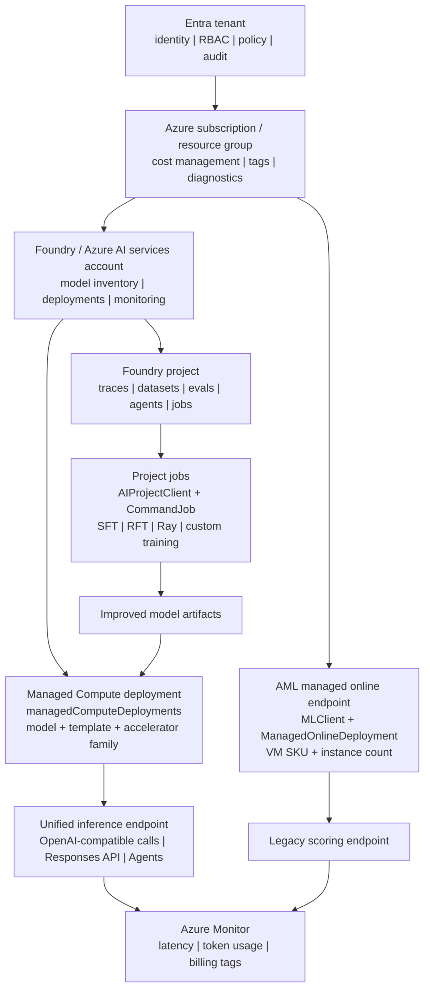

# Foundry Agent ModelOps: Operational Plane Map

[](https://learn.microsoft.com/azure/ai-foundry/)
[](https://build.microsoft.com/)
[](#executive-summary)
[](https://www.python.org/)

Foundry simplifies production AI model operations: teams can improve models, deploy them, call them, monitor them, and attribute cost through one operational plane, while platform engineers still use specialized APIs for training jobs, managed deployments, legacy AML endpoints, and inference calls.

This repo is a public, evidence-based map of those boundaries. It focuses on **operational governance** — identity, project context, monitoring, billing, and lifecycle control — not a full compliance/audit-governance assessment.

> **Author**: Xinyu Wei (魏新宇) - Microsoft AI and Apps GBB Senior System Engineer

[Chinese](README-CN.md) | English | [Managed Compute Blog](https://devblogs.microsoft.com/foundry/announcing-foundry-managed-compute/) | [BRK232 Code Repo](https://github.com/microsoft/Build26-BRK232-train-and-deploy-custom-oss-reasoning-models-with-foundry)

---

## Executive Summary

The Build 2026 Foundry story should not be reduced to "all APIs are now one API." The more accurate field message is:

> **Foundry unifies the operational plane, not every low-level operation.** Training jobs, managed deployments, and legacy AML online endpoints have different APIs, but tenant identity, project context, endpoint experience, monitoring, billing, model inventory, and operational governance are converging under the Foundry resource and project model.

| Question | Short answer | Evidence |
|---|---|---|
| Can tenant, identity, project, monitoring, and billing be unified? | **Yes.** This is the core Foundry value proposition. | Managed Compute Blog: "One Foundry resource," "same SDKs, the same authentication, the same endpoint URL," "One Azure Monitor surface," and "one bill." |
| Are BRK232 training jobs and Managed Compute deployments the same API? | **No.** They share Foundry/Cognitive Services context but use different operations. | BRK232 uses `AIProjectClient` and `CommandJob`; Managed Compute deployment uses `Microsoft.CognitiveServices/accounts/managedComputeDeployments`. |
| Is the older `AI-Foundry-Model-Performance` path the same as Build 2026 Managed Compute? | **No.** It uses Azure ML managed online endpoints with VM SKUs. | Its deployment script imports `azure.ai.ml.MLClient`, `ManagedOnlineEndpoint`, and `ManagedOnlineDeployment`. |
| Does cross-session evidence support the training-vs-serving boundary? | **Yes.** BRK232 is the post-training loop; DEM320 is the Managed Compute production-serving demo; BRK230/BRK234 provide the broader model-operations context. | DEM320 says developers deploy and scale Hugging Face models with Foundry Managed Compute to reach production inference without managing GPUs; BRK234 is explicitly "from fine-tuning to inference." |
| Does the API difference invalidate the customer story? | **No.** It matters to engineers, but not to the governance-plane message. | App teams can use a unified Foundry endpoint/inference experience after deployment; platform teams still choose the correct operation for training or deployment. |

---

## Source Map

| Source | What it proves | Public-safe conclusion |
|---|---|---|
| [Announcing Foundry Managed Compute](https://devblogs.microsoft.com/foundry/announcing-foundry-managed-compute/) | Managed Compute brings open/custom model serving into one Foundry resource, endpoint, SDK, monitoring, and bill. | Primary source for the unified operational plane. |
| [Managed Compute ARM schema](https://learn.microsoft.com/en-us/azure/templates/microsoft.cognitiveservices/accounts/managedcomputedeployments) | The deployment resource is `Microsoft.CognitiveServices/accounts/managedComputeDeployments` with `model`, `deploymentTemplate`, `acceleratorType`, `computeId`, and `sku`. | Managed Compute is a deployment abstraction, not a training job object. |
| [AIProjectClient reference](https://learn.microsoft.com/en-us/python/api/azure-ai-projects/azure.ai.projects.aiprojectclient?view=azure-python-preview) | Project endpoint format is `https://{account}.services.ai.azure.com/api/projects/{project}`. | BRK232 belongs to the Foundry project-scoped job and asset context. |
| [ManagedOnlineDeployment reference](https://learn.microsoft.com/en-us/python/api/azure-ai-ml/azure.ai.ml.entities.managedonlinedeployment?view=azure-python) | AML online deployment has `model`, `endpoint_name`, `instance_type`, and `instance_count`. | Legacy AML model catalog endpoint deployments are VM-SKU based. |
| [BRK232 official repo](https://github.com/microsoft/Build26-BRK232-train-and-deploy-custom-oss-reasoning-models-with-foundry) | The training recipe uses Foundry `CommandJob`, Ray distribution, datasets, inputs, outputs, and attached GPU compute. | BRK232 is the learning loop: traces to datasets to SFT/RFT to improved model. |
| [DEM320 session page](https://build.microsoft.com/en-US/sessions/DEM320) and [DEM320 official repo](https://github.com/microsoft/Build26-DEM320-hugging-face-open-source-models-to-production-on-microsoft-foundry) | DEM320 describes deploying and scaling Hugging Face models with Foundry Managed Compute to production inference without managing GPUs. | Managed Compute is the production serving substrate for open-source models. |
| [BRK230 session page](https://build.microsoft.com/en-US/sessions/BRK230) | BRK230 covers model selection, evaluation, routing, optimization, cost, and continuous improvement across Foundry. | Model operations sit around the training and serving surfaces rather than replacing either one. |
| [BRK234 session page](https://build.microsoft.com/en-US/sessions/BRK234) | BRK234 is explicitly about shipping custom models at scale from fine-tuning to inference. | Fine-tuning and inference are connected stages, but they remain distinct engineering concerns. |
| [AI-Foundry-Model-Performance](https://github.com/david-xinyuwei/david-share/tree/master/Deep-Learning/AI-Foundry-Model-Performance) | Public repo showing older Azure ML managed online endpoint deployment and performance testing. | Useful comparison point for the pre-Accelerator VM-SKU model serving path. |

---

## Cross-Session Boundary Check

The clearest way to avoid overfitting the conclusion to BRK232 is to triangulate across adjacent Build sessions:

| Build asset | Public signal | Boundary it supports |
|---|---|---|
| **BRK232 — Post-Training and Deploying Open Source Reasoning Models in Foundry** | The title and official repo center on SFT, RFT/GRPO, evaluators, datasets, Ray distribution, and training jobs. | This is the learning loop: improve the model with task data and rewards. |
| **DEM320 — Hugging Face open-source models to production on Microsoft Foundry** | The session page says developers deploy and scale Hugging Face models using Foundry Managed Compute, going from model discovery to production inference without managing GPUs. | This is the serving substrate: deploy open models behind managed endpoints. |
| **BRK230 — Build smarter AI systems in Foundry as models and costs evolve** | The session positions Foundry as the system for model selection, evaluation, routing, cost optimization, and ongoing improvement. | This is the operating loop around model choice and lifecycle governance. |
| **BRK234 — Shipping custom models at scale from fine-tuning to inference** | The session explicitly connects fine-tuning, serving, inference efficiency, GPU cost, and kernel/runtime optimization. | Fine-tuning and inference belong to one custom-model lifecycle, but they are separate stages with different bottlenecks. |

This broader evidence supports a sharper architecture statement:

> **BRK232 teaches how to create a better task-specialized model. DEM320 and Managed Compute explain how open/custom models are served in production. BRK230 and BRK234 explain the model-operations context around selection, tuning, cost, and inference efficiency.**

That means the safest customer wording is not "BRK232 equals Managed Compute." It is:

> **Train or improve the model through Foundry project jobs and post-training workflows; serve the resulting open/custom model through the appropriate Foundry deployment substrate, such as Managed Compute when the model and deployment path are supported.**

---

## Architecture



---

## API Surface Evidence Matrix

Here, "API surface evidence" means the observable shape of an operation: SDK package, client/resource name, operation name, ARM resource type, endpoint path, and payload fields. Those shapes are the evidence used to distinguish training, deployment, legacy endpoint management, and post-deployment inference.

| Path | Public example | API surface evidence | Resource or endpoint shape | What it does | What it does not mean |
|---|---|---|---|---|---|
| Foundry project training job | BRK232 post-training repo | `azure-ai-projects`, `AIProjectClient`, `CommandJob`, `client.beta.jobs.create_or_update` | `https://<account>.services.ai.azure.com/api/projects/<project>/jobs/<job>` | Runs SFT/RFT/custom job with command, inputs, outputs, Ray distribution, and attached compute. | Not the same operation as creating a managed model deployment. |
| Foundry Managed Compute | Managed Compute Blog SDK sample | `azure.mgmt.cognitiveservices`, `managed_compute_deployments.begin_create_or_update` | `Microsoft.CognitiveServices/accounts/managedComputeDeployments` | Creates an open/custom model deployment from `model`, `deploymentTemplate`, `acceleratorType`, and `sku`. | Not a BRK232 Ray training job. |
| Legacy AML model catalog endpoint | AI-Foundry-Model-Performance repo | `azure-ai-ml`, `MLClient`, `ManagedOnlineEndpoint`, `ManagedOnlineDeployment` | `Microsoft.MachineLearningServices/workspaces/.../onlineEndpoints` | Deploys a model to an AML managed online endpoint with `instance_type` and `instance_count`. | Not the Build 2026 Accelerator abstraction. |
| Unified inference after deployment | Managed Compute Blog score sample | OpenAI-compatible SDK or `AIProjectClient.get_openai_client()` | `https://<account>.services.ai.azure.com/openai/v1` | Calls deployed models through a shared Foundry endpoint pattern. | Does not imply training and deployment management calls are identical. |

---

## How The Paths Differ

### BRK232: post-training job

```python
from azure.ai.projects import AIProjectClient
from azure.ai.projects.models import CommandJob

client.beta.jobs.create_or_update(name=job_name, job=CommandJob(...))
```

Typical payload signals: `command`, `computeId`, `inputs`, `outputs`, `environmentImageReference`, and `distributionType = Ray`. This is a training/job abstraction.

### Foundry Managed Compute: model-first deployment

In Azure resource terms, a Foundry resource appears as a `Microsoft.CognitiveServices/accounts` account. Managed Compute deployments are child resources under that account:

```text
Azure subscription
    -> Foundry / Azure AI services account
             -> Microsoft.CognitiveServices/accounts/managedComputeDeployments
```

```python
resource = {
    "sku": {"name": "GlobalManagedCompute", "capacity": 1},
    "properties": {
        "model": "azureml://registries/azure-huggingface/models/qwen--qwen3-32b/versions/1",
        "deploymentTemplate": "azureml://registries/azure-huggingface/deploymenttemplates/qwen--qwen3-32b--40k-nvidia-h100/labels/latest",
        "acceleratorType": "H100_80GB",
    },
}
```

This is a deployment abstraction. It moves the operator from **machine-first deployment** toward **model + template + accelerator family**.

### Legacy AML managed online endpoint: VM-SKU deployment

```python
from azure.ai.ml import MLClient
from azure.ai.ml.entities import ManagedOnlineEndpoint, ManagedOnlineDeployment

deployment = ManagedOnlineDeployment(
    model="azureml://registries/AzureML/models/<model>/versions/<version>",
    instance_type="Standard_NC24ads_A100_v4",
    instance_count=1,
)
```

This is the older AML endpoint pattern. It is still useful for existing workloads and benchmarks, but it is not the Build 2026 Accelerator API shape.

---

## Customer Narrative

Use this version when speaking to customers:

> Microsoft Foundry is not trying to make every low-level API identical. Instead, it is bringing the model lifecycle into one operational plane. Teams can collect agent traces, turn them into datasets, run evaluations, post-train a model, deploy the resulting open or custom model, call it through a Foundry endpoint, monitor it with Azure Monitor, and attribute cost through Azure billing. Under the hood, training jobs, managed deployments, and older AML endpoints still use different operations. The customer value is that governance, identity, endpoint experience, observability, and billing converge under the Foundry tenant, resource, and project model.

Short version:

> **Unified governance plane, specialized operation surfaces.**

---

## Decision Guide

| Customer need | Start with | Why |
|---|---|---|
| Agent works but frontier model is too expensive | BRK232-style post-training | Learn from traces, run SFT/RFT, produce a smaller task-specialized model. |
| Need to serve an open/custom model without managing GPU VMs | Foundry Managed Compute | Choose model, deployment template, accelerator family, and instance count. |
| Already has older AML online endpoint scripts | Keep `azure-ai-ml` until migration is justified | The old path is functional but VM-SKU oriented. |
| Need one application call path after deployment | Foundry endpoint / OpenAI-compatible SDK | Application code can use the deployment name as the `model` parameter. |
| Need one enterprise governance story | Foundry tenant/account/project model | RBAC, identity, network, monitoring, audit, and billing can be explained together. |

---

## Reproducing The Evidence Matrix

```bash
git clone https://github.com/david-xinyuwei/david-share.git
cd david-share/Agents/Foundry-Agent-ModelOps-Governance
python -m venv .venv
source .venv/bin/activate  # Windows: .venv\Scripts\activate
pip install -r requirements.txt
python scripts/validate_api_surface.py --check
python scripts/validate_api_surface.py --format markdown
```

Expected result:

```text
Validated 4 API surfaces.
Governance-plane conclusion: unified_context_specialized_operations
```

The script reads [data/api-surfaces.json](data/api-surfaces.json) and verifies that each path has a distinct package, operation, resource shape, and purpose.

---

## Public-Safe Wording

Use these phrasings in public presentations, customer calls, and external documentation to avoid overstating API unification or mixing training and deployment surfaces.

| Avoid saying | Say this instead |
|---|---|
| "All Foundry APIs are now unified." | "Foundry unifies the operational plane while keeping specialized operations for training and deployment." |
| "BRK232 is Managed Compute." | "BRK232 is the post-training loop; Managed Compute is the production serving substrate." |
| "Accelerator is just AML endpoint with a new name." | "Accelerator Managed Compute changes the deployment unit from VM SKU to model, template, and accelerator family." |
| "The old AML repo and Build 2026 Managed Compute are the same." | "The old repo demonstrates AML managed online endpoints; Build 2026 Managed Compute introduces a Foundry managed deployment abstraction." |
| "The API difference does not matter." | "The API difference matters to platform engineers, but the unified governance story matters to business and architecture stakeholders." |

---

## FAQ

### Are BRK232 training jobs and Managed Compute deployments both under Foundry?

Yes, they both sit in the Foundry/Azure AI services product family and can share tenant, identity, project, monitoring, and endpoint context. They are not the same API operation.

### Can application code be unified?

Mostly yes after deployment. Managed Compute deployments can be called through the Foundry endpoint with OpenAI-compatible SDK patterns. Training job submission remains a separate platform operation.

### Does `computeId` mean training and deployment are the same?

No. `computeId` can appear in different contexts. In BRK232 it points to compute used by a training job. In `managedComputeDeployments`, the Learn schema describes it as a Foundry compute ARM resource ID for VM-backed managed compute deployments. Shared vocabulary does not mean shared lifecycle.

### Is the older AML Model Catalog endpoint path obsolete?

Not necessarily. It remains useful for existing deployments and performance testing. The Build 2026 direction is to reduce the operational burden of open/custom model serving through the new Managed Compute abstraction.

---

## Related Repos

| Repo | Relationship |
|---|---|
| [Foundry-Agent-Post-Training-Deep-Dive](../../Deep-Learning/Foundry-Agent-Post-Training-Deep-Dive/) | Explains the BRK231/BRK232 learning loop: distillation, SFT, RFT, low-level API. |
| [Foundry-Managed-Compute-Open-Models](../../Deep-Learning/Foundry-Managed-Compute-Open-Models/) | Explains the production serving substrate for open/custom models. |
| [AI-Foundry-Model-Performance](../../Deep-Learning/AI-Foundry-Model-Performance/) | Shows the older AML managed online endpoint performance-testing path. |
| [AI-Foundry-Agent-VNET-Deployment](../AI-Foundry-Agent-VNET-Deployment/) | Complements the governance story with network hardening patterns. |
| [Foundry-Hosted-Agent-Toolbox-Demo](../Foundry-Hosted-Agent-Toolbox-Demo/) | Shows hosted-agent operational patterns that can consume the unified endpoint story. |
| [Foundry-Long-Running-Agent-Resilience](../Foundry-Long-Running-Agent-Resilience/) | Documentation-only Private Preview notes on Responses/Invocations workload proof patterns. |

---

## Key Takeaways

1. **Foundry unifies the operational plane, not every low-level operation.**
2. **BRK232 is a training/job abstraction.** Its fingerprint is `AIProjectClient` plus `CommandJob`.
3. **Accelerator Managed Compute is a deployment abstraction.** Its fingerprint is `managedComputeDeployments` with model/template/accelerator fields.
4. **Older AML managed online endpoints are a VM-SKU abstraction.** Their fingerprint is `MLClient` plus `ManagedOnlineDeployment`.
5. **For customers, the winning story is governance convergence.** Identity, project context, endpoint experience, monitoring, billing, and model lifecycle become easier to explain and operate together.

---

## Verified Facts

| Fact | Evidence source | Verified |
|---|---|---|
| Managed Compute uses one Foundry resource, same SDKs/auth/endpoint, Azure Monitor, and one bill for model serving. | [Managed Compute Blog](https://devblogs.microsoft.com/foundry/announcing-foundry-managed-compute/) | 2026-06-07 |
| Managed Compute deployment schema uses `model`, `deploymentTemplate`, `acceleratorType`, `computeId`, and `sku`. | [Managed Compute ARM schema](https://learn.microsoft.com/en-us/azure/templates/microsoft.cognitiveservices/accounts/managedcomputedeployments) | 2026-06-07 |
| AIProjectClient is scoped to a Foundry project endpoint under `/api/projects/{project}`. | [AIProjectClient reference](https://learn.microsoft.com/en-us/python/api/azure-ai-projects/azure.ai.projects.aiprojectclient?view=azure-python-preview) | 2026-06-07 |
| AML online deployments use `instance_type` and `instance_count`. | [ManagedOnlineDeployment reference](https://learn.microsoft.com/en-us/python/api/azure-ai-ml/azure.ai.ml.entities.managedonlinedeployment?view=azure-python) | 2026-06-07 |
