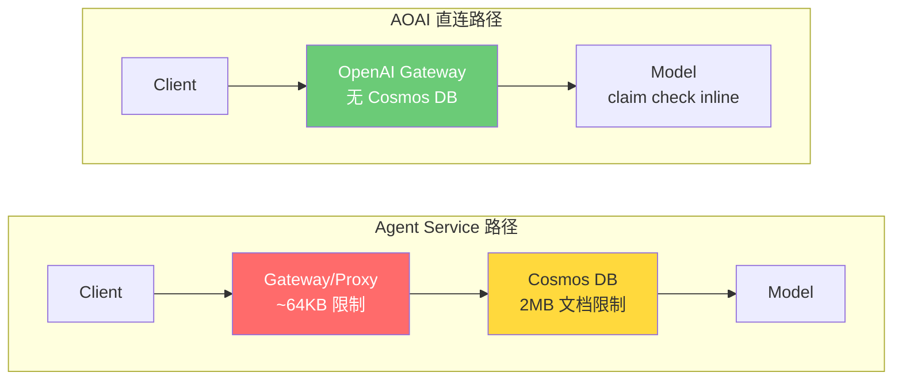

# Foundry Agent Service — Inline Base64 图片大小限制

## 问题

Azure AI Foundry Agent Service 项目端点（`*.services.ai.azure.com`）在 Responses API（`/responses`）中拒绝 inline base64 图片。相同图片在 AOAI 直连端点（`*.openai.azure.com`）正常工作。这是 2026 年 4 月初引入的 regression。

**PG 确认**: "limiting payloads to a certain size. It is a change on our end." ([GitHub #46305](https://github.com/Azure/azure-sdk-for-python/issues/46305))

## 关键发现

| 发现 | 详情 |
|:---|:---|
| 有效阈值 | ~64KB 请求体（二分搜索：最后通过 65,661B，首次失败 65,725B） |
| AOAI 直连 | 9/9 通过，最大 2.2MB 请求体 |
| `detail` 参数 | 无效果 — `detail` 控制模型端处理，不影响请求体大小 |
| **Workaround: file_id** | 通过 `/openai/v1/files` 上传，在 `/responses` 中引用 `file_id`。8/8 通过（72KB–7.9MB） |
| Workaround: resize | 客户端发送前缩放图片也可行 |
| 外部确认 | [GitHub #46305](https://github.com/Azure/azure-sdk-for-python/issues/46305) — 独立客户报告 |

## 架构



两条路径都经过 APIM（通过 `apim-request-id` header 确认）。Agent Service 额外有 `azureml-served-by-cluster` header。Cosmos DB 假设来自 PG GBB — Agent Service 项目端点使用 Cosmos DB 作为后端存储（2MB 文档限制），而 AOAI 直连走 "claim check pattern inline" 不经过 Cosmos DB。此假设未经 PG 官方 RCA 确认。

## 测试结果

### Agent Service vs AOAI 直连 — Inline Base64

| 图片 (KB) | Base64 (KB) | 请求体 (KB) | Agent Service | AOAI 直连 |
|---:|---:|---:|:---:|:---:|
| 3 | 4 | 4 | PASS | PASS |
| 22 | 29 | 29 | PASS | PASS |
| 109 | 145 | 146 | FAIL 400 | PASS |
| 196 | 261 | 261 | FAIL 400 | PASS |
| 319 | 426 | 426 | FAIL 400 | PASS |
| 566 | 755 | 755 | FAIL 400 | PASS |
| 963 | 1,285 | 1,285 | FAIL 400 | PASS |
| 1,042 | 1,389 | 1,390 | FAIL 400 | PASS |
| 1,995 | 2,659 | 2,660 | FAIL 400 | PASS |

Agent Service: 2/9 通过（仅 body <64KB）。AOAI 直连: 9/9 全通过。

错误: `400 invalid_payload: "The provided data does not match the expected schema"` — 网关层截断请求体，产生畸形 JSON。

### 精确阈值（二分搜索，Binary Search）

| 请求体大小 | 结果 |
|---:|:---|
| 65,533 B (64.0 KB) | PASS |
| 65,661 B (64.1 KB) | **PASS** ← 最后通过 |
| 65,725 B (64.2 KB) | **FAIL** ← 首次失败 |
| 66,557 B (65.0 KB) | FAIL |

### Body 大小 vs 图片数据

发送 500KB **纯文本**请求体（无图片）到 Agent Service：**通过**。限制专门针对 inline base64 图片数据，不是总请求体大小。

### file_id Workaround — 全尺寸矩阵

通过 `/openai/v1/files` 上传图片（purpose=`assistants`），然后在 `/responses` 中引用 `file_id`：

| 图片 | 大小 | Inline Base64 | file_id |
|:---|:---|:---|:---|
| 合成图 | 72 KB | FAIL 400 | **PASS** |
| 合成图 | 249 KB | FAIL 400 | **PASS** |
| 合成图 | 877 KB | FAIL 400 | **PASS** |
| 合成图 | 2.2 MB | FAIL 400 | **PASS** |
| 合成图 | 3.9 MB | FAIL 400 | **PASS** |
| 合成图 | 7.9 MB | — | **PASS** |
| 真实照片 1 | 238 KB | FAIL 400 | **PASS** |
| 真实照片 2 | 220 KB | FAIL 400 | **PASS** |

8/8 通过 file_id，在同一 Foundry 端点。对照组：inline base64 5/5 全部 FAIL。

## Workaround

### 方案 1: file_id 上传（推荐）

保持 Foundry 项目端点不变 — 不丢失 agentic 层、Bing 连接器或 failover 逻辑。

**Python (OpenAI SDK)**:

```python
from openai import OpenAI

client = OpenAI(
    base_url="https://RESOURCE.services.ai.azure.com/api/projects/PROJECT/openai/v1/",
    api_key="YOUR_KEY"
)

# Step 1: 上传
file = client.files.create(file=open("photo.jpg", "rb"), purpose="assistants")

# Step 2: 使用 file_id
response = client.responses.create(
    model="gpt-4o-mini",
    input=[{"role": "user", "content": [
        {"type": "input_text", "text": "Describe this image"},
        {"type": "input_image", "file_id": file.id}
    ]}]
)
print(response.output_text)
```

**Node.js / TypeScript**:

```javascript
const { AzureOpenAI } = require("openai");
const fs = require("fs");

const client = new AzureOpenAI({
  endpoint: "https://RESOURCE.services.ai.azure.com/api/projects/PROJECT",
  apiVersion: "2025-03-01-preview",
});

const file = await client.files.create({
  file: fs.createReadStream("photo.jpg"),
  purpose: "assistants"
});

const response = await client.responses.create({
  model: "gpt-4o-mini",
  input: [{ role: "user", content: [
    { type: "input_text", text: "Describe this image" },
    { type: "input_image", file_id: file.id }
  ]}]
});
console.log(response.output_text);
```

### 方案 2: 客户端 Resize

GPT-4o-mini `detail:auto` 最大处理 2048×2048 像素。发送前缩放可减少请求体大小，对模型理解质量零影响。

```python
from PIL import Image
from io import BytesIO
import base64

def resize_for_foundry(image_path, max_body_kb=60, max_width=1024, max_height=1024):
    with open(image_path, 'rb') as f:
        raw = f.read()
    max_image_bytes = int((max_body_kb - 1) * 1024 * 3 / 4)
    if len(raw) <= max_image_bytes:
        return base64.b64encode(raw).decode()
    img = Image.open(BytesIO(raw))
    img.thumbnail((max_width, max_height), Image.LANCZOS)
    quality = 80
    for _ in range(5):
        buf = BytesIO()
        img.convert('RGB').save(buf, format='JPEG', quality=quality)
        if len(buf.getvalue()) <= max_image_bytes:
            return base64.b64encode(buf.getvalue()).decode()
        quality -= 10
    return base64.b64encode(buf.getvalue()).decode()
```

**Bash 集成**:
```bash
# 之前（大图失败）:
base64 < "$IMAGE_FILE" | tr -d '\n' | jq ...

# 之后（始终可用）:
python workaround_resize_python.py "$IMAGE_FILE" | jq ...
```

## 为什么 file_id 有效

使用 `file_id` 时，图片二进制通过 `/openai/v1/files` 单独上传（multipart，不是 JSON）。`/responses` 请求体只包含 file_id 字符串引用（~50 bytes vs 数百 KB 的 base64）。图片数据永远不会进入触发大小限制的 JSON payload。

## 响应头指纹

| Header | Agent Service | AOAI 直连 |
|:---|:---:|:---:|
| `apim-request-id` | 有 | 有 |
| `azureml-served-by-cluster` | 有 | 无 |
| `openai-processing-ms` | 有（到达模型时） | 有 |

Agent Service 返回 400 时，`openai-processing-ms` 不存在 — 请求在到达模型后端之前被拒绝。

## 外部证据

- [GitHub #46305](https://github.com/Azure/azure-sdk-for-python/issues/46305) — 独立客户确认 regression: "This scenario worked for us about one week ago." 通过 Python / C# / raw REST 复现。
- [MS Q&A 5859143](https://learn.microsoft.com/en-us/answers/questions/5859143/) — 同一报告者在 Q&A 平台
- [Responses API 文档](https://learn.microsoft.com/en-us/azure/ai-foundry/openai/how-to/responses) — base64 data URL 是官方支持的输入方式，未记录大小限制

## 复现

### 前置条件

```bash
pip install Pillow openai
export FOUNDRY_KEY="<your-key>"
export AOAI_KEY="<your-key>"
```

### 运行测试

```bash
# Agent Service vs AOAI 直连对比
python scripts/test_agent_service_image.py

# 精确阈值二分搜索
python scripts/find_threshold.py

# 验证 resize workaround
python scripts/verify_resize_workaround.py
```

### 脚本清单

| 脚本 | 用途 |
|:---|:---|
| `test_agent_service_image.py` | Agent Service vs AOAI 直连对比 |
| `find_threshold.py` | 精确 body 大小阈值二分搜索 |
| `verify_resize_workaround.py` | Resize workaround 验证 |
| `workaround_resize_python.py` | Python 客户端 resize（bash pipe 兼容） |
| `workaround_resize_node.js` | Node.js 客户端 resize |

---

*Author: Xinyu Wei — Azure AI Global Black Belt*
