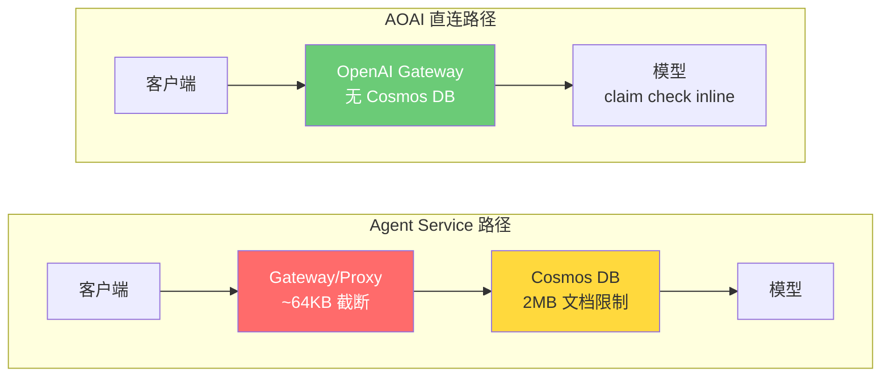

# Foundry Agent Service — 图片大小限制调查

> **客户**: Lenovo（联想）
> **问题**: 大图片（原始 >50KB）base64 编码后在 Agent Service project endpoint 失败；同样的图片在 AOAI 直连端点正常
> **根因**: Gateway 层在 ~64KB 处截断请求体，产生畸形 JSON → `invalid_payload` 错误
> **状态**: 等待 PG 修复（工程团队 reassessment 已安排）

## Executive Summary

| 指标 | Agent Service (`services.ai`) | AOAI 直连 (`openai.azure.com`) |
|:---|:---:|:---:|
| 3 KB 图片 (body 4 KB) | **通过** | **通过** |
| 22 KB 图片 (body 29 KB) | **通过** | **通过** |
| 50 KB 图片 (body 86 KB) | **失败 400** | **通过** |
| 500 KB 图片 (body 858 KB) | **失败 400** | **通过** |
| 1.6 MB 图片 (body 2.2 MB) | **失败 400** | **通过** |
| 精确阈值（二分查找） | **65,661 – 65,725 bytes** | 最大 2.2 MB 无限制 |
| `detail:low` Workaround | **无效**（不减少 body 大小） | 不适用 |
| 客户端 resize Workaround | **通过**（963KB → 37KB → body 50KB） | 不适用 |

**测试条件**: gpt-4o-mini, Responses API (`/openai/v1/responses`), API Key 认证, East US 2

### 推荐行动

1. **立即** — 客户端 resize 后再 base64 编码（已验证可用，代码已提供）
2. **短期** — PG 提升 gateway 限制（工程团队确认具体数字）
3. **中期** — 部署 APIM 透明代理，自动 claim check pattern（设计已就绪）

---

## 1. 背景

### 问题描述

Lenovo 使用 Foundry Agent Service 的 Responses API 发送手机相机拍摄的图片（base64 内联），用于图片分析。原始图片超过 ~50KB 时，在 Agent Service project endpoint（`*.services.ai.azure.com`）上返回 HTTP 400；同样的图片在 AOAI 直连端点（`*.openai.azure.com`）完全正常。

### 架构：为什么两个端点表现不同



**PG GBB 的关键原话**：
> "my guess for all this is that to support conversational style APIs the backing store is merged on project endpoint on cosmosdb docs (2MB limit) and bare responses runs claim check pattern inline"

**Cosmos DB 官方限制**（来源：[Azure 文档](https://learn.microsoft.com/en-us/azure/cosmos-db/concepts-limits#per-item-limits)）：
- 单个文档最大：**2 MB**（JSON UTF-8 长度）
- 单次请求最大：**2 MB**

但我们的测试显示**实际执行的限制是 ~64KB** — 远低于 Cosmos DB 的 2MB 上限。这说明 Gateway/Proxy 层有一个额外的截断机制。

### 时间线

| 日期 | 事件 | 来源 |
|:---|:---|:---|
| ~2026-04-01 | Agent Service 更新收紧了请求体限制 | PG 团队："regression for something released around 2 weeks ago" |
| 2026-04-15 | PG 给出初始 RCA（"UI routing issue"）— 后被否定 | 内部 |
| 2026-04-16 | PG GBB 纠正方向："与请求体大小相关" | 内部 |
| 2026-04-16 | 客户拒绝切 AOAI 直连（代码改动大）和 Image URL（法务不批） | 内部 |
| 2026-04-16 | PG GBB：AOAI 直连不支持 Bing Grounding；已有 ICM 工单 | 内部 |
| 2026-04-16 | PG GBB：新限制会 < 2MB；PG 曾尝试 commit 500KB | 内部 |
| 2026-04-16 | **PG GBB 揭示根因**：Cosmos DB backing store | 内部 |
| 2026-04-16 | **我们的测试**：实际阈值 ~64KB，不是 500KB | 二分查找测试 |
| 2026-04-17 | PG 工程师 reassessment 安排 | PG GBB |

### 客户约束

| 约束 | 原因 | 影响 |
|:---|:---|:---|
| 不能切 AOAI 直连端点 | 破坏 Lenovo 几乎全部代码 + 失去 Bing Grounding | 排除端点切换方案 |
| 不能使用 Image URL 引用 | Lenovo 法务不批（管理客户图片生命周期） | 排除 Blob Storage 方案 |
| 手机相机图片 | 目标平台是移动端；图片是全分辨率相机照片 | 图片通常 2-12 MB 原始，500KB-3MB JPEG |

---

## 2. 方法论

### 测试环境

| 参数 | 值 |
|:---|:---|
| Agent Service 端点 | `<your-resource>.services.ai.azure.com/api/projects/<your-project>` |
| AOAI 直连端点 | `<your-aoai-resource>.openai.azure.com` |
| 模型 | gpt-4o-mini (2024-07-18, GlobalStandard) |
| API | Responses API (`/openai/v1/responses`) |
| 认证 | API Key |
| 区域 | East US 2 |
| SDK | Python urllib（原始 HTTP，无 SDK 抽象） |

### 测试图片生成

使用 PIL 生成合成 JPEG 图片，采用确定性像素模式（`(x*7+y*3)%256` 等），确保跨运行压缩行为一致。图片不是随机噪声（压缩率差）也不是纯色（压缩率过高）。

### Base64 膨胀计算

| 原始图片 | Base64 编码后 | JSON 请求体 |
|:---|:---|:---|
| X KB | X × 1.33 KB | X × 1.33 + ~0.2 KB（JSON 开销） |

Base64 编码将数据扩大 4/3（33%）。JSON 负载包装器（模型名称、输入结构等）增加约 220 bytes 的开销。

### 测试矩阵

- **图片大小**: 3, 22, 50, 109, 196, 319, 500, 566, 800, 963, 1042, 1200, 1677, 1995 KB
- **Detail 参数**: `auto`, `low`
- **端点**: Agent Service, AOAI 直连

---

## 3. 结果

### 3.1 粗扫描：Agent Service vs AOAI 直连

| 图片 (KB) | Base64 (KB) | Body (KB) | Agent Service | AOAI 直连 |
|---:|---:|---:|:---:|:---:|
| 3 | 4 | 4 | 通过 | 通过 |
| 22 | 29 | 29 | 通过 | 通过 |
| 109 | 145 | 146 | 失败 400 | 通过 |
| 196 | 261 | 261 | 失败 400 | 通过 |
| 319 | 426 | 426 | 失败 400 | 通过 |
| 566 | 755 | 755 | 失败 400 | 通过 |
| 963 | 1,285 | 1,285 | 失败 400 | 通过 |
| 1,042 | 1,389 | 1,390 | 失败 400 | 通过 |
| 1,995 | 2,659 | 2,660 | 失败 400 | 通过 |

**Agent Service: 2/9 通过（仅 body < 64KB）。AOAI 直连: 9/9 全通过（最大 2.66 MB body）。**

### 3.2 精确阈值（二分查找）

Phase 1 — 从 50KB 到 70KB body 大小以 1KB 步长扫描：

| Body 大小 | 结果 |
|---:|:---|
| 51,197 B (50.0 KB) | 通过 |
| 52,221 B (51.0 KB) | 通过 |
| ... | 通过 |
| 64,509 B (63.0 KB) | 通过 |
| 65,533 B (64.0 KB) | 通过 |
| 66,557 B (65.0 KB) | 失败 |
| 67,581 B (66.0 KB) | 失败 |

Phase 2 — 精细二分查找：

| Body 大小 | 结果 |
|---:|:---|
| 65,661 B (64.1 KB) | **通过**（最后通过的） |
| 65,725 B (64.2 KB) | **失败**（首次失败的） |

**阈值: 65,661 – 65,725 bytes（~64 KB）**

这是一个经典的 buffer size 边界（64 KB = 65,536 bytes），暗示 Gateway/Proxy 层有一个固定大小的缓冲区截断请求体。

### 3.3 错误分析

所有失败请求的错误响应：
```json
{
  "error": {
    "code": "invalid_payload",
    "message": "The provided data does not match the expected schema",
    "param": "/",
    "type": "invalid_request_error"
  }
}
```

错误是 `invalid_payload`（schema 验证失败），**不是** `413 Payload Too Large`。这与 body 截断一致：gateway 接受了请求但截断了 body，产生畸形 JSON，下游 schema 验证失败。

### 3.4 detail 参数无效

| 图片 | detail:auto | detail:low | 解释 |
|:---|:---:|:---:|:---|
| 50 KB (body 86 KB) | 失败 400 | 失败 400 | `detail` 控制模型端处理，不影响请求体大小 |
| 200 KB (body 480 KB) | 失败 400 | 失败 400 | Base64 数据不因 detail 设置而改变 |
| 500 KB (body 858 KB) | 失败 400 | 失败 400 | 截断发生在请求到达模型之前 |

`detail` 参数指示模型在**收到图片后**进行 resize。由于 gateway 截断发生在**模型之前**，`detail:low` 无法减少请求体大小。

---

## 4. Workaround 方案

### 4.1 客户端 Resize（推荐 — 已验证可用）

**原理**: GPT-4o-mini `detail:auto` 最高处理 2048×2048 像素。手机相机图片（4000×3000+）包含的分辨率模型本来就会丢弃。编码前 resize 减少 body 大小，对模型理解零影响。

**验证**:

| 条件 | 图片大小 | Body 大小 | Agent Service | 模型响应 |
|:---|---:|---:|:---:|:---|
| 原始（不 resize） | 963 KB | 1,285 KB | 失败 400 | — |
| **resize 后**（1024×768, q=80） | **37 KB** | **50 KB** | **通过** | "The image features a repeating pattern of diagonal lines..." |

**Node.js 实现** (`scripts/workaround_resize_node.js`): 使用 `sharp` 库，约 50 行。Drop-in 函数，自动判断是否需要 resize。

**Python 实现** (`scripts/workaround_resize_python.py`): 使用 `Pillow`，与 Lenovo 现有 bash 工作流管道兼容。用 `python workaround_resize_python.py "$IMAGE_FILE"` 替换 `base64 < "$IMAGE_FILE"`。

**Lenovo 现有代码的集成方式**:
```bash
# 修改前（大图片失败）:
base64 < "$IMAGE_FILE" | tr -d '\n' | jq ...

# 修改后（始终正常）:
python workaround_resize_python.py "$IMAGE_FILE" | jq ...
```

### 4.2 APIM 透明代理（中期方案）

如果 PG 无法快速提升限制，部署 Azure API Management 实例作为透明代理：

```
Lenovo App → APIM → [Policy: 如果 body > 40KB，提取 base64 → 上传到 Blob
                      + 5 分钟 SAS → 替换为 URL → 转发更小的 body]
                   → Agent Service (services.ai.azure.com)
```

**满足 Lenovo 全部约束**:
- Lenovo 只改 hostname（最小代码改动）
- SAS token 5 分钟过期 + Blob 生命周期 1 小时自动清理（法务友好）
- 请求仍然发到 Agent Service（保留 Bing Grounding）

### 4.3 等待 PG 修复

工程团队已知悉并正在修复。如果限制提升到 2MB，结合客户端 resize 可覆盖大部分手机相机图片场景。

---

## 5. 复现测试

### 前置条件

- Python 3.10+
- Azure CLI (`az`) 已登录
- `Pillow` 库 (`pip install Pillow`)
- 有一个包含 gpt-4o-mini 部署的 Azure AI Foundry project

### 配置

```bash
git clone <this-repo>
cd Lenovo-Foundry-Image-Size-Limit

pip install Pillow

# 设置环境变量
export FOUNDRY_KEY=$(az cognitiveservices account keys list \
  --name <YOUR_AI_SERVICES_RESOURCE> \
  --resource-group <YOUR_RG> \
  --query key1 -o tsv)

export AOAI_KEY=$(az cognitiveservices account keys list \
  --name <YOUR_AOAI_RESOURCE> \
  --resource-group <YOUR_RG> \
  --query key1 -o tsv)

export AGENT_SVC_BASE="https://<YOUR_RESOURCE>.services.ai.azure.com/api/projects/<YOUR_PROJECT>"
export AOAI_BASE="https://<YOUR_AOAI_RESOURCE>.openai.azure.com"
```

### 运行测试

```bash
# 完整对比测试（Agent Service vs AOAI 直连，5 种图片大小 × 2 种 detail 模式）
python scripts/test_agent_service_image.py

# 精确阈值二分查找
python scripts/find_threshold.py

# 验证 resize workaround
python scripts/verify_resize_workaround.py
```

### 脚本清单

| 脚本 | 用途 | 关键参数 |
|:---|:---|:---|
| `test_agent_service_image.py` | Agent Service vs AOAI 完整对比 | 环境变量: `FOUNDRY_KEY`, `AOAI_KEY` |
| `find_threshold.py` | 二分查找精确 body size 阈值 | 环境变量: `FOUNDRY_KEY` |
| `verify_resize_workaround.py` | 验证 resize workaround 在 Agent Service 上通过 | 环境变量: `FOUNDRY_KEY` |
| `workaround_resize_node.js` | Node.js resize 辅助函数（Lenovo 集成用） | `npm install sharp` |
| `workaround_resize_python.py` | Python resize 辅助函数（bash 管道兼容） | `pip install Pillow` |

---

*作者: 魏新宇 (Xinyu Wei) — Azure AI Global Black Belt*
