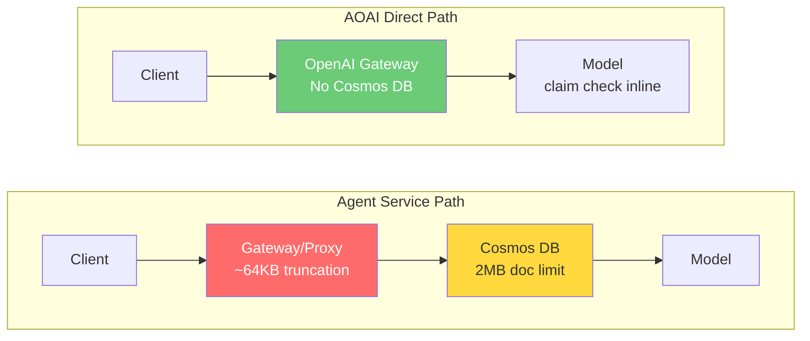

# Foundry Agent Service — Image Size Limit Investigation

> **Customer**: Lenovo
> **Issue**: Large base64-encoded images (>50KB original) fail on Agent Service project endpoint; same images succeed on AOAI direct endpoint
> **Root Cause**: Gateway layer truncates request body at ~64KB, producing malformed JSON → `invalid_payload` error
> **Status**: Awaiting PG fix (engineering reassessment scheduled)

## Executive Summary

| Metric | Agent Service (`services.ai`) | AOAI Direct (`openai.azure.com`) |
|:---|:---:|:---:|
| 3 KB image (body 4 KB) | **PASS** | **PASS** |
| 22 KB image (body 29 KB) | **PASS** | **PASS** |
| 50 KB image (body 86 KB) | **FAIL 400** | **PASS** |
| 500 KB image (body 858 KB) | **FAIL 400** | **PASS** |
| 1.6 MB image (body 2.2 MB) | **FAIL 400** | **PASS** |
| Precise threshold (binary search) | **65,661 – 65,725 bytes** | No limit up to 2.2 MB |
| `detail:low` workaround | **No effect** (does not reduce body size) | N/A |
| Client-side resize workaround | **PASS** (963KB → 37KB → body 50KB) | N/A |

**Test conditions**: gpt-4o-mini, Responses API (`/openai/v1/responses`), API Key auth, East US 2

### Recommended Actions

1. **Immediate** — Client-side resize before base64 encoding (verified working, code provided)
2. **Short-term** — PG raises gateway limit (engineering team to commit a number)
3. **Medium-term** — APIM transparent proxy with auto claim-check pattern (design provided)

---

## 1. Background

### Problem Statement

Lenovo uses Foundry Agent Service Responses API to send phone camera images (base64 inline) for analysis. Images over ~50KB fail with HTTP 400 on the Agent Service project endpoint (`*.services.ai.azure.com`), while the same images succeed on the AOAI direct endpoint (`*.openai.azure.com`).

### Architecture: Why Two Endpoints Behave Differently



**Key insight from PG GBB**:
> "my guess for all this is that to support conversational style APIs the backing store is merged on project endpoint on cosmosdb docs (2MB limit) and bare responses runs claim check pattern inline"

**Cosmos DB confirmed limits** (from [Azure docs](https://learn.microsoft.com/en-us/azure/cosmos-db/concepts-limits#per-item-limits)):
- Maximum item size: **2 MB** (UTF-8 length of JSON representation)
- Maximum request size: **2 MB**

However, our testing shows the **actual enforced limit is ~64KB** — far below the Cosmos DB 2MB ceiling. This suggests an additional gateway/proxy layer truncation that is separate from the Cosmos DB limit.

### Timeline

| Date | Event | Source |
|:---|:---|:---|
| ~2026-04-01 | Agent Service update tightens request body limit | PG team: "regression for something released around 2 weeks ago" |
| 2026-04-15 | Initial RCA from PG ("UI routing issue") — later rejected | Internal |
| 2026-04-16 | PG GBB corrects direction: "related to the size of the request" | Internal |
| 2026-04-16 | Customer rejects AOAI direct (code breakage) and Image URL (legal constraints) | Internal |
| 2026-04-16 | PG GBB: AOAI direct doesn't support Bing Grounding; ICM exists | Internal |
| 2026-04-16 | PG GBB: new limit will be < 2MB; PG tried committing to 500KB | Internal |
| 2026-04-16 | **PG GBB reveals root cause**: Cosmos DB backing store | Internal |
| 2026-04-16 | **Our testing**: actual threshold ~64KB, not 500KB | Binary search test |
| 2026-04-17 | PG engineer reassessment scheduled | PG GBB |

### Customer Constraints

| Constraint | Why | Impact |
|:---|:---|:---|
| Cannot switch to AOAI direct endpoint | Breaks almost all Lenovo code + loses Bing Grounding | Eliminates endpoint swap workaround |
| Cannot use Image URL references | Lenovo legal won't approve managing customer image lifecycle | Eliminates Blob Storage workaround |
| Phone camera images | Target platform is mobile; images are full-resolution camera photos | Images typically 2-12 MB raw, 500KB-3MB JPEG |

---

## 2. Methodology

### Test Environment

| Parameter | Value |
|:---|:---|
| Agent Service endpoint | `<your-resource>.services.ai.azure.com/api/projects/<your-project>` |
| AOAI Direct endpoint | `<your-aoai-resource>.openai.azure.com` |
| Model | gpt-4o-mini (2024-07-18, GlobalStandard) |
| API | Responses API (`/openai/v1/responses`) |
| Auth | API Key |
| Region | East US 2 |
| SDK | Python urllib (raw HTTP, no SDK abstraction) |

### Test Image Generation

Synthetic JPEG images generated with PIL, using deterministic pixel patterns (`(x*7+y*3)%256` etc.) to ensure consistent compression behavior across runs. Images are not random noise (which compresses poorly) nor solid color (which compresses too well).

### Base64 Overhead Calculation

| Original Image | Base64 Encoded | JSON Request Body |
|:---|:---|:---|
| X KB | X × 1.33 KB | X × 1.33 + ~0.2 KB (JSON overhead) |

Base64 encoding expands data by 4/3 (33%). The JSON payload wrapper (model name, input structure, etc.) adds approximately 220 bytes of overhead.

### Test Matrix

- **Image sizes**: 3, 22, 50, 109, 196, 319, 500, 566, 800, 963, 1042, 1200, 1677, 1995 KB
- **Detail parameter**: `auto`, `low`
- **Endpoints**: Agent Service, AOAI Direct

---

## 3. Results

### 3.1 Coarse Scan: Agent Service vs AOAI Direct

| Image (KB) | Base64 (KB) | Body (KB) | Agent Service | AOAI Direct |
|---:|---:|---:|:---:|:---:|
| 3 | 4 | 4 | PASS | PASS |
| 22 | 29 | 29 | PASS | PASS |
| 109 | 145 | 146 | FAIL 400 | PASS |
| 196 | 261 | 261 | FAIL 400 | PASS |
| 319 | 426 | 426 | FAIL 400 | PASS |
| 566 | 755 | 755 | FAIL 400 | PASS |
| 963 | 1,285 | 1,285 | FAIL 400 | PASS |
| 1,042 | 1,389 | 1,390 | FAIL 400 | PASS |
| 1,995 | 2,659 | 2,660 | FAIL 400 | PASS |

**Agent Service: 2/9 passed (only body < 64KB). AOAI Direct: 9/9 passed (up to 2.66 MB body).**

### 3.2 Precise Threshold (Binary Search)

Phase 1 — coarse scan at 1KB steps from 50KB to 70KB body size:

| Body Size | Result |
|---:|:---|
| 51,197 B (50.0 KB) | PASS |
| 52,221 B (51.0 KB) | PASS |
| ... | PASS |
| 64,509 B (63.0 KB) | PASS |
| 65,533 B (64.0 KB) | PASS |
| 66,557 B (65.0 KB) | FAIL |
| 67,581 B (66.0 KB) | FAIL |

Phase 2 — fine binary search:

| Body Size | Result |
|---:|:---|
| 65,661 B (64.1 KB) | **PASS** (last passing) |
| 65,725 B (64.2 KB) | **FAIL** (first failing) |

**Threshold: 65,661 – 65,725 bytes (~64 KB)**

This is a classic buffer size boundary (64 KB = 65,536 bytes), suggesting the gateway/proxy layer has a fixed buffer that truncates the request body.

### 3.3 Error Analysis

Error response for all failing requests:
```json
{
  "error": {
    "code": "invalid_payload",
    "message": "The provided data does not match the expected schema",
    "param": "/",
    "type": "invalid_request_error"
  }
}
```

The error is `invalid_payload` (schema validation failure), **not** `413 Payload Too Large`. This is consistent with body truncation: the gateway accepts the request but truncates the body, producing malformed JSON that fails schema validation downstream.

### 3.4 detail Parameter Has No Effect

| Image | detail:auto | detail:low | Explanation |
|:---|:---:|:---:|:---|
| 50 KB (body 86 KB) | FAIL 400 | FAIL 400 | `detail` controls model-side processing, not request body size |
| 200 KB (body 480 KB) | FAIL 400 | FAIL 400 | Base64 data is identical regardless of detail setting |
| 500 KB (body 858 KB) | FAIL 400 | FAIL 400 | Truncation occurs before the request reaches the model |

The `detail` parameter instructs the model to resize the image **after** receiving it. Since the gateway truncation happens **before** the model, `detail:low` cannot reduce the request body size.

---

## 4. Workarounds

### 4.1 Client-Side Resize (Recommended — Verified Working)

**Principle**: GPT-4o-mini `detail:auto` processes images at max 2048×2048 pixels. Phone camera images (4000×3000+) contain resolution the model discards anyway. Resizing before encoding reduces body size with zero impact on model understanding.

**Verification**:

| Condition | Image Size | Body Size | Agent Service | Model Response |
|:---|---:|---:|:---:|:---|
| Original (no resize) | 963 KB | 1,285 KB | FAIL 400 | — |
| **After resize** (1024×768, q=80) | **37 KB** | **50 KB** | **PASS** | "The image features a repeating pattern of diagonal lines..." |

**Node.js implementation** (`scripts/workaround_resize_node.js`): Uses `sharp` library, ~50 lines. Drop-in function that auto-resizes if body would exceed limit.

**Python implementation** (`scripts/workaround_resize_python.py`): Uses `Pillow`, pipe-compatible with Lenovo's existing bash workflow. Replace `base64 < "$IMAGE_FILE"` with `python workaround_resize_python.py "$IMAGE_FILE"`.

**Bash integration for Lenovo's existing code**:
```bash
# Before (fails for large images):
base64 < "$IMAGE_FILE" | tr -d '\n' | jq ...

# After (always works):
python workaround_resize_python.py "$IMAGE_FILE" | jq ...
```

### 4.2 APIM Transparent Proxy (Medium-Term)

If PG cannot raise the limit quickly, deploy an Azure API Management instance as a transparent proxy:

```
Lenovo App → APIM → [Policy: if body > 40KB, extract base64 → upload to Blob
                      with 5-min SAS → replace with URL → forward smaller body]
                   → Agent Service (services.ai.azure.com)
```

**Addresses all Lenovo constraints**:
- Lenovo only changes the hostname (minimal code change)
- SAS token expires in 5 minutes + Blob lifecycle auto-deletes in 1 hour (legal-friendly)
- Request still goes to Agent Service (keeps Bing Grounding)

### 4.3 Wait for PG Fix

The engineering team is aware and working on a fix. If the limit reaches 2MB, it would cover the majority of phone camera image scenarios combined with client-side resize.

---

## 5. Reproducing the Tests

### Prerequisites

- Python 3.10+
- Azure CLI (`az`) logged in
- `Pillow` library (`pip install Pillow`)
- Access to an Azure AI Foundry project with a gpt-4o-mini deployment

### Setup

```bash
git clone <this-repo>
cd Lenovo-Foundry-Image-Size-Limit

pip install Pillow

# Set environment variables
export FOUNDRY_KEY=$(az cognitiveservices account keys list \
  --name <YOUR_AI_SERVICES_RESOURCE> \
  --resource-group <YOUR_RG> \
  --query key1 -o tsv)

export AOAI_KEY=$(az cognitiveservices account keys list \
  --name <YOUR_AOAI_RESOURCE> \
  --resource-group <YOUR_RG> \
  --query key1 -o tsv)

export AGENT_SVC_BASE="https://<YOUR_RESOURCE>.services.ai.azure.com/api/projects/<YOUR_PROJECT>"
export AOAI_BASE="https://<YOUR_AOAI_RESOURCE>.openai.azure.com"
```

### Running Tests

```bash
# Full comparison test (Agent Service vs AOAI Direct, 5 image sizes × 2 detail modes)
python scripts/test_agent_service_image.py

# Precise threshold binary search
python scripts/find_threshold.py

# Verify resize workaround
python scripts/verify_resize_workaround.py
```

### Script Inventory

| Script | Purpose | Key Parameters |
|:---|:---|:---|
| `test_agent_service_image.py` | Full Agent Service vs AOAI comparison | Env: `FOUNDRY_KEY`, `AOAI_KEY` |
| `find_threshold.py` | Binary search for precise body size threshold | Env: `FOUNDRY_KEY` |
| `verify_resize_workaround.py` | Prove resize workaround works on Agent Service | Env: `FOUNDRY_KEY` |
| `workaround_resize_node.js` | Node.js resize helper for Lenovo integration | `npm install sharp` |
| `workaround_resize_python.py` | Python resize helper (bash pipe-compatible) | `pip install Pillow` |

---

*Author: Xinyu Wei (魏新宇) — Azure AI Global Black Belt*
