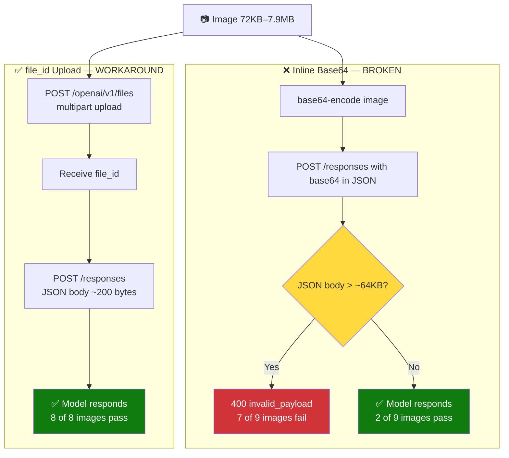

# Foundry Agent Service — Inline Base64 Image Size Limit

## Issue

Azure AI Foundry Agent Service project endpoint (`*.services.ai.azure.com`) rejects inline base64 images in the Responses API (`/responses`). The same images succeed on the AOAI direct endpoint (`*.openai.azure.com`). This is a known regression tracked in [GitHub #46305](https://github.com/Azure/azure-sdk-for-python/issues/46305).

## Key Findings

| Finding | Detail |
|:---|:---|
| Effective threshold | ~64KB request body (binary search: last PASS 65,661B, first FAIL 65,725B) |
| AOAI Direct | 9/9 passed up to 2.2MB request body |
| `detail` parameter | No effect — `detail` controls model-side processing, not body size |
| **Workaround: file_id** | Upload via `/openai/v1/files`, reference `file_id` in `/responses`. 8/8 passed (72KB–7.9MB) |
| Workaround: resize | Client-side resize before base64 encoding also works |
| External confirmation | [GitHub #46305](https://github.com/Azure/azure-sdk-for-python/issues/46305) — independent customer report |

## Architecture



The Foundry project endpoint and the AOAI direct endpoint share the same underlying model but have different request processing paths. The project endpoint has a payload size restriction (~64KB for inline base64 images) that does not exist on the direct endpoint.

Switching to the AOAI direct endpoint (`*.openai.azure.com`) is not always viable — applications using the project endpoint may depend on capabilities only available through it (e.g., Bing grounding, agentic tools, failover logic).

The `file_id` workaround uses the Responses API's own `/openai/v1/files` upload endpoint. This is a standard Responses API feature — not specific to any agent framework. The upload goes via `multipart/form-data` (not JSON), so it is not subject to the JSON body size limit.

## Test Results

### Agent Service vs AOAI Direct — Inline Base64

| Image (KB) | Base64 (KB) | Body (KB) | Agent Service | AOAI Direct |
|---:|---:|---:|:---:|:---:|
| 3 | 4 | 4 | PASS | PASS |
| 22 | 29 | 29 | PASS | PASS |
| 109 | 145 | 146 | FAIL 400 | PASS |
| 196 | 261 | 261 | FAIL 400 | PASS |
| 319 | 426 | 426 | FAIL 400 | PASS |
| 566 | 755 | 755 | FAIL 400 | PASS |
| 963 | 1,285 | 1,285 | FAIL 400 | PASS |
| 1,042 | 1,389 | 1,390 | FAIL 400 | PASS |
| 1,995 | 2,659 | 2,660 | FAIL 400 | PASS |

Agent Service: 2/9 passed (only body <64KB). AOAI Direct: 9/9 passed.

Error: `400 invalid_payload: "The provided data does not match the expected schema"` — body truncation at the gateway produces malformed JSON.

### Precise Threshold (Binary Search)

| Body Size | Result |
|---:|:---|
| 65,533 B (64.0 KB) | PASS |
| 65,661 B (64.1 KB) | **PASS** ← last passing |
| 65,725 B (64.2 KB) | **FAIL** ← first failing |
| 66,557 B (65.0 KB) | FAIL |

### Body Size vs Image Data

Sending a 500KB request body with **text only** (no image) to Agent Service: **PASS**. The limit applies specifically to inline base64 image data, not to total body size.

### file_id Workaround — Full Matrix

Upload image via `/openai/v1/files` (purpose=`assistants`), then reference `file_id` in `/responses`:

| Image | Size | Inline Base64 | file_id |
|:---|:---|:---|:---|
| Synthetic | 72 KB | FAIL 400 | **PASS** |
| Synthetic | 249 KB | FAIL 400 | **PASS** |
| Synthetic | 877 KB | FAIL 400 | **PASS** |
| Synthetic | 2.2 MB | FAIL 400 | **PASS** |
| Synthetic | 3.9 MB | FAIL 400 | **PASS** |
| Synthetic | 7.9 MB | — | **PASS** |
| Real photo 1 | 238 KB | FAIL 400 | **PASS** |
| Real photo 2 | 220 KB | FAIL 400 | **PASS** |

8/8 PASS via file_id on the same Foundry endpoint. Control group: 5/5 FAIL with inline base64.

## Workarounds

### Option 1: file_id Upload (Recommended)

Stays on the Foundry project endpoint — no loss of agentic layer, Bing connectors, or failover logic. Only the image input method changes; everything else in your code stays the same.

**Python**:

```python
from azure.ai.projects import AIProjectClient
from azure.identity import DefaultAzureCredential

project = AIProjectClient(
    endpoint="https://RESOURCE.services.ai.azure.com/api/projects/PROJECT",
    credential=DefaultAzureCredential(),
)
client = project.get_openai_client()

# Step 1: upload image (bypasses inline base64 size limit)
file = client.files.create(file=open("photo.jpg", "rb"), purpose="assistants")

# Step 2: use file_id in responses.create (replaces inline base64)
response = client.responses.create(
    model="gpt-4o-mini",
    input=[{"role": "user", "content": [
        {"type": "input_text", "text": "Describe this image"},
        {"type": "input_image", "file_id": file.id}
    ]}],
)
print(response.output_text)
```

**What changes**: Only the image input. Instead of `"image_url": "data:image/jpeg;base64,..."`, you call `files.create()` first, then pass `"file_id": file.id`. The rest of your code (`AIProjectClient`, `get_openai_client()`, `responses.create()`, tools, instructions) stays exactly the same.

**Node.js / TypeScript**:

```javascript
const { AzureOpenAI } = require("openai");
const fs = require("fs");

const client = new AzureOpenAI({
  endpoint: "https://RESOURCE.services.ai.azure.com/api/projects/PROJECT",
  apiVersion: "2025-03-01-preview",
});

const file = await client.files.create({
  file: fs.createReadStream("photo.jpg"),
  purpose: "assistants"
});

const response = await client.responses.create({
  model: "gpt-4o-mini",
  input: [{ role: "user", content: [
    { type: "input_text", text: "Describe this image" },
    { type: "input_image", file_id: file.id }
  ]}]
});
console.log(response.output_text);
```

### Option 2: Client-Side Resize

GPT-4o-mini `detail:auto` processes images at max 2048×2048. Resizing before encoding reduces body size with zero impact on model quality.

```python
from PIL import Image
from io import BytesIO
import base64

def resize_for_foundry(image_path, max_body_kb=60, max_width=1024, max_height=1024):
    with open(image_path, 'rb') as f:
        raw = f.read()
    max_image_bytes = int((max_body_kb - 1) * 1024 * 3 / 4)
    if len(raw) <= max_image_bytes:
        return base64.b64encode(raw).decode()
    img = Image.open(BytesIO(raw))
    img.thumbnail((max_width, max_height), Image.LANCZOS)
    quality = 80
    for _ in range(5):
        buf = BytesIO()
        img.convert('RGB').save(buf, format='JPEG', quality=quality)
        if len(buf.getvalue()) <= max_image_bytes:
            return base64.b64encode(buf.getvalue()).decode()
        quality -= 10
    return base64.b64encode(buf.getvalue()).decode()
```

**Bash integration**:
```bash
# Before (fails for large images):
base64 < "$IMAGE_FILE" | tr -d '\n' | jq ...

# After (always works):
python workaround_resize_python.py "$IMAGE_FILE" | jq ...
```

## Why file_id Works

The Responses API supports two ways to pass images:

1. **Inline base64** (`image_url: "data:image/jpeg;base64,..."`) — the image is embedded in the JSON request body. On the Foundry project endpoint, this body is subject to a ~64KB size limit.

2. **file_id reference** (`file_id: "assistant-xxx"`) — the image is first uploaded via `POST /openai/v1/files` using `multipart/form-data` (not JSON). The `/responses` request body then only contains the short file_id string (~50 bytes). The image binary never enters the JSON payload.

`/openai/v1/files` is a standard Responses API endpoint. It is not specific to any agent framework — it works the same way regardless of whether the application uses agentic features.

## External Evidence

- [GitHub #46305](https://github.com/Azure/azure-sdk-for-python/issues/46305) — independent customer confirmed regression: "This scenario worked for us about one week ago." Reproduced via Python / C# / raw REST.
- [MS Q&A 5859143](https://learn.microsoft.com/en-us/answers/questions/5859143/) — same reporter on Q&A platform
- [Responses API docs](https://learn.microsoft.com/en-us/azure/ai-foundry/openai/how-to/responses) — base64 data URL is officially supported, no size limit documented

## Reproducing

### Prerequisites

```bash
pip install azure-ai-projects azure-identity Pillow
export FOUNDRY_KEY="<your-key>"
export AOAI_KEY="<your-key>"
```

### Run Tests

```bash
# Agent Service vs AOAI Direct comparison
python scripts/test_agent_service_image.py

# Precise threshold binary search
python scripts/find_threshold.py

# Verify resize workaround
python scripts/verify_resize_workaround.py
```

### Scripts

| Script | Purpose |
|:---|:---|
| `test_agent_service_image.py` | Agent Service vs AOAI Direct comparison |
| `find_threshold.py` | Binary search for precise body size threshold |
| `verify_resize_workaround.py` | Resize workaround validation |
| `workaround_resize_python.py` | Python client-side resize (bash pipe-compatible) |
| `workaround_resize_node.js` | Node.js client-side resize |

---

*Author: Xinyu Wei — Azure AI Global Black Belt*
