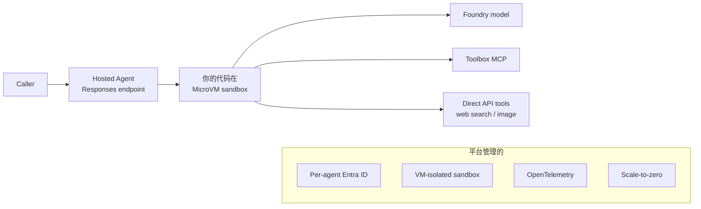
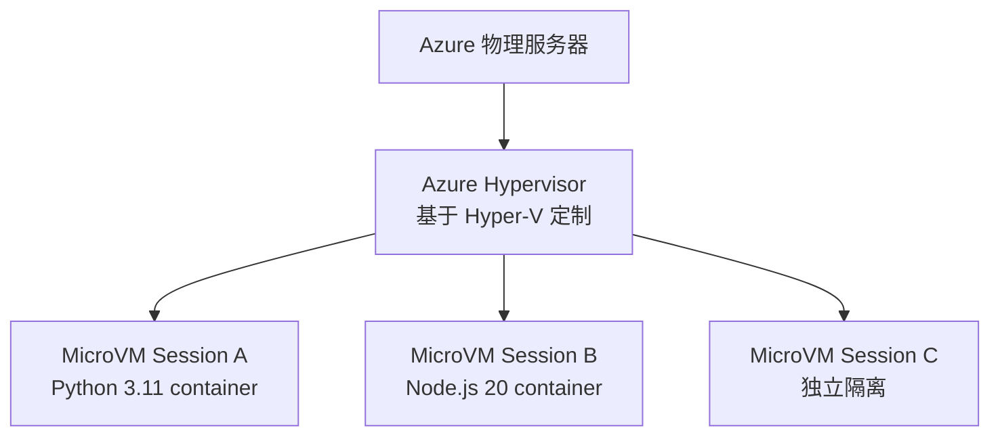
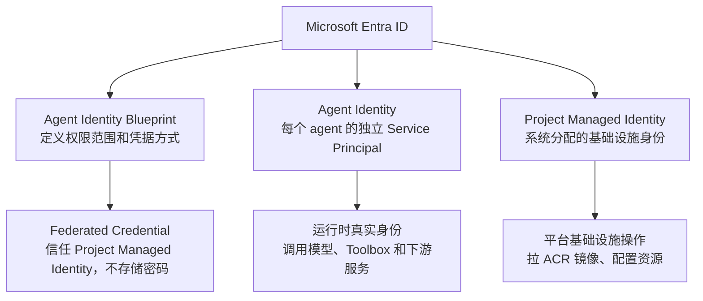
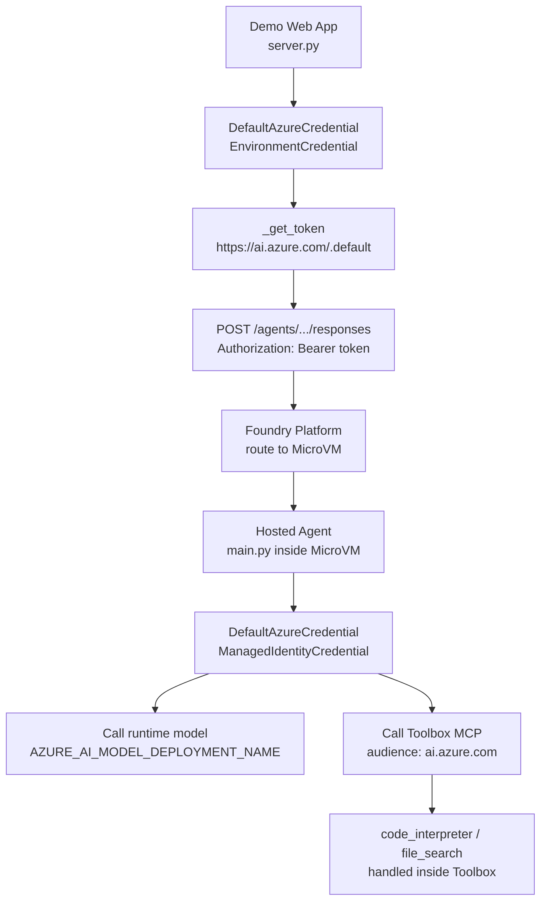
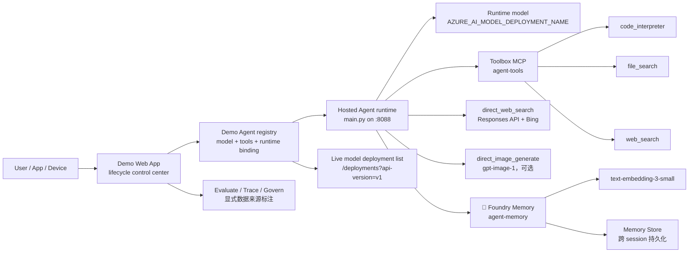
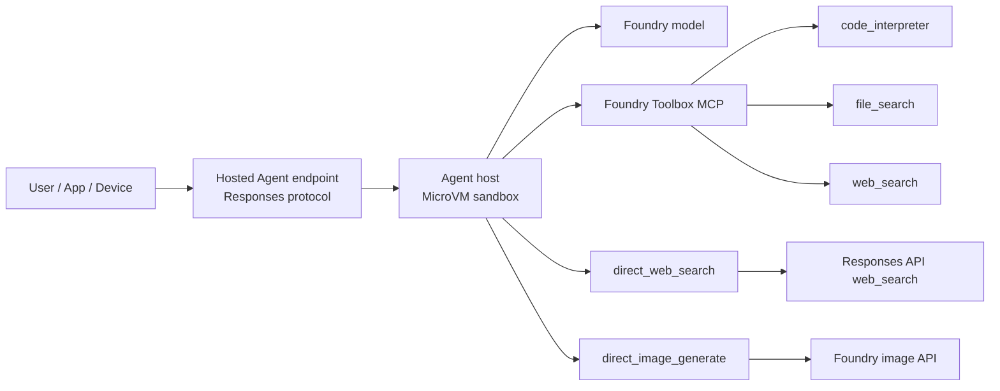
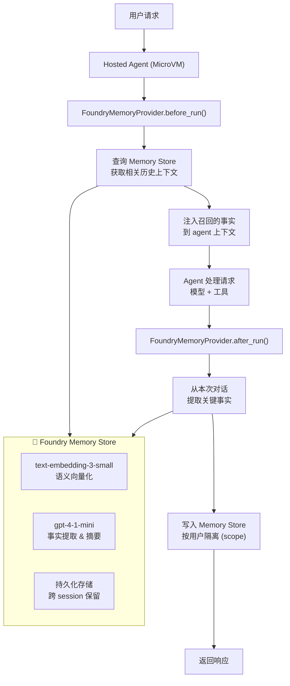

# Microsoft Foundry Hosted Agent + Toolbox + Memory + Skills Demo

**录屏演示（1.8x）**：下面是 Web App 的实际运行效果，包括创建 Toolbox、绑定 Hosted Agent、测试/评估/追踪请求，以及查看 Fleet governance 面板。

https://github.com/user-attachments/assets/5dea1cb5-d113-4f35-ad56-0fec0fa22ea8

## Running on Azure

这是一个端到端的 **Azure AI Foundry 企业级 Agent 平台 Demo**。它把 Microsoft Agent Framework、Foundry Hosted Agents、Foundry Toolbox、Foundry Memory、选定的 Microsoft `SKILL.md`、Evaluation、Tracing、Fleet governance、语音转写和图像生成放到同一个 lifecycle 控制台里。

> **Author**: 魏新宇 (Xinyu Wei) — Microsoft AI GBB Senior System Engineer

[English](README.md)

---

## 在线 Demo

🔗 **运行方式**: 填好 `.env.example` 中的变量后，可以本地运行，也可以部署到你自己的 host。


### 你将看到

| 功能 | 说明 |
|---|---|
| **6 步 lifecycle UI** | Build Toolbox → Deploy Agent → Test → Evaluate → Trace → Govern Fleet，对应 `app/static/index.html` |
| **真实 Foundry Hosted Agent** | `hosted-agent-toolbox-demo` v2 运行在 MicroVM 中（非模拟） |
| **3 个 Toolbox 工具 (MCP)** | code_interpreter（Python 沙箱）、file_search（向量搜索）、web_search（Bing） |
| **多工具执行 Trace** | 实时观看请求流：You → Hosted Agent runtime → 选中的 Agent model → Toolbox MCP → tool → answer |
| **Foundry AppTraces 日志** | Application Insights 真实云端 agent 日志 |
| **多团队 Hosted Agent 注册** | 注册 Python / Node.js / Java hosted agent，每个 Foundry Agent 绑定不同运行时 |
| **模型部署动态选择** | Agent 创建/编辑时通过 `/api/model-deployments` 从 Foundry project 读取 deployment；只有 live discovery 不可用时才回退到 env 默认值 |
| **语音转写** | 通过 `/api/voice` 上传音频，用配置好的 Whisper deployment 转成文字，再交给选中的 agent |
| **图像生成** | 启用 `direct_image_generate` 的 agent 可以通过 `/api/image` 调 Foundry image API |
| **请求历史** | `/api/history` 保存最近交互，让 Evaluation、Tracing 和 Fleet governance 都有可追溯证据 |
| **Evaluation / Trace / Fleet governance** | 可运行 quick evaluation、查看 recent traces，并在 fleet 视图里给出可执行的 readiness check 和数据来源 |
| **中英文 Demo** | file_search 检索架构文档（EN）+ 三体小说摘要（CN） |
| **创建自定义 Agent** | 选 model deployment + 工具 + hosted runtime → 秒级创建新 Foundry Agent |
| **加载 Microsoft Skills** | 给现有 agent 挂载 `microsoft/skills` 中选定的 `SKILL.md`，运行时把这些 guidance 注入请求上下文 |
| **Foundry Memory（preview）** | 跨 session 长期记忆 — agent 记住用户偏好和历史结论，跨会话累积上下文 |

> 来源说明：`microsoft/skills` repo 将 **"174 Skills"** 描述为 **"Domain-specific knowledge for Azure SDK and Foundry development"**，并明确提醒：**"Use skills selectively. Loading all skills causes context rot"**。来源：[microsoft/skills README](https://github.com/microsoft/skills/blob/main/README.md)，查验日期：2026-05-12。

### 交付资产

上方架构图已包含在本 repo 中，README 不依赖外部截图即可正常渲染。

### Lifecycle 控制台与 API 覆盖

Web App 现在不是简单的三栏 playground，而是一个 lifecycle 控制台。每个面板都有明确的后端 API，README、UI 和 backend 使用同一套边界。

| 步骤 | UI 区块 | Backend API | 数据来源 / 边界 |
| --- | --- | --- | --- |
| 1 | Build Toolbox | `/api/toolboxes`, `/api/toolbox-info` | 本地 toolbox registry；配置可用时同时读取 live MCP `tools/list`。 |
| 2 | Deploy Agent | `/api/agents`, `/api/hosted-agents`, `/api/model-deployments` | Demo Agent registry 拥有 model/tools/instructions/runtime binding；Hosted runtime registry 不保存 model metadata。 |
| 3 | Test | `/api/chat`, `/api/voice`, `/api/image`, `/api/history` | Live Hosted Agent endpoint + 持久化 demo request history。 |
| 4 | Evaluate | `/api/evaluation/run` | 本地 deterministic quick evaluation；开启配置后可额外提交 Foundry Evaluation API。 |
| 5 | Trace | `/api/tracing/recent`, `/api/agent-logs` | 配置 `CLOUD_LOG_WORKSPACE_ID` 后读 Application Insights；否则展示本地请求历史上下文。 |
| 6 | Govern Fleet | `/api/control-plane` | 本地 demo registry + recent history；用 `model_source` 和 data-source labels 明确说明不是完整 Foundry inventory API。 |

### 本 Demo 覆盖什么，哪些需要额外配置

| Demo 路径中可直接展示 | 需要先配置环境 |
| --- | --- |
| 6 步 lifecycle 控制台：Toolbox、Agent、Test、Evaluation、Trace、Fleet governance。 | Azure AI Search 需要 `AZURE_AI_SEARCH_CONNECTION_ID` 和 `AZURE_AI_SEARCH_INDEX`。 |
| Toolbox 承载的 `code_interpreter`；配好 vector store 后可展示受控的 `file_search`。 | File Search 需要 `VECTOR_STORE_ID` 或 `FILE_SEARCH_VECTOR_STORE_IDS`。 |
| 通过 `direct_web_search` 走 Responses API 的网页 grounding。 | Custom MCP 需要 `MCP_SERVER_URL` 和 `MCP_PROJECT_CONNECTION_ID`。 |
| `/api/voice` 语音转写和 `/api/image` 图像生成。 | Application Insights traces 需要 `CLOUD_LOG_WORKSPACE_ID`。 |
| Microsoft Skills 加载、本地请求历史、quick evaluation、fleet readiness check。 | Foundry Memory 需要 `MEMORY_STORE_NAME` 和已创建的 Memory Store。 |

这个边界是刻意设计的：UI 让客户看到企业平台的完整能力面，但创建路径只提交当前环境真正支持的能力。

Model deployment discovery 使用 Foundry project endpoint：`GET {AZURE_AI_PROJECT_ENDPOINT}/deployments?api-version=v1`，token audience 是 `https://ai.azure.com/.default`。如果 live discovery 失败，UI 会回退到 `DEFAULT_AGENT_MODEL`，保证 create/edit modal 仍可用。

---

## 1. Foundry Toolbox 是什么、有什么优势

**Toolbox** 是 Microsoft Foundry project 中托管的、版本化的工具包。你定义包含哪些 tool、统一配置 auth，然后把整个包暴露为 **一个 MCP 兼容 endpoint**，任何 agent 都能消费。

### Toolbox 优势

| 优势 | 含义 |
| --- | --- |
| **所有 tool 一个 endpoint** | 一个 MCP URL = 全部 tool。Agent 接一次，不用逐 tool 接线。 |
| **集中 auth 和治理** | Credential、审批门（`require_approval`）、RBAC 都在 toolbox 里，不在 agent 代码里。 |
| **版本化且不可变** | 每个 `ToolboxVersionObject` 是快照。一步 promote `default_version`，一步 rollback。 |
| **框架无关消费** | 任何 MCP 兼容 client 都能用：Microsoft Agent Framework、LangGraph、Semantic Kernel、GitHub Copilot SDK、Claude Code。 |
| **一个 catalog 容纳多种 tool** | 内置 tool（Code Interpreter、Web Search、Azure AI Search、File Search）+ 自定义 MCP server + OpenAPI + A2A，全在一个包里。 |
| **Tool 生命周期和 agent 生命周期解耦** | 加减 tool 不需要重新部署 agent 容器。 |

### UI 中的 Toolbox catalog 覆盖范围

Demo 第一步故意比默认 agent 使用的 3 个 tool 更宽。UI 会展示完整 Toolbox 设计空间，同时阻止用户提交缺少 connection/config 的 tool。

| Catalog option | 本 repo 中的创建状态 | 必需配置 |
| --- | --- | --- |
| `code_interpreter` | Ready | 无 |
| `file_search` | 配好 vector store 后可用 | `VECTOR_STORE_ID` 或 `FILE_SEARCH_VECTOR_STORE_IDS` |
| `web_search` | Ready | 生产前需要确认 Grounding with Bing 条款 |
| `azure_ai_search` | 配好 project connection 和 index 后可用 | `AZURE_AI_SEARCH_CONNECTION_ID` + `AZURE_AI_SEARCH_INDEX` |
| `custom_mcp` | 配好 remote MCP connection 后可用 | `MCP_SERVER_URL` + `MCP_PROJECT_CONNECTION_ID` |
| `openapi` | 作为 lifecycle option 展示 | OpenAPI spec + auth policy |
| `agent_to_agent` | 作为 lifecycle option 展示 | Target agent URL + project connection |

这个设计的重点是：已配置的 tool 可以直接点击创建；未配置的 tool 仍在 catalog 中可见，让客户看到平台能力边界；modal 会提前提示缺少哪些 env var，后端也会再次校验，避免绕过 UI 后直接打到 Foundry API error。

### Toolbox 全生命周期（4 个 pillar）

<div align="center">

<br/><em>来源：<a href="https://devblogs.microsoft.com/foundry/introducing-toolboxes-in-foundry/">Introducing Toolboxes in Foundry</a>（Microsoft Foundry Blog）</em>
</div>

> 来源：[Curate intent-based toolbox in Foundry](https://learn.microsoft.com/en-us/azure/foundry/agents/how-to/tools/toolbox) · [Introducing Toolboxes in Foundry (blog)](https://devblogs.microsoft.com/foundry/introducing-toolboxes-in-foundry/)

### Toolbox 解决的问题（before vs after）

<div align="center">

<br/><em>来源：<a href="https://devblogs.microsoft.com/foundry/introducing-toolboxes-in-foundry/">Introducing Toolboxes in Foundry</a>（Microsoft Foundry Blog）</em>
</div>

---

## 2. Foundry Hosted Agent 是什么、有什么优势

**Hosted Agent** 是你自己的 agent 代码跑在 Foundry Agent Service 上。你把代码打成 container image，但平台跑它用的是 **MicroVM sandbox**（不是传统容器）—— 每个 session 有自己的 VM 级隔离环境，`$HOME` 和 `/files` 持久化。平台提供计算、身份、网络、可观测性和稳定 endpoint。你写 agent 逻辑，平台管其他一切。

### Hosted Agent 优势

| 优势 | 含义 |
| --- | --- |
| **Per-agent identity** | 每个 agent 部署时自动获得一个 Microsoft Entra ID——调 model、tool、下游服务都是 identity-scoped。 |
| **稳定 HTTP endpoint** | `{project}/agents/{name}/endpoint/protocols/openai/v1/responses`——caller 指这里，计算在后面漂移。 |
| **Per-session VM-isolated MicroVM** | `$HOME` 和 `/files` 跨 turn 和 idle 持久化；session resume 带完整状态。不是传统容器 —— kernel 级隔离。 |
| **Scale-to-zero** | 15 分钟 idle → 回收。下一个请求 → 带状态 resume。只为 active session 付费。 |
| **任何框架** | Agent Framework、LangGraph、Semantic Kernel，或裸 Python/C#——容器是你的。 |
| **内置可观测性** | OpenTelemetry trace 自动注入到 Application Insights。 |
| **版本固化 + 流量拆分** | 不可变 agent version；canary / blue-green 带权重 rollout。 |

> 来源：[What are hosted agents?](https://learn.microsoft.com/en-us/azure/foundry/agents/concepts/hosted-agents) · [Hosted Agents blog](https://devblogs.microsoft.com/foundry/introducing-the-new-hosted-agents-in-foundry-agent-service-secure-scalable-compute-built-for-agents/)

### Hosted Agent 架构图



### MicroVM 深度解读——你的容器镜像如何运行

很多人第一个问题是：**MicroVM 和传统容器有什么区别？我的 Dockerfile 要改吗？**

答案是：**Dockerfile 完全不变**。`FROM python:3.11-slim` → `pip install` → `CMD python main.py`，跟写普通容器一模一样。区别在于 **Foundry 拿到你的 image 后不是用 Docker/containerd 跑，而是放进一个轻量级虚拟机（MicroVM）里执行**。

#### 传统容器 vs Foundry MicroVM

| 对比项 | 传统容器（ACA/AKS/Docker） | Foundry MicroVM |
|---|---|---|
| **你提供的** | Docker image | **同样是 Docker image** |
| **构建方式** | `docker build` → push ACR | Foundry deployment tooling / SDK / REST → ACR image → **Foundry 拉到 MicroVM** |
| **隔离层** | Linux namespace + cgroup（共享宿主机内核） | **独立 VM 内核**（类似 AWS Firecracker / Kata Containers） |
| **安全边界** | 进程级（理论上存在容器逃逸风险） | **内核级**（每个 session 一个独立 VM，无共享内核） |
| **状态** | 容器重启 = 数据丢失 | `$HOME` + `/files` **跨 turn 持久化**，idle 15min 后 suspend 而非销毁 |
| **Idle 后行为** | 容器被杀或一直占资源 | **Suspend**（冻结），下次请求 **resume with full state** |
| **成本** | 一直跑一直付 | 只为 active session 付费（scale-to-zero） |

#### 为什么用 MicroVM 而不是普通容器？

这是 Foundry 做出的关键架构决策。核心原因是**多租户安全**：

1. **容器共享内核** → 如果两个客户的 agent 跑在同一台宿主机上，理论上存在容器逃逸攻击面。Azure Container Apps / AKS 通过 pod sandbox 缓解，但不完美
2. **MicroVM 独立内核** → 每个 session 有自己的完整 Linux 内核，即使 agent 代码有漏洞，也无法影响其他 session。这是 AWS Lambda（Firecracker）同款隔离思路
3. **有状态 + 安全** → 传统容器做有状态服务很别扭（volume mount + restart 会丢），MicroVM 的 suspend/resume 天然支持"暂停-恢复"模式

#### 实际体验

从开发者角度，你感知不到 MicroVM 的存在：

| 开发时 | 部署后 |
| --- | --- |
| 写 Dockerfile | ACR 中的同一个 image |
| 写 `main.py` | Foundry 拉取 image 到 MicroVM |
| 本地 `docker run` 测试 | 每个请求在独立 MicroVM 中执行 |
| 服务监听 `:8088` | 平台分配稳定 endpoint URL |

唯一的区别是：本地 `docker run` → 传统容器；Foundry 部署后 → MicroVM。**你的代码一行不改。**

#### 在本 Demo 中的验证

我们的 Application Insights 日志中能看到真实的 MicroVM 行为：

```
[INFO] AgentServerHost starting on 0.0.0.0:8088 (async)     ← 容器在 MicroVM 中启动
[INFO] Platform environment: is_hosted=True                   ← 平台确认是 hosted 模式
[INFO] ManagedIdentityCredential.get_token_info succeeded    ← MicroVM 自带 Managed Identity
[INFO] Function code_interpreter succeeded.                   ← Toolbox MCP 调用在 MicroVM 内完成
[INFO] POST /responses 200 7719ms                             ← 请求在 MicroVM 中处理完毕
[INFO] AgentServerHost shutting down (graceful timeout=30s)   ← idle 后 MicroVM 优雅关闭
```

> 来源：[What are hosted agents?](https://learn.microsoft.com/en-us/azure/foundry/agents/concepts/hosted-agents) — *"Each session gets its own VM-isolated environment"*、*"Not a traditional container — kernel-level isolation."*

#### MicroVM 底层隔离机制

一个常见问题是：**MicroVM 到底跑在什么上面？是 Docker？是 Kubernetes？还是直接跑在 Azure Hypervisor 上？**

微软官方给出了明确定性但不公开具体实现：

**官方 Blog 原文**（Jeff Hollan 团队，2026-04-22）：
> *"Production-proven **hypervisor isolation**, at cloud scale. Not process isolation. Not a code execution-only sandbox."*
>
> — [Introducing the new hosted agents in Foundry Agent Service](https://devblogs.microsoft.com/foundry/introducing-the-new-hosted-agents-in-foundry-agent-service-secure-scalable-compute-built-for-agents/)

**官方 Learn 文档**：
> *"Hosted agents run in **per-session VM-isolated sandboxes**. Each session gets a dedicated sandbox with a persistent filesystem."*
>
> — [What are hosted agents?](https://learn.microsoft.com/en-us/azure/foundry/agents/concepts/hosted-agents)

关键词是 **hypervisor isolation**——这明确排除了容器级隔离（namespace + cgroup），确认是虚拟机级隔离。

**物理架构推断**（推测，微软未公开具体 hypervisor 实现）：



每个 MicroVM 有**独立的 Linux 内核**，即使 agent 代码存在漏洞（如代码注入、文件系统遍历），也无法逃逸到其他 session——因为根本不共享内核。

**为什么这很重要**：

| 隔离级别 | 代表产品 | Agent 场景风险 |
|---|---|---|
| **进程隔离** | 普通 Docker 容器 | Agent 执行任意代码 + 共享内核 = 高风险 |
| **Pod Sandbox** | AKS + Kata / gVisor | 好一些，但配置复杂 |
| **Hypervisor 隔离** | **Foundry MicroVM**、ACI Hyper-V 模式 | 每 session 独立 VM 内核，零共享 = 生产安全 |

这就是 Blog 里那句话的重量——*"The hard part is no longer writing the agent. The hard part is making it enterprise-ready at scale — with real isolation, real identity, and real governance."*

> ⚠️ 注意：微软没有公开说具体使用的是 Hyper-V、Firecracker 还是自研 MicroVM runtime。上图中的 "Azure Hypervisor" 是基于 Azure 基础设施已知事实的合理推断，不是官方声明。

#### Agent 身份与认证体系

隔离解决了"别人的代码不会影响我"，但还有一个问题：**agent 怎么证明自己是谁？怎么拿到调用模型和工具的权限？**

Foundry 为此设计了一套**三层身份架构**，基于 Microsoft Entra ID：



**关键设计**：Agent Identity 是一种**全新的 Entra ID 身份类型**——不是用户、不是传统 Service Principal、不是 Managed Identity，而是专门为 AI Agent 设计的身份。它让管理员能区分"人做的操作"和"agent 做的操作"。

#### 运行时 Token 交换（4 步，全自动）

当 agent 调用工具时，Foundry 自动完成 OAuth 2.0 token 交换——**开发者不需要写任何 token 代码**：

```
1. Blueprint 认证     Agent Service → Entra ID: 提交 Blueprint 的 federated credential
2. Agent Token 颁发   Entra ID → Agent Service: 颁发 Agent Identity Token
3. Scoped Token       Agent Service → Entra ID: 请求目标服务的 access token
                      （audience 如 https://storage.azure.com）
4. 调用工具           Agent Service → MCP Server: Bearer {scoped token}
                      下游服务验证 token + 检查 RBAC → 允许/拒绝
```

常见的 audience 值：

| 下游服务 | Audience |
|---|---|
| Foundry 模型 / Toolbox | `https://ai.azure.com` |
| Azure Storage | `https://storage.azure.com` |
| Microsoft Graph | `https://graph.microsoft.com` |
| Azure Key Vault | `https://vault.azure.net` |

> ⚠️ audience 必须精确匹配下游服务的 resource identifier，不是 MCP server 的 URL。错了就 403。我们实测过 `https://cognitiveservices.azure.com` 调 Hosted Agent 返回 403，换成 `https://ai.azure.com` 才通。

#### 两种认证模式

| 模式 | OAuth 流程 | 适用场景 |
|---|---|---|
| **Unattended（无人值守）** | client_credentials | 后台任务、API 集成、本 Demo |
| **Attended（有人值守 / OBO）** | on-behalf-of | Teams/M365 场景，agent 以用户身份调下游（如用户的 OneDrive） |

**OBO 模式**特别适合终端用户场景（如联想 AIPC）：用户先登录 → 用户 token 传给 Agent → Agent 用 OBO 流程以用户身份 + agent 身份组合访问下游服务。这意味着 agent 只能访问该用户有权限的资源。

#### 本 Demo 的实际认证路径



App Insights 日志中的证据：
```
[INFO] DefaultAzureCredential acquired a token from ManagedIdentityCredential
```
→ 确认 MicroVM 内用的是平台注入的 Agent Identity，不是我们手动配的凭据。

> 来源：[Agent identity concepts in Microsoft Foundry](https://learn.microsoft.com/en-us/azure/foundry/agents/concepts/agent-identity) — Runtime token exchange / Authentication capabilities / Federated identity credentials

### Hosted Agent 定义与多语言支持

每个 Hosted Agent 由一个 `agent.yaml` 定义，描述运行环境、资源配额、Toolbox 绑定和环境变量：

```yaml
kind: hosted
name: hosted-agent-toolbox-demo
protocols:
  - protocol: responses
    version: 1.0.0
resources:
  cpu: "0.25"        # 每个 MicroVM 的 CPU 配额
  memory: 0.5Gi      # 每个 MicroVM 的内存配额
environment_variables:
  - name: AZURE_AI_MODEL_DEPLOYMENT_NAME
    value: gpt-4-1-mini
  - name: TOOLBOX_NAME
    value: agent-tools
  - name: ENABLE_DIRECT_WEB_SEARCH
    value: "true"
```

这里的 `AZURE_AI_MODEL_DEPLOYMENT_NAME` 是 `main.py` 使用的 runtime 配置。本 Demo Web App 的控制面把 model 选择放在 **Foundry Agent** 记录上，而不是放在 Hosted Agent runtime registry 上。

部署链路：构建 Docker image → 推到 ACR → 通过 Foundry Toolkit、SDK、REST API 或现有 `azd` template 注册为 Foundry Hosted Agent → 获得稳定 endpoint。

> 来源：[What are hosted agents?](https://learn.microsoft.com/en-us/azure/foundry/agents/concepts/hosted-agents)

### 多语言 Hosted Agent — Python / Java / Node.js / 任意语言

Hosted Agent 使用 `language: docker`，**不限制编程语言**。只要 Dockerfile 能构建出一个在 `:8088` 响应 Responses Protocol 的 container，就可以部署：

| 语言 | Framework | Dockerfile 关键行 | 适用场景 |
|---|---|---|---|
| **Python 3.11+** | Microsoft Agent Framework (`azure-ai-agents`) | `FROM python:3.11-slim` | 通用 agent，本 demo 使用 |
| **Java 21** | Semantic Kernel for Java | `FROM eclipse-temurin:21-jre` | 企业级工作流，SAP/ERP 集成 |
| **TypeScript / Node 20** | LangGraph.js / Semantic Kernel JS | `FROM node:20-slim` | 实时数据处理、前端团队 |
| **C# / .NET 8** | Semantic Kernel for .NET | `FROM mcr.microsoft.com/dotnet/aspnet:8.0` | .NET 技术栈企业 |
| **Go / Rust / 任意** | 自定义 HTTP server | 按需选择 base image | 高性能/边缘场景 |

> 来源：Hosted Agent 文档 "Bring your own container image" — `language: docker` 表示 Foundry 不关心语言，只关心 container 规范。

### 多团队多 Hosted Agent 场景

生产环境中，不同团队可以部署各自的 Hosted Agent，各有独立的：

| 对比项 | Commerce 团队 | Analytics 团队 |
| --- | --- | --- |
| Hosted Agent | `order-processor` | `data-analyst` |
| Language | Python 3.12 | TypeScript / Node 20 |
| Dockerfile | Python + pandas + SAP connector | Node + chart.js |
| Toolbox | code_interpreter + SAP tool | file_search + SQL tool |
| Resources | CPU 0.5 / 1 GiB | CPU 0.25 / 0.5 GiB |
| Runtime isolation | MicroVM，`$HOME` 持久 | MicroVM，`$HOME` 持久 |

每个 Hosted Agent 有独立的：
- **Container image** → 自定义运行时
- **Toolbox 绑定** → 不同工具集
- **Application Insights** → 日志/监控天然隔离
- **Endpoint URL** → 稳定 HTTP 端点
- **Version 管理** → 灰度发布、回滚

本 Demo 的 Web App 支持注册多个 Hosted Agent（`+ Register hosted runtime`），创建 demo Foundry Agent record 时选择绑定哪个 Hosted Agent runtime，实现多团队共用平台但各自隔离。Model deployment 存在 Agent record 上，不存在 Hosted runtime record 上。实际 Hosted Agent endpoint 执行时仍使用该 runtime endpoint 自己配置的 runtime model；demo registry 中的 Agent model 用于控制面来源标注、evaluation metadata，以及未来映射到真实 Foundry Agent definition。

---

## 3. 我们在这个 Demo 里构建了什么

### Toolbox 内容（本实验）

我们创建了一个名为 `agent-tools` 的 Foundry Toolbox，包含以下 tool：

| Tool | 类型 | 在本 demo 中做什么 | Runtime 状态 |
| --- | --- | --- | --- |
| `code_interpreter` | 内置（Toolbox） | 在托管沙箱中执行 Python——agent 发代码，沙箱返回结果。用于计算任务。 | ✅ 端到端已验证 |
| `web_search` | 内置（Toolbox） | 通过 Bing grounding 搜索公开网页。MCP `tools/list` 正确返回。 | ⚠️ List OK；runtime invoke 在部分 project 中返回 tool error（preview）。Agent 自动 fallback 到 `direct_web_search`。 |
| `file_search` | 内置（Toolbox） | 在 vector store 中搜索已上传文档的相关段落。我们上传了 `docs/why-this-architecture.md` 作为测试内容。 | ✅ 端到端已验证 — agent 准确引用了上传文档中 MCP vs function-calling 的原文。 |

我们同时展示了 **托管 Toolbox 路径**（code_interpreter 和 file_search 端到端可通）和 **Responses API fallback**（direct_web_search 用于网页 grounding）。见 `scripts/create_toolbox.py --with-web-search --with-code-interpreter --with-file-search` 了解三个 tool 的注册方式。

### Hosted Agent 内容（本实验）

我们的 hosted agent 容器（`main.py`）包含：

| 组件 | 包 / 模块 | 用途 |
| --- | --- | --- |
| Agent Framework 核心 | `agent-framework==1.3.0` | Agent runtime：规划、tool 分发、消息组装。 |
| Foundry chat client | `agent-framework-foundry==1.3.0` | `FoundryChatClient` 连接 Foundry model deployment。 |
| Hosted runtime | `agent-framework-foundry-hosting==1.0.0a260507` | `ResponsesHostServer` 暴露 Responses protocol 在 `0.0.0.0:8088`。 |
| MCP tool 桥接 | `MCPStreamableHTTPTool`（agent-framework 内） | 连接 Toolbox MCP endpoint，带 auth + preview header。 |
| `direct_web_search` | `main.py` 中的 `@tool` 函数 | 调 Foundry Responses API `tools:[{"type":"web_search"}]` 获取 grounded 公开网页结果。 |
| `direct_image_generate` | `main.py` 中的 `@tool` 函数（可选） | 调 Foundry `/openai/v1/images/generations` 生成图片。 |
| Runtime model deployment | `AZURE_AI_MODEL_DEPLOYMENT_NAME`（当前环境是 `gpt-4-1-mini`） | `main.py` 在 Hosted Agent endpoint 内使用的模型。Web App 的 Agent-level model selection 单独保存在 demo registry 中。 |
| Azure credential | `azure-identity==1.25.3` | 本地 `AzureCliCredential`，hosted 环境 `DefaultAzureCredential`。 |

### 组合架构图



---

## 4. 为什么设计这些场景

每个 demo 场景都是为了证明一个具体的架构主张：

| 场景 | 证明什么 | 对客户为什么重要 |
| --- | --- | --- |
| **Toolbox 算数** | Toolbox MCP 路径端到端可通：agent → model → MCP `tools/call` → sandbox → 结果。 | 客户需要信任托管 tool 确实能通过 catalog 正确执行。 |
| **Responses API 联网搜索** | Direct Responses API tool 能和 Toolbox tool 在同一个 agent 里共存。 | 客户同时需要托管 tool（Toolbox）和文档化 runtime tool（Responses API）。 |
| **端云协同** | 本地"设备"和云端 hosted agent 能通过 JSON 契约共享任务——不直接耦合 tool。 | 做 AI native device 的客户需要端云续接，且设备不能直接调云端 tool。 |
| **图像生成** | 加一个新能力只需一个 `@tool` 函数 + 一个 model deployment——不改 toolbox，不重建 agent。 | 客户想快速扩展 agent 能力，不希望每次实验都动托管 catalog。 |
| **自定义 MCP server** | 自定义 MCP server 可以本地构建、测试，然后注册到 Toolbox——agent 自动发现。 | 有自己后端 API 的客户需要从本地原型到托管 catalog 的清晰路径。 |
| **Microsoft Skills 加载** | 现有 agent 可以加载 `microsoft/skills` 中选定的 `SKILL.md`；后端缓存 catalog，只把已加载的 skill 注入该 agent 的请求上下文。 | 客户可以复用 Azure SDK 和 Foundry 的 curated guidance，同时不把每个 skill 伪装成 runtime tool，也不一次性加载整套 catalog。 |
| **延迟实测** | 真实 p50/p95/mean 数字替代"示意预算"。 | 做 go/no-go 决策的客户需要数据，不是估算。 |

---

## 5. 验证结果

所有场景都在 2026-05-09 对真实 Foundry 资源（eastus2，私人订阅）端到端测试通过。

### Agent 真实输出（实跑抓取，非 mock）

### 运行日志示例（live API probe）

```text
GET /api/agent-health
HTTP 200
{"alive": true, "status": "ok"}

POST /api/evaluation/run，form field agent_id=math-only
HTTP 200
{"summary": {"pass_rate": "2/2", "query_timeout_seconds": 30, "evaluator_model_deployment": "gpt-4-1-mini"}}

POST /api/image with an agent that has no image tool
HTTP 403
{"ok": false, "error": "Agent 'math-only' does not have direct_image_generate enabled."}
```

#### Demo 1 — code_interpreter via Toolbox MCP (9.3 s)

```
User:  计算前 10 个 Fibonacci 数并以 Python list 返回。

Agent: The first 10 Fibonacci numbers are: [0, 1, 1, 2, 3, 5, 8, 13, 21, 34]
```

路径: Agent → gpt-4-1-mini (planning) → Toolbox MCP `tools/call` code_interpreter → Python sandbox → gpt-4-1-mini (最终回答)

#### Demo 2 — file_search via Toolbox MCP (7.5 s)

```
User:  从上传的文档中找出 Toolbox MCP 和 raw MCP server 的区别。

Agent: Toolbox MCP server 在 raw MCP server 前面，把多种 tool type 聚合到一个
       endpoint，让 agent 接一次就发现全部 tool。此外 Toolbox 加了 governance
       和 version pinning，更新 tool set 不需要重部署 agent。
```

路径: Agent → gpt-4-1-mini → Toolbox MCP `tools/call` file_search → vector store (why-this-architecture.md) → gpt-4-1-mini (带 citation 最终回答)

#### Demo 3 — direct_web_search via Responses API (12.4 s)

```
User:  查最新的 Microsoft Foundry Agent Service 定价。

Agent: Microsoft Foundry Agent Service 2026 年采用灵活的 token 消费模型，
       pay-as-you-go 和 provisioned throughput 可选，详见
       https://azure.microsoft.com/pricing/details/foundry-agent-service/
```

路径: Agent → gpt-4-1-mini → `direct_web_search` → Foundry Responses API + Bing grounding → gpt-4-1-mini (最终回答 + 来源 URL)

#### Demo 4 — 端云协同 (`examples/hybrid-edge-cloud/`)

```
[edge]  捕获 24 小时 3 个传感器读数 (seed=42)。
[edge]  写 contract.json。current_owner = cloud。

[cloud] 接管任务 6de61ccf（contract version 1）。
[cloud] 调 hosted agent http://localhost:8088/responses ...

Agent:  温度均值 22.04°C (20.03–24.46)，湿度均值 49.8%，
        CO2 均值 699 ppm (419–994)。建议通风，因为 CO2 均值
        接近 600–800 ppm 的舒适阈值。
```

路径: edge_agent.py (本地) → 写 JSON 契约 → cloud_handoff.py → hosted agent → Toolbox MCP `code_interpreter` → 计算统计 → 通风建议

#### Demo 5 — 自定义 MCP server (`examples/custom-mcp-server/`)

```
$ python custom_mcp_client.py
Tools found: 2
  - device_health_check
  - policy_evaluate

[invoke] device_health_check(cpu_pct=92, mem_pct=70, temp_c=88)
→ {"status": "critical", "advice": "page on-call"}

[invoke] policy_evaluate(role=engineer, action=delete, sensitivity=internal)
→ {"decision": "needs_approval", "reason": "write/delete on internal needs approval"}
```

路径: custom_mcp_client.py → 本地 FastMCP server :9100 → deterministic tool 逻辑 → MCP `tools/call` 响应

#### Demo 6 — 图像生成 (51.7 s)

```
User:  生成 1024×1024 的红熊猫水彩画，带 Microsoft logo。

Agent: 图像已生成。b64_json 长度: 2,680,868 字符。
```

路径: Agent → gpt-4-1-mini → `direct_image_generate` → Foundry `/openai/v1/images/generations` (gpt-image-1) → base64 图像返回

### 测试汇总

| 测试 | Tool 路径 | 结果 |
| --- | --- | --- |
| `scripts/smoke_test.py` — code | Toolbox MCP → `code_interpreter` | **55**（1-5 的平方和）✅ |
| `scripts/smoke_test.py` — web | Direct Responses API `web_search` | 返回 Foundry Toolbox 摘要 + 来源 URL ✅ |
| `scripts/http_smoke_test.py` | HTTP `/responses` endpoint → code + web | 两条路径都返回 200、内容正确 ✅ |

### 扩展 demo

| 测试 | 结果 |
| --- | --- |
| `examples/hybrid-edge-cloud/` | Edge 写契约 → cloud handoff 调 code_interpreter → 返回通风建议（计算 mean CO2 = 699 ppm）✅ |
| `direct_image_generate` | Agent 生成 1024×1024 水彩图，`b64_json` 长度 = 2,680,868 字符 ✅ |
| `examples/custom-mcp-server/` | `tools/list` 返回 2 个 tool；`tools/call` 返回 `critical / page on-call` 和 `needs_approval` ✅ |
| `file_search`（新） | Agent 搜索上传的 `why-this-architecture.md`，准确引用了 MCP vs function-calling 的段落 ✅ |

### 实测延迟（3 iterations, warm, 无 streaming）

| 路径 | mean | p50 | p95 | max |
| --- | :-: | :-: | :-: | :-: |
| `code_interpreter` via Toolbox MCP | 8.9 s | 9.6 s | 10.8 s | 10.9 s |
| `direct_web_search` via Responses API | 18.1 s | 16.4 s | 23.6 s | 24.4 s |

> Model call 主导延迟（每请求两次：planning + final）。Toolbox MCP 跳加 ~50-150 ms。Web search 被 Bing grounding 主导（13-24 s 范围）。Streaming 会显著降低感知延迟。

### 已实现但本轮未做延迟实测

| 能力 | 当前状态 | 下一步测量 |
| --- | --- | --- |
| 语音转写 | 已通过 `/api/voice` 实现；需要配置 Whisper deployment。 | 加入固定音频样本，把转写和 agent handoff 放在一起测。 |
| 图像生成 | 已通过 `/api/image` 实现；需要 image deployment，并给 agent 启用 `direct_image_generate`。 | 把 prompt-to-image 时间和 agent planning 时间分开测。 |
| Foundry Memory 召回 | 配置 `MEMORY_STORE_NAME` 后可用。 | 创建真实 Memory Store 后，测 search 和 update 延迟。 |
| Application Insights trace 写入 | 配置 `CLOUD_LOG_WORKSPACE_ID` 后可用。 | 测请求结束到 trace 可查询之间的可见性延迟。 |

这里故意把“实测过的延迟”和“已经实现的能力”分开写，避免读者把两条 benchmark 过度解读成全部能力的性能结论。

### Repo 质量

```text
PASS required files present (42 items)
PASS python files compile
PASS manifest and env text checks
PASS no obvious credential or customer/internal terms in public files
PASS repo check complete
```

> Preview note: Hosted Agents 和 Toolbox 都是 preview feature。Package 名、manifest 结构和 endpoint 行为可能变化。本 repo 按 public Learn 页面和官方 sample 入口 https://aka.ms/foundry-toolbox-maf 实现。

---

### 日常类比

| 日常类比 | 映射到 |
| --- | --- |
| 你手机上的 **App Store** | **Toolbox** —— tool 的目录，agent 能发现和调用。你更新目录，app（agent）自动拿到新 tool。 |
| 手机上的那个 **app** | **Hosted Agent** —— 你的代码，跑在托管 MicroVM sandbox 里，有自己的 identity 和稳定地址。 |
| **App Store 自动更新 app 而你什么都不用做** | Promote Toolbox 新 `default_version` —— agent 下次调用就看到新 tool，不需要重部署。 |

> 分布式系统工程师的映射（API gateway / service mesh / workload identity）见下方 [心智模型](#心智模型面向分布式系统工程师) 章节。

<details>
<summary><strong>📚 全部文档（14 篇，中英双语）</strong></summary>

| 文档 | 涵盖内容 |
| --- | --- |
| [设计源起](docs/why-this-architecture-CN.md) | 从客户约束出发的第一性原理推导 |
| [架构取舍](docs/architecture-tradeoffs-CN.md) | Latency vs Governance vs Flexibility 的代价 |
| [友商对比](docs/comparison-CN.md) | vs OpenAI Assistants、Bedrock Agents、Vertex AI、LangGraph、Semantic Kernel |
| [MCP 协议详解](docs/mcp-protocol-deep-dive-CN.md) | 本 repo 使用的 MCP wire 级细节 |
| [请求流程与延迟预算](docs/request-flow-with-budget-CN.md) | Token + latency 预算 + 实测数据 |
| [失败模式](docs/failure-modes-CN.md) | 分层失败目录与恢复模式 |
| [生产规模](docs/production-scale-CN.md) | 多区域、多租户、成本、安全、合规 |
| [端云协同](docs/hybrid-edge-cloud-CN.md) | 端云 agent 组合 + 任务契约 |
| [语音与多模态](docs/voice-and-multimodal-CN.md) | 语音、图像生成、PPT 生成、多模态输入 |
| [架构](docs/architecture.md) | 详细架构图与请求流程（英文） |
| [演示脚本](docs/demo-script.md) | Customer-neutral 演示流程（英文） |
| [场景映射](docs/scenario-mapping.md) | AI device / gaming cloud / enterprise mapping（英文） |
| [排错指南](docs/troubleshooting.md) | 常见错误与修复（英文） |
| [验证](docs/validation.md) | 三层验证流程（英文） |

</details>

---

以下章节是完整的操作指南。从 Architecture 开始，到部署结束。

## 架构 (Architecture)



Hosted Agent 在 MicroVM sandbox 中跑你的代码。Toolbox 是 Foundry project 里的托管 tool bundle。只要 `TOOLBOX_NAME` 和工具名保持兼容，更新 toolbox default version 就能改变工具集，不需要重新 build agent。

Web search 路径故意和 Toolbox 分开。当前实现里，Toolbox MCP 用来承载托管 `code_interpreter`；公开网页 grounding 用 direct Responses API `web_search`，这是文档明确支持并且本 repo 已验证的路径。

## 心智模型（面向分布式系统工程师）

如果你做过微服务或平台架构，这个架构可以对应你已经熟悉的几个概念：

| 如果你熟悉... | ...它映射到 |
| --- | --- |
| **API gateway** 代理 N 个 upstream service | Foundry Toolbox 代理 N 个 tool，单 MCP endpoint + `default_version` 指针（可以理解为 gateway 版本控制 + 服务注册中心）。 |
| **Service mesh data plane**（sidecar 处理 auth/mTLS/retry/observability） | Toolbox runtime 注入凭据、刷新 token、暴露审批；agent code 不为每个 tool 处理 auth。 |
| **API contract 版本**藏在稳定 URL（如 `/v1`）后面 | Toolbox 的 `default_version`：实现可变，URL 稳定。 |
| **Per-pod identity**（K8s workload identity） | Per-agent Microsoft Entra ID，部署时自动颁发；agent 以自己身份调用下游。 |
| **Sidecar pattern**（你的代码 + 托管伴生进程） | Hosted Agent container + 平台注入的 Responses protocol 库与可观测性。 |
| **正交生命周期**（配置 vs 二进制） | Tool inventory（配置快）vs agent code（二进制慢）；拆开是因为它们演进节奏不一。 |

一句话概括：**Toolbox 是一个版本化的工具目录，用一个 MCP 前门暴露；Hosted Agent 是你的容器，提供稳定的 Responses endpoint 和 per-agent 身份**。其他都是这两件事的推论。

第一性原理推导见 [docs/why-this-architecture-CN.md](docs/why-this-architecture-CN.md)。每个设计决定的明确代价见 [docs/architecture-tradeoffs-CN.md](docs/architecture-tradeoffs-CN.md)。

## 项目结构 (Repo Layout)

| 路径 | 用途 |
| --- | --- |
| `main.py` | Agent Framework Responses host，加载 Foundry Toolbox 和可选 direct web-search tool。 |
| `agent.yaml` | Hosted Agent runtime definition。 |
| `agent.manifest.yaml` | 示例 declarative manifest，包含 model 和 toolbox。 |
| `Dockerfile` | Hosted Agent container image。 |
| `.env.example` | 本地配置模板。 |
| `scripts/create_toolbox.py` | 通过 `azure-ai-projects` 创建 Toolbox version。 |
| `scripts/verify_toolbox.py` | 列出 Toolbox MCP endpoint 暴露的 tools。 |
| `scripts/smoke_test.py` | 进程内端到端验证 `direct_web_search` 和 Toolbox `code_interpreter`。 |
| `scripts/http_smoke_test.py` | 对已启动的本地 `/responses` server 做 HTTP 验证。 |
| `scripts/repo_check.py` | 本地 repo 质量和语法检查。 |
| `scripts/measure_latency.py` | 实测 hosted-agent endpoint 的 p50 / p95 / mean 延迟。 |
| `infra/setup_foundry.py` | 对已有 Foundry project 创建或验证 Toolbox 的 helper CLI。 |
| `examples/hybrid-edge-cloud/` | 端云协同 live demo：edge 写 contract、cloud handoff 调 hosted agent。 |
| `examples/custom-mcp-server/` | 最小自定义 MCP server + client（暴露 `device_health_check`、`policy_evaluate`）。 |
| `examples/requests/` | 手动 `curl` 或 API 测试用 request body。 |
| `docs/why-this-architecture-CN.md` | Hosted Agent + Toolbox 分层的第一性原理推导。 |
| `docs/architecture-tradeoffs-CN.md` | 明确的 Latency / Governance / Flexibility 取舍。 |
| `docs/comparison-CN.md` | 与 OpenAI Assistants、Bedrock Agents、Vertex AI、LangGraph、Semantic Kernel 的客观技术对比。 |
| `docs/mcp-protocol-deep-dive-CN.md` | 本 repo 使用的 MCP 协议机制详解。 |
| `docs/request-flow-with-budget-CN.md` | 端到端请求流程与 token / latency 预算。 |
| `docs/failure-modes-CN.md` | 分层失败目录与恢复模式。 |
| `docs/production-scale-CN.md` | 多区域 / 多租户 / 成本 / 安全 checklist。 |
| `docs/hybrid-edge-cloud-CN.md` | 端云 agent 组合：共享任务契约、hand-off 模式、失败案例。 |
| `docs/voice-and-multimodal-CN.md` | 语音（实时 + 批）、图像生成、PPT 生成、多模态输入模式。 |
| `docs/architecture.md` | 原始架构图与请求流程（英文）。 |
| `docs/demo-script.md` | Customer-neutral 演示流程（英文）。 |
| `docs/scenario-mapping.md` | 通用场景映射（英文）。 |
| `docs/troubleshooting.md` | 排错指南（英文）。 |
| `docs/validation.md` | 三层验证流程（英文）。 |

## 前置条件 (Prerequisites)

1. 一个 Microsoft Foundry project。
2. project 中有一个 model deployment，例如 deployment 名为 `gpt-4-1-mini`，背后模型是 `gpt-4.1-mini`。
3. Azure RBAC：给开发者身份以及 hosted deployment 的 agent identity 授予 Foundry project 上的 `Azure AI User`。
4. 本地通过 `az login` 或其他 `DefaultAzureCredential` 来源认证。
5. Python 3.11+。

本地安装：

```bash
python -m venv .venv
source .venv/bin/activate
pip install -r requirements.txt
```

如果机器上有多个 Azure tenant，运行本地测试前先切到目标 subscription：

```bash
az account set --subscription <subscription-id>
```

## 配置 (Configure)

复制 `.env.example` 为 `.env`，填入你的 Foundry project 信息：

```bash
AZURE_AI_PROJECT_ENDPOINT=https://<account>.services.ai.azure.com/api/projects/<project>
# Backward-compatible alias used by earlier scripts and manifests.
FOUNDRY_PROJECT_ENDPOINT=https://<account>.services.ai.azure.com/api/projects/<project>
AZURE_AI_MODEL_DEPLOYMENT_NAME=gpt-4-1-mini
TOOLBOX_NAME=agent-tools
AZURE_AUTH_MODE=cli
PORT=8088
ENABLE_DIRECT_WEB_SEARCH=true
```

本地开发时，`AZURE_AUTH_MODE=cli` 会强制使用 `AzureCliCredential`，适合多 tenant 机器。部署到 Hosted Agents 后，建议使用默认 credential chain，并通过 managed identity/RBAC 授权。

完整可选配置以 `.env.example` 为准。主要分组如下：

| 分组 | 环境变量 | 使用位置 |
| --- | --- | --- |
| Core project | `AZURE_AI_PROJECT_ENDPOINT`, `FOUNDRY_PROJECT_ENDPOINT`, `TOOLBOX_NAME` | Toolbox endpoint、model deployment discovery、Memory Store search。 |
| Runtime model | `AZURE_AI_MODEL_DEPLOYMENT_NAME` | `main.py` Hosted Agent runtime。 |
| Demo Agent defaults | `DEFAULT_AGENT_MODEL`, `EVALUATION_MODEL_DEPLOYMENT`, `IMAGE_GENERATION_MODEL` | Web App Agent registry 默认值、quick evaluation、direct image endpoint。 |
| Hosted endpoints | `AGENT_URL`, `CLOUD_AGENT_URL`, `DISABLE_LOCAL_ENDPOINT` | Endpoint selector 和 runtime health。 |
| Observability | `CLOUD_LOG_WORKSPACE_ID` | Application Insights logs、traces、fleet telemetry。 |
| Skills | `SKILLS_CACHE_TTL_SECONDS`, `MAX_SKILLS_PER_AGENT`, `MAX_SKILL_PROMPT_CHARS`, `MAX_TOTAL_SKILL_PROMPT_CHARS` | `microsoft/skills` catalog cache 和每个 Agent 的 skill prompt 注入。 |
| Optional toolbox catalog | `VECTOR_STORE_ID`, `FILE_SEARCH_VECTOR_STORE_IDS`, `AZURE_AI_SEARCH_*`, `MCP_*`, `OPENAPI_*`, `A2A_*`, `FOUNDRY_IQ_*`, `AZURE_DEVOPS_*`, `CUSTOM_CODE_INTERPRETER_*` | Build Toolbox modal 和 `/api/toolboxes` publish path。 |
| Memory | `MEMORY_STORE_NAME`, `MEMORY_PROJECT_ENDPOINT`, `MEMORY_UPDATE_DELAY_SECONDS` | Foundry managed Memory Store proof 和 runtime Memory provider。 |

默认 consumer Toolbox MCP endpoint 由 `AZURE_AI_PROJECT_ENDPOINT`（或兼容旧脚本的 `FOUNDRY_PROJECT_ENDPOINT` alias）和 `TOOLBOX_NAME` 自动拼出：

```text
https://<account>.services.ai.azure.com/api/projects/<project>/toolboxes/<toolbox-name>/mcp?api-version=v1
```

每个 Toolbox MCP request 都带 Toolbox 文档要求的 preview header：

```text
Foundry-Features: Toolboxes=V1Preview
```

## 创建 Toolbox (Create The Toolbox)

方案 A：在 Foundry Toolkit 或 `azd` deployment 中使用 `agent.manifest.yaml`。它声明了名为 `agent-tools` 的 sample toolbox，里面有 `code_interpreter`。

方案 B：用代码创建或更新 toolbox：

```bash
python scripts/create_toolbox.py \
  --toolbox-name agent-tools \
  --with-code-interpreter \
  --set-default
```

脚本会打印 Toolbox 文档里两类 endpoint：

| Endpoint | 用途 |
| --- | --- |
| Version endpoint | 验证某个 immutable toolbox version。 |
| Consumer endpoint | 让 agent 连接当前 default toolbox version。 |

可以加 `--with-web-search` 创建包含 preview `web_search` 的 toolbox version。注意：MCP 能 list 出工具，不等于 runtime invoke 一定成功。本 repo 使用下面这个稳定拆分：

| 能力 | 本 repo 使用路径 |
| --- | --- |
| 托管代码执行 | Toolbox MCP `code_interpreter` |
| 公开网页事实检索 | `direct_web_search` 调 direct Responses API `web_search` |

## 验证 Toolbox (Verify The Toolbox)

运行 agent 前，先确认 Toolbox endpoint 暴露了工具：

```bash
python scripts/verify_toolbox.py \
  --endpoint "https://<account>.services.ai.azure.com/api/projects/<project>/toolboxes/agent-tools/mcp?api-version=v1"
```

预期输出：

```text
Tools found: 1
- code_interpreter: Execute Python code for calculations and data analysis.
```

如果你看到 `web_search`，只代表 list 可用。这个 repo 的 runtime web grounding 仍然走 `direct_web_search`。

## 运行进程内冒烟测试 (Smoke Test)

这个测试不启动 HTTP server，而是在同一进程中创建 Agent Framework agent，验证两条工具路径：

```bash
python scripts/smoke_test.py
```

预期 markers：

```text
WEB_RESULT_START
...
WEB_RESULT_END
CODE_RESULT_START
The sum of the squares of the integers from 1 to 5 is 55.
CODE_RESULT_END
```

## 运行本地 Responses Server

启动 server：

```bash
python main.py
```

另开一个 terminal，用 repo 里的 request body 测试：

```bash
curl -X POST http://localhost:8088/responses \
  -H "Content-Type: application/json" \
  --data @examples/requests/code_interpreter.json
```

```bash
curl -X POST http://localhost:8088/responses \
  -H "Content-Type: application/json" \
  --data @examples/requests/direct_web_search.json
```

也可以直接跑 HTTP smoke test：

```bash
python scripts/http_smoke_test.py --base-url http://localhost:8088
```

## 端云协同 Demo（已实跑）

`docs/hybrid-edge-cloud-CN.md` 描述的端云协同模式有最小可跑 demo。本地 Python "edge" 生成模拟传感器数据，把任务契约交给云端 hosted agent（本 repo），后者用 Toolbox `code_interpreter` 计算统计并给出通风建议。

```bash
# Terminal 1
python main.py

# Terminal 2
cd examples/hybrid-edge-cloud
python edge_agent.py     # 写 contract.json + 传感器 artifact
python cloud_handoff.py  # 云端用 code_interpreter 接管
```

2026-05-09 端到端验证：hosted agent 通过 toolbox 调 `code_interpreter`，对真实传感器 JSON 算出 mean/max/min，返回一段通风建议。详见 [`examples/hybrid-edge-cloud/README.md`](examples/hybrid-edge-cloud/README.md)。

## 可选：图像生成 Tool（已实跑）

`main.py` 包含 `direct_image_generate` tool（默认关），调 Foundry `/openai/v1/images/generations`。在 `.env` 中开启：

```bash
AZURE_AI_IMAGE_DEPLOYMENT_NAME=gpt-image-1
ENABLE_DIRECT_IMAGE_GENERATE=true
```

先一次性部署 image 模型：

```bash
az cognitiveservices account deployment create -g <rg> -n <account> \
  --deployment-name gpt-image-1 --model-name gpt-image-1 --model-version 2025-04-15 \
  --model-format OpenAI --sku-name GlobalStandard --sku-capacity 1
```

2026-05-09 端到端验证：agent 生成 1024×1024 水彩图（`b64_json` 长度 2,680,868 字符）。

## 自定义 MCP Server 示例（已实跑）

`examples/custom-mcp-server/` 提供一个最小可跑的自定义 MCP server（暴露 `device_health_check` 和 `policy_evaluate` 两个 deterministic tool），让你看清自定义 tool 进 Foundry Toolbox 的完整线缆：

```bash
# Terminal 1
cd examples/custom-mcp-server
python custom_mcp_server.py     # 监听 http://0.0.0.0:9100/mcp

# Terminal 2
python custom_mcp_client.py     # tools/list + tools/call 双验证
```

将其注册到 Toolbox 的方式见 [`examples/custom-mcp-server/README.md`](examples/custom-mcp-server/README.md)。

## Foundry Toolbox Setup Helper

对于已有 Foundry project，`infra/setup_foundry.py` 可以一条命令创建或验证配置好的 Toolbox：

```bash
az login
az account set --subscription <id>
export AZURE_AI_PROJECT_ENDPOINT=https://<account>.services.ai.azure.com/api/projects/<project>
export FOUNDRY_PROJECT_ENDPOINT=$AZURE_AI_PROJECT_ENDPOINT
export AZURE_AI_MODEL_DEPLOYMENT_NAME=gpt-4-1-mini
export TOOLBOX_NAME=agent-tools
export FILE_SEARCH_VECTOR_STORE_IDS=<vector-store-id>
python infra/setup_foundry.py --setup-toolbox --verify
```

运行该 helper 前，需要先在 Azure AI Foundry 中创建 Foundry project、model deployment，以及可选的 image deployment。

## 实测延迟

```bash
python main.py                                        # Terminal 1
python scripts/measure_latency.py --iterations 5      # Terminal 2
```

2026-05-09 实测（eastus2 + gpt-4-1-mini，3 iterations）：

| 路径 | mean | p50 | p95 | max |
| --- | :-: | :-: | :-: | :-: |
| `code_interpreter` via Toolbox MCP | 8.9 s | 9.6 s | 10.8 s | 10.9 s |
| `direct_web_search` via Responses API | 18.1 s | 16.4 s | 23.6 s | 24.4 s |

详细分析见 [`docs/request-flow-with-budget-CN.md`](docs/request-flow-with-budget-CN.md)。

## 部署为 Hosted Agent

`agent.yaml`、`agent.manifest.yaml` 和 `Dockerfile` 已按 Foundry Hosted Agents 形态准备。Hosted Agents 文档里的部署生命周期是：构建并推送 container image，创建 agent version，等待 version 变成 `active`，然后调用专属 Responses endpoint。

这个 public repo **不是**完整 `azd` template：它刻意不包含 `azure.yaml`，也不包含 tenant-specific Bicep infra。直接在当前目录运行 `azd provision` 或 `azd deploy` 会失败，因为 Azure Developer CLI template 需要 `azure.yaml` 和 infra assets。

可选部署路径如下：

| 路径 | 适用场景 | 做法 |
| --- | --- | --- |
| **Foundry Toolkit / Hosted Agent quickstart** | 第一次部署，想走最快路径。 | 先按官方 Hosted Agent quickstart 建好部署流程，再使用本 repo 的 `Dockerfile`、`agent.yaml`、`agent.manifest.yaml` 作为 agent package。 |
| **Python SDK 或 REST API** | 自动化或 CI/CD。 | 构建 x86_64 image，推到 ACR，创建包含 image/cpu/memory/Responses protocol 配置的 Hosted Agent version，然后轮询到 `active`。 |
| **团队已有 `azd` template** | 团队已有 Azure scaffold。 | 把本 repo 的 agent 文件放进现有 template，在该 template 的 `azure.yaml` 中完成服务和资源映射。 |

部署后的 hosted Responses endpoint 格式：

```text
{project_endpoint}/agents/{agent_name}/endpoint/protocols/openai/v1/responses
```

来源：[Deploy a hosted agent](https://learn.microsoft.com/en-us/azure/foundry/agents/how-to/deploy-hosted-agent) · [Azure Developer CLI template requirements](https://learn.microsoft.com/en-us/azure/developer/azure-developer-cli/make-azd-compatible)

## 场景模式 (Scenario Patterns)

这个 sample 不绑定某个行业。凡是需要一个 host agent 暴露稳定 endpoint，而背后的 tools 通过 managed catalog 演进，都可以用这套结构：

| 场景 | Hosted Agent 角色 | Toolbox 角色 |
| --- | --- | --- |
| AI native device | 设备侧或 app 调用的云端 agent endpoint。 | Device diagnostics、cloud search、account services、policy tools。 |
| Gaming cloud | Player-support 或 game-ops agent。 | Match telemetry、entitlement checks、knowledge search、code/data analysis。 |
| Enterprise assistant | 业务 workflow 的托管 agent endpoint。 | Internal APIs、search、code interpreter、ticketing、approvals。 |
| Developer tools | 自动化任务 agent endpoint。 | CI checks、repo search、test execution、package metadata lookup。 |

更详细的 customer-neutral 映射见 [docs/scenario-mapping.md](docs/scenario-mapping.md)。

## 什么时候不要用这套架构

它不是万能的。下面这些情况建议跳过或换更简单的方案：

| 情况 | 更合适的选择 |
| --- | --- |
| 单工具、单团队、单租户 | 直接在 app 内调 model + in-process function。 |
| 需要 on-device / edge agent，没有云端往返 | 本地 agent runtime + 本地工具（如 Foundry Local）。 |
| 硬实时回路，TTFT 必须 < 500 ms | 直接嵌入 model client，省掉 container 跳。 |
| 不需要 LLM 规划的确定性数据流水线 | 工作流引擎（Durable Functions、Step Functions）更干净。 |
| 完全在 OpenAI 生态、没有 Azure 数据面 | OpenAI Assistants API；见 [docs/comparison-CN.md](docs/comparison-CN.md)。 |
| 完全在 AWS 或 GCP | Bedrock Agents 或 Vertex AI Agent Builder；见 [docs/comparison-CN.md](docs/comparison-CN.md)。 |

详细的边界推导见 [docs/why-this-architecture-CN.md](docs/why-this-architecture-CN.md) §9。

## 关联 Repo（同系列）

[`david-share`](https://github.com/davidsky-msft/david-share) 里的相关 Repo，跨边界场景可以配合本 demo 一起看：

| Repo | 涵盖内容 |
| --- | --- |
| [`Microsoft-Agent-Framework`](../Microsoft-Agent-Framework/) | Agent Framework workflow：human-in-the-loop pipeline + `MagenticBuilder` 编排。 |
| [`Azure-MCP-Solution`](../Azure-MCP-Solution/) | 在 Azure 上构建/运维 MCP server，可被 Toolbox 消费。 |
| [`A2A-Demo`](../A2A-Demo/) | Agent-to-agent 委派模式；与 Toolbox 的 `A2A` tool type 互补。 |
| [`Magentic-One`](../Magentic-One/) | 在单 agent 之上的多 agent 编排。 |
| [`AI-Agent-Private-Endpoint`](../AI-Agent-Private-Endpoint/) | Hosted Agent 需访问私网资源时的 private link / VNet 模式。 |
| [`AI-Foundry-Agent-VNET-Deployment`](../AI-Foundry-Agent-VNET-Deployment/) | 网络隔离 Foundry agent 部署 recipe。 |
| [`Foundry-IQ`](../Foundry-IQ/) | Foundry knowledge grounding，可与 Toolbox 的 `azure_ai_search` / `file_search` 组合。 |
| [`Foundry-Long-Running-Agent-Resilience`](../Foundry-Long-Running-Agent-Resilience/) | 面向 Responses 与 Invocations 长任务的 evidence-first recovery 验证。 |

## 排错指南 (Troubleshooting)

先看 [docs/troubleshooting.md](docs/troubleshooting.md)。常见问题：

| 现象 | 可能原因 | 修复 |
| --- | --- | --- |
| Toolbox MCP 返回 `401 Unauthorized` | token 缺失、tenant 错、或 preview header 缺失。 | 用 `AZURE_AUTH_MODE=cli`，确认 `az account`，保留 `Foundry-Features: Toolboxes=V1Preview`。 |
| `prompts/list` 报错 | Foundry Toolbox MCP endpoint 不实现 MCP prompts。 | 保持 `load_prompts=False`。 |
| Toolbox `web_search` invoke 返回 `DeploymentNotFound` | preview service-side runtime path 问题。 | 使用 `direct_web_search`，它走 documented Responses API `web_search`。 |
| scripts 中 `ModuleNotFoundError: main` | 脚本找不到 repo root。 | 从 repo root 运行；脚本已自动把 repo root 加入 `sys.path`。 |
| 缺环境变量 | `.env` 不完整。 | 对照 `.env.example`。 |

## 质量检查 (Quality Check)

分享或 commit 前运行本地 repo 检查：

```bash
python scripts/repo_check.py
```

它会检查必要文件、Python 语法、manifest/env 关键文本，以及 commit-worthy 文件中的明显凭据 pattern。它会跳过 `.env`、`.venv`、cache 和 binary 文件。

## Foundry Memory（Preview）

**Memory** 是 Foundry Agent Service 内置的托管长期记忆能力。Agent 能跨 session 记住上下文——不需要自建数据库。

**官方来源**：

> *"Memory (preview) — managed long-term memory built directly into Foundry Agent Service. Agents remember context across sessions — no external databases to provision. Now natively integrated with Microsoft Agent Framework and LangGraph."*
>
> — [Introducing the new hosted agents in Foundry Agent Service](https://devblogs.microsoft.com/foundry/introducing-the-new-hosted-agents-in-foundry-agent-service-secure-scalable-compute-built-for-agents/)（Microsoft Foundry Blog, 2026-04）

> *"Foundry Memory 把长期记忆做成托管能力，减少企业为 Agent 自建向量库、索引、删除和审计链路的成本。"*
>
> — [Azure Updates ID: 560992](https://azure.microsoft.com/en-us/updates/?id=560992) — Public Preview: Memory in Foundry Agent Service（2026-04）

SDK 集成：`azure-ai-projects >= 2.0.0` 提供 `project_client.beta.memory_stores` 操作（create, search_memories, begin_update_memories, delete）。`agent-framework >= 1.3.0` 提供 `FoundryMemoryProvider` 作为 Agent 的 context provider。

> — [azure-ai-projects on PyPI](https://pypi.org/project/azure-ai-projects/)（Release 2.1.0, 2026-04）

### Memory 带来什么

| 没有 Memory | 有 Memory |
|---|---|
| 每次对话从零开始 | Agent 记住用户偏好、历史结论、关键事实 |
| 用户每次都要说"用中文回答" | Agent 记得上次的语言偏好 |
| file_search 结果每轮丢失 | Agent 在多次会话间积累研究成果 |
| 无用户画像 | Agent 知道"这个用户常问数学题"→ 主动推荐 code_interpreter |

### 工作原理

```
Session 1: 用户问"计算 20 的阶乘"
  → Agent 回答 + Memory 存储："用户对数学计算感兴趣"

Session 2（次日）: 用户问"你好"
  → Memory 召回："用户对数学感兴趣，偏好 code_interpreter"
  → Agent："你好！要继续做数学计算吗？"
```

### 架构



### 本 Demo 中的集成

Memory 通过 `FoundryMemoryProvider` 集成在 `main.py` 中（opt-in）：

```python
from agent_framework.foundry import FoundryMemoryProvider

memory_provider = FoundryMemoryProvider(
    project_endpoint=project_endpoint,
    credential=credential,
    memory_store_name="agent-memory",  # 通过 MEMORY_STORE_NAME 环境变量设置
    scope="user-123",                  # 按用户隔离
    allow_preview=True,
)

agent = Agent(
    client=client,
    tools=tools,
    context_providers=[memory_provider],  # Memory 在这里注入
)
```

**启用方式**：在 `.env` 中设置 `MEMORY_STORE_NAME=agent-memory`。不设这个变量 = 无 Memory（向后兼容）。

### 更新前后价值对比（来源：Azure Updates）

| 维度 | 更新前（手动） | 更新后（Foundry Memory） |
|---|---|---|
| 长期记忆实现 | 自建 Cosmos DB / AI Search / Pinecone | Foundry 原生托管 Memory |
| 工程量 | 自己写 embedding、检索、TTL、清理 | 配置即用，SDK 一行启用 |
| 框架集成 | 靠自己搭 | 原生支持 Agent Framework + LangGraph |
| 合规 | 自己实现 GDPR 删除/导出/审计 | 平台提供 GDPR 风格 API |
| 上线门槛 | 高（需 RAG 经验） | 低（产品经理可上手部署） |

### Demo App UI 展示

Demo Web App 在 Hosted Agent 面板中显示 Memory 状态：
- **Memory: enabled**（绿色）— 配置了 `MEMORY_STORE_NAME` 时
- **Memory: disabled**（灰色）— 无状态模式
- 执行 trace Step 1 显示 "Memory: recalled N facts"（当有历史记忆被注入时）

> ⚠️ Memory 处于 **preview** 阶段（2026-04）。API 可能变化。Learn 文档尚未发布；集成基于 `agent-framework 1.3.0` SDK 的 `FoundryMemoryProvider`。

## 生产注意事项 (Production Notes)

- 不要把凭据放进 `.env`、image、manifest、截图或 log。生产中使用 Foundry connections、managed identities、Key Vault 和 RBAC。
- Hosted Agents 和 Toolbox 仍是 preview feature；客户交付前要 pin 并测试 package version。
- OAuth-backed MCP tool 首次调用可能返回 consent required error `-32006`；完成 user consent 后重试。
- Toolbox MCP client 保持 `load_prompts=False`，除非 endpoint 后续明确支持 prompts。
- 生产使用前阅读 Azure AI Foundry OpenAI Web Search 文档，确认 data handling 和 pricing。
- Public repo 保持 customer-neutral。客户特定 mapping、private endpoint、subscription、截图和会议记录放在 private working directory。

## 项目信息 (Project Information)

| 项 | 值 |
| --- | --- |
| Author | 魏新宇 (Xinyu Wei) |
| Date | 2026-05 |
| Status | Live-demo ready — 可部署到你自己的 host 或内部 demo VM |
| Runtime | Microsoft Agent Framework + Foundry Hosted Agents Responses protocol |
| Tooling | Microsoft Foundry Toolbox MCP + direct Foundry Responses API web search |
---

## 客户部署 Runbook

本节保持客户中立。实际实施时，把占位符替换为目标 Azure tenant 中的值。

### 必需 Azure 资产

| 资产 | 作用 | 配置路径 |
| --- | --- | --- |
| Foundry project | 承载 model deployment、Toolbox、Memory 和 Hosted Agents | Azure AI Foundry portal；project 创建后再用 `infra/setup_foundry.py` 发布和验证 Toolbox tools |
| Runtime/chat model deployment | Hosted Agent runtime 内使用的 chat model | 部署 `gpt-4-1-mini` 等 chat model，并把 deployment ID 写入 `AZURE_AI_MODEL_DEPLOYMENT_NAME` |
| Toolbox | 托管 tool catalog | 按需运行 `scripts/create_toolbox.py` |
| Hosted Agent | 以 Responses protocol endpoint 运行 `main.py` | 用 Foundry Toolkit/官方 quickstart、Python SDK、REST API，或团队自己的 `azd` template 部署；agent package 使用本 repo 的 `agent.yaml`、`agent.manifest.yaml`、`Dockerfile` |
| Application Insights | Runtime traces 和云端日志 | 连接到 dashboard 使用的 workspace |
| Optional Memory store | 跨 session recall | 配置 `MEMORY_STORE_NAME` 和 `MEMORY_PROJECT_ENDPOINT` |

### 部署顺序

1. 创建或选择 Foundry project。
2. 部署 chat model 和可选 image model。
3. 复制 `.env.example` 为 `.env`，填入客户环境中的 endpoint 和凭据变量。
4. 运行 `python infra/setup_foundry.py --setup-toolbox --verify`。
5. 用 Foundry Toolkit/官方 quickstart、Python SDK、REST API，或包含 `azure.yaml` 的现有 `azd` template 部署 Hosted Agent；agent package 使用本 repo 中的 manifest 和 Dockerfile。
6. 使用 `uvicorn app.server:app --host 0.0.0.0 --port 3001` 或等效托管服务启动 Demo Web App。
7. 客户演示前检查 `/api/toolbox-info`、`/api/agent-health`、`/api/model-deployments`、`/api/control-plane` 和浏览器 UI。

### 运维检查

| 检查项 | 预期结果 |
| --- | --- |
| `/api/toolbox-info` | 返回 project、Toolbox、endpoint、default model、evaluator model、image model 和 catalog metadata |
| `/api/agent-health` | Hosted Agent endpoint 可达 |
| `POST /api/evaluation/run`，`agent_id=math-only` | deterministic code task 可用 `code_interpreter` 时，pass rate 为 `2/2` |
| `/api/model-deployments` | Foundry project deployment discovery 成功时返回 `source: live` |
| `/api/control-plane` | Fleet rows 包含 `model_source`、`status_source`、`metrics_source` 来源标注 |
| `/api/toolboxes` | 列出已配置 Toolbox |
| AppTraces 面板 | 配置 workspace ID 后显示最近 Foundry runtime logs |

### 交接边界

- Tenant 名称、subscription ID、endpoint URL 和本地操作记录不要放入公开交付包。
- README 和 `.env.example` 只保留占位符；部署时的真实值只写入目标运行环境。
- 任何曾出现在文档、聊天记录或截图里的凭据都应轮换。
- 分享前重新运行 `python scripts/repo_check.py` 和交付检查脚本。
