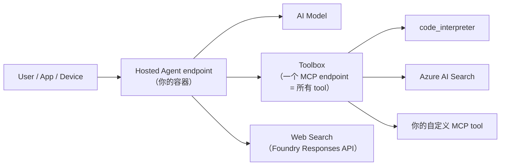
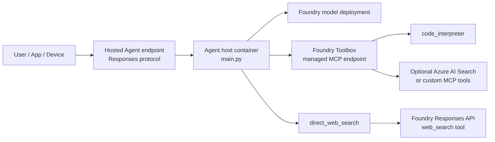

# Microsoft Foundry Hosted Agent + Toolbox Demo

[English](README.md)

## 这个 repo 解决什么问题

你在做一个 AI agent，它要调多个 tool —— 代码执行、联网搜索、内部 API、自定义 MCP server。每个 tool 各自有 auth、各自有版本、各自有负责团队。如果没有统一目录，每个 agent 都要自己接每个 tool，credential 重复，加一个新 tool 就得改 N 个 agent。

本 repo 用两个模块来解决：

1. **Hosted Agent** —— 你的 agent 代码跑在受管容器里，有自己的 identity 和稳定 HTTP endpoint。你不管基础设施。
2. **Toolbox** —— 所有 tool 住在一个版本化目录里，统一暴露成一个 MCP endpoint。Agent 接一次，发现全部工具。加减 tool 不需要重新部署 agent。

效果：**一个 agent endpoint，一个 tool 目录，代码里零逐 tool 接线**。

## 30 秒看效果

克隆 repo 并配好 `.env`（见 [Configure](#configure)）之后：

```bash
python main.py                    # Terminal 1：启动 agent server

# Terminal 2：让 agent 通过 Toolbox 的 code_interpreter 算一道题
curl -X POST http://localhost:8088/responses \
  -H "Content-Type: application/json" \
  -d '{"input":"Use code_interpreter to calculate sum(i*i for i in range(1, 6))."}'
```

Agent 调 Foundry model → model 决定调 `code_interpreter` → Toolbox MCP endpoint 把请求转到沙箱 → 沙箱跑真 Python → 返回答案：**55**。

## 能演示什么

| Demo | 发生了什么 | 试一下 |
| --- | --- | --- |
| **Toolbox 算数** | Agent → model → Toolbox MCP → `code_interpreter` sandbox → 真计算结果 | `scripts/smoke_test.py` |
| **联网搜索** | Agent → model → Foundry Responses API `web_search` → 带引用的 grounded 回答 | `scripts/smoke_test.py` |
| **端云协同** | 本地"设备"生成传感器数据 → 写任务契约 → 云端 agent 接管作答 | `examples/hybrid-edge-cloud/` |
| **图像生成** | Agent → Foundry image API → 从文本 prompt 生成 1024×1024 图片 | `.env` 里设 `ENABLE_DIRECT_IMAGE_GENERATE=true` |
| **自定义 MCP server** | 你自己的 tool（设备健康检查、策略引擎）通过 MCP 暴露，任何 agent 都能发现 | `examples/custom-mcp-server/` |
| **延迟实测** | 真实的 p50/p95/mean，code 路径和 web 路径分开测 | `scripts/measure_latency.py` |

## 架构一图看懂



打个比方：

| 日常类比 | 映射到 |
| --- | --- |
| 你手机上的 **App Store** | **Toolbox** —— tool 的目录，agent 能发现和调用。你更新目录，app（agent）自动拿到新 tool。 |
| 手机上的那个 **app** | **Hosted Agent** —— 你的代码，跑在受管沙箱里，有自己的 identity 和稳定地址。 |
| **App Store 自动更新 app 而你什么都不用做** | Promote Toolbox 新 `default_version` —— agent 下次调用就看到新 tool，不需要重部署。 |

分布式系统工程师的映射（API gateway / service mesh / workload identity）见下方 [心智模型](#心智模型面向分布式系统工程师) 章节。

<details>
<summary><strong>📚 全部文档（14 篇，中英双语）</strong></summary>

| 文档 | 涵盖内容 |
| --- | --- |
| [设计源起](docs/why-this-architecture-CN.md) | 从客户约束出发的第一性原理推导 |
| [架构取舍](docs/architecture-tradeoffs-CN.md) | Latency vs Governance vs Flexibility 的代价 |
| [友商对比](docs/comparison-CN.md) | vs OpenAI Assistants、Bedrock Agents、Vertex AI、LangGraph、Semantic Kernel |
| [MCP 协议详解](docs/mcp-protocol-deep-dive-CN.md) | 本 repo 使用的 MCP wire 级细节 |
| [请求流程与延迟预算](docs/request-flow-with-budget-CN.md) | Token + latency 预算 + 实测数据 |
| [失败模式](docs/failure-modes-CN.md) | 分层失败目录与恢复模式 |
| [生产规模](docs/production-scale-CN.md) | 多区域、多租户、成本、安全、合规 |
| [端云协同](docs/hybrid-edge-cloud-CN.md) | 端云 agent 组合 + 任务契约 |
| [语音与多模态](docs/voice-and-multimodal-CN.md) | 语音、图像生成、PPT 生成、多模态输入 |
| [架构](docs/architecture.md) | 详细架构图与请求流程（英文） |
| [演示脚本](docs/demo-script.md) | Customer-neutral 演示流程（英文） |
| [场景映射](docs/scenario-mapping.md) | AI device / gaming cloud / enterprise mapping（英文） |
| [排错指南](docs/troubleshooting.md) | 常见错误与修复（英文） |
| [验证](docs/validation.md) | 三层验证流程（英文） |

</details>

## Architecture



Hosted Agent 是你自己的 containerized code。Toolbox 是 Foundry project 里的受管 tool bundle。只要 `TOOLBOX_NAME` 和工具名保持兼容，更新 toolbox default version 就能改变工具集，不需要重新 build agent container。

Web search 路径故意和 Toolbox 分开。当前实现里，Toolbox MCP 用来承载受管 `code_interpreter`；公开网页 grounding 用 direct Responses API `web_search`，这是文档明确支持并且本 repo 已验证的路径。

## 心智模型（面向分布式系统工程师）

如果你做过微服务或平台架构，这个架构可以对应你已经熟悉的几个概念：

| 如果你熟悉... | ...它映射到 |
| --- | --- |
| **API gateway** 代理 N 个 upstream service | Foundry Toolbox 代理 N 个 tool，单 MCP endpoint + `default_version` 指针（可以理解为 gateway 版本控制 + 服务注册中心）。 |
| **Service mesh data plane**（sidecar 处理 auth/mTLS/retry/observability） | Toolbox runtime 注入凭据、刷新 token、暴露审批；agent code 不为每个 tool 处理 auth。 |
| **API contract 版本**藏在稳定 URL（如 `/v1`）后面 | Toolbox 的 `default_version`：实现可变，URL 稳定。 |
| **Per-pod identity**（K8s workload identity） | Per-agent Microsoft Entra ID，部署时自动颁发；agent 以自己身份调用下游。 |
| **Sidecar pattern**（你的代码 + 受管伴生进程） | Hosted Agent container + 平台注入的 Responses protocol 库与可观测性。 |
| **正交生命周期**（配置 vs 二进制） | Tool inventory（配置快）vs agent code（二进制慢）；拆开是因为它们演进节奏不一。 |

一句话概括：**Toolbox 是一个版本化的工具目录，用一个 MCP 前门暴露；Hosted Agent 是你的容器，提供稳定的 Responses endpoint 和 per-agent 身份**。其他都是这两件事的推论。

第一性原理推导见 [docs/why-this-architecture-CN.md](docs/why-this-architecture-CN.md)。每个设计决定的明确代价见 [docs/architecture-tradeoffs-CN.md](docs/architecture-tradeoffs-CN.md)。

## Repo Layout

| 路径 | 用途 |
| --- | --- |
| `main.py` | Agent Framework Responses host，加载 Foundry Toolbox 和可选 direct web-search tool。 |
| `agent.yaml` | Hosted Agent runtime definition。 |
| `agent.manifest.yaml` | 示例 declarative manifest，包含 model 和 toolbox。 |
| `Dockerfile` | Hosted Agent container image。 |
| `.env.example` | 本地配置模板。 |
| `scripts/create_toolbox.py` | 通过 `azure-ai-projects` 创建 Toolbox version。 |
| `scripts/verify_toolbox.py` | 列出 Toolbox MCP endpoint 暴露的 tools。 |
| `scripts/smoke_test.py` | 进程内端到端验证 `direct_web_search` 和 Toolbox `code_interpreter`。 |
| `scripts/http_smoke_test.py` | 对已启动的本地 `/responses` server 做 HTTP 验证。 |
| `scripts/repo_check.py` | 本地 repo 质量和语法检查。 |
| `scripts/measure_latency.py` | 实测 hosted-agent endpoint 的 p50 / p95 / mean 延迟。 |
| `infra/setup_foundry.py` | 一键 CLI 创建 RG、account、model deployment。 |
| `examples/hybrid-edge-cloud/` | 端云协同 live demo：edge 写 contract、cloud handoff 调 hosted agent。 |
| `examples/custom-mcp-server/` | 最小自定义 MCP server + client（暴露 `device_health_check`、`policy_evaluate`）。 |
| `examples/requests/` | 手动 `curl` 或 API 测试用 request body。 |
| `docs/why-this-architecture-CN.md` | Hosted Agent + Toolbox 分层的第一性原理推导。 |
| `docs/architecture-tradeoffs-CN.md` | 明确的 Latency / Governance / Flexibility 取舍。 |
| `docs/comparison-CN.md` | 与 OpenAI Assistants、Bedrock Agents、Vertex AI、LangGraph、Semantic Kernel 的客观技术对比。 |
| `docs/mcp-protocol-deep-dive-CN.md` | 本 repo 使用的 MCP 协议机制详解。 |
| `docs/request-flow-with-budget-CN.md` | 端到端请求流程与 token / latency 预算。 |
| `docs/failure-modes-CN.md` | 分层失败目录与恢复模式。 |
| `docs/production-scale-CN.md` | 多区域 / 多租户 / 成本 / 安全 checklist。 |
| `docs/hybrid-edge-cloud-CN.md` | 端云 agent 组合：共享任务契约、hand-off 模式、失败案例。 |
| `docs/voice-and-multimodal-CN.md` | 语音（实时 + 批）、图像生成、PPT 生成、多模态输入模式。 |
| `docs/architecture.md` | 原始架构图与请求流程（英文）。 |
| `docs/demo-script.md` | Customer-neutral 演示流程（英文）。 |
| `docs/scenario-mapping.md` | 通用场景映射（英文）。 |
| `docs/troubleshooting.md` | 排错指南（英文）。 |
| `docs/validation.md` | 三层验证流程（英文）。 |

## Prerequisites

1. 一个 Microsoft Foundry project。
2. project 中有一个 model deployment，例如 deployment 名为 `gpt-4-1-mini`，背后模型是 `gpt-4.1-mini`。
3. Azure RBAC：给开发者身份以及 hosted deployment 的 agent identity 授予 Foundry project 上的 `Azure AI User`。
4. 本地通过 `az login` 或其他 `DefaultAzureCredential` 来源认证。
5. Python 3.11+。

本地安装：

```bash
python -m venv .venv
source .venv/bin/activate
pip install -r requirements.txt
```

如果机器上有多个 Azure tenant，运行本地测试前先切到目标 subscription：

```bash
az account set --subscription <subscription-id>
```

## Configure

复制 `.env.example` 为 `.env`，填入你的 Foundry project 信息：

```bash
FOUNDRY_PROJECT_ENDPOINT=https://<account>.services.ai.azure.com/api/projects/<project>
AZURE_AI_MODEL_DEPLOYMENT_NAME=gpt-4-1-mini
TOOLBOX_NAME=agent-tools
AZURE_AUTH_MODE=cli
PORT=8088
ENABLE_DIRECT_WEB_SEARCH=true
```

本地开发时，`AZURE_AUTH_MODE=cli` 会强制使用 `AzureCliCredential`，适合多 tenant 机器。部署到 Hosted Agents 后，建议使用默认 credential chain，并通过 managed identity/RBAC 授权。

默认 consumer Toolbox MCP endpoint 由 `FOUNDRY_PROJECT_ENDPOINT` 和 `TOOLBOX_NAME` 自动拼出：

```text
https://<account>.services.ai.azure.com/api/projects/<project>/toolboxes/<toolbox-name>/mcp?api-version=v1
```

每个 Toolbox MCP request 都带 Toolbox 文档要求的 preview header：

```text
Foundry-Features: Toolboxes=V1Preview
```

## Create The Toolbox

方案 A：在 Foundry Toolkit 或 `azd` deployment 中使用 `agent.manifest.yaml`。它声明了名为 `agent-tools` 的 sample toolbox，里面有 `code_interpreter`。

方案 B：用代码创建或更新 toolbox：

```bash
python scripts/create_toolbox.py \
  --toolbox-name agent-tools \
  --with-code-interpreter \
  --set-default
```

脚本会打印 Toolbox 文档里两类 endpoint：

| Endpoint | 用途 |
| --- | --- |
| Version endpoint | 验证某个 immutable toolbox version。 |
| Consumer endpoint | 让 agent 连接当前 default toolbox version。 |

可以加 `--with-web-search` 创建包含 preview `web_search` 的 toolbox version。注意：MCP 能 list 出工具，不等于 runtime invoke 一定成功。本 repo 使用下面这个稳定拆分：

| 能力 | 本 repo 使用路径 |
| --- | --- |
| 受管代码执行 | Toolbox MCP `code_interpreter` |
| 公开网页事实检索 | `direct_web_search` 调 direct Responses API `web_search` |

## Verify The Toolbox

运行 agent 前，先确认 Toolbox endpoint 暴露了工具：

```bash
python scripts/verify_toolbox.py \
  --endpoint "https://<account>.services.ai.azure.com/api/projects/<project>/toolboxes/agent-tools/mcp?api-version=v1"
```

预期输出：

```text
Tools found: 1
- code_interpreter: Execute Python code for calculations and data analysis.
```

如果你看到 `web_search`，只代表 list 可用。这个 repo 的 runtime web grounding 仍然走 `direct_web_search`。

## Run The In-Process Smoke Test

这个测试不启动 HTTP server，而是在同一进程中创建 Agent Framework agent，验证两条工具路径：

```bash
python scripts/smoke_test.py
```

预期 markers：

```text
WEB_RESULT_START
...
WEB_RESULT_END
CODE_RESULT_START
The sum of the squares of the integers from 1 to 5 is 55.
CODE_RESULT_END
```

## Run The Local Responses Server

启动 server：

```bash
python main.py
```

另开一个 terminal，用 repo 里的 request body 测试：

```bash
curl -X POST http://localhost:8088/responses \
  -H "Content-Type: application/json" \
  --data @examples/requests/code_interpreter.json
```

```bash
curl -X POST http://localhost:8088/responses \
  -H "Content-Type: application/json" \
  --data @examples/requests/direct_web_search.json
```

也可以直接跑 HTTP smoke test：

```bash
python scripts/http_smoke_test.py --base-url http://localhost:8088
```

## 端云协同 Demo（已实跑）

`docs/hybrid-edge-cloud-CN.md` 描述的端云协同模式有最小可跑 demo。本地 Python "edge" 生成模拟传感器数据，把任务契约交给云端 hosted agent（本 repo），后者用 Toolbox `code_interpreter` 计算统计并给出通风建议。

```bash
# Terminal 1
python main.py

# Terminal 2
cd examples/hybrid-edge-cloud
python edge_agent.py     # 写 contract.json + 传感器 artifact
python cloud_handoff.py  # 云端用 code_interpreter 接管
```

2026-05-09 端到端验证：hosted agent 通过 toolbox 调 `code_interpreter`，对真实传感器 JSON 算出 mean/max/min，返回一段通风建议。详见 [`examples/hybrid-edge-cloud/README.md`](examples/hybrid-edge-cloud/README.md)。

## 可选：图像生成 Tool（已实跑）

`main.py` 包含 `direct_image_generate` tool（默认关），调 Foundry `/openai/v1/images/generations`。在 `.env` 中开启：

```bash
AZURE_AI_IMAGE_DEPLOYMENT_NAME=gpt-image-1
ENABLE_DIRECT_IMAGE_GENERATE=true
```

先一次性部署 image 模型：

```bash
az cognitiveservices account deployment create -g <rg> -n <account> \
  --deployment-name gpt-image-1 --model-name gpt-image-1 --model-version 2025-04-15 \
  --model-format OpenAI --sku-name GlobalStandard --sku-capacity 1
```

2026-05-09 端到端验证：agent 生成 1024×1024 水彩图（`b64_json` 长度 2,680,868 字符）。

## 自定义 MCP Server 示例（已实跑）

`examples/custom-mcp-server/` 提供一个最小可跑的自定义 MCP server（暴露 `device_health_check` 和 `policy_evaluate` 两个 deterministic tool），让你看清自定义 tool 进 Foundry Toolbox 的完整线缆：

```bash
# Terminal 1
cd examples/custom-mcp-server
python custom_mcp_server.py     # 监听 http://0.0.0.0:9100/mcp

# Terminal 2
python custom_mcp_client.py     # tools/list + tools/call 双验证
```

将其注册到 Toolbox 的方式见 [`examples/custom-mcp-server/README.md`](examples/custom-mcp-server/README.md)。

## 一键 Foundry 资源创建

新订阅可用 `infra/setup_foundry.py` 一条命令创建 RG / account / chat 部署 / image 部署：

```bash
az login
az account set --subscription <id>
python infra/setup_foundry.py \
  --resource-group rg-toolbox-demo \
  --account toolbox-demo-ais \
  --project toolbox-project-v2 \
  --location eastus2 \
  --with-image
```

脚本完成后打印 `.env` 模板。Foundry project 本身仍需在 Foundry portal 创建（`az` 当前不支持），脚本会提示并给出 URL。

## 实测延迟

```bash
python main.py                                        # Terminal 1
python scripts/measure_latency.py --iterations 5      # Terminal 2
```

2026-05-09 实测（eastus2 + gpt-4-1-mini，3 iterations）：

| 路径 | mean | p50 | p95 | max |
| --- | :-: | :-: | :-: | :-: |
| `code_interpreter` via Toolbox MCP | 8.9 s | 9.6 s | 10.8 s | 10.9 s |
| `direct_web_search` via Responses API | 18.1 s | 16.4 s | 23.6 s | 24.4 s |

详细分析见 [`docs/request-flow-with-budget-CN.md`](docs/request-flow-with-budget-CN.md)。

## Deploy As A Hosted Agent

`agent.yaml`、`agent.manifest.yaml` 和 `Dockerfile` 已按 Foundry Hosted Agents 形态准备。Hosted Agents 文档里的流程是：把 agent 打成 container，部署到 Agent Service，再暴露 Responses endpoint。

安装 Foundry `azd` extension 后，在 repo 根目录部署：

```bash
azd extension install azure.ai.agents
azd auth login
azd provision
azd deploy
```

部署后的 hosted Responses endpoint 格式：

```text
{project_endpoint}/agents/{agent_name}/endpoint/protocols/openai/v1/responses
```

## Scenario Patterns

这个 sample 不绑定某个行业。凡是需要一个 host agent 暴露稳定 endpoint，而背后的 tools 通过 managed catalog 演进，都可以用这套结构：

| 场景 | Hosted Agent 角色 | Toolbox 角色 |
| --- | --- | --- |
| AI native device | 设备侧或 app 调用的云端 agent endpoint。 | Device diagnostics、cloud search、account services、policy tools。 |
| Gaming cloud | Player-support 或 game-ops agent。 | Match telemetry、entitlement checks、knowledge search、code/data analysis。 |
| Enterprise assistant | 业务 workflow 的受管 agent endpoint。 | Internal APIs、search、code interpreter、ticketing、approvals。 |
| Developer tools | 自动化任务 agent endpoint。 | CI checks、repo search、test execution、package metadata lookup。 |

更详细的 customer-neutral 映射见 [docs/scenario-mapping.md](docs/scenario-mapping.md)。

## 什么时候不要用这套架构

它不是万能的。下面这些情况建议跳过或换更简单的方案：

| 情况 | 更合适的选择 |
| --- | --- |
| 单工具、单团队、单租户 | 直接在 app 内调 model + in-process function。 |
| 需要 on-device / edge agent，没有云端往返 | 本地 agent runtime + 本地工具（如 Foundry Local）。 |
| 硬实时回路，TTFT 必须 < 500 ms | 直接嵌入 model client，省掉 container 跳。 |
| 不需要 LLM 规划的确定性数据流水线 | 工作流引擎（Durable Functions、Step Functions）更干净。 |
| 完全在 OpenAI 生态、没有 Azure 数据面 | OpenAI Assistants API；见 [docs/comparison-CN.md](docs/comparison-CN.md)。 |
| 完全在 AWS 或 GCP | Bedrock Agents 或 Vertex AI Agent Builder；见 [docs/comparison-CN.md](docs/comparison-CN.md)。 |

详细的边界推导见 [docs/why-this-architecture-CN.md](docs/why-this-architecture-CN.md) §9。

## 关联 Repo（同系列）

[`david-share`](https://github.com/davidsky-msft/david-share) 里的相关 Repo，跨边界场景可以配合本 demo 一起看：

| Repo | 涵盖内容 |
| --- | --- |
| [`Microsoft-Agent-Framework`](../Microsoft-Agent-Framework/) | Agent Framework workflow：human-in-the-loop pipeline + `MagenticBuilder` 编排。 |
| [`Azure-MCP-Solution`](../Azure-MCP-Solution/) | 在 Azure 上构建/运维 MCP server，可被 Toolbox 消费。 |
| [`A2A-Demo`](../A2A-Demo/) | Agent-to-agent 委派模式；与 Toolbox 的 `A2A` tool type 互补。 |
| [`Magentic-One`](../Magentic-One/) | 在单 agent 之上的多 agent 编排。 |
| [`AI-Agent-Private-Endpoint`](../AI-Agent-Private-Endpoint/) | Hosted Agent 需访问私网资源时的 private link / VNet 模式。 |
| [`AI-Foundry-Agent-VNET-Deployment`](../AI-Foundry-Agent-VNET-Deployment/) | 网络隔离 Foundry agent 部署 recipe。 |
| [`Foundry-IQ`](../Foundry-IQ/) | Foundry knowledge grounding，可与 Toolbox 的 `azure_ai_search` / `file_search` 组合。 |

## Troubleshooting

先看 [docs/troubleshooting.md](docs/troubleshooting.md)。常见问题：

| 现象 | 可能原因 | 修复 |
| --- | --- | --- |
| Toolbox MCP 返回 `401 Unauthorized` | token 缺失、tenant 错、或 preview header 缺失。 | 用 `AZURE_AUTH_MODE=cli`，确认 `az account`，保留 `Foundry-Features: Toolboxes=V1Preview`。 |
| `prompts/list` 报错 | Foundry Toolbox MCP endpoint 不实现 MCP prompts。 | 保持 `load_prompts=False`。 |
| Toolbox `web_search` invoke 返回 `DeploymentNotFound` | preview service-side runtime path 问题。 | 使用 `direct_web_search`，它走 documented Responses API `web_search`。 |
| scripts 中 `ModuleNotFoundError: main` | 脚本找不到 repo root。 | 从 repo root 运行；脚本已自动把 repo root 加入 `sys.path`。 |
| 缺环境变量 | `.env` 不完整。 | 对照 `.env.example`。 |

## Quality Check

分享或 commit 前运行本地 repo 检查：

```bash
python scripts/repo_check.py
```

它会检查必要文件、Python 语法、manifest/env 关键文本，以及 commit-worthy 文件中的明显 secret pattern。它会跳过 `.env`、`.venv`、cache 和 binary 文件。

## Production Notes

- 不要把 secret 放进 `.env`、image、manifest、截图或 log。生产中使用 Foundry connections、managed identities、Key Vault 和 RBAC。
- Hosted Agents 和 Toolbox 仍是 preview feature；客户交付前要 pin 并测试 package version。
- OAuth-backed MCP tool 首次调用可能返回 consent required error `-32006`；完成 user consent 后重试。
- Toolbox MCP client 保持 `load_prompts=False`，除非 endpoint 后续明确支持 prompts。
- 生产使用前阅读 Azure AI Foundry OpenAI Web Search 文档，确认 data handling 和 pricing。
- Public repo 保持 customer-neutral。客户特定 mapping、private endpoint、subscription、截图和会议记录放在 private working directory。

## Project Information

| 项 | 值 |
| --- | --- |
| Author | 魏新宇 (Xinyu Wei) |
| Date | 2026-05 |
| Status | Runnable reference demo |
| Runtime | Microsoft Agent Framework + Foundry Hosted Agents Responses protocol |
| Tooling | Microsoft Foundry Toolbox MCP + direct Foundry Responses API web search |