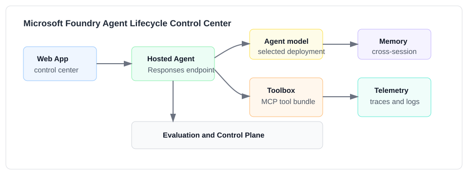
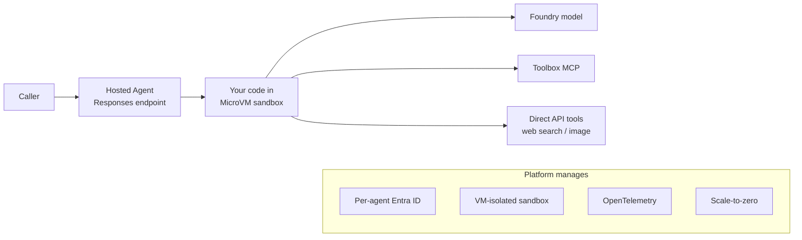
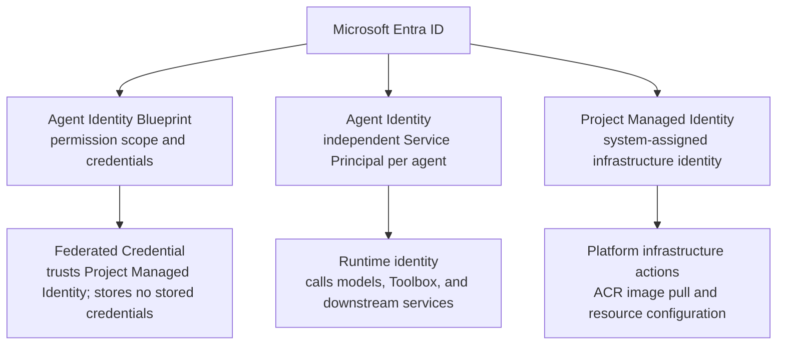
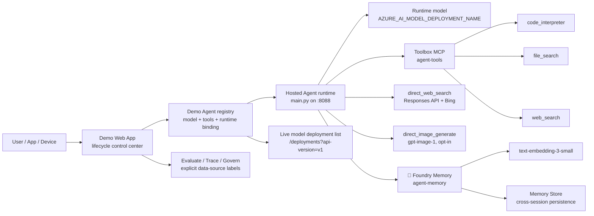
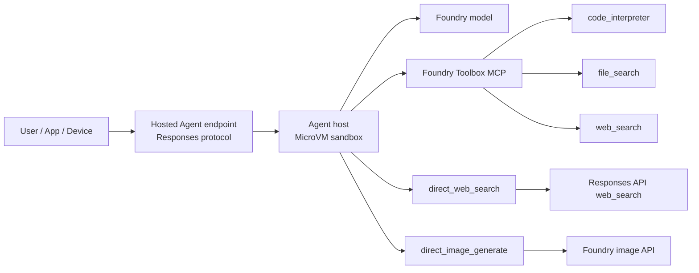
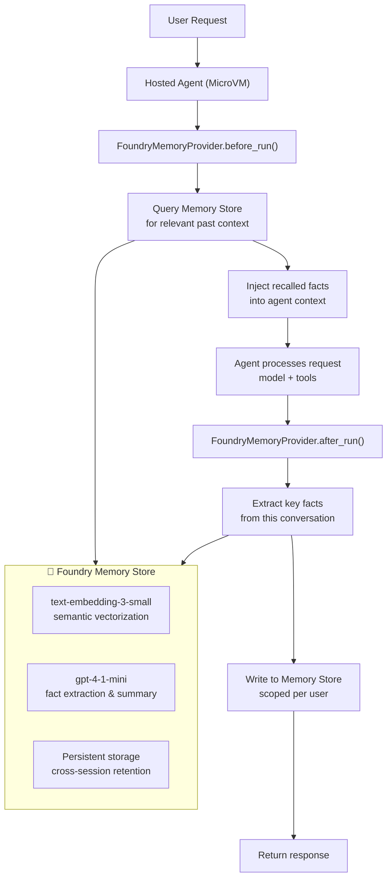

# Microsoft Foundry Hosted Agent + Toolbox + Memory + Skills Demo

**Recorded walkthrough (1.8x)**: the video below shows the actual web app flow — build a Toolbox, bind it to a Hosted Agent, test/evaluate/trace requests, and review fleet governance.

https://github.com/user-attachments/assets/5dea1cb5-d113-4f35-ad56-0fec0fa22ea8

## Running on Azure

This repo is an end-to-end **Azure AI Foundry enterprise agent platform demo**. It combines Microsoft Agent Framework, Foundry Hosted Agents, Foundry Toolbox, Foundry Memory, selected Microsoft `SKILL.md` files, evaluation, tracing, fleet governance, voice transcription, and image generation into one lifecycle UI.

> **Author**: Xinyu Wei (魏新宇) — Microsoft AI GBB Senior System Engineer

[中文版](README-CN.md)

---

## Live Demo

🔗 **Run it**: deploy the web app to your own host, or run it locally after filling `.env` from `.env.example`.



### What You'll See

| Feature | Description |
|---|---|
| **6-step lifecycle UI** | Build Toolbox → Deploy Agent → Test → Evaluate → Trace → Govern Fleet, matching `app/static/index.html` |
| **Real Foundry Hosted Agent** | `hosted-agent-toolbox-demo` v2 running in MicroVM (not mocked) |
| **3 Toolbox tools via MCP** | code_interpreter (Python sandbox), file_search (vector store), web_search (Bing) |
| **Multi-tool execution trace** | Watch request flow: You → Hosted Agent runtime → selected Agent model → Toolbox MCP → tool → answer |
| **Foundry AppTraces log** | Real-time cloud agent logs from Application Insights |
| **Multi-team Hosted Agent registry** | Register Python / Node.js / Java hosted agents, bind each Foundry Agent to a runtime |
| **Dynamic model deployment picker** | Agent create/edit loads deployments from the Foundry project via `/api/model-deployments`, with an env fallback only when live discovery is unavailable |
| **Voice transcription** | Upload audio through `/api/voice`, transcribe with the configured Whisper deployment, then hand the text to the selected agent |
| **Image generation** | Agents with `direct_image_generate` enabled can call the Foundry image API through `/api/image` |
| **Request history** | `/api/history` keeps recent interactions so evaluation, tracing, and governance have visible evidence |
| **Evaluation, tracing, and fleet governance** | Run quick evaluation, inspect recent traces, and view actionable readiness checks with explicit data-source provenance |
| **Chinese + English demos** | file_search over architecture doc (EN) + Three-Body Problem excerpt (CN) |
| **Create custom agents** | Pick model deployment + tools + hosted runtime → new Foundry Agent in seconds |
| **Load Microsoft Skills** | Attach selected `SKILL.md` files from `microsoft/skills` to an existing agent, then inject that guidance at request time |
| **Foundry Memory (preview)** | Cross-session long-term memory — agent remembers user preferences and past conclusions across conversations |

> Source note: the `microsoft/skills` repository describes **"174 Skills"** as **"Domain-specific knowledge for Azure SDK and Foundry development"** and warns: **"Use skills selectively. Loading all skills causes context rot"**. Source: [microsoft/skills README](https://github.com/microsoft/skills/blob/main/README.md), checked 2026-05-12.

### Delivery Asset

The local architecture image above is included in this repo so the README renders without external screenshot dependencies.

### Lifecycle UI and API coverage

The web app is no longer a simple three-column playground. It is a lifecycle control surface, and each panel is backed by an explicit API so the README, UI, and backend stay aligned.

| Step | UI section | Backend API | Data source / boundary |
| --- | --- | --- | --- |
| 1 | Build Toolbox | `/api/toolboxes`, `/api/toolbox-info` | Local toolbox registry plus live MCP `tools/list` where configured. |
| 2 | Deploy Agent | `/api/agents`, `/api/hosted-agents`, `/api/model-deployments` | Demo Agent registry owns model/tools/instructions/runtime binding; Hosted runtime registry does not store model metadata. |
| 3 | Test | `/api/chat`, `/api/voice`, `/api/image`, `/api/history` | Live Hosted Agent endpoint plus persisted demo request history. |
| 4 | Evaluate | `/api/evaluation/run` | Local deterministic quick evaluation; optional Foundry Evaluation API submission when enabled. |
| 5 | Trace | `/api/tracing/recent`, `/api/agent-logs` | Application Insights when `CLOUD_LOG_WORKSPACE_ID` is configured, otherwise local request history context. |
| 6 | Govern Fleet | `/api/control-plane` | Local demo registry and recent history, with `model_source` and data-source labels so the UI does not pretend to be a full Foundry inventory API. |

### What this demo covers vs. what requires configuration

| Available in the demo path | Requires environment configuration |
| --- | --- |
| 6-step lifecycle UI for Toolbox, Agent, Test, Evaluation, Trace, and Fleet governance. | Azure AI Search requires `AZURE_AI_SEARCH_CONNECTION_ID` and `AZURE_AI_SEARCH_INDEX`. |
| Toolbox-backed `code_interpreter` and guarded `file_search` when a vector store is configured. | File Search requires `VECTOR_STORE_ID` or `FILE_SEARCH_VECTOR_STORE_IDS`. |
| Direct Responses API web grounding through `direct_web_search`. | Custom MCP requires `MCP_SERVER_URL` and `MCP_PROJECT_CONNECTION_ID`. |
| Voice transcription through `/api/voice` and image generation through `/api/image`. | Application Insights traces require `CLOUD_LOG_WORKSPACE_ID`. |
| Microsoft Skills loading, local request history, quick evaluation, and fleet readiness checks. | Foundry Memory requires `MEMORY_STORE_NAME` and a provisioned Memory Store. |

This boundary is deliberate: the UI shows the enterprise platform surface, while the create path only submits capabilities that the current environment can actually support.

Model deployment discovery uses the Foundry project endpoint `GET {AZURE_AI_PROJECT_ENDPOINT}/deployments?api-version=v1` with the `https://ai.azure.com/.default` audience. If live discovery fails, the UI falls back to `DEFAULT_AGENT_MODEL` so the create/edit modal remains usable.

---

## 1. What Is Foundry Toolbox — and Why It Matters

A **Toolbox** is a managed, versioned bundle of tools inside a Microsoft Foundry project. You define which tools to include, configure auth centrally, and expose the bundle as a **single MCP-compatible endpoint** that any agent can consume.

### Toolbox advantages

| Advantage | What it means |
| --- | --- |
| **Single endpoint for all tools** | One MCP URL = all tools. The agent connects once; no per-tool wiring. |
| **Centralized auth & governance** | Credentials, approval gating (`require_approval`), and RBAC live in the toolbox, not in agent code. |
| **Versioned & immutable** | Each `ToolboxVersionObject` is a snapshot. Promote `default_version` atomically; roll back in one call. |
| **Framework-agnostic consumption** | Any MCP-compatible client can use it: Microsoft Agent Framework, LangGraph, Semantic Kernel, GitHub Copilot SDK, Claude Code. |
| **Tool diversity in one catalog** | Mix built-in tools (Code Interpreter, Web Search, Azure AI Search, File Search) with custom MCP servers, OpenAPI endpoints, and Agent-to-Agent (A2A) tools — all in one bundle. |
| **Decouple tool lifecycle from agent lifecycle** | Add, remove, or reconfigure tools without redeploying the agent container. |

### Toolbox catalog coverage in the UI

The first step of the demo is intentionally broader than the three tools used by the default agent. The UI now shows the full Toolbox design space, while still preventing users from submitting tools that need missing connection configuration.

| Catalog option | Create status in this repo | Required configuration |
| --- | --- | --- |
| `code_interpreter` | Ready | None |
| `file_search` | Ready when a vector store is configured | `VECTOR_STORE_ID` or `FILE_SEARCH_VECTOR_STORE_IDS` |
| `web_search` | Ready | Review Grounding with Bing terms before production use |
| `azure_ai_search` | Ready when a project connection and index are configured | `AZURE_AI_SEARCH_CONNECTION_ID` + `AZURE_AI_SEARCH_INDEX` |
| `custom_mcp` | Ready when a remote MCP connection is configured | `MCP_SERVER_URL` + `MCP_PROJECT_CONNECTION_ID` |
| `openapi` | Visible as a lifecycle option | OpenAPI spec + auth policy |
| `agent_to_agent` | Visible as a lifecycle option | Target agent URL + project connection |

This is an important product point for platform discussions:

1. **Ready tools stay clickable.** Built-in tools that have the required configuration can be selected and published immediately.
2. **Unconfigured tools are still visible.** The UI keeps Azure AI Search, custom MCP, OpenAPI, and A2A in the catalog so the customer sees the intended platform surface.
3. **The modal fails early.** If a tool needs configuration, the card is disabled and explains the missing environment variables instead of letting the user click into a Foundry API error.
4. **The backend validates again.** The API rejects unconfigured tools even if a caller bypasses the UI and posts JSON directly.
5. **Tool identifiers are stable.** Each built-in tool is created with a stable `name` so multi-tool Toolbox creation does not hit the `Multiple tools without identifiers` validation error.
6. **File Search is guarded.** The app requires a vector store ID before creating a File Search tool, because Foundry rejects empty `vector_store_ids`.
7. **Connection-backed tools are explicit.** Azure AI Search and custom MCP only become creatable when the required project connection values are present.

The result is a more honest control-plane demo: users see where the platform can go, but the live create path only submits tools the environment can actually support.

### Tool configuration examples

#### Built-in compute

`code_interpreter` is the simplest path. It needs a name and description in the Toolbox version payload, but no customer project connection.

```json
{
  "type": "code_interpreter",
  "name": "code_interpreter",
  "description": "Execute Python code for calculations and data analysis."
}
```

#### Built-in retrieval

`file_search` requires an existing vector store. The demo reads both `VECTOR_STORE_ID` and `FILE_SEARCH_VECTOR_STORE_IDS` so a single-store demo and a multi-store production configuration both work.

```json
{
  "type": "file_search",
  "name": "file_search",
  "description": "Search uploaded files in a vector store for relevant passages.",
  "vector_store_ids": ["<VECTOR_STORE_ID>"]
}
```

#### Customer search index

`azure_ai_search` is the right path when the customer already has an Azure AI Search index and wants governance through Foundry Toolbox rather than hand-wiring search into each agent.

```json
{
  "type": "azure_ai_search",
  "name": "azure_ai_search",
  "description": "Search the configured Azure AI Search index.",
  "azure_ai_search": {
    "indexes": [
      {
        "index_name": "<INDEX_NAME>",
        "project_connection_id": "<PROJECT_CONNECTION_ID>"
      }
    ]
  }
}
```

#### Custom MCP server

`custom_mcp` is the path for customer-owned tools that already expose MCP. The Toolbox becomes the governed front door, while the tool implementation remains owned by the customer team.

```json
{
  "type": "mcp",
  "server_label": "custom_mcp",
  "server_url": "https://example.contoso.com/mcp",
  "require_approval": "never",
  "project_connection_id": "<PROJECT_CONNECTION_ID>"
}
```

### Toolbox full lifecycle (4 pillars)

<div align="center">

<br/><em>Source: <a href="https://devblogs.microsoft.com/foundry/introducing-toolboxes-in-foundry/">Introducing Toolboxes in Foundry</a> (Microsoft Foundry Blog)</em>
</div>

> Source: [Curate intent-based toolbox in Foundry](https://learn.microsoft.com/en-us/azure/foundry/agents/how-to/tools/toolbox) · [Introducing Toolboxes in Foundry (blog)](https://devblogs.microsoft.com/foundry/introducing-toolboxes-in-foundry/)

### The problem Toolbox solves (before vs after)

<div align="center">

<br/><em>Source: <a href="https://devblogs.microsoft.com/foundry/introducing-toolboxes-in-foundry/">Introducing Toolboxes in Foundry</a> (Microsoft Foundry Blog)</em>
</div>

---

## 2. What Is Foundry Hosted Agent — and Why It Matters

A **Hosted Agent** is your own agent code running on Foundry Agent Service. You package it as a container image, but the platform runs it in a **MicroVM sandbox** (not a traditional container) — each session gets its own VM-isolated environment with persistent `$HOME` and `/files`. The platform provides compute, identity, networking, observability, and a stable endpoint. You write the agent logic; the platform handles everything else.

### Hosted Agent advantages

| Advantage | What it means |
| --- | --- |
| **Per-agent identity** | Each agent gets its own Microsoft Entra ID at deploy time — calls to models, tools, and downstream services are identity-scoped. |
| **Stable HTTP endpoint** | `{project}/agents/{name}/endpoint/protocols/openai/v1/responses` — callers point here; compute moves behind it. |
| **Per-session VM-isolated MicroVM** | `$HOME` and `/files` persist across turns and across idle; sessions resume with full state. Not a traditional container — kernel-level isolation. |
| **Scale-to-zero** | 15-minute idle timeout → deprovision. Next request → resume with state. You pay only for active sessions. |
| **Bring any framework** | Agent Framework, LangGraph, Semantic Kernel, or raw Python/C# — the container is yours. |
| **Built-in observability** | OpenTelemetry traces auto-injected into Application Insights. |
| **Version pinning & traffic splitting** | Immutable agent versions; canary / blue-green with weighted rollouts. |

> Source: [What are hosted agents?](https://learn.microsoft.com/en-us/azure/foundry/agents/concepts/hosted-agents) · [Hosted Agents blog](https://devblogs.microsoft.com/foundry/introducing-the-new-hosted-agents-in-foundry-agent-service-secure-scalable-compute-built-for-agents/)

### Hosted Agent architecture



### MicroVM Deep Dive — How Your Container Image Actually Runs

A common question: **what's the difference between MicroVM and a traditional container? Do I need to change my Dockerfile?**

The answer is: **your Dockerfile stays exactly the same.** `FROM python:3.11-slim` → `pip install` → `CMD python main.py` — identical to any container. The difference is that **Foundry doesn't run your image with Docker/containerd — it runs it inside a lightweight virtual machine (MicroVM).**

#### Traditional Container vs Foundry MicroVM

| Dimension | Traditional Container (ACA/AKS/Docker) | Foundry MicroVM |
|---|---|---|
| **What you provide** | Docker image | **Same Docker image** |
| **Build process** | `docker build` → push ACR | Foundry deployment tooling / SDK / REST → ACR image → **Foundry pulls into MicroVM** |
| **Isolation layer** | Linux namespace + cgroup (shared host kernel) | **Independent VM kernel** (similar to AWS Firecracker / Kata Containers) |
| **Security boundary** | Process-level (container escape risk exists) | **Kernel-level** (each session gets its own VM, no shared kernel) |
| **State** | Container restart = data lost | `$HOME` + `/files` **persist across turns**, idle 15min → suspend, not destroy |
| **Idle behavior** | Container killed or keeps consuming resources | **Suspend** (frozen), next request → **resume with full state** |
| **Cost** | Always running, always paying | Pay only for active sessions (scale-to-zero) |

#### Why MicroVM Instead of Regular Containers?

This is a key architectural decision by Foundry. The core reason is **multi-tenant security**:

1. **Containers share the kernel** → if two customers' agents run on the same host, container escape is a theoretical attack surface
2. **MicroVM has an independent kernel** → each session has its own complete Linux kernel. Even if agent code has vulnerabilities, it cannot affect other sessions. This is the same isolation approach as AWS Lambda (Firecracker)
3. **Stateful + secure** → traditional containers are awkward for stateful services (volume mount + restart loses state). MicroVM's suspend/resume natively supports the "pause-resume" pattern

#### Verified in This Demo

Our Application Insights logs show real MicroVM behavior:

```
[INFO] AgentServerHost starting on 0.0.0.0:8088 (async)     ← container starts in MicroVM
[INFO] Platform environment: is_hosted=True                   ← platform confirms hosted mode
[INFO] ManagedIdentityCredential.get_token_info succeeded    ← MicroVM has built-in Managed Identity
[INFO] Function code_interpreter succeeded.                   ← Toolbox MCP call completes inside MicroVM
[INFO] POST /responses 200 7719ms                             ← request processed in MicroVM
[INFO] AgentServerHost shutting down (graceful timeout=30s)   ← MicroVM graceful shutdown after idle
```

#### Hypervisor Isolation

The official Foundry Blog (Jeff Hollan's team, 2026-04-22) states:
> *"Production-proven **hypervisor isolation**, at cloud scale. Not process isolation. Not a code execution-only sandbox."*
>
> — [Introducing the new hosted agents in Foundry Agent Service](https://devblogs.microsoft.com/foundry/introducing-the-new-hosted-agents-in-foundry-agent-service-secure-scalable-compute-built-for-agents/)

This confirms kernel-level VM isolation, not container-level namespace isolation.

| Isolation Level | Example | Agent Scenario Risk |
|---|---|---|
| **Process isolation** | Regular Docker containers | Agent executes arbitrary code + shared kernel = high risk |
| **Pod Sandbox** | AKS + Kata / gVisor | Better, but complex to configure |
| **Hypervisor isolation** | **Foundry MicroVM**, ACI Hyper-V mode | Independent VM kernel per session, zero sharing = production-safe |

> ⚠️ Note: Microsoft has not disclosed whether the specific hypervisor is Hyper-V, Firecracker, or a custom MicroVM runtime. The inference above is based on known Azure infrastructure facts, not an official statement.

#### Agent Identity & Authentication

Isolation ensures "others' code can't affect me." But there's another question: **how does the agent prove who it is? How does it get permission to call models and tools?**

Foundry uses a **3-layer identity architecture** based on Microsoft Entra ID:



**Runtime token exchange (4 steps, fully automatic — developers write zero token code):**

```
1. Blueprint auth      Agent Service → Entra ID: present federated credential
2. Agent Token issued   Entra ID → Agent Service: issue Agent Identity Token
3. Scoped Token        Agent Service → Entra ID: request target service access token
                       (audience e.g. https://storage.azure.com)
4. Tool call           Agent Service → MCP Server: Bearer {scoped token}
                       Downstream validates token + checks RBAC → allow/deny
```

Two authentication modes:

| Mode | OAuth Flow | Use Case |
|---|---|---|
| **Unattended** | client_credentials | Backend tasks, API integration, **this Demo** |
| **Attended (OBO)** | on-behalf-of | Teams/M365, agent acts as user (e.g. reads user's OneDrive) |

> Source: [Agent identity concepts in Microsoft Foundry](https://learn.microsoft.com/en-us/azure/foundry/agents/concepts/agent-identity)

### Hosted Agent Definition & Multi-Language Support

Each Hosted Agent is defined by an `agent.yaml`:

```yaml
kind: hosted
name: hosted-agent-toolbox-demo
protocols:
  - protocol: responses
    version: 1.0.0
resources:
  cpu: "0.25"
  memory: 0.5Gi
environment_variables:
  - name: AZURE_AI_MODEL_DEPLOYMENT_NAME
    value: gpt-4-1-mini
  - name: TOOLBOX_NAME
    value: agent-tools
```

In this container, `AZURE_AI_MODEL_DEPLOYMENT_NAME` is runtime configuration consumed by `main.py`. The Web App's control plane keeps model selection on the **Foundry Agent** record, not on the Hosted Agent runtime registry.

Hosted Agents use `language: docker` — **any programming language works**:

| Language | Framework | Dockerfile Key Line | Use Case |
|---|---|---|---|
| **Python 3.11+** | Microsoft Agent Framework | `FROM python:3.11-slim` | General agent, **this demo** |
| **Java 21** | Semantic Kernel for Java | `FROM eclipse-temurin:21-jre` | Enterprise workflows, SAP/ERP |
| **TypeScript / Node 20** | LangGraph.js / Semantic Kernel JS | `FROM node:20-slim` | Real-time data processing |
| **C# / .NET 8** | Semantic Kernel for .NET | `FROM mcr.microsoft.com/dotnet/aspnet:8.0` | .NET enterprise |
| **Go / Rust / any** | Custom HTTP server | Choose base image | High-performance / edge |

> Source: Hosted Agent docs "Bring your own container image" — `language: docker` means Foundry doesn't care about language, only the container spec.

### Multi-Team Multi-Hosted-Agent Scenario

In production, different teams deploy their own Hosted Agents with independent environments:

| Dimension | Commerce team | Analytics team |
| --- | --- | --- |
| Hosted Agent | `order-processor` | `data-analyst` |
| Language | Python 3.12 | TypeScript / Node 20 |
| Dockerfile | Python + pandas + SAP connector | Node + chart.js |
| Toolbox | code_interpreter + SAP tool | file_search + SQL tool |
| Resources | CPU 0.5 / 1 GiB | CPU 0.25 / 0.5 GiB |
| Runtime isolation | MicroVM, persistent `$HOME` | MicroVM, persistent `$HOME` |

Each Hosted Agent has independent: container image, Toolbox binding, Application Insights (logs naturally isolated), endpoint URL, and version management (canary/blue-green).

This Demo's Web App supports registering multiple Hosted Agents and binding each demo Foundry Agent record to a specific Hosted Agent runtime. The model deployment is stored on the Agent record, not on the Hosted runtime record. The active Hosted Agent endpoint still executes with the runtime model configured for that endpoint; the demo registry records the selected Agent model for control-plane provenance, evaluation metadata, and future production mapping to real Foundry Agent definitions.

---

## 3. What We Built in This Demo

### Toolbox contents (our experiment)

We created a Foundry Toolbox named `agent-tools` with the following tools:

| Tool | Type | What it does in this demo | Runtime status |
| --- | --- | --- | --- |
| `code_interpreter` | Built-in (Toolbox) | Executes Python in a managed sandbox — the agent sends code, the sandbox returns results. Used for computation tasks. | ✅ Verified end-to-end |
| `web_search` | Built-in (Toolbox) | Searches the public web via Bing grounding. Lists correctly through MCP `tools/list`. | ⚠️ Lists OK; runtime invoke returns a tool error in some projects (preview). The agent auto-falls-back to `direct_web_search`. |
| `file_search` | Built-in (Toolbox) | Searches uploaded documents in a vector store for relevant passages. We uploaded `docs/why-this-architecture.md` as test content. | ✅ Verified end-to-end — agent accurately quoted the MCP vs function-calling passage from the uploaded doc. |

We demonstrate both the **governed Toolbox path** (code_interpreter and file_search work end-to-end) and the **Responses API fallback** (direct_web_search for web grounding). See `scripts/create_toolbox.py --with-web-search --with-code-interpreter --with-file-search` for how all three were registered.

### Hosted Agent contents (our experiment)

Our hosted agent container (`main.py`) includes:

| Component | Package / module | Purpose |
| --- | --- | --- |
| Agent Framework core | `agent-framework==1.3.0` | Agent runtime: planning, tool dispatch, message assembly. |
| Foundry chat client | `agent-framework-foundry==1.3.0` | `FoundryChatClient` connects to Foundry model deployments. |
| Hosted runtime | `agent-framework-foundry-hosting==1.0.0a260507` | `ResponsesHostServer` exposes the Responses protocol on `0.0.0.0:8088`. |
| MCP tool bridge | `MCPStreamableHTTPTool` (from agent-framework) | Connects to Toolbox MCP endpoint with auth + preview header. |
| `direct_web_search` | Custom `@tool` function in `main.py` | Calls Foundry Responses API with `tools:[{"type":"web_search"}]` for grounded public web answers. |
| `direct_image_generate` | Custom `@tool` function in `main.py` (opt-in) | Calls Foundry `/openai/v1/images/generations` for image generation. |
| Runtime model deployment | `AZURE_AI_MODEL_DEPLOYMENT_NAME` (`gpt-4-1-mini` in this environment) | The model used by `main.py` inside the Hosted Agent endpoint. The Web App stores Agent-level model selection separately in its demo registry. |
| Azure credential | `azure-identity==1.25.3` | `AzureCliCredential` (local) or `DefaultAzureCredential` (hosted). |

### Combined architecture



---

## 4. Why We Designed These Scenarios

Each demo scenario is designed to prove a specific architectural claim:

| Scenario | What it proves | Why it matters to customers |
| --- | --- | --- |
| **Code via Toolbox** | The Toolbox MCP path works end-to-end: agent → model → MCP `tools/call` → sandbox → result. | Customers need to trust that governed tools actually execute correctly through the catalog. |
| **Web search via Responses API** | A direct Responses API tool coexists with Toolbox tools in the same agent. | Customers need both governed tools (Toolbox) and documented runtime tools (Responses API) in one agent. |
| **Edge-cloud handoff** | A local "device" and a cloud hosted agent can share a task through a JSON contract — no direct tool coupling. | Customers building AI native devices need edge-cloud continuity without the device calling cloud tools directly. |
| **Image generation** | Adding a new capability is one `@tool` function + one model deployment — no toolbox change, no agent rebuild. | Customers want to extend the agent quickly without touching the governed catalog for every experiment. |
| **Custom MCP server** | A custom MCP server can be built, tested locally, and then registered into a Toolbox — the agent discovers it automatically. | Customers with their own backend APIs need a clear path from local prototype to governed catalog. |
| **Microsoft Skills loading** | Existing agents can load selected `SKILL.md` files from `microsoft/skills`; the backend caches the catalog and injects only loaded skills into that agent's request context. | Customers can reuse curated Azure SDK and Foundry guidance without turning every skill into a new runtime tool or loading the entire catalog. |
| **Latency measurement** | Real p50/p95/mean numbers replace illustrative budgets. | Customers making go/no-go decisions need data, not estimates. |

---

## 5. Verification Results

All scenarios were tested end-to-end against real Foundry resources (eastus2, private subscription) on 2026-05-09.

### Real agent output (captured live, not mocked)

#### Demo 1 — code_interpreter via Toolbox MCP (9.3 s)

```
User:  Use code_interpreter to calculate the first 10 Fibonacci numbers
       and return them as a Python list.

Agent: The first 10 Fibonacci numbers are: [0, 1, 1, 2, 3, 5, 8, 13, 21, 34]
```

Path: Agent → gpt-4-1-mini (planning) → Toolbox MCP `tools/call` code_interpreter → Python sandbox → gpt-4-1-mini (final answer)

#### Demo 2 — file_search via Toolbox MCP (7.5 s)

```
User:  Use file_search to find what the uploaded document says about the
       difference between Toolbox MCP and raw MCP servers.

Agent: The Toolbox MCP server sits in front of raw MCP servers to provide
       aggregation of multiple tool types behind one endpoint, letting agents
       connect once and discover all tools. Additionally, Toolbox adds
       governance and version pinning, allowing tool sets to be updated
       without redeploying agents.
```

Path: Agent → gpt-4-1-mini → Toolbox MCP `tools/call` file_search → vector store (why-this-architecture.md) → gpt-4-1-mini (final answer with citations)

#### Demo 3 — direct_web_search via Responses API (12.4 s)

```
User:  Find the latest Microsoft Foundry Agent Service pricing.

Agent: Microsoft Foundry Agent Service pricing in 2026 follows a flexible
       token consumption model with pay-as-you-go and provisioned throughput
       options, with details at https://azure.microsoft.com/pricing/details/
       foundry-agent-service/.
```

Path: Agent → gpt-4-1-mini → `direct_web_search` → Foundry Responses API + Bing grounding → gpt-4-1-mini (final answer with source URL)

#### Demo 4 — Edge-cloud handoff (`examples/hybrid-edge-cloud/`)

```
[edge]  Captured 24 hourly readings for 3 sensors (seed=42).
[edge]  Wrote contract to contract.json. current_owner = cloud.

[cloud] Picked up task 6de61ccf (contract version 1).
[cloud] Calling hosted agent at http://localhost:8088/responses ...

Agent:  Temperature mean 22.04°C (20.03–24.46), Humidity mean 49.8%,
        CO2 mean 699 ppm (419–994). Ventilation is recommended because
        the mean CO2 approaches the 600–800 ppm comfort threshold.
```

Path: edge_agent.py (local) → writes JSON contract → cloud_handoff.py → hosted agent → Toolbox MCP `code_interpreter` → computed statistics → recommendation

#### Demo 5 — Custom MCP server (`examples/custom-mcp-server/`)

```
$ python custom_mcp_client.py
Tools found: 2
  - device_health_check
  - policy_evaluate

[invoke] device_health_check(cpu_pct=92, mem_pct=70, temp_c=88)
→ {"status": "critical", "advice": "page on-call"}

[invoke] policy_evaluate(role=engineer, action=delete, sensitivity=internal)
→ {"decision": "needs_approval", "reason": "write/delete on internal needs approval"}
```

Path: custom_mcp_client.py → local FastMCP server on :9100 → deterministic tool logic → MCP `tools/call` response

#### Demo 6 — Image generation (51.7 s)

```
User:  Generate a 1024x1024 watercolor image of a red panda with a Microsoft logo.

Agent: Image generated. b64_json length: 2,680,868 characters.
```

Path: Agent → gpt-4-1-mini → `direct_image_generate` → Foundry `/openai/v1/images/generations` (gpt-image-1) → base64 image returned

### Test summary

| Test | Tool path | Result |
| --- | --- | --- |
| `scripts/smoke_test.py` — code | Toolbox MCP → `code_interpreter` | **55** (sum of squares 1-5) ✅ |
| `scripts/smoke_test.py` — web | Direct Responses API `web_search` | Foundry Toolbox summary with source URLs ✅ |
| `scripts/http_smoke_test.py` | HTTP `/responses` endpoint → code + web | Both paths returned 200, correct content ✅ |

### Extended demos

| Test | Result |
| --- | --- |
| `examples/hybrid-edge-cloud/` | Edge wrote contract → cloud handoff invoked code_interpreter → returned ventilation recommendation with computed statistics (mean CO2 = 699 ppm) ✅ |
| `direct_image_generate` | Agent generated 1024×1024 watercolor image, `b64_json` length = 2,680,868 chars ✅ |
| `examples/custom-mcp-server/` | `tools/list` returned 2 tools; `tools/call` returned `critical / page on-call` and `needs_approval` ✅ |
| `file_search` (new) | Agent searched uploaded `why-this-architecture.md` and accurately quoted the MCP vs function-calling passage ✅ |

### Measured latency (3 iterations, warm, no streaming)

| Path | mean | p50 | p95 | max |
| --- | :-: | :-: | :-: | :-: |
| `code_interpreter` via Toolbox MCP | 8.9 s | 9.6 s | 10.8 s | 10.9 s |
| `direct_web_search` via Responses API | 18.1 s | 16.4 s | 23.6 s | 24.4 s |

> Model calls dominate latency (two per request: planning + final). The Toolbox MCP hop adds ~50-150 ms. Web search is dominated by Bing grounding (13-24 s range). Streaming would reduce perceived latency significantly.

### What was implemented but not latency-measured

| Capability | Status | Next measurement |
| --- | --- | --- |
| Voice transcription | Implemented through `/api/voice`; requires a configured Whisper deployment. | Add audio fixtures and measure transcription + agent handoff together. |
| Image generation | Implemented through `/api/image`; requires an image deployment and an agent with `direct_image_generate`. | Measure prompt-to-image time separately from agent planning time. |
| Foundry Memory retrieval | Implemented when `MEMORY_STORE_NAME` is configured. | Measure Memory Store search and update latency after provisioning a real store. |
| Application Insights trace ingestion | Implemented when `CLOUD_LOG_WORKSPACE_ID` is configured. | Measure trace availability lag from request completion to query visibility. |

Measured latency and implemented capability are intentionally separated so readers do not over-read the two-path benchmark.

### Example Output (live API probes)

```text
GET /api/agent-health
HTTP 200
{"alive": true, "status": "ok"}

POST /api/evaluation/run with form field agent_id=math-only
HTTP 200
{"summary": {"pass_rate": "2/2", "query_timeout_seconds": 30, "evaluator_model_deployment": "gpt-4-1-mini"}}

POST /api/image with an agent that has no image tool
HTTP 403
{"ok": false, "error": "Agent 'math-only' does not have direct_image_generate enabled."}
```

### Repo quality

```text
PASS required files present (42 items)
PASS python files compile
PASS manifest and env text checks
PASS no obvious credential or customer/internal terms in public files
PASS repo check complete
```

> Preview note: Hosted Agents and Toolbox are preview features. Package names, manifest shape, and endpoint behavior may change. This repo follows the public Learn pages and the official sample entry point at https://aka.ms/foundry-toolbox-maf.

---

<details>
<summary><strong>📚 All documentation (14 articles, bilingual EN/CN)</strong></summary>

| Document | What it covers |
| --- | --- |
| [Why This Architecture](docs/why-this-architecture.md) | First-principles derivation from customer constraints |
| [Trade-offs](docs/architecture-tradeoffs.md) | Latency vs Governance vs Flexibility — what you pay |
| [Comparison](docs/comparison.md) | vs OpenAI Assistants, Bedrock Agents, Vertex AI, LangGraph, Semantic Kernel |
| [MCP Deep Dive](docs/mcp-protocol-deep-dive.md) | Wire-level MCP protocol as used by this repo |
| [Request Flow + Latency](docs/request-flow-with-budget.md) | Token + latency budgets with real measurements |
| [Failure Modes](docs/failure-modes.md) | Per-layer failure catalog and recovery patterns |
| [Production Scale](docs/production-scale.md) | Multi-region, multi-tenant, cost, security, compliance |
| [Hybrid Edge-Cloud](docs/hybrid-edge-cloud.md) | Edge-cloud agent composition with task contract |
| [Voice & Multimodal](docs/voice-and-multimodal.md) | Voice, image gen, slide gen, multimodal input |
| [Architecture](docs/architecture.md) | Detailed diagrams and request flow |
| [Demo Script](docs/demo-script.md) | Customer-neutral live demo flow |
| [Scenario Mapping](docs/scenario-mapping.md) | AI device, gaming cloud, enterprise assistant mapping |
| [Troubleshooting](docs/troubleshooting.md) | Common errors and fixes |
| [Validation](docs/validation.md) | Three-layer validation procedure |

</details>

## Architecture



The hosted agent runs your code in a MicroVM sandbox. The toolbox is a managed tool bundle in the Foundry project. Updating the toolbox default version can change the tool set without rebuilding the agent, as long as `TOOLBOX_NAME` and tool names remain compatible.

The direct web-search path is intentionally separate. In the current implementation, Toolbox MCP is the governed path for `code_interpreter`; direct Responses API `web_search` is the documented and verified path for public web grounding.

## Mental Model for Distributed-Systems Engineers

If you have built distributed systems before, the architecture maps to ideas you already know:

| If you know this... | ...this maps to |
| --- | --- |
| **API gateway** in front of N upstream services | Foundry Toolbox in front of N tools, with a single MCP endpoint and a `default_version` pointer (think: gateway versioning + service registry). |
| **Service mesh data plane** (sidecar handling auth, mTLS, retries, observability) | Toolbox runtime injects credentials, refreshes tokens, surfaces approval gating; agent code does not handle auth per tool. |
| **API contract version** behind a stable URL (e.g., `/v1`) | `default_version` of a Toolbox: change the impl, keep the URL stable. |
| **Per-pod identity** in Kubernetes (workload identity) | Per-agent Microsoft Entra ID auto-issued at deploy; agent acts as itself, not as the caller. |
| **Sidecar pattern** (your code + a managed companion process) | Hosted Agent container + the platform's Responses protocol library and observability injection. |
| **Orthogonal lifecycles** (config vs binary) | Tool inventory (config-fast) vs agent code (binary-slow); split because they evolve differently. |

The one-liner: **the toolbox is a versioned tool catalog with a single MCP front door; the hosted agent is your container with a stable Responses endpoint and a per-agent identity**. Everything else follows.

For the first-principles derivation, see [docs/why-this-architecture.md](docs/why-this-architecture.md). For the explicit cost of every design decision, see [docs/architecture-tradeoffs.md](docs/architecture-tradeoffs.md).

## Repo Layout

Core files:

| Path | Purpose |
| --- | --- |
| `main.py` | Agent host: loads Toolbox + optional web-search and image-gen tools, serves Responses protocol. |
| `scripts/smoke_test.py` | End-to-end test: code_interpreter + web search in one run. |
| `examples/hybrid-edge-cloud/` | Live edge-cloud demo: edge writes contract, cloud picks up via hosted agent. |
| `examples/custom-mcp-server/` | Minimal custom MCP server + client you can register into a Toolbox. |
| `infra/setup_foundry.py` | Helper CLI to create or verify the configured Toolbox for an existing Foundry project. |

<details>
<summary><strong>Full file inventory (click to expand)</strong></summary>

| Path | Purpose |
| --- | --- |
| `agent.yaml` | Hosted Agent runtime definition for the Responses protocol. |
| `agent.manifest.yaml` | Declarative sample manifest with a model and a toolbox. |
| `Dockerfile` | Container image for the hosted agent. |
| `.env.example` | Local configuration template. |
| `scripts/create_toolbox.py` | Creates a Toolbox version through `azure-ai-projects`. |
| `scripts/verify_toolbox.py` | Lists tools exposed by a Toolbox MCP endpoint. |
| `scripts/http_smoke_test.py` | HTTP test for a running local `/responses` server. |
| `scripts/repo_check.py` | Local repo quality and syntax check. |
| `scripts/measure_latency.py` | Measures p50 / p95 / mean latency of the hosted-agent endpoint. |
| `examples/requests/` | Request bodies for manual `curl` or API testing. |
| All 14 docs | See the documentation list above. |

</details>

## Prerequisites

1. A Microsoft Foundry project.
2. A model deployment in that project, for example a deployment named `gpt-4-1-mini` for `gpt-4.1-mini`.
3. Azure RBAC: grant `Azure AI User` on the Foundry project to your developer identity and, for hosted deployment, to the agent identity.
4. Local authentication through `az login` or another `DefaultAzureCredential` source.
5. Python 3.11+.

Local setup:

```bash
python -m venv .venv
source .venv/bin/activate
pip install -r requirements.txt
```

If your workstation has multiple Azure tenants, set the intended subscription before running local tests:

```bash
az account set --subscription <subscription-id>
```

## Configure

Copy `.env.example` to `.env` and fill in your Foundry project values:

```bash
AZURE_AI_PROJECT_ENDPOINT=https://<account>.services.ai.azure.com/api/projects/<project>
# Backward-compatible alias used by earlier scripts and manifests.
FOUNDRY_PROJECT_ENDPOINT=https://<account>.services.ai.azure.com/api/projects/<project>
AZURE_AI_MODEL_DEPLOYMENT_NAME=gpt-4-1-mini
TOOLBOX_NAME=agent-tools
AZURE_AUTH_MODE=cli
PORT=8088
ENABLE_DIRECT_WEB_SEARCH=true
```

For local development, `AZURE_AUTH_MODE=cli` forces `AzureCliCredential`, which is useful when a machine has multiple tenants. In a hosted deployment, keep the default credential chain and use managed identity/RBAC.

The full set of optional settings lives in `.env.example`. The main groups are:

| Group | Environment variables | Used by |
| --- | --- | --- |
| Core project | `AZURE_AI_PROJECT_ENDPOINT`, `FOUNDRY_PROJECT_ENDPOINT`, `TOOLBOX_NAME` | Toolbox endpoints, model deployment discovery, Memory Store search. |
| Runtime model | `AZURE_AI_MODEL_DEPLOYMENT_NAME` | `main.py` Hosted Agent runtime. |
| Demo Agent defaults | `DEFAULT_AGENT_MODEL`, `EVALUATION_MODEL_DEPLOYMENT`, `IMAGE_GENERATION_MODEL` | Web App Agent registry defaults, quick evaluation, and direct image endpoint. |
| Hosted endpoints | `AGENT_URL`, `CLOUD_AGENT_URL`, `DISABLE_LOCAL_ENDPOINT` | Endpoint selector and runtime health. |
| Observability | `CLOUD_LOG_WORKSPACE_ID` | Application Insights logs, traces, and fleet telemetry. |
| Skills | `SKILLS_CACHE_TTL_SECONDS`, `MAX_SKILLS_PER_AGENT`, `MAX_SKILL_PROMPT_CHARS`, `MAX_TOTAL_SKILL_PROMPT_CHARS` | `microsoft/skills` catalog cache and per-Agent skill prompt injection. |
| Optional toolbox catalog | `VECTOR_STORE_ID`, `FILE_SEARCH_VECTOR_STORE_IDS`, `AZURE_AI_SEARCH_*`, `MCP_*`, `OPENAPI_*`, `A2A_*`, `FOUNDRY_IQ_*`, `AZURE_DEVOPS_*`, `CUSTOM_CODE_INTERPRETER_*` | Build Toolbox modal and `/api/toolboxes` publish path. |
| Memory | `MEMORY_STORE_NAME`, `MEMORY_PROJECT_ENDPOINT`, `MEMORY_UPDATE_DELAY_SECONDS` | Foundry managed Memory Store proof and runtime Memory provider. |

The default consumer Toolbox MCP endpoint is generated from `AZURE_AI_PROJECT_ENDPOINT` (or the backward-compatible `FOUNDRY_PROJECT_ENDPOINT` alias) and `TOOLBOX_NAME`:

```text
https://<account>.services.ai.azure.com/api/projects/<project>/toolboxes/<toolbox-name>/mcp?api-version=v1
```

Every Toolbox MCP request includes the preview header required by the Toolbox docs:

```text
Foundry-Features: Toolboxes=V1Preview
```

## Create The Toolbox

Option A: use `agent.manifest.yaml` during Foundry Toolkit or `azd` deployment. It declares a sample toolbox named `agent-tools` with `code_interpreter`.

Option B: create or update the toolbox from code:

```bash
python scripts/create_toolbox.py \
  --toolbox-name agent-tools \
  --with-code-interpreter \
  --set-default
```

The script prints both endpoint forms described in the Toolbox docs:

| Endpoint | Use |
| --- | --- |
| Version endpoint | Validate one immutable toolbox version. |
| Consumer endpoint | Connect agents to the current default toolbox version. |

You can add `--with-web-search` to create a toolbox version that includes a preview `web_search` tool. Live service behavior can vary: listing the tool through MCP does not guarantee runtime invocation succeeds. This repo therefore uses the reliable split below:

| Capability | Path used by this repo |
| --- | --- |
| Governed code execution | Toolbox MCP `code_interpreter` |
| Current public web facts | Direct Responses API `web_search` through `direct_web_search` |

## Verify The Toolbox

Before running the agent, confirm the Toolbox endpoint exposes tools:

```bash
python scripts/verify_toolbox.py \
  --endpoint "https://<account>.services.ai.azure.com/api/projects/<project>/toolboxes/agent-tools/mcp?api-version=v1"
```

Expected output:

```text
Tools found: 1
- code_interpreter: Execute Python code for calculations and data analysis.
```

If `web_search` appears, treat that as availability for listing only. Runtime web grounding in this repo uses `direct_web_search`.

## Run The In-Process Smoke Test

This test does not start the HTTP server. It creates an Agent Framework agent in process and verifies both tool paths:

```bash
python scripts/smoke_test.py
```

Expected markers:

```text
WEB_RESULT_START
...
WEB_RESULT_END
CODE_RESULT_START
The sum of the squares of the integers from 1 to 5 is 55.
CODE_RESULT_END
```

## Run The Local Responses Server

Start the server:

```bash
python main.py
```

Use the included request bodies from another terminal:

```bash
curl -X POST http://localhost:8088/responses \
  -H "Content-Type: application/json" \
  --data @examples/requests/code_interpreter.json
```

```bash
curl -X POST http://localhost:8088/responses \
  -H "Content-Type: application/json" \
  --data @examples/requests/direct_web_search.json
```

Or run the HTTP smoke test:

```bash
python scripts/http_smoke_test.py --base-url http://localhost:8088
```

## Hybrid Edge-Cloud Demo (Live)

A minimal end-to-end demo that proves the edge-cloud pattern from `docs/hybrid-edge-cloud.md`. The local Python "edge" generates fake sensor data, hands a task contract to the cloud-side hosted agent (this repo), which uses Toolbox `code_interpreter` to compute statistics and reply with a ventilation recommendation.

```bash
# Terminal 1
python main.py

# Terminal 2
cd examples/hybrid-edge-cloud
python edge_agent.py     # writes contract.json with sensor artifact
python cloud_handoff.py  # cloud picks up + answers via code_interpreter
```

Verified end-to-end on 2026-05-09: hosted agent invoked `code_interpreter` through the toolbox, computed mean / max / min on real sensor JSON, returned a one-paragraph recommendation. See [`examples/hybrid-edge-cloud/README.md`](examples/hybrid-edge-cloud/README.md).

## Optional: Image Generation Tool (Live)

`main.py` includes a `direct_image_generate` tool (off by default) that calls the Foundry `/openai/v1/images/generations` endpoint. Enable it by setting in `.env`:

```bash
AZURE_AI_IMAGE_DEPLOYMENT_NAME=gpt-image-1
ENABLE_DIRECT_IMAGE_GENERATE=true
```

Deploy the image model first (one-time):

```bash
az cognitiveservices account deployment create -g <rg> -n <account> \
  --deployment-name gpt-image-1 --model-name gpt-image-1 --model-version 2025-04-15 \
  --model-format OpenAI --sku-name GlobalStandard --sku-capacity 1
```

Verified end-to-end on 2026-05-09: agent generated a 1024×1024 watercolor image (`b64_json` length 2,680,868 chars).

## Custom MCP Server Example (Live)

`examples/custom-mcp-server/` runs a minimal MCP server locally (exposes `device_health_check` and `policy_evaluate`) so you can see the full custom-tool wire shape before registering it into a Toolbox:

```bash
# Terminal 1
cd examples/custom-mcp-server
python custom_mcp_server.py     # serves http://0.0.0.0:9100/mcp

# Terminal 2
python custom_mcp_client.py     # tools/list + tools/call validation
```

Verified end-to-end on 2026-05-09: `tools/list` returned both tools; `tools/call` produced the deterministic `critical / page on-call` and `needs_approval` results. See [`examples/custom-mcp-server/README.md`](examples/custom-mcp-server/README.md) for how to register it into a Foundry Toolbox.

## Measured Latency

```bash
python main.py                                        # Terminal 1
python scripts/measure_latency.py --iterations 5      # Terminal 2
```

Measured on 2026-05-09 against the local hosted agent (eastus2 Foundry project, gpt-4-1-mini, 3 iterations, no streaming, no warm-up):

| Path | mean | p50 | p95 | max |
| --- | :-: | :-: | :-: | :-: |
| `code_interpreter` via Toolbox MCP | 8.9 s | 9.6 s | 10.8 s | 10.9 s |
| `direct_web_search` via Responses API | 18.1 s | 16.4 s | 23.6 s | 24.4 s |

Full analysis lives in [`docs/request-flow-with-budget.md`](docs/request-flow-with-budget.md).

## Foundry Toolbox Setup Helper

For an existing Foundry project, `infra/setup_foundry.py` creates or verifies the configured Toolbox with one command:

```bash
az login
az account set --subscription <id>
export AZURE_AI_PROJECT_ENDPOINT=https://<account>.services.ai.azure.com/api/projects/<project>
export FOUNDRY_PROJECT_ENDPOINT=$AZURE_AI_PROJECT_ENDPOINT
export AZURE_AI_MODEL_DEPLOYMENT_NAME=gpt-4-1-mini
export TOOLBOX_NAME=agent-tools
export FILE_SEARCH_VECTOR_STORE_IDS=<vector-store-id>
python infra/setup_foundry.py --setup-toolbox --verify
```

The Foundry project, model deployment, and optional image deployment should be created in Azure AI Foundry before running this helper.

## Deploy As A Hosted Agent

The included `agent.yaml`, `agent.manifest.yaml`, and `Dockerfile` are shaped for Foundry Hosted Agents. The Hosted Agents docs describe the deployment lifecycle as: build and push a container image, create an agent version, wait until the version is `active`, then invoke the dedicated Responses endpoint.

This public repo is **not** a complete `azd` template: it intentionally does not include `azure.yaml` or tenant-specific Bicep infrastructure. Running `azd provision` or `azd deploy` from this directory as-is will fail because Azure Developer CLI templates require an `azure.yaml` file and infrastructure assets.

Use one of these deployment paths instead:

| Path | When to use it | What to do |
| --- | --- | --- |
| **Foundry Toolkit / Hosted Agent quickstart** | Fastest first deployment. | Follow the official Hosted Agent quickstart, then use this repo's `Dockerfile`, `agent.yaml`, and `agent.manifest.yaml` as the agent package. |
| **Python SDK or REST API** | Automation or CI/CD. | Build an x86_64 image, push it to ACR, create a Hosted Agent version with the image/cpu/memory/Responses protocol settings, then poll until `active`. |
| **Your existing `azd` template** | Your team already has an Azure scaffold. | Add this repo's agent files to that template and map services/resources in that template's `azure.yaml`. |

After deployment, the hosted Responses endpoint follows this pattern:

```text
{project_endpoint}/agents/{agent_name}/endpoint/protocols/openai/v1/responses
```

Sources: [Deploy a hosted agent](https://learn.microsoft.com/en-us/azure/foundry/agents/how-to/deploy-hosted-agent) · [Azure Developer CLI template requirements](https://learn.microsoft.com/en-us/azure/developer/azure-developer-cli/make-azd-compatible)

## Scenario Patterns

This sample is not tied to a single industry. The same shape applies whenever a host agent should expose a stable endpoint while tools evolve behind a managed catalog:

| Scenario | Hosted Agent role | Toolbox role |
| --- | --- | --- |
| AI native device | Cloud-side agent endpoint for device or app calls. | Device diagnostics, cloud search, account services, policy tools. |
| Gaming cloud | Player-support or game-ops agent. | Match telemetry, entitlement checks, knowledge search, code/data analysis. |
| Enterprise assistant | Governed agent endpoint for business workflows. | Internal APIs, search, code interpreter, ticketing, approvals. |
| Developer tools | Agent endpoint for automation tasks. | CI checks, repo search, test execution, package metadata lookup. |

See [docs/scenario-mapping.md](docs/scenario-mapping.md) for a deeper customer-neutral mapping.

## When NOT To Use This Architecture

This pattern is not universal. Skip it (or pick something simpler) when:

| Situation | Better choice |
| --- | --- |
| Single tool, single team, single tenant | Direct model call from your app with in-process tool functions. |
| On-device / edge agent with no cloud round-trip | Local agent runtime with on-device tools (e.g., Foundry Local). |
| Hard real-time loop with sub-500 ms TTFT requirement | Embed a model client directly; the container hop is overhead. |
| Deterministic data pipeline that does not need an LLM planner | A workflow engine (Durable Functions, Step Functions) is a cleaner fit. |
| Pure OpenAI ecosystem with no Azure data plane | OpenAI Assistants API; see [docs/comparison.md](docs/comparison.md). |
| AWS- or GCP-only stack | Bedrock Agents or Vertex AI Agent Builder; see [docs/comparison.md](docs/comparison.md). |

A first-principles version of these boundaries is in [docs/why-this-architecture.md](docs/why-this-architecture.md) §9.

## Related Repos in This Series

These repos in [`david-share`](https://github.com/davidsky-msft/david-share) cover adjacent patterns. Pair them with this demo when your scenario crosses boundaries:

| Repo | What it covers |
| --- | --- |
| [`Microsoft-Agent-Framework`](../Microsoft-Agent-Framework/) | Agent Framework workflow patterns: human-in-the-loop pipelines and `MagenticBuilder` orchestration. |
| [`Azure-MCP-Solution`](../Azure-MCP-Solution/) | Building and operating MCP servers on Azure that a Toolbox can consume. |
| [`A2A-Demo`](../A2A-Demo/) | Agent-to-agent delegation patterns; pairs with Toolbox's `A2A` tool type. |
| [`Magentic-One`](../Magentic-One/) | Multi-agent orchestration above the single-agent shape demonstrated here. |
| [`AI-Agent-Private-Endpoint`](../AI-Agent-Private-Endpoint/) | Private link / VNet patterns when your hosted agent must reach private resources. |
| [`AI-Foundry-Agent-VNET-Deployment`](../AI-Foundry-Agent-VNET-Deployment/) | Network-isolated Foundry agent deployment recipes. |
| [`Foundry-IQ`](../Foundry-IQ/) | Foundry knowledge-grounding patterns to combine with Toolbox `azure_ai_search` and `file_search`. |

## Troubleshooting

Start with [docs/troubleshooting.md](docs/troubleshooting.md). The most common issues are:

| Symptom | Likely cause | Fix |
| --- | --- | --- |
| `401 Unauthorized` from Toolbox MCP | Missing token, wrong tenant, or missing preview header. | Use `AZURE_AUTH_MODE=cli`, set the right `az account`, and keep `Foundry-Features: Toolboxes=V1Preview`. |
| `prompts/list` error | Foundry Toolbox MCP endpoint does not implement MCP prompts. | Keep `load_prompts=False`. |
| `DeploymentNotFound` when invoking Toolbox `web_search` | Preview service-side runtime path issue. | Use `direct_web_search`, which calls documented Responses API `web_search`. |
| `ModuleNotFoundError: main` in scripts | Script cannot find repo root. | Run from repo root; scripts also add the repo root to `sys.path`. |
| Missing env var | `.env` is incomplete. | Compare with `.env.example`. |

## Quality Check

Run the local repository check before sharing or committing:

```bash
python scripts/repo_check.py
```

The check validates required files, Python syntax, important manifest/environment text, and obvious credential patterns in commit-worthy files. It intentionally skips `.env`, `.venv`, caches, and binary files.

## Foundry Memory (Preview)

**Memory** is a managed long-term memory capability built directly into Foundry Agent Service. Agents remember context across sessions — no external databases to provision, scale, or secure.

**Official sources**:

> *"Memory (preview) — managed long-term memory built directly into Foundry Agent Service. Agents remember context across sessions — no external databases to provision. Now natively integrated with Microsoft Agent Framework and LangGraph."*
>
> — [Introducing the new hosted agents in Foundry Agent Service](https://devblogs.microsoft.com/foundry/introducing-the-new-hosted-agents-in-foundry-agent-service-secure-scalable-compute-built-for-agents/) (Microsoft Foundry Blog, April 2026)

> *"Foundry Memory puts long-term memory into managed form, reducing the need for enterprises to build their own vector store, indexing, TTL, and cleanup logic."*
>
> — [Azure Updates ID: 560992](https://azure.microsoft.com/en-us/updates/?id=560992) — Public Preview: Memory in Foundry Agent Service (April 2026)

SDK integration: `azure-ai-projects >= 2.0.0` provides `project_client.beta.memory_stores` operations (create, search_memories, begin_update_memories, delete). The `agent-framework >= 1.3.0` provides `FoundryMemoryProvider` as a context provider for the Agent class.

> — [azure-ai-projects on PyPI](https://pypi.org/project/azure-ai-projects/) (Release 2.1.0, April 2026)

### What Memory Gives You

| Without Memory | With Memory |
|---|---|
| Every conversation starts from scratch | Agent remembers user preferences, past conclusions, key facts |
| User must repeat "answer in Chinese" every time | Agent recalls language preference from previous sessions |
| file_search results forgotten after each turn | Agent builds on previous research across sessions |
| No user context | Agent knows "this user often asks math questions" → proactively suggests code_interpreter |

### How It Works

```
Session 1: User asks "compute factorial of 20"
  → Agent answers + Memory stores: "user interested in math computations"

Session 2 (next day): User asks "hi"
  → Memory recalls: "user interested in math, prefers code_interpreter"
  → Agent: "Hi! Would you like to continue with math computations?"
```

### Architecture



### Integration in This Demo

Memory is integrated in `main.py` via `FoundryMemoryProvider` (opt-in):

```python
from agent_framework.foundry import FoundryMemoryProvider

memory_provider = FoundryMemoryProvider(
    project_endpoint=project_endpoint,
    credential=credential,
    memory_store_name="agent-memory",  # Set via MEMORY_STORE_NAME env var
    scope="user-123",                  # Per-user isolation
    allow_preview=True,
)

agent = Agent(
    client=client,
    tools=tools,
    context_providers=[memory_provider],  # Memory injected here
)
```

**Enable**: Set `MEMORY_STORE_NAME=agent-memory` in `.env`. Without this variable, the agent runs stateless (backward compatible).

### Before vs After Comparison (from Azure Updates)

| Dimension | Before (Manual) | After (Foundry Memory) |
|---|---|---|
| Long-term memory | Build your own with Cosmos DB / AI Search / Pinecone | Foundry-managed Memory |
| Engineering effort | Write embedding, indexing, TTL, cleanup logic | Config-only, SDK one-liner |
| Framework support | Roll your own integration | Native: Agent Framework + LangGraph |
| Compliance | Build your own GDPR delete/export/audit | Platform provides GDPR-style API |
| Time to production | High (full RAG pipeline) | Low (product manager can deploy) |

### Demo App UI

The Demo Web App shows Memory status in the Hosted Agent panel:
- **Memory: enabled** (green) — when `MEMORY_STORE_NAME` is configured
- **Memory: disabled** (gray) — stateless mode
- Execution trace Step 1 shows "Memory: recalled N facts" when memories are injected

> ⚠️ Memory is in **preview** (April 2026). API surface may change. The Learn docs page is not yet published; integration is based on `agent-framework 1.3.0` SDK's `FoundryMemoryProvider`.

## Production Notes

- Keep credentials out of `.env`, images, manifests, screenshots, and logs. Use Foundry connections, managed identities, Key Vault, and RBAC.
- Treat Hosted Agents and Toolbox as preview features; pin and test package versions for any customer-facing delivery.
- For OAuth-backed MCP tools, the first call can return consent required error `-32006`; complete user consent and retry.
- Keep `load_prompts=False` for Toolbox MCP clients unless the endpoint adds prompt support.
- Review the Azure AI Foundry OpenAI Web Search docs for data handling and pricing before production use.
- Keep public repos customer-neutral. Put customer-specific mapping, private endpoints, subscriptions, screenshots, and notes in a private working directory.

## Project Information

| Item | Value |
| --- | --- |
| Author | 魏新宇 (Xinyu Wei) |
| Date | 2026-05 |
| Status | Live-demo ready — deploy to your own host or internal demo VM |
| Runtime | Microsoft Agent Framework + Foundry Hosted Agents Responses protocol |
| Tooling | Microsoft Foundry Toolbox MCP + direct Foundry Responses API web search |
---

## Customer Deployment Runbook

This section is intentionally customer-neutral. Replace placeholders with values from the target Azure tenant during implementation.

### Required Azure assets

| Asset | Purpose | Provisioning path |
| --- | --- | --- |
| Foundry project | Hosts model deployments, Toolbox, Memory, and Hosted Agents | Azure AI Foundry portal; use `infra/setup_foundry.py` after project creation to publish and verify Toolbox tools |
| Runtime/chat model deployment | Planning and final answer generation inside the Hosted Agent runtime | Deploy a chat model such as `gpt-4-1-mini`; keep the deployment ID in `AZURE_AI_MODEL_DEPLOYMENT_NAME` |
| Toolbox | Governed tool catalog | Run `scripts/create_toolbox.py` with the required tool flags |
| Hosted Agent | Runs `main.py` behind the Responses protocol endpoint | Deploy with Foundry Toolkit/official quickstart, Python SDK, REST API, or your own `azd` template using this repo's `agent.yaml`, `agent.manifest.yaml`, and `Dockerfile` |
| Application Insights | Runtime traces and cloud logs | Connect the Foundry project to the workspace used by the dashboard |
| Optional Memory store | Cross-session recall | Configure `MEMORY_STORE_NAME` and `MEMORY_PROJECT_ENDPOINT` |

### Deployment sequence

1. Create or select a Foundry project.
2. Deploy the chat model and optional image model.
3. Copy `.env.example` to `.env` and fill the customer-specific endpoints and credential variables.
4. Run `python infra/setup_foundry.py --setup-toolbox --verify`.
5. Deploy the hosted agent using Foundry Toolkit/official quickstart, Python SDK, REST API, or an existing `azd` template that includes `azure.yaml`; use the manifest and Dockerfile checked into this repo as the agent package.
6. Start the demo web app with `uvicorn app.server:app --host 0.0.0.0 --port 3001` or an equivalent managed service.
7. Open `/api/toolbox-info`, `/api/agent-health`, `/api/model-deployments`, `/api/control-plane`, and the browser UI before customer presentation.

### Operational checks

| Check | Expected result |
| --- | --- |
| `/api/toolbox-info` | Returns project, Toolbox, endpoint, default model, evaluator model, image model, and catalog metadata |
| `/api/agent-health` | Hosted Agent endpoint reachable |
| `POST /api/evaluation/run` with `agent_id=math-only` | Pass rate is `2/2` when the deterministic code task can use `code_interpreter` |
| `/api/model-deployments` | Returns `source: live` when Foundry project deployment discovery succeeds |
| `/api/control-plane` | Fleet rows include `model_source`, `status_source`, and `metrics_source` provenance labels |
| `/api/toolboxes` | Lists configured Toolbox entries |
| AppTraces panel | Shows recent Foundry runtime logs when workspace ID is configured |

### Handoff boundaries

- Keep tenant names, subscription IDs, endpoint URLs, and local operator notes outside the public package.
- Use placeholder values in README files and `.env.example`; put deploy-time values into the target environment only.
- Rotate any credentials that were ever pasted into a document, chat transcript, or screenshot.
- Re-run `python scripts/repo_check.py` and the delivery pre-check before sharing the package.
