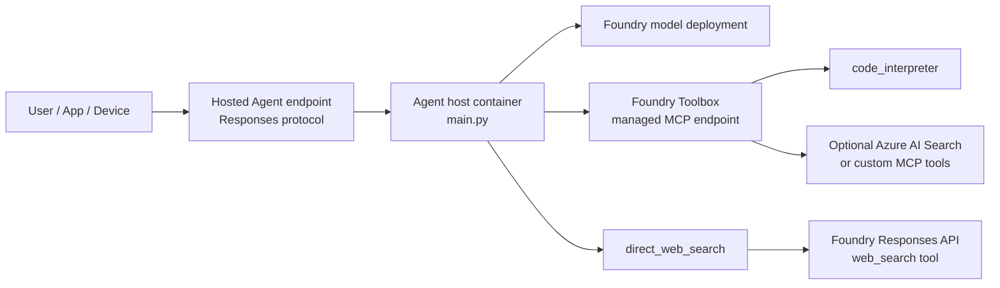

# Microsoft Foundry Hosted Agent + Toolbox Demo

[中文版](README-CN.md) | [Why This Architecture](docs/why-this-architecture.md) | [Trade-offs](docs/architecture-tradeoffs.md) | [Comparison](docs/comparison.md) | [MCP Deep Dive](docs/mcp-protocol-deep-dive.md) | [Request Flow + Latency](docs/request-flow-with-budget.md) | [Failure Modes](docs/failure-modes.md) | [Production Scale](docs/production-scale.md) | [Hybrid Edge-Cloud](docs/hybrid-edge-cloud.md) | [Voice & Multimodal](docs/voice-and-multimodal.md) | [Architecture](docs/architecture.md) | [Demo Script](docs/demo-script.md) | [Scenario Mapping](docs/scenario-mapping.md) | [Troubleshooting](docs/troubleshooting.md)

This repo is a complete, runnable reference for a Microsoft Agent Framework service that can be deployed as a Microsoft Foundry Hosted Agent and connected to a Microsoft Foundry Toolbox. It demonstrates a cloud-side agent endpoint, a governed MCP tool bundle, and a direct Responses API `web_search` fallback for current public facts.

The demo is intentionally customer-neutral. Use it as a public reference for AI application, AI device, gaming cloud, enterprise assistant, or developer-tool scenarios where a host agent needs to call a shared tool catalog.

## Executive Summary

| Area | What this repo demonstrates | Status |
| --- | --- | --- |
| Hosted Agent runtime | `main.py` serves an Agent Framework agent through the Responses protocol. | Implemented |
| Toolbox integration | `MCPStreamableHTTPTool` connects to a Foundry Toolbox MCP endpoint with the required preview header. | Implemented |
| Code Interpreter | Toolbox-managed `code_interpreter` performs a real calculation through MCP. | Verified |
| Web Search | `direct_web_search` calls the Foundry Responses API with `tools: [{"type":"web_search"}]`. | Verified |
| HTTP endpoint test | `scripts/http_smoke_test.py` validates the local `/responses` endpoint. | Included |
| Repo quality check | `scripts/repo_check.py` checks required files, Python syntax, manifest text, and obvious secret leaks. | Included |

Sources used for implementation and docs:

- Hosted Agents concept: https://learn.microsoft.com/en-us/azure/foundry/agents/concepts/hosted-agents
- Toolbox how-to: https://learn.microsoft.com/en-us/azure/foundry/agents/how-to/tools/toolbox
- Official Foundry Toolbox + Agent Framework sample entry point: https://aka.ms/foundry-toolbox-maf
- Azure AI Foundry OpenAI web search: https://learn.microsoft.com/en-us/azure/foundry/openai/how-to/web-search
- Hosted Agents blog: https://devblogs.microsoft.com/foundry/introducing-the-new-hosted-agents-in-foundry-agent-service-secure-scalable-compute-built-for-agents/
- Toolbox blog: https://devblogs.microsoft.com/foundry/introducing-toolboxes-in-foundry/

> Preview note: Hosted Agents and Toolbox are preview features. Package names, manifest shape, and endpoint behavior can change. This repo follows the public Learn pages and the official sample entry point above.

## Architecture



The hosted agent is your containerized code. The toolbox is a managed tool bundle in the Foundry project. Updating the toolbox default version can change the tool set without rebuilding the agent container, as long as `TOOLBOX_NAME` and tool names remain compatible.

The direct web-search path is intentionally separate. In the current implementation, Toolbox MCP is the governed path for `code_interpreter`; direct Responses API `web_search` is the documented and verified path for public web grounding.

## Mental Model

If you have built distributed systems before, the architecture maps to ideas you already know:

| If you know this... | ...this maps to |
| --- | --- |
| **API gateway** in front of N upstream services | Foundry Toolbox in front of N tools, with a single MCP endpoint and a `default_version` pointer (think: gateway versioning + service registry). |
| **Service mesh data plane** (sidecar handling auth, mTLS, retries, observability) | Toolbox runtime injects credentials, refreshes tokens, surfaces approval gating; agent code does not handle auth per tool. |
| **API contract version** behind a stable URL (e.g., `/v1`) | `default_version` of a Toolbox: change the impl, keep the URL stable. |
| **Per-pod identity** in Kubernetes (workload identity) | Per-agent Microsoft Entra ID auto-issued at deploy; agent acts as itself, not as the caller. |
| **Sidecar pattern** (your code + a managed companion process) | Hosted Agent container + the platform's Responses protocol library and observability injection. |
| **Orthogonal lifecycles** (config vs binary) | Tool inventory (config-fast) vs agent code (binary-slow); split because they evolve differently. |

The one-liner: **the toolbox is a versioned tool catalog with a single MCP front door; the hosted agent is your container with a stable Responses endpoint and a per-agent identity**. Everything else follows.

For the first-principles derivation, see [docs/why-this-architecture.md](docs/why-this-architecture.md). For the explicit cost of every design decision, see [docs/architecture-tradeoffs.md](docs/architecture-tradeoffs.md).

## Repo Layout

| Path | Purpose |
| --- | --- |
| `main.py` | Agent Framework Responses host that loads a Foundry Toolbox and optional direct web-search tool. |
| `agent.yaml` | Hosted Agent runtime definition for the Responses protocol. |
| `agent.manifest.yaml` | Declarative sample manifest with a model and a toolbox. |
| `Dockerfile` | Container image for the hosted agent. |
| `.env.example` | Local configuration template. |
| `scripts/create_toolbox.py` | Creates a Toolbox version through `azure-ai-projects`. |
| `scripts/verify_toolbox.py` | Lists tools exposed by a Toolbox MCP endpoint. |
| `scripts/smoke_test.py` | End-to-end in-process test for `direct_web_search` and Toolbox `code_interpreter`. |
| `scripts/http_smoke_test.py` | HTTP test for a running local `/responses` server. |
| `scripts/repo_check.py` | Local repo quality and syntax check. |
| `scripts/measure_latency.py` | Measures p50 / p95 / mean latency of the hosted-agent endpoint. |
| `infra/setup_foundry.py` | One-shot CLI to create the resource group, account, and model deployments. |
| `examples/hybrid-edge-cloud/` | Live edge-cloud demo: edge writes a contract, cloud handoff invokes the hosted agent. |
| `examples/custom-mcp-server/` | Minimal custom MCP server + client (exposes `device_health_check`, `policy_evaluate`). |
| `examples/requests/` | Request bodies for manual `curl` or API testing. |
| `docs/why-this-architecture.md` | First-principles derivation of the hosted-agent + toolbox shape. |
| `docs/architecture-tradeoffs.md` | Explicit Latency / Governance / Flexibility trade-offs. |
| `docs/comparison.md` | Customer-neutral comparison vs OpenAI Assistants, Bedrock Agents, Vertex AI, LangGraph, Semantic Kernel. |
| `docs/mcp-protocol-deep-dive.md` | MCP protocol mechanics as used by this repo. |
| `docs/request-flow-with-budget.md` | End-to-end request flow with token and latency budgets. |
| `docs/failure-modes.md` | Per-layer failure catalog and recovery patterns. |
| `docs/production-scale.md` | Multi-region / multi-tenant / cost / security checklist. |
| `docs/hybrid-edge-cloud.md` | Edge-cloud agent composition: shared task contract, hand-off patterns, failure cases. |
| `docs/voice-and-multimodal.md` | Voice (real-time + batch), image generation, slide generation, multimodal input patterns. |
| `docs/architecture.md` | Original architecture diagrams and request flow. |
| `docs/demo-script.md` | Customer-neutral live demo flow. |
| `docs/scenario-mapping.md` | Generic mapping to AI device, gaming cloud, enterprise assistant, dev tools. |
| `docs/troubleshooting.md` | Hands-on fix guide for common errors. |
| `docs/validation.md` | Three-layer validation procedure (static / MCP listing / smoke test). |

## Prerequisites

1. A Microsoft Foundry project.
2. A model deployment in that project, for example a deployment named `gpt-4-1-mini` for `gpt-4.1-mini`.
3. Azure RBAC: grant `Azure AI User` on the Foundry project to your developer identity and, for hosted deployment, to the agent identity.
4. Local authentication through `az login` or another `DefaultAzureCredential` source.
5. Python 3.11+.

Local setup:

```bash
python -m venv .venv
source .venv/bin/activate
pip install -r requirements.txt
```

If your workstation has multiple Azure tenants, set the intended subscription before running local tests:

```bash
az account set --subscription <subscription-id>
```

## Configure

Copy `.env.example` to `.env` and fill in your Foundry project values:

```bash
FOUNDRY_PROJECT_ENDPOINT=https://<account>.services.ai.azure.com/api/projects/<project>
AZURE_AI_MODEL_DEPLOYMENT_NAME=gpt-4-1-mini
TOOLBOX_NAME=agent-tools
AZURE_AUTH_MODE=cli
PORT=8088
ENABLE_DIRECT_WEB_SEARCH=true
```

For local development, `AZURE_AUTH_MODE=cli` forces `AzureCliCredential`, which is useful when a machine has multiple tenants. In a hosted deployment, keep the default credential chain and use managed identity/RBAC.

The default consumer Toolbox MCP endpoint is generated from `FOUNDRY_PROJECT_ENDPOINT` and `TOOLBOX_NAME`:

```text
https://<account>.services.ai.azure.com/api/projects/<project>/toolboxes/<toolbox-name>/mcp?api-version=v1
```

Every Toolbox MCP request includes the preview header required by the Toolbox docs:

```text
Foundry-Features: Toolboxes=V1Preview
```

## Create The Toolbox

Option A: use `agent.manifest.yaml` during Foundry Toolkit or `azd` deployment. It declares a sample toolbox named `agent-tools` with `code_interpreter`.

Option B: create or update the toolbox from code:

```bash
python scripts/create_toolbox.py \
  --toolbox-name agent-tools \
  --with-code-interpreter \
  --set-default
```

The script prints both endpoint forms described in the Toolbox docs:

| Endpoint | Use |
| --- | --- |
| Version endpoint | Validate one immutable toolbox version. |
| Consumer endpoint | Connect agents to the current default toolbox version. |

You can add `--with-web-search` to create a toolbox version that includes a preview `web_search` tool. Live service behavior can vary: listing the tool through MCP does not guarantee runtime invocation succeeds. This repo therefore uses the reliable split below:

| Capability | Path used by this repo |
| --- | --- |
| Governed code execution | Toolbox MCP `code_interpreter` |
| Current public web facts | Direct Responses API `web_search` through `direct_web_search` |

## Verify The Toolbox

Before running the agent, confirm the Toolbox endpoint exposes tools:

```bash
python scripts/verify_toolbox.py \
  --endpoint "https://<account>.services.ai.azure.com/api/projects/<project>/toolboxes/agent-tools/mcp?api-version=v1"
```

Expected output:

```text
Tools found: 1
- code_interpreter: Execute Python code for calculations and data analysis.
```

If `web_search` appears, treat that as availability for listing only. Runtime web grounding in this repo uses `direct_web_search`.

## Run The In-Process Smoke Test

This test does not start the HTTP server. It creates an Agent Framework agent in process and verifies both tool paths:

```bash
python scripts/smoke_test.py
```

Expected markers:

```text
WEB_RESULT_START
...
WEB_RESULT_END
CODE_RESULT_START
The sum of the squares of the integers from 1 to 5 is 55.
CODE_RESULT_END
```

## Run The Local Responses Server

Start the server:

```bash
python main.py
```

Use the included request bodies from another terminal:

```bash
curl -X POST http://localhost:8088/responses \
  -H "Content-Type: application/json" \
  --data @examples/requests/code_interpreter.json
```

```bash
curl -X POST http://localhost:8088/responses \
  -H "Content-Type: application/json" \
  --data @examples/requests/direct_web_search.json
```

Or run the HTTP smoke test:

```bash
python scripts/http_smoke_test.py --base-url http://localhost:8088
```

## Hybrid Edge-Cloud Demo (Live)

A minimal end-to-end demo that proves the edge-cloud pattern from `docs/hybrid-edge-cloud.md`. The local Python "edge" generates fake sensor data, hands a task contract to the cloud-side hosted agent (this repo), which uses Toolbox `code_interpreter` to compute statistics and reply with a ventilation recommendation.

```bash
# Terminal 1
python main.py

# Terminal 2
cd examples/hybrid-edge-cloud
python edge_agent.py     # writes contract.json with sensor artifact
python cloud_handoff.py  # cloud picks up + answers via code_interpreter
```

Verified end-to-end on 2026-05-09: hosted agent invoked `code_interpreter` through the toolbox, computed mean / max / min on real sensor JSON, returned a one-paragraph recommendation. See [`examples/hybrid-edge-cloud/README.md`](examples/hybrid-edge-cloud/README.md).

## Optional: Image Generation Tool (Live)

`main.py` includes a `direct_image_generate` tool (off by default) that calls the Foundry `/openai/v1/images/generations` endpoint. Enable it by setting in `.env`:

```bash
AZURE_AI_IMAGE_DEPLOYMENT_NAME=gpt-image-1
ENABLE_DIRECT_IMAGE_GENERATE=true
```

Deploy the image model first (one-time):

```bash
az cognitiveservices account deployment create -g <rg> -n <account> \
  --deployment-name gpt-image-1 --model-name gpt-image-1 --model-version 2025-04-15 \
  --model-format OpenAI --sku-name GlobalStandard --sku-capacity 1
```

Verified end-to-end on 2026-05-09: agent generated a 1024×1024 watercolor image (`b64_json` length 2,680,868 chars).

## Custom MCP Server Example (Live)

`examples/custom-mcp-server/` runs a minimal MCP server locally (exposes `device_health_check` and `policy_evaluate`) so you can see the full custom-tool wire shape before registering it into a Toolbox:

```bash
# Terminal 1
cd examples/custom-mcp-server
python custom_mcp_server.py     # serves http://0.0.0.0:9100/mcp

# Terminal 2
python custom_mcp_client.py     # tools/list + tools/call validation
```

Verified end-to-end on 2026-05-09: `tools/list` returned both tools; `tools/call` produced the deterministic `critical / page on-call` and `needs_approval` results. See [`examples/custom-mcp-server/README.md`](examples/custom-mcp-server/README.md) for how to register it into a Foundry Toolbox.

## Measured Latency

```bash
python main.py                                        # Terminal 1
python scripts/measure_latency.py --iterations 5      # Terminal 2
```

Measured on 2026-05-09 against the local hosted agent (eastus2 Foundry project, gpt-4-1-mini, 3 iterations, no streaming, no warm-up):

| Path | mean | p50 | p95 | max |
| --- | :-: | :-: | :-: | :-: |
| `code_interpreter` via Toolbox MCP | 8.9 s | 9.6 s | 10.8 s | 10.9 s |
| `direct_web_search` via Responses API | 18.1 s | 16.4 s | 23.6 s | 24.4 s |

Full analysis lives in [`docs/request-flow-with-budget.md`](docs/request-flow-with-budget.md).

## One-shot Foundry Resource Setup

For a brand-new subscription, `infra/setup_foundry.py` creates the resource group, account, chat deployment, and (optionally) the image deployment with one command:

```bash
az login
az account set --subscription <id>
python infra/setup_foundry.py \
  --resource-group rg-toolbox-demo \
  --account toolbox-demo-ais \
  --project toolbox-project-v2 \
  --location eastus2 \
  --with-image
```

The script then prints the `.env` block to copy into the repo root. The Foundry project itself still needs to be created in the Foundry portal (`az` does not expose project creation today); the script reminds you and prints the URL.

## Deploy As A Hosted Agent

The included `agent.yaml`, `agent.manifest.yaml`, and `Dockerfile` are shaped for Foundry Hosted Agents. The Hosted Agents docs describe the deployment flow: package the agent as a container, deploy it into Agent Service, and expose the Responses endpoint.

With the Foundry `azd` extension installed, deploy from this repo directory:

```bash
azd extension install azure.ai.agents
azd auth login
azd provision
azd deploy
```

After deployment, the hosted Responses endpoint follows this pattern:

```text
{project_endpoint}/agents/{agent_name}/endpoint/protocols/openai/v1/responses
```

## Scenario Patterns

This sample is not tied to a single industry. The same shape applies whenever a host agent should expose a stable endpoint while tools evolve behind a managed catalog:

| Scenario | Hosted Agent role | Toolbox role |
| --- | --- | --- |
| AI native device | Cloud-side agent endpoint for device or app calls. | Device diagnostics, cloud search, account services, policy tools. |
| Gaming cloud | Player-support or game-ops agent. | Match telemetry, entitlement checks, knowledge search, code/data analysis. |
| Enterprise assistant | Governed agent endpoint for business workflows. | Internal APIs, search, code interpreter, ticketing, approvals. |
| Developer tools | Agent endpoint for automation tasks. | CI checks, repo search, test execution, package metadata lookup. |

See [docs/scenario-mapping.md](docs/scenario-mapping.md) for a deeper customer-neutral mapping.

## When NOT To Use This Architecture

This pattern is not universal. Skip it (or pick something simpler) when:

| Situation | Better choice |
| --- | --- |
| Single tool, single team, single tenant | Direct model call from your app with in-process tool functions. |
| On-device / edge agent with no cloud round-trip | Local agent runtime with on-device tools (e.g., Foundry Local). |
| Hard real-time loop with sub-500 ms TTFT requirement | Embed a model client directly; the container hop is overhead. |
| Deterministic data pipeline that does not need an LLM planner | A workflow engine (Durable Functions, Step Functions) is a cleaner fit. |
| Pure OpenAI ecosystem with no Azure data plane | OpenAI Assistants API; see [docs/comparison.md](docs/comparison.md). |
| AWS- or GCP-only stack | Bedrock Agents or Vertex AI Agent Builder; see [docs/comparison.md](docs/comparison.md). |

A first-principles version of these boundaries is in [docs/why-this-architecture.md](docs/why-this-architecture.md) §9.

## Related Repos in This Series

These repos in [`david-share`](https://github.com/davidsky-msft/david-share) cover adjacent patterns. Pair them with this demo when your scenario crosses boundaries:

| Repo | What it covers |
| --- | --- |
| [`Microsoft-Agent-Framework`](../Microsoft-Agent-Framework/) | Agent Framework workflow patterns: human-in-the-loop pipelines and `MagenticBuilder` orchestration. |
| [`Azure-MCP-Solution`](../Azure-MCP-Solution/) | Building and operating MCP servers on Azure that a Toolbox can consume. |
| [`A2A-Demo`](../A2A-Demo/) | Agent-to-agent delegation patterns; pairs with Toolbox's `A2A` tool type. |
| [`Magentic-One`](../Magentic-One/) | Multi-agent orchestration above the single-agent shape demonstrated here. |
| [`AI-Agent-Private-Endpoint`](../AI-Agent-Private-Endpoint/) | Private link / VNet patterns when your hosted agent must reach private resources. |
| [`AI-Foundry-Agent-VNET-Deployment`](../AI-Foundry-Agent-VNET-Deployment/) | Network-isolated Foundry agent deployment recipes. |
| [`Foundry-IQ`](../Foundry-IQ/) | Foundry knowledge-grounding patterns to combine with Toolbox `azure_ai_search` and `file_search`. |

## Troubleshooting

Start with [docs/troubleshooting.md](docs/troubleshooting.md). The most common issues are:

| Symptom | Likely cause | Fix |
| --- | --- | --- |
| `401 Unauthorized` from Toolbox MCP | Missing token, wrong tenant, or missing preview header. | Use `AZURE_AUTH_MODE=cli`, set the right `az account`, and keep `Foundry-Features: Toolboxes=V1Preview`. |
| `prompts/list` error | Foundry Toolbox MCP endpoint does not implement MCP prompts. | Keep `load_prompts=False`. |
| `DeploymentNotFound` when invoking Toolbox `web_search` | Preview service-side runtime path issue. | Use `direct_web_search`, which calls documented Responses API `web_search`. |
| `ModuleNotFoundError: main` in scripts | Script cannot find repo root. | Run from repo root; scripts also add the repo root to `sys.path`. |
| Missing env var | `.env` is incomplete. | Compare with `.env.example`. |

## Quality Check

Run the local repository check before sharing or committing:

```bash
python scripts/repo_check.py
```

The check validates required files, Python syntax, important manifest/environment text, and obvious secret patterns in commit-worthy files. It intentionally skips `.env`, `.venv`, caches, and binary files.

## Production Notes

- Keep secrets out of `.env`, images, manifests, screenshots, and logs. Use Foundry connections, managed identities, Key Vault, and RBAC.
- Treat Hosted Agents and Toolbox as preview features; pin and test package versions for any customer-facing delivery.
- For OAuth-backed MCP tools, the first call can return consent required error `-32006`; complete user consent and retry.
- Keep `load_prompts=False` for Toolbox MCP clients unless the endpoint adds prompt support.
- Review the Azure AI Foundry OpenAI Web Search docs for data handling and pricing before production use.
- Keep public repos customer-neutral. Put customer-specific mapping, private endpoints, subscriptions, screenshots, and notes in a private working directory.

## Project Information

| Item | Value |
| --- | --- |
| Author | 魏新宇 (Xinyu Wei) |
| Date | 2026-05 |
| Status | Runnable reference demo |
| Runtime | Microsoft Agent Framework + Foundry Hosted Agents Responses protocol |
| Tooling | Microsoft Foundry Toolbox MCP + direct Foundry Responses API web search |