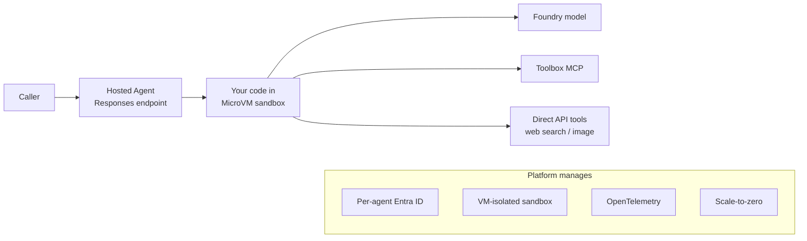
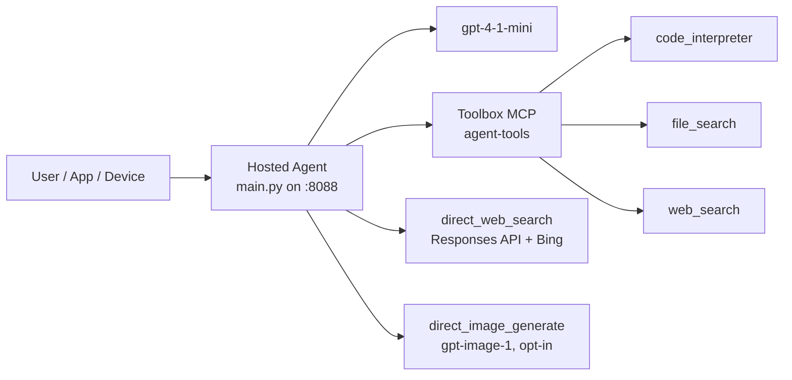
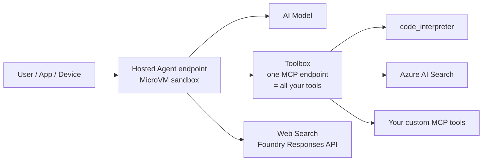
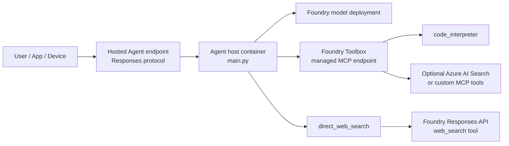

# Microsoft Foundry Hosted Agent + Toolbox Demo

## Running on Azure

This project runs on **Azure AI Foundry** with Microsoft Agent Framework, Foundry Toolbox (3 tools: code_interpreter + web_search + file_search), and Foundry Hosted Agents.

> **Author**: Xinyu Wei (魏新宇) — Microsoft AI GBB Senior System Engineer

[中文版](README-CN.md)

---

## 1. What Is Foundry Toolbox — and Why It Matters

A **Toolbox** is a managed, versioned bundle of tools inside a Microsoft Foundry project. You define which tools to include, configure auth centrally, and expose the bundle as a **single MCP-compatible endpoint** that any agent can consume.

### Toolbox advantages

| Advantage | What it means |
| --- | --- |
| **Single endpoint for all tools** | One MCP URL = all tools. The agent connects once; no per-tool wiring. |
| **Centralized auth & governance** | Credentials, approval gating (`require_approval`), and RBAC live in the toolbox, not in agent code. |
| **Versioned & immutable** | Each `ToolboxVersionObject` is a snapshot. Promote `default_version` atomically; roll back in one call. |
| **Framework-agnostic consumption** | Any MCP-compatible client can use it: Microsoft Agent Framework, LangGraph, Semantic Kernel, GitHub Copilot SDK, Claude Code. |
| **Tool diversity in one catalog** | Mix built-in tools (Code Interpreter, Web Search, Azure AI Search, File Search) with custom MCP servers, OpenAPI endpoints, and Agent-to-Agent (A2A) tools — all in one bundle. |
| **Decouple tool lifecycle from agent lifecycle** | Add, remove, or reconfigure tools without redeploying the agent container. |

### Toolbox full lifecycle (4 pillars)

<div align="center">

<br/><em>Source: <a href="https://devblogs.microsoft.com/foundry/introducing-toolboxes-in-foundry/">Introducing Toolboxes in Foundry</a> (Microsoft Foundry Blog)</em>
</div>

> Source: [Curate intent-based toolbox in Foundry](https://learn.microsoft.com/en-us/azure/foundry/agents/how-to/tools/toolbox) · [Introducing Toolboxes in Foundry (blog)](https://devblogs.microsoft.com/foundry/introducing-toolboxes-in-foundry/)

### The problem Toolbox solves (before vs after)

<div align="center">

<br/><em>Source: <a href="https://devblogs.microsoft.com/foundry/introducing-toolboxes-in-foundry/">Introducing Toolboxes in Foundry</a> (Microsoft Foundry Blog)</em>
</div>

### Toolbox architecture

<div align="center">

<br/><em>Source: <a href="https://learn.microsoft.com/en-us/azure/foundry/agents/how-to/tools/toolbox">Curate intent-based toolbox in Foundry</a> (Microsoft Learn)</em>
</div>

---

## 2. What Is Foundry Hosted Agent — and Why It Matters

A **Hosted Agent** is your own agent code running on Foundry Agent Service. You package it as a container image, but the platform runs it in a **MicroVM sandbox** (not a traditional container) — each session gets its own VM-isolated environment with persistent `$HOME` and `/files`. The platform provides compute, identity, networking, observability, and a stable endpoint. You write the agent logic; the platform handles everything else.

### Hosted Agent advantages

| Advantage | What it means |
| --- | --- |
| **Per-agent identity** | Each agent gets its own Microsoft Entra ID at deploy time — calls to models, tools, and downstream services are identity-scoped. |
| **Stable HTTP endpoint** | `{project}/agents/{name}/endpoint/protocols/openai/v1/responses` — callers point here; compute moves behind it. |
| **Per-session VM-isolated MicroVM** | `$HOME` and `/files` persist across turns and across idle; sessions resume with full state. Not a traditional container — kernel-level isolation. |
| **Scale-to-zero** | 15-minute idle timeout → deprovision. Next request → resume with state. You pay only for active sessions. |
| **Bring any framework** | Agent Framework, LangGraph, Semantic Kernel, or raw Python/C# — the container is yours. |
| **Built-in observability** | OpenTelemetry traces auto-injected into Application Insights. |
| **Version pinning & traffic splitting** | Immutable agent versions; canary / blue-green with weighted rollouts. |

> Source: [What are hosted agents?](https://learn.microsoft.com/en-us/azure/foundry/agents/concepts/hosted-agents) · [Hosted Agents blog](https://devblogs.microsoft.com/foundry/introducing-the-new-hosted-agents-in-foundry-agent-service-secure-scalable-compute-built-for-agents/)

### Hosted Agent architecture



---

## 3. What We Built in This Demo

### Toolbox contents (our experiment)

We created a Foundry Toolbox named `agent-tools` with the following tools:

| Tool | Type | What it does in this demo | Runtime status |
| --- | --- | --- | --- |
| `code_interpreter` | Built-in (Toolbox) | Executes Python in a managed sandbox — the agent sends code, the sandbox returns results. Used for computation tasks. | ✅ Verified end-to-end |
| `web_search` | Built-in (Toolbox) | Searches the public web via Bing grounding. Lists correctly through MCP `tools/list`. | ⚠️ Lists OK; runtime invoke returns a tool error in some projects (preview). The agent auto-falls-back to `direct_web_search`. |
| `file_search` | Built-in (Toolbox) | Searches uploaded documents in a vector store for relevant passages. We uploaded `docs/why-this-architecture.md` as test content. | ✅ Verified end-to-end — agent accurately quoted the MCP vs function-calling passage from the uploaded doc. |

We demonstrate both the **governed Toolbox path** (code_interpreter and file_search work end-to-end) and the **Responses API fallback** (direct_web_search for web grounding). See `scripts/create_toolbox.py --with-web-search --with-code-interpreter --with-file-search` for how all three were registered.

### Hosted Agent contents (our experiment)

Our hosted agent container (`main.py`) includes:

| Component | Package / module | Purpose |
| --- | --- | --- |
| Agent Framework core | `agent-framework==1.3.0` | Agent runtime: planning, tool dispatch, message assembly. |
| Foundry chat client | `agent-framework-foundry==1.3.0` | `FoundryChatClient` connects to Foundry model deployments. |
| Hosted runtime | `agent-framework-foundry-hosting==1.0.0a260507` | `ResponsesHostServer` exposes the Responses protocol on `0.0.0.0:8088`. |
| MCP tool bridge | `MCPStreamableHTTPTool` (from agent-framework) | Connects to Toolbox MCP endpoint with auth + preview header. |
| `direct_web_search` | Custom `@tool` function in `main.py` | Calls Foundry Responses API with `tools:[{"type":"web_search"}]` for grounded public web answers. |
| `direct_image_generate` | Custom `@tool` function in `main.py` (opt-in) | Calls Foundry `/openai/v1/images/generations` for image generation. |
| Model deployment | `gpt-4-1-mini` (gpt-4.1-mini) | The LLM that does planning and final answer composition. |
| Azure credential | `azure-identity==1.25.3` | `AzureCliCredential` (local) or `DefaultAzureCredential` (hosted). |

### Combined architecture



---

## 4. Why We Designed These Scenarios

Each demo scenario is designed to prove a specific architectural claim:

| Scenario | What it proves | Why it matters to customers |
| --- | --- | --- |
| **Code via Toolbox** | The Toolbox MCP path works end-to-end: agent → model → MCP `tools/call` → sandbox → result. | Customers need to trust that governed tools actually execute correctly through the catalog. |
| **Web search via Responses API** | A direct Responses API tool coexists with Toolbox tools in the same agent. | Customers need both governed tools (Toolbox) and documented runtime tools (Responses API) in one agent. |
| **Edge-cloud handoff** | A local "device" and a cloud hosted agent can share a task through a JSON contract — no direct tool coupling. | Customers building AI native devices need edge-cloud continuity without the device calling cloud tools directly. |
| **Image generation** | Adding a new capability is one `@tool` function + one model deployment — no toolbox change, no agent rebuild. | Customers want to extend the agent quickly without touching the governed catalog for every experiment. |
| **Custom MCP server** | A custom MCP server can be built, tested locally, and then registered into a Toolbox — the agent discovers it automatically. | Customers with their own backend APIs need a clear path from local prototype to governed catalog. |
| **Latency measurement** | Real p50/p95/mean numbers replace illustrative budgets. | Customers making go/no-go decisions need data, not estimates. |

---

## 5. Verification Results

All scenarios were tested end-to-end against real Foundry resources (eastus2, private subscription) on 2026-05-09.

### Real agent output (captured live, not mocked)

<details>
<summary><strong>Demo 1 — code_interpreter via Toolbox MCP</strong> (click to expand)</summary>

**User input:**
```
Use code_interpreter to calculate the first 10 Fibonacci numbers and return them as a Python list.
```

**Agent response (9.3 s):**
> The first 10 Fibonacci numbers are: **[0, 1, 1, 2, 3, 5, 8, 13, 21, 34]**

**What happened behind the scenes:**
```
→ Agent called gpt-4-1-mini (planning)
→ Model emitted function_call: code_interpreter
→ Toolbox MCP forwarded to Python sandbox
→ Sandbox executed real Python and returned [0, 1, 1, 2, 3, 5, 8, 13, 21, 34]
→ Agent called gpt-4-1-mini (final answer)
→ Total: 2 model calls + 1 MCP tools/call
```
</details>

<details>
<summary><strong>Demo 2 — file_search via Toolbox MCP</strong> (click to expand)</summary>

**User input:**
```
Use file_search to find what the uploaded document says about the difference
between Toolbox MCP and raw MCP servers. Summarize in 2 sentences.
```

**Agent response (7.5 s):**
> The Toolbox MCP server sits in front of raw MCP servers to provide **aggregation of multiple tool types behind one endpoint**, letting agents connect once and discover all tools instead of managing multiple connections. Additionally, Toolbox adds **governance and version pinning**, allowing tool sets to be updated without redeploying agents, which raw MCP servers lack as they represent only the basic client-server tool protocol without these higher-level lifecycle and governance features.

**What happened behind the scenes:**
```
→ Agent called gpt-4-1-mini (planning)
→ Model emitted function_call: file_search
→ Toolbox MCP searched vector store vs_0Raxw5LUn5thdP7QMBfAdsKx
→ Retrieved passages from why-this-architecture.md (uploaded earlier)
→ Agent called gpt-4-1-mini (final answer with citations)
→ Total: 2 model calls + 1 MCP tools/call
```
</details>

<details>
<summary><strong>Demo 3 — direct_web_search via Responses API</strong> (click to expand)</summary>

**User input:**
```
Use direct_web_search to find the latest Microsoft Foundry Agent Service pricing.
Return a one-sentence summary with the source URL.
```

**Agent response (12.4 s):**
> Microsoft Foundry Agent Service pricing in 2026 follows a flexible token consumption model with pay-as-you-go and provisioned throughput options, with details available at the [Azure pricing page](https://azure.microsoft.com/pricing/details/foundry-agent-service/).

**What happened behind the scenes:**
```
→ Agent called gpt-4-1-mini (planning)
→ Model emitted function_call: direct_web_search
→ direct_web_search called Foundry Responses API with tools=[{"type":"web_search"}]
→ Bing grounding returned synthesized answer with URL citations
→ Agent called gpt-4-1-mini (final answer)
→ Total: 2 model calls + 1 Responses API web_search call
```
</details>

### Core paths

| Test | Tool path | Result |
| --- | --- | --- |
| `scripts/smoke_test.py` — code | Toolbox MCP → `code_interpreter` | **55** (sum of squares 1-5) ✅ |
| `scripts/smoke_test.py` — web | Direct Responses API `web_search` | Foundry Toolbox summary with source URLs ✅ |
| `scripts/http_smoke_test.py` | HTTP `/responses` endpoint → code + web | Both paths returned 200, correct content ✅ |

### Extended demos

| Test | Result |
| --- | --- |
| `examples/hybrid-edge-cloud/` | Edge wrote contract → cloud handoff invoked code_interpreter → returned ventilation recommendation with computed statistics (mean CO2 = 699 ppm) ✅ |
| `direct_image_generate` | Agent generated 1024×1024 watercolor image, `b64_json` length = 2,680,868 chars ✅ |
| `examples/custom-mcp-server/` | `tools/list` returned 2 tools; `tools/call` returned `critical / page on-call` and `needs_approval` ✅ |
| `file_search` (new) | Agent searched uploaded `why-this-architecture.md` and accurately quoted the MCP vs function-calling passage ✅ |

### Measured latency (3 iterations, warm, no streaming)

| Path | mean | p50 | p95 | max |
| --- | :-: | :-: | :-: | :-: |
| `code_interpreter` via Toolbox MCP | 8.9 s | 9.6 s | 10.8 s | 10.9 s |
| `direct_web_search` via Responses API | 18.1 s | 16.4 s | 23.6 s | 24.4 s |

> Model calls dominate latency (two per request: planning + final). The Toolbox MCP hop adds ~50-150 ms. Web search is dominated by Bing grounding (13-24 s range). Streaming would reduce perceived latency significantly.

### Repo quality

```text
PASS required files present (42 items)
PASS python files compile
PASS manifest and env text checks
PASS no obvious secrets or customer/internal terms in public files
PASS repo check complete
```

> Preview note: Hosted Agents and Toolbox are preview features. Package names, manifest shape, and endpoint behavior may change. This repo follows the public Learn pages and the official sample entry point at https://aka.ms/foundry-toolbox-maf.

---

## How It Works (One Picture)



Think of it this way:

| Everyday analogy | Maps to |
| --- | --- |
| Your phone's **App Store** | **Toolbox** — a catalog of tools the agent can discover and call. You update the catalog; apps (agents) pick up the new tools automatically. |
| The **app** on your phone | **Hosted Agent** — your code, running in a managed MicroVM sandbox, with its own identity and a stable address. |
| The **App Store updating an app without you doing anything** | Promoting a new `default_version` of the Toolbox — agents see new tools on their next call, no redeployment. |

For the distributed-systems mapping (API gateway, service mesh, workload identity), see the [Mental Model](#mental-model-for-distributed-systems-engineers) section below.

<details>
<summary><strong>📚 All documentation (14 articles, bilingual EN/CN)</strong></summary>

| Document | What it covers |
| --- | --- |
| [Why This Architecture](docs/why-this-architecture.md) | First-principles derivation from customer constraints |
| [Trade-offs](docs/architecture-tradeoffs.md) | Latency vs Governance vs Flexibility — what you pay |
| [Comparison](docs/comparison.md) | vs OpenAI Assistants, Bedrock Agents, Vertex AI, LangGraph, Semantic Kernel |
| [MCP Deep Dive](docs/mcp-protocol-deep-dive.md) | Wire-level MCP protocol as used by this repo |
| [Request Flow + Latency](docs/request-flow-with-budget.md) | Token + latency budgets with real measurements |
| [Failure Modes](docs/failure-modes.md) | Per-layer failure catalog and recovery patterns |
| [Production Scale](docs/production-scale.md) | Multi-region, multi-tenant, cost, security, compliance |
| [Hybrid Edge-Cloud](docs/hybrid-edge-cloud.md) | Edge-cloud agent composition with task contract |
| [Voice & Multimodal](docs/voice-and-multimodal.md) | Voice, image gen, slide gen, multimodal input |
| [Architecture](docs/architecture.md) | Detailed diagrams and request flow |
| [Demo Script](docs/demo-script.md) | Customer-neutral live demo flow |
| [Scenario Mapping](docs/scenario-mapping.md) | AI device, gaming cloud, enterprise assistant mapping |
| [Troubleshooting](docs/troubleshooting.md) | Common errors and fixes |
| [Validation](docs/validation.md) | Three-layer validation procedure |

</details>

## Architecture



The hosted agent is your containerized code. The toolbox is a managed tool bundle in the Foundry project. Updating the toolbox default version can change the tool set without rebuilding the agent container, as long as `TOOLBOX_NAME` and tool names remain compatible.

The direct web-search path is intentionally separate. In the current implementation, Toolbox MCP is the governed path for `code_interpreter`; direct Responses API `web_search` is the documented and verified path for public web grounding.

## Mental Model for Distributed-Systems Engineers

If you have built distributed systems before, the architecture maps to ideas you already know:

| If you know this... | ...this maps to |
| --- | --- |
| **API gateway** in front of N upstream services | Foundry Toolbox in front of N tools, with a single MCP endpoint and a `default_version` pointer (think: gateway versioning + service registry). |
| **Service mesh data plane** (sidecar handling auth, mTLS, retries, observability) | Toolbox runtime injects credentials, refreshes tokens, surfaces approval gating; agent code does not handle auth per tool. |
| **API contract version** behind a stable URL (e.g., `/v1`) | `default_version` of a Toolbox: change the impl, keep the URL stable. |
| **Per-pod identity** in Kubernetes (workload identity) | Per-agent Microsoft Entra ID auto-issued at deploy; agent acts as itself, not as the caller. |
| **Sidecar pattern** (your code + a managed companion process) | Hosted Agent container + the platform's Responses protocol library and observability injection. |
| **Orthogonal lifecycles** (config vs binary) | Tool inventory (config-fast) vs agent code (binary-slow); split because they evolve differently. |

The one-liner: **the toolbox is a versioned tool catalog with a single MCP front door; the hosted agent is your container with a stable Responses endpoint and a per-agent identity**. Everything else follows.

For the first-principles derivation, see [docs/why-this-architecture.md](docs/why-this-architecture.md). For the explicit cost of every design decision, see [docs/architecture-tradeoffs.md](docs/architecture-tradeoffs.md).

## Repo Layout

Core files:

| Path | Purpose |
| --- | --- |
| `main.py` | Agent host: loads Toolbox + optional web-search and image-gen tools, serves Responses protocol. |
| `scripts/smoke_test.py` | End-to-end test: code_interpreter + web search in one run. |
| `examples/hybrid-edge-cloud/` | Live edge-cloud demo: edge writes contract, cloud picks up via hosted agent. |
| `examples/custom-mcp-server/` | Minimal custom MCP server + client you can register into a Toolbox. |
| `infra/setup_foundry.py` | One-shot CLI to create Azure resources for this demo. |

<details>
<summary><strong>Full file inventory (click to expand)</strong></summary>

| Path | Purpose |
| --- | --- |
| `agent.yaml` | Hosted Agent runtime definition for the Responses protocol. |
| `agent.manifest.yaml` | Declarative sample manifest with a model and a toolbox. |
| `Dockerfile` | Container image for the hosted agent. |
| `.env.example` | Local configuration template. |
| `scripts/create_toolbox.py` | Creates a Toolbox version through `azure-ai-projects`. |
| `scripts/verify_toolbox.py` | Lists tools exposed by a Toolbox MCP endpoint. |
| `scripts/http_smoke_test.py` | HTTP test for a running local `/responses` server. |
| `scripts/repo_check.py` | Local repo quality and syntax check. |
| `scripts/measure_latency.py` | Measures p50 / p95 / mean latency of the hosted-agent endpoint. |
| `examples/requests/` | Request bodies for manual `curl` or API testing. |
| All 14 docs | See the documentation list above. |

</details>

## Prerequisites

1. A Microsoft Foundry project.
2. A model deployment in that project, for example a deployment named `gpt-4-1-mini` for `gpt-4.1-mini`.
3. Azure RBAC: grant `Azure AI User` on the Foundry project to your developer identity and, for hosted deployment, to the agent identity.
4. Local authentication through `az login` or another `DefaultAzureCredential` source.
5. Python 3.11+.

Local setup:

```bash
python -m venv .venv
source .venv/bin/activate
pip install -r requirements.txt
```

If your workstation has multiple Azure tenants, set the intended subscription before running local tests:

```bash
az account set --subscription <subscription-id>
```

## Configure

Copy `.env.example` to `.env` and fill in your Foundry project values:

```bash
FOUNDRY_PROJECT_ENDPOINT=https://<account>.services.ai.azure.com/api/projects/<project>
AZURE_AI_MODEL_DEPLOYMENT_NAME=gpt-4-1-mini
TOOLBOX_NAME=agent-tools
AZURE_AUTH_MODE=cli
PORT=8088
ENABLE_DIRECT_WEB_SEARCH=true
```

For local development, `AZURE_AUTH_MODE=cli` forces `AzureCliCredential`, which is useful when a machine has multiple tenants. In a hosted deployment, keep the default credential chain and use managed identity/RBAC.

The default consumer Toolbox MCP endpoint is generated from `FOUNDRY_PROJECT_ENDPOINT` and `TOOLBOX_NAME`:

```text
https://<account>.services.ai.azure.com/api/projects/<project>/toolboxes/<toolbox-name>/mcp?api-version=v1
```

Every Toolbox MCP request includes the preview header required by the Toolbox docs:

```text
Foundry-Features: Toolboxes=V1Preview
```

## Create The Toolbox

Option A: use `agent.manifest.yaml` during Foundry Toolkit or `azd` deployment. It declares a sample toolbox named `agent-tools` with `code_interpreter`.

Option B: create or update the toolbox from code:

```bash
python scripts/create_toolbox.py \
  --toolbox-name agent-tools \
  --with-code-interpreter \
  --set-default
```

The script prints both endpoint forms described in the Toolbox docs:

| Endpoint | Use |
| --- | --- |
| Version endpoint | Validate one immutable toolbox version. |
| Consumer endpoint | Connect agents to the current default toolbox version. |

You can add `--with-web-search` to create a toolbox version that includes a preview `web_search` tool. Live service behavior can vary: listing the tool through MCP does not guarantee runtime invocation succeeds. This repo therefore uses the reliable split below:

| Capability | Path used by this repo |
| --- | --- |
| Governed code execution | Toolbox MCP `code_interpreter` |
| Current public web facts | Direct Responses API `web_search` through `direct_web_search` |

## Verify The Toolbox

Before running the agent, confirm the Toolbox endpoint exposes tools:

```bash
python scripts/verify_toolbox.py \
  --endpoint "https://<account>.services.ai.azure.com/api/projects/<project>/toolboxes/agent-tools/mcp?api-version=v1"
```

Expected output:

```text
Tools found: 1
- code_interpreter: Execute Python code for calculations and data analysis.
```

If `web_search` appears, treat that as availability for listing only. Runtime web grounding in this repo uses `direct_web_search`.

## Run The In-Process Smoke Test

This test does not start the HTTP server. It creates an Agent Framework agent in process and verifies both tool paths:

```bash
python scripts/smoke_test.py
```

Expected markers:

```text
WEB_RESULT_START
...
WEB_RESULT_END
CODE_RESULT_START
The sum of the squares of the integers from 1 to 5 is 55.
CODE_RESULT_END
```

## Run The Local Responses Server

Start the server:

```bash
python main.py
```

Use the included request bodies from another terminal:

```bash
curl -X POST http://localhost:8088/responses \
  -H "Content-Type: application/json" \
  --data @examples/requests/code_interpreter.json
```

```bash
curl -X POST http://localhost:8088/responses \
  -H "Content-Type: application/json" \
  --data @examples/requests/direct_web_search.json
```

Or run the HTTP smoke test:

```bash
python scripts/http_smoke_test.py --base-url http://localhost:8088
```

## Hybrid Edge-Cloud Demo (Live)

A minimal end-to-end demo that proves the edge-cloud pattern from `docs/hybrid-edge-cloud.md`. The local Python "edge" generates fake sensor data, hands a task contract to the cloud-side hosted agent (this repo), which uses Toolbox `code_interpreter` to compute statistics and reply with a ventilation recommendation.

```bash
# Terminal 1
python main.py

# Terminal 2
cd examples/hybrid-edge-cloud
python edge_agent.py     # writes contract.json with sensor artifact
python cloud_handoff.py  # cloud picks up + answers via code_interpreter
```

Verified end-to-end on 2026-05-09: hosted agent invoked `code_interpreter` through the toolbox, computed mean / max / min on real sensor JSON, returned a one-paragraph recommendation. See [`examples/hybrid-edge-cloud/README.md`](examples/hybrid-edge-cloud/README.md).

## Optional: Image Generation Tool (Live)

`main.py` includes a `direct_image_generate` tool (off by default) that calls the Foundry `/openai/v1/images/generations` endpoint. Enable it by setting in `.env`:

```bash
AZURE_AI_IMAGE_DEPLOYMENT_NAME=gpt-image-1
ENABLE_DIRECT_IMAGE_GENERATE=true
```

Deploy the image model first (one-time):

```bash
az cognitiveservices account deployment create -g <rg> -n <account> \
  --deployment-name gpt-image-1 --model-name gpt-image-1 --model-version 2025-04-15 \
  --model-format OpenAI --sku-name GlobalStandard --sku-capacity 1
```

Verified end-to-end on 2026-05-09: agent generated a 1024×1024 watercolor image (`b64_json` length 2,680,868 chars).

## Custom MCP Server Example (Live)

`examples/custom-mcp-server/` runs a minimal MCP server locally (exposes `device_health_check` and `policy_evaluate`) so you can see the full custom-tool wire shape before registering it into a Toolbox:

```bash
# Terminal 1
cd examples/custom-mcp-server
python custom_mcp_server.py     # serves http://0.0.0.0:9100/mcp

# Terminal 2
python custom_mcp_client.py     # tools/list + tools/call validation
```

Verified end-to-end on 2026-05-09: `tools/list` returned both tools; `tools/call` produced the deterministic `critical / page on-call` and `needs_approval` results. See [`examples/custom-mcp-server/README.md`](examples/custom-mcp-server/README.md) for how to register it into a Foundry Toolbox.

## Measured Latency

```bash
python main.py                                        # Terminal 1
python scripts/measure_latency.py --iterations 5      # Terminal 2
```

Measured on 2026-05-09 against the local hosted agent (eastus2 Foundry project, gpt-4-1-mini, 3 iterations, no streaming, no warm-up):

| Path | mean | p50 | p95 | max |
| --- | :-: | :-: | :-: | :-: |
| `code_interpreter` via Toolbox MCP | 8.9 s | 9.6 s | 10.8 s | 10.9 s |
| `direct_web_search` via Responses API | 18.1 s | 16.4 s | 23.6 s | 24.4 s |

Full analysis lives in [`docs/request-flow-with-budget.md`](docs/request-flow-with-budget.md).

## One-shot Foundry Resource Setup

For a brand-new subscription, `infra/setup_foundry.py` creates the resource group, account, chat deployment, and (optionally) the image deployment with one command:

```bash
az login
az account set --subscription <id>
python infra/setup_foundry.py \
  --resource-group rg-toolbox-demo \
  --account toolbox-demo-ais \
  --project toolbox-project-v2 \
  --location eastus2 \
  --with-image
```

The script then prints the `.env` block to copy into the repo root. The Foundry project itself still needs to be created in the Foundry portal (`az` does not expose project creation today); the script reminds you and prints the URL.

## Deploy As A Hosted Agent

The included `agent.yaml`, `agent.manifest.yaml`, and `Dockerfile` are shaped for Foundry Hosted Agents. The Hosted Agents docs describe the deployment flow: package the agent as a container, deploy it into Agent Service, and expose the Responses endpoint.

With the Foundry `azd` extension installed, deploy from this repo directory:

```bash
azd extension install azure.ai.agents
azd auth login
azd provision
azd deploy
```

After deployment, the hosted Responses endpoint follows this pattern:

```text
{project_endpoint}/agents/{agent_name}/endpoint/protocols/openai/v1/responses
```

## Scenario Patterns

This sample is not tied to a single industry. The same shape applies whenever a host agent should expose a stable endpoint while tools evolve behind a managed catalog:

| Scenario | Hosted Agent role | Toolbox role |
| --- | --- | --- |
| AI native device | Cloud-side agent endpoint for device or app calls. | Device diagnostics, cloud search, account services, policy tools. |
| Gaming cloud | Player-support or game-ops agent. | Match telemetry, entitlement checks, knowledge search, code/data analysis. |
| Enterprise assistant | Governed agent endpoint for business workflows. | Internal APIs, search, code interpreter, ticketing, approvals. |
| Developer tools | Agent endpoint for automation tasks. | CI checks, repo search, test execution, package metadata lookup. |

See [docs/scenario-mapping.md](docs/scenario-mapping.md) for a deeper customer-neutral mapping.

## When NOT To Use This Architecture

This pattern is not universal. Skip it (or pick something simpler) when:

| Situation | Better choice |
| --- | --- |
| Single tool, single team, single tenant | Direct model call from your app with in-process tool functions. |
| On-device / edge agent with no cloud round-trip | Local agent runtime with on-device tools (e.g., Foundry Local). |
| Hard real-time loop with sub-500 ms TTFT requirement | Embed a model client directly; the container hop is overhead. |
| Deterministic data pipeline that does not need an LLM planner | A workflow engine (Durable Functions, Step Functions) is a cleaner fit. |
| Pure OpenAI ecosystem with no Azure data plane | OpenAI Assistants API; see [docs/comparison.md](docs/comparison.md). |
| AWS- or GCP-only stack | Bedrock Agents or Vertex AI Agent Builder; see [docs/comparison.md](docs/comparison.md). |

A first-principles version of these boundaries is in [docs/why-this-architecture.md](docs/why-this-architecture.md) §9.

## Related Repos in This Series

These repos in [`david-share`](https://github.com/davidsky-msft/david-share) cover adjacent patterns. Pair them with this demo when your scenario crosses boundaries:

| Repo | What it covers |
| --- | --- |
| [`Microsoft-Agent-Framework`](../Microsoft-Agent-Framework/) | Agent Framework workflow patterns: human-in-the-loop pipelines and `MagenticBuilder` orchestration. |
| [`Azure-MCP-Solution`](../Azure-MCP-Solution/) | Building and operating MCP servers on Azure that a Toolbox can consume. |
| [`A2A-Demo`](../A2A-Demo/) | Agent-to-agent delegation patterns; pairs with Toolbox's `A2A` tool type. |
| [`Magentic-One`](../Magentic-One/) | Multi-agent orchestration above the single-agent shape demonstrated here. |
| [`AI-Agent-Private-Endpoint`](../AI-Agent-Private-Endpoint/) | Private link / VNet patterns when your hosted agent must reach private resources. |
| [`AI-Foundry-Agent-VNET-Deployment`](../AI-Foundry-Agent-VNET-Deployment/) | Network-isolated Foundry agent deployment recipes. |
| [`Foundry-IQ`](../Foundry-IQ/) | Foundry knowledge-grounding patterns to combine with Toolbox `azure_ai_search` and `file_search`. |

## Troubleshooting

Start with [docs/troubleshooting.md](docs/troubleshooting.md). The most common issues are:

| Symptom | Likely cause | Fix |
| --- | --- | --- |
| `401 Unauthorized` from Toolbox MCP | Missing token, wrong tenant, or missing preview header. | Use `AZURE_AUTH_MODE=cli`, set the right `az account`, and keep `Foundry-Features: Toolboxes=V1Preview`. |
| `prompts/list` error | Foundry Toolbox MCP endpoint does not implement MCP prompts. | Keep `load_prompts=False`. |
| `DeploymentNotFound` when invoking Toolbox `web_search` | Preview service-side runtime path issue. | Use `direct_web_search`, which calls documented Responses API `web_search`. |
| `ModuleNotFoundError: main` in scripts | Script cannot find repo root. | Run from repo root; scripts also add the repo root to `sys.path`. |
| Missing env var | `.env` is incomplete. | Compare with `.env.example`. |

## Quality Check

Run the local repository check before sharing or committing:

```bash
python scripts/repo_check.py
```

The check validates required files, Python syntax, important manifest/environment text, and obvious secret patterns in commit-worthy files. It intentionally skips `.env`, `.venv`, caches, and binary files.

## Production Notes

- Keep secrets out of `.env`, images, manifests, screenshots, and logs. Use Foundry connections, managed identities, Key Vault, and RBAC.
- Treat Hosted Agents and Toolbox as preview features; pin and test package versions for any customer-facing delivery.
- For OAuth-backed MCP tools, the first call can return consent required error `-32006`; complete user consent and retry.
- Keep `load_prompts=False` for Toolbox MCP clients unless the endpoint adds prompt support.
- Review the Azure AI Foundry OpenAI Web Search docs for data handling and pricing before production use.
- Keep public repos customer-neutral. Put customer-specific mapping, private endpoints, subscriptions, screenshots, and notes in a private working directory.

## Project Information

| Item | Value |
| --- | --- |
| Author | 魏新宇 (Xinyu Wei) |
| Date | 2026-05 |
| Status | Runnable reference demo |
| Runtime | Microsoft Agent Framework + Foundry Hosted Agents Responses protocol |
| Tooling | Microsoft Foundry Toolbox MCP + direct Foundry Responses API web search |