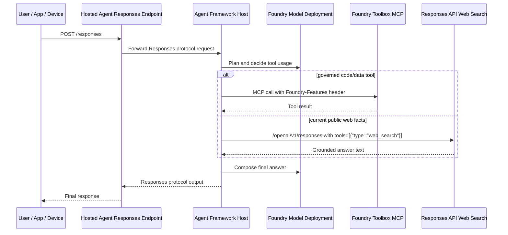
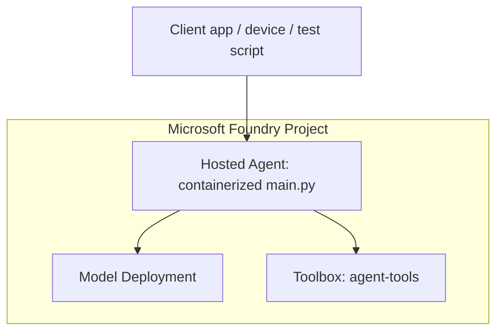

# Architecture

This repo separates three concerns:

1. The host agent exposes a stable Responses protocol endpoint.
2. Foundry Toolbox owns shared tools and exposes them through a managed MCP endpoint.
3. Direct Responses API `web_search` is used for public web grounding when current facts are needed.

Sources:

- Hosted Agents concept: https://learn.microsoft.com/en-us/azure/foundry/agents/concepts/hosted-agents
- Toolbox how-to: https://learn.microsoft.com/en-us/azure/foundry/agents/how-to/tools/toolbox
- Azure AI Foundry OpenAI web search: https://learn.microsoft.com/en-us/azure/foundry/openai/how-to/web-search

## Request Flow

## Why The Split Exists

| Capability | Preferred path | Reason |
| --- | --- | --- |
| Code execution and governed tools | Foundry Toolbox MCP | Toolbox centralizes tool packaging and versioning. |
| Current public web grounding | Direct Responses API `web_search` | This is the documented path for Foundry OpenAI web search. |
| Custom enterprise APIs | Toolbox MCP or connected MCP server | Keep auth, policy, and tool contracts behind a managed boundary. |

## Environment Contracts

| Variable | Required | Used by | Meaning |
| --- | --- | --- | --- |
| `FOUNDRY_PROJECT_ENDPOINT` | Yes | `main.py`, scripts | Foundry project endpoint. |
| `AZURE_AI_MODEL_DEPLOYMENT_NAME` | Yes | `main.py`, smoke tests | Model deployment name in the project. |
| `TOOLBOX_NAME` | Yes | `main.py`, scripts | Toolbox consumer name. |
| `TOOLBOX_MCP_ENDPOINT` | No | `main.py`, verification | Override for version-specific or custom endpoint tests. |
| `AZURE_AUTH_MODE=cli` | No | local scripts | Forces `AzureCliCredential` for multi-tenant local dev. |
| `ENABLE_DIRECT_WEB_SEARCH` | No | `main.py` | Enables the direct web-search tool. |
| `PORT` | No | `main.py` | Local Responses server port. |

## Deployment Shape

For production, grant the hosted agent identity the least RBAC required for the Foundry project and tool connections. Do not copy local `.env` secrets into the image or manifest.