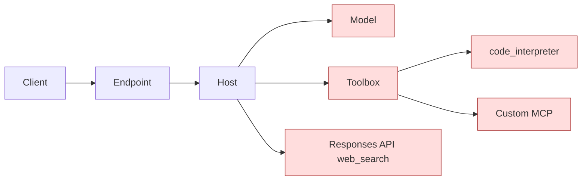

# 失败模式（Failure Modes）

本文按层列出 hosted-agent + toolbox 架构的失败模式：什么会失败、如何检测、如何隔离、如何恢复。目的是让每一层的失败都可观测、可控。

如果只记一条规则：

> **把 agent 当成有三个远程依赖（model、toolbox MCP、Responses API web search）的 microservice。每个依赖独立 timeout、独立 fallback、独立 error class。**

参考来源：

- Hosted Agents concept: https://learn.microsoft.com/en-us/azure/foundry/agents/concepts/hosted-agents
- Toolbox how-to（troubleshooting 表）: https://learn.microsoft.com/en-us/azure/foundry/agents/how-to/tools/toolbox
- 本 repo `docs/troubleshooting.md` 提供动手修复。

## 失败面

五个地方可能失败。Agent runtime 负责把每个失败转成给 caller 的清晰响应和清晰日志。

## Layer 1：Caller → Endpoint

| 失败 | 现象 | 检测 | 修复 |
| --- | --- | --- | --- |
| TLS / DNS | `connection refused`、`name resolution failed` | Caller 侧错误 | 退避重试；查 endpoint URL。 |
| 401 / 403 | Caller 认证不通过 | HTTP status | 验证 caller identity 有合适访问权。 |
| Agent endpoint 404 | URL 里 agent 名字错 | HTTP status | 确认 agent deployment name。 |

边界：caller 一侧的事，agent 还没责任。

## Layer 2：Hosted Agent Container

| 失败 | 现象 | 检测 | 修复 / 恢复 |
| --- | --- | --- | --- |
| 冷启动超时 | 首次 idle 后请求 >5 s | App Insights `Inbound POST /responses` duration | Heartbeat 预热；调 caller timeout。 |
| 启动 crash | 全部 5xx | App Insights container log | 查 env / image / RBAC；rollback。 |
| Image pull 失败 | 部署上不去 | Hosted Agent 部署日志 | 确认 project managed identity 有 ACR pull 权。 |
| Sandbox 存储用尽 | 写 `$HOME` / `/files` 失败 | Container log `disk full` | 限制 per-session 写入；turn 结束清理。 |
| Idle 回收后 resume | 15 分钟后首请求慢 | Session compute lifecycle | 设计如此 —— session 带状态 resume。在 caller UX 调 idle timeout。 |

边界：hosted agent 平台管 compute 生命周期。你的代码管启动、可观测、优雅退出。

## Layer 3：Foundry Model 调用

| 失败 | 现象 | 检测 | 修复 / 恢复 |
| --- | --- | --- | --- |
| 429 限流 | 突发流量 | HTTP status | 指数退避；考虑 PTU 或更高 quota。 |
| 500 / 503 | 区域瞬时 | HTTP status | 抖动重试；N 次失败后 circuit-break。 |
| Token 上限 | Prompt + output 太长 | HTTP error | 截 context；换更大上下文窗口。 |
| Wrong deployment | `DeploymentNotFound` | HTTP error | 验证 `AZURE_AI_MODEL_DEPLOYMENT_NAME` 对应真实 deployment。 |
| Hallucinated tool name | Model 发出 toolbox 没有的 tool 调用 | Agent runtime | 拒绝；要求 model 重试；记录用于 prompt 调优。 |

恢复模式：每次 model call 包 timeout（如 planning 30s、final 60s）。失败时给 caller 返回结构化 error（`error.code = MODEL_UNAVAILABLE`），不要泄露 stack trace。

## Layer 4：Toolbox MCP

Toolbox docs 有完整 troubleshooting 表。运维上最重要的：

| 现象 | 根因 | 修复 |
| --- | --- | --- |
| `tools/list` 返回 0 | Toolbox version 没 provision，或 MCP/A2A connection 无效 | 等 10 秒重试；验证 `project_connection_id`。 |
| `tools/list` 数量比预期少 | `allowed_tools` 过滤名字拼错 | 名字大小写敏感；重算过滤。 |
| `400 invalid_payload: Multiple tools without identifiers` | 同 type 两个无名 tool 在一个 toolbox | 给每个加唯一 `name`。 |
| `-32006 CONSENT_REQUIRED` | OAuth-backed MCP 需要 consent | 浏览器打开 URL 完成 OAuth；重试。 |
| `401` on MCP calls | Token 过期或 scope 错 | 刷 `https://ai.azure.com/.default` token。 |
| `500` on `prompts/list` | Foundry MCP 不实现 prompts | 设 `load_prompts=False`。 |
| `500` on `send_ping` | Foundry MCP 不实现 ping | 别调；或 override 成 no-op。 |
| `500` on non-streaming `tools/call` | 必须 streaming | 用 `stream=True`。 |
| Tool name 不匹配 | MCP tool name 带 `server_label` 前缀 | 用 `{server_label}.{tool_name}`（Copilot SDK 用 `_`）。 |
| 环境变量被覆盖 | 平台保留 `FOUNDRY_` 前缀 | 改成非 `FOUNDRY_` 名（本 repo 用 `TOOLBOX_MCP_ENDPOINT`）。 |

恢复模式：

- **Tool 列表缓存**：agent 启动缓存 `tools/list`；按计划或 `tools/call` 404 时刷新。限制 toolbox 瞬时失败的成本。
- **Per-tool timeout**：每个 `tools/call` 包 timeout（如 `code_interpreter` 60s、快 tool 30s）。Tool timeout 时取消 model turn 并通知 caller。
- **Per-tool circuit breaker**：某 tool 在窗口内 N 次失败 → 标 `unhealthy`，下一个 M 分钟 model planner 不应看到。

## Layer 5：Responses API Web Search

| 失败 | 现象 | 修复 |
| --- | --- | --- |
| Bing grounding 限流 | `/openai/v1/responses` 429 | 退避重试；考虑缓存重复 query。 |
| Region 不支持 web_search | 404 | Pin agent 和 search 到文档列出支持 web search 的 region。 |
| Citation 解析错误 | `output_text` 有效但无 annotations | 当 warning 处理；返回无 citation 的文本。 |

恢复模式：这条路径是公开网页 grounding 的 fallback。失败不应崩 agent；优雅降级到 "我没法搜索网页；以下是 model 训练数据里的内容" 并显式 caveat。

## Layer 6：Custom MCP Server（添加后）

通过 toolbox 加 custom MCP server 时：

| 失败 | 现象 | 修复 |
| --- | --- | --- |
| Custom MCP server 挂 | Toolbox `tools/list` 返回 0 个该 server 的 tool | 验证 upstream MCP server 健康；查 `project_connection_id`。 |
| Custom MCP 慢 | `tools/call` 超出预期延迟 | Per-tool timeout；只对慢 tool 考虑直连 MCP。 |
| OAuth refresh 失败 | 首次 consent 后又反复 `-32006` | 重做 consent；查 upstream server 的 token cache 配置。 |

## 失败容纳模式

| 模式 | 何时用 |
| --- | --- |
| Per-dependency timeout | 总是用。Model 和 tool 用不同 timeout。 |
| Per-tool circuit breaker | Tool 有瞬时失败历史时。 |
| Per-dependency 独立 fallback | 用户可见 feature 必须扛单依赖故障时（如 toolbox web_search 不行就 direct web search）。 |
| 抖动指数退避重试 | 429/5xx 总是；4xx（除 408/429）从不。 |
| Bulkhead（per-tenant 独立 session pool） | 多租户场景。 |
| 优雅降级消息 | Tool 中途返回 error；不向 caller 暴露原始异常。 |

## 可观测性钩子

Hosted Agents runtime 自动注入 Application Insights connection string。Agent Framework 发 OpenTelemetry trace。用起来：

| 事件 | 看什么 |
| --- | --- |
| 慢 planning call | `Foundry model call` 操作的 `Duration`。 |
| Tool 失败 | 自定义事件 `tool_call_failed` 带 `tool_name`、`error_code`。 |
| 冷启动 | `Inbound POST /responses` duration 比 warm baseline 大 >1 s。 |
| Approval bypass | 对 `require_approval=always` 的 tool，`tools/call` 审计日志中没出现确认事件。 |

`enable_instrumentation(enable_sensitive_data=True)` 只在开发环境用；生产环境脱敏 tool 参数。

## 这份文档不是什么

- 不是 load test 计划。真实失败场景应在压力下做 chaos injection 演练。
- 不是安全审计。详见 `docs/security.md`（待补）做威胁建模级分析。
- 不是 guarantee。Preview 平台可能引入新失败模式；当作活文档对待。
