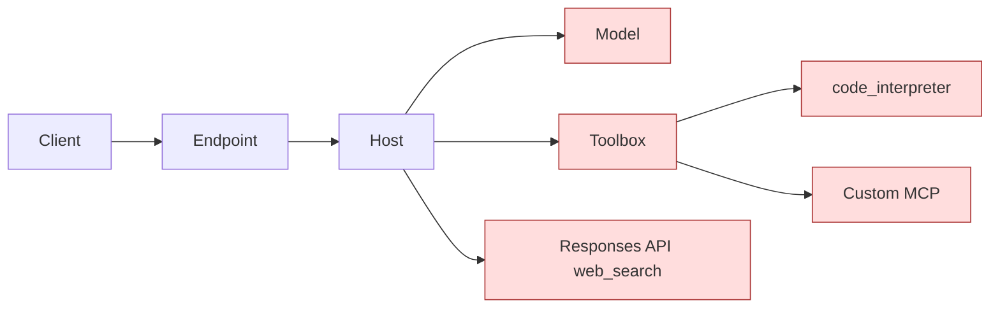

# Failure Modes

This document catalogs the failure modes of the hosted-agent-plus-toolbox architecture: what fails, how to detect it, how to isolate it, and how to recover. The goal is to make every layer's failure observable and bounded.

If you only remember one rule:

> **Treat the agent like a microservice with three remote dependencies (model, toolbox MCP, Responses API web search). Every dependency needs an independent timeout, an independent fallback, and an independent error class.**

Sources:

- Hosted Agents concept: https://learn.microsoft.com/en-us/azure/foundry/agents/concepts/hosted-agents
- Toolbox how-to (troubleshooting table): https://learn.microsoft.com/en-us/azure/foundry/agents/how-to/tools/toolbox
- This repo's `docs/troubleshooting.md` for hands-on fixes.

## The Failure Surface

Five places can fail. The agent runtime is responsible for converting each failure into a clear caller response and a clear log entry.

## Layer 1: Caller → Endpoint

| Failure | Symptom | Detection | Fix |
| --- | --- | --- | --- |
| TLS / DNS | `connection refused`, `name resolution failed` | Caller-side error | Retry with backoff; check endpoint URL. |
| 401 / 403 | Caller cannot authenticate to the endpoint | HTTP status | Verify caller identity has appropriate access. |
| 404 on agent endpoint | Wrong agent name in URL | HTTP status | Confirm agent deployment name. |

Boundary: this is on the caller. The agent has no responsibility yet.

## Layer 2: Hosted Agent Container

| Failure | Symptom | Detection | Fix / Recovery |
| --- | --- | --- | --- |
| Cold-start timeout | First request after idle takes >5 s | App Insights `Inbound POST /responses` duration | Pre-warm with a heartbeat; tune the caller's timeout. |
| Container crash on start | All requests return 5xx | App Insights container logs | Check env vars, image, RBAC; rollback to previous version. |
| Image pull failure | Deployment fails to make container available | Hosted Agent deployment logs | Verify ACR pull permission for the project managed identity. |
| Sandbox storage exhaustion | Writes to `$HOME` or `/files` fail | Container logs `disk full` | Cap per-session writes; clean up at end of turn. |
| Idle deprovision then resume | First request after 15-min idle is slow | Session compute lifecycle | This is by design — sessions resume with state. Tune idle timeout in caller UX. |

Boundary: the hosted agent platform handles compute lifecycle. Your code handles graceful start, observability, and clean shutdown.

## Layer 3: Foundry Model Calls

| Failure | Symptom | Detection | Fix / Recovery |
| --- | --- | --- | --- |
| 429 rate limit | Burst traffic | HTTP status | Exponential backoff; consider PTU or higher quota. |
| 500 / 503 from model | Transient region issue | HTTP status | Retry with jitter; circuit-break after N failures. |
| Token cap exceeded | Long prompts + large outputs | HTTP error | Truncate context; switch to a model with larger context window. |
| Wrong deployment | Caller request fails with `DeploymentNotFound` | HTTP error | Verify `AZURE_AI_MODEL_DEPLOYMENT_NAME` env var matches a real deployment. |
| Hallucinated tool name | Model emits a `function_call` with a tool the toolbox does not expose | Agent runtime | Reject; ask model to retry; log for prompt tuning. |

Recovery pattern: every model call wrapped with timeout (e.g., 30 s for planning, 60 s for final). On failure, return a structured error to the caller with `error.code = MODEL_UNAVAILABLE` rather than a leaked stack trace.

## Layer 4: Toolbox MCP

The Toolbox docs include a comprehensive troubleshooting table. The most operationally important entries:

| Symptom | Root cause | Fix |
| --- | --- | --- |
| `tools/list` returns 0 tools | Toolbox version not yet provisioned, or MCP/A2A connection invalid | Wait 10 s and retry; verify `project_connection_id` exists. |
| `tools/list` returns fewer tools than expected | `allowed_tools` filter contains misspelled names | Names are case-sensitive; recompute the filter. |
| `400 invalid_payload: Multiple tools without identifiers` | Two unnamed tools of the same type in one toolbox | Add unique `name` to each. |
| `-32006 CONSENT_REQUIRED` | OAuth-backed MCP needs user consent | Open the URL in browser; complete OAuth; retry. |
| `401` on MCP calls | Expired token or wrong scope | Refresh token for `https://ai.azure.com/.default`. |
| `500` on `prompts/list` | Foundry MCP doesn't implement prompts | Set `load_prompts=False`. |
| `500` on `send_ping` | Foundry MCP doesn't implement ping | Skip ping; or override to no-op. |
| `500` on non-streaming `tools/call` | Streaming required | Use `stream=True`. |
| Tool name not matching | MCP tool names are prefixed with `server_label` | Use `{server_label}.{tool_name}` (or `{server_label}_{tool_name}` in Copilot SDK). |
| Env var overwritten | Platform reserves `FOUNDRY_` prefix | Rename to a non-`FOUNDRY_` name (this repo uses `TOOLBOX_MCP_ENDPOINT`). |

Recovery patterns:

- **Tool list cached.** Cache `tools/list` results on agent startup; refresh on a schedule or on `tools/call` 404. This bounds the cost of toolbox transient failures.
- **Per-tool timeout.** Wrap every `tools/call` with a timeout (e.g., 60 s for `code_interpreter`, 30 s for fast tools). Cancel the model turn on tool timeout and inform the caller.
- **Per-tool circuit breaker.** If one tool fails N times in a window, mark it `unhealthy` for the next M minutes; the model planner should not see unhealthy tools.

## Layer 5: Responses API Web Search

| Failure | Symptom | Fix |
| --- | --- | --- |
| Bing grounding rate limit | 429 from `/openai/v1/responses` | Retry with backoff; consider caching repeat queries. |
| Region not supporting web_search | 404 / not found | Pin agent and search to a region listed as supporting web search in the docs. |
| Citation parsing error | `output_text` valid but no annotations | Treat as warning; return text without citations. |

Recovery pattern: this path is a fallback for current public web facts. Failure should not crash the agent; degrade gracefully to "I could not search the web for this; here is what I know from the model's training data" with an explicit caveat.

## Layer 6: Custom MCP Servers (When Added)

When you add custom MCP servers via the toolbox:

| Failure | Symptom | Fix |
| --- | --- | --- |
| Custom MCP server is down | Toolbox `tools/list` returns 0 for that server's tools | Verify the upstream MCP server health; check `project_connection_id`. |
| Custom MCP slow | `tools/call` exceeds expected latency | Per-tool timeout; consider direct MCP connection only for the slow tool. |
| OAuth refresh fails | Repeated `-32006` after first consent | Re-do consent flow; check token cache settings on the upstream server. |

## Failure Containment Patterns

| Pattern | When to use |
| --- | --- |
| Timeout per dependency | Always. Different timeouts for model vs tool. |
| Circuit breaker per tool | When a tool has a history of transient failures. |
| Independent fallback per dependency | When the user-visible feature must survive one dependency outage (e.g., direct web search instead of toolbox web search). |
| Retry with exponential backoff and jitter | Always for 429/5xx; never for 4xx other than 408/429. |
| Bulkhead (separate session pool per tenant) | Multi-tenant scenarios. |
| Graceful degradation message | Whenever a tool returns an error mid-conversation; do not surface the raw exception to the caller. |

## Observability Hooks

The Hosted Agents runtime auto-injects an Application Insights connection string. The Agent Framework emits OpenTelemetry traces. Use them:

| Event | Look for |
| --- | --- |
| Slow planning calls | `Duration` on `Foundry model call` operations. |
| Tool failures | Custom event `tool_call_failed` with `tool_name`, `error_code`. |
| Cold starts | `Inbound POST /responses` durations exceeding warm baseline by >1 s. |
| Approval bypass | Audit log of `tools/call` for `require_approval=always` tools that did not surface a confirmation event. |

Add `enable_instrumentation(enable_sensitive_data=True)` only in development; redact tool arguments in production.

## What This Document Is Not

- Not a load test plan. Real failure scenarios should be exercised under load with chaos injection.
- Not a security audit. See `docs/security.md` (when added) for threat-model-level analysis.
- Not a guarantee. Preview platforms can introduce new failure modes; treat this list as a living document.
