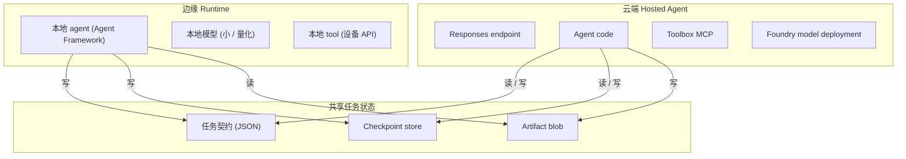
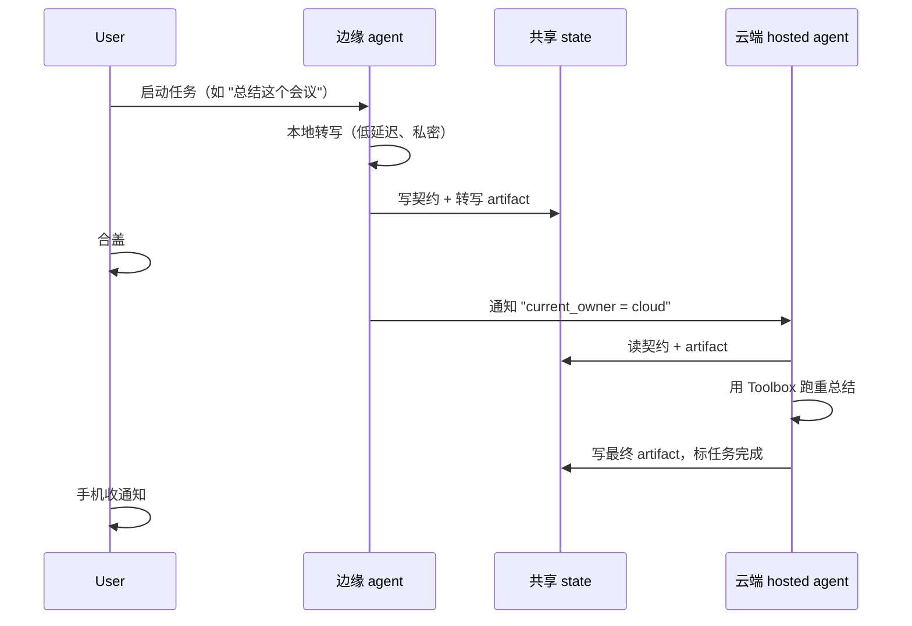

# 端云协同 Agent 模式（Hybrid Edge-Cloud）

本文描述 hosted agent + toolbox 架构如何与设备侧 agent runtime 组合成端云混合系统。Customer-neutral；把"device"替换成你场景里的本地 runtime（AI native PC / set-top box / gaming console / 车载计算）。

如果只记一句话：

> **云端 hosted agent 和设备侧 agent 是两个对等节点，背后是共享的任务契约**。State checkpoint 是 transport，不是 RPC。任意一侧都能 resume 另一侧开始的任务，只要契约保持。

参考来源：

- Hosted Agents concept（session、`$HOME`、`/files`）: https://learn.microsoft.com/en-us/azure/foundry/agents/concepts/hosted-agents
- Toolbox how-to: https://learn.microsoft.com/en-us/azure/foundry/agents/how-to/tools/toolbox
- Microsoft Agent Framework（本地和 hosted 都能跑）: https://github.com/microsoft/agent-framework
- Foundry Local（本地模型 runtime）: https://learn.microsoft.com/en-us/azure/ai-foundry/foundry-local/

## 1. 为什么要混合

纯云和纯边都留下了价值：

| 方案 | 优势 | 代价 |
| --- | --- | --- |
| 纯云 agent | 大模型、受管 tool、完整可观测 | 网络往返、数据驻留、离线 = 死 |
| 纯边 agent | 最低延迟、可离线、数据不出设备 | 模型尺寸受限、无共享 tool、无跨设备状态 |
| **端云混合** | 每个任务路由到合适那侧；设备睡觉时状态不丢 | 需要显式任务契约 + orchestrator |

混合方案适合：

- 用户任务可以拆成"快、私密、本地"和"重、受管、云端"两类步骤。
- 设备可能任务中途离线，用户期望续接。
- 任务跨多个设备（手机 + 笔记本 + 盒子）共享同一 session。

## 2. 三个构件



三块：

| 块 | 责任 |
| --- | --- |
| **本地 agent runtime** | Own 设备 API、低延迟 UX、离线运行。和 hosted agent 同一份 Microsoft Agent Framework 代码。 |
| **云端 hosted agent** | Own 受管 tool（Toolbox MCP）、大模型、公网 grounding、跨设备状态。 |
| **共享 state** | 一个小的 JSON 任务契约 + checkpoint store + artifact blob。集成点是 state，不是代码。 |

## 3. 任务契约

任务契约是描述一个用户逻辑任务（横跨端云）的小 JSON。最小字段：

```json
{
  "task_id": "uuid",
  "user_id": "anonymized id",
  "current_owner": "edge | cloud",
  "intent": "free-text user goal",
  "plan": [
    {"step_id": 1, "owner": "edge", "tool": "local.transcribe", "status": "done", "result_ref": "artifact://abc"},
    {"step_id": 2, "owner": "cloud", "tool": "toolbox.azure_ai_search", "status": "in_progress"},
    {"step_id": 3, "owner": "cloud", "tool": "model.summarize", "status": "pending"}
  ],
  "checkpoint": {
    "version": 7,
    "last_updated_by": "edge",
    "last_updated_at": "2026-05-09T08:30:00Z",
    "state_blob_ref": "checkpoint://xyz"
  },
  "artifacts": [
    {"id": "abc", "kind": "audio_transcript", "size_bytes": 12345, "uri": "artifact://abc"}
  ]
}
```

两个性质重要：

- **`current_owner` 任意时刻单值**。只有一侧跑 step；另一侧只读。避免 split-brain。
- **`checkpoint.version` 单调递增**。任意一侧拒绝带 stale version 的 update（乐观并发）。

## 4. 三种 Hand-off 模式

### 模式 A：边开始，交给云

用户在设备上开始一个任务。本地 agent 做便宜、私密的部分（如音频转写、照片 OCR）。用户合上盖子；本地 agent 把契约 + artifact 提交到共享 state 并通知云端 hosted agent 接管。



适用：长任务、批处理、用户移动。

### 模式 B：云开始，交给边

用户的任务需要云端大模型先规划，结果再驱动本地 action（如把生成的配置应用到设备设置）。云写 plan + 参数；边接，执行设备步骤。

适用：云规划 + 设备执行；需要外部知识然后本地动作。

### 模式 C：并发 fan-out

Orchestrator 把 plan 拆成并行 step，部分边、部分云同时跑，然后云端一个 join step 合结果。`current_owner` per step 轮转；契约让依赖图显式。

适用：异构 workload（如设备转写 + 云搜索 + 云总结）。

## 5. State 传输选项

共享 state 要三样：契约 store、checkpoint store、artifact blob。具体选项：

| 组件 | 轻量 | 生产 |
| --- | --- | --- |
| 契约 store | Foundry session `/files` 单 JSON | Cosmos DB document + 乐观并发 |
| Checkpoint store | 同 `/files` 目录 + 版本化文件名 | Append-only log table（Cosmos / Postgres） |
| Artifact blob | Foundry session `/files`（< 10 MB）；Azure Blob（大文件） | Azure Blob + SAS URL + 版本化 |
| 通知 | 轮询 | Azure Web PubSub / SignalR / Event Grid |

Hosted Agents docs 保证 `$HOME` 和 `/files` per session 且跨 idle 持久化。轻量列免费拿到。

## 6. 失败案例

混合系统大多数在这里崩。提前规划：

| 失败 | 现象 | 缓解 |
| --- | --- | --- |
| 边在 step 中途掉线 | 云看不到 checkpoint 更新 | 云等 N 分钟后超时回收 `current_owner`。 |
| 云 agent 中途崩 | 边看到 stale `in_progress` | `current_owner` 带 TTL lease；TTL 过期重抢。 |
| 两侧并发更新 | Checkpoint version 冲突 | 乐观并发：高 version 胜；输的一方重拉重试。 |
| Artifact 上传失败 | Step 标 done 但 artifact 缺失 | 两阶段 commit：先写 artifact 再标 done。 |
| 设备时钟漂移 | 错的 `last_updated_at` | 用 server 单调 version，不用墙钟。 |
| 敏感数据流到云 | 隐私违规 | Artifact 打 `policy: edge_only` tag；云拒读。 |

## 7. Toolbox 在哪里

混合系统中，Foundry Toolbox **完全在云侧**。边缘 agent **不** 直接调 toolbox MCP endpoint —— 这会破坏离线保证，且要求设备持有云端 credential。

而是云端 hosted agent 在 toolbox 前面。边 agent 需要云 tool 时，往契约里写一个 step 带 `owner: cloud, tool: toolbox.<tool_name>`。云侧拾取。

保留三个性质：

- Toolbox 的 per-tool `require_approval` 在云侧得到尊重，agent identity 有正确 scope。
- 边永远不带 Foundry credential。
- 边不需要知道 toolbox 的完整 tool catalog，只看云 agent 暴露回来的部分。

## 8. 反向问题：什么时候不混合

混合是 overhead。跳过它当：

- 任务总在秒级完成、用户从不跨设备。
- 隐私不是硬约束、网络可靠 → 纯云更简单。
- 设备不能跑任何模型 → 强制纯云。
- 设备必须永远离线 → 强制纯边。

## 9. 映射到本 Repo

本 repo 演示混合模式的**云侧**。要原型化边侧：

1. 在本地 Linux 设备跑第二个 Microsoft Agent Framework agent（同一个 `agent-framework` 包）。
2. 通过薄 chat-client adapter 接小本地模型（Foundry Local、llama.cpp、ONNX Runtime 等）。
3. 用本地 SQLite 或 JSON 文件作契约 store；在线时同步到 Cosmos / Foundry session `/files`。
4. 需要重 step 时，往本 repo 的 hosted agent endpoint POST 契约更新带 `owner: cloud`。

云侧已经暴露了正确的形态：稳定 Responses endpoint、per-agent identity、版本化 tool catalog、持久化 `$HOME`/`/files` 的 session。边侧只需 honor 契约。

## 10. 这份文档不是什么

- 不是边侧 runtime sample。边代码在 repo 之外。
- 不是安全 review。把 artifact 标 `edge_only` 是惯例；用你的 stack 里的 policy 强制。
- 不是 vendor-specific。同样的模式在非 Microsoft 云或非 Microsoft 边 runtime 上都能跑，只要契约形态保持。
