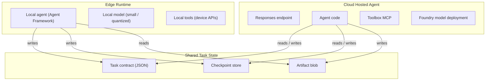
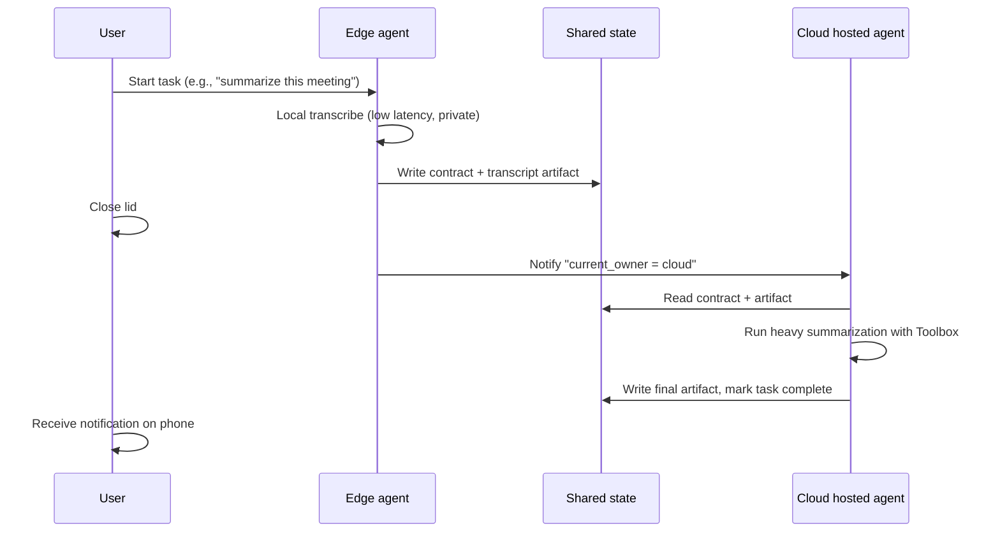

# Hybrid Edge-Cloud Agent Patterns

This document describes how the hosted agent + toolbox architecture composes with on-device agent runtimes to form a hybrid edge-cloud system. It is customer-neutral; replace "device" with whatever local runtime applies to your scenario (AI native PC, set-top box, gaming console, in-vehicle compute).

If you only remember one sentence:

> **The cloud-side hosted agent and the on-device agent are two peers behind a shared task contract**. State checkpoints, not RPC calls, are the transport. Either side can resume a task the other started, as long as the contract is honored.

Sources:

- Hosted Agents concept (sessions, `$HOME`, `/files`): https://learn.microsoft.com/en-us/azure/foundry/agents/concepts/hosted-agents
- Toolbox how-to: https://learn.microsoft.com/en-us/azure/foundry/agents/how-to/tools/toolbox
- Microsoft Agent Framework (runs locally and as a hosted agent): https://github.com/microsoft/agent-framework
- Foundry Local (local model runtime): https://learn.microsoft.com/en-us/azure/ai-foundry/foundry-local/

## 1. Why Hybrid

Pure cloud and pure edge each leave value on the table:

| Approach | Strength | Cost |
| --- | --- | --- |
| Pure cloud agent | Big models, governed tools, full observability | Network round-trip, data residency, offline = dead |
| Pure edge agent | Lowest latency, works offline, data never leaves device | Limited model size, no shared tools, no cross-device state |
| **Hybrid edge-cloud** | Right-size each task to the right side; state survives device sleep | Requires an explicit task contract and orchestrator |

The hybrid case wins when:

- The user's task can be decomposed into "fast, private, local" steps and "heavy, governed, cloud" steps.
- The device may go offline mid-task and the user expects continuity.
- The task involves multiple devices (phone + laptop + set-top box) sharing one session.

## 2. The Three Building Blocks



Three pieces:

| Piece | Responsibility |
| --- | --- |
| **Local agent runtime** | Owns device APIs, low-latency UX, offline operation. Same Microsoft Agent Framework code that runs in the hosted agent. |
| **Cloud hosted agent** | Owns governed tools (Toolbox MCP), large models, public web grounding, cross-device state. |
| **Shared state** | A small JSON task contract + a checkpoint store + an artifact blob. The state, not the code, is the integration point. |

## 3. The Task Contract

A task contract is a small JSON document that describes one logical user task across both sides. Minimum fields:

```json
{
  "task_id": "uuid",
  "user_id": "anonymized id",
  "current_owner": "edge | cloud",
  "intent": "free-text user goal",
  "plan": [
    {"step_id": 1, "owner": "edge", "tool": "local.transcribe", "status": "done", "result_ref": "artifact://abc"},
    {"step_id": 2, "owner": "cloud", "tool": "toolbox.azure_ai_search", "status": "in_progress"},
    {"step_id": 3, "owner": "cloud", "tool": "model.summarize", "status": "pending"}
  ],
  "checkpoint": {
    "version": 7,
    "last_updated_by": "edge",
    "last_updated_at": "2026-05-09T08:30:00Z",
    "state_blob_ref": "checkpoint://xyz"
  },
  "artifacts": [
    {"id": "abc", "kind": "audio_transcript", "size_bytes": 12345, "uri": "artifact://abc"}
  ]
}
```

Two properties matter:

- **`current_owner` is single-valued at any moment**. Only one side runs steps at a time; the other side reads-only. This avoids split-brain.
- **`checkpoint.version` is monotonically increasing**. Either side rejects an update with a stale version (optimistic concurrency).

## 4. Three Hand-off Patterns

### Pattern A: Edge starts, hands off to cloud

The user starts a task on the device. Local agent does the cheap, private parts (e.g., audio transcription, photo OCR). The user closes the lid; the local agent commits the contract + artifacts to shared state and signals the cloud hosted agent to take over.



When this fits: long-running tasks, batch processing, user mobility.

### Pattern B: Cloud starts, hands off to edge

The user issues a task that needs the big cloud model first; the result then needs to drive a local action (e.g., apply a generated config to device settings). Cloud writes the plan + parameters; edge picks it up and executes the device-only step.

When this fits: cloud planning + device actuation; tasks that need external knowledge before local action.

### Pattern C: Concurrent fan-out

The orchestrator splits the plan into parallel steps where some run on edge and some on cloud at the same time, then a join step on the cloud side combines results. `current_owner` rotates per step; the contract makes the dependency graph explicit.

When this fits: heterogeneous workloads (e.g., voice transcription on device, web search on cloud, then summarize on cloud).

## 5. State Transport Options

The shared state needs three things: a contract store, a checkpoint store, and an artifact blob. Concrete options:

| Component | Lightweight | Production |
| --- | --- | --- |
| Contract store | Single JSON in Foundry session `/files` | Cosmos DB document with optimistic concurrency |
| Checkpoint store | Same `/files` directory with versioned filenames | Append-only log table (Cosmos / Postgres) |
| Artifact blob | Foundry session `/files` for small (<10 MB); Azure Blob for big | Azure Blob with SAS URLs, versioned |
| Notification | Polling | Azure Web PubSub / SignalR / Event Grid |

The Hosted Agents docs guarantee `$HOME` and `/files` per session and persist them across idle. That gets you the lightweight column for free.

## 6. Failure Cases

This is where most hybrid systems break. Plan for them:

| Failure | Symptom | Mitigation |
| --- | --- | --- |
| Edge goes offline mid-step | Cloud sees no checkpoint update | Cloud waits N minutes, then reclaims `current_owner` after timeout. |
| Cloud agent crashes mid-step | Edge sees stale `in_progress` | Lease on `current_owner` with TTL; re-acquire on TTL expiry. |
| Both sides update concurrently | Checkpoint version conflict | Optimistic concurrency: highest version wins; loser refetches and retries. |
| Artifact upload fails | Step marked done but artifact missing | Two-phase commit: write artifact first, then mark step done. |
| Device clock skew | Wrong `last_updated_at` | Use server-monotonic version, not wall clock. |
| Sensitive data leaks to cloud | Privacy violation | Tag artifacts with `policy: edge_only`; cloud refuses to read. |

## 7. Where the Toolbox Sits

In a hybrid system, the Foundry Toolbox stays **purely cloud-side**. The edge agent does **not** call the toolbox MCP endpoint directly — that would defeat the offline guarantee and require the device to hold cloud credentials.

Instead, the cloud hosted agent fronts the toolbox. When the edge agent needs a cloud tool, it writes a step into the contract with `owner: cloud, tool: toolbox.<tool_name>`. The cloud side picks it up.

This keeps three properties:

- The toolbox's per-tool `require_approval` flag is honored on the cloud side, where the agent identity has the right scope.
- The edge never carries Foundry credentials.
- The edge never has to know the toolbox's tool catalog beyond what the cloud agent exposes back.

## 8. The Reverse Question: When Not to Go Hybrid

Hybrid is overhead. Skip it when:

- The task always completes in seconds and the user never moves between devices.
- Privacy is not a hard constraint and the network is reliable — pure cloud is simpler.
- The device cannot run any model — pure cloud is forced.
- The device must run fully offline forever — pure edge is forced.

## 9. Mapping to This Repo

This repo demonstrates the **cloud side** of the hybrid pattern. To prototype the edge side:

1. Run a second Microsoft Agent Framework agent on a local Linux device (same `agent-framework` package).
2. Wire it to a small local model (Foundry Local, llama.cpp, ONNX Runtime, etc.) via a thin chat-client adapter.
3. Use a local SQLite or JSON file as the contract store; sync to Cosmos / Foundry session `/files` when online.
4. When you need a heavy step, POST a contract update to this repo's hosted agent endpoint with `owner: cloud`.

The hosted agent side already exposes the right shape: a stable Responses endpoint, a per-agent identity, a versioned tool catalog, and a session that persists `$HOME`/`/files`. The edge side just needs to honor the contract.

## 10. What This Document Is Not

- Not a runtime sample for the edge side. The edge code lives outside this repo.
- Not a security review. Tagging artifacts as `edge_only` is a convention; enforce it with policy in your stack.
- Not vendor-specific. The same pattern works with non-Microsoft cloud or non-Microsoft edge runtime as long as the contract shape is honored.
