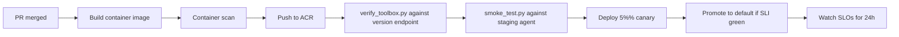

# 生产规模考虑

本文覆盖把这个 demo 从单 region 单租户 PoC 推到多 region 多租户生产时会变什么。不是详尽的运维指南，而是一份必须显式回答的决策 checklist。

参考来源：

- Hosted Agents concept（limits / sessions / regions / network）: https://learn.microsoft.com/en-us/azure/foundry/agents/concepts/hosted-agents
- Toolbox how-to（regions / network isolation）: https://learn.microsoft.com/en-us/azure/foundry/agents/how-to/tools/toolbox
- Foundry agent virtual networks: https://learn.microsoft.com/en-us/azure/foundry/agents/how-to/virtual-networks
- Agent identity concepts: https://learn.microsoft.com/en-us/azure/foundry/agents/concepts/agent-identity

## 1. 容量与 Quota

| 项 | Preview 限制（确认当前） | 生产规划 |
| --- | --- | --- |
| 并发 active session | 50 per subscription per region（preview）；可申请 quota | 需要更多就跨 region 分布；caller 路由要相应设计。 |
| Session lifetime | 最长 30 天；idle timeout 15 分钟 | 长生命 assistant 场景受益；突发 batch 场景付冷启动。 |
| Sandbox 大小 | 0.25 vCPU / 0.5 GiB 到 2 vCPU / 4 GiB | 按 agent right-size；过大不带来延迟收益但放大成本。 |
| Toolbox versions | 不可变快照；上限按计划而异 | 回收旧 version；保留 `default_version` + 2-3 个 staged version。 |

实际数字以 Hosted Agents docs 为准；preview 数字会变。

## 2. 冷启动、Warm Session、预热

Hosted Agents docs 描述了 session 模型：per-session VM-isolated sandbox、idle 15 分钟回收、resume 时持久化 `$HOME` 和 `/files`。含义：

- **稳态 warm 路径**：0 ms 冷启动成本。
- **Idle 后首次调用**：冷启动成本（典型秒级）。
- **Per-tenant 隔离**：每个 tenant 应映射到一个 session ID，状态不串。

生产预热模式：

- **基于 user 信号预热**：UI 知道 user 打开 app 就发 no-op planning 请求暖 session。
- **Heartbeat scheduler**：高优先级 tenant，每 14 分钟发合成请求。
- **Sticky 路由**：caller 尽可能把同一 tenant 流量路由到同一 session。

## 3. 多 Region

| 关注点 | 选择 |
| --- | --- |
| Foundry project region | 选支持所有所需 tool type 的 region（Toolbox docs region 矩阵）。 |
| Hosted Agents region 可用性 | 当前 18 个 region（East US 2、North Central US、Sweden Central、Canada Central 等）；确认当前列表。 |
| Tool type by region | Web Search、Code Interpreter、AI Search、File Search 按 region 不同。 |
| Caller 路由 | Caller 路由到最近 region 的 agent endpoint；每 region 一个 Foundry project。 |
| 故障转移 | Caller 侧 active-active 跨 region，或 active-passive 显式切换。 |

常见拓扑：每 region 一个 Foundry project，每 project 一个 Toolbox（定义复制），DNS geo-routing 在 agent endpoint 前面。

## 4. 网络隔离

Toolbox docs 公布了网络隔离矩阵：

| Tool type | 网络隔离支持 | 流量路径 |
| --- | --- | --- |
| MCP（custom） | 是 | 经你的 VNet subnet |
| Azure AI Search | 是 | 经 private endpoint |
| Code Interpreter | 是 | Microsoft backbone |
| Web Search（Bing grounding） | 是 | 公开 endpoint（Bing 是 First-Party Consumption Service） |
| OpenAPI | 是 | 取决于目标 API |
| A2A | 是 | 经 private endpoint |
| File Search | 不支持（preview） | N/A |

生产模式：

- **Private link Foundry project**：让 agent 控制面网络隔离。
- **VNet-injected agent**：hosted agent 出向流量走你的 VNet，可以到私有数据库和内部 API。
- **ACR 当前仍是公开**（Hosted Agents docs）；规划时考虑。

如果数据驻留或客户合规姿态禁止任何公开跳，按上面矩阵审计每个 tool type 再承诺。

## 5. Identity 与 RBAC

两个 identity 重要：

| Identity | 来源 | 用于 |
| --- | --- | --- |
| Agent 的 Microsoft Entra ID | 部署时自动 per agent 签发 | Runtime 调 model、tool、project connection、下游 Azure 服务。 |
| Project managed identity | Per Foundry project system-assigned | 平台基础设施（如 ACR repo reader）。 |

规则：

- 给 agent identity 在 Foundry project 上授 `Azure AI User`（`azd deploy` 自动做）。
- 外部资源（Storage、Cosmos、KeyVault）手工给 agent identity 授 RBAC，最小权限。
- M365 Teams 的 OBO（on-behalf-of）流程：agent identity 交换 user token；tenant policy 适用。
- 永远不在环境变量里存 agent secret。用 Foundry connection、managed identity、Key Vault。

## 6. 多租户隔离

模式 A：**每租户一个 agent** —— 隔离最强，成本最高。每租户独立 agent identity、审计 trail、RBAC。

模式 B：**一个 agent，每租户一个 session** —— Session 由平台隔离（`$HOME`、`/files` per session）。Agent 代码必须在所有出向调用上带 tenant context。

模式 C：**一个 agent，每租户一个 conversation，session pool 共享** —— 跨租户共享 session（不要做 —— 状态泄露）。

建议：从模式 B 起步以节约成本；只有合规承诺要求时才迁到模式 A。

## 7. Toolbox 版本策略

Promote `default_version` 会原子地切换所有消费者的行为。生产模式：

| 阶段 | 你做什么 |
| --- | --- |
| Develop | 创建新 toolbox version。 |
| Test | 用 `verify_toolbox.py` 和 smoke test 命中 version-specific MCP endpoint。 |
| Canary | 部分流量经过显式 pin 新 version endpoint 的 agent。 |
| Promote | Update `default_version`。 |
| Roll back | 把 `default_version` 改回旧 id。 |
| Garbage collect | 30 天后删未用 version。 |

两个坑：

- **Schema drift**：删了 tool 的新 version 会静默改 agent 行为。每次 promote 后跑自动化测试对 consumer endpoint。
- **Approval gating drift**：`require_approval` 从 `never` 改成 `always` 会弹出之前 user 没见过的 approval 对话框。Release notes 里说清楚。

## 8. 部署管道

最低生产管道：

用 `azd extension install azure.ai.agents` + `azd provision` + `azd deploy` 做平台集成；用你自己的 CI/CD 包起来。

## 9. 可观测性与 SLO

内置：OpenTelemetry trace 自动到链接的 Application Insights。建议 SLI 与起步 SLO：

| SLI | 目标 |
| --- | --- |
| `/responses` p95 latency, warm | code-only < 2 s, web search < 5 s |
| `/responses` p99 latency, warm | code-only < 5 s, web search < 10 s |
| `/responses` error rate | < 1% / 5 min |
| 冷启动频率 | 稳态 < 5% 请求 |
| Toolbox `tools/call` failure rate | per-tool < 0.5% / 1 hour |

这些是起点，按你的流量画像调整。

## 10. 成本

成本类别：

- **Hosted runtime**：active session 期间的 CPU/memory（idle 后回收）。Sandbox 越小越便宜。
- **Model inference**：per-token，由 prompt 和 completion 大小主导。优化 system prompt 长度和 tool schema 啰嗦度。
- **Bing grounding**：per-search 计费；考虑缓存。
- **AI Search / vector store**：per-query + per-storage 计费。
- **ACR 存储与出口**：container image 和 pull 流量。
- **App Insights**：按 ingestion 计费；trace 大就 sampling。

常见优化：

- 削 system prompt 和 tool schema（in 的每个 token 都进每次 model call）。
- 平台 Responses runtime 已管 history 时设 `default_options={"store": False}`（本 repo `main.py`）。
- 启用响应流式，用户感知延迟降低，不付额外 call 成本。

## 10A. 合规与模型可用性

生产 agent rollout 还会撞上一面少被讨论的墙：**哪个模型可用取决于 region、合约实体、vendor 策略** —— 不只是 Foundry catalog。提前显式规划。

### 三个独立闸门

| 闸门 | 由什么决定 | 示例失败模式 |
| --- | --- | --- |
| Region | Foundry project 所在 + Hosted Agents 区域可用性 | Agent 在 East US 2 能跑，在你目标 APAC region 报错，该 region 还未增加支持。 |
| 合约实体 | 哪个法实体签的 Azure 合同 | 某 GA 模型在某国家采购合同下不可用。 |
| Vendor 策略 | 个别模型的 vendor 限制 | Catalog 里某个三方模型被 vendor 自己的 terms 限在某些国家不可用。 |

### 缓解

- **每个市场钉一个主 region**，加至少一个支持同一模型 deployment + tool type 的 fallback region。部署时与季度验证。
- **代码里维护模型 fallback 链**，不只是配置。主模型不可用时，agent 降级到第二模型带 documented quality delta。让这条链对 ops 可见，不要静默。
- **每个 Foundry connection 打合约实体 tag**。起新 project 时写一行记录：“这个 project 在合约 X 下，由实体 Y 签，region Z。”未来的你（或接你班的人）会感谢 —— 某模型被拉下架时能快速定位。
- **把模型选型当作版本化决策**。记录哪个模型处理哪个任务、决策日期、fallback。Vendor terms 变动时，你有单一表可审。
- **在检查客户合约下可用性之前，不要在客户承诺里承诺某个 vendor 模型**。Foundry catalog 在你开发订阅中显示该模型不代表客户可调。

### 任何生产切换前要回答的具体问题

| 问题 | 责人 | 权威源 |
| --- | --- | --- |
| 该客户合约启用了哪些 Foundry region？ | 账号团队 / 采购 | Azure 订阅 metadata |
| 那些 region 今天哪些模型 GA？ | 工程 | Foundry 模型 catalog per region |
| 这些模型中哪些被 vendor terms 在此国家封禁？ | 法务 | Vendor terms of use |
| Hosted Agents preview 在那些 region 有吗？ | 工程 | Hosted Agents docs region 矩阵 |
| 网络隔离要求与所选 tool type 兼容吗？ | 安全 | Toolbox docs 网络隔离矩阵 |
| 每个主选择都有 documented fallback 模型 + region 配对吗？ | 工程 | 本 repo `docs/failure-modes-CN.md` Layer 3 |

任何客户 demo 前回答这些，避免“模型在 catalog 里但我调不了”的尴尬时刻。

## 11. 安全姿态 Checklist

| 检查 | 原因 |
| --- | --- |
| Container image / 环境变量 / manifest 里无 secret | 用 Foundry connection + managed identity。 |
| RBAC 最小权限 | 限制爆炸半径。 |
| 所有 `require_approval` 标记审计过 | 确保每个写 tool 都需要 approval。 |
| Application Insights 不记敏感 tool 参数 | 生产关掉 `enable_sensitive_data`。 |
| 私有数据启用网络隔离 | 按矩阵 private link + VNet injection。 |
| ACR pull 限制到 project managed identity | 禁匿名 pull。 |
| Per-tool circuit breaker | 限制行为异常 tool 的影响。 |
| 公开 endpoint 加固（rate limit、WAF） | Endpoint 面向 Internet。 |

## 12. 这份文档不是什么

- 不是 SRE runbook。基于此写自己的事件响应 playbook。
- 不是成本模型。给客户报价前用真实流量打你订阅的计费表。
- 不替代你安全团队的 review。

如果上线，把每个章节当 checklist，给你的环境写出明确答案。
